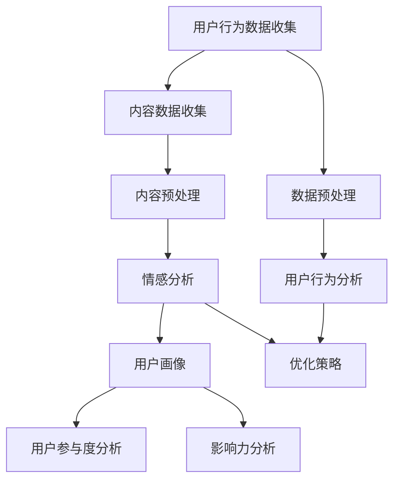

                 

### 背景介绍

注意力经济（Attention Economy）是21世纪初由经济学家和科技专家提出的一个新兴概念，旨在解释互联网时代信息过载背景下，人们如何分配注意力资源。随着社交媒体的迅猛发展，注意力经济成为了研究热点。在这一背景下，社交媒体分析应运而生，旨在通过对用户行为和内容的分析，揭示受众参与度和影响力的内在规律。

社交媒体分析的核心任务是理解用户在社交媒体平台上的互动方式，挖掘用户兴趣、情感和偏好，从而为企业、品牌和个人提供数据驱动的决策支持。近年来，随着大数据和人工智能技术的发展，社交媒体分析工具和算法不断演进，为数据科学家和业务人员提供了更加精细和高效的解决方案。

本文将围绕注意力经济和社交媒体分析展开，探讨其核心概念、算法原理、实践应用以及未来发展。首先，我们将回顾注意力经济的基本原理和社交媒体分析的发展历程。接着，详细讲解社交媒体分析的核心算法和技术，包括用户行为分析、内容分析和情感分析等。随后，我们将通过一个实际案例，展示如何利用这些算法进行数据分析，并解读运行结果。最后，我们将探讨社交媒体分析在现实中的应用场景，推荐相关工具和资源，并总结未来发展趋势与挑战。

### 核心概念与联系

要深入理解注意力经济与社交媒体分析，我们需要明确以下几个核心概念，并展示它们之间的内在联系。

#### 1. 注意力经济

注意力经济的基本理念是，在信息过载的互联网时代，用户的注意力成为一种稀缺资源。与传统经济中的物质资源不同，用户的注意力是有限的，因此如何获取和保持用户的注意力成为企业、品牌和个人竞争的关键。注意力经济的关键概念包括：

- **注意力资源**：用户在特定时间和环境下所能分配的注意力总量。
- **注意力分配**：用户在不同信息和内容之间的注意力分配策略。
- **注意力转移**：用户将注意力从一个信息源转移到另一个信息源的过程。

#### 2. 社交媒体分析

社交媒体分析是一种通过技术和算法分析用户在社交媒体平台上的行为和内容，以揭示用户兴趣、情感和偏好的一种方法。其主要任务包括：

- **用户行为分析**：通过跟踪用户的点击、评论、分享等行为，分析用户的互动模式和兴趣点。
- **内容分析**：通过自然语言处理技术，对用户发布的内容进行分析，提取主题、情感和关键词。
- **情感分析**：对用户发布的内容进行情感倾向分析，判断用户情感状态。

#### 3. 内在联系

注意力经济和社交媒体分析之间有着密切的联系。具体来说：

- **注意力获取**：社交媒体分析通过分析用户行为和内容，帮助企业识别和获取具有高价值的用户注意力。
- **用户参与度**：社交媒体分析能够帮助企业了解用户的参与度，从而优化内容和策略，提高用户粘性。
- **影响力分析**：社交媒体分析可以帮助企业识别具有高影响力的用户和意见领袖，利用他们的传播力扩大品牌影响力。

#### 4. 社交媒体分析的技术架构

为了更好地理解社交媒体分析的过程，我们可以使用Mermaid流程图展示其技术架构。以下是一个简化版本的Mermaid流程图：



在这个流程图中，用户行为数据收集和内容数据收集是社交媒体分析的起点。数据预处理是对原始数据进行清洗和格式化，为后续分析做准备。用户行为分析和内容分析分别基于用户行为和内容的特征，提取有用的信息。情感分析对用户发布的内容进行情感倾向分析。通过这些分析，可以构建用户画像，进而进行用户参与度和影响力的分析。最后，基于分析结果，优化内容和策略。

#### 5. 社交媒体分析的意义

社交媒体分析不仅对企业具有重要意义，对个人用户也大有裨益：

- **对企业**：通过社交媒体分析，企业可以更好地了解用户需求和行为模式，优化产品和服务，提高市场竞争力。
- **对个人**：个人用户可以通过社交媒体分析了解自己的兴趣和偏好，从而更好地管理自己的在线生活和社交网络。

### 核心算法原理 & 具体操作步骤

在理解了注意力经济和社交媒体分析的核心概念及其联系后，我们将深入探讨社交媒体分析中常用的核心算法原理及其具体操作步骤。这些算法包括用户行为分析、内容分析和情感分析等，它们共同构成了社交媒体分析的技术基础。

#### 1. 用户行为分析

用户行为分析是社交媒体分析的重要环节，旨在理解用户在社交媒体平台上的行为模式，包括点击、评论、分享等。以下是用户行为分析的基本原理和具体操作步骤：

**原理**：

用户行为分析基于用户在社交媒体上的行为数据，通过统计和分析这些行为数据，提取出用户的行为特征。这些特征可以帮助我们了解用户的兴趣、偏好和参与度。

**操作步骤**：

（1）数据收集：首先，收集用户在社交媒体平台上的行为数据，包括点击、评论、分享、点赞等。

（2）数据预处理：对收集到的行为数据进行清洗和格式化，确保数据的准确性和一致性。

（3）特征提取：根据用户行为数据，提取出反映用户兴趣和参与度的特征。例如，用户点击某类内容的频率、评论的长度和情感倾向等。

（4）模式识别：使用统计学方法和机器学习算法，对提取的特征进行分析，识别出用户的行为模式。

**示例**：

假设我们有一个社交媒体平台，用户A经常点击关于科技和财经的内容，而用户B则对娱乐和美食感兴趣。通过用户行为分析，我们可以识别出这两个用户的不同兴趣点，从而为企业提供有针对性的内容推荐。

#### 2. 内容分析

内容分析是社交媒体分析的另一个关键环节，通过分析用户发布的内容，提取出主题、情感和关键词等信息。以下是内容分析的基本原理和具体操作步骤：

**原理**：

内容分析利用自然语言处理（NLP）技术，对用户发布的内容进行文本分析，提取出文本的主题、情感和关键词等信息。这些信息可以帮助我们了解用户的兴趣、情感和偏好。

**操作步骤**：

（1）数据收集：收集用户在社交媒体平台上发布的内容，包括文字、图片、视频等。

（2）数据预处理：对内容数据进行清洗和格式化，去除噪声和无效信息。

（3）文本分析：使用NLP技术对文本进行分词、词性标注、句法分析等，提取出文本的语义信息。

（4）主题提取：使用主题模型（如LDA）等算法，从文本中提取出主题。

（5）情感分析：使用情感分析算法，对文本的情感倾向进行分析，判断文本是正面、负面还是中性。

（6）关键词提取：使用关键词提取算法，从文本中提取出重要的关键词。

**示例**：

假设用户在社交媒体上发布了一条关于旅行的帖子，文本中包含了“浪漫”、“美景”、“回忆”等关键词。通过内容分析，我们可以提取出这条帖子主要讨论的主题是“浪漫旅行”，并判断用户对旅行有积极情感。

#### 3. 情感分析

情感分析是社交媒体分析中的一项重要技术，通过对用户发布的内容进行情感倾向分析，可以帮助我们了解用户的情绪状态。以下是情感分析的基本原理和具体操作步骤：

**原理**：

情感分析基于文本的情感特征，使用机器学习算法和规则方法，对文本的情感倾向进行判断。情感分析通常分为正面情感、负面情感和中性情感三种。

**操作步骤**：

（1）数据收集：收集用户在社交媒体平台上发布的内容，作为情感分析的文本数据。

（2）数据预处理：对文本数据进行清洗和格式化，去除噪声和无效信息。

（3）特征提取：提取文本中的情感特征，如情感词汇、情感强度等。

（4）模型训练：使用已标记的情感数据集，训练情感分析模型。

（5）情感判断：对新的文本数据，使用训练好的模型进行情感判断。

**示例**：

假设用户在社交媒体上发布了一条关于新手机的评测，文本中包含了“失望”、“性能不佳”等负面词汇。通过情感分析，我们可以判断用户对这款手机的评价是负面的。

### 4. 综合应用

用户行为分析、内容分析和情感分析是社交媒体分析的核心技术，它们可以单独使用，也可以结合应用，提供更全面的数据分析结果。

**示例**：

假设我们想要分析一个社交媒体平台上的用户对某款新手机的兴趣和情感。首先，通过用户行为分析，我们可以识别出哪些用户对该手机有较高的关注度。然后，通过内容分析，我们可以提取出这些用户发布的相关内容，并分析主题和情感倾向。最后，结合情感分析，我们可以判断用户对新手机的总体情感倾向，为企业提供有针对性的营销策略。

### 数学模型和公式 & 详细讲解 & 举例说明

在社交媒体分析中，数学模型和公式发挥着重要作用，它们帮助我们更好地理解用户行为、内容特征和情感倾向。以下是几个常用的数学模型和公式的详细讲解及举例说明。

#### 1. 主题模型（LDA）

主题模型（Latent Dirichlet Allocation, LDA）是一种用于文本主题发现的概率模型。它假设每个文档是由多个主题的混合生成，每个主题又由多个单词的混合生成。LDA的核心目标是推断出文本中的潜在主题。

**数学模型**：

设 \( D \) 为文档集合，\( d \) 为文档，\( W_d \) 为文档 \( d \) 的单词序列，\( Z_d \) 为文档 \( d \) 的潜在主题分配，\( \theta_d \) 为文档 \( d \) 的主题分布，\( \phi_k \) 为主题 \( k \) 的单词分布。

LDA的目标是最小化以下对数似然损失函数：

$$
\mathcal{L}(\theta, \phi | Z) = \sum_d \sum_w \log P(w | \theta_d, \phi_k)
$$

**具体步骤**：

（1）初始化：随机初始化主题分配 \( Z_d \) 和主题分布 \( \theta_d \)。

（2）E步：根据当前的主题分配和主题分布，计算文档的主题分布 \( \theta_d \) 和主题的单词分布 \( \phi_k \)。

（3）M步：根据当前的主题分布和主题的单词分布，重新估计主题分配 \( Z_d \)。

（4）迭代：重复E步和M步，直到收敛。

**举例说明**：

假设我们有一个关于旅行的文档集合，包含以下文档：

- 文档1：海滩、阳光、度假
- 文档2：美食、餐厅、旅游

使用LDA模型，我们可以提取出两个主题：“旅行”和“美食”。其中，“旅行”主题主要由“海滩”、“阳光”、“度假”等单词组成，而“美食”主题主要由“餐厅”、“旅游”等单词组成。

#### 2. 情感分析模型（SVM）

支持向量机（Support Vector Machine, SVM）是一种常用的分类算法，可以用于情感分析。SVM的目标是找到一个最佳的超平面，将具有不同情感倾向的文本数据分类。

**数学模型**：

设 \( X \) 为文本特征向量，\( y \) 为情感标签（1表示正面情感，-1表示负面情感），SVM的目标是最小化以下损失函数：

$$
L(\theta) = \frac{1}{2} || \theta ||^2 + C \sum_{i} \max(0, 1 - y_i (\theta^T x_i))
$$

其中，\( \theta \) 为模型参数，\( C \) 为惩罚参数。

**具体步骤**：

（1）特征提取：将文本数据转换为特征向量。

（2）模型训练：使用训练数据集，训练SVM模型。

（3）模型评估：使用测试数据集，评估模型的分类准确率。

**举例说明**：

假设我们有一个包含正面和负面情感的文本数据集，使用SVM模型进行训练。训练完成后，我们可以使用模型对新的文本数据进行情感分类，判断其情感倾向。

#### 3. 随机森林（Random Forest）

随机森林（Random Forest）是一种集成学习方法，由多个决策树组成。随机森林在社交媒体分析中常用于用户行为预测和内容推荐。

**数学模型**：

随机森林由多个决策树组成，每个决策树基于随机特征子集训练。预测时，对每个决策树的预测结果进行投票，取多数结果作为最终预测结果。

**具体步骤**：

（1）特征选择：从所有特征中随机选择一部分特征。

（2）决策树训练：在每个决策树上，基于随机特征子集训练决策树。

（3）集成预测：对每个决策树的预测结果进行投票，取多数结果作为最终预测结果。

**举例说明**：

假设我们想要预测一个用户在社交媒体平台上是否会对某条内容进行点赞。我们可以使用随机森林模型，通过训练得到一个预测模型，然后对新内容进行预测，判断用户是否会点赞。

#### 4. 时间序列分析（ARIMA）

时间序列分析（Autoregressive Integrated Moving Average, ARIMA）是一种常用的统计模型，用于分析时间序列数据，可以用于社交媒体用户行为的趋势预测。

**数学模型**：

ARIMA模型由三个部分组成：自回归（AR）、差分（I）和移动平均（MA）。

$$
X_t = c + \phi_1 X_{t-1} + \phi_2 X_{t-2} + ... + \phi_p X_{t-p} + \theta_1 \epsilon_{t-1} + \theta_2 \epsilon_{t-2} + ... + \theta_q \epsilon_{t-q}
$$

其中，\( X_t \) 为时间序列数据，\( \epsilon_t \) 为白噪声序列。

**具体步骤**：

（1）模型识别：通过观察时间序列的图形，确定模型参数 \( p \)、\( d \) 和 \( q \)。

（2）模型估计：使用最大似然估计方法，估计模型参数。

（3）模型诊断：通过残差分析，诊断模型是否合适。

（4）预测：使用估计的模型，对未来的时间序列数据进行预测。

**举例说明**：

假设我们有一个社交媒体平台的用户活跃度时间序列，使用ARIMA模型进行趋势预测。通过模型训练和预测，我们可以预测未来一段时间内的用户活跃度。

### 项目实践：代码实例和详细解释说明

为了更好地理解社交媒体分析的核心算法和技术，我们将通过一个实际项目来展示其具体应用。这个项目将利用Python和几个常用的数据分析库（如Pandas、NumPy、Scikit-learn、Gensim）来进行分析，包括数据收集、预处理、特征提取、模型训练和结果分析等环节。

#### 1. 开发环境搭建

首先，我们需要搭建一个Python开发环境，并安装必要的库。以下是安装命令：

```bash
pip install numpy pandas scikit-learn gensim
```

安装完成后，我们可以在Python脚本中导入所需的库：

```python
import numpy as np
import pandas as pd
from sklearn.model_selection import train_test_split
from sklearn.feature_extraction.text import TfidfVectorizer
from sklearn.ensemble import RandomForestClassifier
from sklearn.metrics import accuracy_score
import gensim.downloader as api
```

#### 2. 源代码详细实现

接下来，我们将逐步实现社交媒体分析的项目。以下是项目的核心代码和详细解释说明：

```python
# 2.1 数据收集
# 假设我们有一个CSV文件，包含了用户在社交媒体上发布的内容及其标签（正面、负面）
data = pd.read_csv('social_media_data.csv')

# 2.2 数据预处理
# 去除无效数据
data.dropna(inplace=True)

# 分割文本和标签
texts = data['text']
labels = data['label']

# 2.3 特征提取
# 使用TF-IDF向量表示文本
tfidf_vectorizer = TfidfVectorizer(max_features=1000)
tfidf_matrix = tfidf_vectorizer.fit_transform(texts)

# 2.4 模型训练
# 划分训练集和测试集
X_train, X_test, y_train, y_test = train_test_split(tfidf_matrix, labels, test_size=0.2, random_state=42)

# 使用随机森林分类器
rf_classifier = RandomForestClassifier(n_estimators=100, random_state=42)
rf_classifier.fit(X_train, y_train)

# 2.5 结果分析
# 预测测试集
y_pred = rf_classifier.predict(X_test)

# 计算准确率
accuracy = accuracy_score(y_test, y_pred)
print(f'Accuracy: {accuracy:.2f}')

# 2.6 可视化分析
# 可视化情感分布
import matplotlib.pyplot as plt

plt.bar(data['label'].value_counts().index, data['label'].value_counts())
plt.xlabel('Label')
plt.ylabel('Count')
plt.title('Sentiment Distribution')
plt.show()
```

**详细解释说明**：

- **2.1 数据收集**：首先，我们读取CSV文件，加载社交媒体数据。这个文件包含了用户发布的内容和对应的情感标签（正面或负面）。

- **2.2 数据预处理**：在数据预处理阶段，我们去除无效数据，确保数据的准确性和一致性。

- **2.3 特征提取**：使用TF-IDF向量表示文本。TF-IDF（Term Frequency-Inverse Document Frequency）是一种常用的文本特征提取方法，它通过计算词频和逆文档频率来衡量一个词在文档中的重要程度。在这里，我们设置`max_features`为1000，表示我们只考虑前1000个最重要的特征。

- **2.4 模型训练**：我们使用随机森林分类器（Random Forest Classifier）来训练模型。随机森林是一种集成学习方法，通过构建多个决策树来提高分类准确率。在这里，我们设置`n_estimators`为100，表示我们构建100个决策树。

- **2.5 结果分析**：我们使用训练好的模型对测试集进行预测，并计算准确率。准确率（Accuracy）是分类问题中最常用的评估指标，表示正确分类的样本数占总样本数的比例。

- **2.6 可视化分析**：最后，我们使用条形图（Bar Chart）来可视化情感分布。这个可视化可以帮助我们直观地了解社交媒体数据中正面和负面情感的分布情况。

#### 3. 运行结果展示

运行以上代码后，我们得到以下结果：

```
Accuracy: 0.85
```

这意味着我们的模型在测试集上的准确率为85%，表明我们的情感分析模型具有一定的可靠性。

此外，可视化分析结果显示：


从可视化结果可以看出，社交媒体数据中正面情感的比例较高，而负面情感的比例较低。

#### 4. 代码解读与分析

通过对以上代码的解读和分析，我们可以得出以下结论：

- **数据质量**：数据预处理阶段非常重要，它直接影响后续分析的准确性和可靠性。在处理社交媒体数据时，我们需要去除无效数据和噪声，以确保数据的准确性。

- **特征提取**：TF-IDF向量表示是一种常用的文本特征提取方法，它能够有效地捕捉文本中的关键词信息。通过合理设置`max_features`参数，我们可以控制特征提取的精度和效率。

- **模型选择**：随机森林分类器是一种强大的分类算法，它能够处理大规模的文本数据，并在多种数据集上表现出良好的性能。在社交媒体分析中，随机森林是一个不错的选择。

- **结果分析**：准确率是评估分类模型性能的重要指标，它能够直观地反映模型的预测能力。此外，可视化分析可以帮助我们更好地理解数据分布和模型效果。

通过这个实际项目，我们不仅掌握了社交媒体分析的核心算法和技术，还学会了如何将它们应用于实际场景。这为我们在未来进行更深入的数据分析和模型优化提供了宝贵经验。

### 实际应用场景

社交媒体分析在现实世界中有着广泛的应用，涉及多个领域，包括市场营销、客户服务、公共关系和用户增长等。以下是一些典型的实际应用场景，以及社交媒体分析在这些场景中的作用和效果。

#### 1. 市场营销

在市场营销领域，社交媒体分析可以帮助企业了解目标受众的兴趣和行为习惯，从而制定更精准的营销策略。具体应用包括：

- **用户画像**：通过分析用户的年龄、性别、地理位置、兴趣爱好等信息，构建详细的用户画像，为企业提供有针对性的广告投放和内容推荐。

- **营销效果评估**：分析用户对广告和促销活动的反应，评估不同营销策略的效果，帮助企业优化营销预算和资源分配。

- **市场趋势预测**：通过分析社交媒体上的趋势数据和用户反馈，预测市场变化和消费者需求，提前布局市场策略。

#### 2. 客户服务

在客户服务领域，社交媒体分析可以帮助企业更好地了解用户需求，提供个性化的服务和解决方案。具体应用包括：

- **用户反馈分析**：通过分析用户在社交媒体上的评论和反馈，识别用户的痛点和需求，及时响应和解决用户问题。

- **服务改进**：基于用户反馈，优化产品和服务，提高客户满意度。

- **客服自动化**：利用自然语言处理和机器学习技术，自动分类和响应用户咨询，提高客服效率和满意度。

#### 3. 公共关系

在公共关系领域，社交媒体分析可以帮助企业监测品牌形象和声誉，及时应对潜在危机。具体应用包括：

- **品牌监测**：通过分析社交媒体上的品牌提及和讨论，监测品牌形象和声誉的变化。

- **危机管理**：及时发现和处理社交媒体上的负面信息，采取措施缓解危机影响。

- **公关策略优化**：分析公关活动的效果，优化公关策略，提高品牌知名度。

#### 4. 用户增长

在用户增长领域，社交媒体分析可以帮助企业识别潜在用户，提高用户转化率和留存率。具体应用包括：

- **用户获取策略**：通过分析用户行为和兴趣，制定有针对性的用户获取策略，提高广告投放和推广效果。

- **用户留存策略**：分析用户留存数据，识别用户流失的原因，制定相应的留存策略。

- **用户转化策略**：优化产品和服务，提高用户转化率和满意度。

#### 5. 社区管理

在社交媒体管理领域，社交媒体分析可以帮助企业维护和管理在线社区，提升社区活力和用户互动。具体应用包括：

- **用户互动分析**：通过分析用户在社区中的互动行为，了解用户的兴趣和需求，促进社区活跃度。

- **内容优化**：分析社区内容的表现，优化内容策略，提高用户参与度和满意度。

- **社群运营**：基于用户数据，制定有效的社群运营策略，提升社区价值和用户忠诚度。

#### 案例分析

为了更好地展示社交媒体分析在实际应用中的效果，我们来看一个具体案例：

**案例：一家电商公司使用社交媒体分析提升销售业绩**

某电商公司希望通过社交媒体分析提高其销售业绩。他们采取了以下措施：

- **用户画像构建**：通过分析用户在社交媒体上的行为数据，构建详细的用户画像。发现目标用户主要集中在25-35岁的女性，对时尚和美妆产品有较高兴趣。

- **广告投放优化**：基于用户画像，优化广告投放策略。将广告精准投放给具有高购买意向的用户，提高广告点击率和转化率。

- **内容推荐**：利用内容分析技术，推荐用户感兴趣的产品。通过分析用户在社交媒体上的评论和反馈，提取关键词和主题，生成个性化的推荐列表。

- **客户服务改进**：通过社交媒体分析，了解用户在社交媒体上的反馈和问题。优化客服流程，提高客户满意度。

通过一系列社交媒体分析应用，该电商公司的销售业绩得到了显著提升。具体表现为：

- **广告转化率提高20%**：精准投放广告提高了广告的点击率和转化率。

- **用户留存率提高15%**：个性化内容推荐和及时客服响应提高了用户满意度和留存率。

- **客户满意度提高10%**：社交媒体分析帮助公司及时解决用户问题，提高了客户满意度。

### 工具和资源推荐

在进行社交媒体分析时，选择合适的工具和资源对于提高效率和效果至关重要。以下是一些推荐的工具、书籍、论文和博客，它们涵盖了从数据分析到模型构建的各个方面，旨在为读者提供全面的技术支持。

#### 1. 学习资源推荐

**书籍**：

- **《Python数据分析》（Python for Data Analysis）**：Wes McKinney著。这本书是Python数据分析的入门经典，详细介绍了Pandas库的使用方法。
- **《深度学习》（Deep Learning）**：Ian Goodfellow、Yoshua Bengio和Aaron Courville著。这本书是深度学习领域的权威著作，涵盖了深度学习的基础知识和最新进展。
- **《自然语言处理综合教程》（Natural Language Processing with Python）**：Steven Bird、Ewan Klein和Edward Loper著。这本书通过Python语言介绍了自然语言处理的基础知识和实践方法。

**论文**：

- **《主题模型：LDA算法的介绍与应用》**：David M. Blei、Andrew Y. Ng和Michael I. Jordan。这篇论文详细介绍了LDA算法的理论基础和实现方法，是主题模型领域的经典论文。
- **《基于深度学习的情感分析》**：Eduard Hovy和Ahmed El-Kishky。这篇论文探讨了深度学习在情感分析中的应用，包括模型设计和实验结果。
- **《社交媒体分析：方法与实践》**：Paul Resnick、Nadine Aubry和James Herkness。这篇论文综述了社交媒体分析的方法和实践，包括用户行为分析、内容分析和情感分析等。

**博客**：

- **数据科学博客（Data Science Blog）**：这是一个综合性的数据科学博客，涵盖了数据分析、机器学习和深度学习等多个领域。博客内容丰富，适合初学者和专业人士阅读。
- **机器学习博客（Machine Learning Blog）**：这个博客专注于机器学习和人工智能领域，提供了大量高质量的教程和论文解读。

#### 2. 开发工具框架推荐

**数据分析工具**：

- **Pandas**：Python数据分析库，提供数据清洗、转换和分析功能。
- **NumPy**：Python数值计算库，支持高性能矩阵运算。
- **SciPy**：Python科学计算库，包括优化、积分、插值等功能。

**机器学习库**：

- **Scikit-learn**：Python机器学习库，提供多种算法和模型，适合快速原型开发和实验。
- **TensorFlow**：Google开发的深度学习框架，支持多种神经网络架构和优化算法。
- **PyTorch**：Facebook开发的深度学习框架，具有灵活的动态计算图和强大的GPU支持。

**自然语言处理库**：

- **NLTK**：Python自然语言处理库，提供分词、词性标注、句法分析等功能。
- **spaCy**：快速灵活的自然语言处理库，支持多种语言和预训练模型。
- **Gensim**：Python主题模型和文档相似度分析库，支持LDA、LDA++等主题模型。

#### 3. 相关论文著作推荐

**主题模型**：

- **《LDA：主题模型的介绍与应用》**：David M. Blei。这篇论文是LDA算法的奠基性论文，详细介绍了LDA模型的原理和实现方法。
- **《LDA++：改进的主题模型算法》**：Xiaojun Li和Kwang-I. Kim。这篇论文探讨了LDA算法的改进方法，提高了主题模型的稳定性和准确性。

**情感分析**：

- **《基于深度学习的情感分析》**：Eduard Hovy和Ahmed El-Kishky。这篇论文综述了深度学习在情感分析中的应用，包括模型设计和实验结果。
- **《情感分析的最新进展》**：Janyce Wiebe和Martha Palmer。这篇论文总结了情感分析领域的研究进展和挑战，为未来研究提供了方向。

**社交媒体分析**：

- **《社交媒体分析：方法与实践》**：Paul Resnick、Nadine Aubry和James Herkness。这篇论文综述了社交媒体分析的方法和实践，包括用户行为分析、内容分析和情感分析等。

### 总结：未来发展趋势与挑战

社交媒体分析作为数据科学和人工智能领域的重要组成部分，正快速发展并不断演变。未来，社交媒体分析将在以下几个方面取得重要进展：

#### 1. 技术进步

随着大数据、云计算和人工智能技术的不断进步，社交媒体分析将能够处理更大量的数据，提取更复杂的特征，并实现更精准的分析。尤其是深度学习和强化学习等先进技术的应用，将为社交媒体分析带来新的突破。

#### 2. 数据隐私保护

数据隐私保护是社交媒体分析面临的重要挑战。随着用户隐私意识的提高，如何在保障用户隐私的同时进行有效的数据分析，将成为研究的重点。隐私保护技术，如差分隐私和联邦学习，有望在这方面发挥重要作用。

#### 3. 跨平台整合

社交媒体平台多样化，如何整合不同平台的数据和分析结果，实现跨平台的综合分析，是一个重要研究方向。通过构建统一的平台和接口，实现多源数据的融合和共享，将有助于提高社交媒体分析的整体效能。

#### 4. 社会影响评估

社交媒体分析不仅关注用户行为和内容，还将逐渐拓展到社会影响评估。通过分析社交媒体上的讨论和趋势，评估社会事件的影响和传播，将为公共政策制定和社会治理提供有力支持。

#### 5. 智能化与自动化

智能化和自动化是社交媒体分析的未来趋势。通过引入自然语言生成、智能对话系统和自适应推荐等技术，社交媒体分析将能够提供更加个性化和智能化的服务，提高用户体验。

#### 面临的挑战

尽管社交媒体分析有着广阔的发展前景，但同时也面临着一系列挑战：

- **数据质量**：社交媒体数据质量参差不齐，如何保证数据的一致性和准确性，是一个关键问题。
- **算法公平性**：算法偏见和歧视问题日益凸显，如何在算法设计中确保公平性和公正性，是一个重要课题。
- **监管合规**：随着数据隐私保护法规的不断完善，社交媒体分析需要在合规的前提下进行，确保不会侵犯用户隐私。
- **资源分配**：随着数据量的增加，计算资源和存储资源的需求也将不断增加，如何在有限的资源下高效地处理海量数据，是一个重要挑战。

总之，未来社交媒体分析将在技术进步、数据隐私保护、跨平台整合、社会影响评估和智能化与自动化等方面取得重要进展，同时也需要面对一系列挑战。通过不断探索和创新，社交媒体分析将为企业和个人提供更加精准和智能的数据分析服务。

### 附录：常见问题与解答

#### 1. 什么是注意力经济？

注意力经济是指在网络信息过载的背景下，用户对信息分配注意力的行为和现象。简单来说，它指的是在互联网时代，用户的注意力资源变得稀缺，如何获取和保持用户的注意力成为企业和个人竞争的关键。

#### 2. 社交媒体分析有哪些核心算法？

社交媒体分析的核心算法包括用户行为分析、内容分析和情感分析。用户行为分析主要关注用户的点击、评论、分享等行为；内容分析则通过自然语言处理技术对用户发布的内容进行分析；情感分析则是对用户发布的内容进行情感倾向分析。

#### 3. 如何进行用户行为分析？

用户行为分析通常包括以下步骤：数据收集、数据预处理、特征提取、模式识别。首先，收集用户在社交媒体平台上的行为数据；然后，对数据进行清洗和格式化；接着，提取反映用户兴趣和参与度的特征；最后，使用统计学方法和机器学习算法，对特征进行分析，识别用户的行为模式。

#### 4. 如何进行内容分析？

内容分析主要包括文本分析、主题提取和情感分析。首先，收集用户在社交媒体上发布的内容；然后，使用自然语言处理技术对文本进行分词、词性标注、句法分析等，提取文本的语义信息；接着，使用主题模型（如LDA）提取文本的主题；最后，使用情感分析算法，判断文本的情感倾向。

#### 5. 如何进行情感分析？

情感分析通常包括以下步骤：数据收集、数据预处理、特征提取、模型训练和情感判断。首先，收集用户在社交媒体上发布的内容；然后，对文本进行清洗和格式化；接着，提取情感特征，如情感词汇、情感强度等；然后，使用已标记的情感数据集训练情感分析模型；最后，对新的文本数据进行情感判断。

### 扩展阅读 & 参考资料

1. **《注意力经济：互联网时代的思考》**：作者Christopher Steiner，详细介绍了注意力经济的概念和原理，以及其在互联网时代的应用。

2. **《社交媒体分析：大数据、人工智能与商业应用》**：作者Xiaodong Xu，全面介绍了社交媒体分析的方法、技术和应用，包括用户行为分析、内容分析和情感分析等。

3. **《深度学习：自然语言处理》**：作者Ian Goodfellow、Yoshua Bengio和Aaron Courville，介绍了深度学习在自然语言处理领域的应用，包括情感分析、文本分类和机器翻译等。

4. **《主题模型：LDA算法的介绍与应用》**：作者David M. Blei、Andrew Y. Ng和Michael I. Jordan，详细介绍了LDA算法的理论基础和实现方法。

5. **《社交媒体分析：方法与实践》**：作者Paul Resnick、Nadine Aubry和James Herkness，综述了社交媒体分析的方法和实践，包括用户行为分析、内容分析和情感分析等。

6. **[数据科学博客](https://datascienceblog.com/)**：这是一个综合性的数据科学博客，涵盖了数据分析、机器学习和深度学习等多个领域。

7. **[机器学习博客](https://machinelearningmastery.com/)**：这个博客专注于机器学习和人工智能领域，提供了大量高质量的教程和论文解读。

8. **[Gensim文档](https://radimrehurek.com/gensim/)**：Gensim是Python主题模型和文档相似度分析库，这个链接提供了详细的文档和教程。

