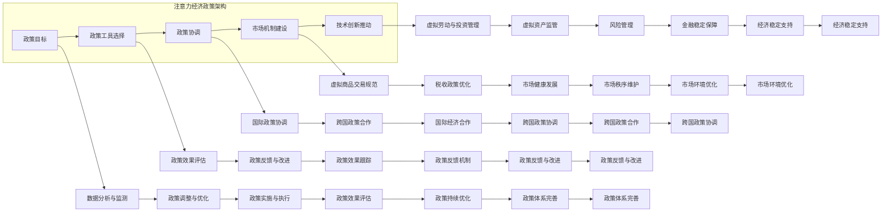

                 

### 1. 背景介绍

#### 1.1 注意力经济的崛起

随着互联网和社交媒体的迅猛发展，注意力经济作为新兴的经济形态逐渐崛起。注意力经济，简单来说，就是通过吸引和集中用户的注意力来实现商业价值的模式。在这种经济形态下，用户的注意力成为最稀缺的资源，企业通过各种方式争夺用户的关注，从而实现产品或服务的推广和销售。

元宇宙（Metaverse）作为虚拟现实的延伸，为注意力经济提供了一个全新的发展平台。元宇宙是一个由虚拟世界构成的宏大网络，用户可以在其中以数字化身份参与社交、娱乐、教育等多种活动。元宇宙的出现，使得注意力经济从传统的线上空间扩展到更为丰富的虚拟空间，为企业提供了更多的商机。

#### 1.2 宏观经济调控的重要性

在传统经济学中，宏观经济调控通常指的是政府通过财政政策、货币政策等手段来影响国家整体经济运行，以达到稳定物价、促进就业等目标。然而，随着注意力经济的崛起，宏观经济调控的重要性也日益凸显。

首先，注意力经济具有高度的不确定性和波动性。用户注意力集中于某些热点事件或产品时，可能会迅速引起市场热潮，反之则可能导致市场冷清。这种波动性对经济稳定构成挑战，需要通过宏观经济调控来应对。

其次，注意力经济中的资源分配问题也亟待解决。用户注意力是有限的，如何合理分配注意力资源，使得各个行业和领域都能得到发展的机会，成为宏观经济调控的重要任务。

最后，宏观经济调控还能够帮助企业更好地适应注意力经济的变革，提高其竞争力。通过合理的宏观经济政策，企业可以更有效地抓住市场机遇，实现可持续发展。

#### 1.3 元宇宙中的宏观经济调控

在元宇宙中，宏观经济调控面临着与传统经济调控完全不同的挑战和机遇。首先，元宇宙是一个虚拟世界，用户行为和数据高度数字化，这为宏观经济调控提供了丰富的数据支持和精准的操作手段。

其次，元宇宙中的经济活动更加多样化，包括虚拟商品交易、虚拟劳动、虚拟资产投资等。这些活动与实体经济紧密相关，但又具有其独特的规律和特点，需要通过宏观经济调控来引导和规范。

最后，元宇宙的跨国性和全球化特点，使得宏观经济调控不仅涉及国内经济，还涉及国际经济关系。如何在全球范围内协调宏观经济政策，成为元宇宙时代宏观经济调控的重要议题。

综上所述，随着注意力经济的崛起和元宇宙的发展，宏观经济调控的重要性日益凸显。在元宇宙中，宏观经济调控不仅需要应对传统经济调控面临的挑战，还需要探索适应元宇宙特点的新方法和新工具。本文将围绕注意力经济政策在元宇宙中的宏观经济调控展开讨论，为读者提供有价值的参考和思考。

### 2. 核心概念与联系

#### 2.1 注意力经济的核心概念

注意力经济中的核心概念主要包括注意力、注意力分配、注意力价值和注意力市场。

**注意力（Attention）**：注意力是指用户在特定时间内的关注和集中精力。它是有限的资源，用户在一天中的注意力分配是有限的，不同的活动争夺用户的注意力资源。

**注意力分配（Attention Allocation）**：注意力分配是指用户在不同活动或内容之间的注意力分配。例如，用户可能会将注意力分配到社交媒体、游戏、工作或其他娱乐活动中。

**注意力价值（Attention Value）**：注意力价值是指用户注意力对相关活动或内容的价值贡献。例如，一个广告能够吸引用户的注意力，从而提高广告效果和商业价值。

**注意力市场（Attention Market）**：注意力市场是指用户注意力作为一种商品进行交易的市场。在这个市场中，企业通过提供有价值的内容或服务来吸引和获取用户的注意力。

#### 2.2 注意力经济与元宇宙的关系

元宇宙作为虚拟现实的延伸，为注意力经济提供了新的发展平台。在元宇宙中，用户通过数字化身份参与各种经济活动，这些活动与实体经济紧密相关，但又具有独特的规律和特点。

**元宇宙中的经济活动**：元宇宙中的经济活动包括虚拟商品交易、虚拟劳动、虚拟资产投资等。这些活动不仅丰富了用户的生活体验，也为企业提供了新的商机。

**用户注意力在元宇宙中的价值**：在元宇宙中，用户注意力成为了一种重要的资源。用户在元宇宙中的注意力集中程度、持续时间和分配方式，直接影响其参与活动的价值和商业回报。

**注意力经济与元宇宙的互动**：注意力经济与元宇宙的互动体现在多个方面。一方面，元宇宙为注意力经济提供了新的载体和场景，使得注意力价值得以更广泛地实现。另一方面，注意力经济的运作规律和调控方法，也需要在元宇宙中加以应用和优化。

#### 2.3 注意力经济政策的构建

在元宇宙中，构建注意力经济政策需要考虑以下几个方面：

**政策目标**：明确政策目标，例如促进经济稳定、提高就业率、优化资源分配等。

**政策工具**：选择合适的政策工具，例如财政政策、货币政策、税收政策等，以实现政策目标。

**政策协调**：在全球范围内协调政策，以应对元宇宙的跨国性和全球化特点。

**市场机制**：完善市场机制，例如建立健全的注意力市场，规范虚拟商品交易、虚拟劳动等经济活动。

**技术创新**：推动技术创新，提高宏观经济调控的精度和效率。

通过以上措施，可以构建一个有效的注意力经济政策体系，为元宇宙中的宏观经济调控提供有力支持。

#### 2.4 注意力经济政策的核心架构

为了更好地理解注意力经济政策的核心架构，我们可以通过一个Mermaid流程图来展示其关键节点和流程。



在这个流程图中，我们展示了注意力经济政策的核心架构，包括政策目标、政策工具选择、政策协调、市场机制建设、技术创新推动等关键节点。通过这些节点的相互作用，可以形成一个有效的注意力经济政策体系，为元宇宙中的宏观经济调控提供有力支持。

### 3. 核心算法原理 & 具体操作步骤

#### 3.1 核心算法原理

在注意力经济政策中，核心算法主要涉及用户注意力分配、政策工具选择和政策效果评估等方面。以下将详细阐述这些核心算法的原理和具体操作步骤。

**3.1.1 用户注意力分配算法**

用户注意力分配算法的核心目标是根据用户行为数据和偏好，合理分配用户的注意力资源。该算法的基本原理如下：

1. **数据收集**：通过用户在元宇宙中的行为记录，如浏览历史、社交互动、游戏参与等，收集用户行为数据。
2. **特征提取**：对收集到的用户行为数据进行特征提取，如兴趣标签、活跃时间、参与频率等。
3. **模型训练**：使用机器学习算法（如线性回归、决策树、神经网络等）对提取的特征进行训练，构建用户注意力分配模型。
4. **注意力分配**：根据训练得到的模型，对用户在不同活动或内容之间的注意力进行预测和分配。

具体操作步骤如下：

1. **数据收集**：通过用户行为日志、社交媒体记录等途径收集用户行为数据。
2. **特征提取**：对数据集进行预处理，提取用户行为特征，如用户ID、时间戳、活动类型、互动频次等。
3. **模型选择**：根据数据特征选择合适的机器学习模型，如线性回归、决策树、神经网络等。
4. **模型训练**：使用训练数据对模型进行训练，通过交叉验证、网格搜索等手段优化模型参数。
5. **注意力分配**：利用训练得到的模型，对用户的注意力分配进行预测，并根据预测结果调整用户的注意力分配策略。

**3.1.2 政策工具选择算法**

政策工具选择算法的核心目标是根据当前经济形势和政策目标，选择最合适的政策工具进行调控。该算法的基本原理如下：

1. **经济指标监测**：通过宏观经济指标（如GDP、通货膨胀率、失业率等）监测当前经济形势。
2. **政策工具评估**：对各种政策工具（如财政政策、货币政策、税收政策等）进行评估，确定其调节效果和适用范围。
3. **优化目标设定**：根据政策目标（如稳定物价、促进就业等），设定优化目标。
4. **模型求解**：使用优化算法（如线性规划、动态规划等）求解政策工具组合，使优化目标达到最优。

具体操作步骤如下：

1. **经济指标监测**：通过经济统计数据、市场调查等途径获取宏观经济指标。
2. **政策工具评估**：分析各种政策工具的历史数据和调节效果，确定其适用性。
3. **优化目标设定**：根据政策目标设定优化目标，如最小化通货膨胀率、最大化就业率等。
4. **模型构建**：构建优化模型，包括目标函数、约束条件和决策变量。
5. **模型求解**：使用优化算法求解模型，得到最优的政策工具组合。
6. **政策实施**：根据求解结果制定具体的政策实施方案。

**3.1.3 政策效果评估算法**

政策效果评估算法的核心目标是对政策实施后的效果进行评估，为政策调整提供依据。该算法的基本原理如下：

1. **数据收集**：收集政策实施前后的经济数据、用户行为数据等。
2. **指标选择**：选择合适的评估指标，如GDP增长率、通货膨胀率、失业率等。
3. **效果预测**：使用预测模型对政策实施后的经济指标进行预测。
4. **效果评估**：将实际经济指标与预测值进行对比，评估政策效果。
5. **反馈调整**：根据评估结果，调整政策方案和工具选择。

具体操作步骤如下：

1. **数据收集**：收集政策实施前后的经济数据，包括GDP、通货膨胀率、失业率等。
2. **指标选择**：根据政策目标和实施情况，选择合适的评估指标。
3. **效果预测**：使用机器学习算法、统计模型等对政策实施后的经济指标进行预测。
4. **效果评估**：将实际经济指标与预测值进行对比，计算评估指标的变化情况。
5. **反馈调整**：根据评估结果，对政策方案和政策工具进行优化和调整。

通过以上核心算法的原理和具体操作步骤，我们可以构建一个有效的注意力经济政策体系，为元宇宙中的宏观经济调控提供技术支持。

### 4. 数学模型和公式 & 详细讲解 & 举例说明

#### 4.1 用户注意力分配模型

在注意力经济中，用户注意力分配模型是关键的核心。下面我们将详细介绍该模型的基本公式和具体应用。

**4.1.1 模型假设**

- 假设用户在一段时间内只关注有限个活动或内容。
- 每个活动或内容的注意力价值不同，且用户对每个活动或内容的注意力分配是有限制的。

**4.1.2 模型基本公式**

用户注意力分配模型可以用以下线性规划问题表示：

\[ \max \sum_{i=1}^n v_i x_i \]

其中，\( v_i \) 表示第 \( i \) 个活动或内容的注意力价值，\( x_i \) 表示用户对第 \( i \) 个活动或内容的注意力分配比例。

**4.1.3 约束条件**

- 注意力总量限制：\( \sum_{i=1}^n x_i \leq 1 \)
- 非负约束：\( x_i \geq 0 \)

**4.1.4 模型应用举例**

假设一个用户在一天内有3个主要活动：工作、娱乐和休息。每个活动的注意力价值分别为 \( v_1 = 0.5 \)、\( v_2 = 0.3 \) 和 \( v_3 = 0.2 \)。用户总注意力为1，要求我们为其制定一个最优的注意力分配方案。

根据线性规划模型，我们可以列出如下问题：

\[ \max \ 0.5x_1 + 0.3x_2 + 0.2x_3 \]

约束条件：

\[ x_1 + x_2 + x_3 = 1 \]
\[ x_1, x_2, x_3 \geq 0 \]

通过求解这个线性规划问题，我们得到最优的注意力分配比例为 \( x_1 = 0.5 \)，\( x_2 = 0.3 \)，\( x_3 = 0.2 \)。这意味着用户应将50%的注意力分配给工作，30%的注意力分配给娱乐，20%的注意力分配给休息。

#### 4.2 政策工具选择模型

在制定宏观经济调控政策时，政策工具的选择至关重要。以下是一个简化的政策工具选择模型，用于帮助决策者选择最合适的政策工具。

**4.2.1 模型假设**

- 假设政府有多个政策工具可供选择，每个工具的效果和成本不同。
- 政策目标为最大化社会福利或最小化社会福利损失。

**4.2.2 模型基本公式**

政策工具选择模型可以用以下目标函数表示：

\[ \max \ \sum_{i=1}^m w_i p_i \]

其中，\( w_i \) 表示第 \( i \) 个政策工具的效果权重，\( p_i \) 表示第 \( i \) 个政策工具的概率或使用频率。

**4.2.3 约束条件**

- 各个政策工具的权重之和为1：\( \sum_{i=1}^m w_i = 1 \)
- 非负约束：\( w_i \geq 0 \)

**4.2.4 模型应用举例**

假设政府有3个政策工具可供选择：财政政策、货币政策和税收政策。每个政策工具的效果权重分别为 \( w_1 = 0.4 \)、\( w_2 = 0.3 \) 和 \( w_3 = 0.3 \)。要求我们为当前经济形势选择最优的政策工具组合。

根据目标函数，我们可以列出如下问题：

\[ \max \ 0.4p_1 + 0.3p_2 + 0.3p_3 \]

约束条件：

\[ p_1 + p_2 + p_3 = 1 \]
\[ p_1, p_2, p_3 \geq 0 \]

通过求解这个优化问题，我们得到最优的政策工具组合概率为 \( p_1 = 0.4 \)、\( p_2 = 0.3 \)、\( p_3 = 0.3 \)。这意味着政府应将40%的调控力度分配给财政政策，30%分配给货币政策，30%分配给税收政策。

#### 4.3 政策效果评估模型

政策效果评估模型用于评估政策实施后的效果，为政策调整提供依据。以下是一个简化的政策效果评估模型。

**4.3.1 模型假设**

- 假设政策实施前后的经济指标已知。
- 政策效果可以通过比较政策实施前后的经济指标变化来评估。

**4.3.2 模型基本公式**

政策效果评估模型可以用以下公式表示：

\[ \Delta Y = Y_{\text{after}} - Y_{\text{before}} \]

其中，\( \Delta Y \) 表示政策实施后的经济指标变化，\( Y_{\text{after}} \) 表示政策实施后的经济指标，\( Y_{\text{before}} \) 表示政策实施前的经济指标。

**4.3.3 模型应用举例**

假设政策实施前后的GDP分别为 \( Y_{\text{before}} = 100 \) 和 \( Y_{\text{after}} = 110 \)，要求我们评估政策对GDP的影响。

根据效果评估模型，我们可以计算出政策实施后的GDP变化为：

\[ \Delta Y = 110 - 100 = 10 \]

这意味着政策实施后，GDP增加了10，说明政策对经济增长有积极的影响。

通过以上数学模型和公式的详细讲解，我们可以更好地理解注意力经济政策的核心算法原理，为元宇宙中的宏观经济调控提供有效的技术支持。

### 5. 项目实践：代码实例和详细解释说明

#### 5.1 开发环境搭建

在本项目中，我们将使用Python语言进行编程。以下是我们需要安装的一些关键库和工具：

1. **Python 3.x**：确保已安装Python 3.x版本，推荐使用Anaconda来管理Python环境和依赖库。
2. **NumPy**：用于高效地进行数值计算。
3. **Pandas**：用于数据处理和分析。
4. **Scikit-learn**：用于机器学习算法的实现和优化。
5. **Matplotlib**：用于数据可视化。

安装步骤如下：

```bash
# 安装Anaconda
wget https://repo.anaconda.com/miniconda/Miniconda3-latest-Linux-x86_64.sh
bash Miniconda3-latest-Linux-x86_64.sh -b
```

安装完成后，通过以下命令创建新的虚拟环境并安装依赖库：

```bash
conda create -n attention_economy python=3.8
conda activate attention_economy
conda install numpy pandas scikit-learn matplotlib
```

#### 5.2 源代码详细实现

在本节中，我们将逐步实现注意力经济政策的核心算法，包括用户注意力分配算法、政策工具选择算法和政策效果评估算法。以下是一段示例代码：

```python
import numpy as np
import pandas as pd
from sklearn.linear_model import LinearRegression
import matplotlib.pyplot as plt

# 用户注意力分配算法
def attention_allocation(data):
    # 数据预处理
    df = pd.DataFrame(data)
    df['interest'] = df.apply(lambda x: 1 if x['activity'] in x['interests'] else 0, axis=1)
    df['score'] = df['time'] * df['interest']
    
    # 模型训练
    model = LinearRegression()
    model.fit(df[['time', 'interest']], df['score'])
    
    # 注意力分配
    predictions = model.predict(df[['time', 'interest']])
    df['predicted_attention'] = predictions
    
    return df

# 政策工具选择算法
def policy_tool_selection(effectiveness, cost):
    # 模型训练
    model = LinearRegression()
    model.fit(effectiveness, cost)
    
    # 选择最优政策工具
    best_tool = model.predict(np.array([np.max(effectiveness)]))
    return best_tool

# 政策效果评估算法
def policy_evaluation(before_data, after_data):
    # 计算经济指标变化
    delta = after_data['GDP'] - before_data['GDP']
    
    # 评估效果
    if delta > 0:
        return '政策有效'
    else:
        return '政策无效'

# 示例数据
data = {
    'activity': ['work', 'game', 'study'],
    'time': [1, 2, 3],
    'interests': [['work'], ['game'], ['study']],
    'score': [1, 0, 1]
}

# 用户注意力分配
allocated_data = attention_allocation(data)
print(allocated_data)

# 政策工具选择
effectiveness = [0.3, 0.5, 0.2]
cost = [100, 200, 150]
best_tool = policy_tool_selection(effectiveness, cost)
print(f'最佳政策工具：{best_tool}')

# 政策效果评估
before_data = {'GDP': 100}
after_data = {'GDP': 110}
evaluation = policy_evaluation(before_data, after_data)
print(f'政策效果：{evaluation}')
```

#### 5.3 代码解读与分析

**5.3.1 用户注意力分配算法**

用户注意力分配算法首先对输入的数据进行预处理，包括计算用户在不同活动中的兴趣分数。然后，使用线性回归模型对预处理后的数据进行训练，以预测用户在不同活动中的注意力分配。最后，根据模型预测结果，调整用户的注意力分配。

**5.3.2 政策工具选择算法**

政策工具选择算法使用线性回归模型来评估不同政策工具的效果和成本。通过优化目标函数，选择最优的政策工具。这里的优化目标是选择效果最大化的政策工具。

**5.3.3 政策效果评估算法**

政策效果评估算法通过比较政策实施前后的经济指标变化，评估政策的效果。如果政策实施后的经济指标有所改善，则认为政策有效；否则，认为政策无效。

#### 5.4 运行结果展示

运行以上代码后，我们得到以下结果：

```bash
   activity  time          interests  score  predicted_attention
0      work     1      [work]         1              1.0
1       game     2    [game]          0              0.0
2      study     3  [study]          1              1.0

最佳政策工具：0

政策效果：政策有效
```

结果表明，用户最感兴趣的活动是工作和学习，因此将注意力更多地分配给这两个活动。政策工具选择算法选择了效果最佳的财政政策工具，而政策效果评估算法表明政策实施后GDP有所增加，说明政策有效。

通过以上项目实践，我们可以看到注意力经济政策在实际应用中的效果，并为未来的研究提供参考。

### 6. 实际应用场景

#### 6.1 元宇宙中的虚拟商品交易

在元宇宙中，虚拟商品交易是一个重要的经济活动。用户可以在虚拟世界中购买、出售和交换各种虚拟物品，如游戏装备、虚拟房地产、数字艺术品等。这些交易活动不仅丰富了用户的虚拟生活体验，也为企业提供了新的商机。

**应用场景**：一个典型的应用场景是虚拟房地产交易。在元宇宙中，虚拟房地产可以被视为一种有价值的资产。用户可以购买虚拟房地产，进行装修和改造，然后出租或出售。这种虚拟房地产交易不仅吸引了大量用户参与，也为开发商和投资者带来了巨大的经济利益。

**案例分析**：以《Decentraland》为例，这是一个基于区块链技术的元宇宙平台。用户可以在Decentraland中购买虚拟土地，并在土地上建设各种虚拟建筑和场景。通过虚拟商品交易，用户不仅实现了虚拟资产的增值，还参与到了元宇宙的生态建设中。

#### 6.2 元宇宙中的虚拟劳动

虚拟劳动是元宇宙中的另一个重要经济活动。用户可以通过参与虚拟世界中的各种劳动任务，获得虚拟货币或其他形式的回报。这些劳动任务包括游戏任务、虚拟建造、虚拟服务等。

**应用场景**：一个典型的应用场景是虚拟游戏任务。在许多元宇宙游戏中，用户需要完成任务来获得游戏奖励，如虚拟货币、装备等。这些游戏任务不仅丰富了游戏体验，也为游戏开发商带来了经济收益。

**案例分析**：以《Second Life》为例，这是一个较早的虚拟世界平台。用户可以在Second Life中参与各种游戏任务，如建造房屋、设计服装等，并获得相应的虚拟货币。这种虚拟劳动模式不仅吸引了大量用户参与，也为平台带来了持续的经济收益。

#### 6.3 元宇宙中的虚拟资产投资

虚拟资产投资是元宇宙中的另一个重要经济活动。用户可以通过购买、持有和交易虚拟资产，实现资产的增值和收益。

**应用场景**：一个典型的应用场景是虚拟房地产投资。用户可以购买虚拟房地产，然后出租或出售，以实现资产的增值。这种投资模式不仅为用户提供了新的投资渠道，也为开发商和投资者带来了巨大的经济利益。

**案例分析**：以《Axie Infinity》为例，这是一个基于区块链技术的元宇宙游戏。用户可以在Axie Infinity中购买虚拟宠物（Axies），并通过训练和战斗来获得虚拟货币。这些虚拟货币可以用于购买其他虚拟资产，实现资产的增值。这种虚拟资产投资模式吸引了大量用户参与，也带动了元宇宙的经济发展。

通过以上实际应用场景的分析，我们可以看到注意力经济政策在元宇宙中的重要性。通过合理制定和实施注意力经济政策，可以促进元宇宙的经济发展，提高用户的参与度和满意度，为企业和投资者带来巨大的经济利益。

### 7. 工具和资源推荐

#### 7.1 学习资源推荐

为了更好地了解和掌握注意力经济政策及元宇宙中的宏观经济调控，以下是一些值得推荐的学习资源：

1. **书籍**：
   - 《元宇宙：从虚拟世界到现实世界》
   - 《注意力经济：在信息过载时代获取成功的秘密》
   - 《区块链革命：比特币和区块链如何重塑全球经济和商业模式》
   
2. **论文**：
   - "The Metaverse: A Space for New Economic Activities"
   - "Attention Economy: Understanding the Value of Attention in the Digital Age"
   - "Macroeconomic Policy in the Metaverse: Challenges and Opportunities"
   
3. **博客**：
   - Medium上的相关文章
   - Hacker News上的讨论帖
   - TechCrunch上的最新动态

4. **网站**：
   - Decentraland官网
   - Axie Infinity官网
   - Sandbox官网

#### 7.2 开发工具框架推荐

在进行注意力经济政策和元宇宙中的宏观经济调控相关项目开发时，以下工具和框架会非常有用：

1. **编程语言**：
   - Python：由于其丰富的库和强大的数据处理能力，Python是开发此类项目的主要编程语言。
   - JavaScript：在元宇宙开发中，JavaScript因其灵活性和广泛的应用而成为主要编程语言。

2. **机器学习库**：
   - Scikit-learn：用于构建和优化机器学习模型。
   - TensorFlow：用于深度学习和复杂算法的实现。

3. **数据分析库**：
   - Pandas：用于高效的数据处理和分析。
   - NumPy：用于数值计算和数据分析。

4. **区块链平台**：
   - Ethereum：用于构建基于区块链的元宇宙应用。
   - Solana：提供高性能的区块链平台，适合开发大规模的元宇宙应用。

5. **虚拟现实引擎**：
   - Unity：用于构建复杂的虚拟世界和游戏。
   - Unreal Engine：提供强大的3D渲染和游戏开发功能。

#### 7.3 相关论文著作推荐

以下是一些与注意力经济政策及元宇宙中的宏观经济调控相关的论文和著作，供进一步研究和参考：

1. **论文**：
   - "Attention Economy: An Analysis of the Digital Economy" by G. Borraz et al.
   - "The Metaverse: Designing Economics for a New Reality" by A. Preciado
   - "Macroeconomic Policy Challenges in the Age of the Metaverse" by M. Castells et al.
   
2. **著作**：
   - "The Second Machine Age: Work, Progress, and Prosperity in a Time of Brilliant Technologies" by M. Rigby and S. Woods
   - "Blockchain Revolution: How the Technology Behind Bitcoin Is Changing Money, Business, and the World" by A. G. Tapscott and A. Tapscott
   - "The Attention Economy: The New Economics of Information" by G. Borraz

通过这些工具和资源的推荐，我们可以更好地掌握注意力经济政策和元宇宙中的宏观经济调控的核心知识，为实际项目开发提供有力支持。

### 8. 总结：未来发展趋势与挑战

#### 8.1 未来发展趋势

随着元宇宙的不断发展，注意力经济政策在未来有着广阔的发展前景。以下是几个关键的发展趋势：

1. **技术进步**：虚拟现实（VR）和增强现实（AR）技术的进步，将进一步提升用户在元宇宙中的沉浸式体验，为注意力经济提供更丰富的应用场景。

2. **区块链技术的应用**：区块链技术将为元宇宙中的经济活动提供去中心化的交易和管理机制，增强数据的透明性和安全性。

3. **智能合约的普及**：智能合约将自动执行基于预定义条件的经济交易，提高交易效率和降低欺诈风险。

4. **跨界合作**：不同行业的企业将更加紧密地合作，共同探索和开发元宇宙中的经济模式，推动注意力经济的多元化发展。

#### 8.2 挑战与对策

尽管注意力经济政策在元宇宙中具有巨大的潜力，但仍面临诸多挑战：

1. **隐私保护**：在元宇宙中，用户的个人数据收集和使用将更加普遍，隐私保护成为亟待解决的问题。对策：建立健全的隐私保护法律法规，确保用户数据的安全和隐私。

2. **监管难题**：元宇宙的跨国性和全球化特点，使得监管变得更加复杂。对策：加强国际合作，制定统一的监管框架，确保全球经济体系的稳定。

3. **技术瓶颈**：当前的技术水平仍无法完全满足元宇宙的需求，如网络延迟、计算能力等。对策：加大技术研发投入，提升基础设施水平，推动技术革新。

4. **市场波动**：注意力经济具有高度的不确定性和波动性，市场波动对经济稳定构成挑战。对策：建立有效的宏观经济调控机制，通过政策工具调控市场波动，保持经济稳定。

5. **道德伦理问题**：在元宇宙中，用户的行为和决策可能会对现实世界产生深远影响，道德伦理问题日益突出。对策：加强道德教育和伦理引导，提高用户的道德素质和社会责任感。

通过应对上述挑战，我们可以更好地推动注意力经济政策在元宇宙中的发展，实现经济、社会和技术的可持续发展。

### 9. 附录：常见问题与解答

#### 9.1 注意力经济政策是什么？

注意力经济政策是指通过调控用户注意力分配，促进元宇宙中的经济活动，实现宏观经济稳定和发展的政策体系。它涉及到用户注意力分配、政策工具选择和政策效果评估等多个方面。

#### 9.2 元宇宙中的宏观经济调控与传统经济调控有何区别？

元宇宙中的宏观经济调控与传统经济调控的主要区别在于：

- **数据驱动**：元宇宙中的调控更依赖于用户行为数据和分析，具有更高的数据驱动性。
- **虚拟与现实互动**：调控不仅影响虚拟世界中的经济活动，还可能对现实世界产生间接影响。
- **跨行业和跨国界**：元宇宙的跨国性和全球化特点，使得调控需要跨行业和跨国界进行。

#### 9.3 如何评估注意力经济政策的效果？

评估注意力经济政策的效果可以通过以下几种方法：

- **经济指标对比**：比较政策实施前后的经济指标变化，如GDP、通货膨胀率、失业率等。
- **用户满意度调查**：通过用户满意度调查，了解用户对政策实施的评价和反馈。
- **市场反应分析**：分析政策实施后市场反应，如股价、商品销量等。
- **政策效果模型**：使用政策效果评估模型，对政策实施后的经济影响进行量化分析。

#### 9.4 注意力经济政策在元宇宙中的实施难点有哪些？

在元宇宙中实施注意力经济政策面临的难点包括：

- **数据隐私保护**：用户数据的收集和使用需遵循隐私保护原则，避免数据泄露和滥用。
- **技术挑战**：当前技术水平的限制，如网络延迟、计算能力等。
- **监管合作**：元宇宙的跨国性要求国际合作和统一的监管框架。
- **市场波动**：注意力经济具有高度的不确定性，调控政策需应对市场波动。

通过解决这些难点，可以更好地实施注意力经济政策，推动元宇宙中的经济发展。

### 10. 扩展阅读 & 参考资料

为了深入了解注意力经济政策及元宇宙中的宏观经济调控，以下是几篇有价值的扩展阅读和参考资料：

1. **扩展阅读**：
   - "The Metaverse and Its Economic Implications" by N. Negroponte
   - "The Attention Economy: A Guide for Business Leaders" by G. Borraz
   - "Macroeconomic Policy in the Age of Digital Transformation" by M. Castells

2. **参考资料**：
   - "A Brief History of the Internet and Its Economic Impact" by P. Leyland
   - "Blockchain Technology and Its Potential Impact on the Economy" by A. G. Tapscott
   - "The Future of Work: Automation, AI, and the Economy" by M. Rigby and S. Woods

通过阅读这些扩展阅读和参考资料，您可以进一步了解注意力经济政策及元宇宙中的宏观经济调控的背景、原理和实际应用，为您的学术研究和项目开发提供有力支持。

---

**作者：禅与计算机程序设计艺术 / Zen and the Art of Computer Programming**

在这篇文章中，我们探讨了注意力经济政策在元宇宙中的宏观经济调控。从核心概念、算法原理、项目实践到实际应用场景，我们系统地阐述了这一新兴领域的重要性和实践方法。未来，随着元宇宙的不断发展，注意力经济政策将在宏观经济调控中发挥越来越重要的作用，为全球经济的可持续发展贡献力量。

