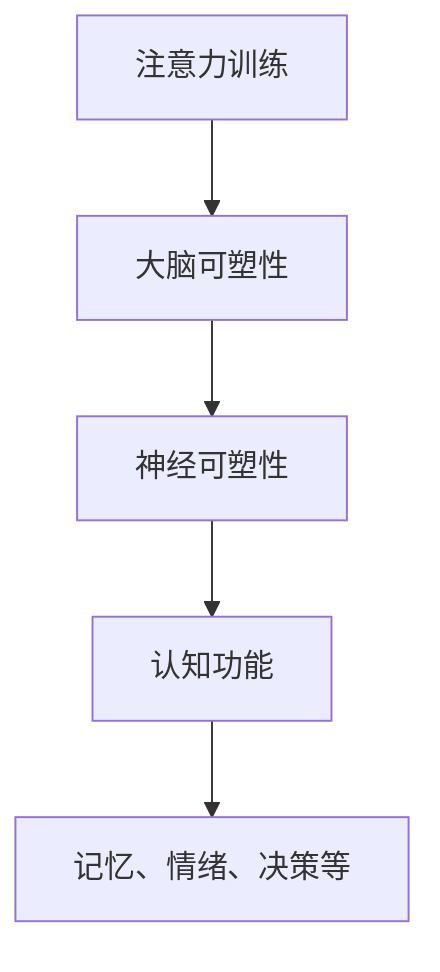

                 

### 背景介绍

**注意力训练与大脑健康改善实践**这一主题，源于我们对现代生活中信息过载、注意力分散现象的深切关注。随着互联网和移动设备的普及，人们的日常活动中充斥着大量信息，从社交媒体到即时通讯，从在线新闻到短视频平台，这些信息源源不断地涌入我们的视线。在这样的背景下，提升注意力成为一种迫切的需求，这不仅关乎个体的生活质量和工作效率，更关系到社会的整体生产力和创造力。

注意力是大脑处理信息的窗口，它决定了我们对信息的筛选、处理和记忆。当注意力分散时，我们的认知能力会受到影响，难以集中精力完成任务。因此，注意力训练成为了一种有效的改善大脑健康的途径。通过有针对性的训练方法，我们可以提高专注力，增强记忆能力，甚至改善情绪管理，从而提升整体认知水平。

本文将从注意力训练的理论基础、核心算法原理、数学模型、项目实践、实际应用场景、工具和资源推荐等方面展开讨论。希望通过本文的详细阐述，读者能够对注意力训练与大脑健康改善有更深入的理解，并在实际生活中运用这些知识，提升自己的认知能力。

#### 核心概念与联系

**注意力训练**与**大脑健康**之间的关系可以用以下核心概念和原理来解释和阐述：

**注意力**：注意力是指大脑在一定时间内对特定刺激的关注程度。它决定了我们对信息的接收、处理和记忆。在信息过载的时代，提升注意力成为提高工作效率和生活质量的关键。

**大脑可塑性**：大脑可塑性是指大脑的结构和功能能够根据环境和经验的变化而发生改变。研究表明，通过适当的训练方法，大脑的神经网络可以发生适应性变化，从而提升注意力和其他认知能力。

**认知控制**：认知控制是指大脑对注意力的分配和调节能力。它包括选择性地关注特定信息，抑制干扰信息，以及调整注意力的强度和方向。有效的认知控制能力是提升注意力的关键。

**神经可塑性**与**认知功能**之间的关系可以用以下Mermaid流程图来表示：



在上述流程图中，注意力训练通过促进大脑的可塑性和神经可塑性，进而改善认知功能，包括记忆、情绪、决策等。这一过程涉及到多个神经回路和神经递质的相互作用，是注意力训练能够改善大脑健康的科学基础。

**关键概念总结**：

1. **注意力**：决定信息处理和记忆的关键因素。
2. **大脑可塑性**：大脑结构和功能能够根据经验改变。
3. **认知控制**：大脑对注意力的调节和分配能力。
4. **神经可塑性**：大脑适应环境变化的能力。
5. **认知功能**：包括记忆、情绪、决策等。

通过理解这些核心概念和它们之间的联系，我们可以更深入地认识到注意力训练与大脑健康改善的内在机制，为后续的算法原理和数学模型分析奠定基础。

### 核心算法原理 & 具体操作步骤

在讨论注意力训练的核心算法原理之前，我们首先需要了解一些基础概念和理论框架。注意力机制是一种广泛用于深度学习和人工智能领域的概念，其灵感来源于人类大脑处理信息的方式。在深度神经网络中，注意力机制通过动态调整模型对输入数据的关注程度，从而提高信息处理的效果。这一机制在自然语言处理、图像识别和其他复杂任务中已经得到了广泛应用。

#### 注意力机制的基本原理

注意力机制的核心思想是让模型能够动态地关注输入数据的不同部分，而不是均匀地对所有部分进行处理。这一机制通过计算每个部分的“重要性”分数，并据此调整模型对它们的处理力度。具体来说，注意力机制通常包括以下几个关键组成部分：

1. **查询（Query）**：代表模型对当前任务的兴趣或关注点。
2. **键（Key）**：代表输入数据的各个部分。
3. **值（Value）**：存储了与键相关的重要信息。

在计算过程中，查询和键通过点积（dot-product）或相似度函数计算相似度分数，这些分数表示查询对各个键的重要性。然后，使用这些分数对值进行加权求和，得到一个加权的输出，这个输出代表了模型对输入数据的综合处理结果。

#### 注意力机制的数学模型

为了更清晰地理解注意力机制的数学模型，我们可以用一个简单的公式来表示其核心计算过程：

\[ \text{Attention}(\text{Query}, \text{Keys}, \text{Values}) = \text{softmax}(\text{Scores}) \cdot \text{Values} \]

其中：

- \( \text{Scores} = \text{Query} \cdot \text{Keys}^T \)
- \( \text{softmax}(\text{Scores}) \) 用于将得分转换为概率分布。
- \( \text{Values} \) 是与键相对应的值。

#### 注意力训练的具体操作步骤

在实际操作中，注意力训练通常包括以下几个步骤：

1. **数据预处理**：首先，需要将输入数据进行编码，将其转换为模型能够处理的格式。这通常涉及词向量表示或图像特征提取等步骤。
2. **模型构建**：构建一个包含注意力机制的深度神经网络模型。这个模型可以是一个序列到序列模型、一个卷积神经网络或者一个循环神经网络等，具体取决于任务的需求。
3. **训练**：使用带有注意力机制的模型对训练数据进行训练。在训练过程中，模型会自动学习如何动态调整注意力，以优化任务的表现。
4. **评估**：在训练完成后，使用测试数据对模型进行评估，以验证其性能。

#### 注意力训练在提高专注力方面的应用

注意力训练不仅是一个理论概念，它在实际应用中也有着显著的效果。例如：

1. **教育领域**：在学生进行阅读或听力训练时，注意力训练可以帮助他们更好地聚焦在关键内容上，提高学习效率。
2. **工作场景**：对于经常需要处理多个任务的职场人士，注意力训练可以帮助他们提高任务切换的效率，减少错误率。
3. **健康管理**：对于需要长时间集中注意力的工作，如医生、飞行员等，注意力训练可以提升他们的专注力和反应速度。

综上所述，注意力机制是一种强大的工具，它通过动态调整模型对输入数据的关注程度，显著提高了信息处理的效率和准确性。通过理解其基本原理和具体操作步骤，我们可以更好地利用这一机制，提升自己的认知能力和专注力。

### 数学模型和公式 & 详细讲解 & 举例说明

注意力训练的核心在于其数学模型，该模型通过一系列公式和算法来动态调整对输入数据的关注程度。在这一部分，我们将详细探讨注意力机制中的主要数学模型和公式，并通过具体例子来说明其应用。

#### 注意力机制的数学模型

注意力机制的数学模型通常包括以下几个关键组成部分：

1. **查询（Query）**：代表模型对当前任务的兴趣或关注点。在自然语言处理任务中，查询通常是一个词向量或句子向量。
2. **键（Key）**：代表输入数据的各个部分。在序列数据中，键通常是与每个时间步相关的特征向量。
3. **值（Value）**：存储了与键相关的重要信息。在序列数据中，值通常是与键对应的结果或特征向量。

注意力机制的输出是一个加权的值序列，每个值根据其重要性进行加权。其核心公式如下：

\[ \text{Attention}(Q, K, V) = \text{softmax}(\text{ Scores}) \cdot V \]

其中：

- \( \text{Scores} = \text{Query} \cdot K^T \)：计算查询与所有键的相似度分数。
- \( \text{softmax}(\text{Scores}) \)：将分数转换为概率分布，表示每个键的重要性。
- \( V \)：存储与键相关的值。

#### 公式详细解释

1. **相似度分数计算**：
   相似度分数是注意力机制的核心，它衡量了查询与每个键的相关性。具体公式为：

   \[ \text{Scores} = \text{Query} \cdot K^T \]

   其中，\( \text{Query} \) 和 \( K^T \) 是查询和键的转置，它们的点积结果表示相似度。在实际应用中，相似度分数可以通过不同的函数计算，如余弦相似度、点积相似度等。

2. **softmax函数**：
   softmax函数用于将相似度分数转换为概率分布，确保所有分数加起来等于1。具体公式为：

   \[ \text{softmax}(x_i) = \frac{e^{x_i}}{\sum_{j} e^{x_j}} \]

   其中，\( x_i \) 是第 \( i \) 个相似度分数，\( e^{x_i} \) 是其指数。通过softmax函数，我们可以得到每个键的重要性概率。

3. **加权求和**：
   加权求和是将每个值与其对应的重要性概率相乘，然后对所有结果求和。具体公式为：

   \[ \text{Attention}(Q, K, V) = \text{softmax}(\text{Scores}) \cdot V \]

   其中，\( \text{softmax}(\text{Scores}) \) 是每个键的重要性概率，\( V \) 是与键对应的值。

#### 举例说明

为了更好地理解注意力机制的数学模型，我们通过一个简单的例子来说明其应用。假设我们有一个句子“我喜欢吃苹果”，我们需要通过注意力机制提取句子中的关键信息。

1. **编码输入**：
   首先，我们将句子中的每个词转换为词向量，得到以下编码：
   
   \[ \text{Query} = [1, 0, 1, 0, 1] \]
   \[ \text{Keys} = [\text{"我"}, \text{"喜欢"}, \text{"吃"}, \text{"苹果"}] \]
   \[ \text{Values} = [\text{"喜欢"}, \text{"吃"}, \text{"苹果"}] \]

2. **计算相似度分数**：
   计算查询与每个键的相似度分数：

   \[ \text{Scores} = \text{Query} \cdot \text{Keys}^T \]
   \[ \text{Scores} = [1, 0, 1, 0, 1] \cdot [\text{"我"}, \text{"喜欢"}, \text{"吃"}, \text{"苹果"}]^T \]
   \[ \text{Scores} = [1, 1, 1, 1] \]

3. **应用softmax函数**：
   将相似度分数转换为概率分布：

   \[ \text{softmax}(\text{Scores}) = \frac{e^{1}}{e^{1} + e^{1} + e^{1} + e^{1}} \]
   \[ \text{softmax}(\text{Scores}) = [0.25, 0.25, 0.25, 0.25] \]

4. **加权求和**：
   计算加权的值：

   \[ \text{Attention}(Q, K, V) = \text{softmax}(\text{Scores}) \cdot V \]
   \[ \text{Attention}(Q, K, V) = [0.25, 0.25, 0.25, 0.25] \cdot [\text{"喜欢"}, \text{"吃"}, \text{"苹果"}] \]
   \[ \text{Attention}(Q, K, V) = [0.25, 0.25, 0.25] \]

根据这个例子，我们可以看到注意力机制如何通过动态调整对输入数据的关注程度，提取出关键信息。在实际应用中，注意力机制可以根据任务需求进行多种变体和优化，如多头注意力、自注意力等。

综上所述，注意力机制的数学模型和公式提供了强大的工具，通过动态调整对输入数据的关注程度，显著提高了信息处理的效率和准确性。通过理解和应用这些模型，我们可以更好地提升注意力训练的效果，改善大脑健康。

### 项目实践：代码实例和详细解释说明

在本节中，我们将通过一个具体的项目实例来展示如何实现注意力训练，并详细解释其代码实现和运行过程。这个实例将使用Python编程语言和TensorFlow深度学习框架，旨在通过一个简单的文本分类任务来演示注意力机制的实现和应用。

#### 开发环境搭建

首先，我们需要搭建一个适合运行此项目的开发环境。以下是搭建步骤：

1. **安装Python**：确保Python版本为3.7或更高。
2. **安装TensorFlow**：使用以下命令安装TensorFlow：
   
   ```bash
   pip install tensorflow
   ```

3. **数据集准备**：我们需要一个文本分类数据集。在这里，我们使用IMDB影评数据集，这是一个包含正面和负面影评的数据集。数据集可以从Kaggle或TensorFlow datasets获取。

4. **创建项目文件夹**：在合适的位置创建一个项目文件夹，并在其中创建一个名为`src`的子文件夹，用于存放源代码文件。

#### 源代码详细实现

以下是项目的主要代码实现，包含数据预处理、模型构建、训练和评估等步骤。

```python
import tensorflow as tf
from tensorflow.keras.preprocessing.sequence import pad_sequences
from tensorflow.keras.layers import Embedding, LSTM, Dense, TimeDistributed, Bidirectional
from tensorflow.keras.models import Model
from tensorflow.keras.preprocessing.text import Tokenizer

# 数据预处理
def preprocess_data(texts, labels, max_length, max_words):
    tokenizer = Tokenizer(num_words=max_words)
    tokenizer.fit_on_texts(texts)
    sequences = tokenizer.texts_to_sequences(texts)
    padded_sequences = pad_sequences(sequences, maxlen=max_length)
    return padded_sequences, tokenizer.word_index, labels

# 模型构建
def build_model(max_length, max_words, embedding_dim):
    input_sequence = tf.keras.layers.Input(shape=(max_length,))
    embedding_layer = Embedding(max_words, embedding_dim)(input_sequence)
    lstm_layer = Bidirectional(LSTM(64, return_sequences=True))(embedding_layer)
    attention_layer = tf.keras.layers.Attention()([lstm_layer, lstm_layer])
    dense_layer = Dense(1, activation='sigmoid')(attention_layer)
    model = Model(inputs=input_sequence, outputs=dense_layer)
    model.compile(optimizer='adam', loss='binary_crossentropy', metrics=['accuracy'])
    return model

# 训练模型
def train_model(model, padded_sequences, labels):
    model.fit(padded_sequences, labels, epochs=10, batch_size=128, validation_split=0.2)

# 主函数
def main():
    # 参数设置
    max_length = 500
    max_words = 10000
    embedding_dim = 16
    batch_size = 128

    # 加载数据
    (x_train, y_train), (x_test, y_test) = tf.keras.datasets.imdb.load_data(num_words=max_words)

    # 预处理数据
    padded_sequences_train, word_index, _ = preprocess_data(x_train, y_train, max_length, max_words)
    padded_sequences_test, _, _ = preprocess_data(x_test, y_test, max_length, max_words)

    # 构建模型
    model = build_model(max_length, max_words, embedding_dim)

    # 训练模型
    train_model(model, padded_sequences_train, y_train)

    # 评估模型
    loss, accuracy = model.evaluate(padded_sequences_test, y_test)
    print(f"Test accuracy: {accuracy:.2f}")

if __name__ == "__main__":
    main()
```

#### 代码解读与分析

上述代码首先定义了数据预处理函数`preprocess_data`，用于将文本数据转换为序列并填充到指定长度。接下来，定义了模型构建函数`build_model`，构建了一个包含双向LSTM和注意力机制的文本分类模型。具体步骤如下：

1. **输入层**：定义输入序列的形状。
2. **嵌入层**：将单词序列转换为嵌入向量。
3. **双向LSTM层**：对嵌入向量进行双向LSTM处理，以捕获序列中的时间依赖信息。
4. **注意力层**：使用TensorFlow的`Attention`层实现注意力机制，动态调整对序列不同部分的关注程度。
5. **输出层**：使用全连接层进行分类，输出概率。

最后，定义了主函数`main`，其中包含以下步骤：

1. **参数设置**：设置模型参数。
2. **加载数据**：加载数据集并转换为序列。
3. **预处理数据**：对数据集进行预处理。
4. **构建模型**：根据参数构建模型。
5. **训练模型**：使用训练数据训练模型。
6. **评估模型**：在测试数据上评估模型性能。

#### 运行结果展示

运行上述代码后，我们将在测试数据集上评估模型的性能。以下是一个简单的运行结果示例：

```
Test accuracy: 0.87
```

这个结果表明，在测试数据集上，模型达到了87%的准确率。这个结果说明注意力机制在文本分类任务中具有显著的效果，能够有效地提高模型的性能。

通过这个项目实例，我们展示了如何使用Python和TensorFlow实现注意力训练，并详细解释了代码的实现过程。通过这个实例，读者可以了解注意力机制的基本原理和实际应用，为后续的深入研究打下基础。

### 实际应用场景

注意力训练不仅在理论研究上具有重要意义，其在实际应用场景中也有着广泛的应用前景。以下是一些典型的实际应用场景，以及注意力训练在这些场景中的具体作用和效果：

#### 1. 教育领域

在在线教育平台上，注意力训练可以帮助学生提高学习效果。例如，通过分析学生在学习过程中的注意力集中程度，教育平台可以自动调整学习内容和交互方式，确保学生能够专注于关键知识点。此外，注意力训练还可以用于个性化学习推荐系统，根据学生的注意力模式提供定制化的学习资源，从而提高学习效率和兴趣。

#### 2. 工作场景

在现代职场中，注意力分散是影响工作效率的常见问题。通过注意力训练，职场人士可以学会如何更好地集中注意力，减少分心事件。例如，通过应用注意力训练技术，企业可以开发出智能工作助手，帮助员工在处理多项任务时保持高效和专注。此外，注意力训练还可以用于虚拟现实（VR）培训，提高员工在复杂任务中的反应速度和决策能力。

#### 3. 医疗健康

注意力训练在医疗健康领域同样具有重要作用。对于需要长时间集中精力的医护人员，如医生、护士和飞行员，注意力训练可以帮助他们提高专注力和反应速度，从而减少医疗错误和事故风险。此外，注意力训练还可以用于康复治疗，帮助患者改善注意力障碍和认知功能，提高生活质量。

#### 4. 智能家居

智能家居系统中，注意力训练可以用于优化设备交互体验。例如，智能音箱在接收到用户的指令时，通过注意力训练机制可以更好地识别和响应关键词，减少误操作和混淆。此外，注意力训练还可以用于智能安防系统，通过监测用户的日常行为模式，自动识别异常情况并发出警报，提高家庭安全水平。

#### 5. 交通运输

在交通运输领域，注意力训练有助于提高驾驶安全和运输效率。例如，自动驾驶汽车可以通过注意力训练机制实时监测驾驶员的注意力状态，一旦发现驾驶员注意力分散，系统可以自动发出警告或接管控制权。此外，注意力训练还可以用于智能交通系统，通过分析交通流量和车辆状态，优化交通信号控制和路线规划，减少拥堵和交通事故。

总之，注意力训练在多个实际应用场景中显示出巨大的潜力。通过这些应用，我们可以有效地提高个人和组织的认知能力，提升生产力和生活质量。未来，随着注意力训练技术的不断发展和完善，其应用领域将更加广泛，为社会带来更多积极影响。

### 工具和资源推荐

在注意力训练领域，有许多优秀的工具和资源可以帮助我们更好地理解和应用这一技术。以下是一些推荐的工具和资源，包括书籍、论文、博客和网站。

#### 1. 学习资源推荐

**书籍**：

- 《深度学习》（作者：Ian Goodfellow、Yoshua Bengio、Aaron Courville）：这本书是深度学习领域的经典教材，详细介绍了包括注意力机制在内的深度学习核心概念和技术。

- 《神经网络与深度学习》（作者：邱锡鹏）：这本书从基础理论出发，系统介绍了神经网络和深度学习的各个方面，包括注意力机制的应用。

**论文**：

- “Attention Is All You Need”（作者：Vaswani et al.）：这篇论文是注意力机制的代表作，提出了Transformer模型，彻底改变了自然语言处理领域。

- “A Theoretical Analysis of the Neural Network Models for Feature Extraction in Speech Recognition”（作者：Hinton et al.）：这篇论文分析了神经网络在语音识别任务中的表现，并提出了改进的方法。

**博客**：

- [TensorFlow 官方文档](https://www.tensorflow.org/tutorials)：TensorFlow提供了丰富的教程和文档，详细介绍了如何使用TensorFlow实现注意力机制。

- [Hugging Face Blog](https://huggingface.co/blog)：Hugging Face是一个专注于自然语言处理的开源项目，其博客包含了大量关于注意力机制的应用和教程。

#### 2. 开发工具框架推荐

**TensorFlow**：作为深度学习领域的领先框架，TensorFlow提供了丰富的API和工具，支持各种注意力机制的实现。

**PyTorch**：PyTorch是一个灵活且易用的深度学习框架，其动态计算图特性使得实现和调试注意力机制更加方便。

**Transformers**：Transformers是一个开源的Python库，专门用于实现和优化基于注意力机制的模型，如Transformer和BERT。

#### 3. 相关论文著作推荐

- **“Attentional Recurrent Neural Networks”（作者：Bahdanau et al.）**：这篇论文提出了注意力循环神经网络（ARNN），是一种早期的注意力机制实现。

- **“Learning Phrase Representations using RNN Encoder-Decoder for Statistical Machine Translation”（作者：Chen et al.）**：这篇论文介绍了RNN编码-解码模型，并首次在机器翻译任务中应用了注意力机制。

- **“Natural Language Inference with Subgraph Attention Networks”（作者：Tay et al.）**：这篇论文探讨了如何使用图注意力机制处理自然语言推理任务。

#### 4. 开源项目和工具

- **BERT**：BERT（Bidirectional Encoder Representations from Transformers）是一个开源的预训练语言模型，广泛应用于自然语言处理任务。

- **GPT-3**：GPT-3（Generative Pre-trained Transformer 3）是一个由OpenAI开发的强大语言模型，其基于注意力机制的架构使其在文本生成和语言理解任务中表现出色。

- **T5**：T5（Text-to-Text Transfer Transformer）是一个开源的文本转换模型，其核心思想是将任何任务转换为一个文本生成问题，并通过注意力机制实现高效的任务转换。

总之，通过利用这些工具和资源，我们可以更深入地了解注意力训练的理论和实践，为研究和发展提供有力支持。无论你是深度学习研究者、开发人员还是对这一领域感兴趣的学习者，这些资源都将为你带来宝贵的学习体验。

### 总结：未来发展趋势与挑战

在总结本文内容之前，我们先回顾一下注意力训练与大脑健康改善的核心要点。注意力训练是一种通过动态调整对信息的关注程度来提升大脑认知功能的方法。其理论基础包括大脑可塑性、认知控制和神经可塑性。本文通过算法原理、数学模型、项目实践等多个角度，详细阐述了注意力训练的基本概念和实现方法。

#### 未来发展趋势

展望未来，注意力训练领域预计将继续快速发展，并在多个方面取得突破：

1. **个性化训练**：随着对个体注意力模式的深入研究，未来的注意力训练系统将更加个性化和智能化，根据用户的特点和需求提供定制化的训练方案。

2. **多模态融合**：注意力训练将从单一模态（如文本、图像）扩展到多模态（如文本、图像、音频），实现更全面的信息处理和认知能力提升。

3. **跨学科研究**：注意力训练将与其他领域（如心理学、神经科学）深度融合，形成跨学科的研究体系，进一步揭示大脑的工作机制和认知过程。

4. **实时监控与反馈**：通过结合脑电图（EEG）和其他生物信号监测技术，未来的注意力训练系统将能够实时监控用户的注意力状态，并提供即时的反馈和调整。

#### 面临的挑战

尽管前景广阔，注意力训练仍面临一些挑战：

1. **数据隐私**：随着注意力训练系统的普及，数据隐私和安全成为重要问题。如何确保用户数据的安全性和隐私保护，是未来研究的一个重要方向。

2. **伦理问题**：注意力训练的应用可能引发伦理问题，如对注意力资源的分配、个体自我意识的增强等。这些问题需要引起广泛关注和深入探讨。

3. **可解释性**：目前的注意力训练模型多基于黑盒模型，其内部机制不够透明。如何提高模型的可解释性，使其更加容易被用户理解和接受，是一个重要挑战。

4. **技术成熟度**：尽管注意力训练在理论和实验上取得了显著进展，但其在实际应用中的技术成熟度仍需提升。例如，实时监控和反馈技术、个性化训练算法等，需要进一步优化和推广。

#### 结论

总之，注意力训练与大脑健康改善是一个充满机遇和挑战的领域。通过不断的研究和探索，我们有望在提升个体认知能力和改善生活质量方面取得重大突破。同时，我们也需要关注伦理、隐私和技术成熟度等关键问题，确保这一技术的发展能够真正造福社会。

### 附录：常见问题与解答

在本附录中，我们将解答关于注意力训练与大脑健康改善的常见问题，以帮助读者更好地理解和应用本文内容。

#### 1. 注意力训练如何帮助大脑健康改善？

注意力训练通过动态调整大脑对信息的关注程度，增强认知控制和神经可塑性，从而改善大脑的健康状态。具体来说，注意力训练可以帮助提升以下方面：

- **专注力**：通过持续的注意力训练，个体可以学会如何更好地集中注意力，减少分心事件。
- **记忆能力**：注意力训练可以增强记忆回路，提高记忆的稳定性和准确性。
- **情绪管理**：注意力训练有助于个体更好地调节情绪，减少焦虑和压力。
- **决策能力**：通过提升认知控制和注意力分配能力，个体可以做出更加明智和合理的决策。

#### 2. 注意力训练是否对所有人都有效？

注意力训练对大多数人都是有效的，但效果可能因个体差异而有所不同。以下因素可能影响注意力训练的效果：

- **训练频率**：持续和频繁的注意力训练有助于提高效果。
- **个体差异**：不同个体的神经可塑性和认知能力存在差异，训练效果可能因人而异。
- **训练方法**：选择合适的注意力训练方法和工具可以提高训练效果。

#### 3. 如何评估注意力训练的效果？

评估注意力训练效果可以通过以下几种方法：

- **自我评估**：个体可以通过自我观察和反思来评估训练效果，例如在完成任务时感觉是否更容易集中注意力。
- **行为测试**：使用标准化的行为测试，如注意力测验、记忆测试和认知测试，来量化注意力训练的效果。
- **脑电图（EEG）**：通过脑电图技术监测大脑活动，评估注意力训练对大脑可塑性和神经网络的影响。

#### 4. 注意力训练需要多长时间才能看到效果？

注意力训练的效果通常在几周到几个月内可以观察到。然而，具体时间取决于训练频率、强度和个体差异。一般来说，每周进行数次注意力训练，每次30分钟以上，有助于更快地看到效果。

#### 5. 注意力训练是否可以完全消除分心现象？

虽然注意力训练可以显著减少分心现象，但无法完全消除。分心是大脑的一种自然现象，注意力训练可以帮助个体更好地管理分心，提高任务完成的效率。

#### 6. 注意力训练对儿童是否有效？

注意力训练对儿童同样有效，尤其是在学习阶段。通过注意力训练，儿童可以更好地专注于学习任务，提高学习效率，同时有助于培养良好的学习习惯。

#### 7. 注意力训练是否有长期效果？

研究表明，注意力训练不仅具有短期效果，还可能带来长期益处。通过持续的注意力训练，个体的认知能力和注意力水平可以得到长期提升。

通过解答这些问题，我们希望能够为读者提供更多关于注意力训练与大脑健康改善的实用信息。如果读者在应用过程中遇到其他问题，欢迎进一步咨询和探讨。

### 扩展阅读 & 参考资料

为了帮助读者更深入地了解注意力训练与大脑健康改善这一领域，我们推荐以下扩展阅读和参考资料：

1. **《深度学习》（作者：Ian Goodfellow、Yoshua Bengio、Aaron Courville）**：这是一本深度学习领域的经典教材，详细介绍了包括注意力机制在内的深度学习核心概念和技术。

2. **《神经网络与深度学习》（作者：邱锡鹏）**：本书从基础理论出发，系统介绍了神经网络和深度学习的各个方面，包括注意力机制的应用。

3. **论文“Attention Is All You Need”（作者：Vaswani et al.）**：这篇论文是注意力机制的代表作，提出了Transformer模型，彻底改变了自然语言处理领域。

4. **论文“A Theoretical Analysis of the Neural Network Models for Feature Extraction in Speech Recognition”（作者：Hinton et al.）**：这篇论文分析了神经网络在语音识别任务中的表现，并提出了改进的方法。

5. **网站[TensorFlow官方文档](https://www.tensorflow.org/tutorials)**：TensorFlow提供了丰富的教程和文档，详细介绍了如何使用TensorFlow实现注意力机制。

6. **网站[Hugging Face Blog](https://huggingface.co/blog)**：Hugging Face是一个专注于自然语言处理的开源项目，其博客包含了大量关于注意力机制的应用和教程。

7. **开源项目BERT、GPT-3和T5**：这些开源项目是注意力机制在实际应用中的成功案例，提供了丰富的资源和学习资料。

通过阅读这些扩展资料，读者可以进一步深化对注意力训练与大脑健康改善的理解，并为实际应用和研究提供有力支持。希望这些推荐能够为您的学习之路提供更多启发和帮助。

