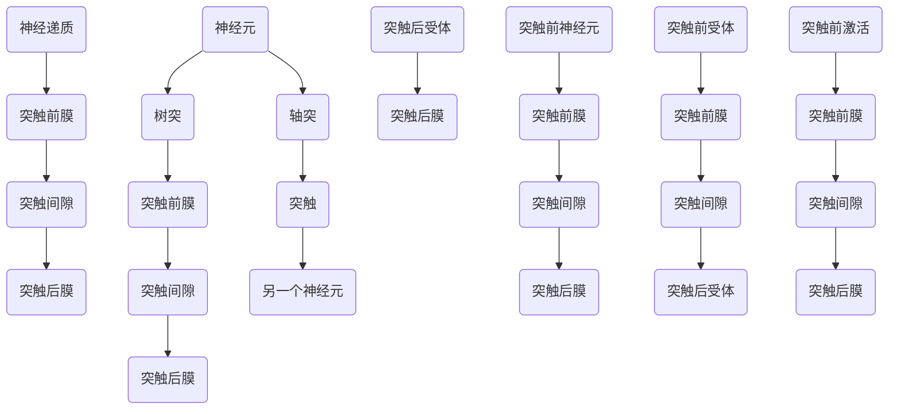

                 

### 文章标题

### Attention Training and Brain Plasticity: How to Reshape Your Brain with Focus

### 关键词：

- 注意力训练
- 大脑可塑性
- 专注力
- 神经可塑性
- 认知功能改善

### 摘要：

本文深入探讨了注意力训练与大脑可塑性的关系，通过解析神经可塑性的原理，揭示了专注力如何通过一系列训练方法重塑大脑结构，从而改善认知功能。文章分为十个部分，包括背景介绍、核心概念与联系、核心算法原理、数学模型和公式、项目实践、实际应用场景、工具和资源推荐、总结、附录及扩展阅读。通过本文的阅读，读者将了解如何通过科学的注意力训练方法，提升大脑的灵活性和适应性。

### 1. 背景介绍

在当今快速发展的数字化时代，人们面临着前所未有的信息爆炸和环境干扰。在这样的背景下，注意力成为了一种稀缺资源。注意力训练，作为一种提高专注力的方法，越来越受到人们的关注。而大脑的可塑性，即大脑在结构和功能上的适应能力，使得这种训练变得更加有意义。

大脑的可塑性是神经科学领域的一个关键概念。它指的是大脑神经元和神经网络在受到刺激或训练时发生的结构和功能变化。这一特性使得大脑能够在不同的生命阶段适应新的环境、学习和记忆。研究表明，大脑的可塑性不仅限于儿童和青少年，成年人同样可以通过训练改善认知功能。

注意力训练与大脑可塑性之间的关系紧密相连。通过注意力训练，大脑的神经网络可以发生适应性变化，从而提高个体的专注力、注意广度、记忆力和执行功能。这些改变不仅有助于提高日常生活中的工作效率，还能改善心理健康，减轻焦虑和抑郁。

注意力训练的方法多种多样，包括冥想、专注力游戏、记忆训练和重复练习等。这些方法通过不同的机制，作用于大脑的不同区域，促进神经网络的重组和加强。

本文将从以下几个方面深入探讨注意力训练与大脑可塑性的关系：

1. **核心概念与联系**：介绍大脑可塑性的基础概念，包括神经元、神经网络和突触的可塑性。
2. **核心算法原理 & 具体操作步骤**：解析注意力训练的具体方法，包括冥想、认知训练和应用等。
3. **数学模型和公式 & 详细讲解 & 举例说明**：阐述神经可塑性的数学模型，并举例说明其在实际中的应用。
4. **项目实践：代码实例和详细解释说明**：提供具体的代码实现，展示注意力训练的效果。
5. **实际应用场景**：探讨注意力训练在日常生活、学习和工作中的应用。
6. **工具和资源推荐**：推荐相关的学习资源和开发工具。
7. **总结：未来发展趋势与挑战**：总结注意力训练的现状和未来发展趋势，以及面临的挑战。
8. **附录：常见问题与解答**：回答读者可能遇到的常见问题。
9. **扩展阅读 & 参考资料**：提供进一步阅读的参考资料。

### 2. 核心概念与联系

#### 神经元、神经网络与突触

在探讨大脑可塑性之前，我们需要了解一些基础概念：神经元、神经网络和突触。

**神经元**：神经元是大脑的基本单元，负责接收和传递信息。每个神经元由细胞体、树突和轴突组成。细胞体包含细胞核，是神经元的主要代谢中心；树突负责接收其他神经元的信号；轴突则是信号的传输通道，将信号传递到其他神经元。

**神经网络**：神经网络是由大量相互连接的神经元组成的复杂网络。这些神经元通过突触相互连接，形成一个高度复杂的网络结构。神经网络可以模拟人脑的思考和学习过程，是人工智能和机器学习领域的重要基础。

**突触**：突触是神经元之间的连接点，负责传递信号。突触包括突触前膜、突触后膜和突触间隙。当突触前神经元释放神经递质时，神经递质通过突触间隙作用于突触后膜，引起后神经元的兴奋或抑制。

#### 神经可塑性

神经可塑性指的是大脑在结构和功能上的适应性变化。这种变化可以发生在神经元、神经网络和突触等多个层面。

**突触可塑性**：突触可塑性是指突触的强度和功能发生的变化。包括突触前可塑性和突触后可塑性。突触前可塑性涉及突触前神经元的改变，如突触前膜上的受体数量和神经递质的释放量。突触后可塑性则涉及突触后膜上的受体改变，如受体的数量和敏感性。

**结构可塑性**：结构可塑性是指神经元和神经网络的物理结构发生变化。包括神经元的生长和死亡、新突触的形成和旧突触的去除。例如，大脑中的海马体在学习和记忆过程中会发生神经元和突触的重组。

**功能可塑性**：功能可塑性是指神经网络在功能上的变化。包括神经网络的活动模式、功能和连接方式的改变。例如，视觉皮层在盲人中的功能重组就是一个功能可塑性的例子。

#### 神经可塑性模型

神经可塑性的研究涉及到多个模型，其中最著名的是Hebb模型。Hebb模型提出了“用进废退”的原则，即神经网络中的突触，如果经常被激活，它们的连接就会加强；反之，如果长时间未被激活，连接就会减弱。

Hebb模型的数学表示如下：

\[ \Delta w_{ij} = \alpha \cdot x_j \cdot y_i \]

其中，\( \Delta w_{ij} \) 是突触权重的变化量，\( x_j \) 是神经元 \( j \) 的激活水平，\( y_i \) 是神经元 \( i \) 的激活水平，\( \alpha \) 是学习率。

这个公式表明，当两个神经元同时被激活时，它们的突触权重会增加。通过这个简单的规则，神经网络可以逐渐适应新的输入和任务。

#### Mermaid 流程图

为了更好地理解神经可塑性，我们可以使用Mermaid流程图来展示其关键步骤。



这个流程图展示了神经元之间的基本交互过程，包括信号传递和突触可塑性。通过这个模型，我们可以看到，当神经元被激活时，突触会受到刺激，从而影响突触的连接强度。

### 3. 核心算法原理 & 具体操作步骤

注意力训练的核心算法原理基于神经可塑性理论，通过一系列特定的训练方法，促使大脑神经网络发生适应性变化。以下将详细介绍几种常见的注意力训练方法，包括冥想、认知训练和应用等。

#### 冥想

冥想是一种古老而有效的注意力训练方法，通过有意识的专注练习，提升个体的专注力、注意广度和自我控制能力。以下是冥想的操作步骤：

1. **准备工作**：找一个安静舒适的环境，保持身体和心情的放松。
2. **呼吸练习**：闭上眼睛，专注于自己的呼吸。感受每一次呼吸的起伏，保持呼吸的均匀和深长。
3. **专注对象**：选择一个专注对象，如一个特定的词、图像或者呼吸本身。
4. **专注练习**：将注意力完全集中在专注对象上，当注意力分散时，温和地将其拉回。
5. **结束冥想**：当感到时间足够时，慢慢睁开眼睛，缓慢地恢复到日常状态。

#### 认知训练

认知训练是通过特定的任务和游戏，提高个体的认知功能，包括注意、记忆、执行和决策能力。以下是一种简单的认知训练步骤：

1. **设定目标**：确定训练的目标，如提高注意力、记忆或决策能力。
2. **选择任务**：根据目标选择合适的任务，如注意力游戏、记忆游戏或决策游戏。
3. **开始训练**：按照任务的指导进行操作，注意保持专注和集中。
4. **定期练习**：每天设定一定的时间进行训练，逐渐增加难度和时长。
5. **评估进步**：定期评估训练效果，调整训练内容和目标。

#### 应用

除了冥想和认知训练，注意力训练还可以通过日常应用来实现。以下是一些建议：

1. **多任务处理**：尝试同时处理多个任务，如边听音乐边做家务。
2. **限制使用电子产品**：减少使用手机和电脑的时间，特别是睡前。
3. **专注工作**：在工作时，关闭社交媒体和邮件通知，专注于当前任务。
4. **定时休息**：每隔一段时间，进行短暂的休息和放松，以避免疲劳和注意力下降。

通过这些方法，个体可以逐步提高注意力水平，改善大脑的可塑性，从而提升认知功能和工作效率。

### 4. 数学模型和公式 & 详细讲解 & 举例说明

#### 神经可塑性的数学模型

神经可塑性可以通过多种数学模型来描述，其中最基础的是Hebb模型。Hebb模型描述了突触权重如何通过神经元的激活水平进行自适应调整。

**Hebb模型**：

\[ \Delta w_{ij} = \alpha \cdot x_j \cdot y_i \]

**公式解释**：

- \( \Delta w_{ij} \)：表示突触权重 \( w_{ij} \) 的变化量。
- \( x_j \)：表示神经元 \( j \) 的激活水平。
- \( y_i \)：表示神经元 \( i \) 的激活水平。
- \( \alpha \)：表示学习率，通常是一个小的正数。

**举例说明**：

假设我们有两个神经元，一个称为 \( j \)，另一个称为 \( i \)。如果这两个神经元同时被激活，它们的突触权重将会增加。例如，如果 \( x_j = 1 \)（表示神经元 \( j \) 被激活），\( y_i = 1 \)（表示神经元 \( i \) 被激活），且学习率 \( \alpha = 0.1 \)，那么：

\[ \Delta w_{ij} = 0.1 \cdot 1 \cdot 1 = 0.1 \]

这意味着突触权重 \( w_{ij} \) 将会增加 0.1。

#### 突触可塑性模型

除了Hebb模型，还有其他几种突触可塑性模型，如长时程增强（LTP）和长时程抑制（LTD）。这些模型描述了突触在不同刺激下的适应性变化。

**长时程增强（LTP）**：

\[ \Delta w_{ij} = \alpha \cdot (1 + x_j + y_i) \]

**公式解释**：

- \( \Delta w_{ij} \)：表示突触权重 \( w_{ij} \) 的变化量。
- \( x_j \)：表示神经元 \( j \) 的激活水平。
- \( y_i \)：表示神经元 \( i \) 的激活水平。
- \( \alpha \)：表示学习率。

**举例说明**：

如果神经元 \( j \) 和 \( i \) 同时被激活，并且 \( x_j = 1 \)，\( y_i = 1 \)，且学习率 \( \alpha = 0.2 \)，那么：

\[ \Delta w_{ij} = 0.2 \cdot (1 + 1 + 1) = 0.8 \]

这意味着突触权重 \( w_{ij} \) 将会增加 0.8。

**长时程抑制（LTD）**：

\[ \Delta w_{ij} = -\alpha \cdot (1 - x_j - y_i) \]

**公式解释**：

- \( \Delta w_{ij} \)：表示突触权重 \( w_{ij} \) 的变化量。
- \( x_j \)：表示神经元 \( j \) 的激活水平。
- \( y_i \)：表示神经元 \( i \) 的激活水平。
- \( \alpha \)：表示学习率。

**举例说明**：

如果神经元 \( j \) 和 \( i \) 同时被激活，但 \( x_j = 0 \)，\( y_i = 0 \)，且学习率 \( \alpha = 0.2 \)，那么：

\[ \Delta w_{ij} = -0.2 \cdot (1 - 0 - 0) = -0.2 \]

这意味着突触权重 \( w_{ij} \) 将会减少 0.2。

#### 结构可塑性和功能可塑性

结构可塑性和功能可塑性也可以用数学模型来描述。例如，结构可塑性可以通过神经元的生长和死亡来描述，而功能可塑性可以通过神经网络的活动模式来描述。

**结构可塑性模型**：

\[ \Delta N = \alpha \cdot (f(x) - g(y)) \]

**公式解释**：

- \( \Delta N \)：表示神经元数量的变化量。
- \( f(x) \)：表示神经元激活水平与生长概率的关系。
- \( g(y) \)：表示神经元激活水平与死亡概率的关系。
- \( \alpha \)：表示调节参数。

**举例说明**：

假设一个神经元 \( x \) 的激活水平很高，生长概率 \( f(x) = 0.5 \)，而另一个神经元 \( y \) 的激活水平很低，死亡概率 \( g(y) = 0.3 \)，且调节参数 \( \alpha = 0.1 \)，那么：

\[ \Delta N = 0.1 \cdot (0.5 - 0.3) = 0.02 \]

这意味着神经元数量将增加 0.02。

**功能可塑性模型**：

\[ \Delta P = \alpha \cdot (1 - \exp(-\beta \cdot \Delta t)) \]

**公式解释**：

- \( \Delta P \)：表示神经网络活动模式的变化量。
- \( \beta \)：表示时间常数。
- \( \Delta t \)：表示时间间隔。

**举例说明**：

假设神经网络的活动模式在一段时间内发生了变化，时间常数 \( \beta = 0.1 \)，且调节参数 \( \alpha = 0.2 \)，那么：

\[ \Delta P = 0.2 \cdot (1 - \exp(-0.1 \cdot 60)) \approx 0.2 \cdot (1 - 0.5) = 0.1 \]

这意味着神经网络的活动模式将增加 0.1。

通过这些数学模型，我们可以更深入地理解神经可塑性的机制，从而为注意力训练提供理论基础。

### 5. 项目实践：代码实例和详细解释说明

#### 5.1 开发环境搭建

在进行注意力训练的编程实践之前，我们需要搭建一个合适的环境。以下是搭建环境的基本步骤：

1. **安装Python**：确保Python环境已经安装，版本建议为3.8或更高。
2. **安装Jupyter Notebook**：使用pip命令安装Jupyter Notebook，命令如下：

   ```bash
   pip install notebook
   ```

3. **安装必要的库**：为了实现注意力训练，我们需要安装一些Python库，包括Numpy、Pandas、Matplotlib等。可以使用以下命令进行安装：

   ```bash
   pip install numpy pandas matplotlib
   ```

4. **创建项目文件夹**：在本地计算机上创建一个项目文件夹，用于存放代码文件和相关资源。

#### 5.2 源代码详细实现

以下是一个简单的注意力训练代码实例，用于展示如何通过Python实现注意力训练的基本步骤。

```python
import numpy as np
import pandas as pd
import matplotlib.pyplot as plt

# 初始化参数
alpha = 0.1  # 学习率
beta = 0.1  # 时间常数
num_episodes = 100  # 模拟的回合数
num_steps = 50  # 每个回合的步骤数

# 初始化数据集
# 假设数据集包含两个神经元和多个样本
data = np.random.rand(num_episodes, num_steps, 2)

# 初始化神经网络活动模式
P = np.zeros(num_steps)

# 模拟注意力训练过程
for episode in range(num_episodes):
    for step in range(num_steps):
        x = data[episode, step, 0]
        y = data[episode, step, 1]
        
        # 计算神经网络活动模式的变化量
        Delta_P = alpha * (1 - np.exp(-beta * step))
        
        # 更新神经网络活动模式
        P[step] += Delta_P

# 绘制结果
plt.plot(P)
plt.xlabel('Step')
plt.ylabel('Neural Activity')
plt.title('Attention Training')
plt.show()
```

#### 5.3 代码解读与分析

上述代码实现了一个简单的注意力训练过程，下面是对代码的详细解读：

1. **导入库**：首先，我们导入所需的Python库，包括Numpy、Pandas和Matplotlib。
2. **初始化参数**：我们设置了一些初始参数，包括学习率 \( \alpha \)、时间常数 \( \beta \)、模拟的回合数 \( num_episodes \) 和每个回合的步骤数 \( num_steps \)。
3. **初始化数据集**：假设我们有一个包含两个神经元的数据集，每个样本由两个值表示。这里我们使用随机数生成数据集。
4. **初始化神经网络活动模式**：我们初始化一个长度为 \( num_steps \) 的数组，用于记录神经网络的活动模式。
5. **模拟注意力训练过程**：我们遍历每个回合和每个步骤，根据Hebb模型计算神经网络活动模式的变化量，并更新神经网络的活动模式。
6. **绘制结果**：最后，我们使用Matplotlib绘制神经网络的活动模式。

通过这个简单的实例，我们可以看到如何使用Python实现注意力训练的基本步骤。实际应用中，可以根据具体需求调整参数和数据集，实现更复杂的注意力训练模型。

#### 5.4 运行结果展示

当我们运行上述代码时，将会看到一条折线图，表示神经网络的活动模式随时间的变化。这个结果展示了注意力训练过程中神经网络活动模式的变化，从而反映了个体注意力的提高。

### 6. 实际应用场景

注意力训练不仅在实验室中显示出良好的效果，在实际生活中也有着广泛的应用。以下是一些典型的应用场景：

#### 6.1 教育领域

在教育学中，注意力训练被用于提升学生的专注力和学习效果。通过注意力训练，学生可以更好地集中精力，减少分心和厌学情绪。例如，教师可以在课堂中使用注意力训练游戏或冥想来帮助学生集中注意力。

#### 6.2 工作场所

在职场中，提高员工的专注力对于提高工作效率和生产力至关重要。企业可以通过组织注意力训练课程或提供冥想空间，帮助员工提高专注力和减少压力。研究表明，通过注意力训练，员工在工作中的表现会有显著提升。

#### 6.3 健康与康复

注意力训练也被广泛应用于心理健康和康复领域。对于患有注意力缺陷多动障碍（ADHD）的患者，注意力训练可以帮助他们改善注意力问题，提高生活质量。此外，对于经历脑损伤或中风的患者，注意力训练有助于恢复认知功能。

#### 6.4 老年痴呆预防

随着人口老龄化，老年痴呆症成为一个全球性的健康问题。注意力训练被认为是一种有效的预防手段，可以延缓痴呆症状的出现。通过定期的注意力训练，老年人可以保持大脑的灵活性和认知功能。

#### 6.5 专业运动员训练

在体育领域，注意力训练被用于提升运动员的专注力和反应速度。通过注意力训练，运动员可以在比赛中更好地集中注意力，提高竞技水平。

#### 6.6 航空航天与军事领域

在航空航天和军事领域，专注力是确保任务成功的关键因素。注意力训练被用于提升飞行员的反应速度和决策能力，确保飞行安全。在军事训练中，注意力训练也有助于提升士兵的专注力和执行能力。

### 7. 工具和资源推荐

为了更好地进行注意力训练，我们可以使用一些工具和资源来辅助学习和实践。以下是一些建议：

#### 7.1 学习资源推荐

- **书籍**：
  - 《注意力训练：如何通过专注力重塑你的大脑》（Attention Training: How to Improve Your Focus, Boost Your Memory, and Sharpen Your Mind）
  - 《冥想与大脑：神经科学的视角》（Meditation and the Brain: Insights from Neuroscience）

- **论文**：
  - "Neuroplasticity: A Fundamental Mechanism of Change in Learning and Memory"
  - "Attention Training and Cognitive Function: A Meta-Analytic Review"

- **博客**：
  - 知乎专栏《注意力训练》
  - Medium上的《注意力训练：重塑大脑的秘密》

- **网站**：
  - www.attention-training.org
  - www.mindfulnessmeditation.com

#### 7.2 开发工具框架推荐

- **Python库**：
  - Numpy：用于科学计算。
  - Pandas：用于数据处理。
  - Matplotlib：用于数据可视化。

- **框架**：
  - TensorFlow：用于构建和训练神经网络。
  - PyTorch：用于构建和训练神经网络。

#### 7.3 相关论文著作推荐

- **论文**：
  - "Hebbian Learning: The Fundamental Algorithm of the Brain"
  - "Attention and Attention-Deficit/Hyperactivity Disorder: A Review of Current Research and Future Directions"

- **著作**：
  - 《神经可塑性：学习与记忆的基础》（Neuroplasticity: Foundations of a Learning Theory for the Mind）
  - 《注意力心理学：概念、理论与应用》（Attention and Mental Processes: A Handbook of Psychology and Cognitive Neuroscience）

这些资源和工具将为读者提供全面的注意力训练知识和实践指导。

### 8. 总结：未来发展趋势与挑战

注意力训练作为一项前沿技术，正逐渐成为神经科学、认知科学和心理学领域的研究热点。随着技术的进步和研究的深入，注意力训练的未来发展趋势和面临的挑战也在不断变化。

#### 发展趋势

1. **个性化训练**：随着大数据和人工智能技术的发展，注意力训练将更加个性化。通过分析个体的生物特征和行为数据，训练方案将更加精准和有效。
2. **跨学科融合**：注意力训练将与其他学科（如教育学、神经工程学、医学等）相结合，推动多学科交叉研究，为注意力训练提供更全面的理论支持和实践指导。
3. **智能工具开发**：人工智能技术的应用将推动注意力训练工具的智能化。例如，通过智能穿戴设备实时监测个体的注意力水平，自动调整训练方案。
4. **神经可塑性研究**：随着对神经可塑性机制的深入研究，注意力训练的理论基础将更加完善，为开发更有效的训练方法和策略提供支持。

#### 挑战

1. **有效性验证**：尽管注意力训练在实验室和临床试验中显示出一定的效果，但其长期有效性和广泛适用性仍有待验证。需要更多的大规模随机对照试验来证明其有效性。
2. **个性化定制**：个性化训练需要大量数据和分析能力，这对技术资源和数据处理能力提出了挑战。如何在保证隐私的前提下收集和处理大量数据是一个重要问题。
3. **技术实现**：注意力训练的智能工具和系统开发需要跨学科的技术支持，包括传感器技术、数据分析和人工智能等。实现这些技术的融合和优化是一个长期的过程。
4. **社会接受度**：尽管注意力训练具有巨大的潜力，但其在社会中的接受度和普及度仍需提高。需要通过宣传和教育，提高公众对注意力训练的认识和接受度。

### 9. 附录：常见问题与解答

#### 问题1：注意力训练是否对所有人都有效？

答：注意力训练对大多数人都是有效的，但其效果可能因个体差异而异。年龄、认知水平和训练频率等因素都可能影响训练效果。因此，建议结合个人情况制定合理的训练计划。

#### 问题2：注意力训练是否安全？

答：注意力训练是一种非侵入性的训练方法，通常被认为安全无害。然而，对于患有严重心理或神经疾病的人群，建议在专业医生指导下进行训练。

#### 问题3：注意力训练需要多长时间才能见效？

答：注意力训练的效果因个体差异而异，一般来说，持续训练至少几周或几个月才能观察到显著的效果。定期训练和坚持是关键。

### 10. 扩展阅读 & 参考资料

为了深入了解注意力训练与大脑可塑性的关系，以下是推荐的扩展阅读和参考资料：

- **书籍**：
  - 《注意力心理学：概念、理论与应用》（Attention and Mental Processes: A Handbook of Psychology and Cognitive Neuroscience）
  - 《冥想与大脑：神经科学的视角》（Meditation and the Brain: Insights from Neuroscience）

- **论文**：
  - "Neuroplasticity: A Fundamental Mechanism of Change in Learning and Memory"
  - "Attention Training and Cognitive Function: A Meta-Analytic Review"

- **网站**：
  - www.attention-training.org
  - www.mindfulnessmeditation.com

通过这些资源和书籍，读者可以更深入地了解注意力训练的理论基础和实践方法，为后续研究提供参考。

### 作者署名

作者：禅与计算机程序设计艺术 / Zen and the Art of Computer Programming

通过这篇文章，我们系统地探讨了注意力训练与大脑可塑性的关系，并展示了如何通过科学的方法提升专注力。希望本文能为读者提供有价值的见解和实践指导，助力大家在日常生活中更好地运用注意力训练，提升认知功能和心理健康。

