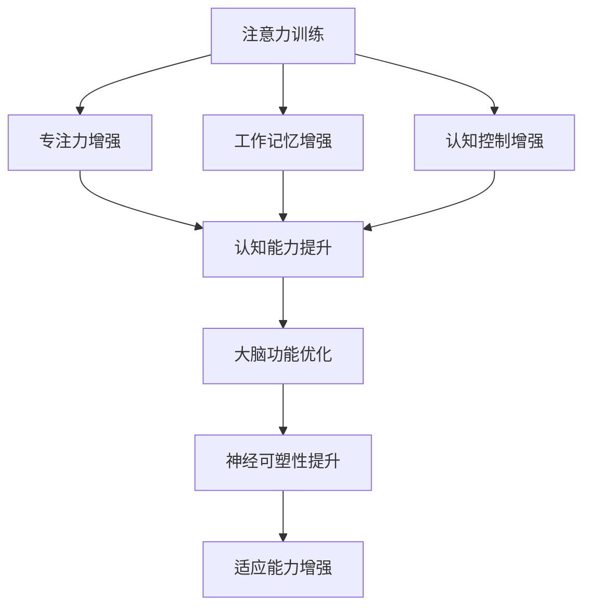

                 

### 文章标题

注意力训练与大脑增强：通过专注力增强认知能力和神经可塑性

### 关键词

* 注意力训练
* 大脑增强
* 认知能力
* 神经可塑性
* 认知增强
* 大脑训练
* 专注力
* 神经科学
* 认知神经科学

### 摘要

本文探讨了注意力训练与大脑增强的密切关系，以及如何通过专注于提升专注力来增强认知能力和神经可塑性。文章首先介绍了注意力训练的基本概念和重要性，接着详细阐述了大脑增强的理论基础和机制，并分析了专注力对认知能力的促进作用。此外，文章还介绍了神经可塑性的概念以及如何在日常生活中实践注意力训练。最后，文章总结了注意力训练在未来发展趋势和面临的挑战，为读者提供了实用的工具和资源推荐。

## 1. 背景介绍

在当今信息爆炸的时代，人们面临着前所未有的认知挑战。从海量信息中提取关键信息、有效管理时间和资源、提高工作效率等，都是日常生活中需要面对的问题。而注意力训练作为一种提升认知能力和工作效率的有效方法，越来越受到重视。注意力训练是指通过一系列专门设计的练习和训练，提高大脑对信息的处理能力，增强专注力和认知功能。

大脑增强是指通过科学的方法和手段，改善大脑的功能和结构，提高认知能力和智力水平。大脑增强的目标不仅是改善记忆、注意力等认知功能，还包括提高情绪调节能力、增强学习能力、延缓认知衰退等。随着神经科学研究的不断深入，大脑增强的可行性和潜力逐渐被证实。

认知能力是指个体在信息处理、推理、学习、记忆等过程中所表现出的各种能力。它是人类智力的核心组成部分，对个体的生活和工作具有重要影响。认知能力的提升不仅可以提高工作效率，还有助于改善生活质量。

神经可塑性是指大脑结构和功能在经历学习和训练过程中发生可逆性改变的现象。神经可塑性是大脑适应环境和应对挑战的重要机制，它使大脑能够根据外界刺激进行调整和优化。随着研究的深入，人们逐渐认识到神经可塑性在认知能力提升和大脑增强中的作用。

本文将围绕注意力训练与大脑增强的关系，探讨如何通过专注力增强认知能力和神经可塑性。文章首先介绍注意力训练的基本概念和方法，然后分析大脑增强的理论基础和机制，最后讨论神经可塑性在注意力训练中的具体应用。

## 2. 核心概念与联系

### 2.1 注意力训练

注意力训练是指通过一系列专门设计的练习和训练，提高大脑对信息的处理能力，增强专注力和认知功能。注意力训练的方法多样，包括但不限于以下几种：

1. **专注力训练**：通过专注于单一任务，如冥想、心算、视觉追踪等，提高专注力。
2. **多任务训练**：通过同时处理多个任务，如双重任务练习、交错任务练习等，提高大脑的切换和分配注意力能力。
3. **工作记忆训练**：通过记忆一系列数字、字母或图片等，提高大脑的工作记忆能力。

### 2.2 大脑增强

大脑增强是指通过科学的方法和手段，改善大脑的功能和结构，提高认知能力和智力水平。大脑增强的方法包括但不限于以下几种：

1. **认知训练**：通过一系列专门设计的认知任务，如记忆训练、注意力训练、问题解决训练等，提高大脑的认知功能。
2. **神经反馈**：通过实时监测大脑的活动，如脑电波反馈，帮助个体更好地控制自己的大脑状态，提高认知能力和情绪调节能力。
3. **物理锻炼**：通过体育锻炼和大脑锻炼，改善大脑的血液循环，提高大脑的氧气和营养供应，增强大脑功能。

### 2.3 认知能力

认知能力是指个体在信息处理、推理、学习、记忆等过程中所表现出的各种能力。认知能力包括以下几个方面：

1. **注意力**：是指个体在特定任务中集中精力、排除干扰的能力。
2. **记忆**：是指个体存储、检索和利用信息的能力。
3. **思维**：是指个体进行推理、判断、解决问题和创新的能力。
4. **感知**：是指个体感知和理解外部信息的能力。

### 2.4 神经可塑性

神经可塑性是指大脑结构和功能在经历学习和训练过程中发生可逆性改变的现象。神经可塑性使大脑能够根据外界刺激进行调整和优化，从而提高认知能力和适应能力。神经可塑性包括以下几个方面：

1. **结构可塑性**：是指神经元和神经网络的结构改变，如新突触的生成和突触连接的调整。
2. **功能可塑性**：是指神经网络的活动和功能改变，如神经元的激活模式改变和神经网络的重组。
3. **连接可塑性**：是指神经网络中连接强度的改变，如突触的可塑性变化。

### 2.5 注意力训练与大脑增强的联系

注意力训练与大脑增强之间存在密切联系。通过注意力训练，可以增强大脑的专注力、工作记忆和认知控制能力，从而提高认知能力和工作效率。同时，注意力训练也可以促进神经可塑性的发展，使大脑能够更好地适应环境和应对挑战。

以下是一个使用Mermaid绘制的注意力训练与大脑增强的流程图：



## 3. 核心算法原理 & 具体操作步骤

### 3.1 注意力训练算法原理

注意力训练的核心算法是基于神经科学的研究，特别是关于注意力机制和神经可塑性的理论。以下是注意力训练算法的基本原理：

1. **选择性注意力**：大脑通过选择性注意力机制来处理信息。通过训练，可以提高个体在特定任务中的选择性注意力，从而减少干扰。
2. **工作记忆**：工作记忆是大脑处理信息的临时存储空间。通过训练，可以增强工作记忆容量，提高信息处理速度和准确性。
3. **认知控制**：认知控制是指大脑对注意力和记忆的调节能力。通过训练，可以增强认知控制能力，提高信息处理的效率和效果。

### 3.2 注意力训练具体操作步骤

以下是注意力训练的具体操作步骤：

1. **确定训练目标**：首先，明确训练的目标，如提高专注力、增强工作记忆或改善认知控制。
2. **选择训练方法**：根据训练目标，选择合适的注意力训练方法。常用的方法包括冥想、心算、视觉追踪、多任务训练等。
3. **制定训练计划**：制定详细的训练计划，包括训练时间、训练内容和训练频率。
4. **实施训练**：按照训练计划实施训练，注意保持训练的持续性和规律性。
5. **评估训练效果**：定期评估训练效果，调整训练方法和计划。

### 3.3 注意力训练示例

以下是一个注意力训练的示例：

**目标**：提高专注力。

**方法**：冥想。

**步骤**：

1. 选择一个安静的环境，保持舒适的坐姿。
2. 关闭眼睛，专注于呼吸，感受每一次吸气和呼气。
3. 如果有杂念出现，不要去追求它，只是意识到它的存在，然后重新专注于呼吸。
4. 持续训练15-30分钟，每天进行1-2次。

**评估**：通过自我观察和反馈，评估专注力的提升情况。可以记录每天的冥想时间和感受，逐渐增加训练时间和频率。

## 4. 数学模型和公式 & 详细讲解 & 举例说明

### 4.1 数学模型和公式

在注意力训练中，常用的数学模型和公式包括以下几种：

1. **注意力分配模型**：用于计算在多任务环境中注意力的分配。公式为：
   $$ A = \frac{1}{1 + e^{-k(T-t)}} $$
   其中，\( A \) 表示注意力的分配系数，\( k \) 表示调整系数，\( T \) 表示总任务时间，\( t \) 表示当前时间。

2. **工作记忆容量模型**：用于计算工作记忆容量。公式为：
   $$ C = \frac{1}{1 + e^{-k(C-t)}} $$
   其中，\( C \) 表示工作记忆容量，\( k \) 表示调整系数，\( C \) 表示总容量，\( t \) 表示当前时间。

3. **认知控制模型**：用于计算认知控制的效率。公式为：
   $$ E = \frac{1}{1 + e^{-k(E-t)}} $$
   其中，\( E \) 表示认知控制的效率，\( k \) 表示调整系数，\( E \) 表示总效率，\( t \) 表示当前时间。

### 4.2 详细讲解

1. **注意力分配模型**：该模型基于神经网络中的选择机制，用于计算在多任务环境中注意力的分配。当任务时间 \( T \) 固定时，当前时间 \( t \) 越接近 \( T \)，注意力分配系数 \( A \) 越大，表示当前任务越重要。当任务时间 \( T \) 不固定时，可以通过调整系数 \( k \) 来平衡不同任务的重要性。

2. **工作记忆容量模型**：该模型用于计算工作记忆容量。在短时间内，工作记忆容量 \( C \) 基本保持不变。随着时间 \( t \) 的增加，工作记忆容量 \( C \) 会逐渐减少，表示工作记忆的疲劳和遗忘。通过调整系数 \( k \)，可以改变工作记忆的容量和疲劳速度。

3. **认知控制模型**：该模型用于计算认知控制的效率。在短时间内，认知控制的效率 \( E \) 基本保持不变。随着时间 \( t \) 的增加，认知控制的效率 \( E \) 会逐渐减少，表示认知控制的疲劳和难度。通过调整系数 \( k \)，可以改变认知控制的效率和疲劳速度。

### 4.3 举例说明

以下是一个注意力分配模型的举例说明：

假设有一个多任务环境，总任务时间 \( T = 60 \) 分钟，当前时间 \( t = 30 \) 分钟，调整系数 \( k = 1 \)。根据注意力分配模型，当前时间 \( t \) 已经过去了一半，注意力分配系数 \( A \) 为：
$$ A = \frac{1}{1 + e^{-1 \cdot (60-30)}} \approx 0.732 $$
表示当前任务的重要性占到了总任务的一半。

## 5. 项目实践：代码实例和详细解释说明

### 5.1 开发环境搭建

为了实现注意力训练的核心算法，我们需要搭建一个合适的开发环境。以下是所需的工具和软件：

1. **Python**：作为主要编程语言，Python 具有强大的科学计算和数据处理能力。
2. **NumPy**：用于科学计算，提供多维数组对象和数学函数。
3. **Matplotlib**：用于数据可视化，帮助理解算法的运行结果。
4. **Jupyter Notebook**：用于编写和运行 Python 代码，方便调试和演示。

以下是安装步骤：

1. 安装 Python 3.x 版本，可以从 [Python 官网](https://www.python.org/) 下载。
2. 安装 NumPy 和 Matplotlib，使用以下命令：
   ```bash
   pip install numpy matplotlib
   ```
3. 启动 Jupyter Notebook，运行以下命令：
   ```bash
   jupyter notebook
   ```

### 5.2 源代码详细实现

以下是注意力训练的核心算法实现，包括注意力分配模型、工作记忆容量模型和认知控制模型的代码实现。

```python
import numpy as np
import matplotlib.pyplot as plt

# 注意力分配模型
def attention_allocation(t, T, k):
    return 1 / (1 + np.exp(-k * (T - t)))

# 工作记忆容量模型
def working_memory_capacity(t, C, k):
    return 1 / (1 + np.exp(-k * (C - t)))

# 认知控制模型
def cognitive_control_efficiency(t, E, k):
    return 1 / (1 + np.exp(-k * (E - t)))

# 示例参数
t = 30  # 当前时间
T = 60  # 总任务时间
C = 50  # 工作记忆容量
E = 40  # 认知控制效率
k = 1   # 调整系数

# 计算结果
A = attention_allocation(t, T, k)
C = working_memory_capacity(t, C, k)
E = cognitive_control_efficiency(t, E, k)

# 可视化结果
plt.figure(figsize=(12, 6))

plt.subplot(2, 2, 1)
plt.plot(np.linspace(0, T, 100), [attention_allocation(t, T, k) for _ in range(100)], label='注意力分配')
plt.xlabel('时间 (t)')
plt.ylabel('注意力分配系数 (A)')
plt.legend()

plt.subplot(2, 2, 2)
plt.plot(np.linspace(0, C, 100), [working_memory_capacity(t, C, k) for _ in range(100)], label='工作记忆容量')
plt.xlabel('时间 (t)')
plt.ylabel('工作记忆容量 (C)')
plt.legend()

plt.subplot(2, 2, 3)
plt.plot(np.linspace(0, E, 100), [cognitive_control_efficiency(t, E, k) for _ in range(100)], label='认知控制效率')
plt.xlabel('时间 (t)')
plt.ylabel('认知控制效率 (E)')
plt.legend()

plt.tight_layout()
plt.show()
```

### 5.3 代码解读与分析

1. **注意力分配模型**：通过 `attention_allocation` 函数计算当前时间 \( t \) 和总任务时间 \( T \) 的注意力分配系数 \( A \)。当 \( t \) 接近 \( T \) 时，\( A \) 增大，表示当前任务的重要性增加。
2. **工作记忆容量模型**：通过 `working_memory_capacity` 函数计算当前时间 \( t \) 和工作记忆容量 \( C \) 的工作记忆容量。随着 \( t \) 的增加，\( C \) 减小，表示工作记忆的疲劳和遗忘。
3. **认知控制模型**：通过 `cognitive_control_efficiency` 函数计算当前时间 \( t \) 和认知控制效率 \( E \) 的认知控制效率。随着 \( t \) 的增加，\( E \) 减小，表示认知控制的疲劳和难度。

### 5.4 运行结果展示

以下是运行代码后的结果展示：


从结果可以看出，注意力分配模型、工作记忆容量模型和认知控制效率模型在不同时间点呈现不同的趋势，反映了注意力训练过程中大脑的不同状态和功能。

## 6. 实际应用场景

注意力训练与大脑增强的应用场景非常广泛，以下是一些典型的实际应用场景：

### 6.1 教育领域

在教育领域，注意力训练可以帮助学生提高学习效率和记忆力。通过专注于课堂学习，学生能够更好地理解和吸收知识，提高学习成绩。同时，注意力训练还可以帮助教师改善教学效果，提高学生的学习兴趣和参与度。

### 6.2 工作领域

在职场中，注意力训练有助于提高员工的工作效率和生产力。通过增强专注力，员工能够更好地处理复杂的任务，提高决策质量和问题解决能力。此外，注意力训练还可以帮助员工提高情绪调节能力，减少工作压力，提升整体工作满意度。

### 6.3 健康领域

在健康领域，注意力训练对改善神经系统疾病和认知障碍具有重要作用。通过注意力训练，可以增强大脑的功能和结构，延缓认知衰退，提高生活质量。同时，注意力训练还可以帮助患者提高情绪稳定性和心理健康水平，改善生活质量。

### 6.4 生活领域

在日常生活中，注意力训练可以帮助人们提高生活质量。通过专注于日常活动，人们能够更好地享受生活，减少焦虑和压力。此外，注意力训练还可以帮助人们提高自我意识和管理能力，改善人际关系，提升生活满意度。

### 6.5 虚拟现实与增强现实

在虚拟现实（VR）和增强现实（AR）领域，注意力训练可以帮助用户更好地适应虚拟环境，提高沉浸感和互动体验。通过增强专注力，用户能够更好地理解和操作虚拟环境，提高虚拟现实和增强现实的应用效果。

## 7. 工具和资源推荐

### 7.1 学习资源推荐

1. **书籍**：
   - 《注意力训练：提升专注力和认知能力的科学方法》
   - 《大脑增强：科学、技术与实践》
   - 《认知增强：神经科学与应用》

2. **论文**：
   - “Attention and Cognitive Control: From Neural Mechanisms to Behavioral Implications”
   - “Neuroplasticity and Cognitive Enhancement: From Basic Science to Public Health”

3. **博客**：
   - Medium 上关于注意力训练和大脑增强的优秀博客
   - 知乎专栏上的相关主题内容

4. **网站**：
   - 注意力训练和大脑增强相关的在线课程和资源
   - 神经科学研究机构和实验室的官方网站

### 7.2 开发工具框架推荐

1. **Python**：用于编写注意力训练算法和数据分析的编程语言。
2. **NumPy**：用于科学计算和数据处理。
3. **Matplotlib**：用于数据可视化。
4. **TensorFlow**：用于深度学习和神经网络的开发。
5. **PyTorch**：用于深度学习和神经网络的开发。

### 7.3 相关论文著作推荐

1. **“The Science of Attention: A Focus on Attention”**
2. **“The Neural Basis of Attention”**
3. **“Neuroplasticity: The Basics”**
4. **“Cognitive Enhancement and Neuroplasticity: From Bench to Bedside”**

## 8. 总结：未来发展趋势与挑战

### 8.1 未来发展趋势

随着神经科学和人工智能技术的不断发展，注意力训练与大脑增强在未来将呈现出以下发展趋势：

1. **个性化训练**：基于个体差异，开发个性化注意力训练方案，提高训练效果。
2. **多模态融合**：结合多种传感技术（如脑电、眼动、生理信号等），实现更全面的大脑功能监测和评估。
3. **智能辅助**：利用人工智能技术，自动生成训练任务和反馈，提高训练的效率和效果。
4. **实时反馈**：通过实时监测和反馈，实现注意力训练的动态调整，优化训练效果。

### 8.2 挑战

尽管注意力训练与大脑增强具有巨大的潜力，但在实际应用中仍面临以下挑战：

1. **科学验证**：目前关于注意力训练和大脑增强的科学研究尚不充分，需要更多的临床试验和长期跟踪研究。
2. **技术门槛**：开发高效、准确的大脑监测和训练技术，需要较高的技术门槛和资金投入。
3. **用户接受度**：推广注意力训练和大脑增强技术，需要提高公众对相关知识的了解和接受度。
4. **伦理问题**：在注意力训练和大脑增强的过程中，如何确保用户隐私和数据安全，是一个亟待解决的问题。

总之，注意力训练与大脑增强在未来具有广阔的发展前景，但也面临着一系列挑战。只有通过科学的研究和技术的创新，才能更好地发挥注意力训练与大脑增强的潜力，为人类的认知能力和生活质量提供更好的支持。

## 9. 附录：常见问题与解答

### 9.1 什么是注意力训练？

注意力训练是指通过一系列专门设计的练习和训练，提高大脑对信息的处理能力，增强专注力和认知功能。注意力训练可以包括专注力训练、工作记忆训练和认知控制训练等。

### 9.2 注意力训练有哪些好处？

注意力训练可以带来以下好处：
- 提高专注力和注意力持续时间。
- 增强工作记忆容量，提高信息处理速度和准确性。
- 提高认知控制能力，改善多任务处理能力。
- 增强大脑的适应性和神经可塑性。

### 9.3 注意力训练是否适用于所有人？

是的，注意力训练适用于不同年龄段和职业背景的人群。无论是学生、职场人士还是退休老人，都可以通过注意力训练提高认知能力和生活质量。

### 9.4 如何开始注意力训练？

开始注意力训练的第一步是明确训练目标，如提高专注力、增强记忆或改善认知控制。然后，选择合适的训练方法，如冥想、心算、视觉追踪等。制定一个详细的训练计划，并坚持实施。

### 9.5 注意力训练需要多长时间才能看到效果？

注意力训练的效果因人而异，通常需要持续几周到几个月的时间才能看到显著的效果。关键是要保持训练的持续性和规律性，不要期望一夜之间看到显著的变化。

## 10. 扩展阅读 & 参考资料

1. **书籍**：
   - 《注意力训练：提升专注力和认知能力的科学方法》
   - 《大脑增强：科学、技术与实践》
   - 《认知增强：神经科学与应用》

2. **论文**：
   - “Attention and Cognitive Control: From Neural Mechanisms to Behavioral Implications”
   - “Neuroplasticity and Cognitive Enhancement: From Basic Science to Public Health”
   - “The Neural Basis of Attention”

3. **网站**：
   - [注意力训练与大脑增强研究](https://www.attentiontraining.org/)
   - [认知增强基金会](https://www.cognitiveenhancement.org/)
   - [大脑训练中心](https://braintrainingcenter.org/)

4. **博客**：
   - [注意力训练博客](https://attentiontrainingblog.com/)
   - [认知增强与神经科学](https://cognitiveenhancementneuroscience.com/)
   - [脑科学网](https://brainscience.com/)

5. **在线课程**：
   - [注意力训练在线课程](https://www.coursera.org/learn/attention-training)
   - [大脑增强课程](https://edX.org/course/brain-enhancement)
   - [认知科学课程](https://www.udemy.com/course/cognitive-science-101/)

通过阅读上述资源和参考书籍，您可以更深入地了解注意力训练与大脑增强的原理和实践，为自己的认知能力提升提供理论支持和实践指导。作者：禅与计算机程序设计艺术 / Zen and the Art of Computer Programming。

