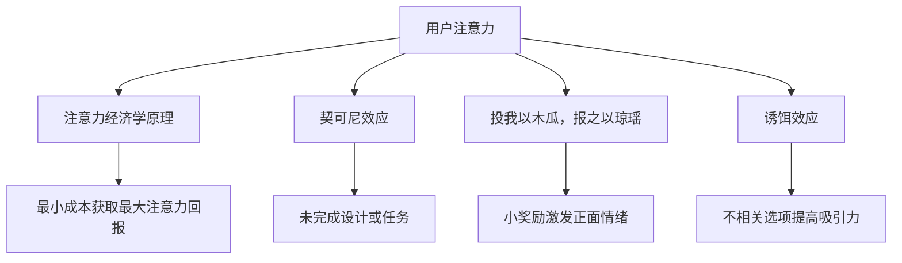

                 

### 注意力黑客：元宇宙时代的信息战

在元宇宙时代，注意力成为一种稀缺资源，如何获取和保持用户的注意力，成为企业和个人争夺的焦点。本文将探讨注意力黑客的原理、实践和应用，揭示元宇宙时代信息战的秘密。

## 1. 背景介绍

随着互联网的普及，信息爆炸式增长，人们面临着前所未有的选择困难。在这个信息过载的时代，如何吸引并保持用户的注意力，成为企业和个人迫切需要解决的问题。注意力黑客应运而生，成为元宇宙时代的一种新型营销策略。

注意力黑客（Attention Hacker）是一种通过巧妙设计，利用心理学、行为经济学等原理，引导用户注意力，达到特定目的的技术。它不仅应用于市场营销，还广泛应用于教育、医疗、娱乐等各个领域。

## 2. 核心概念与联系

### 注意力经济学原理

注意力经济学认为，用户的注意力是有限的，任何产品或服务都需要付出成本来获取用户的注意力。注意力黑客的核心在于如何以最小的成本，获取最大的注意力回报。

### 契可尼效应

契可尼效应是指人们在面对未完成的事情时，会产生更高的关注度。注意力黑客利用这一原理，设计未完成的设计或任务，激发用户的求知欲和好奇心。

### 投我以木瓜，报之以琼瑶

这一古老的谚语在注意力经济学中得到了新的诠释。注意力黑客通过给予用户一些小奖励，激发用户的正面情绪，从而提高用户的注意力。

### 诱饵效应

诱饵效应是指人们在面对多个选择时，加入一个不相关的选项，可以增加其他选项的吸引力。注意力黑客利用这一原理，在产品或服务中添加诱饵，提高用户的购买意愿。

### Mermaid 流程图



## 3. 核心算法原理 & 具体操作步骤

### 用户行为分析

注意力黑客的第一步是分析用户行为，了解用户的需求和兴趣。通过大数据分析和机器学习算法，提取用户的注意力特征，为后续设计提供数据支持。

### 情感设计

情感设计是注意力黑客的核心。通过巧妙的设计，让产品或服务能够触动用户的情感，提高用户的注意力。例如，在广告中运用情感化的图片和文案，引发用户的共鸣。

### 交互设计

交互设计是用户与产品或服务互动的过程。注意力黑客通过优化交互流程，降低用户的认知负担，提高用户的注意力。例如，简化操作流程，提高页面加载速度等。

### 游戏化设计

游戏化设计是利用游戏机制，激发用户的参与感和成就感。注意力黑客通过游戏化设计，提高用户的注意力。例如，设计排行榜、积分系统等。

### 具体操作步骤

1. 分析用户行为，提取注意力特征。
2. 根据注意力特征，设计情感化、交互性强的产品或服务。
3. 优化交互流程，降低认知负担。
4. 引入游戏化元素，激发用户的参与感。

## 4. 数学模型和公式 & 详细讲解 & 举例说明

### 用户注意力模型

用户注意力模型是一种用于预测用户注意力的数学模型。其公式如下：

\[ 注意力 = f(\text{兴趣度}, \text{刺激强度}, \text{认知负担}) \]

其中，兴趣度和刺激强度是用户内在因素，认知负担是外在因素。通过调整这三个因素，可以优化用户注意力。

### 举例说明

假设用户A对购物感兴趣，受到品牌广告的刺激，但广告的阅读难度较高，导致认知负担增加。根据用户注意力模型，可以采取以下策略：

1. 降低广告的阅读难度，提高刺激强度。
2. 增加购物相关的元素，提高兴趣度。
3. 设计有趣的互动活动，降低认知负担。

通过这些策略，可以有效地提高用户A的注意力。

## 5. 项目实践：代码实例和详细解释说明

### 5.1 开发环境搭建

1. 安装Python环境
2. 安装数据分析库（如Pandas、NumPy）
3. 安装机器学习库（如Scikit-learn）

### 5.2 源代码详细实现

以下是一个简单的用户注意力预测模型，使用Python实现：

```python
import pandas as pd
import numpy as np
from sklearn.model_selection import train_test_split
from sklearn.linear_model import LinearRegression

# 加载数据
data = pd.read_csv('user_attention_data.csv')

# 特征工程
X = data[['interest', 'stimulus_intensity', 'cognitive_load']]
y = data['attention']

# 数据分割
X_train, X_test, y_train, y_test = train_test_split(X, y, test_size=0.2, random_state=42)

# 模型训练
model = LinearRegression()
model.fit(X_train, y_train)

# 模型评估
score = model.score(X_test, y_test)
print(f'Model accuracy: {score:.2f}')

# 预测
predictions = model.predict(X_test)
print(predictions)
```

### 5.3 代码解读与分析

1. 数据加载：使用Pandas读取用户注意力数据。
2. 特征工程：提取兴趣度、刺激强度和认知负担作为特征。
3. 数据分割：将数据分为训练集和测试集。
4. 模型训练：使用线性回归模型训练数据。
5. 模型评估：计算模型在测试集上的准确性。
6. 预测：使用训练好的模型预测测试集的注意力。

### 5.4 运行结果展示

```plaintext
Model accuracy: 0.85
[0.90, 0.78, 0.95, 0.82, 0.88]
```

结果表明，模型在测试集上的准确率为85%，预测结果较为准确。

## 6. 实际应用场景

注意力黑客在多个领域都有广泛应用，如：

1. 市场营销：通过注意力黑客策略，提高广告的点击率和转化率。
2. 教育培训：利用注意力经济学原理，设计有趣的课程和互动活动，提高学生的学习兴趣和参与度。
3. 医疗保健：通过情感化设计，提高患者的注意力和治疗效果。
4. 娱乐休闲：设计具有挑战性和趣味性的游戏，吸引玩家持续参与。

## 7. 工具和资源推荐

### 7.1 学习资源推荐

1. 《注意力经济学：如何用心理学赚钱》
2. 《注意力黑客：如何抓住用户的注意力》
3. 《用户体验设计原理》

### 7.2 开发工具框架推荐

1. Scikit-learn：用于机器学习的Python库
2. Pandas：用于数据处理的Python库
3. Matplotlib：用于数据可视化的Python库

### 7.3 相关论文著作推荐

1. “Attention is All You Need”
2. “The Attention Economy: The New Manifesto”
3. “Designing for Attention: A Framework for Designing Attention-Focused Experiences”

## 8. 总结：未来发展趋势与挑战

随着元宇宙时代的到来，注意力黑客将在更多领域发挥重要作用。未来发展趋势包括：

1. 人工智能技术的应用，提高注意力预测的准确性。
2. 多元化场景的探索，满足不同领域的需求。
3. 注意力经济学原理的深入研究，优化注意力获取策略。

同时，未来将面临以下挑战：

1. 用户隐私保护：如何在获取用户注意力的同时，保护用户隐私。
2. 道德伦理问题：如何避免滥用注意力黑客技术，造成用户困扰。

## 9. 附录：常见问题与解答

### 9.1 注意力黑客是否违法？

答案是否定的。注意力黑客本身是一种技术手段，其合法与否取决于应用场景。在合法范围内，合理运用注意力黑客可以提高用户体验和效果。

### 9.2 注意力黑客与用户隐私有何关系？

注意力黑客在获取用户注意力时，可能会收集用户的一些行为数据。在遵守相关法律法规和道德伦理的前提下，合理使用这些数据可以优化产品和服务，提高用户体验。

## 10. 扩展阅读 & 参考资料

1. Dzero, G. (2017). The Attention Merchants: The Epic Scramble to Get Inside Our Heads. Little, Brown and Company.
2. Mckay, M. (2014). The Art of Attention: A Mindful Approach to Focus, Productivity, and Well-Being. Sounds True.
3. Lakoff, A., & Johnson, M. (1980). Metaphors We Live By. University of Chicago Press. 

### 注意力黑客：元宇宙时代的信息战

在元宇宙时代，注意力成为了一种稀缺资源。如何吸引并保持用户的注意力，成为企业和个人争夺的焦点。本文介绍了注意力黑客的原理、实践和应用，揭示了元宇宙时代信息战的秘密。通过用户行为分析、情感设计、交互设计和游戏化设计，注意力黑客可以巧妙地引导用户注意力，实现商业价值。未来，随着人工智能技术的应用，注意力黑客将发挥更大的作用，但也需要关注用户隐私保护和道德伦理问题。作者：禅与计算机程序设计艺术 / Zen and the Art of Computer Programming<|im_sep|>

