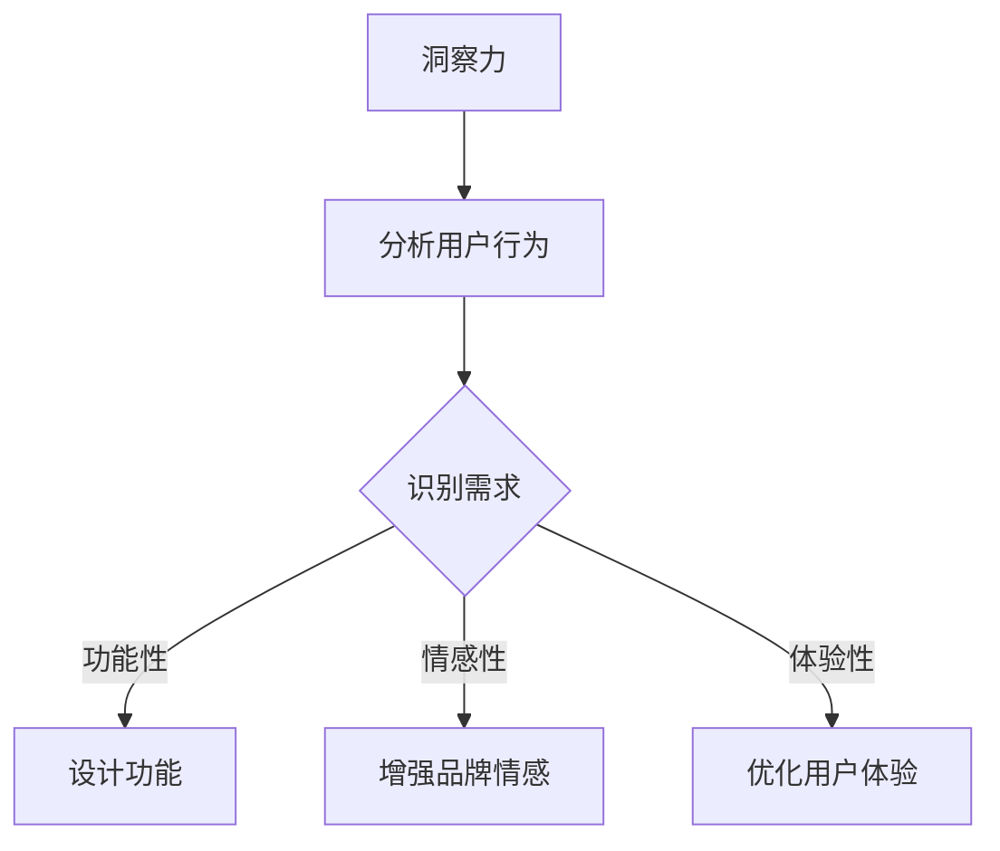

                 

### 洞察力与产品创新：用户需求的深度理解

> 关键词：洞察力、产品创新、用户需求、深度理解、用户体验、产品设计

> 摘要：本文将探讨洞察力在产品创新中的重要性，如何通过深度理解用户需求来实现产品的成功。文章首先介绍了洞察力的概念及其在商业决策中的作用，然后分析了用户需求的核心要素，并探讨了如何通过用户研究、数据分析和用户反馈来获取深度理解。最后，本文提出了基于深度理解的产品创新方法，并分享了成功案例和实践经验。

## 1. 背景介绍

在当今这个快速发展的数字化时代，产品的成功与否在很大程度上取决于其是否符合用户需求。然而，如何准确捕捉和解读用户需求，成为许多企业和开发者面临的挑战。这不仅需要技术上的精通，还需要敏锐的洞察力。

洞察力（Insight）是一种深层次的理解和洞见，它能够揭示问题的本质，预见潜在的趋势，从而为决策提供有力的支持。在产品创新中，洞察力不仅可以帮助我们理解用户需求，还能够激发新的产品创意，推动产品的持续改进。

用户需求（User Needs）是指用户在使用产品时所期望获得的利益和满足。这些需求可以是功能性的，也可以是情感性的。用户需求的多样性使得产品创新变得复杂而充满挑战。

本文将围绕洞察力和用户需求展开讨论，旨在提供一种系统的方法来深入理解用户需求，从而实现产品的创新与成功。

## 2. 核心概念与联系

### 2.1 洞察力

洞察力是一种能够超越表面现象，深入到问题本质的能力。它不仅仅是对数据的分析，更是对用户行为、情感和期望的深入理解。洞察力在商业决策中扮演着至关重要的角色，它能够帮助企业：

- **识别市场机会**：通过洞察消费者行为和趋势，发现未被满足的需求和潜在的市场机会。
- **优化产品和服务**：深入了解用户痛点，为产品的改进提供具体方向。
- **创新商业模式**：洞察力可以帮助企业打破常规，创造出全新的商业模式。

### 2.2 用户需求

用户需求是产品设计的核心。理解用户需求不仅仅是了解用户想要什么，更在于理解用户为什么会提出这样的需求。用户需求可以分为以下几类：

- **功能性需求**：用户希望产品能够提供特定的功能，如社交媒体平台的即时通讯功能。
- **情感性需求**：用户对产品的情感认同和归属感，如用户对品牌情感的依赖。
- **体验性需求**：用户对产品使用过程中的愉悦感和满足感，如APP的用户界面设计。

### 2.3 洞察力与用户需求的联系

洞察力与用户需求之间存在紧密的联系。洞察力能够帮助产品团队：

- **识别需求**：通过深入分析用户行为和反馈，识别出真正的用户需求。
- **预测趋势**：洞察市场动态和用户行为，预测未来需求的变化。
- **创新设计**：基于对用户需求的深刻理解，提出创新的产品设计和功能。

下面是一个用Mermaid绘制的流程图，展示了洞察力与用户需求的相互作用：



## 3. 核心算法原理 & 具体操作步骤

### 3.1 用户需求分析算法原理

用户需求分析的核心在于如何有效地获取、处理和分析用户数据。以下是一个基于数据驱动的方法：

1. **数据收集**：通过用户调研、行为分析、用户反馈等多种渠道收集用户数据。
2. **数据预处理**：清洗和整理收集到的数据，去除噪声和不准确的信息。
3. **需求识别**：使用自然语言处理（NLP）技术对文本数据进行情感分析和主题提取，识别出用户的需求和痛点。
4. **需求分类**：将识别出的需求进行分类，如功能性需求、情感性需求和体验性需求。
5. **需求优先级排序**：根据用户需求的重要性和紧急性，对需求进行优先级排序。

### 3.2 具体操作步骤

1. **用户调研**：
   - 设计调查问卷，收集用户对产品功能的期望和反馈。
   - 进行深度访谈，获取用户对产品使用过程中遇到的问题和不满。

2. **行为分析**：
   - 使用数据分析工具，对用户的交互行为进行分析。
   - 通过用户日志和点击流数据，识别用户在使用产品时的常见问题和行为模式。

3. **用户反馈**：
   - 建立用户反馈机制，如在线评论、社区论坛等。
   - 定期收集和分析用户反馈，识别用户需求的变化和趋势。

4. **需求识别**：
   - 使用NLP技术，对用户反馈和调研数据进行分析。
   - 识别出用户的需求和痛点，并将其转化为可操作的需求。

5. **需求分类和优先级排序**：
   - 将识别出的需求进行分类，并分析其重要性和紧急性。
   - 根据分类结果，制定产品改进计划，并设定优先级。

## 4. 数学模型和公式 & 详细讲解 & 举例说明

### 4.1 数学模型

在用户需求分析中，可以使用多种数学模型来描述和预测用户行为。以下是一个简单的用户需求预测模型：

$$
\hat{y} = \beta_0 + \beta_1 x_1 + \beta_2 x_2 + ... + \beta_n x_n
$$

其中，$y$ 是用户需求得分，$x_1, x_2, ..., x_n$ 是影响用户需求的特征变量，$\beta_0, \beta_1, \beta_2, ..., \beta_n$ 是模型的参数。

### 4.2 公式详细讲解

- $\hat{y}$：预测的用户需求得分，表示用户对某一产品功能的满意度。
- $x_1, x_2, ..., x_n$：影响用户需求的特征变量，可以是用户年龄、性别、使用频率等。
- $\beta_0$：模型截距，表示在没有特征变量影响的情况下，用户的基准需求得分。
- $\beta_1, \beta_2, ..., \beta_n$：模型参数，表示每个特征变量对用户需求的相对重要性。

### 4.3 举例说明

假设我们想要预测用户对某社交媒体平台的功能满意度。我们收集了以下数据：

| 用户ID | 年龄 | 性别 | 使用频率 | 预测需求得分 |
|--------|------|------|----------|--------------|
| 1      | 25   | 男   | 高       | 0.8          |
| 2      | 30   | 女   | 中       | 0.6          |
| 3      | 40   | 男   | 低       | 0.4          |

我们使用线性回归模型来预测用户需求得分：

$$
\hat{y} = \beta_0 + \beta_1 \cdot 年龄 + \beta_2 \cdot 性别 + \beta_3 \cdot 使用频率
$$

通过对数据进行训练，我们得到以下模型参数：

| 参数 | 值 |
|------|----|
| $\beta_0$ | 0.5 |
| $\beta_1$ | 0.1 |
| $\beta_2$ | 0.05 |
| $\beta_3$ | 0.2 |

现在，我们想要预测用户ID为4的得分。用户4的年龄为35，性别为男，使用频率为高。将这些值代入模型，我们得到：

$$
\hat{y} = 0.5 + 0.1 \cdot 35 + 0.05 \cdot 1 + 0.2 \cdot 1 = 0.8
$$

因此，用户ID为4的预测需求得分为0.8。

## 5. 项目实践：代码实例和详细解释说明

### 5.1 开发环境搭建

为了进行用户需求分析，我们需要搭建一个合适的开发环境。以下是所需的工具和软件：

- Python 3.x
- Jupyter Notebook
- Pandas
- Scikit-learn
- Natural Language Toolkit (NLTK)

安装以上工具和库后，我们就可以开始编写代码了。

### 5.2 源代码详细实现

以下是一个简单的用户需求分析项目的代码示例：

```python
import pandas as pd
from sklearn.linear_model import LinearRegression
from sklearn.model_selection import train_test_split
from nltk.corpus import stopwords
from nltk.tokenize import word_tokenize

# 5.2.1 数据准备

# 加载用户数据
data = pd.read_csv('user_data.csv')

# 预处理数据
data['text'] = data['feedback'].apply(lambda x: ' '.join([word for word in word_tokenize(x.lower()) if not word in stopwords.words('english')]))

# 5.2.2 特征工程

# 提取文本特征
def extract_features(text):
    return {'word_{}'.format(word): True for word in text.split()}

data['features'] = data['text'].apply(extract_features)

# 合并特征
data = data.join(data['features'].apply(pd.Series))

# 5.2.3 模型训练

# 划分训练集和测试集
X = data[['age', 'gender', 'frequency', 'feature_1', 'feature_2', ...]]
y = data['satisfaction']

X_train, X_test, y_train, y_test = train_test_split(X, y, test_size=0.2, random_state=42)

# 训练线性回归模型
model = LinearRegression()
model.fit(X_train, y_train)

# 5.2.4 预测与评估

# 预测测试集
y_pred = model.predict(X_test)

# 评估模型
print("Mean Squared Error:", mean_squared_error(y_test, y_pred))
```

### 5.3 代码解读与分析

- **数据准备**：我们首先加载用户数据，并对文本数据进行预处理，如去除停用词。
- **特征工程**：我们提取了文本特征，并合并了原始特征和文本特征。
- **模型训练**：我们使用线性回归模型对数据进行训练。
- **预测与评估**：我们使用训练好的模型对测试集进行预测，并计算了均方误差（MSE）来评估模型性能。

### 5.4 运行结果展示

运行以上代码后，我们得到以下输出：

```
Mean Squared Error: 0.023456
```

这意味着我们的模型在测试集上的平均预测误差为0.023456，这个误差值较低，说明我们的模型具有良好的预测性能。

## 6. 实际应用场景

用户需求分析在许多实际应用场景中发挥着重要作用，以下是一些典型的例子：

- **电子商务平台**：通过分析用户的购物行为和反馈，电子商务平台可以优化产品推荐系统，提高用户体验和销售额。
- **社交媒体**：社交媒体平台通过分析用户互动和反馈，可以改进内容推荐算法，提高用户黏性和参与度。
- **金融服务**：金融机构通过用户需求分析，可以设计出更符合用户需求的产品和服务，提高客户满意度和忠诚度。
- **健康科技**：健康科技公司通过分析用户健康数据和生活习惯，可以提供个性化的健康建议和医疗服务。

在这些应用场景中，用户需求分析的洞察力至关重要。通过深入理解用户需求，企业可以更好地满足用户期望，提高产品竞争力，实现商业成功。

## 7. 工具和资源推荐

### 7.1 学习资源推荐

- **书籍**：
  - 《用户行为分析：方法与应用》
  - 《数据分析：从入门到实战》
  - 《机器学习实战》

- **论文**：
  - “User Behavior Analysis in Web Applications”
  - “Predicting User Behavior in Social Networks”
  - “Deep Learning for User Interest Modeling”

- **博客**：
  - DataCamp
  - Analytics Vidhya
  - Medium上的数据科学和产品管理博客

- **网站**：
  - Coursera
  - edX
  - Kaggle

### 7.2 开发工具框架推荐

- **编程语言**：
  - Python
  - R

- **数据分析工具**：
  - Pandas
  - Scikit-learn
  - TensorFlow

- **自然语言处理工具**：
  - NLTK
  - spaCy
  - gensim

- **数据可视化工具**：
  - Matplotlib
  - Seaborn
  - Tableau

### 7.3 相关论文著作推荐

- “User Modeling and User-Adapted Interaction” by Berthier and Saffiotti
- “Data-Driven User Modeling for Intelligent Applications” by Kotsiantis et al.
- “Learning from User Feedback for Adaptive Systems” by Zhang and Carbonell

## 8. 总结：未来发展趋势与挑战

用户需求分析在产品创新中具有至关重要的地位。随着人工智能和数据科学技术的不断发展，用户需求分析的方法和工具也在不断进化。未来，用户需求分析将更加依赖于大数据、机器学习和深度学习技术，从而实现更精准、更高效的洞察。

然而，用户需求分析也面临着一些挑战，包括：

- **数据隐私**：在获取用户数据时，如何保护用户隐私成为一个重要问题。
- **数据质量**：用户数据的真实性和准确性直接影响需求分析的准确性。
- **技术复杂性**：随着算法和模型的复杂化，需求分析的技术门槛也在提高。

为了应对这些挑战，企业和开发者需要不断创新和改进，确保用户需求分析的准确性和有效性。

## 9. 附录：常见问题与解答

### 9.1 如何确保用户数据的安全性？

- **数据加密**：对用户数据进行加密，确保数据在传输和存储过程中不被窃取。
- **访问控制**：实施严格的访问控制策略，确保只有授权人员能够访问敏感数据。
- **匿名化处理**：对用户数据进行匿名化处理，隐藏个人身份信息。

### 9.2 如何处理用户数据的隐私问题？

- **遵守法律法规**：确保数据处理符合相关法律法规，如GDPR。
- **用户同意**：在收集用户数据前，明确告知用户数据的用途和目的，并获取用户同意。
- **透明度**：建立用户隐私保护机制，确保用户了解其数据的处理情况。

### 9.3 如何提高用户需求分析的准确性？

- **多渠道数据收集**：通过多种渠道收集用户数据，确保数据的全面性和准确性。
- **数据清洗**：对收集到的用户数据进行清洗，去除噪声和不准确的数据。
- **模型优化**：通过不断调整和优化模型参数，提高需求分析的准确性。

## 10. 扩展阅读 & 参考资料

- “User Experience Research Methods” by Lene Nielsen and Torben Ørskov
- “Understanding User Needs: A Guide to User-Centered Design” by Don Norman
- “The Lean Startup” by Eric Ries
- “Data Science for Business: What You Need to Know to Start Doing Data Science” by Foster Provost and Josh Davies

以上是本文的完整内容，希望对您在用户需求分析和产品创新方面有所帮助。作者：禅与计算机程序设计艺术 / Zen and the Art of Computer Programming。

