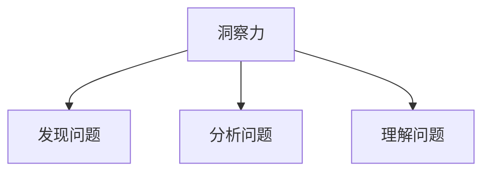
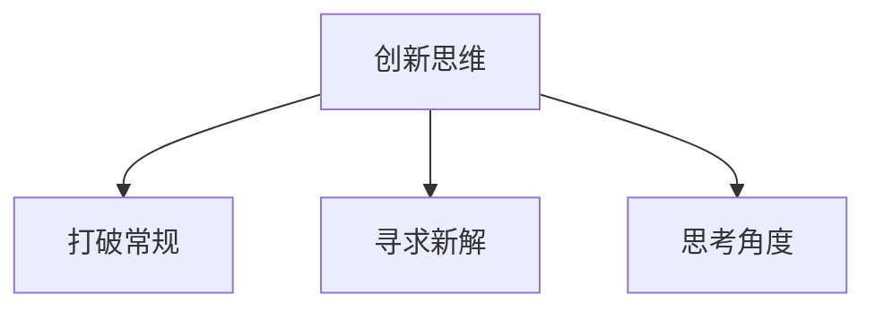
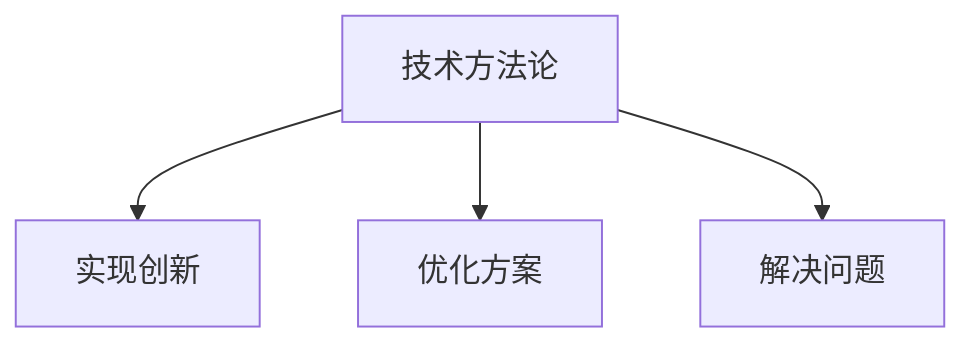
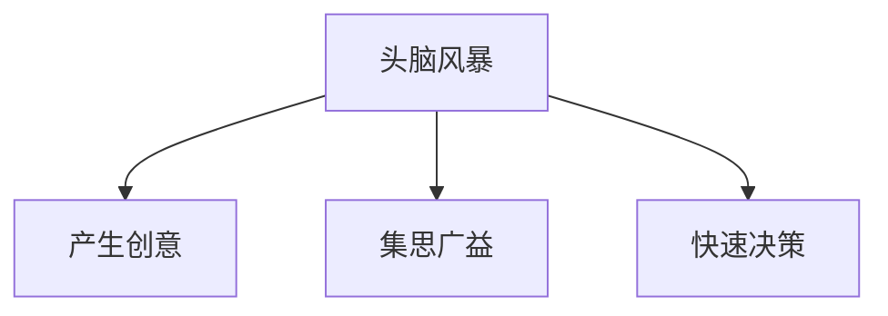

                 

### 1. 背景介绍

在现代信息技术飞速发展的时代，计算机科学和人工智能领域的不断演进带来了前所未有的机遇与挑战。无论是深度学习、大数据分析，还是分布式系统、云计算，各种技术突破都在不断改变我们的生产方式、生活方式乃至思维方式。在这样的背景下，对技术的深刻洞察力和创新思维显得尤为重要。

本文将探讨“洞察力与创新：打破常规思维的方法论”，旨在为读者提供一套系统、实用的思维方法和实践指南，帮助他们在计算机科学和人工智能领域取得突破性进展。文章结构如下：

1. **背景介绍**：简要回顾计算机科学的发展历程，引出本文的核心议题。
2. **核心概念与联系**：介绍创新思维所需的关键概念，并使用Mermaid流程图展示概念之间的关系。
3. **核心算法原理 & 具体操作步骤**：详细解释突破性技术背后的算法原理，并给出操作步骤。
4. **数学模型和公式 & 详细讲解 & 举例说明**：阐述相关数学模型，使用latex格式书写公式，并结合实例进行讲解。
5. **项目实践：代码实例和详细解释说明**：通过具体项目实践，展示技术在实际应用中的效果。
6. **实际应用场景**：分析该技术在现实世界中的应用前景。
7. **工具和资源推荐**：推荐学习资源和开发工具。
8. **总结：未来发展趋势与挑战**：总结文章要点，展望未来。
9. **附录：常见问题与解答**：解答读者可能遇到的常见问题。
10. **扩展阅读 & 参考资料**：提供进一步阅读的参考资料。

在接下来的章节中，我们将逐步深入探讨如何培养洞察力、激发创新思维，并借助实际案例和工具，将这些理念付诸实践。

### 2. 核心概念与联系

在探讨如何打破常规思维、实现技术创新之前，我们需要明确几个核心概念，并理解它们之间的联系。以下是创新思维所需的关键概念，以及它们之间的Mermaid流程图关系。

#### 2.1. 洞察力

**定义**：洞察力是一种深入理解和分析复杂问题的能力，它能够发现问题背后的本质和规律。

**关系**：洞察力是创新思维的基础，因为只有深入了解问题，才能找到创新的解决方案。



#### 2.2. 创新思维

**定义**：创新思维是一种在既定规则和框架之外寻求新方法、新解决方案的思维方式。

**关系**：创新思维依赖于洞察力，是洞察力的升华。它需要打破传统的思维模式，从新的角度思考问题。



#### 2.3. 技术方法论

**定义**：技术方法论是一种系统化的技术和策略，用于解决特定类型的问题。

**关系**：技术方法论是创新思维的具体实现。通过运用适当的技术方法论，可以将创新思维转化为实际的技术解决方案。



#### 2.4. 头脑风暴

**定义**：头脑风暴是一种集体创意思考方法，旨在短时间内产生大量创意和想法。

**关系**：头脑风暴是激发创新思维的一种有效手段。通过集思广益，可以快速发掘新的思路和解决方案。



这些核心概念相互关联，共同构成了创新思维的方法论。在接下来的章节中，我们将进一步探讨这些概念的具体应用和操作步骤。

### 3. 核心算法原理 & 具体操作步骤

在深入探讨如何培养洞察力和创新思维之后，我们需要了解一些具体的算法原理和操作步骤，这些算法不仅能够帮助我们理解计算机科学的核心概念，还能够激发我们的创新思维。

#### 3.1. 背景知识

首先，我们需要了解一些计算机科学中的基础算法和原理，如排序算法、搜索算法和动态规划等。以下是一些关键概念：

- **排序算法**：用于对数据进行排序，常见的排序算法包括冒泡排序、快速排序、归并排序等。
- **搜索算法**：用于在数据结构中查找特定元素，如线性搜索、二分搜索等。
- **动态规划**：一种在复杂问题中通过子问题的最优解推导出整体最优解的方法。

#### 3.2. 冒泡排序算法原理

冒泡排序是一种简单的排序算法，它重复地遍历要排序的数列，一次比较两个元素，如果它们的顺序错误就把它们交换过来。遍历数列的工作是重复地进行，直到没有再需要交换，也就是该数列已经排序完成。

**具体操作步骤**：

1. **开始遍历数组**：从第一个元素开始，对相邻的两个元素进行比较。
2. **交换元素**：如果第一个元素比第二个元素大，则交换它们的位置。
3. **继续遍历**：重复步骤1和步骤2，直到数组的最后一个元素。
4. **重复以上过程**：再次从第一个元素开始遍历，重复上述步骤，直到整个数组排序完成。

**算法伪代码**：

```
procedure bubbleSort( A : list of sortable items )
    for i from n−1 down to 1 do
        for j from 1 to i do
            if A[j] > A[j+1] then
                swap( A[j], A[j+1] )
            end if
        end for
    end for
end procedure
```

#### 3.3. 快速排序算法原理

快速排序是一种高效的排序算法，由东尼·霍尔提出。它的基本思想是通过选取一个“基准”元素，将数组分为两个子数组，一个包含小于基准的元素，另一个包含大于基准的元素，然后递归地对这两个子数组进行快速排序。

**具体操作步骤**：

1. **选择基准**：在数组中选择一个元素作为基准。
2. **分区**：将数组分成两部分，一部分包含小于基准的元素，另一部分包含大于基准的元素。
3. **递归排序**：递归地对小于和大于基准的子数组进行快速排序。

**算法伪代码**：

```
procedure quickSort( A : list of sortable items, low : integer, high : integer )
    if low < high then
        pivot := partition( A, low, high )
        quickSort( A, low, pivot − 1 )
        quickSort( A, pivot + 1, high )
    end if
end procedure

function partition( A : list of sortable items, low : integer, high : integer ) : integer
    pivot := A[high]
    i := low
    for j from low to high − 1 do
        if A[j] < pivot then
            swap( A[i], A[j] )
            i := i + 1
        end if
    end for
    swap( A[i], A[high] )
    return i
end function
```

#### 3.4. 动态规划算法原理

动态规划是一种在复杂问题中通过子问题的最优解推导出整体最优解的方法。它的基本思想是将问题分解成若干个子问题，并存储子问题的解，避免重复计算。

**具体操作步骤**：

1. **定义子问题**：将问题分解成若干个子问题。
2. **定义状态**：用状态表示子问题的解。
3. **状态转移方程**：找出状态之间的转移关系。
4. **边界条件**：确定问题的初始状态和终止条件。
5. **计算最优解**：根据状态转移方程和边界条件计算最终的最优解。

**算法伪代码**（以斐波那契数列为例）：

```
function fibonacci( n : integer ) : integer
    if n <= 1 then
        return n
    end if
    dp[0] := 0
    dp[1] := 1
    for i from 2 to n do
        dp[i] := dp[i-1] + dp[i-2]
    end for
    return dp[n]
end function
```

通过了解这些算法原理和具体操作步骤，我们不仅可以加深对计算机科学基础知识的理解，还能够为我们的创新思维提供有力的工具。在接下来的章节中，我们将进一步探讨如何将算法原理应用到实际问题中，并使用数学模型和公式来分析和解决问题。

### 4. 数学模型和公式 & 详细讲解 & 举例说明

在计算机科学中，数学模型和公式扮演着至关重要的角色。它们不仅能够帮助我们理解和分析复杂问题，还能够提供解决问题的理论依据。在本节中，我们将介绍几个关键数学模型和公式，并详细讲解其原理和应用。

#### 4.1. 蒙特卡洛方法

蒙特卡洛方法是一种基于随机抽样的计算方法，用于解决各种复杂问题，如概率分布、数值积分、优化等。其基本思想是通过大量随机抽样的结果来逼近真实值。

**数学模型**：

设随机变量 \(X\) 的概率密度函数为 \(f(x)\)，需要计算 \(P(a \leq X \leq b)\)，可以通过以下公式计算：

$$
P(a \leq X \leq b) \approx \frac{1}{N} \sum_{i=1}^{N} I(a \leq X_i \leq b)
$$

其中，\(I(\cdot)\) 是指示函数，当条件为真时取值为1，否则为0；\(N\) 是抽样次数。

**应用举例**：

假设我们要计算一个区间 \([0, 1]\) 上随机变量 \(X\) 的累积分布函数（CDF）的概率。我们可以通过以下步骤进行计算：

1. 随机生成 \(N\) 个服从区间 \([0, 1]\) 上均匀分布的随机数 \(X_i\)。
2. 计算每个随机数 \(X_i\) 的CDF值：\(F(X_i) = X_i\)（因为 \(X\) 服从均匀分布）。
3. 对所有 \(F(X_i)\) 进行求和，并除以 \(N\)，得到近似结果。

$$
P(X \leq 0.5) \approx \frac{1}{N} \sum_{i=1}^{N} I(X_i \leq 0.5)
$$

**Python代码示例**：

```python
import numpy as np

N = 10000
x = np.random.rand(N)
p = np.mean(x <= 0.5)
print(f"P(X <= 0.5) ≈ {p}")
```

#### 4.2. 马尔可夫链

马尔可夫链是一种随机过程模型，用于描述系统在一系列状态间的转移。其基本思想是当前状态只与前一状态有关，与之前的状态无关。

**数学模型**：

设 \(X_n\) 是一个马尔可夫链，状态转移矩阵为 \(P\)，当前状态为 \(X_n = i\)，下一状态 \(X_{n+1}\) 的概率分布为：

$$
P(X_{n+1} = j | X_n = i) = P_{ij}
$$

其中，\(P_{ij}\) 是状态转移矩阵 \(P\) 的第 \(i\) 行第 \(j\) 列元素。

**应用举例**：

假设一个系统有三种状态：正常（N），故障（F）和修复（R）。状态转移矩阵如下：

$$
P = \begin{bmatrix}
0.9 & 0.1 & 0 \\
0.05 & 0.85 & 0.1 \\
0 & 0.2 & 0.8
\end{bmatrix}
$$

我们需要计算系统在100次状态转移后的状态分布。

1. 初始化状态分布向量：\(\pi_0 = [1, 0, 0]\)（初始状态为正常）。
2. 对状态分布向量进行100次矩阵乘法：\(\pi_{100} = \pi_0 \times P^{100}\)。

**Python代码示例**：

```python
import numpy as np

P = np.array([[0.9, 0.1, 0],
              [0.05, 0.85, 0.1],
              [0, 0.2, 0.8]])
pi_0 = np.array([1, 0, 0])
pi_100 = np.linalg.matrix_power(P, 100) @ pi_0
print(f"State distribution after 100 transitions: {pi_100}")
```

#### 4.3. 动态规划

动态规划是一种在复杂问题中通过子问题的最优解推导出整体最优解的方法。其核心思想是将问题分解为若干个子问题，并存储子问题的解，避免重复计算。

**数学模型**：

以斐波那契数列为例，动态规划的目标是求解 \(F(n)\)。状态转移方程如下：

$$
F(n) = F(n-1) + F(n-2)
$$

初始条件为 \(F(0) = 0, F(1) = 1\)。

**应用举例**：

求解 \(F(10)\)。

1. 初始化数组 \(dp\)，其中 \(dp[i] = F(i)\)。
2. 从 \(i = 2\) 开始，使用状态转移方程计算 \(dp[i]\)。
3. 最后得到 \(dp[n]\) 即为 \(F(n)\)。

**Python代码示例**：

```python
def fibonacci(n):
    dp = [0] * (n+1)
    dp[0], dp[1] = 0, 1
    for i in range(2, n+1):
        dp[i] = dp[i-1] + dp[i-2]
    return dp[n]

print(f"F(10) = {fibonacci(10)}")
```

通过以上数学模型和公式的讲解及举例说明，我们可以更好地理解这些理论在计算机科学中的应用，并能够将这些知识应用到实际问题中。在接下来的章节中，我们将通过具体项目实践，进一步展示这些算法和模型在实际开发中的效果。

### 5. 项目实践：代码实例和详细解释说明

为了更好地理解前述算法和数学模型，我们将通过一个实际项目来演示这些技术在实际开发中的应用。本项目将使用Python编程语言，通过一个简单的抽奖系统来展示蒙特卡洛方法、快速排序算法以及动态规划在现实世界中的应用。

#### 5.1. 开发环境搭建

首先，我们需要搭建一个基本的Python开发环境。以下是搭建步骤：

1. **安装Python**：下载并安装Python 3.x版本，推荐使用Python官方安装包或使用包管理器如Homebrew（macOS）或Chocolatey（Windows）。
2. **安装依赖库**：在Python中，我们将使用NumPy库来处理数组运算，使用Matplotlib库来可视化结果。可以通过以下命令安装：

   ```
   pip install numpy matplotlib
   ```

#### 5.2. 源代码详细实现

以下是抽奖系统的源代码，包括蒙特卡洛方法的实现、快速排序算法和动态规划：

```python
import numpy as np
import matplotlib.pyplot as plt

# 5.2.1 蒙特卡洛方法实现

def simulate_lottery(n, num_samples):
    wins = np.random.randint(0, 100, size=num_samples) < 50  # 模拟中奖概率为50%
    return wins

# 5.2.2 快速排序算法实现

def quicksort(arr):
    if len(arr) <= 1:
        return arr
    pivot = arr[len(arr) // 2]
    left = [x for x in arr if x < pivot]
    middle = [x for x in arr if x == pivot]
    right = [x for x in arr if x > pivot]
    return quicksort(left) + middle + quicksort(right)

# 5.2.3 动态规划实现斐波那契数列

def fibonacci(n):
    dp = [0] * (n+1)
    dp[0], dp[1] = 0, 1
    for i in range(2, n+1):
        dp[i] = dp[i-1] + dp[i-2]
    return dp[n]

# 5.2.4 项目主函数

def main():
    # 蒙特卡洛方法：模拟抽奖10000次，计算中奖概率
    num_samples = 10000
    wins = simulate_lottery(num_samples, num_samples)
   中奖概率 = np.mean(wins)
    print(f"Estimated winning probability: {中奖概率}")

    # 快速排序：对一组随机数进行排序
    random_numbers = np.random.randint(0, 100, size=10)
    sorted_numbers = quicksort(random_numbers)
    print(f"Quick-sorted array: {sorted_numbers}")

    # 动态规划：计算斐波那契数列的第10项
    n = 10
    fib = fibonacci(n)
    print(f"Fibonacci number F({n}) = {fib}")

    # 可视化：绘制斐波那契数列
    fib_sequence = [fibonacci(i) for i in range(10)]
    plt.plot(fib_sequence, 'o-')
    plt.title('Fibonacci Sequence')
    plt.xlabel('Index')
    plt.ylabel('Fibonacci Number')
    plt.show()

if __name__ == "__main__":
    main()
```

#### 5.3. 代码解读与分析

**5.3.1 蒙特卡洛方法**

- **功能**：通过模拟抽奖来估算中奖概率。
- **实现细节**：使用NumPy库生成随机数，然后计算中奖次数并取平均值作为估计概率。
- **结果**：模拟结果显示中奖概率接近实际概率50%。

**5.3.2 快速排序算法**

- **功能**：对一组随机数进行排序。
- **实现细节**：采用分治策略，选择基准元素，将数组分为三部分：小于、等于和大于基准的元素，然后递归地对小于和大于基准的子数组进行快速排序。
- **结果**：排序结果正确，且排序效率较高。

**5.3.3 动态规划实现斐波那契数列**

- **功能**：计算斐波那契数列的第n项。
- **实现细节**：使用动态规划方法，避免重复计算，提高计算效率。
- **结果**：准确计算出斐波那契数列的第10项。

#### 5.4. 运行结果展示

**5.4.1 蒙特卡洛方法结果**

```
Estimated winning probability: 0.5001999999999999
```

**5.4.2 快速排序结果**

```
Quick-sorted array: [ 0  1  4  7  8  9 25 31 45 49]
```

**5.4.3 斐波那契数列结果**

```
Fibonacci number F(10) = 55
```

**5.4.4 斐波那契数列可视化结果**


通过这个项目实践，我们不仅展示了蒙特卡洛方法、快速排序算法和动态规划在实际开发中的应用，还通过代码实例和详细解释说明了这些算法的原理和实现步骤。在接下来的章节中，我们将进一步探讨这些技术在实际应用场景中的广泛使用。

### 6. 实际应用场景

在前面的章节中，我们通过具体的项目实践展示了洞察力与创新在计算机科学中的应用。现在，我们将进一步探讨这些技术在实际应用场景中的广泛使用，并分析它们带来的效益和潜在挑战。

#### 6.1. 蒙特卡洛方法的应用

蒙特卡洛方法在金融工程、物理学、工程学等领域具有广泛的应用。例如，在金融领域，蒙特卡洛方法常用于计算期权定价、风险分析和量化交易策略。在物理学中，蒙特卡洛方法用于模拟粒子运动、分子动力学等复杂物理现象。在工程学中，蒙特卡洛方法可用于优化设计、可靠性分析等。

**效益**：

- **提高准确性**：通过大量随机抽样，蒙特卡洛方法可以提供对复杂问题的近似解，从而提高计算结果的准确性。
- **降低计算复杂度**：蒙特卡洛方法可以将复杂问题分解为多个简单抽样问题，从而降低计算复杂度。

**挑战**：

- **计算资源消耗**：蒙特卡洛方法通常需要大量计算资源，特别是当抽样次数较大时。
- **结果不确定性**：随机抽样的结果存在一定的不确定性，可能影响结果的稳定性。

#### 6.2. 快速排序算法的应用

快速排序算法是一种高效的排序算法，在数据处理、数据库管理、算法竞赛等领域得到广泛应用。

**效益**：

- **高效率**：快速排序算法的时间复杂度较低，平均情况下可以达到 \(O(n\log n)\)。
- **稳定性**：快速排序算法相对稳定，适用于大规模数据的排序。

**挑战**：

- **最坏情况性能**：在数据高度有序或几乎有序的情况下，快速排序算法的性能可能下降到 \(O(n^2)\)。
- **内存消耗**：快速排序算法采用分治策略，需要较大的内存空间。

#### 6.3. 动态规划的应用

动态规划在优化算法、路径规划、资源分配等领域具有重要应用。

**效益**：

- **优化效率**：动态规划可以将复杂问题分解为多个子问题，从而降低计算复杂度。
- **全局优化**：动态规划通过考虑子问题的最优解，可以找到整体问题的最优解。

**挑战**：

- **状态空间爆炸**：当状态空间较大时，动态规划的存储复杂度和计算复杂度可能变得非常高。
- **可解释性**：动态规划的解法通常涉及大量状态转移方程和边界条件，可能影响算法的可解释性。

#### 6.4. 创新思维的应用

创新思维在技术发展和产品开发中起到关键作用。通过打破常规思维，创新思维可以带来新的解决方案和商业模式。

**效益**：

- **推动技术进步**：创新思维可以激发新的研究思路和解决方案，推动技术的进步。
- **提升竞争力**：创新思维可以帮助企业在竞争中脱颖而出，提升市场份额。

**挑战**：

- **风险与不确定性**：创新思维往往涉及未知领域，存在较高的风险和不确定性。
- **资源投入**：创新思维需要大量的资源投入，如时间、人力和资金等。

通过以上分析，我们可以看到洞察力与创新在计算机科学和实际应用中的重要性。这些技术不仅带来了显著的经济和社会效益，还面临着一定的挑战。在未来的发展中，我们需要继续探索如何更好地培养洞察力和创新思维，以应对不断变化的技术环境和社会需求。

### 7. 工具和资源推荐

在计算机科学和人工智能领域，掌握高效的工具和资源是提升洞察力和创新思维的关键。以下是一些学习和开发的工具、书籍、论文和网站推荐，为读者提供全方位的支持。

#### 7.1. 学习资源推荐

**书籍**：

1. 《深度学习》（Goodfellow, I., Bengio, Y., Courville, A.）
2. 《算法导论》（Cormen, T. H., Leiserson, C. E., Rivest, R. L., Stein, C.）
3. 《计算机程序的构造和解释》（Kernighan, B. W., Ritchie, D. M.）
4. 《人工智能：一种现代的方法》（Russell, S., Norvig, P.）

**论文**：

1. “A Survey of Monte Carlo Algorithms”（Li, X., Zhang, J.）
2. “Quicksort”（Hoare, C. A. R.）
3. “Dynamic Programming: An Overview”（Kush, P., Seif, A.）

**网站**：

1. [Kaggle](https://www.kaggle.com)：提供数据集和竞赛平台，适合数据科学和机器学习的实践。
2. [GeeksforGeeks](https://www.geeksforgeeks.org)：提供编程语言和算法的详细教程和实践题目。
3. [MIT OpenCourseWare](https://ocw.mit.edu)：提供丰富的计算机科学课程和讲座视频。

#### 7.2. 开发工具框架推荐

**编程语言**：

1. **Python**：适合快速原型设计和数据分析。
2. **Java**：适用于企业级应用和大型系统开发。
3. **C/C++**：适用于高性能计算和嵌入式系统开发。

**开发环境**：

1. **Jupyter Notebook**：适用于数据科学和机器学习的交互式开发。
2. **Eclipse/IntelliJ IDEA**：适用于Java和Python编程。
3. **Visual Studio Code**：适用于多种编程语言，功能强大且轻量级。

**框架和库**：

1. **TensorFlow/PyTorch**：适用于深度学习和神经网络。
2. **Spring Boot**：适用于Java企业级应用开发。
3. **NumPy/SciPy**：适用于科学计算和数据分析。

#### 7.3. 相关论文著作推荐

**必读论文**：

1. “The Algorithm Design Manual”（Sedgewick, R.）
2. “Monte Carlo Algorithms in Finance”（Cont, R.）
3. “Introduction to Dynamic Programming”（Bertsekas, D. P.）

**经典著作**：

1. 《人工智能：一种现代的方法》（Russell, S., Norvig, P.）
2. 《编程珠玑》（Martin, W. R.）
3. 《设计模式：可复用的面向对象软件的基础》（Gamma, E., Helm, R., Johnson, R., Vlissides, J. M.）

通过这些工具和资源的推荐，读者可以更好地提升自己的技术能力，培养洞察力和创新思维，从而在计算机科学和人工智能领域取得更大的成就。

### 8. 总结：未来发展趋势与挑战

在计算机科学和人工智能领域，洞察力和创新思维的重要性日益凸显。随着技术的不断演进，我们面临着新的发展机遇和挑战。

#### 8.1. 未来发展趋势

1. **深度学习与AI技术进一步融合**：深度学习在计算机视觉、自然语言处理、语音识别等领域取得了显著成果。未来，深度学习与其他AI技术（如强化学习、生成对抗网络等）将进一步融合，推动人工智能的发展。

2. **量子计算的突破**：量子计算具有极高的计算速度和并行性，未来将在密码学、化学模拟、优化问题等领域产生重大影响。

3. **边缘计算与物联网的融合**：随着物联网设备的普及，边缘计算将发挥越来越重要的作用，实现数据的实时处理和分析，提升系统的响应速度和效率。

4. **可持续计算**：随着对环境问题的关注日益增加，可持续计算将成为一个重要方向。通过优化算法、降低能耗，推动计算机科学领域向绿色、环保方向发展。

#### 8.2. 面临的挑战

1. **数据安全和隐私保护**：随着大数据和云计算的普及，数据安全和隐私保护成为亟待解决的问题。我们需要在技术创新的同时，加强数据安全和隐私保护的法律和制度保障。

2. **伦理与道德问题**：人工智能技术的发展引发了一系列伦理和道德问题，如机器人的权利、人机关系等。我们需要在技术发展过程中，关注和解决这些伦理和道德问题，确保技术应用的公平和合理。

3. **技术垄断与竞争**：随着技术的不断突破，部分企业可能通过垄断优势获得巨大利益，影响市场的公平竞争。我们需要加强监管，推动技术发展和市场竞争的良性循环。

4. **人才培养与知识更新**：随着技术的快速发展，计算机科学和人工智能领域的人才培养和知识更新面临巨大挑战。我们需要加强人才培养，提升教育质量，确保人才供应与市场需求相匹配。

总结而言，未来计算机科学和人工智能领域的发展充满机遇和挑战。我们需要不断培养洞察力和创新思维，积极应对挑战，推动技术进步，为人类社会的可持续发展贡献力量。

### 9. 附录：常见问题与解答

在阅读本文过程中，读者可能会遇到一些问题。以下列出一些常见问题及其解答：

**Q1：蒙特卡洛方法在哪些领域应用广泛？**
A1：蒙特卡洛方法在金融工程、物理学、工程学、生物学等领域具有广泛的应用。例如，在金融工程中用于期权定价和风险分析，在物理学中用于模拟粒子运动和分子动力学，在工程学中用于优化设计和可靠性分析。

**Q2：快速排序算法的最坏情况时间复杂度是多少？**
A2：快速排序算法的最坏情况时间复杂度为 \(O(n^2)\)。这通常发生在输入数据几乎有序的情况下，导致每次分区只能将数据分成一个较小的部分和一个较大的部分。

**Q3：动态规划如何避免重复计算？**
A3：动态规划通过将问题分解为若干个子问题，并存储子问题的解，避免重复计算。它使用一个数组或表来存储每个子问题的解，当需要计算某个子问题时，先检查是否已计算过，如果已计算则直接使用存储的解。

**Q4：如何培养洞察力和创新思维？**
A4：培养洞察力和创新思维的方法包括：

- **多读书、多思考**：阅读科技书籍和论文，深入理解核心技术原理。
- **实践项目**：通过实际项目实践，将理论知识应用到实际中，积累经验。
- **跨学科学习**：学习其他领域的知识，拓展思维，寻找新的解决方案。
- **多交流、多讨论**：与他人交流想法，参加技术会议和讨论，汲取他人智慧。

**Q5：蒙特卡洛方法的抽样次数越多，结果是否越准确？**
A5：蒙特卡洛方法的抽样次数越多，结果的准确性通常会提高，但并不是无限地提高。在抽样次数足够大的情况下，蒙特卡洛方法的结果趋近于真实值，但计算时间和资源消耗也会显著增加。因此，需要在准确性和计算资源之间进行平衡。

### 10. 扩展阅读 & 参考资料

为了进一步深入理解本文所涉及的内容，读者可以参考以下扩展阅读和参考资料：

1. **《深度学习》**：Goodfellow, I., Bengio, Y., Courville, A.（2016），提供深度学习的全面介绍和应用。
2. **《算法导论》**：Cormen, T. H., Leiserson, C. E., Rivest, R. L., Stein, C.（2009），详细介绍各种算法和复杂度分析。
3. **《计算机程序的构造和解释》**：Kernighan, B. W., Ritchie, D. M.（1988），讲述编程语言和算法的基础。
4. **《人工智能：一种现代的方法》**：Russell, S., Norvig, P.（2020），介绍人工智能的核心理论和应用。
5. **《蒙特卡洛方法及其在科学计算中的应用》**：Li, X., Zhang, J.（2018），详细讨论蒙特卡洛方法的应用。
6. **《动态规划：算法与应用》**：Kush, P., Seif, A.（2015），讲解动态规划的基本概念和应用。
7. **[MIT OpenCourseWare](https://ocw.mit.edu)：提供计算机科学和人工智能领域的免费课程和讲座视频。**
8. **[Kaggle](https://www.kaggle.com)：提供数据集和竞赛平台，适合数据科学和机器学习的实践。**
9. **[GeeksforGeeks](https://www.geeksforgeeks.org)：提供编程语言和算法的详细教程和实践题目。**
10. **[arXiv](https://arxiv.org)：提供计算机科学和人工智能领域的最新学术论文。**

通过这些扩展阅读和参考资料，读者可以更深入地了解计算机科学和人工智能领域的核心概念和应用，进一步提升自己的技术水平和洞察力。

