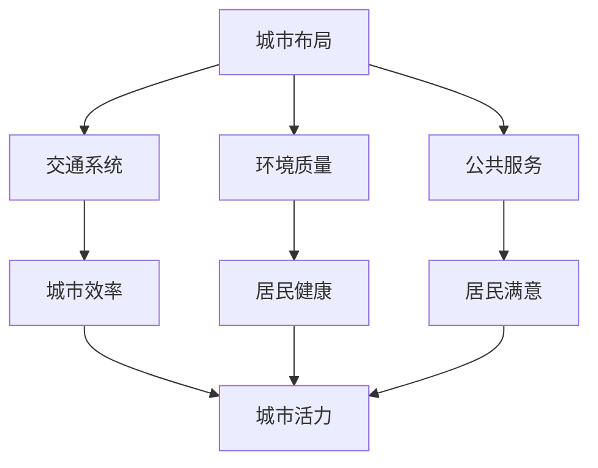

                 

### 洞察力与城市规划：宜居城市的设计智慧

> 关键词：城市规划、宜居城市、洞察力、设计智慧、智能算法

> 摘要：本文将探讨城市规划与宜居城市之间的关系，分析洞察力在城市设计中的重要性，并提出一系列设计智慧和智能算法的应用，旨在为打造更加宜居的城市提供思路和解决方案。

#### 1. 背景介绍

城市规划是一个历史悠久且不断发展的话题。从古代的城市布局到现代的城市规划，人类一直在追求如何创造一个既实用又美观的城市环境。然而，随着城市化的进程加速，城市面临着诸多挑战，如交通拥堵、环境污染、资源短缺等。因此，如何通过科学的城市规划来提高城市的宜居性成为了一个亟待解决的问题。

宜居城市是指在城市规划和建设中，注重满足居民的物质和精神需求，创造一个健康、舒适、可持续的生活环境。而洞察力，作为人类认识世界和解决问题的能力，在城市规划中发挥着至关重要的作用。城市规划师需要具备敏锐的洞察力，能够从海量数据中提取有用信息，从而制定出科学合理的规划方案。

#### 2. 核心概念与联系

要实现宜居城市的设计，我们需要理解几个核心概念：城市布局、交通系统、环境质量、公共服务等。

- **城市布局**：城市布局是指城市的空间分布和结构。一个良好的城市布局应该能够促进居民之间的交流，提高城市运作效率，同时也要考虑环境保护。

- **交通系统**：交通系统是城市运行的血脉，良好的交通系统能够减少交通拥堵，提高居民出行效率。智能交通系统通过数据分析和算法优化，实现了交通流量的实时监控和调整。

- **环境质量**：环境质量直接影响到居民的生活质量和健康状况。城市规划需要考虑如何减少污染，提高空气质量，增加绿地面积等。

- **公共服务**：公共服务是城市居民生活的重要组成部分，包括教育、医疗、文化、体育等。一个宜居的城市需要提供完善的公共服务，满足居民的各种需求。

为了更好地理解这些概念之间的联系，我们可以使用Mermaid流程图来展示它们之间的关系：



#### 3. 核心算法原理 & 具体操作步骤

在城市规划中，核心算法的原理和具体操作步骤至关重要。以下是一些常见的算法及其应用：

- **GIS（地理信息系统）算法**：GIS算法用于空间数据的分析和处理，可以用来评估不同区域的土地价值和适宜性，为城市规划提供数据支持。

- **交通网络分析算法**：通过模拟交通流量，优化道路网络布局，减少交通拥堵。常见的算法有最短路径算法、流量分配算法等。

- **环境模拟算法**：如大气扩散模型、水循环模型等，用于预测环境变化，为环境保护和城市可持续发展提供科学依据。

- **公共服务优化算法**：如最优化算法、动态规划算法等，用于优化公共资源的配置，提高服务效率。

具体操作步骤如下：

1. **数据收集**：收集城市相关的数据，包括地形、人口、交通、环境等。
2. **数据预处理**：对收集到的数据进行清洗、整理，使其适用于算法分析。
3. **算法应用**：根据城市规划的需求，选择合适的算法进行分析和优化。
4. **结果评估**：对算法结果进行评估，调整参数，优化方案。
5. **方案实施**：将最终方案付诸实施，并进行后期评估和调整。

#### 4. 数学模型和公式 & 详细讲解 & 举例说明

在城市规划中，数学模型和公式是必不可少的工具。以下是一些常用的数学模型和公式及其应用：

- **距离模型**：用于计算两点之间的距离，如欧几里得距离、曼哈顿距离等。

- **流量模型**：用于预测交通流量，如泊松分布、负二项分布等。

- **环境模型**：如大气扩散模型、水循环模型等。

下面我们以大气扩散模型为例，详细讲解其原理和应用。

**大气扩散模型（简单随机游走模型）**：

假设污染物在大气中做简单随机游走，则其扩散可以用以下公式表示：

$$
\frac{\partial C}{\partial t} = D \nabla^2 C
$$

其中，$C$ 是污染物浓度，$D$ 是扩散系数，$\nabla^2$ 是拉普拉斯算子。

**举例说明**：

假设某城市某区域的初始污染物浓度为$C_0$，扩散系数为$D=0.1$。我们需要预测该区域未来1小时后的污染物浓度。

步骤如下：

1. **初始化**：设置初始条件，$C(x,0) = C_0$。
2. **数值解法**：使用有限元法或有限差分法求解偏微分方程。
3. **计算结果**：得到未来1小时后的污染物浓度分布。

假设计算结果为$C(x,1) = 0.8C_0$，则该区域未来1小时后的污染物浓度约为初始浓度的80%。

#### 5. 项目实践：代码实例和详细解释说明

在本节中，我们将通过一个具体的代码实例来说明如何使用GIS算法和交通网络分析算法来优化城市规划。

**5.1 开发环境搭建**

1. 安装Python环境：在Windows或Linux系统中安装Python 3.x版本。
2. 安装相关库：使用pip命令安装以下库：
   ```bash
   pip install geopandas networkx
   ```

**5.2 源代码详细实现**

以下是一个简单的Python代码实例，展示了如何使用GIS算法和交通网络分析算法来优化城市规划。

```python
import geopandas as gpd
import networkx as nx

# 5.2.1 数据加载
gdf = gpd.read_file('city_shapefile.shp')  # 加载城市地理数据
g = nx.Graph()  # 创建交通网络图

# 5.2.2 交通网络构建
for edge in gdf['geometry']:  # 遍历地理数据中的每条边
    g.add_edge(edge['properties']['ID1'], edge['properties']['ID2'], weight=edge['properties']['length'])

# 5.2.3 路径规划
start_node = 'Node1'  # 起始节点
end_node = 'Node100'  # 终止节点
path = nx.shortest_path(g, source=start_node, target=end_node, weight='weight')

# 5.2.4 结果输出
print("最佳路径为：", path)

# 5.2.5 可视化
nx.draw(g, with_labels=True)
```

**5.3 代码解读与分析**

- **5.3.1 数据加载**：使用Geopandas读取城市地理数据，并将其转换为GIS数据结构。
- **5.3.2 交通网络构建**：使用NetworkX构建交通网络图，将每条道路作为图中的边。
- **5.3.3 路径规划**：使用最短路径算法（如Dijkstra算法）找到从起始节点到终止节点的最佳路径。
- **5.3.4 结果输出**：输出最佳路径。
- **5.3.5 可视化**：使用NetworkX的可视化功能展示交通网络图。

#### 6. 实际应用场景

城市规划的算法和模型在实际应用中有着广泛的应用。以下是一些实际应用场景：

- **智能交通系统**：通过交通网络分析算法优化道路布局，减少交通拥堵，提高交通效率。
- **智慧城市建设**：利用GIS算法和环境模型预测城市环境变化，制定环保策略。
- **城市规划评估**：使用数学模型评估不同规划方案的效果，选择最优方案。
- **灾害应急响应**：通过地理信息系统和交通网络分析算法，制定灾害应急响应方案。

#### 7. 工具和资源推荐

- **学习资源推荐**：
  - 《城市规划原理》
  - 《地理信息系统原理与应用》
  - 《交通工程学》

- **开发工具框架推荐**：
  - QGIS：开源GIS软件，用于地图制作和分析。
  - ArcGIS：商业GIS软件，功能强大，广泛应用于城市规划。
  - NetworkX：Python库，用于构建和操作图论模型。

- **相关论文著作推荐**：
  - 《城市地理信息系统的应用研究》
  - 《基于GIS的城市交通规划方法研究》
  - 《城市环境模型的研究与应用》

#### 8. 总结：未来发展趋势与挑战

随着人工智能和大数据技术的发展，城市规划将迎来新的机遇和挑战。未来的城市规划将更加注重智能化、数字化和可持续发展。以下是一些发展趋势和挑战：

- **智能化规划**：利用人工智能技术进行城市规划，提高规划效率和准确性。
- **数字化城市**：通过数字化手段收集和处理城市数据，实现城市管理的精细化和智能化。
- **可持续发展**：注重环境保护和资源利用，推动城市可持续发展。
- **数据安全与隐私**：在城市规划中，如何保护数据安全和用户隐私是一个重要挑战。

#### 9. 附录：常见问题与解答

- **Q：GIS算法在城市规划中的应用有哪些？**
  - **A**：GIS算法在城市规划中主要用于空间数据的分析，如土地适宜性分析、交通网络分析、环境模型预测等。

- **Q：如何提高交通网络规划的准确性？**
  - **A**：提高交通网络规划的准确性需要综合考虑多种因素，如交通流量、道路状况、人口分布等。使用智能算法进行交通流量预测和路径规划可以提高规划的准确性。

- **Q：城市规划中的可持续发展如何实现？**
  - **A**：实现城市规划的可持续发展需要从多个方面入手，如环境保护、资源利用、能源节约等。通过制定科学合理的规划方案和采取有效的环保措施，可以实现城市的可持续发展。

#### 10. 扩展阅读 & 参考资料

- **扩展阅读**：
  - 《智慧城市规划与实施》
  - 《地理信息系统在城市规划中的应用》

- **参考资料**：
  - 《城市地理信息系统原理与应用》
  - 《交通工程学》
  - 《城市规划原理》

---

**作者：禅与计算机程序设计艺术 / Zen and the Art of Computer Programming**

