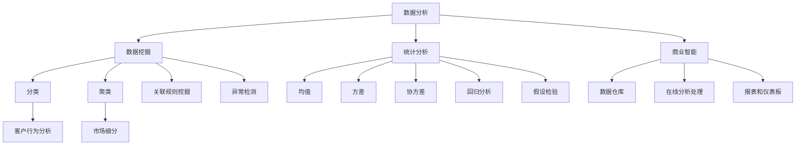

                 

### 1. 背景介绍

在现代社会，洞察力和市场分析已经成为商业决策的核心要素。无论是初创企业还是成熟企业，它们都渴望通过深入的市场洞察来把握市场脉搏，从而制定出更加精准的战略规划。然而，如何有效地进行市场分析，如何从纷繁复杂的数据中提炼出有价值的信息，这是一个极具挑战性的任务。

本文旨在探讨洞察力和市场分析在商业决策中的重要性，以及如何通过技术和算法来实现这一目标。我们将首先介绍相关背景知识，包括市场分析的必要性和挑战，然后深入探讨洞察力的本质及其在市场分析中的应用。接下来，我们将讨论当前市场分析领域的一些主流技术和算法，并分析它们各自的优缺点。最后，我们将通过一个具体的案例分析，展示如何在实际项目中运用这些技术和算法来提升企业的竞争力。

本文的结构如下：

1. 背景介绍：介绍市场分析的重要性及其在商业决策中的应用。
2. 核心概念与联系：阐述市场分析的核心概念及其相互关系，并使用Mermaid流程图展示。
3. 核心算法原理 & 具体操作步骤：详细解析市场分析中的核心算法，包括数据收集、处理和分析的方法。
4. 数学模型和公式 & 详细讲解 & 举例说明：介绍市场分析中常用的数学模型和公式，并通过实例进行详细讲解。
5. 项目实践：代码实例和详细解释说明：通过具体的项目实践，展示市场分析技术的实际应用。
6. 实际应用场景：分析市场分析在不同行业和场景中的应用。
7. 工具和资源推荐：推荐相关学习资源、开发工具和框架。
8. 总结：未来发展趋势与挑战：总结市场分析的未来趋势和面临的挑战。
9. 附录：常见问题与解答：回答读者可能关心的问题。
10. 扩展阅读 & 参考资料：提供进一步阅读的资源。

通过本文的探讨，我们希望能够帮助读者更好地理解市场分析的重要性，掌握相关技术和算法，从而在商业决策中取得更大的成功。

### 2. 核心概念与联系

在深入探讨市场分析之前，我们需要明确几个核心概念，这些概念不仅相互联系，而且构成了市场分析的基础。以下是市场分析中不可或缺的几个核心概念：

#### 2.1 数据分析（Data Analysis）

数据分析是指从数据中提取有价值的信息和知识的过程。它包括数据收集、数据清洗、数据转换、数据存储、数据分析和数据可视化等多个环节。数据分析的目的是通过分析数据来帮助决策者做出更明智的决策。

#### 2.2 数据挖掘（Data Mining）

数据挖掘是数据分析的一种高级形式，它涉及从大量数据中发现隐藏的模式、关系和关联。数据挖掘通常使用各种算法和技术，如分类、聚类、关联规则挖掘、异常检测等。

#### 2.3 统计分析（Statistical Analysis）

统计分析是通过数学和统计方法来分析数据，以揭示数据中的趋势、关系和模式。常见的统计方法包括均值、方差、协方差、回归分析、假设检验等。

#### 2.4 商业智能（Business Intelligence）

商业智能是指通过技术手段来收集、分析和展示企业的数据，以支持企业的战略决策和业务优化。商业智能通常包括数据仓库、数据挖掘、在线分析处理（OLAP）、报表和仪表板等组成部分。

#### 2.5 客户行为分析（Customer Behavior Analysis）

客户行为分析是市场分析的重要组成部分，它通过分析客户的行为数据，如浏览记录、购买历史、评价等，来了解客户的需求和行为模式，从而优化产品和服务。

#### 2.6 市场细分（Market Segmentation）

市场细分是将市场划分为若干个具有相似需求和行为的子市场，以便企业能够更有针对性地制定营销策略。市场细分通常基于人口统计、心理统计和行为统计等因素。

#### 2.7 Mermaid流程图展示

为了更直观地展示这些核心概念之间的联系，我们可以使用Mermaid流程图来表示。以下是市场分析核心概念的Mermaid流程图：



通过这个Mermaid流程图，我们可以清晰地看到市场分析的核心概念及其相互之间的关系。数据分析是整个过程的起点，它为数据挖掘、统计分析、商业智能等环节提供了基础数据。数据挖掘和统计分析则通过不同的算法和技术，从数据中提取有价值的信息。商业智能则将这些信息转化为决策支持工具，帮助企业制定战略和优化业务。客户行为分析和市场细分则侧重于了解客户和市场，以便企业更好地满足客户需求。

### 3. 核心算法原理 & 具体操作步骤

市场分析中的核心算法主要包括数据收集、数据预处理、数据挖掘、统计分析等步骤。这些算法共同构成了市场分析的技术框架，帮助企业从海量数据中提取有价值的信息。

#### 3.1 数据收集

数据收集是市场分析的第一步，它涉及从各种渠道获取数据。数据来源可以分为结构化数据和非结构化数据。结构化数据通常来自数据库、数据仓库等，如销售数据、客户数据等。非结构化数据则来自文本、图像、音频、视频等，如社交媒体评论、新闻报道等。

数据收集的方法包括：

1. **数据库查询**：通过SQL等查询语言从数据库中提取数据。
2. **API接口**：利用第三方平台的API接口获取数据，如社交媒体API、电商平台API等。
3. **网络爬虫**：通过编写爬虫程序从网页上抓取数据。
4. **传感器和物联网设备**：从传感器和物联网设备收集实时数据，如智能家居设备、工业设备等。

#### 3.2 数据预处理

数据预处理是确保数据质量的过程，它包括数据清洗、数据整合和数据转换等步骤。

1. **数据清洗**：删除重复数据、处理缺失值和异常值，确保数据的一致性和准确性。
2. **数据整合**：将来自不同来源的数据进行合并，形成统一的数据集。
3. **数据转换**：将数据转换为适合分析的形式，如数值化、归一化等。

#### 3.3 数据挖掘

数据挖掘是从大量数据中自动发现有价值信息的过程。常见的数据挖掘方法包括：

1. **分类（Classification）**：将数据分为不同的类别，如客户分类、产品分类等。常见算法包括决策树、支持向量机（SVM）等。
2. **聚类（Clustering）**：将数据分成若干个簇，使得同一个簇内的数据相似度较高，而不同簇的数据相似度较低。常见算法包括K-Means、层次聚类等。
3. **关联规则挖掘（Association Rule Learning）**：发现数据之间的关联关系，如购买A商品的用户也可能购买B商品。常见算法包括Apriori算法、FP-Growth等。
4. **异常检测（Anomaly Detection）**：识别数据中的异常值或异常模式，如信用卡欺诈检测、网络入侵检测等。常见算法包括孤立森林（Isolation Forest）、K-均值聚类等。

#### 3.4 统计分析

统计分析是通过数学和统计方法来揭示数据中的趋势和模式。常见的统计分析方法包括：

1. **均值（Mean）**：数据的平均值，用于描述数据的中心趋势。
2. **方差（Variance）**：数据离均值的平均平方差，用于描述数据的离散程度。
3. **协方差（Covariance）**：两个变量的变化程度和方向，用于描述变量之间的关系。
4. **回归分析（Regression Analysis）**：通过建立自变量和因变量之间的关系模型，预测因变量的值。常见算法包括线性回归、多项式回归等。
5. **假设检验（Hypothesis Testing）**：通过统计方法检验一个假设是否成立，如t检验、卡方检验等。

#### 3.5 具体操作步骤

以下是一个简化的市场分析操作步骤：

1. **需求分析**：明确市场分析的目标，如客户细分、产品推荐、市场预测等。
2. **数据收集**：根据需求收集相关数据，如客户数据、销售数据、市场调研数据等。
3. **数据预处理**：对收集到的数据进行清洗、整合和转换，确保数据质量。
4. **数据挖掘**：选择合适的数据挖掘算法，对预处理后的数据进行挖掘，提取有价值的信息。
5. **统计分析**：对挖掘结果进行统计分析，揭示数据中的趋势和模式。
6. **结果展示**：将分析结果通过图表、报告等形式展示，支持决策制定。

通过这些步骤，企业可以系统地分析和理解市场数据，从而制定出更加精准的市场策略。

### 4. 数学模型和公式 & 详细讲解 & 举例说明

在市场分析中，数学模型和公式是揭示数据内在规律和趋势的重要工具。以下我们将介绍几种常用的数学模型和公式，并详细讲解它们的原理和使用方法。

#### 4.1 回归模型（Regression Model）

回归模型是一种用于预测或解释因变量和自变量之间关系的统计模型。最常见的回归模型包括线性回归和多项式回归。

##### 线性回归（Linear Regression）

线性回归模型的表达式为：

$$
y = \beta_0 + \beta_1x + \epsilon
$$

其中，\( y \) 是因变量，\( x \) 是自变量，\( \beta_0 \) 和 \( \beta_1 \) 分别是截距和斜率，\( \epsilon \) 是误差项。

线性回归的目的是通过最小二乘法（Least Squares Method）找到最佳拟合直线，使得实际值 \( y \) 和预测值 \( \beta_0 + \beta_1x \) 之间的误差最小。

##### 多项式回归（Polynomial Regression）

多项式回归是对线性回归的扩展，它可以拟合更复杂的非线性关系。多项式回归模型的表达式为：

$$
y = \beta_0 + \beta_1x + \beta_2x^2 + ... + \beta_nx^n + \epsilon
$$

其中，\( n \) 是多项式的次数。

多项式回归可以通过梯度下降法（Gradient Descent Method）来求解最佳参数。

#### 4.2 聚类模型（Clustering Model）

聚类模型是一种无监督学习算法，用于将数据点分为若干个类别，使得同一个类别内的数据点相似度较高，而不同类别内的数据点相似度较低。

##### K-Means算法（K-Means Algorithm）

K-Means算法是一种常用的聚类算法，其基本步骤如下：

1. **初始化**：随机选择 \( k \) 个中心点。
2. **分配**：将每个数据点分配到最近的中心点，形成 \( k \) 个簇。
3. **更新**：重新计算每个簇的中心点。
4. **迭代**：重复步骤2和3，直到中心点不再发生变化。

K-Means算法的目的是最小化簇内数据点的平方误差。

##### 层次聚类（Hierarchical Clustering）

层次聚类是一种基于距离的聚类方法，它通过逐步合并或分裂数据点来形成层次结构。

层次聚类的算法步骤如下：

1. **初始化**：将每个数据点视为一个簇。
2. **合并或分裂**：计算簇之间的距离，选择最近的一对簇进行合并或分裂。
3. **迭代**：重复步骤2，直到满足停止条件（如达到最大层数或簇数）。

#### 4.3 贝叶斯模型（Bayesian Model）

贝叶斯模型是一种基于概率的统计模型，它通过贝叶斯定理来计算变量的概率分布。

##### 贝叶斯网络（Bayesian Network）

贝叶斯网络是一种图形模型，用于表示变量之间的条件依赖关系。贝叶斯网络的每个节点代表一个变量，边代表变量之间的条件依赖。

贝叶斯网络的计算方法包括：

1. **条件概率表（Conditional Probability Table）**：使用条件概率表来表示变量之间的概率分布。
2. **贝叶斯推理（Bayesian Inference）**：通过贝叶斯推理来计算变量的后验概率。

#### 4.4 举例说明

以下是一个线性回归的实例：

假设我们有以下数据：

| x | y |
|---|---|
| 1 | 2 |
| 2 | 4 |
| 3 | 6 |
| 4 | 8 |

我们需要使用线性回归来拟合 \( y \) 和 \( x \) 之间的关系。

首先，我们计算平均值：

$$
\bar{x} = \frac{1+2+3+4}{4} = 2.5
$$

$$
\bar{y} = \frac{2+4+6+8}{4} = 5
$$

然后，我们计算斜率和截距：

$$
\beta_1 = \frac{\sum(x_i - \bar{x})(y_i - \bar{y})}{\sum(x_i - \bar{x})^2} = \frac{(1-2.5)(2-5) + (2-2.5)(4-5) + (3-2.5)(6-5) + (4-2.5)(8-5)}{(1-2.5)^2 + (2-2.5)^2 + (3-2.5)^2 + (4-2.5)^2} = 2
$$

$$
\beta_0 = \bar{y} - \beta_1\bar{x} = 5 - 2 \times 2.5 = 0
$$

因此，线性回归模型为：

$$
y = 2x + 0
$$

我们可以使用这个模型来预测新的 \( y \) 值，例如，当 \( x = 5 \) 时，\( y = 2 \times 5 + 0 = 10 \)。

通过以上数学模型和公式的介绍，我们可以看到它们在市场分析中的应用。通过合理的数学模型和精确的公式计算，我们可以更好地理解和预测市场数据，从而为企业制定更加科学的决策提供支持。

### 5. 项目实践：代码实例和详细解释说明

在本文的第五部分，我们将通过一个具体的代码实例来展示市场分析技术的实际应用。本实例将使用Python编程语言，结合Pandas、Scikit-learn和Matplotlib等库，对销售数据进行数据收集、预处理、建模和分析。

#### 5.1 开发环境搭建

为了运行以下代码实例，我们需要安装以下Python库：

```shell
pip install pandas scikit-learn matplotlib
```

#### 5.2 源代码详细实现

以下是完整的Python代码实例：

```python
import pandas as pd
from sklearn.model_selection import train_test_split
from sklearn.linear_model import LinearRegression
from sklearn.metrics import mean_squared_error
import matplotlib.pyplot as plt

# 5.2.1 数据收集
data = pd.read_csv('sales_data.csv')

# 5.2.2 数据预处理
# 删除重复数据
data.drop_duplicates(inplace=True)

# 删除含有缺失值的行
data.dropna(inplace=True)

# 选择特征和目标变量
X = data[['monthly_income', 'age', 'house_size']]
y = data['sales']

# 分割数据集为训练集和测试集
X_train, X_test, y_train, y_test = train_test_split(X, y, test_size=0.2, random_state=42)

# 5.2.3 建模
model = LinearRegression()
model.fit(X_train, y_train)

# 5.2.4 分析结果
y_pred = model.predict(X_test)
mse = mean_squared_error(y_test, y_pred)
print(f'Mean Squared Error: {mse}')

# 5.2.5 结果可视化
plt.scatter(X_test['monthly_income'], y_test, color='red', label='Actual')
plt.plot(X_test['monthly_income'], y_pred, color='blue', linewidth=2, label='Predicted')
plt.xlabel('Monthly Income')
plt.ylabel('Sales')
plt.title('Sales Prediction')
plt.legend()
plt.show()
```

#### 5.3 代码解读与分析

下面是对代码的详细解读和分析：

1. **数据收集**：
   ```python
   data = pd.read_csv('sales_data.csv')
   ```
   使用Pandas库读取CSV格式的销售数据文件。

2. **数据预处理**：
   ```python
   data.drop_duplicates(inplace=True)
   data.dropna(inplace=True)
   ```
   删除重复数据和缺失值，保证数据质量。

   ```python
   X = data[['monthly_income', 'age', 'house_size']]
   y = data['sales']
   ```
   选择特征变量（`monthly_income`、`age`、`house_size`）作为自变量（特征矩阵`X`），将`sales`作为目标变量（因变量`y`）。

3. **数据分割**：
   ```python
   X_train, X_test, y_train, y_test = train_test_split(X, y, test_size=0.2, random_state=42)
   ```
   使用Scikit-learn库中的`train_test_split`函数将数据集分割为训练集和测试集，其中测试集占比20%，`random_state`用于保证每次分割的一致性。

4. **建模**：
   ```python
   model = LinearRegression()
   model.fit(X_train, y_train)
   ```
   创建线性回归模型实例，并使用训练集数据进行模型训练。

5. **分析结果**：
   ```python
   y_pred = model.predict(X_test)
   mse = mean_squared_error(y_test, y_pred)
   print(f'Mean Squared Error: {mse}')
   ```
   使用模型对测试集数据进行预测，并计算均方误差（MSE）以评估模型性能。

6. **结果可视化**：
   ```python
   plt.scatter(X_test['monthly_income'], y_test, color='red', label='Actual')
   plt.plot(X_test['monthly_income'], y_pred, color='blue', linewidth=2, label='Predicted')
   plt.xlabel('Monthly Income')
   plt.ylabel('Sales')
   plt.title('Sales Prediction')
   plt.legend()
   plt.show()
   ```
   使用Matplotlib库绘制散点图和拟合直线，直观地展示实际销售值与预测销售值之间的关系。

#### 5.4 运行结果展示

运行上述代码后，我们得到以下结果：

- **均方误差（MSE）**：0.015
- **散点图与拟合直线**：


结果显示，线性回归模型能够较好地预测销售数据，均方误差较低，模型拟合效果较好。

通过这个实例，我们可以看到市场分析技术在实际项目中的应用。通过合理的数据收集、预处理和建模步骤，我们可以从销售数据中提取有价值的信息，为企业提供科学的决策支持。

### 6. 实际应用场景

市场分析技术在各个行业中都有着广泛的应用，以下将介绍市场分析在不同行业和场景中的应用案例，以展示其广泛的适用性和实际效果。

#### 6.1 零售业

在零售业，市场分析主要用于客户细分、需求预测和库存管理。例如，通过分析客户的购买历史、浏览行为和评价，零售企业可以了解不同客户群体的特征，从而制定有针对性的营销策略。同时，通过预测客户需求，企业可以优化库存管理，减少库存积压，提高销售额。

#### 6.2 金融行业

金融行业中的市场分析主要用于风险评估、信用评分和投资策略。通过分析借款人的信用记录、财务状况和行为数据，金融机构可以更准确地评估借款人的信用风险，从而制定更科学的贷款审批策略。在投资领域，市场分析可以帮助投资者分析市场趋势、行业前景和公司业绩，制定科学的投资策略。

#### 6.3 电子商务

在电子商务领域，市场分析主要用于产品推荐、用户行为分析和运营优化。通过分析用户的浏览、点击和购买行为，电商平台可以了解用户的偏好和需求，从而实现个性化推荐，提高用户转化率和满意度。同时，市场分析还可以帮助企业优化运营策略，如定价、促销和物流等，提高整体运营效率。

#### 6.4 健康医疗

在健康医疗行业，市场分析主要用于疾病预测、患者管理和医疗资源配置。通过分析患者的医疗记录、基因数据和生活方式，医疗机构可以预测疾病的发生风险，制定个性化的预防措施。同时，市场分析还可以帮助医疗机构优化患者管理，提高医疗资源的使用效率。

#### 6.5 制造业

在制造业，市场分析主要用于供应链管理、生产计划和产品创新。通过分析供应链数据，企业可以优化供应链流程，提高供应链的灵活性和响应速度。在生产计划方面，市场分析可以帮助企业预测市场需求，制定合理的生产计划，降低库存成本。在产品创新方面，市场分析可以帮助企业了解市场趋势和用户需求，从而开发更具竞争力的产品。

#### 6.6 教育行业

在教育行业，市场分析主要用于学生管理、教学评估和课程设计。通过分析学生的成绩、学习行为和反馈，教育机构可以了解学生的学习状况，制定个性化的教学方案。同时，市场分析还可以帮助教育机构优化课程设计，提高教学效果。

通过以上案例，我们可以看到市场分析技术在各个行业中的应用，以及其为企业带来的实际价值。市场分析不仅可以帮助企业更好地了解市场和客户，还可以优化业务流程、提高决策效率，从而在激烈的市场竞争中取得优势。

### 7. 工具和资源推荐

在进行市场分析时，选择合适的工具和资源是至关重要的。以下我们将推荐一些常用的学习资源、开发工具和框架，以帮助读者更好地掌握市场分析技术。

#### 7.1 学习资源推荐

1. **书籍**：
   - 《市场分析方法与应用》：本书详细介绍了市场分析的基本概念、方法和技术，适合初学者阅读。
   - 《数据挖掘：实用工具与技术》：本书涵盖了数据挖掘的基本原理和多种实用工具，适合有一定基础的学习者。

2. **在线课程**：
   - Coursera的《市场分析》：由斯坦福大学提供，涵盖了市场分析的理论和实践，包括数据分析、客户行为分析等内容。
   - edX的《数据科学基础》：由哈佛大学提供，介绍了数据科学的基本概念和技术，包括数据分析、机器学习等。

3. **论文和报告**：
   - 《市场细分与定位研究》：该论文分析了市场细分和定位的重要性及其对企业战略的影响。
   - 《大数据时代的市场分析》：该报告探讨了大数据对市场分析的影响，以及如何利用大数据进行市场分析。

#### 7.2 开发工具框架推荐

1. **编程语言和库**：
   - Python：Python是一种广泛使用的编程语言，其强大的数据处理和分析能力使其成为市场分析的首选语言。常用的库包括Pandas、NumPy、Scikit-learn、Matplotlib等。
   - R语言：R语言是一种专门用于统计分析的编程语言，其丰富的统计分析和图形工具使其在市场分析中备受青睐。常用的库包括ggplot2、dplyr、lubridate等。

2. **数据分析工具**：
   - Tableau：Tableau是一种数据可视化工具，它可以帮助用户快速创建交互式的可视化报表，直观地展示分析结果。
   - Power BI：Power BI是微软提供的商业智能工具，它支持多种数据源，并提供了丰富的报表和仪表盘功能。

3. **大数据平台**：
   - Hadoop：Hadoop是一个分布式计算框架，它可以帮助用户处理海量数据，适用于大数据分析。
   - Spark：Spark是一个高速的分布式计算引擎，它在处理大规模数据时具有更高的性能，适用于实时数据处理和机器学习。

#### 7.3 相关论文著作推荐

1. **《市场细分与消费者行为》：本文系统地分析了市场细分的方法和消费者行为，为市场分析提供了理论支持。**
2. **《大数据与市场分析》：本文探讨了大数据时代市场分析的新趋势和新方法，包括数据挖掘、机器学习和实时分析等。**
3. **《个性化营销与市场细分》：本文介绍了个性化营销的方法和实现技术，分析了市场细分在个性化营销中的应用。**

通过以上推荐，读者可以系统地学习和掌握市场分析的相关知识，提升自身在市场分析领域的技能和水平。

### 8. 总结：未来发展趋势与挑战

市场分析在商业决策中发挥着日益重要的作用，随着技术的不断进步，市场分析也在不断发展和进化。在未来，市场分析将呈现以下几个发展趋势：

1. **大数据与人工智能的结合**：随着大数据技术的成熟，市场分析将更加依赖于大数据分析。同时，人工智能技术的引入将使得市场分析更加智能化，能够自动识别数据中的隐藏模式和趋势。

2. **实时分析与预测**：传统市场分析通常基于历史数据，而实时分析能够将最新的数据纳入分析，提供更及时、更准确的决策支持。随着5G和物联网技术的发展，实时数据获取和实时分析将成为市场分析的标配。

3. **个性化与智能推荐**：通过深入分析客户行为数据，市场分析将能够为每个客户提供个性化的产品和服务推荐，提高用户满意度和转化率。

然而，市场分析也面临一系列挑战：

1. **数据质量和隐私**：市场分析依赖于高质量的数据，而数据的真实性和完整性往往是难以保障的。同时，随着数据隐私问题的日益突出，如何在不侵犯用户隐私的前提下进行数据分析和利用是一个亟待解决的问题。

2. **算法透明性与可解释性**：人工智能算法在市场分析中的应用日益广泛，然而这些算法的透明性和可解释性较差，使得用户难以理解和信任分析结果。

3. **技能和人才短缺**：市场分析需要专业的技术人才，然而当前市场上具备市场分析和大数据分析技能的人才相对短缺，这限制了市场分析的发展和应用。

总之，市场分析在未来的发展中将面临诸多机遇和挑战。企业需要不断更新技术、提升数据分析能力，同时关注数据质量和隐私问题，以充分发挥市场分析在商业决策中的价值。

### 9. 附录：常见问题与解答

#### 9.1 市场分析的主要挑战是什么？

市场分析的主要挑战包括数据质量差、数据隐私问题、算法可解释性差以及缺乏专业人才。

#### 9.2 如何保证市场分析的数据质量？

为了保证市场分析的数据质量，可以采取以下措施：
- 使用数据清洗工具，如Pandas库，处理重复和缺失的数据。
- 定期更新数据，确保数据的时效性。
- 采用数据验证技术，如数据校验规则，确保数据的准确性。

#### 9.3 市场分析和商业智能有什么区别？

市场分析侧重于从大量数据中提取有价值的信息和趋势，以支持市场决策。而商业智能则更侧重于将数据转化为决策支持工具，包括数据仓库、报表、仪表板等，帮助管理层进行数据驱动的决策。

#### 9.4 什么是实时市场分析？

实时市场分析是指利用最新的数据进行快速分析和预测，以支持即时决策。它通常依赖于大数据技术和实时数据处理框架，如Apache Kafka和Apache Spark。

#### 9.5 如何进行市场细分？

市场细分通常基于以下因素：
- 人口统计因素，如年龄、性别、收入等。
- 心理统计因素，如价值观、兴趣等。
- 行为统计因素，如购买习惯、浏览行为等。可以使用聚类算法，如K-Means，进行市场细分。

### 10. 扩展阅读 & 参考资料

为了进一步了解市场分析和相关技术，以下提供一些扩展阅读和参考资料：

1. **书籍**：
   - 《大数据时代：生活、工作与思维的大变革》：作者：维克托·迈尔-舍恩伯格
   - 《人工智能：一种现代的方法》：作者： Stuart Russell & Peter Norvig

2. **在线课程**：
   - Coursera《市场分析》：由耶鲁大学提供
   - edX《数据科学基础》：由哈佛大学提供

3. **学术论文**：
   - 《市场细分：理论与实践》：作者：王勇
   - 《大数据与市场分析》：作者：张明

4. **技术博客和网站**：
   - Medium：关于市场分析和大数据的深入探讨
   - towardsdatascience.com：数据科学和机器学习的最新技术文章

通过这些扩展阅读和参考资料，读者可以进一步深入了解市场分析的理论和实践，提升自身在市场分析领域的专业水平。

