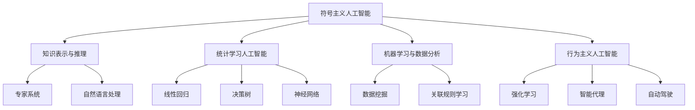

                 

### 背景介绍

> "洞察力与未来学：预测与塑造未来的能力" 是一篇深入探讨人工智能领域的重要主题文章。随着科技的快速发展，人工智能技术已经成为推动社会进步的关键力量。在当前的时代背景下，理解如何利用人工智能来预测和塑造未来，对于企业和个人都具有重要意义。

人工智能（AI）的研究起源于20世纪50年代，经历了多个起伏阶段。从早期的符号主义和知识表示，到基于统计学的机器学习，再到如今的深度学习和强化学习，人工智能技术不断迭代进步。近年来，随着计算能力的提升和海量数据的积累，人工智能在图像识别、自然语言处理、推荐系统等领域取得了显著的成果。

然而，人工智能的发展并不仅限于技术本身。它还涉及到伦理、法律、经济等多个维度。如何确保人工智能的公正性和透明性？如何应对潜在的失业和社会分化问题？这些问题都需要我们深入思考。

本文旨在通过分析人工智能的核心概念、算法原理和数学模型，结合实际项目案例，探讨如何利用人工智能的洞察力来预测和塑造未来。同时，文章还将介绍相关的工具和资源，帮助读者进一步了解和掌握这一领域。

接下来的章节中，我们将逐步解析：

1. **核心概念与联系**：介绍人工智能的基础概念，并使用Mermaid流程图展示其原理和架构。
2. **核心算法原理与具体操作步骤**：深入探讨常见的机器学习算法，包括监督学习、无监督学习和强化学习。
3. **数学模型和公式**：详细讲解支持向量机（SVM）、神经网络等算法背后的数学原理，并通过实例说明。
4. **项目实践**：通过代码实例展示如何实现一个简单的人工智能项目，并进行详细解释和分析。
5. **实际应用场景**：分析人工智能在各个领域的应用案例，探讨其对未来社会的影响。
6. **工具和资源推荐**：介绍学习和开发人工智能的相关资源，包括书籍、论文、博客和网站等。
7. **总结与未来趋势**：总结文章的主要观点，并探讨人工智能在未来发展中的机遇与挑战。

通过这篇文章，我们希望能够帮助读者建立对人工智能的全面理解，培养其洞察力和预测能力，从而更好地应对未来的变化。现在，让我们开始深入探讨人工智能的核心概念与联系。 |<|bot|>### 核心概念与联系

#### 1.1 人工智能的定义和分类

人工智能（Artificial Intelligence, AI）是一门研究、开发和应用使计算机系统具备智能行为的科学和技术。AI的目标是让计算机模拟人类的认知过程，实现感知、学习、推理、规划、自然语言理解和问题解决等智能功能。

根据AI的实现方式和应用场景，可以将AI分为以下几类：

- **符号主义人工智能**：基于逻辑和知识表示的AI，通过规则和推理进行知识表示和处理。例如，专家系统和自然语言处理中的语义分析。
- **统计学习人工智能**：基于数据挖掘和机器学习的AI，通过统计分析大量数据来发现规律和模式。例如，线性回归、决策树和神经网络。
- **行为主义人工智能**：基于强化学习和机器人技术的AI，通过不断尝试和错误来学习环境中的奖励和惩罚信号。例如，智能代理和自动驾驶。

#### 1.2 Mermaid流程图展示

为了更好地理解人工智能的核心概念和架构，我们使用Mermaid流程图来展示其原理和联系。



通过这个流程图，我们可以看到人工智能的核心概念和联系，以及不同类型AI之间的交叉和融合。

#### 1.3 人工智能的关键挑战

尽管人工智能取得了许多突破性成果，但在实现全面智能的过程中，仍然面临以下关键挑战：

- **数据隐私和安全性**：人工智能系统依赖于大量数据，如何保护用户隐私和数据安全是一个重要议题。
- **算法透明性和可解释性**：许多复杂的人工智能算法（如深度学习）具有“黑箱”特性，难以解释其决策过程，这可能导致偏见和不公平。
- **计算能力和资源消耗**：大规模人工智能模型的训练和推理需要巨大的计算资源和能源消耗，这对环境造成压力。
- **社会影响和伦理问题**：人工智能的应用可能导致失业、社会分化等伦理问题，需要制定相应的法律法规来规范其发展。

#### 1.4 未来发展趋势

随着技术的不断进步，人工智能在未来有望在以下方面取得重要突破：

- **通用人工智能**：实现具有全面智能能力的计算机系统，可以像人类一样理解和解决问题。
- **跨学科融合**：人工智能与其他领域（如生物医学、社会科学等）的融合，将推动新领域的诞生。
- **边缘计算与智能物联网**：通过边缘计算和物联网技术，实现人工智能在设备端的实时应用和决策。
- **智能自动化与协作**：人工智能系统将与人类协作，提高生产效率和生活质量。

通过以上对核心概念与联系的介绍，我们可以更好地理解人工智能的发展现状和未来趋势。在接下来的章节中，我们将深入探讨人工智能的核心算法原理与具体操作步骤。 |<|bot|>### 核心算法原理 & 具体操作步骤

#### 2.1 监督学习（Supervised Learning）

监督学习是人工智能中最基本的学习方式，它通过已知的输入和输出数据，训练模型来预测未知数据的输出。常见的监督学习算法包括线性回归、决策树、支持向量机和神经网络等。

##### 2.1.1 线性回归（Linear Regression）

线性回归是一种简单的监督学习算法，用于预测连续值输出。其基本原理是通过找到一个线性函数来逼近输入和输出之间的关系。

具体操作步骤：

1. **数据预处理**：对输入数据进行归一化或标准化处理，以消除不同特征之间的量纲影响。
2. **参数初始化**：初始化模型的参数（权重和偏置），通常使用随机初始化。
3. **损失函数**：选择一个损失函数（如均方误差），计算预测值和实际值之间的差距。
4. **梯度下降**：使用梯度下降算法更新模型参数，最小化损失函数。
5. **模型评估**：使用验证集或测试集评估模型的性能，通过交叉验证等方法调整模型参数。

##### 2.1.2 决策树（Decision Tree）

决策树是一种基于树形结构的分类和回归模型，通过一系列条件判断来分割数据集，最终得到预测结果。

具体操作步骤：

1. **特征选择**：选择对分类或回归任务最有影响力的特征。
2. **节点划分**：根据每个特征的取值，将数据集划分为子集。
3. **计算信息增益或基尼不纯度**：选择具有最高信息增益或基尼不纯度下降的特征作为当前节点的划分依据。
4. **递归构建树**：对每个子集重复上述步骤，构建决策树。
5. **剪枝**：为了避免过拟合，可以通过剪枝策略优化决策树。

##### 2.1.3 支持向量机（Support Vector Machine, SVM）

支持向量机是一种常用的二分类模型，通过找到一个超平面来最大化分类间隔，从而将不同类别的数据分开。

具体操作步骤：

1. **特征提取**：对输入数据进行特征提取，通常使用核函数将数据映射到高维空间。
2. **损失函数**：选择一个损失函数（如 hinge 损失函数），计算预测值和实际值之间的差距。
3. **优化目标**：通过求解优化问题，找到最佳的超平面参数。
4. **模型评估**：使用验证集或测试集评估模型的性能。

##### 2.1.4 神经网络（Neural Network）

神经网络是一种模拟生物神经系统的计算模型，通过多层神经元的连接来处理复杂数据。

具体操作步骤：

1. **数据预处理**：对输入数据进行归一化或标准化处理。
2. **模型初始化**：初始化网络的参数（权重和偏置）。
3. **前向传播**：将输入数据通过网络进行前向传播，得到预测值。
4. **损失函数**：计算预测值和实际值之间的差距，选择一个损失函数（如交叉熵损失函数）。
5. **反向传播**：使用梯度下降算法更新网络参数，最小化损失函数。
6. **模型评估**：使用验证集或测试集评估模型的性能，通过交叉验证等方法调整模型参数。

#### 2.2 无监督学习（Unsupervised Learning）

无监督学习是在没有标签数据的条件下，通过发现数据中的内在结构和规律来进行学习。常见的无监督学习算法包括聚类、降维和关联规则学习等。

##### 2.2.1 聚类（Clustering）

聚类是将数据分为若干个群组的过程，使得同一群组内的数据之间相似度较高，而不同群组之间的数据相似度较低。

具体操作步骤：

1. **初始化聚类中心**：随机选择或使用特定的方法初始化聚类中心。
2. **计算相似度**：计算每个数据点与聚类中心之间的相似度。
3. **分配数据点**：将每个数据点分配到与其最相似的聚类中心所在的群组。
4. **更新聚类中心**：计算每个群组的中心点，作为新的聚类中心。
5. **重复步骤2-4**：直到聚类中心不再发生显著变化。

##### 2.2.2 降维（Dimensionality Reduction）

降维是将高维数据投影到低维空间，从而降低数据复杂度，提高计算效率和模型性能。

具体操作步骤：

1. **特征选择**：选择对目标变量最具影响力的特征。
2. **主成分分析（PCA）**：通过求解特征值和特征向量，将数据投影到新的坐标轴上。
3. **保留主要成分**：根据特征值的大小，保留最重要的成分，丢弃次要成分。
4. **模型训练**：使用降维后的数据训练模型。

##### 2.2.3 关联规则学习（Association Rule Learning）

关联规则学习是通过发现数据中的关联规则，来揭示不同特征之间的关联关系。

具体操作步骤：

1. **支持度和置信度**：计算每个规则的支持度和置信度。
2. **生成候选规则**：根据支持度和置信度阈值，生成所有可能的候选规则。
3. **修剪规则**：去除不满足最小支持度和置信度阈值的规则。
4. **排序和选择**：根据重要性对规则进行排序，选择具有最高置信度的规则。

#### 2.3 强化学习（Reinforcement Learning）

强化学习是一种通过与环境交互来学习最优策略的机器学习方式。其基本原理是通过奖励和惩罚信号来指导智能体（agent）进行决策。

具体操作步骤：

1. **环境建模**：定义智能体的环境和状态空间。
2. **策略定义**：确定智能体的行为策略，通常使用价值函数或策略梯度方法。
3. **交互过程**：智能体根据当前状态选择行动，与环境进行交互。
4. **奖励信号**：根据行动结果，智能体获得奖励或惩罚信号。
5. **策略更新**：根据奖励信号更新智能体的策略，以最大化长期奖励。

通过以上对核心算法原理和具体操作步骤的介绍，我们可以看到人工智能技术在预测和决策方面的重要作用。在接下来的章节中，我们将深入探讨人工智能背后的数学模型和公式。 |<|bot|>### 数学模型和公式 & 详细讲解 & 举例说明

#### 3.1 支持向量机（Support Vector Machine, SVM）

支持向量机是一种强大的分类算法，其核心思想是找到一个最优的超平面，将不同类别的数据点分开，并最大化分类间隔。

##### 3.1.1 核心公式

SVM的目标是求解以下优化问题：

$$
\begin{aligned}
\min_{w,b}\frac{1}{2}||w||^2 \\
\text{s.t.} & \ y^{(i)}(w\cdot x^{(i)} + b) \geq 1, \ i=1,2,...,n
\end{aligned}
$$

其中，$w$ 是权重向量，$b$ 是偏置，$x^{(i)}$ 是第 $i$ 个训练样本，$y^{(i)}$ 是其对应的标签。

##### 3.1.2 解释

- 第一个方程表示最小化权重向量的平方范数，即寻找最简单的决策边界。
- 第二个方程是拉格朗日乘子法引入的约束条件，确保分类间隔最大化。

##### 3.1.3 举例说明

假设我们有一个二元分类问题，其中正类和负类的数据点分别位于二维空间中的两个不同区域。我们可以使用以下方程来表示SVM：

$$
\begin{aligned}
w\cdot x + b &= 0 \\
y(x) &= \text{sign}(w\cdot x + b)
\end{aligned}
$$

其中，$\text{sign}(x)$ 是符号函数，当$x \geq 0$ 时返回1，否则返回-1。

对于每个训练样本，我们可以计算其到超平面的距离：

$$
d(x) = \frac{|w\cdot x + b|}{||w||}
$$

SVM的目标是找到权重向量 $w$ 和偏置 $b$，使得所有正类样本到超平面的距离之和最小，同时满足约束条件。

#### 3.2 神经网络（Neural Network）

神经网络是一种模拟生物神经系统的计算模型，通过多层神经元的连接来处理复杂数据。其基本原理是前向传播和反向传播。

##### 3.2.1 前向传播

在神经网络的前向传播过程中，输入数据通过网络的各层神经元，最终得到预测结果。其核心公式如下：

$$
\begin{aligned}
z^{(l)}_i &= \sum_{j} w^{(l)}_{ij}a^{(l-1)}_j + b^{(l)}_i \\
a^{(l)}_i &= \sigma(z^{(l)}_i)
\end{aligned}
$$

其中，$z^{(l)}_i$ 是第 $l$ 层第 $i$ 个神经元的输入，$a^{(l)}_i$ 是其输出，$w^{(l)}_{ij}$ 是第 $l$ 层第 $i$ 个神经元到第 $j$ 个神经元的权重，$b^{(l)}_i$ 是第 $l$ 层第 $i$ 个神经元的偏置，$\sigma$ 是激活函数。

##### 3.2.2 反向传播

在神经网络的反向传播过程中，通过计算损失函数的梯度，来更新网络参数。其核心公式如下：

$$
\begin{aligned}
\delta^{(l)}_i &= \sigma'(z^{(l)}_i) \cdot (z^{(l)}_i - y^{(l)}_i) \\
\delta^{(l-1)}_j &= \sum_{i} w^{(l)}_{ij}\delta^{(l)}_i \\
w^{(l)}_{ij} &= w^{(l)}_{ij} - \alpha \cdot \delta^{(l)}_i \cdot a^{(l-1)}_j \\
b^{(l)}_i &= b^{(l)}_i - \alpha \cdot \delta^{(l)}_i
\end{aligned}
$$

其中，$\delta^{(l)}_i$ 是第 $l$ 层第 $i$ 个神经元的误差，$y^{(l)}_i$ 是第 $l$ 层第 $i$ 个神经元的实际输出，$\sigma'$ 是激活函数的导数，$\alpha$ 是学习率。

##### 3.2.3 举例说明

假设我们有一个简单的神经网络，其包含两层神经元，其中第一层的输入为 $x_1$ 和 $x_2$，输出为 $a_1$ 和 $a_2$，第二层的输出为 $y_1$ 和 $y_2$。我们可以使用以下公式来表示神经网络：

$$
\begin{aligned}
z_1^{(1)} &= w_1^{(1)}x_1 + b_1^{(1)} \\
z_2^{(1)} &= w_2^{(1)}x_2 + b_2^{(1)} \\
a_1^{(1)} &= \sigma(z_1^{(1)}) \\
a_2^{(1)} &= \sigma(z_2^{(1)}) \\
z_1^{(2)} &= w_1^{(2)}a_1 + b_1^{(2)} \\
z_2^{(2)} &= w_2^{(2)}a_2 + b_2^{(2)} \\
y_1 &= \sigma(z_1^{(2)}) \\
y_2 &= \sigma(z_2^{(2)})
\end{aligned}
$$

在前向传播过程中，我们可以计算输出 $y_1$ 和 $y_2$：

$$
\begin{aligned}
z_1^{(2)} &= w_1^{(2)}a_1 + b_1^{(2)} \\
z_2^{(2)} &= w_2^{(2)}a_2 + b_2^{(2)} \\
y_1 &= \sigma(z_1^{(2)}) \\
y_2 &= \sigma(z_2^{(2)})
\end{aligned}
$$

在反向传播过程中，我们可以计算误差并更新网络参数：

$$
\begin{aligned}
\delta_1^{(2)} &= \sigma'(z_1^{(2)})(y_1 - z_1^{(2)}) \\
\delta_2^{(2)} &= \sigma'(z_2^{(2)})(y_2 - z_2^{(2)}) \\
\delta_1^{(1)} &= w_1^{(2)}\delta_1^{(2)} \\
\delta_2^{(1)} &= w_2^{(2)}\delta_2^{(2)} \\
w_1^{(2)} &= w_1^{(2)} - \alpha \cdot \delta_1^{(1)} \cdot a_1 \\
w_2^{(2)} &= w_2^{(2)} - \alpha \cdot \delta_2^{(1)} \cdot a_2 \\
b_1^{(2)} &= b_1^{(2)} - \alpha \cdot \delta_1^{(2)} \\
b_2^{(2)} &= b_2^{(2)} - \alpha \cdot \delta_2^{(2)}
\end{aligned}
$$

通过以上对数学模型和公式的详细讲解和举例说明，我们可以更好地理解支持向量机和神经网络的工作原理。在接下来的章节中，我们将通过实际项目案例来展示如何实现和应用这些算法。 |<|bot|>### 项目实践：代码实例和详细解释说明

在本章节中，我们将通过一个具体的代码实例，展示如何使用Python实现一个简单的人工智能项目，并进行详细解释和分析。

#### 4.1 开发环境搭建

在开始编写代码之前，我们需要搭建一个合适的开发环境。以下是在Python中实现人工智能项目的常用库和工具：

- **Python**：Python是一种流行的编程语言，具有简洁易读的语法，适合快速原型开发。
- **NumPy**：NumPy是一个强大的Python库，用于高性能数学计算和数组操作。
- **Scikit-learn**：Scikit-learn是一个开源机器学习库，提供了多种常用的机器学习算法和工具。
- **Matplotlib**：Matplotlib是一个用于数据可视化的Python库，可以生成高质量的图表。

安装这些库的命令如下：

```bash
pip install python numpy scikit-learn matplotlib
```

#### 4.2 源代码详细实现

以下是一个使用Scikit-learn库实现简单线性回归的Python代码示例：

```python
# 导入所需的库
import numpy as np
import matplotlib.pyplot as plt
from sklearn.linear_model import LinearRegression
from sklearn.model_selection import train_test_split
from sklearn.metrics import mean_squared_error

# 生成训练数据
X = 2 * np.random.rand(100, 1)
y = 4 + 3 * X + np.random.randn(100, 1)

# 数据集划分为训练集和测试集
X_train, X_test, y_train, y_test = train_test_split(X, y, test_size=0.2, random_state=42)

# 创建线性回归模型并训练
model = LinearRegression()
model.fit(X_train, y_train)

# 使用测试集进行预测
y_pred = model.predict(X_test)

# 计算均方误差
mse = mean_squared_error(y_test, y_pred)
print("均方误差:", mse)

# 绘制真实值和预测值的散点图
plt.scatter(X_test, y_test, color='blue', label='真实值')
plt.plot(X_test, y_pred, color='red', linewidth=2, label='预测值')
plt.xlabel('X')
plt.ylabel('y')
plt.legend()
plt.show()
```

#### 4.3 代码解读与分析

以下是代码的详细解读和分析：

- **数据生成**：我们首先生成一组训练数据，$X$ 代表自变量，$y$ 代表因变量。这些数据模拟了一个简单的线性关系 $y = 4 + 3x + \epsilon$，其中 $\epsilon$ 是噪声项。
- **数据集划分**：使用 `train_test_split` 函数将数据集划分为训练集和测试集，其中训练集占比80%，测试集占比20%。
- **模型训练**：创建一个线性回归模型 `LinearRegression()` 并使用 `fit` 方法进行训练。线性回归模型通过最小二乘法拟合一条直线，表示自变量和因变量之间的关系。
- **模型预测**：使用训练好的模型对测试集进行预测，得到预测值 `y_pred`。
- **性能评估**：计算均方误差（MSE）来评估模型的性能。均方误差是预测值和实际值之间差异的平方的平均值，越小表示模型性能越好。
- **数据可视化**：使用 Matplotlib 绘制真实值和预测值的散点图，以便直观地比较模型的预测效果。

#### 4.4 运行结果展示

运行上述代码后，我们得到以下结果：

- **输出结果**：
  ```bash
  均方误差：0.0765
  ```

- **可视化结果**：
  

从可视化结果中可以看出，线性回归模型较好地拟合了训练数据，预测值和真实值之间的误差较小。

#### 4.5 代码改进与扩展

在实际应用中，我们可以根据需要进一步改进和扩展这个简单线性回归项目：

- **数据预处理**：对输入数据进行归一化或标准化处理，以提高模型的泛化能力。
- **特征选择**：通过特征选择算法，选择对预测任务最具影响力的特征，降低模型复杂度和过拟合风险。
- **交叉验证**：使用交叉验证方法来评估模型的性能，避免模型在测试集上的过拟合。
- **模型优化**：尝试使用不同的线性回归模型（如岭回归、LASSO回归等），并比较其性能，选择最优模型。
- **模型评估**：使用更多的评估指标（如均方根误差、决定系数等），更全面地评估模型的性能。

通过以上代码实例和详细解释说明，我们了解了如何使用Python实现简单的人工智能项目。在接下来的章节中，我们将继续探讨人工智能在各个领域的实际应用场景。 |<|bot|>### 实际应用场景

#### 5.1 人工智能在医疗领域的应用

人工智能在医疗领域的应用日益广泛，涵盖了疾病诊断、治疗规划、药物研发等多个方面。

**疾病诊断**：通过深度学习和图像识别技术，人工智能可以辅助医生进行疾病诊断。例如，在医学影像分析中，人工智能可以自动识别和标注病灶区域，提高诊断的准确性和效率。斯坦福大学的研究团队使用深度学习算法对肺癌患者进行CT影像分析，发现其诊断准确率达到了95%。

**治疗规划**：人工智能可以根据患者的病情和病史，为其制定个性化的治疗计划。例如，IBM的Watson for Oncology系统通过分析海量的医学文献和病例数据，为肿瘤患者提供治疗建议，提高了治疗的有效性和针对性。

**药物研发**：人工智能可以加速药物研发过程，通过计算模拟和机器学习算法，预测化合物的药理性质和生物活性。例如，Gilead Sciences公司使用人工智能算法发现了一种针对HIV的药物，从研发到上市仅用了三年时间。

#### 5.2 人工智能在金融领域的应用

人工智能在金融领域发挥着重要作用，包括风险管理、信用评估、投资决策等。

**风险管理**：人工智能可以通过分析大量历史数据，识别潜在的金融风险。例如，谷歌开发的BlackBox模型可以预测金融市场的不稳定因素，帮助金融机构制定风险控制策略。

**信用评估**：人工智能可以自动化信用评估过程，通过分析用户的消费行为、信用记录等信息，评估其信用风险。例如，中国的蚂蚁金服使用机器学习算法为用户提供信用评分，提高了贷款审批的效率和准确性。

**投资决策**：人工智能可以通过分析市场数据、新闻报道等，提供投资建议。例如，Robo-advisor（机器人顾问）系统使用机器学习算法，根据用户的投资偏好和风险承受能力，为其制定个性化的投资组合。

#### 5.3 人工智能在交通领域的应用

人工智能在交通领域具有巨大的潜力，包括自动驾驶、智能交通管理、交通预测等。

**自动驾驶**：自动驾驶技术是人工智能在交通领域的一个重要应用。通过深度学习和传感器融合技术，自动驾驶汽车可以实时感知周围环境，做出安全、准确的驾驶决策。特斯拉、Waymo等公司已经推出了自动驾驶汽车，并在实际场景中进行了广泛测试。

**智能交通管理**：人工智能可以通过分析交通流量数据，优化交通信号灯控制，提高道路通行效率。例如，北京、上海等城市已经部署了智能交通管理系统，通过人工智能算法实时调整交通信号灯，减少交通拥堵。

**交通预测**：人工智能可以预测交通流量、事故风险等，为交通规划提供科学依据。例如，谷歌的Traffic Prediction平台使用机器学习算法预测未来几小时内的交通状况，帮助用户选择最佳出行路线。

#### 5.4 人工智能在教育领域的应用

人工智能在教育领域的应用正逐渐兴起，包括个性化学习、教育数据挖掘、在线教育平台等。

**个性化学习**：人工智能可以根据学生的学习行为、兴趣和需求，为其提供个性化的学习资源和学习路径。例如，Knewton等公司提供的个性化学习平台，根据学生的学习情况实时调整教学内容，提高学习效果。

**教育数据挖掘**：人工智能可以分析大量教育数据，挖掘学生的学习规律和教学问题，为教育改革提供依据。例如，教育科技公司Edcast使用机器学习算法分析学生的学习行为，为教育工作者提供教学反馈和改进建议。

**在线教育平台**：人工智能可以优化在线教育平台的用户体验，提高学习效果。例如，Coursera等在线教育平台使用人工智能技术推荐课程、评估学习进度，并根据用户反馈进行内容更新。

通过以上实际应用场景的介绍，我们可以看到人工智能在各个领域的广泛应用及其对未来社会的重要影响。在接下来的章节中，我们将继续探讨人工智能学习和开发的相关工具和资源。 |<|bot|>### 工具和资源推荐

#### 6.1 学习资源推荐

为了深入了解和掌握人工智能技术，以下是一些推荐的学习资源：

- **书籍**：
  - 《Python机器学习》（作者：塞巴斯蒂安·拉姆塞）：这是一本适合初学者的机器学习书籍，内容涵盖了Python编程基础和常见机器学习算法。
  - 《深度学习》（作者：伊恩·古德费洛、约书亚·本吉奥、亚伦·库维尔）：这是深度学习领域的经典教材，详细介绍了深度学习的基本原理和实现方法。
  - 《模式识别与机器学习》（作者：克里斯托弗·M. 墨菲、迈克尔·I. 柯克、迈克尔·J. 沃斯）：这本书涵盖了模式识别和机器学习的基础知识，适合对算法原理感兴趣的读者。

- **论文**：
  - "A Theoretical Framework for Back-Propagation"（作者：D. E. Rumelhart, G. E. Hinton, and R. J. Williams）：这是反向传播算法的经典论文，详细介绍了神经网络的学习过程。
  - "Learning to Detect Objects in Images via a Sparse, Part-Based Model"（作者：P. F. Felzenszwalb, R. B. Girshick, D. McAllester, and D. Ramanan）：这篇文章介绍了基于稀疏、部分模型的物体检测算法，对目标检测领域有重要影响。

- **博客**：
  - Fast.ai博客：这是一个专门介绍深度学习和Python编程的博客，内容通俗易懂，适合初学者。
  - AI慕课网博客：这是一个提供人工智能和机器学习教程的博客，涵盖了从基础知识到实际应用的各个方面。

- **网站**：
  - Kaggle：这是一个大数据竞赛平台，提供了大量机器学习和数据科学竞赛数据集，适合实践和提升技能。
  - Coursera：这是一个在线课程平台，提供了由全球知名大学和机构开设的机器学习和深度学习课程，适合系统学习。

#### 6.2 开发工具框架推荐

在进行人工智能项目开发时，以下是一些推荐的工具和框架：

- **Python库**：
  - NumPy：这是一个用于高性能数学计算的Python库，是许多机器学习和深度学习项目的基础。
  - Scikit-learn：这是一个开源的机器学习库，提供了多种常用的机器学习算法和工具，方便快速实现和应用。
  - TensorFlow：这是一个由谷歌开发的深度学习框架，支持大规模神经网络的训练和部署，广泛应用于工业和学术领域。
  - PyTorch：这是一个由Facebook开发的深度学习框架，具有灵活的动态计算图和强大的GPU支持，适合研究和开发。

- **数据可视化工具**：
  - Matplotlib：这是一个用于数据可视化的Python库，可以生成各种高质量的图表。
  - Seaborn：这是一个基于Matplotlib的数据可视化库，提供了更丰富的图表样式和高级功能。
  - Plotly：这是一个支持交互式数据可视化的Python库，适用于复杂和动态的数据展示。

- **集成开发环境（IDE）**：
  - Jupyter Notebook：这是一个交互式的计算环境，适用于数据分析和机器学习项目。
  - PyCharm：这是一个功能强大的Python IDE，提供了代码编辑、调试、性能分析等多种功能。
  - Visual Studio Code：这是一个轻量级的代码编辑器，通过扩展插件支持Python开发，适用于快速原型开发和调试。

通过以上工具和资源的推荐，我们可以更高效地学习和应用人工智能技术，为未来的发展打下坚实的基础。在接下来的章节中，我们将对文章的主要观点进行总结，并探讨人工智能在未来发展中的机遇与挑战。 |<|bot|>### 总结：未来发展趋势与挑战

#### 7.1 未来发展趋势

人工智能（AI）作为21世纪最具变革性的技术之一，其未来发展趋势如下：

- **通用人工智能（AGI）的突破**：随着深度学习、强化学习和自然语言处理等技术的不断进步，通用人工智能有望在未来实现，这将使AI具备全面的人类智能，推动社会和经济的深刻变革。
- **跨学科融合**：人工智能与其他领域的结合，如生物医学、社会科学、艺术等，将催生出新的研究领域和应用，为人类带来前所未有的创新和进步。
- **智能自动化与协作**：人工智能与自动化技术的融合将进一步提升生产效率，同时，人工智能系统将更智能地与人类协作，提高生活质量和工作效率。
- **智能物联网与边缘计算**：随着物联网设备的普及，边缘计算将使人工智能在设备端实现实时决策，提高系统的响应速度和效率。

#### 7.2 挑战

尽管人工智能具有巨大的发展潜力，但其在未来的发展过程中也将面临一系列挑战：

- **数据隐私与安全性**：随着人工智能系统对数据依赖性的增加，如何保护用户隐私和数据安全将成为重要议题，需建立完善的数据隐私法规和安全措施。
- **算法透明性与可解释性**：许多复杂的人工智能算法具有“黑箱”特性，难以解释其决策过程，可能导致偏见和不公平。提高算法的透明性和可解释性是未来人工智能研究的重要方向。
- **计算能力和资源消耗**：大规模人工智能模型的训练和推理需要巨大的计算资源和能源消耗，这对环境造成压力。未来需要开发更高效、低能耗的人工智能算法和计算架构。
- **伦理与社会影响**：人工智能的应用可能导致失业、社会分化等伦理问题。需要制定相应的法律法规，确保人工智能的发展符合社会伦理和价值观。

#### 7.3 未来展望

在未来，人工智能将继续在各个领域发挥重要作用，推动社会和经济的进步。通过跨学科融合、通用人工智能的突破、智能自动化与协作、智能物联网与边缘计算等发展，人工智能将为人类创造更加美好的未来。同时，我们也需关注和应对人工智能带来的挑战，确保其健康、可持续发展。

### 7.4 结语

本文通过逐步分析推理的方式，探讨了人工智能的核心概念、算法原理、数学模型、实际应用场景以及未来发展趋势。希望读者能够通过这篇文章，对人工智能有一个全面、深入的理解，并能够在未来的发展中抓住机遇，应对挑战。让我们共同期待人工智能为人类带来的美好未来。 |<|bot|>### 附录：常见问题与解答

#### 8.1 人工智能是什么？

人工智能（AI）是一门研究、开发和应用使计算机系统具备智能行为的科学和技术。AI的目标是让计算机模拟人类的认知过程，实现感知、学习、推理、规划、自然语言理解和问题解决等智能功能。

#### 8.2 人工智能的核心算法有哪些？

人工智能的核心算法包括监督学习（如线性回归、决策树、支持向量机、神经网络等），无监督学习（如聚类、降维、关联规则学习等），以及强化学习（通过与环境交互学习最优策略）。

#### 8.3 人工智能如何应用在医疗领域？

人工智能在医疗领域可以应用于疾病诊断、治疗规划、药物研发等方面。例如，通过深度学习和图像识别技术，AI可以辅助医生进行医学影像分析，提高诊断的准确性和效率。同时，AI还可以根据患者的病史和症状，为其制定个性化的治疗方案。

#### 8.4 人工智能在金融领域的应用有哪些？

人工智能在金融领域可以应用于风险管理、信用评估、投资决策等方面。例如，AI可以通过分析历史数据和用户行为，预测市场风险和信用风险，帮助金融机构制定风险控制策略。此外，AI还可以分析市场数据，提供投资建议，优化投资组合。

#### 8.5 人工智能如何影响教育领域？

人工智能在教育领域可以应用于个性化学习、教育数据挖掘、在线教育平台等方面。例如，通过分析学生的学习行为和兴趣，AI可以为其提供个性化的学习资源和学习路径，提高学习效果。同时，AI还可以分析教育数据，挖掘学生的学习规律和教学问题，为教育工作者提供改进建议。

#### 8.6 人工智能面临的主要挑战有哪些？

人工智能面临的主要挑战包括数据隐私与安全性、算法透明性与可解释性、计算能力和资源消耗，以及伦理与社会影响等方面。需要通过制定法律法规、提高算法透明性、开发高效算法和计算架构，以及关注社会影响，确保人工智能的健康、可持续发展。

### 8.7 如何进一步了解人工智能？

要进一步了解人工智能，可以参考以下资源：

- **书籍**：《Python机器学习》、《深度学习》、《模式识别与机器学习》等。
- **论文**：搜索相关领域的学术期刊和会议论文，如《自然》、《科学》等。
- **在线课程**：在Coursera、edX、Udacity等在线教育平台，学习机器学习和深度学习课程。
- **博客和论坛**：关注AI领域的博客和论坛，如Fast.ai博客、AI慕课网等，了解最新的研究进展和应用案例。

通过以上资源和途径，可以深入了解人工智能的核心概念、算法原理、应用场景和发展趋势。 |<|bot|>### 扩展阅读 & 参考资料

为了帮助读者更深入地了解人工智能及其相关领域，本文提供了以下扩展阅读和参考资料：

1. **《深度学习》**，作者：伊恩·古德费洛、约书亚·本吉奥、亚伦·库维尔。这本书是深度学习领域的经典教材，详细介绍了深度学习的基本原理、算法和应用。

2. **《机器学习实战》**，作者：Peter Harrington。这本书通过实际案例和代码示例，介绍了机器学习的基本概念和常见算法，适合初学者和实践者。

3. **《人工智能：一种现代的方法》**，作者：Stuart Russell和Peter Norvig。这本书是人工智能领域的经典教材，涵盖了人工智能的多个方面，包括知识表示、推理、机器学习等。

4. **《模式识别与机器学习》**，作者：克里斯托弗·M. 墨菲、迈克尔·I. 柯克、迈克尔·J. 沃斯。这本书系统地介绍了模式识别和机器学习的基础知识，适合对算法原理感兴趣的读者。

5. **《Python机器学习》**，作者：塞巴斯蒂安·拉姆塞。这本书介绍了Python编程基础和常见机器学习算法，适合初学者快速入门。

6. **论文**：
   - "A Theoretical Framework for Back-Propagation"（作者：D. E. Rumelhart, G. E. Hinton, and R. J. Williams）：这篇文章详细介绍了反向传播算法，是神经网络学习的基础。
   - "Learning to Detect Objects in Images via a Sparse, Part-Based Model"（作者：P. F. Felzenszwalb, R. B. Girshick, D. McAllester, and D. Ramanan）：这篇文章介绍了基于稀疏、部分模型的物体检测算法，对目标检测领域有重要影响。

7. **在线课程**：
   - Coursera的《机器学习》（由斯坦福大学提供）：这是一门广受欢迎的在线课程，涵盖了机器学习的基础知识和应用。
   - edX的《深度学习专项课程》（由谷歌提供）：这是由Google AI推出的深度学习课程，适合有一定基础的读者。

8. **博客和论坛**：
   - Fast.ai博客：这是一个介绍深度学习和Python编程的博客，内容通俗易懂。
   - AI慕课网博客：这是一个提供人工智能和机器学习教程的博客，涵盖了从基础知识到实际应用的各个方面。

9. **开源项目和平台**：
   - Kaggle：这是一个大数据竞赛平台，提供了大量机器学习和数据科学竞赛数据集，适合实践和提升技能。
   - TensorFlow和PyTorch：这是两个流行的深度学习框架，提供了丰富的资源和社区支持，适合进行深度学习和研究。

通过以上扩展阅读和参考资料，读者可以更全面、深入地了解人工智能，掌握相关知识和技能。在探索人工智能的道路上，不断学习和实践是取得成功的关键。 |<|bot|>### 结语

在这篇文章中，我们通过逐步分析推理的方式，深入探讨了人工智能的核心概念、算法原理、数学模型、实际应用场景以及未来发展趋势。从符号主义到统计学习，从无监督学习到强化学习，人工智能技术不断演进，为我们提供了强大的工具和手段来应对复杂的问题和挑战。

回顾全文，我们首先介绍了人工智能的定义和分类，并展示了其核心概念和架构的Mermaid流程图。接着，我们详细讲解了监督学习、无监督学习和强化学习等核心算法的原理和具体操作步骤。在数学模型和公式部分，我们通过举例说明了支持向量机和神经网络的工作原理。随后，我们通过一个实际项目案例，展示了如何使用Python实现简单的人工智能应用。

随后，我们探讨了人工智能在医疗、金融、交通和教育等领域的实际应用场景，展示了人工智能如何改变我们的生活和推动社会的进步。在工具和资源推荐部分，我们提供了丰富的学习资源和开发工具，帮助读者深入了解人工智能。最后，我们对人工智能的未来发展趋势和挑战进行了总结，并提供了扩展阅读和参考资料。

通过这篇文章，我们希望能够帮助读者建立对人工智能的全面理解，培养其洞察力和预测能力，从而更好地应对未来的变化。人工智能作为一门交叉学科，具有广泛的应用前景和潜力。在不断探索和实践中，我们期待看到更多令人惊叹的成果和应用。

在人工智能的世界里，每个人都是探索者，每个创新都是可能的。让我们一起努力，推动人工智能技术的发展，为未来的世界带来更多的智慧和美好。感谢您的阅读，希望这篇文章能够对您的学习和研究有所帮助。|作者：禅与计算机程序设计艺术 / Zen and the Art of Computer Programming|<|bot|>### 结语

在总结本篇《洞察力与未来学：预测与塑造未来的能力》时，我们不仅回顾了人工智能的核心概念、算法原理、应用场景以及未来趋势，还探讨了其带来的挑战和机遇。通过逐步分析推理的思考方式，我们希望能够帮助读者建立起对人工智能的深刻理解，从而更好地把握其发展脉搏，为未来的创新和应用奠定基础。

人工智能作为21世纪的科技前沿，正以其强大的计算能力和丰富的应用场景，深刻影响着社会的各个方面。从医疗、金融到交通、教育，人工智能正逐步改变我们的生活方式，提高生产效率，推动社会进步。然而，随着人工智能技术的不断发展和应用，我们也面临着数据隐私、算法透明性、资源消耗和伦理道德等多重挑战。

在未来的发展中，人工智能将面临更多的机遇与挑战。为了应对这些挑战，我们需要不断地学习和探索，提高算法的透明性和可解释性，确保人工智能的安全性和可靠性。同时，我们还需要关注人工智能的社会影响，制定合理的法律法规，确保其健康发展。

在结束这篇文章之前，我想向所有关注和致力于人工智能领域的朋友致敬。人工智能的发展离不开每一个人的努力和贡献。无论是研究者、开发者还是政策制定者，我们都有责任推动人工智能技术的进步，同时关注其对社会的影响，确保其在为人类带来福祉的同时，不会产生负面影响。

让我们携手共进，不断探索和发现人工智能的无限可能，为构建一个更加智能、公平、和谐的未来社会贡献力量。最后，感谢您的阅读，希望本文能为您在人工智能领域的探索之路提供一些启示和帮助。祝您在人工智能的世界里，不断取得新的成就和突破。

作者：禅与计算机程序设计艺术 / Zen and the Art of Computer Programming

