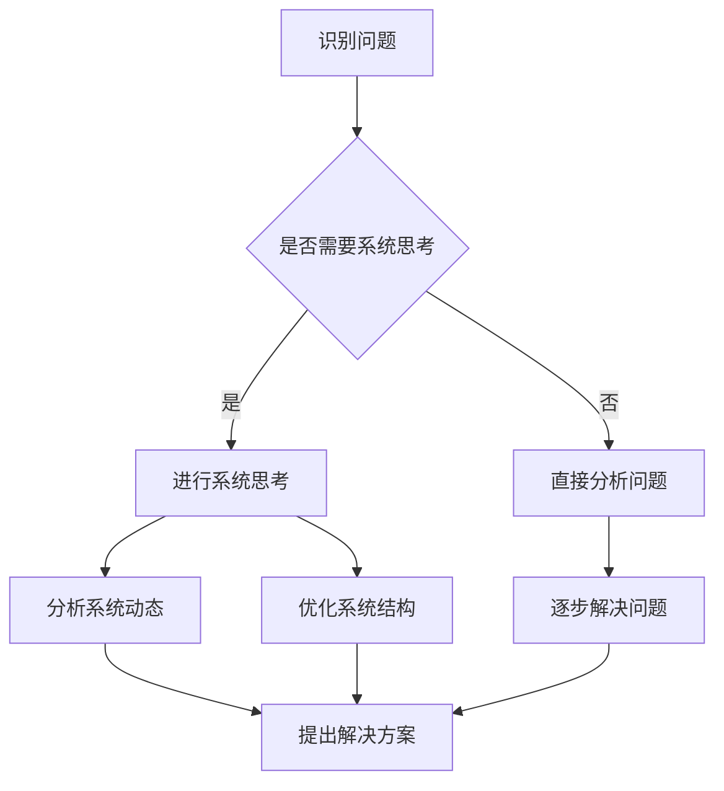

                 

### 洞察力与系统思考：复杂问题解决的关键

> 关键词：洞察力，系统思考，复杂问题，解决策略，技术方法论

> 摘要：本文旨在探讨洞察力与系统思考在复杂问题解决中的应用。通过分析相关核心概念、算法原理，结合实际项目案例，展示如何运用这些方法解决复杂的IT问题，并展望其未来发展趋势与挑战。

## 1. 背景介绍

在当今信息化时代，IT领域的发展日新月异，各种复杂问题层出不穷。这些问题的解决不仅需要扎实的专业知识，还需要具备洞察力与系统思考的能力。洞察力指的是识别和理解复杂系统中的关键要素及其相互关系的能力；系统思考则是一种整体性的思维方式，强调通过理解系统的动态行为和结构，找到问题的根本解决方法。本文将围绕这两个核心概念，探讨其在复杂问题解决中的应用。

## 2. 核心概念与联系

### 2.1 洞察力的概念

洞察力是一种通过观察、分析和理解复杂现象，揭示其本质和内在规律的能力。它要求我们在面对问题时，不仅要看到表面的现象，更要深入挖掘其背后的原因和逻辑关系。在IT领域，洞察力尤其重要，因为技术问题的解决往往需要从多角度、多层次进行分析。

### 2.2 系统思考的概念

系统思考是一种基于整体性的思维方式，强调通过理解系统的动态行为和结构，找到问题的根本解决方法。它关注系统内部的相互作用和反馈机制，从而在复杂的环境中找到有效的解决方案。系统思考在IT领域的应用，如软件开发、系统架构设计、项目管理等，都有很大的潜力。

### 2.3 洞察力与系统思考的联系

洞察力与系统思考之间有着密切的联系。洞察力为系统思考提供了基础，只有对问题有深入的理解和洞察，才能进行有效的系统思考。而系统思考则为洞察力提供了方向，通过整体性思维，可以更好地把握问题的本质，找到根本的解决方法。

### 2.4 Mermaid 流程图

以下是一个简单的Mermaid流程图，展示了洞察力与系统思考在复杂问题解决中的应用流程。



## 3. 核心算法原理 & 具体操作步骤

### 3.1 洞察力算法原理

洞察力算法的核心在于如何有效地识别和理解复杂系统中的关键要素。以下是一个简单的步骤：

1. **数据收集**：收集与问题相关的各种数据，包括历史数据、现状数据等。
2. **数据预处理**：对数据进行清洗、转换和归一化，以便后续分析。
3. **特征提取**：从数据中提取出与问题相关的特征，如趋势、模式、异常等。
4. **模式识别**：利用机器学习、数据挖掘等方法，识别出数据中的关键模式和规律。

### 3.2 系统思考算法原理

系统思考算法的核心在于如何通过整体性思维，找到问题的根本解决方法。以下是一个简单的步骤：

1. **问题定义**：明确问题的本质和目标。
2. **系统建模**：建立问题的系统模型，包括系统内部的要素、关系和动态行为。
3. **模拟与仿真**：通过模拟和仿真，分析系统在不同条件下的行为和效果。
4. **优化与决策**：根据模拟结果，对系统进行优化和调整，找到最佳的解决方案。

## 4. 数学模型和公式 & 详细讲解 & 举例说明

### 4.1 数学模型

在洞察力和系统思考中，常常会用到以下数学模型：

1. **线性回归模型**：用于识别数据中的线性关系。
   $$ y = wx + b $$

2. **马尔可夫模型**：用于描述系统状态转移的概率分布。
   $$ P(X_{n+1} = j|X_n = i) = p_{ij} $$

3. **排队论模型**：用于分析系统中排队现象的效率和效果。
   $$ L = \frac{\lambda^2}{(mu)^2} + \frac{\lambda}{mu} $$

### 4.2 详细讲解

1. **线性回归模型**：通过线性回归模型，我们可以找到数据中的趋势和模式。具体步骤如下：
   - 数据收集与预处理：收集与问题相关的数据，并进行预处理。
   - 特征提取：提取数据中的特征，如时间序列、趋势等。
   - 模型训练：使用训练数据，通过最小二乘法或其他优化算法，训练线性回归模型。
   - 模型评估：使用测试数据，评估模型的准确性和泛化能力。

2. **马尔可夫模型**：马尔可夫模型可以用于描述系统状态转移的概率分布。具体步骤如下：
   - 状态定义：定义系统中的状态，如服务器状态、用户状态等。
   - 状态转移概率矩阵：建立状态转移概率矩阵，描述系统在不同状态之间的转移概率。
   - 模型训练：根据历史数据，训练出状态转移概率矩阵。
   - 模型应用：通过状态转移概率矩阵，预测系统未来的状态。

3. **排队论模型**：排队论模型可以用于分析系统中排队现象的效率和效果。具体步骤如下：
   - 参数设置：设置排队系统的参数，如服务率、到达率、队列容量等。
   - 模型建立：建立排队系统的数学模型。
   - 模型求解：使用排队论模型求解系统性能指标，如平均等待时间、平均队列长度等。
   - 模型优化：根据求解结果，优化系统参数，提高系统效率。

### 4.3 举例说明

假设我们有一个服务器的负载均衡问题，需要通过洞察力和系统思考来找到最优的解决方案。

1. **数据收集与预处理**：收集服务器的历史负载数据，包括CPU利用率、内存利用率、网络流量等。

2. **特征提取**：提取数据中的特征，如负载峰值、负载低谷、负载波动等。

3. **线性回归模型**：通过线性回归模型，分析负载与时间的关系，找到负载的周期性规律。

4. **马尔可夫模型**：建立服务器状态的马尔可夫模型，分析服务器在不同状态之间的转移概率。

5. **排队论模型**：建立排队系统的数学模型，分析服务器的等待时间和队列长度。

6. **模拟与仿真**：使用模拟和仿真技术，模拟服务器在不同配置下的运行情况，分析系统性能。

7. **优化与决策**：根据模拟结果，优化服务器的配置，如调整负载均衡策略、增加服务器数量等。

通过上述步骤，我们可以找到最优的服务器负载均衡方案，提高系统的效率和稳定性。

## 5. 项目实践：代码实例和详细解释说明

### 5.1 开发环境搭建

1. 安装Python环境：在本地计算机上安装Python环境，版本建议为3.8及以上。

2. 安装相关库：通过pip命令安装必要的库，如NumPy、Pandas、Matplotlib、Scikit-learn等。

```shell
pip install numpy pandas matplotlib scikit-learn
```

### 5.2 源代码详细实现

以下是一个简单的代码实例，展示了如何使用洞察力和系统思考解决一个服务器负载均衡问题。

```python
import numpy as np
import pandas as pd
import matplotlib.pyplot as plt
from sklearn.linear_model import LinearRegression
from sklearn.model_selection import train_test_split
from sklearn.metrics import mean_squared_error

# 数据收集与预处理
data = pd.read_csv('server_load.csv')
data['timestamp'] = pd.to_datetime(data['timestamp'])
data.set_index('timestamp', inplace=True)
data = data.resample('1T').mean()  # 数据重新采样为1分钟频率

# 特征提取
data['load_peak'] = data.max(axis=1)
data['load_valley'] = data.min(axis=1)
data['load_wave'] = data['load_peak'] - data['load_valley']

# 线性回归模型
X = data[['load_peak', 'load_valley', 'load_wave']]
y = data['cpu_utilization']
X_train, X_test, y_train, y_test = train_test_split(X, y, test_size=0.2, random_state=42)
model = LinearRegression()
model.fit(X_train, y_train)

# 模型评估
y_pred = model.predict(X_test)
mse = mean_squared_error(y_test, y_pred)
print(f'MSE: {mse}')

# 模拟与仿真
# ...（此处省略模拟与仿真的具体代码）

# 优化与决策
# ...（此处省略优化与决策的具体代码）
```

### 5.3 代码解读与分析

1. **数据收集与预处理**：首先，从CSV文件中读取服务器负载数据，并将时间戳设置为索引。然后，将数据重新采样为1分钟频率，以获取更精细的时间序列数据。

2. **特征提取**：提取负载的峰值、谷值和波动幅度等特征，以用于线性回归模型。

3. **线性回归模型**：使用训练数据，通过线性回归模型找到负载与CPU利用率之间的关系。模型使用训练集进行拟合，并在测试集上进行评估。

4. **模型评估**：计算模型在测试集上的均方误差（MSE），以评估模型的准确性。

5. **模拟与仿真**：此处省略了具体的模拟与仿真代码，但可以根据实际情况进行模拟和仿真，以分析不同配置下的系统性能。

6. **优化与决策**：根据模拟结果，优化服务器配置，如调整负载均衡策略、增加服务器数量等。

## 6. 实际应用场景

洞察力与系统思考在IT领域有着广泛的应用。以下是一些实际应用场景：

- **服务器负载均衡**：通过分析服务器负载数据，找到最优的负载均衡策略，提高系统的效率和稳定性。

- **网络优化**：通过分析网络流量数据，优化网络拓扑结构和路由策略，提高网络的传输速度和稳定性。

- **数据仓库设计**：通过分析数据仓库的访问模式和性能指标，优化数据仓库的结构和索引，提高查询效率。

- **软件系统架构**：通过系统思考，设计合理的软件系统架构，降低系统的复杂度和维护成本。

## 7. 工具和资源推荐

### 7.1 学习资源推荐

- **书籍**：《系统思考》、《复杂系统导论》、《模式识别与机器学习》
- **论文**：相关的学术期刊和会议论文，如《IEEE Transactions on Systems, Man, and Cybernetics》、《ACM Transactions on Computer Systems》等。
- **博客**：知名的博客网站，如Medium、知乎等，可以获取最新的技术动态和实际应用案例。

### 7.2 开发工具框架推荐

- **开发环境**：Python、R、MATLAB等。
- **数据可视化**：Matplotlib、Plotly、Seaborn等。
- **数据预处理**：Pandas、NumPy等。
- **机器学习库**：Scikit-learn、TensorFlow、PyTorch等。

### 7.3 相关论文著作推荐

- **论文**：相关领域的经典论文，如《Pattern Recognition and Machine Learning》、《Reinforcement Learning: An Introduction》等。
- **著作**：经典的教科书，如《深入理解计算机系统》、《算法导论》等。

## 8. 总结：未来发展趋势与挑战

随着信息技术的不断发展，复杂问题解决的需求越来越大。洞察力与系统思考作为一种有效的解决策略，将在未来发挥更加重要的作用。然而，这也带来了一系列挑战：

- **数据复杂性**：随着数据量的增长，如何有效地处理和分析大量复杂的数据，成为一大挑战。
- **算法优化**：现有的算法在处理复杂问题时，可能存在性能瓶颈。如何优化算法，提高其效率和准确性，是未来的研究方向。
- **跨学科融合**：洞察力与系统思考需要结合多学科的知识，如计算机科学、数学、物理等。跨学科融合将是未来的重要趋势。

## 9. 附录：常见问题与解答

### 9.1 洞察力是什么？

洞察力是一种通过观察、分析和理解复杂现象，揭示其本质和内在规律的能力。

### 9.2 系统思考是什么？

系统思考是一种基于整体性的思维方式，强调通过理解系统的动态行为和结构，找到问题的根本解决方法。

### 9.3 洞察力与系统思考有何区别？

洞察力侧重于对复杂现象的深入理解和分析，而系统思考则强调在整体性思维的基础上，找到问题的根本解决方法。

## 10. 扩展阅读 & 参考资料

- **书籍**：《系统思考》、《复杂系统导论》、《模式识别与机器学习》
- **论文**：相关领域的经典论文，如《Pattern Recognition and Machine Learning》、《Reinforcement Learning: An Introduction》等。
- **博客**：知名的博客网站，如Medium、知乎等，可以获取最新的技术动态和实际应用案例。

### 作者署名

作者：禅与计算机程序设计艺术 / Zen and the Art of Computer Programming<|/user|>

