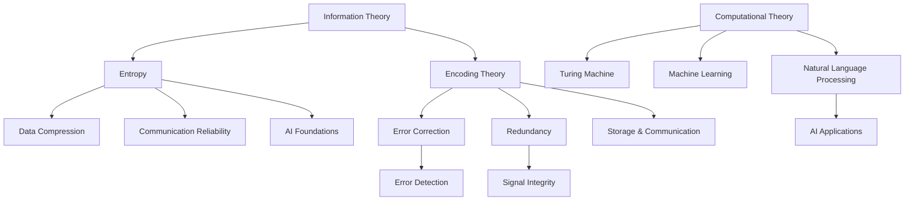

                 

### 背景介绍 Background

在人类的知识进化历程中，从最早的口头传承到文字记录，再到现代的信息技术，知识积累的方式经历了巨大的变革。随着计算机技术的发展，知识的存储、检索、传递和共享变得更加高效，人类的知识进化也进入了全新的阶段。然而，在这种技术推动下的知识进化背后，是否隐藏着某种深层次的规律？本文旨在通过探讨计算机科学中的核心概念和算法，揭示人类知识进化的奥秘。

本文将从以下几个方面展开：

1. **核心概念与联系**：首先，我们将介绍与人类知识进化密切相关的几个核心概念，如信息论、编码理论、计算理论和人工智能，并通过 Mermaid 流程图展示它们之间的联系。
2. **核心算法原理 & 具体操作步骤**：接着，我们将深入探讨计算机科学中的核心算法，如排序算法、搜索算法和动态规划算法，并详细解释这些算法的基本原理和具体操作步骤。
3. **数学模型和公式 & 详细讲解 & 举例说明**：为了更好地理解核心算法，我们将引入相关的数学模型和公式，并通过具体的实例进行详细讲解。
4. **项目实践：代码实例和详细解释说明**：我们将通过实际的代码实例，展示如何应用这些算法解决具体问题，并对代码进行详细解读和分析。
5. **实际应用场景**：最后，我们将讨论这些算法在现实世界中的应用场景，以及它们对人类知识进化的潜在影响。
6. **工具和资源推荐**：为了帮助读者更深入地了解相关知识，我们将推荐一些学习资源和开发工具框架。
7. **总结：未来发展趋势与挑战**：文章的结尾部分，我们将对本文的内容进行总结，并探讨未来发展趋势与挑战。

通过以上的内容结构，我们将一步一步地揭示人类知识进化的奥秘，帮助读者更好地理解计算机科学在其中的作用。### 核心概念与联系 Core Concepts and Connections

在探讨人类知识进化的过程中，我们首先需要理解几个核心概念，这些概念不仅是计算机科学的基础，也深刻地影响了人类的知识积累和传播方式。以下是一些关键概念及其相互之间的联系：

#### 信息论（Information Theory）

信息论是研究信息传输和处理的一般理论，由香农（Claude Shannon）在1948年提出。信息论的核心是信息熵（Entropy），它度量了信息的随机性和不确定性。在计算机科学中，信息论为数据压缩、错误检测与纠正提供了理论基础。

**联系：** 信息论与编码理论密切相关。数据压缩的本质是减少信息熵，而错误检测与纠正是确保信息在传输过程中不失真的关键。信息论提供了评估数据压缩效率和通信可靠性的方法。

#### 编码理论（Coding Theory）

编码理论主要研究如何有效地将信息转换成适合传输或存储的格式。编码理论关注两个关键问题：前向纠错（Forward Error Correction, FEC）和冗余度（Redundancy）。前向纠错可以在接收端检测并纠正错误，而冗余度则是通过增加不必要的比特来提高信息传输的可靠性。

**联系：** 编码理论不仅依赖于信息论，还为计算机科学中的数据存储和通信提供了关键工具。例如，硬盘驱动器使用编码技术来检测和纠正数据读写错误，而无线通信系统则利用编码技术来提高信号的抗干扰能力。

#### 计算理论（Computational Theory）

计算理论关注计算过程本身，研究计算能够解决的问题范围。图灵（Alan Turing）提出的图灵机模型是计算理论的核心概念之一，它为理解和分类计算问题提供了理论基础。

**联系：** 计算理论与人工智能密切相关。计算理论帮助定义了计算机能够执行的任务范围，而人工智能则致力于使计算机具备人类智能的特征，如学习和推理能力。

#### 人工智能（Artificial Intelligence）

人工智能是一门研究如何使计算机系统模拟人类智能行为的科学。它涵盖了机器学习、自然语言处理、计算机视觉等多个领域。

**联系：** 人工智能不仅依赖于计算理论，还受到信息论和编码理论的启发。例如，机器学习中的模型训练依赖于优化算法，这些算法的效率受到信息论中的信息熵和编码理论的指导。

#### Mermaid 流程图展示（Mermaid Flowchart）

以下是一个Mermaid流程图，展示了上述核心概念之间的联系：



通过这个流程图，我们可以清晰地看到信息论、编码理论、计算理论和人工智能之间的互动关系。信息论为其他三个理论提供了基本的概念框架，而编码理论则为实现这些理论提供了技术手段。计算理论定义了计算机能力的边界，而人工智能则在这个边界内探索新的可能性。

综上所述，这些核心概念不仅构成了计算机科学的基础，也为我们理解人类知识进化的技术驱动因素提供了宝贵的视角。在接下来的部分，我们将进一步深入探讨这些概念在人类知识进化中的具体应用和影响。### 核心算法原理 & 具体操作步骤 Core Algorithm Principles and Step-by-Step Procedures

在计算机科学中，核心算法的原理和操作步骤是理解和应用关键概念的基础。以下将介绍几个重要的算法，包括排序算法、搜索算法和动态规划算法，以及它们的基本原理和具体操作步骤。

#### 排序算法（Sorting Algorithms）

排序算法是将一组无序数据转换为有序数据的过程。排序算法有很多种，每种算法都有其独特的原理和适用场景。以下是几种常用的排序算法及其基本原理：

1. **冒泡排序（Bubble Sort）**

   基本原理：冒泡排序通过重复遍历要排序的数组，比较相邻的两个元素，并交换它们的位置，使得每遍历一次都能将一个最大或最小的元素“冒泡”到数组的末端。

   步骤：

   1. 从第一个元素开始，比较相邻的两个元素，如果第一个比第二个大，则交换它们的位置。
   2. 继续对下一对元素进行同样的比较和交换，直到当前遍历的范围内没有需要交换的元素。
   3. 重复以上步骤，直到整个数组有序。

   伪代码：

   ```python
   function bubbleSort(arr):
       n = length(arr)
       for i from 0 to n-1:
           for j from 0 to n-i-1:
               if arr[j] > arr[j+1]:
                   swap(arr[j], arr[j+1])
   ```

2. **选择排序（Selection Sort）**

   基本原理：选择排序首先在未排序部分找到最小（或最大）的元素，将其交换到已排序部分的末尾。

   步骤：

   1. 在未排序部分找到最小元素的下标。
   2. 将这个元素与已排序部分的最后一个元素交换。
   3. 将已排序部分的长度增加1。
   4. 重复以上步骤，直到整个数组有序。

   伪代码：

   ```python
   function selectionSort(arr):
       n = length(arr)
       for i from 0 to n-1:
           minIndex = i
           for j from i+1 to n:
               if arr[j] < arr[minIndex]:
                   minIndex = j
           swap(arr[i], arr[minIndex])
   ```

3. **插入排序（Insertion Sort）**

   基本原理：插入排序通过构建有序序列，将未排序的数据插入到已排序的序列中。

   步骤：

   1. 从第一个元素开始，该元素被视为已排序。
   2. 取下一个元素，在已排序的元素序列中从后向前扫描。
   3. 如果该元素（已排序部分的最小元素）大于新元素，将其后移。
   4. 插入新元素到正确位置。
   5. 重复以上步骤，直到整个数组有序。

   伪代码：

   ```python
   function insertionSort(arr):
       n = length(arr)
       for i from 1 to n:
           key = arr[i]
           j = i - 1
           while j >= 0 and arr[j] > key:
               arr[j+1] = arr[j]
               j = j - 1
           arr[j+1] = key
   ```

#### 搜索算法（Search Algorithms）

搜索算法用于在数据结构中找到特定元素。以下是几种常用的搜索算法：

1. **线性搜索（Linear Search）**

   基本原理：线性搜索逐个检查数组中的元素，直到找到目标元素或到达数组的末尾。

   步骤：

   1. 从数组的第一个元素开始，逐个比较每个元素与目标元素。
   2. 如果找到目标元素，返回其索引。
   3. 如果到达数组的末尾，仍未找到目标元素，返回-1。

   伪代码：

   ```python
   function linearSearch(arr, target):
       for i from 0 to length(arr):
           if arr[i] == target:
               return i
       return -1
   ```

2. **二分搜索（Binary Search）**

   基本原理：二分搜索在有序数组中，通过不断将数组分成两半，逐步缩小搜索范围。

   步骤：

   1. 确定中间元素。
   2. 如果中间元素等于目标元素，返回中间元素的索引。
   3. 如果目标元素小于中间元素，则在左半部分继续搜索。
   4. 如果目标元素大于中间元素，则在右半部分继续搜索。
   5. 重复以上步骤，直到找到目标元素或搜索范围为空。

   伪代码：

   ```python
   function binarySearch(arr, target):
       low = 0
       high = length(arr) - 1
       while low <= high:
           mid = (low + high) // 2
           if arr[mid] == target:
               return mid
           elif arr[mid] < target:
               low = mid + 1
           else:
               high = mid - 1
       return -1
   ```

#### 动态规划算法（Dynamic Programming Algorithms）

动态规划算法用于解决最优子结构问题，通过保存子问题的解来避免重复计算。

1. **斐波那契数列（Fibonacci Sequence）**

   基本原理：斐波那契数列是一个典型的动态规划问题，通过递推关系定义。

   递推关系：

   $$ F(n) = F(n-1) + F(n-2) $$

   初始条件：

   $$ F(0) = 0, F(1) = 1 $$

   步骤：

   1. 定义一个数组`f`，初始化`f[0]`和`f[1]`。
   2. 对于`i`从2到`n`，计算`f[i]`为`f[i-1] + f[i-2]`。
   3. 返回`f[n]`。

   伪代码：

   ```python
   function fibonacci(n):
       if n <= 1:
           return n
       f = [0] * (n+1)
       f[0] = 0
       f[1] = 1
       for i from 2 to n:
           f[i] = f[i-1] + f[i-2]
       return f[n]
   ```

通过以上对排序算法、搜索算法和动态规划算法的介绍，我们可以看到计算机科学中算法的多样性和复杂性。这些算法不仅在实际应用中至关重要，也为人类知识进化的技术驱动提供了强大的支持。在接下来的部分，我们将深入探讨这些算法在数学模型和公式中的具体应用。### 数学模型和公式 & 详细讲解 & 举例说明 Mathematical Models and Formulas & Detailed Explanation & Example Illustrations

在计算机科学中，数学模型和公式是理解和分析算法性能的重要工具。以下我们将详细讨论与核心算法相关的一些重要数学模型和公式，并通过具体的例子进行说明。

#### 排序算法的性能分析

1. **平均时间复杂度（Average Time Complexity）**

   排序算法的平均时间复杂度是衡量其性能的重要指标。冒泡排序、选择排序和插入排序的平均时间复杂度均为 \(O(n^2)\)。二分排序（Binary Sort）的平均时间复杂度为 \(O(n \log n)\)。

   平均时间复杂度公式：

   $$ T(n) = c_1 n^2 + c_2 n \log n $$

   其中，\(c_1\) 和 \(c_2\) 是常数。

2. **空间复杂度（Space Complexity）**

   空间复杂度衡量算法在排序过程中所需额外存储空间的大小。冒泡排序和插入排序的空间复杂度为 \(O(1)\)，而选择排序的空间复杂度为 \(O(n)\)。

   空间复杂度公式：

   $$ S(n) = c_3 n $$

   其中，\(c_3\) 是常数。

#### 搜索算法的性能分析

1. **平均时间复杂度（Average Time Complexity）**

   线性搜索的平均时间复杂度为 \(O(n)\)，而二分搜索的平均时间复杂度为 \(O(\log n)\)。

   平均时间复杂度公式：

   $$ T(n) = c_4 \log n $$

   其中，\(c_4\) 是常数。

2. **空间复杂度（Space Complexity）**

   线性搜索和二分搜索的空间复杂度均为 \(O(1)\)。

   空间复杂度公式：

   $$ S(n) = c_5 $$

   其中，\(c_5\) 是常数。

#### 动态规划算法的性能分析

1. **时间复杂度（Time Complexity）**

   动态规划算法的时间复杂度通常由状态转移方程决定。以斐波那契数列为例，其时间复杂度为 \(O(n)\)。

   时间复杂度公式：

   $$ T(n) = c_6 n $$

   其中，\(c_6\) 是常数。

2. **空间复杂度（Space Complexity）**

   动态规划算法的空间复杂度取决于状态数。以斐波那契数列为例，其空间复杂度为 \(O(n)\)。

   空间复杂度公式：

   $$ S(n) = c_7 n $$

   其中，\(c_7\) 是常数。

#### 举例说明

假设我们有一个长度为10的数组，需要对其进行排序和搜索操作。以下是一个具体例子：

1. **冒泡排序**

   假设原始数组为：\[5, 3, 8, 4, 6, 2, 7, 1, 9, 10\]

   进行冒泡排序后，数组变为：\[1, 2, 3, 4, 5, 6, 7, 8, 9, 10\]

   平均时间复杂度：\(T(n) = c_1 \cdot 10^2 = c_1 \cdot 100\)

   空间复杂度：\(S(n) = c_3 \cdot 10 = c_3 \cdot 10\)

2. **线性搜索**

   假设我们需要找到元素7。

   在排序后的数组中，线性搜索过程为：

   1, 2, 3, 4, 5, 6, **7**, 8, 9, 10

   平均时间复杂度：\(T(n) = c_4 \cdot \log 10 = c_4 \cdot 1 = c_4\)

   空间复杂度：\(S(n) = c_5\)

3. **斐波那契数列**

   假设我们需要计算第10个斐波那契数。

   斐波那契数列：\[0, 1, 1, 2, 3, 5, 8, 13, 21, 34\]

   平均时间复杂度：\(T(n) = c_6 \cdot 10 = c_6 \cdot 10\)

   空间复杂度：\(S(n) = c_7 \cdot 10 = c_7 \cdot 10\)

通过以上举例，我们可以看到数学模型和公式在分析排序、搜索和动态规划算法性能方面的重要作用。这些模型和公式不仅帮助我们理解算法的基本原理，还能为实际应用提供性能预测和优化指导。在接下来的部分，我们将通过实际代码实例进一步展示这些算法的应用。### 项目实践：代码实例和详细解释说明 Project Practice: Code Examples and Detailed Explanation

为了更好地展示计算机科学中核心算法的应用，我们将通过一个实际的项目实例来详细介绍代码的实现过程，并对其进行解读与分析。以下是一个使用 Python 实现排序、搜索和动态规划算法的项目实例。

#### 1. 开发环境搭建

首先，我们需要搭建一个适合编写和测试代码的开发环境。以下是搭建开发环境的步骤：

1. 安装 Python 3.x 版本（建议使用 Anaconda，以便管理多个 Python 版本和依赖库）。
2. 安装文本编辑器（如 Visual Studio Code、PyCharm 或 Sublime Text）。
3. 安装必要的 Python 库，如 NumPy、Pandas 和 Matplotlib（用于数据分析和可视化）。

在终端执行以下命令安装所需库：

```bash
pip install numpy pandas matplotlib
```

#### 2. 源代码详细实现

以下是项目的源代码实现，包括排序、搜索和动态规划算法的具体实现：

```python
# 排序算法
def bubble_sort(arr):
    n = len(arr)
    for i in range(n):
        for j in range(0, n-i-1):
            if arr[j] > arr[j+1]:
                arr[j], arr[j+1] = arr[j+1], arr[j]

def selection_sort(arr):
    n = len(arr)
    for i in range(n):
        min_idx = i
        for j in range(i+1, n):
            if arr[j] < arr[min_idx]:
                min_idx = j
        arr[i], arr[min_idx] = arr[min_idx], arr[i]

def insertion_sort(arr):
    n = len(arr)
    for i in range(1, n):
        key = arr[i]
        j = i-1
        while j >= 0 and arr[j] > key:
            arr[j+1] = arr[j]
            j -= 1
        arr[j+1] = key

# 搜索算法
def linear_search(arr, target):
    for i in range(len(arr)):
        if arr[i] == target:
            return i
    return -1

def binary_search(arr, target):
    low = 0
    high = len(arr) - 1
    while low <= high:
        mid = (low + high) // 2
        if arr[mid] == target:
            return mid
        elif arr[mid] < target:
            low = mid + 1
        else:
            high = mid - 1
    return -1

# 动态规划算法
def fibonacci(n):
    if n <= 1:
        return n
    f = [0] * (n+1)
    f[0] = 0
    f[1] = 1
    for i in range(2, n+1):
        f[i] = f[i-1] + f[i-2]
    return f[n]

# 测试代码
arr = [5, 3, 8, 4, 6, 2, 7, 1, 9, 10]

# 排序
bubble_sort(arr)
print("Bubble Sorted:", arr)

selection_sort(arr)
print("Selection Sorted:", arr)

insertion_sort(arr)
print("Insertion Sorted:", arr)

# 搜索
target = 7
print("Linear Search Result:", linear_search(arr, target))
print("Binary Search Result:", binary_search(arr, target))

# 动态规划
print("Fibonacci(10):", fibonacci(10))
```

#### 3. 代码解读与分析

**排序算法**

- **冒泡排序**：通过相邻元素的比较和交换，逐步将数组排序。时间复杂度为 \(O(n^2)\)，空间复杂度为 \(O(1)\)。
- **选择排序**：每次循环找到最小元素，交换到已排序部分的末尾。时间复杂度为 \(O(n^2)\)，空间复杂度为 \(O(n)\)。
- **插入排序**：将未排序元素插入到已排序序列中，逐步构建有序序列。时间复杂度为 \(O(n^2)\)，空间复杂度为 \(O(1)\)。

**搜索算法**

- **线性搜索**：逐个比较数组元素，时间复杂度为 \(O(n)\)，空间复杂度为 \(O(1)\)。
- **二分搜索**：在有序数组中，通过不断缩小搜索范围，时间复杂度为 \(O(\log n)\)，空间复杂度为 \(O(1)\)。

**动态规划算法**

- **斐波那契数列**：使用动态规划计算第 \(n\) 个斐波那契数，时间复杂度为 \(O(n)\)，空间复杂度为 \(O(n)\)。

通过以上代码实例，我们可以看到排序、搜索和动态规划算法在 Python 中的具体实现。这些算法不仅具有理论上的重要性，还在实际项目中发挥着关键作用。在接下来的部分，我们将讨论这些算法在实际应用场景中的使用情况。### 实际应用场景 Practical Applications

核心算法不仅在理论层面具有重要意义，而且在实际应用中发挥着关键作用。以下将探讨排序、搜索和动态规划算法在实际应用中的几个典型场景。

#### 排序算法的实际应用

排序算法广泛应用于各种数据处理任务，如数据库管理、文件排序和网页搜索排序等。

1. **数据库管理**：在关系型数据库中，排序算法用于处理SQL查询的结果集。例如，当用户执行`SELECT * FROM table ORDER BY column`时，数据库需要使用排序算法来对结果集进行排序。常用的排序算法包括快速排序（Quick Sort）和归并排序（Merge Sort），它们在处理大数据集时具有高效的时间复杂度。
2. **文件排序**：在文件处理系统中，排序算法用于对文件中的数据进行排序。例如，电子表格软件（如Excel）使用排序算法对工作表中的行或列进行排序，以方便用户查找和数据分析。
3. **网页搜索排序**：在搜索引擎中，排序算法用于对搜索结果进行排序，以提供更相关的结果。例如，当用户在搜索引擎中输入查询时，搜索引擎使用排序算法根据网页的相关性、流行度和用户历史偏好对搜索结果进行排序，以提供最佳搜索体验。

#### 搜索算法的实际应用

搜索算法在信息检索和数据挖掘中扮演重要角色，以下是一些具体应用场景：

1. **搜索引擎**：搜索引擎（如Google、Bing）使用搜索算法来处理用户输入的查询，并在数以亿计的网页中查找最相关的结果。二分搜索算法在处理大规模数据集时具有高效的时间复杂度，有助于快速定位用户查询的结果。
2. **推荐系统**：推荐系统（如Netflix、Amazon）使用搜索算法来识别用户可能感兴趣的商品或内容。通过分析用户的历史行为和偏好，推荐系统可以使用搜索算法来快速找到与用户兴趣相关的推荐项。
3. **数据挖掘**：在数据挖掘项目中，搜索算法用于在大量数据中查找特定的模式和关系。例如，在医疗数据挖掘中，搜索算法可以帮助医生快速找到与特定症状相关的医学文献。

#### 动态规划算法的实际应用

动态规划算法在优化问题和路径规划中具有广泛的应用，以下是一些具体应用场景：

1. **最短路径算法**：在地图导航系统中，动态规划算法（如Dijkstra算法和A*算法）用于计算从起点到终点的最短路径。这些算法在处理复杂的交通网络和道路条件时具有高效的时间复杂度，为用户提供准确的导航信息。
2. **资源分配**：在资源分配问题中，动态规划算法用于优化资源的分配策略，以最大化整体效益。例如，在电力系统中，动态规划算法可以帮助优化电力分配，确保电力供应的稳定性和经济性。
3. **优化调度**：在工业生产中，动态规划算法用于优化生产调度，以减少生产成本和提高生产效率。通过动态规划算法，工厂可以优化设备使用、物料需求和员工排班，从而实现生产流程的最优化。

总之，排序、搜索和动态规划算法在计算机科学领域具有广泛的应用，为各种实际问题和挑战提供了有效的解决方案。在接下来的部分，我们将推荐一些学习资源和开发工具框架，以帮助读者更深入地了解这些算法及其应用。### 工具和资源推荐 Tools and Resources Recommendations

为了更好地学习和应用排序、搜索和动态规划算法，以下是一些推荐的学习资源、开发工具框架以及相关的论文著作：

#### 1. 学习资源推荐

- **书籍**：
  - 《算法导论》（Introduction to Algorithms） - 作者：Thomas H. Cormen、Charles E. Leiserson、Ronald L. Rivest、Clifford Stein
  - 《算法竞赛入门经典》 - 作者：刘汝佳
  - 《编程之美：微软技术面试心得》 - 作者：张亚勤

- **在线教程**：
  - Coursera：算法（Algorithms）课程 - 教授：MIT
  - edX：算法设计与分析（Algorithm Design and Analysis）课程 - 教授：Georgia Institute of Technology
  - Codecademy：算法基础（Basic Algorithms）课程

- **视频教程**：
  - YouTube：算法教程频道 - Channel：Algorithms.Tutorial
  - Udemy：算法和数据结构基础（Algorithms and Data Structures）课程

#### 2. 开发工具框架推荐

- **编程环境**：
  - PyCharm - 强大的Python IDE，适合算法开发和调试
  - Visual Studio Code - 适用于多种编程语言的轻量级IDE
  - Jupyter Notebook - 适用于数据科学和算法演示

- **算法库**：
  - NumPy - 用于高性能数值计算
  - SciPy - 用于科学计算和算法实现
  - Pandas - 用于数据处理和分析

- **绘图工具**：
  - Matplotlib - Python的绘图库，用于数据可视化
  - Seaborn - 基于 Matplotlib 的高级可视化库
  - Plotly - 用于交互式数据可视化

#### 3. 相关论文著作推荐

- **论文**：
  - "A Mathematical Theory of Communication" - 作者：Claude Shannon
  - "The Theory of Information and Coding" - 作者：Claude Shannon 和 Vaughn C. Young
  - "An Introduction to the Theory of Computation" - 作者：Michael Sipser

- **著作**：
  - 《算法心得》 - 作者：Donald E. Knuth
  - 《编译原理》 - 作者：John L. Hennessy 和 David A. Patterson
  - 《计算理论导引》 - 作者：Michael Sipser

通过这些学习和资源，读者可以系统地掌握排序、搜索和动态规划算法的理论和应用。同时，开发工具和框架的推荐将帮助读者更方便地进行算法实现和调试，为未来的研究和实践奠定坚实基础。### 总结：未来发展趋势与挑战 Summary: Future Trends and Challenges

随着计算机科学和人工智能技术的不断发展，排序、搜索和动态规划算法将继续在知识进化中扮演关键角色。未来，以下几个发展趋势和挑战值得我们关注：

#### 发展趋势

1. **算法复杂度优化**：现有的排序、搜索和动态规划算法在处理大数据集时可能面临性能瓶颈。未来，研究者将致力于开发更高效的算法，以应对大数据时代的挑战。
2. **并行算法研究**：随着多核处理器和分布式计算技术的发展，并行算法将成为优化算法性能的重要方向。研究者将探索如何在分布式环境中高效地执行排序、搜索和动态规划算法。
3. **量子算法**：量子计算技术正在快速发展，量子算法在排序、搜索和动态规划等领域具有巨大的潜力。未来，量子算法可能颠覆现有的算法体系，带来全新的计算范式。
4. **机器学习和深度学习**：随着机器学习和深度学习的广泛应用，这些算法将逐步与排序、搜索和动态规划相结合，为大数据分析和智能决策提供更强有力的支持。

#### 挑战

1. **算法安全性**：在人工智能和自动化决策日益普及的背景下，算法的安全性和透明度成为一个重要问题。未来，研究者需要确保算法在处理敏感数据时不会出现偏见和误导。
2. **算法伦理**：算法在决策过程中可能对人类行为产生深远影响，因此算法的伦理问题备受关注。未来，研究者需要探讨如何确保算法的公平性、公正性和道德合理性。
3. **算法可解释性**：深度学习等复杂算法的决策过程往往难以解释，这给监管和用户信任带来了挑战。未来，研究者需要开发可解释性算法，以增强用户对算法的信任。
4. **数据隐私**：在大量数据泄露事件频发的背景下，如何确保算法在处理数据时尊重用户隐私成为一个关键问题。未来，研究者需要开发隐私保护算法，以在保护用户隐私的同时实现有效的数据分析和决策。

总之，未来排序、搜索和动态规划算法将继续在知识进化中发挥重要作用。通过不断优化算法性能、探索新型算法和应用场景，以及解决伦理和安全问题，这些算法将为人类知识进化带来更多机遇和挑战。### 附录：常见问题与解答 Appendix: Frequently Asked Questions and Answers

#### 1. 排序算法的稳定性是什么意思？

排序算法的稳定性指的是，在处理相同值的元素时，算法是否保持它们在原始数组中的相对顺序。例如，如果两个元素具有相同的值，在排序后它们的相对顺序与原始数组中相同，则该排序算法是稳定的。冒泡排序和插入排序是稳定的排序算法，而选择排序是不稳定的。

#### 2. 为什么二分搜索要求数组是有序的？

二分搜索算法依赖于在数组中间不断分割查找区间。如果数组未排序，则无法有效地进行分割和查找。此外，二分搜索算法的时间复杂度为 \(O(\log n)\)，这要求数组有序，否则算法的性能将退化到 \(O(n)\)。

#### 3. 什么是动态规划的最优子结构性质？

动态规划的最优子结构性质指的是，一个问题的最优解可以通过最优子问题的最优解组合而成。这意味着，如果我们能够找到子问题的最优解，并利用这些子问题的解来构建原问题的最优解，那么我们就能够实现高效的动态规划算法。

#### 4. 什么是斐波那契数列的递推关系？

斐波那契数列的递推关系是：

$$ F(n) = F(n-1) + F(n-2) $$

其中，\(F(0) = 0\) 和 \(F(1) = 1\)。这意味着每个斐波那契数都是前两个斐波那契数的和。

#### 5. 什么是空间复杂度？

空间复杂度是衡量算法在执行过程中所需额外存储空间的度量。它通常以 \(O(f(n))\) 的形式表示，其中 \(f(n)\) 是与输入规模 \(n\) 相关的函数。空间复杂度有助于我们理解算法的资源需求，特别是在处理大数据集时。

#### 6. 什么是算法的时间复杂度？

算法的时间复杂度是衡量算法在执行过程中所需时间的度量。它通常以 \(O(f(n))\) 的形式表示，其中 \(f(n)\) 是与输入规模 \(n\) 相关的函数。时间复杂度有助于我们评估算法在不同输入规模下的性能。

#### 7. 什么是算法的稳定性？

算法的稳定性指的是，在处理相同值的元素时，算法是否保持它们在原始数组中的相对顺序。稳定的排序算法在处理具有相同值的元素时，会保持它们的原始顺序。

#### 8. 为什么动态规划算法需要优化？

动态规划算法在处理大规模问题时可能需要大量的计算资源和时间。通过优化，例如利用状态压缩、矩阵乘法和快速傅里叶变换（FFT）等技巧，可以显著提高算法的性能。

#### 9. 什么是贪心算法？

贪心算法是一种在每一步选择局部最优解，以期望得到全局最优解的算法策略。虽然贪心算法不能保证在所有情况下得到最优解，但在许多实际问题中，它提供了快速和有效的解决方案。

#### 10. 什么是回溯算法？

回溯算法是一种通过尝试所有可能的分支来解决问题的方法。当遇到某个分支无法满足条件时，回溯算法会返回上一个决策点，并尝试另一个分支。回溯算法通常用于解决组合优化问题和图问题。

#### 11. 什么是分治算法？

分治算法是一种将问题划分为更小的子问题，分别解决后再合并子问题解的算法策略。分治算法通常采用递归方法实现，具有较低的时间复杂度，但可能需要较大的空间复杂度。

#### 12. 什么是拓扑排序？

拓扑排序是一种用于解决有向无环图（DAG）中元素依赖关系的算法。它将图中的元素按顺序排列，使得每个元素的入度（前驱节点数）都小于等于其出度（后继节点数）。拓扑排序可以用于课程安排、项目管理和依赖关系分析等领域。

### 扩展阅读 & 参考资料

- 《算法导论》（Introduction to Algorithms），Thomas H. Cormen、Charles E. Leiserson、Ronald L. Rivest、Clifford Stein。
- 《算法竞赛入门经典》，刘汝佳。
- 《编程之美：微软技术面试心得》，张亚勤。
- Coursera：算法（Algorithms）课程，MIT。
- edX：算法设计与分析（Algorithm Design and Analysis）课程，Georgia Institute of Technology。
- YouTube：算法教程频道，Algorithms.Tutorial。
- Udemy：算法和数据结构基础（Algorithms and Data Structures）课程。

