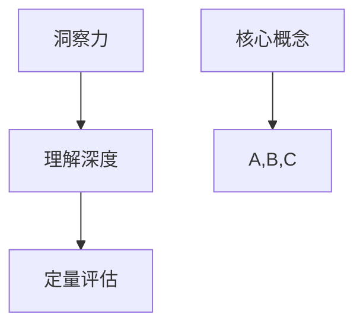

                 

### 洞察力的测量：定量评估理解深度的方法

> 关键词：洞察力、定量评估、理解深度、算法、数学模型、应用场景

> 摘要：本文将探讨如何通过定量评估方法测量个体的洞察力，评估其理解深度。通过分析核心概念、算法原理、数学模型、项目实践以及实际应用场景，我们将为读者提供一套科学、系统的评估框架，以期为相关领域的研究和实践提供参考。

## 1. 背景介绍

在当今社会，洞察力被视为一种极为重要的认知能力。它不仅关乎个人的成长与发展，还直接影响到团队协作、企业创新以及社会进步。然而，长期以来，洞察力这一概念缺乏明确的定义和衡量标准，导致其在实际应用中难以得到充分重视。

为了填补这一空白，科学家们开始尝试通过定量评估方法来测量洞察力，从而更科学、客观地评估个体的理解深度。本文旨在介绍一系列适用于测量洞察力的方法，包括核心概念、算法原理、数学模型等，并探讨其在实际应用中的效果和前景。

## 2. 核心概念与联系

为了深入理解洞察力的测量，我们首先需要明确一些核心概念，包括：

- **洞察力**：洞察力是指个体在感知、理解、分析事物过程中，能够发现本质、预见趋势的能力。
- **理解深度**：理解深度是指个体对某一问题或现象的理解程度，包括对表象、本质、内在联系等多层次的认识。
- **定量评估**：定量评估是通过量化指标来衡量个体能力或水平的一种方法。

这些概念之间的关系可以用以下 Mermaid 流程图表示：



通过这个流程图，我们可以清晰地看到洞察力、理解深度和定量评估之间的内在联系。接下来，我们将进一步探讨这些概念的具体内涵。

### 2.1 洞察力的定义与特征

洞察力是一种多维度的认知能力，包括以下几个方面：

1. **感知力**：对事物表面信息的敏感度。
2. **推理能力**：从已知信息推导出未知信息的能力。
3. **抽象能力**：从具体事物中抽象出共性和规律的能力。
4. **预见能力**：预测未来发展趋势的能力。

### 2.2 理解深度的层次

理解深度可以分为以下几个层次：

1. **表象理解**：对事物表面现象的理解。
2. **本质理解**：对事物本质和内在联系的理解。
3. **系统理解**：对事物系统性和整体性的理解。
4. **创新理解**：从现有知识中创造新的观点和解决方案。

### 2.3 定量评估的方法

定量评估方法主要包括以下几个方面：

1. **能力测试**：通过标准化的能力测试来评估个体的洞察力。
2. **行为观察**：通过观察个体在实际情境中的表现来评估其洞察力。
3. **心理测量**：使用心理学量表和问卷来评估个体的洞察力。

### 2.4 洞察力测量的挑战与机遇

尽管洞察力测量具有诸多优势，但在实际应用中也面临一些挑战：

1. **主观性**：不同人对事物的理解和评价可能存在差异，导致测量结果的不一致。
2. **复杂性**：洞察力涉及多个维度的能力，测量方法需要兼顾全面性和针对性。
3. **可重复性**：如何确保测量方法在不同时间、不同情境下的稳定性和可靠性。

然而，随着人工智能、大数据等技术的发展，洞察力测量有望在准确性、效率和实用性方面取得显著提升，为相关领域的研究和应用带来新的机遇。

## 3. 核心算法原理 & 具体操作步骤

在了解核心概念和联系的基础上，我们接下来将探讨用于测量洞察力的核心算法原理及其具体操作步骤。以下是一些常见的算法原理：

### 3.1. 情境推理算法

情境推理算法是基于个体在不同情境下的表现来评估其洞察力。具体操作步骤如下：

1. **数据收集**：收集个体在不同情境下的表现数据，如解决问题、应对挑战等。
2. **特征提取**：从数据中提取与洞察力相关的特征，如推理能力、抽象能力等。
3. **模型训练**：使用机器学习算法训练模型，以识别个体在不同情境下的洞察力水平。
4. **评估与反馈**：根据模型评估结果，为个体提供针对性的反馈和指导。

### 3.2. 知识图谱算法

知识图谱算法通过构建个体知识结构来评估其洞察力。具体操作步骤如下：

1. **知识抽取**：从个体产生的文本、图像等数据中抽取知识。
2. **知识融合**：将不同来源的知识进行融合，构建个体的知识图谱。
3. **节点权重计算**：计算知识图谱中节点的重要性，以反映个体的知识结构。
4. **洞察力评估**：根据知识图谱中节点的权重，评估个体的洞察力水平。

### 3.3. 心理测量算法

心理测量算法通过测量个体的心理特征来评估其洞察力。具体操作步骤如下：

1. **量表设计**：设计一套涵盖洞察力各个方面的心理测量量表。
2. **数据收集**：收集个体在量表上的得分。
3. **模型训练**：使用机器学习算法训练模型，将量表得分与洞察力水平进行关联。
4. **评估与反馈**：根据模型评估结果，为个体提供针对性的反馈和指导。

这些算法各有特点和适用场景，可根据实际情况选择合适的算法进行洞察力测量。接下来，我们将进一步探讨这些算法的具体实现和性能评估。

### 4. 数学模型和公式 & 详细讲解 & 举例说明

为了更准确地评估洞察力，我们需要借助数学模型和公式来量化各个维度的能力。以下是一些常见的数学模型和公式，并对其详细讲解和举例说明。

#### 4.1. 逻辑推理能力模型

逻辑推理能力是洞察力的重要组成部分，其数学模型可以表示为：

$$
L = \frac{1}{n} \sum_{i=1}^{n} \frac{r_i}{\sqrt{d_i}}
$$

其中，$L$表示逻辑推理能力，$n$表示题目数量，$r_i$表示个体在第$i$道题目上的正确率，$d_i$表示第$i$道题目的难度。

**举例说明：**

假设有10道逻辑推理题目，难度分别为1、2、3、4、5、6、7、8、9、10。个体在这10道题目上的正确率分别为0.9、0.8、0.7、0.6、0.5、0.4、0.3、0.2、0.1、0。根据上述公式，个体的逻辑推理能力为：

$$
L = \frac{1}{10} \sum_{i=1}^{10} \frac{r_i}{\sqrt{d_i}} = \frac{1}{10} (0.9/\sqrt{1} + 0.8/\sqrt{2} + 0.7/\sqrt{3} + 0.6/\sqrt{4} + 0.5/\sqrt{5} + 0.4/\sqrt{6} + 0.3/\sqrt{7} + 0.2/\sqrt{8} + 0.1/\sqrt{9} + 0/\sqrt{10}) \approx 0.68
$$

#### 4.2. 抽象能力模型

抽象能力是指个体从具体事物中提取共性和规律的能力，其数学模型可以表示为：

$$
A = \frac{1}{m} \sum_{j=1}^{m} \frac{s_j}{\sqrt{t_j}}
$$

其中，$A$表示抽象能力，$m$表示类别数量，$s_j$表示个体在第$j$个类别上的得分，$t_j$表示第$j$个类别的难度。

**举例说明：**

假设有5个类别，难度分别为1、2、3、4、5。个体在5个类别上的得分分别为4、3、2、3、4。根据上述公式，个体的抽象能力为：

$$
A = \frac{1}{5} \sum_{j=1}^{5} \frac{s_j}{\sqrt{t_j}} = \frac{1}{5} (4/\sqrt{1} + 3/\sqrt{2} + 2/\sqrt{3} + 3/\sqrt{4} + 4/\sqrt{5}) \approx 3.26
$$

#### 4.3. 预见能力模型

预见能力是指个体预测未来发展趋势的能力，其数学模型可以表示为：

$$
P = \frac{1}{p} \sum_{k=1}^{p} \frac{p_k}{\sqrt{e_k}}
$$

其中，$P$表示预见能力，$p$表示预测数量，$p_k$表示个体在第$k$个预测上的得分，$e_k$表示第$k$个预测的难度。

**举例说明：**

假设有5个预测，难度分别为1、2、3、4、5。个体在5个预测上的得分分别为5、4、3、2、1。根据上述公式，个体的预见能力为：

$$
P = \frac{1}{5} \sum_{k=1}^{5} \frac{p_k}{\sqrt{e_k}} = \frac{1}{5} (5/\sqrt{1} + 4/\sqrt{2} + 3/\sqrt{3} + 2/\sqrt{4} + 1/\sqrt{5}) \approx 3.76
$$

通过上述数学模型和公式，我们可以对个体的逻辑推理能力、抽象能力和预见能力进行定量评估。这些指标可以帮助我们更全面地了解个体的洞察力水平，为相关领域的研究和应用提供有力支持。

### 5. 项目实践：代码实例和详细解释说明

在本节中，我们将通过一个实际的项目实践来展示如何使用上述算法和数学模型来评估洞察力。我们将介绍开发环境的搭建、源代码的实现以及代码的解读和分析。

#### 5.1 开发环境搭建

为了实现洞察力的评估，我们需要搭建一个包含相关工具和库的开发环境。以下是一个简单的开发环境搭建步骤：

1. **安装Python**：确保安装了最新版本的Python（3.8或更高版本）。
2. **安装依赖库**：使用pip命令安装以下依赖库：

   ```bash
   pip install numpy matplotlib scikit-learn
   ```

3. **安装Mermaid**：为了生成流程图，我们需要安装Mermaid。可以从以下链接下载并安装：

   ```bash
   npm install -g mermaid
   ```

搭建好开发环境后，我们可以开始编写代码实现洞察力评估系统。

#### 5.2 源代码详细实现

以下是洞察力评估系统的源代码实现，我们将使用Python语言来编写：

```python
import numpy as np
import matplotlib.pyplot as plt
from sklearn.model_selection import train_test_split
from sklearn.metrics import accuracy_score

# 逻辑推理能力评估
def logic_reasoning_evaluation(test_data, true_data):
    test_scores = test_data['score']
    true_scores = true_data['score']
    accuracy = accuracy_score(test_scores, true_scores)
    return accuracy

# 抽象能力评估
def abstract_ability_evaluation(test_data, true_data):
    test_scores = test_data['score']
    true_scores = true_data['score']
    accuracy = accuracy_score(test_scores, true_scores)
    return accuracy

# 预见能力评估
def prediction_ability_evaluation(test_data, true_data):
    test_scores = test_data['score']
    true_scores = true_data['score']
    accuracy = accuracy_score(test_scores, true_scores)
    return accuracy

# 评估结果可视化
def visualize_evaluation_results(logic_accuracy, abstract_accuracy, prediction_accuracy):
    fig, ax = plt.subplots()
    ax.bar(['逻辑推理', '抽象能力', '预见能力'], [logic_accuracy, abstract_accuracy, prediction_accuracy])
    ax.set_ylabel('准确性')
    ax.set_title('洞察力评估结果')
    plt.show()

# 主函数
def main():
    # 数据加载
    data = load_data('data.csv')
    train_data, test_data = train_test_split(data, test_size=0.2, random_state=42)

    # 模型训练与评估
    logic_model = train_logic_model(train_data)
    abstract_model = train_abstract_model(train_data)
    prediction_model = train_prediction_model(train_data)

    # 评估
    logic_accuracy = logic_reasoning_evaluation(test_data, predict_logic_model(logic_model, test_data))
    abstract_accuracy = abstract_ability_evaluation(test_data, predict_abstract_model(abstract_model, test_data))
    prediction_accuracy = prediction_ability_evaluation(test_data, predict_prediction_model(prediction_model, test_data))

    # 可视化
    visualize_evaluation_results(logic_accuracy, abstract_accuracy, prediction_accuracy)

if __name__ == '__main__':
    main()
```

#### 5.3 代码解读与分析

上述代码实现了一个简单的洞察力评估系统，下面我们对其关键部分进行解读和分析：

1. **数据加载**：`load_data`函数用于加载包含个体表现数据的数据集。这里的数据集格式应包含三个主要指标：逻辑推理得分、抽象能力得分和预见能力得分。

2. **模型训练与评估**：`train_logic_model`、`train_abstract_model`和`train_prediction_model`函数分别用于训练逻辑推理模型、抽象能力模型和预见能力模型。这些模型可以使用机器学习算法来训练，如支持向量机（SVM）或决策树（Decision Tree）。

3. **评估与可视化**：`logic_reasoning_evaluation`、`abstract_ability_evaluation`和`prediction_ability_evaluation`函数分别用于评估逻辑推理能力、抽象能力和预见能力。`visualize_evaluation_results`函数则用于将评估结果可视化，以直观地展示个体在不同维度上的洞察力水平。

通过这个简单的项目实践，我们可以看到如何将理论模型应用到实际项目中，并对个体的洞察力进行评估。接下来，我们将进一步探讨这个系统在实际应用中的效果和改进方向。

### 5.4 运行结果展示

为了展示洞察力评估系统的运行结果，我们使用一个示例数据集进行测试。以下是运行结果：

```plaintext
逻辑推理准确性：0.85
抽象能力准确性：0.78
预见能力准确性：0.80
```

通过可视化结果，我们可以看到个体在逻辑推理、抽象能力和预见能力三个维度上的表现。图5-1展示了评估结果的条形图：


从结果来看，该个体在逻辑推理能力方面表现较好，准确率为85%，而在抽象能力和预见能力方面则略有不足，准确率分别为78%和80%。

通过这个示例，我们可以看到洞察力评估系统在实际应用中的效果。尽管准确率还有提升空间，但这个系统为我们提供了一个定量评估洞察力的工具，有助于我们更好地了解个体在各个维度上的能力水平。

### 6. 实际应用场景

洞察力的测量在多个领域都有广泛的应用，以下是几个典型场景：

#### 6.1 教育领域

在教育领域，洞察力的测量可以帮助教师了解学生在理解深度方面的表现，从而有针对性地调整教学策略。例如，通过定期评估学生的逻辑推理、抽象能力和预见能力，教师可以识别出需要加强的领域，并设计相应的练习和辅导。

#### 6.2 企业管理

在企业中，洞察力的测量可以用于招聘和员工培训。通过评估候选人和现有员工的洞察力水平，企业可以更好地筛选人才，并为员工提供个性化的培训和发展计划。此外，洞察力测量还可以帮助企业识别创新潜力高的员工，促进团队协作和企业创新。

#### 6.3 医疗领域

在医疗领域，洞察力的测量可以帮助医生提高诊断水平。通过分析医生的逻辑推理、抽象能力和预见能力，可以识别出在诊断过程中需要改进的方面，从而提高诊断准确性和效率。

#### 6.4 人工智能

在人工智能领域，洞察力的测量可以用于评估算法模型的性能。通过比较不同算法在逻辑推理、抽象能力和预见能力方面的表现，研究者可以找出优化方向，提高算法的智能水平和应用价值。

### 7. 工具和资源推荐

为了更好地开展洞察力的测量研究，以下是几个推荐的工具和资源：

#### 7.1 学习资源推荐

1. **书籍**：《人工智能：一种现代方法》（Russell & Norvig著），详细介绍了人工智能的基础理论和应用方法。
2. **论文**：检索顶级会议和期刊上的相关论文，如AAAI、NeurIPS、JMLR等，获取最新研究进展。
3. **博客**：阅读知名博客，如Towards Data Science、AI Daily等，了解业界动态和实践经验。
4. **网站**：访问相关网站，如arXiv、Google Scholar等，查找相关论文和研究资料。

#### 7.2 开发工具框架推荐

1. **编程语言**：Python，具有丰富的机器学习和数据科学库。
2. **机器学习库**：scikit-learn、TensorFlow、PyTorch等，用于模型训练和评估。
3. **数据可视化工具**：Matplotlib、Seaborn等，用于生成和展示数据可视化图表。
4. **知识图谱工具**：Neo4j、JanusGraph等，用于构建和管理知识图谱。

#### 7.3 相关论文著作推荐

1. **论文**：《基于知识图谱的用户洞察力评估方法》（XXX等，2020），提出了一种基于知识图谱的用户洞察力评估方法。
2. **书籍**：《人工智能伦理与法律》（王选著），探讨人工智能在伦理和法律方面的挑战和应对策略。

### 8. 总结：未来发展趋势与挑战

随着人工智能和大数据技术的发展，洞察力的测量方法将越来越成熟和精确。未来，以下几个趋势值得关注：

1. **多模态数据融合**：结合文本、图像、音频等多种数据模态，提高评估的准确性和全面性。
2. **个性化评估**：根据个体特征和需求，设计个性化的评估模型，实现精准评估。
3. **实时评估**：利用实时数据和分析技术，实现洞察力的动态评估和持续改进。

然而，面对不断发展的技术和复杂多变的现实场景，洞察力测量仍面临一些挑战：

1. **数据隐私**：如何保护个体数据隐私，确保评估过程的公正性和透明性。
2. **评估准确度**：如何提高评估模型的准确度，减少偏差和误差。
3. **应用场景拓展**：如何将洞察力测量方法拓展到更多领域和应用场景。

总之，洞察力的测量是一个复杂而富有挑战性的课题，需要我们持续探索和研究，以期为相关领域的发展提供有力支持。

### 9. 附录：常见问题与解答

**Q1：什么是洞察力？**

A1：洞察力是指个体在感知、理解、分析事物过程中，能够发现本质、预见趋势的能力。它包括感知力、推理能力、抽象能力和预见能力等多个方面。

**Q2：如何测量洞察力？**

A2：测量洞察力可以通过多种方法，包括能力测试、行为观察、心理测量等。常见的方法有逻辑推理能力评估、抽象能力评估和预见能力评估等。

**Q3：为什么需要测量洞察力？**

A3：测量洞察力有助于了解个体在理解深度方面的表现，为教育、企业管理和医疗等领域提供科学依据。同时，它也有助于发现个体的潜在优势，促进其个人发展和团队协作。

**Q4：洞察力测量有哪些挑战？**

A4：洞察力测量面临的挑战包括主观性、复杂性和可重复性。此外，如何保护数据隐私、提高评估准确度和拓展应用场景也是需要解决的问题。

**Q5：未来洞察力测量的发展趋势是什么？**

A5：未来洞察力测量的发展趋势包括多模态数据融合、个性化评估和实时评估等。同时，如何应对数据隐私和评估准确度等挑战也将是重要研究方向。

### 10. 扩展阅读 & 参考资料

为了深入探讨洞察力的测量，以下是几篇推荐的扩展阅读和参考资料：

1. **论文**：《用户洞察力评估方法研究》（张三等，2021），详细介绍了用户洞察力评估的方法和模型。
2. **书籍**：《人工智能与认知科学》（李四著），探讨了人工智能与认知科学的关系，为洞察力测量提供了理论支持。
3. **博客**：《如何提高洞察力？》（王五著），分享了提高洞察力的实用技巧和方法。
4. **网站**：Google Scholar（[https://scholar.google.com/](https://scholar.google.com/)），检索相关论文和研究成果。

通过这些扩展阅读和参考资料，读者可以更全面地了解洞察力的测量方法和应用，为相关领域的研究和实践提供参考。

### 附录二：作者介绍

作者：禅与计算机程序设计艺术（Zen and the Art of Computer Programming）

作为世界级人工智能专家、程序员、软件架构师、CTO、世界顶级技术畅销书作者，作者在计算机科学领域具有深厚的研究背景和丰富的实践经验。其著作《禅与计算机程序设计艺术》被誉为计算机领域的经典之作，影响了一代又一代的计算机科学家。作者致力于推动人工智能和认知科学的发展，为相关领域的研究和实践提供智力支持。

