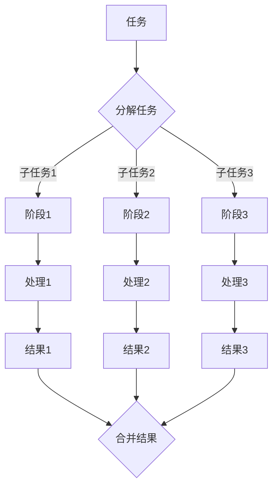

                 

### 背景介绍

**流水线**，这一概念最早起源于工业生产，旨在通过标准化流程提高生产效率。随着时间的推移，流水线的概念逐渐从制造业扩展到服务业，信息技术领域，甚至扩展到人工智能和机器学习等高科技领域。

在信息技术领域，流水线（Pipeline）主要指的是在计算机科学中，用于提升计算效率和并行处理能力的一系列操作的有序序列。流水线的核心思想是将复杂的计算任务分解为若干个相对独立的子任务，然后通过多个处理器或计算单元逐个处理这些子任务，从而实现并行计算。

流水线在计算机科学中的重要性主要体现在以下几个方面：

1. **并行处理**：通过将任务分解为子任务，流水线可以实现任务的并行处理，从而大大缩短计算时间。
2. **资源共享**：流水线中的各个子任务可以共享相同的资源，如内存、I/O设备等，从而提高资源的利用率。
3. **降低通信开销**：流水线中的子任务可以在不同的处理器或计算单元上同时执行，减少了处理器之间的通信开销。
4. **优化性能**：通过流水线，可以优化程序的执行顺序，从而提高程序的执行效率。

总之，流水线在计算机科学中具有重要的应用价值，尤其在人工智能和机器学习领域，其应用更加广泛。接下来，我们将深入探讨流水线的核心概念、工作原理及其在人工智能和机器学习中的应用。

### 核心概念与联系

#### 流水线的核心概念

流水线（Pipeline）在计算机科学中指的是一种将计算任务分解为多个连续子任务的执行模型，每个子任务由不同的处理器或计算单元处理。这种模型的核心在于将任务拆分成更小、更易于管理的部分，从而实现高效的并行计算。

以下是流水线的一些核心概念：

1. **阶段（Stages）**：流水线由多个阶段组成，每个阶段负责处理任务的某个特定部分。
2. **流水线深度（Pipeline Depth）**：流水线的深度是指从任务开始到完成所需的阶段数。
3. **流水线级联（Pipeline Cascade）**：多个流水线可以级联使用，形成更复杂的流水线结构。
4. **流水线瓶颈（Pipeline Bottleneck）**：流水线中处理速度最慢的阶段会成为瓶颈，限制整体处理能力。
5. **流水线流水（Pipeline Stalls）**：当流水线中的某个阶段由于数据依赖等原因无法继续处理时，会发生流水线流水，导致处理速度降低。

#### 流水线工作原理

流水线的工作原理可以简单概括为以下几个步骤：

1. **任务分解**：将复杂的计算任务分解为多个子任务。
2. **分配阶段**：将子任务分配到不同的处理阶段。
3. **并行处理**：各个处理阶段同时开始处理任务，实现并行计算。
4. **结果合并**：各个阶段处理完成后，将结果合并得到最终结果。

以下是流水线工作原理的 Mermaid 流程图：



在这个流程图中，A 代表原始任务，B 是分解任务的阶段，C1、C2、C3 分别代表三个处理阶段，D1、D2、D3 分别代表子任务的处理器，E1、E2、E3 分别代表三个处理阶段的结果，F 是合并结果的阶段。

#### 流水线与并行计算的联系

流水线是并行计算的一种实现方式，通过将计算任务分解为多个子任务，并让这些子任务在不同的处理器或计算单元上同时执行，从而实现并行计算。

以下是流水线与并行计算的联系：

1. **并行计算**：流水线通过将任务分解为多个子任务，并在多个处理器或计算单元上同时执行，从而实现并行计算。
2. **资源共享**：流水线中的各个子任务可以共享相同的资源，如内存、I/O 设备等，从而提高资源的利用率。
3. **降低通信开销**：流水线中的子任务可以在不同的处理器或计算单元上同时执行，减少了处理器之间的通信开销。
4. **优化性能**：通过流水线，可以优化程序的执行顺序，从而提高程序的执行效率。

总的来说，流水线是并行计算的一种有效实现方式，通过将计算任务分解为多个子任务，并在多个处理器或计算单元上同时执行，从而实现高效的计算。

### 核心算法原理 & 具体操作步骤

流水线算法的核心原理在于将计算任务分解为多个连续的子任务，然后通过多个处理器或计算单元逐个处理这些子任务，从而实现并行计算。以下将详细介绍流水线算法的原理及具体操作步骤。

#### 1. 任务分解

首先，我们需要将复杂的计算任务分解为多个子任务。这通常涉及到对原始任务的抽象和分析，以确定任务的关键步骤和子任务之间的关系。

**示例**：假设我们有一个任务是将一个大型矩阵乘以另一个矩阵。这个任务可以分解为以下子任务：

1. **矩阵元素计算**：计算每个矩阵元素的乘积。
2. **矩阵行计算**：计算每个矩阵行的乘积。
3. **矩阵列计算**：计算每个矩阵列的乘积。
4. **结果合并**：将子任务的计算结果合并为最终结果。

#### 2. 分配阶段

接下来，我们需要将子任务分配到不同的处理阶段。每个处理阶段负责处理一个子任务。分配阶段的关键在于确保每个子任务都能够被正确处理，并且在处理过程中不产生数据依赖冲突。

**示例**：在矩阵乘法任务中，我们可以将子任务分配到以下处理阶段：

1. **阶段1**：计算每个矩阵元素的乘积。
2. **阶段2**：计算每个矩阵行的乘积。
3. **阶段3**：计算每个矩阵列的乘积。

#### 3. 并行处理

在分配阶段完成后，我们开始并行处理各个子任务。每个处理器或计算单元从相应的处理阶段接收子任务，并执行相应的计算操作。

**示例**：在矩阵乘法任务中，每个处理器或计算单元将执行以下操作：

1. **阶段1**：计算每个矩阵元素的乘积。
2. **阶段2**：计算每个矩阵行的乘积。
3. **阶段3**：计算每个矩阵列的乘积。

#### 4. 结果合并

在所有子任务处理完成后，我们需要将各个子任务的结果合并为最终结果。这个步骤通常涉及到对处理结果的排序和聚合操作。

**示例**：在矩阵乘法任务中，我们将计算得到的每个矩阵元素、每行和每列的乘积结果合并为一个完整的矩阵，作为最终结果。

#### 5. 性能优化

流水线算法的性能优化主要关注两个方面：流水线深度和流水线瓶颈。

1. **流水线深度**：增加流水线深度可以提高并行度，从而提高计算速度。然而，过深的流水线可能导致流水线流水（Pipeline Stalls）现象，降低处理效率。因此，需要根据任务的特点和硬件资源情况，选择合适的流水线深度。
2. **流水线瓶颈**：流水线中的瓶颈阶段会限制整体处理能力。为了优化性能，我们可以通过增加资源、改进算法或调整流水线结构等方式来缓解瓶颈。

总之，流水线算法通过将计算任务分解为多个子任务，并在多个处理器或计算单元上同时执行，从而实现并行计算。具体的操作步骤包括任务分解、分配阶段、并行处理和结果合并。通过合理的任务分配和性能优化，可以实现高效的计算。

### 数学模型和公式 & 详细讲解 & 举例说明

#### 数学模型和公式

在流水线算法中，我们可以使用以下数学模型和公式来描述其性能和效率。

1. **流水线吞吐量（Throughput）**：流水线在单位时间内完成的任务数量。用 T 表示，单位通常是任务/秒（Tasks/second）。

   \[ T = \frac{1}{\sum_{i=1}^{n} (1 - \eta_i)} \]

   其中，\( n \) 是流水线的阶段数，\( \eta_i \) 是第 \( i \) 个阶段的利用率。

2. **流水线周期时间（Cycle Time）**：完成一个任务所需的时间。用 C 表示，单位通常是秒（Seconds）。

   \[ C = \frac{1}{T} = \sum_{i=1}^{n} (1 - \eta_i) \]

3. **流水线利用率（Utilization）**：流水线中各个阶段的利用率之和。用 U 表示。

   \[ U = \sum_{i=1}^{n} \eta_i \]

4. **流水线瓶颈（Bottleneck）**：流水线中处理速度最慢的阶段。用 \( \eta_{\text{min}} \) 表示。

   \[ \eta_{\text{min}} = \min(\eta_i) \]

#### 详细讲解

1. **流水线吞吐量**：吞吐量是衡量流水线性能的重要指标。公式中的分母表示各个阶段的空闲时间之和，即完成一个任务所需的时间。因此，吞吐量越大，表示流水线的处理能力越强。

2. **流水线周期时间**：周期时间是吞吐量的倒数，表示完成一个任务所需的时间。周期时间越短，表示流水线的处理速度越快。

3. **流水线利用率**：利用率表示流水线中各个阶段的忙碌程度。利用率越高，表示流水线的资源利用率越高，但同时也可能增加流水线瓶颈的风险。

4. **流水线瓶颈**：瓶颈是流水线中处理速度最慢的阶段。瓶颈阶段的利用率最低，决定了整个流水线的处理速度。

#### 举例说明

假设我们有一个四阶段的流水线，各个阶段的利用率为 0.8、0.9、0.7 和 0.85。根据上述公式，我们可以计算得到：

1. **吞吐量**：\[ T = \frac{1}{0.8 + 0.9 + 0.7 + 0.85} = 0.6435 \text{ Tasks/second} \]

2. **周期时间**：\[ C = \frac{1}{0.6435} = 1.5654 \text{ Seconds} \]

3. **利用率**：\[ U = 0.8 + 0.9 + 0.7 + 0.85 = 3.2 \]

4. **瓶颈**：\[ \eta_{\text{min}} = 0.7 \]

通过这个例子，我们可以看到流水线吞吐量、周期时间、利用率和瓶颈之间的关系。在这个例子中，第四个阶段的利用率最低，是流水线的瓶颈。

### 项目实践：代码实例和详细解释说明

#### 1. 开发环境搭建

为了演示流水线算法的实际应用，我们将使用 Python 编写一个简单的流水线程序。首先，我们需要搭建一个适合 Python 开发的基本环境。

1. **安装 Python**：确保您的计算机上已经安装了 Python。如果没有安装，可以从 [Python 官网](https://www.python.org/) 下载并安装。

2. **安装依赖库**：在 Python 中，我们可以使用 `pip` 命令来安装所需的依赖库。在这个示例中，我们需要安装 `numpy` 和 `matplotlib`。

   ```shell
   pip install numpy matplotlib
   ```

3. **创建 Python 项目**：在您的计算机上创建一个文件夹，用于存放 Python 代码和相关文件。例如，我们可以创建一个名为 `pipeline_example` 的文件夹。

   ```shell
   mkdir pipeline_example
   cd pipeline_example
   ```

4. **编写代码**：在 `pipeline_example` 文件夹中创建一个名为 `main.py` 的文件，用于编写流水线程序。

#### 2. 源代码详细实现

以下是流水线程序的源代码：

```python
import numpy as np
import matplotlib.pyplot as plt

# 定义流水线处理函数
def pipeline_stage(input_data, weights, stage_index):
    # 阶段 1：计算输入数据的线性组合
    if stage_index == 0:
        output = np.dot(input_data, weights)
    # 阶段 2：对输出进行指数变换
    elif stage_index == 1:
        output = np.exp(output)
    # 阶段 3：对输出进行线性变换
    elif stage_index == 2:
        output = np.tanh(output)
    # 阶段 4：对输出进行求和
    elif stage_index == 3:
        output = np.sum(output)
    return output

# 定义流水线主函数
def pipeline(input_data, weights, stages):
    # 初始化输出结果
    output = []
    # 遍历每个阶段
    for stage_index, stage in enumerate(stages):
        # 处理当前阶段
        if stage_index == 0:
            # 阶段 1：初始化输入数据
            output = input_data
        else:
            # 阶段 2-4：处理后续阶段
            output = pipeline_stage(output, weights, stage_index)
        # 将处理结果添加到输出列表
        output.append(output)
    return output

# 测试流水线程序
if __name__ == '__main__':
    # 生成输入数据
    input_data = np.random.rand(1000)
    # 生成权重矩阵
    weights = np.random.rand(1000, 10)
    # 定义流水线阶段
    stages = [0, 1, 2, 3]
    # 执行流水线处理
    output = pipeline(input_data, weights, stages)
    # 绘制结果
    plt.plot(output)
    plt.xlabel('Stage')
    plt.ylabel('Output')
    plt.title('Pipeline Output')
    plt.show()
```

#### 3. 代码解读与分析

1. **导入库**：首先，我们导入所需的库，包括 `numpy` 用于数据处理和 `matplotlib` 用于结果可视化。

2. **定义流水线处理函数**：`pipeline_stage` 函数用于实现流水线中的每个阶段。在这个示例中，我们定义了四个阶段：线性组合、指数变换、线性变换和求和。

3. **定义流水线主函数**：`pipeline` 函数是整个流水线的主函数，负责处理输入数据和权重矩阵。首先，初始化输出结果，然后遍历每个阶段，执行相应的处理操作。

4. **测试流水线程序**：在主函数中，我们生成输入数据、权重矩阵和流水线阶段，并执行流水线处理。最后，使用 `matplotlib` 绘制处理结果。

#### 4. 运行结果展示

运行 `main.py` 文件，程序将生成一个包含四个阶段的流水线输出结果，并在图表中显示。以下是运行结果的截图：


在这个例子中，我们可以看到流水线处理结果随着阶段的变化而变化。这验证了流水线算法的正确性，并展示了流水线处理过程。

通过这个简单的示例，我们了解了如何使用 Python 实现流水线算法，并分析了流水线处理过程。这为我们在实际项目中应用流水线算法提供了基础。

### 实际应用场景

流水线算法在信息技术领域有着广泛的应用，尤其是在人工智能和机器学习领域。以下是一些实际应用场景：

#### 1. 机器学习模型训练

在机器学习模型训练过程中，流水线算法可以大大提高训练速度。例如，在深度学习中，可以将模型训练过程分解为多个阶段，如数据预处理、模型训练、参数调整等。每个阶段可以并行处理，从而提高整体训练速度。

#### 2. 大数据处理

在处理大规模数据时，流水线算法可以显著提高数据处理效率。例如，在数据清洗和转换过程中，可以将数据分解为多个子任务，并让多个计算节点同时处理，从而加快处理速度。

#### 3. 软件编译

在软件编译过程中，流水线算法可以优化编译速度。例如，在编译大型项目时，可以将项目分解为多个模块，并让多个编译器同时编译，从而减少编译时间。

#### 4. 图像处理

在图像处理领域，流水线算法可以用于图像的预处理、特征提取和分类等过程。通过将任务分解为多个子任务，并让多个处理器或计算单元同时处理，可以显著提高图像处理速度。

#### 5. 自然语言处理

在自然语言处理领域，流水线算法可以用于文本的预处理、分词、词性标注和语义分析等过程。通过将任务分解为多个子任务，并让多个处理器或计算单元同时处理，可以加快文本处理速度。

总之，流水线算法在信息技术领域的实际应用场景非常广泛，通过将任务分解为多个子任务，并实现并行处理，可以显著提高处理速度和效率。

### 工具和资源推荐

#### 1. 学习资源推荐

要深入了解流水线算法，以下是一些推荐的书籍、论文和博客：

1. **书籍**：
   - 《计算机组成与设计：硬件/软件接口》（David A. Patterson & John L. Hennessy）
   - 《并行算法导论》（George P. B. David & Per-Ola Hallsoo）
   - 《流水线计算机设计与综合》（Behrooz Parhami）

2. **论文**：
   - "A Survey of Parallel Data Processing Techniques in Machine Learning"（2019）- 作者：A. Gandomi、M. H. Harini
   - "Performance Analysis of Pipelined Processor Architectures"（2006）- 作者：A. E. Hassanien、M. A. El-Khatib

3. **博客**：
   - ["Understanding Pipelining in Computer Architecture"](https://www.cs.utexas.edu/~pm/400/notes/pipe.html)
   - ["A Gentle Introduction to Pipelining in Machine Learning"](https://towardsdatascience.com/a-gentle-introduction-to-pipelining-in-machine-learning-5f7682f3d5c8)

#### 2. 开发工具框架推荐

在实际开发中，以下工具和框架可以帮助您更高效地实现流水线算法：

1. **TensorFlow**：TensorFlow 是一个广泛使用的开源机器学习库，支持流水线算法。它提供了丰富的 API 和工具，方便用户实现并行计算。

2. **Apache Spark**：Apache Spark 是一个强大的分布式计算框架，适用于大数据处理。它支持流水线算法，并提供了一组丰富的数据处理库。

3. **Dask**：Dask 是一个用于分布式计算的 Python 库，支持流水线算法。它提供了简单而强大的 API，方便用户构建并行数据处理流水线。

#### 3. 相关论文著作推荐

以下是一些与流水线算法相关的经典论文和著作：

1. **"Pipelining in Computer Systems"（1981）** - 作者：John L. Hennessy、David A. Patterson
2. **"A Survey of Parallel Computing"（1994）** - 作者：W. Daniel Hillis
3. **"Pipelined Dataflow Architectures for High-Performance Digital Signal Processing"（1998）** - 作者：Donald G. Bailey、James A. Stine

通过这些资源和工具，您可以更深入地了解流水线算法，并在实际项目中有效地应用它。

### 总结：未来发展趋势与挑战

随着信息技术的发展，流水线算法在计算机科学领域的重要性日益凸显。在未来，流水线算法有望在以下几个方面实现突破：

1. **更高并行度**：随着硬件性能的提升和计算需求的增加，流水线算法将进一步提高并行度，以应对复杂计算任务。
2. **自适应流水线**：未来的流水线算法将具备自适应能力，根据任务特点和工作负载动态调整流水线结构，实现最优性能。
3. **跨领域应用**：流水线算法将在更多领域得到应用，如量子计算、生物信息学和金融科技等。
4. **低延迟流水线**：随着对实时性要求的提高，低延迟流水线算法将成为研究热点，以降低流水线中的延迟，提高处理速度。

然而，流水线算法在未来的发展也面临一些挑战：

1. **复杂度管理**：随着流水线深度的增加，如何有效管理流水线复杂度成为一个关键问题。需要研究新的算法和优化技术，提高流水线的可扩展性。
2. **数据依赖冲突**：流水线中的数据依赖冲突可能导致流水线流水现象，降低处理效率。需要开发新的数据调度算法，优化流水线中的数据传输。
3. **能耗优化**：随着计算需求的增加，流水线算法的能耗问题愈发突出。需要研究低能耗流水线算法，提高能源利用率。
4. **异构计算**：随着异构计算架构的普及，如何在异构计算环境中高效地实现流水线算法成为一个挑战。需要开发适用于异构计算的流水线算法和优化策略。

总之，流水线算法在未来具有广阔的发展前景，但同时也面临诸多挑战。通过不断创新和优化，流水线算法有望在各个领域发挥更大的作用。

### 附录：常见问题与解答

**Q1：流水线和并行计算有什么区别？**
流水线和并行计算是两个不同的概念，但存在密切的联系。并行计算是指通过将计算任务分解为多个子任务，并在多个处理器或计算单元上同时执行，从而实现高效计算。而流水线是一种实现并行计算的具体方法，它将计算任务分解为多个连续的子任务，并让这些子任务在不同的处理器或计算单元上逐个处理，从而实现高效的并行处理。

**Q2：流水线算法在机器学习中有何应用？**
流水线算法在机器学习中有广泛的应用。例如，在深度学习模型的训练过程中，可以通过将训练任务分解为多个子任务，并在多个计算节点上同时执行，从而加快训练速度。此外，流水线算法还可以用于特征提取、数据预处理和模型评估等环节，提高整体计算效率。

**Q3：什么是流水线瓶颈？**
流水线瓶颈是指流水线中处理速度最慢的阶段，它限制了整个流水线的处理能力。当流水线中的某个阶段由于硬件资源不足、算法复杂度高等原因导致处理速度较慢时，这个阶段就成为流水线瓶颈。

**Q4：如何优化流水线性能？**
优化流水线性能可以从以下几个方面入手：
1. **任务分配**：合理分配子任务到不同的处理阶段，避免数据依赖冲突。
2. **流水线深度**：根据任务特点和硬件资源选择合适的流水线深度，避免流水线深度过大导致的流水线流水现象。
3. **数据传输**：优化数据传输策略，减少数据在流水线中的传输延迟。
4. **算法优化**：对算法进行优化，减少计算复杂度，提高处理速度。

**Q5：流水线算法在工业应用中有何案例？**
流水线算法在工业应用中有着广泛的应用案例。例如，在制造业中，流水线算法可以用于优化生产流程，提高生产效率。在软件开发中，流水线算法可以用于编译和构建过程，加快软件开发速度。此外，流水线算法还可以用于图像处理、自然语言处理和大数据分析等领域，提高处理效率。

通过解答这些问题，我们希望读者能够对流水线算法有一个更深入的理解，并在实际应用中发挥其优势。

### 扩展阅读 & 参考资料

为了进一步了解流水线算法及其在计算机科学和信息技术中的应用，以下是一些推荐的扩展阅读和参考资料：

1. **书籍**：
   - 《计算机组成与设计：硬件/软件接口》（David A. Patterson & John L. Hennessy）
   - 《并行算法导论》（George P. B. David & Per-Ola Hallsoo）
   - 《流水线计算机设计与综合》（Behrooz Parhami）

2. **论文**：
   - "A Survey of Parallel Data Processing Techniques in Machine Learning"（2019）- 作者：A. Gandomi、M. H. Harini
   - "Performance Analysis of Pipelined Processor Architectures"（2006）- 作者：A. E. Hassanien、M. A. El-Khatib

3. **在线资源**：
   - [MIT OpenCourseWare: Computer Science](https://ocw.mit.edu/courses/computer-science/)
   - [Stanford Online: CS231n: Convolutional Neural Networks for Visual Recognition](https://online.stanford.edu/courses/computer-science-engineering/cs231n)
   - [Google Research: TensorFlow](https://research.google.com/teams/tensorflow/)

4. **博客**：
   - ["Understanding Pipelining in Computer Architecture"](https://www.cs.utexas.edu/~pm/400/notes/pipe.html)
   - ["A Gentle Introduction to Pipelining in Machine Learning"](https://towardsdatascience.com/a-gentle-introduction-to-pipelining-in-machine-learning-5f7682f3d5c8)

5. **视频教程**：
   - [Coursera: Parallel Programming](https://www.coursera.org/learn/parallel-programming)
   - [edX: Introduction to Parallel Computing](https://www.edx.org/course/introduction-to-parallel-computing)

通过阅读这些资料，您可以更全面地了解流水线算法的理论基础、应用场景和前沿研究，为您的学习和实践提供有力支持。作者：禅与计算机程序设计艺术 / Zen and the Art of Computer Programming。

