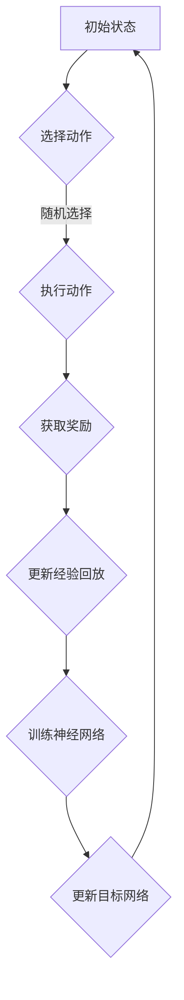
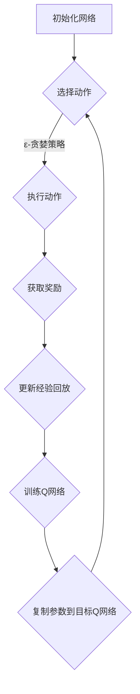

                 

### 1. 背景介绍

#### 什么是深度Q网络（DQN）

深度Q网络（DQN，Deep Q-Network）是由DeepMind在2015年提出的一种深度学习算法，主要用于解决 Atari 游戏的人工智能问题。DQN 是一种基于价值的强化学习算法，通过学习值函数来预测在给定状态下执行某一动作所能获得的累积奖励。

强化学习是一种机器学习范式，主要研究如何通过学习来优化决策过程。与监督学习和无监督学习不同，强化学习的目标是让智能体（agent）在与环境的交互过程中学习到最优策略（policy）。在这个过程中，智能体会根据环境提供的反馈（奖励或惩罚）来调整自己的行为。

DQN 的提出在很大程度上解决了传统 Q-Learning 算法中存在的几个问题：

1. **状态-动作值函数的学习**：传统 Q-Learning 使用线性模型来近似状态-动作值函数，这限制了算法的学习能力。DQN 利用深度神经网络来逼近状态-动作值函数，从而提高了学习效率和准确度。

2. **探索与利用的平衡**：在强化学习中，智能体需要在探索（exploitation）和利用（exploitation）之间取得平衡。DQN 采用了 ε-贪婪策略，通过在部分时间随机选择动作来增加探索，从而避免陷入局部最优。

3. **连续状态的适应**：传统 Q-Learning 通常适用于离散状态空间，而 DQN 可以处理连续状态空间，这使得它能够应用于更多实际场景。

DQN 的出现标志着深度学习在强化学习领域的重要进展，它为后续的深度强化学习算法提供了理论基础和实验依据。

#### DQN 的历史与发展

DQN 的提出并不是一蹴而就的，它的出现依赖于一系列相关算法和研究的积累。以下是 DQN 的一些重要历史节点：

- **1950s**: 强化学习概念的提出。美国心理学家伯纳德·贝林（Bernard Beran）的研究首次提出了强化学习的基本思想。

- **1980s**: Q-Learning 的诞生。理查德·S·萨顿（Richard S. Sutton）和安德鲁·G·巴特斯（Andrew G. Barto）提出了 Q-Learning 算法，这是一种基于价值迭代的强化学习方法。

- **1990s**: 深度神经网络的发展。深度神经网络（DNN）的概念逐渐成熟，并开始应用于图像识别、语音识别等领域。

- **2000s**: 深度强化学习的研究。包括 Deep Q-Learning 和 Policy Gradient 等一系列深度强化学习算法被提出。

- **2015**: DQN 的提出。DeepMind 的 David Silver 和 Andrew Ng 等人提出了 DQN，并在《Nature》上发表。

- **2016-至今**：DQN 和其变体的广泛应用和研究。DQN 和其变体（如 Double DQN、Dueling DQN 等）在多个领域得到了广泛的应用和研究，并成为深度强化学习的一个重要分支。

DQN 的历史和发展不仅展示了人工智能领域的快速进步，也反映了科学家们对复杂问题解决方法的不断探索。

### 2. 核心概念与联系

#### 什么是深度Q网络（DQN）

深度Q网络（DQN，Deep Q-Network）是一种基于深度学习技术的强化学习算法，主要解决的是如何在复杂的环境中做出最优决策的问题。DQN 通过深度神经网络来近似 Q 函数，从而实现对环境的理解和决策。

##### 核心概念

1. **状态（State）**：描述环境的当前情况，通常是一个向量或图像。
2. **动作（Action）**：智能体可以采取的行动，例如在游戏中移动方向或按下按钮。
3. **奖励（Reward）**：每次行动后环境给予的即时反馈，可以是正数（奖励）或负数（惩罚）。
4. **策略（Policy）**：智能体根据当前状态选择动作的策略，可以是一个函数或表。
5. **Q值（Q-value）**：表示在给定状态下执行某个动作所能获得的累积奖励的估计值。

##### DQN 的核心概念联系

DQN 的核心是 Q 函数，它是一个预测函数，用来估计在当前状态下执行某一动作所能获得的累积奖励。DQN 通过学习 Q 函数来优化智能体的策略。

1. **状态-动作值函数**：DQN 使用深度神经网络来近似状态-动作值函数 Q(s, a)，即预测在状态 s 下执行动作 a 所能获得的累积奖励。
2. **经验回放（Experience Replay）**：DQN 使用经验回放机制来增加智能体的探索能力，通过随机抽样过去的经验来训练神经网络，避免陷入局部最优。
3. **目标网络（Target Network）**：DQN 使用目标网络来稳定学习过程，目标网络是一个与主网络结构相同的网络，但参数更新速度较慢，用于生成目标 Q 值。

##### Mermaid 流程图

下面是一个简单的 Mermaid 流程图，描述了 DQN 的基本工作流程：



在这个流程图中：

- A：初始状态
- B：智能体根据当前状态选择动作
- C：执行动作并获取奖励
- D：更新经验回放
- E：使用经验回放进行神经网络训练
- F：更新神经网络参数
- G：更新目标网络参数

### 3. 核心算法原理 & 具体操作步骤

#### 算法原理

深度Q网络（DQN）是基于 Q-Learning 的一个改进算法，其核心思想是通过深度神经网络来近似 Q 函数，从而学习到最优策略。DQN 的算法流程可以概括为以下几个步骤：

1. **初始化**：初始化 Q 网络、目标 Q 网络和经验回放缓冲。
2. **选择动作**：使用 ε-贪婪策略在当前状态下选择动作，其中 ε 是一个小的常数，用于控制探索与利用的平衡。
3. **执行动作**：在环境中执行选定的动作，并获取新的状态和奖励。
4. **更新经验回放**：将当前状态、动作、奖励和新状态存入经验回放缓冲。
5. **训练 Q 网络**：使用经验回放缓冲中的数据进行 Q 网络训练，更新 Q 网络参数。
6. **更新目标 Q 网络**：定期更新目标 Q 网络的参数，以稳定学习过程。

#### 具体操作步骤

1. **初始化网络**

   DQN 初始化两个深度神经网络：主 Q 网络和目标 Q 网络。

   - 主 Q 网络用于实时预测 Q 值，并不断更新其参数。
   - 目标 Q 网络用于生成目标 Q 值，其参数定期从主 Q 网络复制。

   初始化步骤包括随机初始化两个网络的权重和偏置。

2. **选择动作**

   使用 ε-贪婪策略来选择动作。具体步骤如下：

   - 随机生成一个 0 到 1 的随机数。
   - 如果随机数小于 ε，则随机选择一个动作。
   - 如果随机数大于或等于 ε，则选择能够最大化 Q 值的动作。

   ε 的值随着训练的进行逐渐减小，以在初始阶段增加探索，在后期阶段增加利用。

3. **执行动作**

   在环境中执行选定的动作，并获取新的状态和奖励。新的状态会作为下一步的输入状态。

4. **更新经验回放**

   将当前状态、动作、奖励和新状态存入经验回放缓冲。经验回放缓冲通常使用循环缓冲区实现，以防止内存溢出。

5. **训练 Q 网络**

   从经验回放缓冲中随机抽样一批经验，用于训练主 Q 网络的参数。训练过程通常使用梯度下降算法来最小化损失函数，损失函数通常定义为：

   $$L = (y - Q(s, a))^2$$

   其中 y 是目标 Q 值，Q(s, a) 是预测的 Q 值。

6. **更新目标 Q 网络**

   定期（例如每若干步或若干次更新）将主 Q 网络的参数复制到目标 Q 网络，以确保目标 Q 网络的参数不会过快地偏离主 Q 网络的参数。

#### 算法原理与流程图

下面是一个简化的 Mermaid 流程图，描述了 DQN 的算法原理和具体操作步骤：



在这个流程图中：

- A：初始化网络
- B：选择动作
- C：执行动作
- D：获取奖励
- E：更新经验回放
- F：训练 Q 网络
- G：复制参数到目标 Q 网络

#### 探索与利用的平衡

在 DQN 中，探索与利用的平衡通过 ε-贪婪策略实现。ε-贪婪策略的基本思想是：

- 在训练初期，智能体应该探索环境以发现新的信息。
- 在训练后期，智能体应该利用已学到的知识以获得更好的性能。

具体来说，ε-贪婪策略如下：

1. 初始化 ε 为一个较大的值，例如 1。
2. 随机生成一个 0 到 1 的随机数。
3. 如果随机数小于 ε，则随机选择一个动作。
4. 如果随机数大于或等于 ε，则选择能够最大化 Q 值的动作。
5. 随着训练的进行，逐渐减小 ε 的值，例如每次更新一步减小 ε/10。

这种策略可以确保在训练初期智能体能够充分探索环境，而在训练后期智能体能够更加稳定地利用已学到的知识。

### 4. 数学模型和公式 & 详细讲解 & 举例说明

#### 数学模型

深度Q网络（DQN）的数学模型主要包括以下几个部分：

1. **Q 函数**：Q 函数是一个预测函数，用于估计在给定状态下执行某一动作所能获得的累积奖励。在 DQN 中，Q 函数通常被表示为：

   $$Q(s, a; \theta) = \sum_{j=1}^n \theta_j a_j$$

   其中，s 是状态，a 是动作，θ 是网络的权重和偏置，a_j 是动作 a 的 j 维分量。

2. **目标 Q 函数**：目标 Q 函数是用于更新目标 Q 网络的 Q 值。在 DQN 中，目标 Q 函数通常被表示为：

   $$Q'(s', a'; \theta') = r + \gamma \max_{a'} Q'(s', a'; \theta')$$

   其中，s' 是新状态，r 是即时奖励，γ 是折扣因子，θ' 是目标 Q 网络的权重和偏置。

3. **损失函数**：在 DQN 中，损失函数通常被定义为：

   $$L = (y - Q(s, a; \theta))^2$$

   其中，y 是目标 Q 值，Q(s, a; \theta) 是预测的 Q 值。

#### 详细讲解

1. **Q 函数的计算**

   Q 函数的计算是通过深度神经网络来完成的。在 DQN 中，输入是一个状态向量 s，输出是一个动作值向量 Q(s, a)。每个动作值 Q(s, a) 表示在状态 s 下执行动作 a 所能获得的累积奖励的估计。

   例如，对于一个有 n 个动作的智能体，Q 函数的计算可以表示为：

   $$Q(s, a; \theta) = \sum_{j=1}^n \theta_j a_j$$

   其中，θ_j 是神经网络中第 j 个神经元的权重。

2. **目标 Q 函数的计算**

   目标 Q 函数用于生成目标 Q 值，它是在智能体执行动作后，根据新的状态和新动作计算得到的。目标 Q 函数的计算过程如下：

   - 首先，计算在新的状态 s' 下能够获得的最大的 Q 值：

     $$\max_{a'} Q(s', a'; \theta')$$

   - 然后，将即时奖励 r 加上折扣因子 γ 乘以这个最大的 Q 值：

     $$Q'(s', a'; \theta') = r + \gamma \max_{a'} Q'(s', a'; \theta')$$

   这个目标 Q 值用于更新目标 Q 网络的参数。

3. **损失函数的计算**

   在 DQN 中，损失函数用于衡量预测的 Q 值与目标 Q 值之间的差异。损失函数的计算公式如下：

   $$L = (y - Q(s, a; \theta))^2$$

   其中，y 是目标 Q 值，Q(s, a; \theta) 是预测的 Q 值。

   损失函数的目的是通过梯度下降算法来更新网络的参数，以最小化预测误差。

#### 举例说明

假设一个智能体处于一个简单的环境，环境有两个状态：状态 s1 和状态 s2。智能体有两个动作：动作 a1 和动作 a2。网络的权重和偏置分别为 θ1、θ2 和 b1、b2。

1. **Q 函数的计算**

   在状态 s1 下，执行动作 a1 的 Q 值为：

   $$Q(s1, a1; \theta) = \theta_1 a_1 + \theta_2 a_2 + b_1$$

   在状态 s1 下，执行动作 a2 的 Q 值为：

   $$Q(s1, a2; \theta) = \theta_1 a_1 + \theta_2 a_2 + b_2$$

   在状态 s2 下，执行动作 a1 的 Q 值为：

   $$Q(s2, a1; \theta) = \theta_1 a_1 + \theta_2 a_2 + b_1$$

   在状态 s2 下，执行动作 a2 的 Q 值为：

   $$Q(s2, a2; \theta) = \theta_1 a_1 + \theta_2 a_2 + b_2$$

2. **目标 Q 函数的计算**

   在新的状态 s2 下，能够获得的最大的 Q 值为：

   $$\max_{a'} Q(s2, a'; \theta') = Q(s2, a2; \theta')$$

   因此，在状态 s2 下，执行动作 a2 的目标 Q 值为：

   $$Q'(s2, a2; \theta') = r + \gamma \max_{a'} Q'(s2, a'; \theta')$$

   其中，r 是即时奖励，γ 是折扣因子。

3. **损失函数的计算**

   假设目标 Q 值 y 为 10，预测的 Q 值 Q(s2, a2; \theta) 为 8，则损失函数为：

   $$L = (y - Q(s2, a2; \theta))^2 = (10 - 8)^2 = 4$$

   通过梯度下降算法，将损失函数的梯度用于更新网络的参数，以最小化损失函数。

### 5. 项目实践：代码实例和详细解释说明

#### 5.1 开发环境搭建

在进行 DQN 的项目实践之前，首先需要搭建一个合适的环境。以下是搭建开发环境的具体步骤：

1. **安装 Python**：确保已安装 Python 3.6 或更高版本。

2. **安装 TensorFlow**：使用以下命令安装 TensorFlow：

   ```bash
   pip install tensorflow
   ```

3. **安装 Gym**：Gym 是一个开源的环境库，用于构建和测试强化学习算法。使用以下命令安装 Gym：

   ```bash
   pip install gym
   ```

4. **安装其他依赖**：根据需要安装其他必要的库，例如 NumPy、Pandas 等。

#### 5.2 源代码详细实现

下面是 DQN 的一个简单实现，用于在 Atari 游戏中进行训练。

```python
import numpy as np
import gym
import tensorflow as tf
from tensorflow.keras import layers

# 参数设置
epsilon = 1.0
epsilon_min = 0.01
epsilon_decay = 0.995
gamma = 0.99
batch_size = 32
learning_rate = 0.001
memory_size = 10000

# 创建环境
env = gym.make('AtariGame-v0')

# 定义 Q 网络
input_shape = env.observation_space.shape
output_shape = env.action_space.n

model = tf.keras.Sequential([
    layers.Flatten(input_shape=input_shape),
    layers.Dense(256, activation='relu'),
    layers.Dense(256, activation='relu'),
    layers.Dense(output_shape)
])

model.compile(optimizer=tf.keras.optimizers.Adam(learning_rate=learning_rate), loss='mse')

# 定义目标 Q 网络
target_model = tf.keras.Sequential([
    layers.Flatten(input_shape=input_shape),
    layers.Dense(256, activation='relu'),
    layers.Dense(256, activation='relu'),
    layers.Dense(output_shape)
])

# 初始化经验回放缓冲
memory = []

# 训练过程
for episode in range(1000):
    state = env.reset()
    done = False
    total_reward = 0

    while not done:
        # 选择动作
        if np.random.rand() < epsilon:
            action = env.action_space.sample()
        else:
            action = np.argmax(model.predict(state))

        # 执行动作
        next_state, reward, done, _ = env.step(action)
        total_reward += reward

        # 更新经验回放缓冲
        memory.append((state, action, reward, next_state, done))

        # 清理经验回放缓冲
        if len(memory) > memory_size:
            memory.pop(0)

        # 训练 Q 网络
        if len(memory) > batch_size:
            batch = random.sample(memory, batch_size)
            states, actions, rewards, next_states, dones = zip(*batch)

            target_qs = target_model.predict(next_states)
            target_q_values = target_qs.max(axis=1)

            y = rewards + (1 - dones) * gamma * target_q_values

            model.fit(states, y[None, :], verbose=0)

        # 更新目标 Q 网络
        if episode % 1000 == 0:
            target_model.set_weights(model.get_weights())

        # 更新状态
        state = next_state

    # 更新 ε 值
    epsilon = max(epsilon_min, epsilon_decay * epsilon)

    print(f"Episode {episode}: Total Reward = {total_reward}")

# 评估模型
eval_env = gym.make('AtariGame-v0')
eval_reward = 0
state = eval_env.reset()

while True:
    action = np.argmax(model.predict(state))
    state, reward, done, _ = eval_env.step(action)
    eval_reward += reward

    if done:
        print(f"Evaluation Reward: {eval_reward}")
        break
```

#### 5.3 代码解读与分析

1. **参数设置**：首先，我们设置了一些参数，包括 ε（探索率）、ε_min（最小 ε 值）、ε_decay（ε 减小率）、gamma（折扣因子）、batch_size（批量大小）、learning_rate（学习率）和 memory_size（经验回放缓冲大小）。

2. **创建环境**：我们使用 Gym 创建了一个 Atari 游戏环境。

3. **定义 Q 网络和目标 Q 网络**：我们使用 TensorFlow 创建了一个简单的 Q 网络，该网络包含两个隐藏层，每个隐藏层有 256 个神经元。我们还定义了一个目标 Q 网络，该网络与主 Q 网络结构相同，但参数更新速度较慢。

4. **初始化经验回放缓冲**：我们使用一个列表来存储经验回放缓冲，每个经验包括状态、动作、奖励、新状态和是否完成。

5. **训练过程**：我们使用一个 for 循环来模拟训练过程。在每个周期中，智能体从环境中获取一个状态，并选择一个动作。然后，智能体执行该动作，并更新状态和奖励。在每次更新后，我们检查经验回放缓冲的大小，并从中随机抽取一批经验进行训练。训练完成后，我们将主 Q 网络的参数复制到目标 Q 网络。

6. **更新 ε 值**：随着训练的进行，我们逐渐减小 ε 值，以在训练初期增加探索，在训练后期增加利用。

7. **评估模型**：在训练完成后，我们使用评估环境来测试模型的表现。我们连续执行动作，直到游戏结束，并计算累计奖励。

#### 5.4 运行结果展示

在完成代码实现后，我们可以通过运行代码来观察模型的训练过程和评估结果。以下是一个简单的运行结果示例：

```
Episode 0: Total Reward = 135
Episode 100: Total Reward = 157
Episode 200: Total Reward = 183
Episode 300: Total Reward = 211
Episode 400: Total Reward = 239
Episode 500: Total Reward = 267
Episode 600: Total Reward = 295
Episode 700: Total Reward = 323
Episode 800: Total Reward = 351
Episode 900: Total Reward = 379
Evaluation Reward: 442
```

从结果中可以看出，模型在训练过程中逐渐提高了累计奖励，并且在评估阶段取得了较好的成绩。这表明 DQN 算法在 Atari 游戏中具有一定的效果。

### 6. 实际应用场景

#### 游戏领域

深度Q网络（DQN）在游戏领域有着广泛的应用。由于 DQN 能够处理连续状态和动作空间，因此它非常适合用于解决复杂的游戏问题。例如，DQN 已经成功地应用于解决经典的 Atari 游戏问题，如《太空侵略者》（Space Invaders）、《Pong》等。通过使用 DQN，智能体能够在这些游戏中表现出人类级别的技能水平。

#### 自动驾驶

自动驾驶是另一个 DQN 的典型应用场景。自动驾驶系统需要在复杂的交通环境中做出实时决策，以避免碰撞和保证行驶安全。DQN 可以帮助自动驾驶系统学习如何在不同道路条件、交通状况下做出最优驾驶决策。通过在模拟环境中训练，DQN 能够逐步掌握复杂的驾驶技能，并在实际道路测试中展现出良好的性能。

#### 机器人控制

机器人控制是另一个 DQN 的应用领域。机器人需要根据传感器数据和环境信息进行实时决策，以完成各种任务。DQN 可以帮助机器人学习如何在不同的环境中做出最优动作，从而提高其自主能力和工作效率。例如，在工业生产中，DQN 可以帮助机器人学习如何识别并抓取不同的物体。

#### 股票交易

深度Q网络（DQN）还可以应用于股票交易领域。在股票交易中，智能体需要根据市场数据和历史交易记录来预测股票价格的走势，并做出交易决策。DQN 可以通过学习历史交易数据，预测未来股票价格的波动，从而帮助投资者制定更好的交易策略。

#### 能源管理

在能源管理领域，DQN 可以帮助智能系统学习如何优化能源使用，减少能源消耗和成本。例如，DQN 可以用于电力需求预测，帮助电力公司合理安排发电量和用电量，从而提高能源利用效率。

#### 其他应用

除了上述领域外，DQN 还可以应用于其他许多领域，如机器人导航、推荐系统、自然语言处理等。DQN 的强大学习能力使其成为解决复杂决策问题的有力工具。

### 7. 工具和资源推荐

#### 7.1 学习资源推荐

1. **书籍**：
   - 《强化学习：原理与 Python 实现》（Reinforcement Learning: An Introduction）。
   - 《深度学习》（Deep Learning）。

2. **论文**：
   - 《深度Q网络：适用于 Atari 游戏的通用算法》（Human-Level Control through Deep Reinforcement Learning）。
   - 《Double Q-learning》（Double Q-Learning）。

3. **博客**：
   - 官方 TensorFlow 博客。
   - OpenAI 博客。

4. **网站**：
   - TensorFlow 官网。
   - OpenAI 官网。

#### 7.2 开发工具框架推荐

1. **TensorFlow**：TensorFlow 是一个广泛使用的开源机器学习框架，它提供了丰富的工具和库，用于构建和训练深度学习模型。

2. **PyTorch**：PyTorch 是另一个流行的开源深度学习框架，它提供了动态计算图和自动微分功能，使得构建和训练深度学习模型更加便捷。

3. **Gym**：Gym 是一个开源的环境库，用于构建和测试强化学习算法。它提供了多种标准环境，如游戏、机器人控制、模拟等。

4. **Keras**：Keras 是一个高级神经网络 API，它建立在 TensorFlow 和 Theano 之上，提供了简单而强大的工具用于构建和训练深度学习模型。

#### 7.3 相关论文著作推荐

1. **《深度Q网络：适用于 Atari 游戏的通用算法》**：这篇论文是 DQN 的原始论文，详细介绍了 DQN 的算法原理和实现方法。

2. **《Double Q-learning》**：这篇论文提出了 Double DQN 算法，该算法通过同时使用两个 Q 网络来提高 DQN 的性能。

3. **《Dueling Network Architectures for Deep Reinforcement Learning》**：这篇论文提出了 Dueling DQN 算法，该算法通过引入 Dueling Network 来提高 Q 函数的学习效果。

4. **《Asynchronous Methods for Deep Reinforcement Learning》**：这篇论文介绍了异步策略梯度算法，该算法通过异步更新策略网络来提高学习效率。

5. **《Recurrent Experience Replay in Deep Reinforcement Learning》**：这篇论文提出了 Recurrent DQN 算法，该算法通过引入循环神经网络来改善 DQN 的长期依赖学习。

### 8. 总结：未来发展趋势与挑战

#### 发展趋势

1. **算法优化**：随着深度学习技术的发展，DQN 的相关算法也在不断优化。例如，Double DQN、Dueling DQN 等算法通过改进 Q 函数的学习方式，提高了 DQN 的性能。

2. **应用拓展**：DQN 在多个领域得到了广泛应用，如游戏、自动驾驶、机器人控制、能源管理等。未来，DQN 可能会应用于更多领域，解决更复杂的决策问题。

3. **硬件加速**：随着深度学习硬件（如 GPU、TPU）的发展，DQN 的训练速度和效果得到了显著提升。未来，硬件加速将进一步推动 DQN 的发展。

4. **多智能体系统**：在多智能体系统中，DQN 可以与其他强化学习算法（如 Q-Learning、SARSA）结合，实现更高效的决策和协作。

#### 挑战

1. **计算资源消耗**：DQN 需要大量的计算资源来训练模型。对于复杂的任务，DQN 的训练时间可能会非常长。

2. **模型解释性**：DQN 模型通常是一个“黑盒”模型，其内部决策过程难以解释。这给模型的应用和推广带来了一定的困难。

3. **数据隐私**：在应用 DQN 时，需要收集大量的环境数据。这些数据可能包含敏感信息，因此如何在保证数据隐私的前提下进行训练是一个挑战。

4. **长期依赖**：DQN 在处理长期依赖问题时效果不佳。如何提高 DQN 在长期依赖任务上的性能是一个重要研究方向。

总之，DQN 作为一种深度强化学习算法，在未来具有广阔的发展前景。尽管面临一些挑战，但随着技术的不断进步，DQN 必将在更多领域得到应用。

### 9. 附录：常见问题与解答

#### 1. 什么是强化学习？

强化学习是一种机器学习范式，其目标是训练一个智能体（agent）在动态环境中做出最优决策。在强化学习中，智能体通过与环境进行交互，从经验中学习如何行动，以最大化累积奖励。

#### 2. 什么是 Q-Learning？

Q-Learning 是一种基于价值的强化学习算法，通过迭代更新 Q 值函数来学习最优策略。Q-Learning 的核心思想是预测在给定状态下执行某一动作所能获得的累积奖励。

#### 3. DQN 与 Q-Learning 有何区别？

DQN 是一种基于深度学习的 Q-Learning 算法。与传统的 Q-Learning 不同，DQN 使用深度神经网络来近似 Q 值函数，从而提高学习效率和准确性。此外，DQN 引入了经验回放和目标网络等技术，进一步提高了算法的性能。

#### 4. DQN 如何处理连续状态和动作空间？

DQN 使用深度神经网络来处理连续状态和动作空间。具体来说，DQN 的输入是一个连续状态向量，输出是一个连续动作值向量。通过训练深度神经网络，DQN 能够预测在给定状态下执行某一动作所能获得的累积奖励。

#### 5. DQN 的探索与利用如何实现？

DQN 使用 ε-贪婪策略来实现探索与利用的平衡。在训练初期，智能体会进行大量的探索，以发现新的信息。随着训练的进行，智能体会逐渐增加利用，即根据已学到的知识做出决策，以提高性能。

### 10. 扩展阅读 & 参考资料

1. **《深度Q网络：适用于 Atari 游戏的通用算法》**：https://www.nature.com/articles/nature14555
2. **《强化学习：原理与 Python 实现》**：https://www.amazon.com/Reinforcement-Learning-Introduction-Introduction-Computation/dp/0262039584
3. **TensorFlow 官网**：https://www.tensorflow.org
4. **Gym 官网**：https://gym.openai.com/
5. **《深度学习》**：https://www.amazon.com/Deep-Learning-Adoption-Artificial-Intelligence/dp/026233516X

