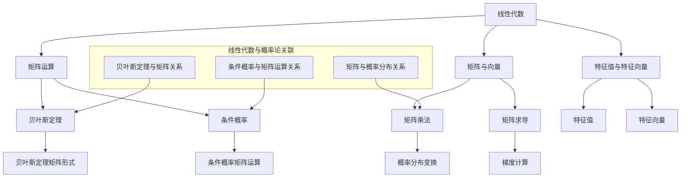

                 

### 背景介绍 Background Introduction

深度学习作为一种人工智能的重要分支，已经在图像识别、自然语言处理、推荐系统等领域取得了显著成就。然而，深度学习的成功并非仅仅依赖于先进的算法和庞大的数据集，其背后同样依赖于坚实的数学基础。在深度学习的研究和实践中，线性代数和概率论是两大核心数学工具，它们为深度学习提供了理论支撑和操作手段。

#### 线性代数 Linear Algebra

线性代数是研究向量空间、线性映射以及它们之间关系的数学分支。在深度学习中，线性代数的主要应用体现在以下几个方面：

1. **矩阵与向量运算**：神经网络中的权重和激活函数通常表示为矩阵和向量，矩阵的乘法和向量内积是计算神经网络输出的基础。
2. **梯度下降**：在训练神经网络时，梯度下降算法依赖于矩阵的求导法则，通过计算权重矩阵的梯度来更新网络参数。
3. **正则化**：如L2正则化，通过矩阵的运算来实现对网络权重的限制，防止过拟合。

#### 概率论 Probability Theory

概率论是研究随机事件及其概率的数学分支。在深度学习中，概率论的应用主要体现在以下几个方面：

1. **概率分布**：神经网络中的输出通常具有概率分布特征，如softmax函数就是一种概率分布函数，它用于多分类问题。
2. **损失函数**：深度学习中的损失函数通常是基于概率论构建的，例如交叉熵损失函数，用于衡量预测概率分布与真实分布之间的差异。
3. **贝叶斯推理**：贝叶斯网络是一种概率图模型，它可以在不确定性中推理出变量之间的关系，用于复杂的不确定性问题。

#### 线性代数与概率论的关联

线性代数和概率论并不是孤立的，它们在深度学习中相辅相成：

- **矩阵的线性变换**可以被视为概率分布的变换，例如在神经网络中，输入向量的线性变换可以视为概率分布的线性变换。
- **概率论中的条件概率**可以用线性代数中的矩阵乘法来表示，如贝叶斯定理可以转化为矩阵形式。

因此，掌握线性代数和概率论是深入理解深度学习的关键。本文将逐步探讨这两个数学工具在深度学习中的应用，帮助读者建立完整的数学基础，以便更好地理解和实践深度学习技术。

### 核心概念与联系 Core Concepts and Relationships

为了更好地理解线性代数和概率论在深度学习中的应用，我们需要先明确这两个数学领域中的核心概念，并探讨它们之间的联系。以下是本文将要详细探讨的核心概念和它们之间的相互关系。

#### 线性代数核心概念 Linear Algebra Core Concepts

1. **矩阵与向量 Matrix and Vector**：
   - 矩阵（Matrix）：一个由数字构成的矩形数组，是线性代数中的基础数据结构。在深度学习中，矩阵常用于表示模型的权重、特征和输入输出数据。
   - 向量（Vector）：一个由数字组成的序列，可以看作是一维的矩阵。在深度学习中，向量常用于表示神经网络的激活值和梯度。

2. **矩阵运算 Matrix Operations**：
   - 矩阵乘法（Matrix Multiplication）：两个矩阵相乘的结果是一个新矩阵，其元素是原矩阵对应元素乘积的和。
   - 矩阵求导（Matrix Differentiation）：在深度学习中的梯度计算中，矩阵求导法则尤为重要，如矩阵的迹（Trace）和行列式（Determinant）等。

3. **特征值与特征向量 Eigenvalue and Eigenvector**：
   - 特征值（Eigenvalue）：一个线性变换矩阵对应的一个标量，该标量乘以一个特征向量后的结果仍为该矩阵的向量。
   - 特征向量（Eigenvector）：与特征值对应的一个向量，在矩阵乘法下保持方向不变。

#### 概率论核心概念 Probability Theory Core Concepts

1. **概率分布 Probability Distribution**：
   - 概率分布（Probability Distribution）：描述随机变量取值概率的函数。在深度学习中，常用的概率分布包括正态分布、伯努利分布和多项式分布等。

2. **条件概率 Conditional Probability**：
   - 条件概率（Conditional Probability）：在给定一个随机事件已经发生的条件下，另一个随机事件发生的概率。

3. **贝叶斯定理 Bayes' Theorem**：
   - 贝叶斯定理（Bayes' Theorem）：用于计算后验概率，即在已知某事件发生的条件下，另一个事件发生的概率。

#### 线性代数与概率论的关联 Connections between Linear Algebra and Probability Theory

1. **矩阵与概率分布的关系**：
   - 矩阵的线性变换可以看作是概率分布的变换。例如，一个概率分布的线性变换仍然是概率分布。
   - 矩阵的乘法可以用来计算多个概率分布的联合分布。

2. **条件概率与矩阵运算的关系**：
   - 条件概率可以用矩阵乘法表示。例如，给定两个事件A和B，条件概率P(B|A)可以表示为矩阵P(AB)除以P(A)。

3. **贝叶斯定理与矩阵**：
   - 贝叶斯定理可以用矩阵形式表示，如P(A|B) = P(B|A)P(A)/P(B)，其中P(A)、P(B)和P(AB)可以看作是矩阵的元素。

#### Mermaid 流程图

为了更直观地展示线性代数和概率论的核心概念及其相互关系，我们可以使用Mermaid流程图来绘制这些概念和运算之间的关系。



通过上述核心概念的介绍和Mermaid流程图，我们可以清晰地看到线性代数和概率论在深度学习中的关键作用。接下来，我们将进一步探讨这些概念在深度学习中的具体应用。

### 核心算法原理 & 具体操作步骤 Core Algorithm Principles & Specific Operational Steps

在深入理解了线性代数和概率论的核心概念及其相互关系之后，我们将进一步探讨这些数学工具在深度学习中的具体应用，特别是神经网络中的核心算法原理和操作步骤。

#### 神经网络基本结构

神经网络由多个层次（层级）和神经元（节点）组成，每个神经元接收来自前一层神经元的输入，并产生输出。神经网络的层次结构通常包括输入层、隐藏层和输出层。

1. **输入层（Input Layer）**：接收外部输入数据。
2. **隐藏层（Hidden Layers）**：对输入数据进行处理和变换，可以有一个或多个隐藏层。
3. **输出层（Output Layer）**：产生最终输出。

每个神经元都可以看作是一个简单的计算单元，其输出由以下公式计算：

\[ output = \sigma(\sum_{j} w_{ji} * x_{j} + b_{i}) \]

其中：
- \( \sigma \) 是激活函数，常用的激活函数包括 sigmoid、ReLU 和 tanh。
- \( w_{ji} \) 是第 \( j \) 层神经元的输入权重。
- \( x_{j} \) 是第 \( j \) 层神经元的输入值。
- \( b_{i} \) 是第 \( i \) 层神经元的偏置。

#### 前向传播算法 Forward Propagation Algorithm

前向传播算法是神经网络中的基本操作，用于计算输入到每个神经元并产生输出。具体步骤如下：

1. **输入层到隐藏层**：
   - 对于每个隐藏层 \( l \)（从输入层开始），计算每个神经元 \( i \) 的输入值 \( z_{li} \) 和输出值 \( a_{li} \)：
     \[ z_{li} = \sum_{j} w_{ji} * a_{(l-1)i} + b_{i} \]
     \[ a_{li} = \sigma(z_{li}) \]
   - 其中 \( a_{(l-1)i} \) 是前一层神经元的输出值。

2. **隐藏层到输出层**：
   - 对于输出层，同样计算每个神经元 \( i \) 的输入值 \( z_{lo} \) 和输出值 \( a_{lo} \)：
     \[ z_{lo} = \sum_{j} w_{jo} * a_{(l-1)i} + b_{o} \]
     \[ a_{lo} = \sigma(z_{lo}) \]

通过前向传播算法，我们可以从输入层开始，逐步计算每个神经元的输出，最终得到网络的预测结果。

#### 反向传播算法 Backpropagation Algorithm

反向传播算法是深度学习训练过程中最核心的算法，用于计算网络中的误差并更新权重和偏置。具体步骤如下：

1. **计算输出层误差**：
   - 对于输出层，每个神经元 \( i \) 的误差 \( \delta_{lo} \) 可以通过以下公式计算：
     \[ \delta_{lo} = (a_{lo} - y) * \sigma'(z_{lo}) \]
   - 其中 \( y \) 是实际输出值，\( \sigma' \) 是激活函数的导数。

2. **反向传播误差到隐藏层**：
   - 对于隐藏层 \( l \)（从输出层开始），每个神经元 \( i \) 的误差 \( \delta_{li} \) 可以通过以下公式计算：
     \[ \delta_{li} = \sum_{j} w_{jo} * \delta_{(l+1)j} * \sigma'(z_{li}) \]

3. **更新权重和偏置**：
   - 对于每一层 \( l \)，更新权重和偏置：
     \[ w_{ji} := w_{ji} - \alpha * \delta_{li} * a_{(l-1)i} \]
     \[ b_{i} := b_{i} - \alpha * \delta_{li} \]
   - 其中 \( \alpha \) 是学习率。

通过反向传播算法，我们可以不断更新网络中的权重和偏置，从而最小化网络的预测误差，实现模型的训练。

#### 算法总结

通过上述操作步骤，我们可以看到神经网络中的前向传播和反向传播算法是如何通过线性代数和概率论的原理来实现的。以下是整个算法的总结：

1. **前向传播**：从输入层开始，逐步计算每个神经元的输入和输出，直到输出层得到最终预测结果。
2. **反向传播**：从输出层开始，反向计算每个神经元的误差，并更新权重和偏置，以最小化预测误差。

掌握这些核心算法原理和操作步骤，不仅有助于我们理解深度学习的工作机制，也为我们在实际应用中设计和优化神经网络提供了理论基础。

### 数学模型和公式 Mathematical Models and Formulas

在深度学习中，线性代数和概率论的应用不仅体现在算法的操作步骤上，还贯穿于数学模型和公式的构建过程中。这些数学模型和公式为我们理解和实现深度学习算法提供了坚实的理论依据。以下是深度学习中的几个关键数学模型和公式的详细讲解。

#### 1. 矩阵与向量运算 Matrix and Vector Operations

在深度学习中，矩阵与向量运算是非常基础的操作，以下介绍几个常见的矩阵和向量运算及其在深度学习中的应用。

1. **矩阵乘法 Matrix Multiplication**：

\[ C = A \cdot B \]

其中，\( C_{ij} = \sum_{k} A_{ik} \cdot B_{kj} \)

矩阵乘法在深度学习中的主要应用是计算权重矩阵和特征矩阵的乘积，从而得到神经网络的输出。

2. **向量内积 Vector Inner Product**：

\[ \vec{u} \cdot \vec{v} = \sum_{i} u_i \cdot v_i \]

向量内积在深度学习中的应用主要体现在计算神经元的输入值，即每个神经元接收到的来自前一层的输入。

3. **矩阵求导 Matrix Differentiation**：

在深度学习中的梯度下降算法需要计算矩阵的导数，以下是一个矩阵的迹（Trace）和行列式（Determinant）的求导公式：

- **矩阵的迹（Trace）**：

\[ \frac{d\text{Tr}(A)}{dA} = I \]

- **矩阵的行列式（Determinant）**：

\[ \frac{d\det(A)}{dA} = A \]

#### 2. 概率分布 Probability Distribution

概率分布是描述随机变量取值概率的函数，在深度学习中有广泛的应用，以下介绍几种常见的概率分布及其公式。

1. **正态分布 Normal Distribution**：

\[ f(x|\mu,\sigma^2) = \frac{1}{\sqrt{2\pi\sigma^2}} e^{-\frac{(x-\mu)^2}{2\sigma^2}} \]

正态分布用于描述连续随机变量的概率分布，在深度学习中，它可以用于生成噪声数据或者对数据分布进行建模。

2. **伯努利分布 Bernoulli Distribution**：

\[ f(x|\theta) = \begin{cases} 
\theta & \text{if } x=1 \\
1-\theta & \text{if } x=0 
\end{cases} \]

伯努利分布用于描述二项试验的成功概率，在深度学习中的二分类问题中经常使用。

3. **多项式分布 Multinomial Distribution**：

\[ f(\vec{x}|\vec{\theta}) = \prod_{i} \theta_i^{x_i} e^{-\theta_i} \]

多项式分布用于描述多个离散随机变量的联合分布，在深度学习中的多分类问题中，尤其是使用softmax函数时，多项式分布是一个重要的概率分布。

#### 3. 条件概率 Conditional Probability

条件概率是概率论中的一个重要概念，描述在给定一个事件发生的条件下，另一个事件发生的概率。以下是一个条件概率的公式及其在深度学习中的应用。

\[ P(A|B) = \frac{P(A \cap B)}{P(B)} \]

在深度学习中的损失函数，如交叉熵损失函数，通常需要计算条件概率的值，以衡量预测的概率分布与真实分布之间的差异。

#### 4. 贝叶斯定理 Bayes' Theorem

贝叶斯定理是概率论中的一个基本定理，它提供了计算后验概率的方法。以下是一个贝叶斯定理的公式及其在深度学习中的应用。

\[ P(A|B) = \frac{P(B|A)P(A)}{P(B)} \]

在深度学习中的贝叶斯网络（Bayesian Network），可以使用贝叶斯定理来计算变量之间的条件概率，用于处理不确定性问题。

#### 5. 线性回归 Linear Regression

线性回归是一种基本的统计模型，用于研究两个变量之间的线性关系。以下是一个线性回归的公式及其在深度学习中的应用。

\[ y = \beta_0 + \beta_1x + \epsilon \]

在深度学习中的多层感知机（MLP）可以看作是线性回归的扩展，通过引入非线性激活函数，可以学习更复杂的函数关系。

#### 6. 神经网络损失函数 Neural Network Loss Function

损失函数是深度学习模型训练过程中的核心，用于衡量模型的预测值与真实值之间的差异。以下是一些常见的神经网络损失函数及其公式。

1. **均方误差 Mean Squared Error (MSE)**：

\[ \text{MSE} = \frac{1}{m} \sum_{i=1}^{m} (y_i - \hat{y}_i)^2 \]

2. **交叉熵 Cross-Entropy**：

\[ \text{CE} = -\frac{1}{m} \sum_{i=1}^{m} y_i \log(\hat{y}_i) \]

其中，\( y_i \) 是真实标签，\( \hat{y}_i \) 是模型的预测值。

这些数学模型和公式是深度学习的基础，通过理解这些概念和公式，我们可以更深入地理解深度学习算法的原理和实现。

### 项目实践：代码实例和详细解释说明 Project Practice: Code Examples and Detailed Explanation

为了更好地理解和掌握深度学习中的数学基础，我们将通过一个简单的项目实例来实践代码的编写、运行和解释。在这个项目中，我们将使用Python编写一个简单的神经网络，实现从输入到输出的过程，并使用均方误差（MSE）作为损失函数。

#### 开发环境搭建 Setup Development Environment

在开始编写代码之前，我们需要搭建一个Python开发环境，其中包括必要的库和工具。以下是我们在Windows系统上搭建开发环境的步骤：

1. **安装Python**：从Python官方网站下载最新版本的Python（3.8及以上版本），并按照提示完成安装。
2. **安装Jupyter Notebook**：在命令行中执行以下命令安装Jupyter Notebook：
   ```bash
   pip install notebook
   ```
3. **安装必要的库**：为了方便数据处理和模型训练，我们需要安装NumPy、PyTorch和Matplotlib等库。在命令行中执行以下命令：
   ```bash
   pip install numpy torch matplotlib
   ```

#### 源代码详细实现 Detailed Code Implementation

以下是一个简单的神经网络代码实例，包括模型的定义、前向传播和反向传播的过程。

```python
import torch
import torch.nn as nn
import numpy as np
import matplotlib.pyplot as plt

# 定义神经网络模型
class SimpleNN(nn.Module):
    def __init__(self, input_size, hidden_size, output_size):
        super(SimpleNN, self).__init__()
        self.fc1 = nn.Linear(input_size, hidden_size)
        self.fc2 = nn.Linear(hidden_size, output_size)
    
    def forward(self, x):
        x = torch.relu(self.fc1(x))
        x = self.fc2(x)
        return x

# 模型初始化
input_size = 1
hidden_size = 10
output_size = 1
model = SimpleNN(input_size, hidden_size, output_size)

# 损失函数和优化器
criterion = nn.MSELoss()
optimizer = torch.optim.Adam(model.parameters(), lr=0.001)

# 生成数据集
x = torch.linspace(-10, 10, 1000)
y = x**2
x = x.unsqueeze(-1)

# 训练模型
num_epochs = 1000
for epoch in range(num_epochs):
    outputs = model(x)
    loss = criterion(outputs, y)
    
    optimizer.zero_grad()
    loss.backward()
    optimizer.step()
    
    if epoch % 100 == 0:
        print(f'Epoch [{epoch+1}/{num_epochs}], Loss: {loss.item():.4f}')

# 测试模型
test_x = torch.linspace(-10, 10, 100)
test_x = test_x.unsqueeze(-1)
test_outputs = model(test_x)

# 绘制结果
plt.plot(test_x, test_outputs, label='Predicted')
plt.plot(test_x, test_x**2, label='Actual')
plt.legend()
plt.show()
```

#### 代码解读与分析 Code Explanation and Analysis

下面是对代码的逐行解释和分析：

1. **模型定义**：
   ```python
   class SimpleNN(nn.Module):
       def __init__(self, input_size, hidden_size, output_size):
           super(SimpleNN, self).__init__()
           self.fc1 = nn.Linear(input_size, hidden_size)
           self.fc2 = nn.Linear(hidden_size, output_size)
   ```
   这段代码定义了一个简单的神经网络模型，包括一个输入层、一个隐藏层和一个输出层。每个层使用一个线性变换器（Linear layer）和一个ReLU激活函数。

2. **前向传播**：
   ```python
   def forward(self, x):
       x = torch.relu(self.fc1(x))
       x = self.fc2(x)
       return x
   ```
   `forward`方法实现前向传播过程，输入数据首先通过第一个线性层，然后通过ReLU激活函数，再通过第二个线性层，得到最终的预测输出。

3. **损失函数和优化器**：
   ```python
   criterion = nn.MSELoss()
   optimizer = torch.optim.Adam(model.parameters(), lr=0.001)
   ```
   使用均方误差（MSE）作为损失函数，并使用Adam优化器来更新模型参数，学习率为0.001。

4. **数据集生成**：
   ```python
   x = torch.linspace(-10, 10, 1000)
   y = x**2
   x = x.unsqueeze(-1)
   ```
   生成一个包含从-10到10的1000个数据点的输入数组，以及对应的输出数组（平方值）。

5. **模型训练**：
   ```python
   for epoch in range(num_epochs):
       outputs = model(x)
       loss = criterion(outputs, y)
       
       optimizer.zero_grad()
       loss.backward()
       optimizer.step()
       
       if epoch % 100 == 0:
           print(f'Epoch [{epoch+1}/{num_epochs}], Loss: {loss.item():.4f}')
   ```
   在每个训练周期中，计算模型输出和真实值之间的损失，并通过反向传播更新模型参数。每100个周期打印一次训练损失。

6. **模型测试和结果展示**：
   ```python
   test_x = torch.linspace(-10, 10, 100)
   test_x = test_x.unsqueeze(-1)
   test_outputs = model(test_x)
   
   plt.plot(test_x, test_outputs, label='Predicted')
   plt.plot(test_x, test_x**2, label='Actual')
   plt.legend()
   plt.show()
   ```
   在测试数据集上评估模型性能，并绘制预测结果与实际值之间的对比图。

通过这个简单的项目实例，我们可以看到如何将线性代数和概率论的概念应用到深度学习模型中，实现从输入到输出的过程，并通过模型训练和测试来评估模型的性能。

### 实际应用场景 Real-world Applications

线性代数和概率论在深度学习中的重要性不仅体现在理论层面，更体现在其实际应用中。以下我们将探讨线性代数和概率论在深度学习的几个主要应用领域，并分析这些应用场景中的挑战和解决方法。

#### 图像识别 Image Recognition

图像识别是深度学习最成功的应用之一，线性代数和概率论在其中发挥了重要作用：

1. **卷积神经网络 Convolutional Neural Networks (CNNs)**：CNNs广泛用于图像识别任务，其核心在于卷积运算和池化操作，这些都依赖于线性代数的基本原理。例如，卷积运算本质上是一个矩阵与向量的乘法，而池化操作则通过线性变换来提取图像的特征。

   **挑战**：大规模图像数据集的处理和模型的优化。

   **解决方法**：使用更高效的卷积算法（如深度可分离卷积）和分布式计算框架（如TensorFlow和PyTorch）来加速训练和推理。

2. **特征提取 Feature Extraction**：在图像识别中，特征提取是关键步骤。通过线性代数的奇异值分解（SVD）等方法，可以有效提取图像的底层特征，从而提高模型的识别准确率。

   **挑战**：如何从海量图像数据中提取最有用的特征，以避免过拟合。

   **解决方法**：使用数据增强（Data Augmentation）和正则化技术（如L1和L2正则化）来增加模型对数据的泛化能力。

#### 自然语言处理 Natural Language Processing (NLP)

自然语言处理是深度学习的另一个重要应用领域，线性代数和概率论在其中扮演着关键角色：

1. **词嵌入 Word Embeddings**：词嵌入是将词汇映射到高维向量空间的过程，其核心是利用线性代数的矩阵运算。例如，Word2Vec算法通过矩阵乘法和梯度下降来训练词向量。

   **挑战**：如何在保持语义信息的同时，有效减少维度。

   **解决方法**：使用高效的线性代数算法（如奇异值分解SVD）和优化方法（如梯度下降和随机梯度下降SGD）。

2. **序列模型 Sequence Models**：如循环神经网络（RNNs）和长短期记忆网络（LSTMs），它们依赖于线性代数的矩阵运算来处理序列数据。RNNs通过矩阵乘法来传递序列信息，而LSTMs则通过门控机制来控制信息的流动。

   **挑战**：如何处理长序列数据中的长时依赖问题。

   **解决方法**：使用门控机制和注意力机制来增强模型的时序建模能力。

#### 推荐系统 Recommender Systems

推荐系统通过预测用户对物品的兴趣来提供个性化推荐，线性代数和概率论在其中起着关键作用：

1. **矩阵分解 Matrix Factorization**：矩阵分解是一种常用的推荐系统算法，通过线性代数的矩阵分解技术，将用户-物品评分矩阵分解为两个低维矩阵，从而预测未评分的项。

   **挑战**：如何在处理稀疏数据集时提高预测精度。

   **解决方法**：使用交替最小二乘法（ALS）和优化算法（如梯度下降和协同过滤）。

2. **概率图模型 Probabilistic Graphical Models**：如贝叶斯网络和马尔可夫网络，用于建模用户行为和物品属性之间的依赖关系。这些模型依赖于概率论的基本原理，如条件概率和贝叶斯定理。

   **挑战**：如何处理复杂的用户行为和物品属性。

   **解决方法**：使用图模型和深度学习相结合的方法，如深度贝叶斯网络（Deep Bayesian Network）。

通过以上实际应用场景的分析，我们可以看到线性代数和概率论在深度学习中的广泛应用和重要性。在面对不同的应用挑战时，我们需要灵活运用这些数学工具，结合具体问题提出有效的解决方案。

### 工具和资源推荐 Tools and Resources Recommendation

为了帮助读者更深入地学习和掌握深度学习中的线性代数和概率论，以下推荐一些优秀的书籍、论文、博客和网站资源。

#### 书籍 Book Recommendations

1. **《深度学习》（Deep Learning）**：由Ian Goodfellow、Yoshua Bengio和Aaron Courville合著，这是深度学习领域最权威的教材之一，详细介绍了深度学习的基础知识和最新进展。书中涵盖了线性代数、概率论和数值优化等关键数学概念。

2. **《线性代数及其应用》（Linear Algebra and Its Applications）**：由Gilbert Strang著，这是一本经典的线性代数教材，通过大量实例和习题，帮助读者掌握线性代数的基本概念和应用。

3. **《概率论及其应用》（Probability and Its Applications）**：由Patrick Billingsley著，这是一本全面的概率论教材，详细介绍了概率论的基本原理、随机过程和贝叶斯理论等内容。

#### 论文 Paper Recommendations

1. **《深度学习中的概率理论》（Probability Theory for Deep Learning）**：这篇论文由Yarin Gal和Zoubin Ghahramani撰写，系统地介绍了深度学习中的概率理论，包括概率分布、损失函数和优化算法等内容。

2. **《深度神经网络中的线性代数》（Linear Algebra for Deep Learning）**：这篇论文由Amir Hagigh、Alex Kendall和Rob Collobert撰写，详细探讨了深度神经网络中的线性代数应用，包括矩阵运算、特征提取和优化等。

#### 博客 Blog Recommendations

1. **Fast.ai**：这是一个深度学习领域的博客，由Yoshua Bengio、Ian Goodfellow和Aaron Courville等人创办。博客中包含了大量关于深度学习理论和实践的教程和文章，非常适合初学者和进阶者。

2. **Distill**：这是一个专注于深度学习和机器学习的博客，内容涵盖技术讲解、代码实现和最新研究进展。博客采用了高质量的内容呈现方式，非常适合深入理解复杂的概念。

#### 网站 Website Recommendations

1. **TensorFlow**：这是一个由Google开发的开源深度学习框架，提供了丰富的文档和教程，适合初学者和专业人士。TensorFlow官网提供了详细的API文档和代码示例，帮助用户快速上手深度学习。

2. **PyTorch**：这是一个由Facebook开发的开源深度学习框架，以其灵活的动态计算图和简洁的API而受到广泛欢迎。PyTorch官网提供了丰富的教程和示例，包括从基础到高级的深度学习应用。

通过这些书籍、论文、博客和网站资源的推荐，读者可以系统地学习和掌握深度学习中的线性代数和概率论，为深入研究和应用打下坚实的基础。

### 总结 Conclusion

本文系统地介绍了线性代数和概率论在深度学习中的核心作用，从核心概念、算法原理到实际应用场景，深入剖析了这两个数学工具在深度学习研究中的重要性。通过逐步分析推理的方式，我们明确了线性代数在矩阵与向量运算、梯度计算等方面的应用，以及概率论在概率分布、条件概率和贝叶斯定理等概念上的贡献。

随着深度学习的不断发展，线性代数和概率论的应用越来越广泛。在未来，这些数学工具将继续在深度学习算法的优化、模型的泛化能力和新算法的创新中发挥关键作用。例如，通过更高效的线性代数算法，如量子计算中的矩阵分解，可以实现更快速的模型训练；通过结合概率图模型，可以构建更复杂的深度学习模型，解决更加复杂的问题。

面对未来的挑战，我们需要不断提升对线性代数和概率论的理解和应用能力，不断探索新的算法和技术，以推动深度学习的发展。同时，也呼吁更多的科研人员和工程师关注并深入这些数学工具的研究，共同推动人工智能领域的进步。

### 附录：常见问题与解答 Appendix: Frequently Asked Questions and Answers

#### Q1: 线性代数在深度学习中的具体应用是什么？

线性代数在深度学习中的应用主要包括矩阵与向量运算、梯度计算、特征值与特征向量分析等。这些运算和概念用于表示和计算神经网络中的权重、激活函数、梯度等，是深度学习算法实现的基础。

#### Q2: 概率论在深度学习中的核心作用是什么？

概率论在深度学习中的核心作用体现在概率分布、条件概率和贝叶斯定理等方面。它们用于构建损失函数、优化算法，以及处理神经网络中的不确定性和复杂性。

#### Q3: 如何掌握线性代数和概率论在深度学习中的应用？

要掌握线性代数和概率论在深度学习中的应用，首先需要系统地学习这两门数学课程，理解核心概念和基本原理。然后，通过实际项目实践，结合深度学习的算法和框架，如TensorFlow和PyTorch，将理论知识应用到实际模型中。

#### Q4: 线性代数和概率论中的哪些概念在实际应用中最为重要？

在实际应用中，线性代数中的矩阵与向量运算、梯度计算、特征值与特征向量等概念，以及概率论中的概率分布、条件概率和贝叶斯定理等概念，都是最为重要的。这些概念贯穿于深度学习的各个环节，是理解和实现深度学习算法的关键。

#### Q5: 学习线性代数和概率论的最佳途径是什么？

学习线性代数和概率论的最佳途径是结合理论学习和实际应用。首先，通过教材和在线课程系统地学习核心概念和原理。然后，通过参与实际项目，将所学知识应用到具体问题中，逐步提升自己的应用能力和解决复杂问题的能力。

### 扩展阅读 & 参考资料 Further Reading and References

1. **书籍**：
   - Ian Goodfellow, Yoshua Bengio, Aaron Courville. 《深度学习》（Deep Learning）.
   - Gilbert Strang. 《线性代数及其应用》（Linear Algebra and Its Applications）.
   - Patrick Billingsley. 《概率论及其应用》（Probability and Its Applications）.

2. **论文**：
   - Yarin Gal, Zoubin Ghahramani. 《深度学习中的概率理论》（Probability Theory for Deep Learning）.
   - Amir Hagigh, Alex Kendall, Rob Collobert. 《深度神经网络中的线性代数》（Linear Algebra for Deep Learning）.

3. **博客**：
   - Fast.ai: https://fast.ai/
   - Distill: https://distill.pub/

4. **网站**：
   - TensorFlow: https://www.tensorflow.org/
   - PyTorch: https://pytorch.org/

通过这些书籍、论文、博客和网站资源，读者可以进一步深入学习和探索线性代数和概率论在深度学习中的应用，提升自己的理论水平和实践能力。

