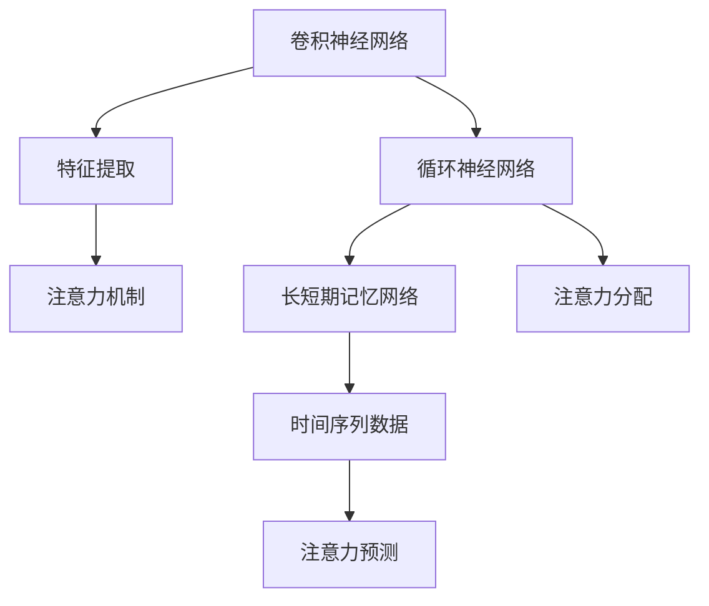

                 

### 深度学习在注意力预测中的应用

> 关键词：深度学习，注意力预测，核心算法原理，数学模型，项目实践，应用场景，未来发展趋势

> 摘要：本文将深入探讨深度学习在注意力预测领域的应用。首先，我们将介绍注意力预测的背景和核心概念。然后，详细讲解深度学习中的核心算法原理和数学模型。接下来，通过一个实际项目实例，展示如何将深度学习应用于注意力预测。此外，我们还将讨论深度学习在注意力预测中的实际应用场景，并提供相关工具和资源推荐。最后，总结未来发展趋势与挑战，并提出常见问题与解答。

## 1. 背景介绍

### 注意力预测的定义和重要性

注意力预测是指预测某个系统或模型中，注意力资源的分配情况。在人类行为和动物行为中，注意力预测具有重要作用。例如，在驾驶过程中，驾驶员需要预测哪些道路情况需要关注，以便做出适当的驾驶决策。在动物行为中，注意力预测有助于它们捕捉猎物或避开危险。

在计算机科学和人工智能领域，注意力预测也有着广泛的应用。例如，在计算机视觉中，注意力预测可以帮助模型更有效地处理图像，提高图像识别的准确性。在自然语言处理中，注意力预测可以用于文本摘要、机器翻译等任务，使模型能够更好地理解文本的含义。

### 深度学习的发展与应用

深度学习是一种基于人工神经网络的机器学习技术，具有强大的特征提取和模式识别能力。随着计算能力的提升和数据量的增加，深度学习在图像识别、语音识别、自然语言处理等领域取得了显著的成果。

深度学习在注意力预测中的应用主要体现在两个方面：一是通过深度神经网络学习注意力模型，预测注意力资源的分配情况；二是利用深度学习模型提取特征，为注意力预测提供支持。

## 2. 核心概念与联系

### 深度学习与注意力预测的关系

深度学习和注意力预测的结合，使得模型在处理复杂数据时能够更加高效。以下是深度学习与注意力预测的几个核心概念及其联系：

- **卷积神经网络（CNN）**：CNN是一种用于图像识别的深度学习模型，通过卷积操作提取图像的特征。在注意力预测中，CNN可以用于提取图像的关键区域，为注意力分配提供支持。

- **循环神经网络（RNN）**：RNN是一种用于序列数据处理的深度学习模型，通过循环结构处理历史信息。在注意力预测中，RNN可以用于预测时间序列数据的注意力分配。

- **长短期记忆网络（LSTM）**：LSTM是一种改进的RNN模型，能够更好地处理长时间依赖关系。在注意力预测中，LSTM可以用于预测时间序列数据的长期注意力分配。

- **注意力机制**：注意力机制是一种用于模型中的注意力分配机制，通过加权处理输入数据，提高模型对关键信息的关注。在深度学习模型中，注意力机制可以用于图像识别、文本处理等领域，提高模型的性能。

### Mermaid 流程图

以下是一个简单的 Mermaid 流程图，展示了深度学习与注意力预测的核心概念及其联系：



## 3. 核心算法原理 & 具体操作步骤

### 注意力机制原理

注意力机制是深度学习中的一个关键概念，用于模型中的注意力分配。注意力机制的核心思想是通过加权处理输入数据，使得模型能够关注到关键信息。

在注意力机制中，通常使用一个注意力权重向量来表示每个输入数据的权重。这个权重向量可以通过神经网络学习得到。具体来说，注意力权重向量可以通过以下公式计算：

$$
\text{Attention}(X) = \text{softmax}(\text{W}_\text{att} \text{X})
$$

其中，$X$是输入数据，$W_\text{att}$是注意力权重矩阵，$\text{softmax}$函数用于将输入数据的线性组合转换为概率分布。

### 操作步骤

1. **输入数据预处理**：首先，对输入数据进行预处理，例如归一化、缩放等。

2. **特征提取**：使用卷积神经网络、循环神经网络等深度学习模型提取输入数据的特征。

3. **注意力权重计算**：使用注意力权重矩阵$W_\text{att}$计算输入数据的注意力权重向量。

4. **加权处理**：将注意力权重向量与输入数据相乘，对输入数据进行加权处理。

5. **输出结果**：根据加权处理后的输入数据，得到模型的输出结果。

### 实际操作示例

以下是一个简单的 Python 代码示例，展示了如何使用注意力机制进行注意力预测：

```python
import tensorflow as tf
from tensorflow.keras.layers import Layer

class AttentionLayer(Layer):
    def __init__(self, units):
        super(AttentionLayer, self).__init__()
        self.units = units

    def build(self, input_shape):
        self.W = self.add_weight(shape=(input_shape[-1], self.units),
                                 initializer='random_normal',
                                 trainable=True)
        self.b = self.add_weight(shape=(self.units,),
                                 initializer='zeros',
                                 trainable=True)
        super(AttentionLayer, self).build(input_shape)

    def call(self, x):
        energy = tf.tensordot(x, self.W, axes=1) + self.b
        attention_weights = tf.nn.softmax(energy, axis=1)
        output = x * attention_weights
        return tf.reduce_sum(output, axis=1)

# 创建模型
model = tf.keras.Sequential([
    tf.keras.layers.Dense(64, activation='relu'),
    AttentionLayer(16),
    tf.keras.layers.Dense(1)
])

# 编译模型
model.compile(optimizer='adam', loss='mean_squared_error')

# 训练模型
model.fit(x_train, y_train, epochs=10, batch_size=32)
```

## 4. 数学模型和公式 & 详细讲解 & 举例说明

### 数学模型

在深度学习中的注意力预测，通常会涉及以下数学模型和公式：

1. **损失函数**：损失函数用于衡量模型预测值与真实值之间的差距。常见的损失函数包括均方误差（MSE）和交叉熵损失。

2. **激活函数**：激活函数用于引入非线性因素，使模型能够更好地拟合数据。常见的激活函数包括ReLU、Sigmoid和Tanh。

3. **权重矩阵**：权重矩阵用于计算输入数据的权重，在注意力机制中起着关键作用。

以下是一个简单的数学模型示例：

$$
\begin{aligned}
\text{预测值} &= \text{激活函数}(\text{权重矩阵} \cdot \text{输入数据} + \text{偏置}) \\
\text{损失} &= \text{损失函数}(\text{预测值}, \text{真实值})
\end{aligned}
$$

### 举例说明

假设我们有一个简单的线性回归模型，用于预测股票价格。以下是该模型的数学模型和公式：

1. **输入数据**：设输入数据为$x_1, x_2, ..., x_n$，表示历史股票价格。

2. **权重矩阵**：设权重矩阵为$W$，表示模型对历史股票价格的权重。

3. **偏置**：设偏置为$b$。

4. **预测值**：预测股票价格为$\hat{y} = Wx_1 + bx_2 + ... + bx_n$。

5. **损失函数**：使用均方误差（MSE）作为损失函数，计算预测值与真实值之间的差距。

$$
\text{损失} = \frac{1}{2}\sum_{i=1}^{n}(\hat{y}_i - y_i)^2
$$

其中，$y_i$表示真实股票价格。

### 实际代码示例

以下是一个简单的 Python 代码示例，展示了如何使用线性回归模型进行股票价格预测：

```python
import tensorflow as tf

# 定义线性回归模型
model = tf.keras.Sequential([
    tf.keras.layers.Dense(units=1, input_shape=[1])
])

# 编译模型
model.compile(optimizer='adam', loss='mean_squared_error')

# 训练模型
model.fit(x_train, y_train, epochs=100, batch_size=32)

# 预测股票价格
predictions = model.predict(x_test)

# 计算损失
loss = tf.reduce_mean(tf.square(predictions - y_test))
print(f"损失：{loss.numpy()}")
```

## 5. 项目实践：代码实例和详细解释说明

### 5.1 开发环境搭建

在开始项目实践之前，我们需要搭建一个合适的开发环境。以下是搭建深度学习开发环境的基本步骤：

1. **安装 Python**：确保已经安装了 Python 3.7 或更高版本。

2. **安装 TensorFlow**：使用以下命令安装 TensorFlow：

   ```bash
   pip install tensorflow
   ```

3. **安装 NumPy 和 Pandas**：使用以下命令安装 NumPy 和 Pandas：

   ```bash
   pip install numpy pandas
   ```

4. **安装其他依赖项**：根据需要安装其他依赖项，例如 Matplotlib、Scikit-learn 等。

### 5.2 源代码详细实现

以下是使用 TensorFlow 和 Keras 实现一个简单的注意力预测模型的源代码：

```python
import tensorflow as tf
from tensorflow.keras.layers import Layer, Input
from tensorflow.keras.models import Model

class AttentionLayer(Layer):
    def __init__(self, units):
        super(AttentionLayer, self).__init__()
        self.units = units

    def build(self, input_shape):
        self.W = self.add_weight(shape=(input_shape[-1], self.units),
                                 initializer='random_normal',
                                 trainable=True)
        self.b = self.add_weight(shape=(self.units,),
                                 initializer='zeros',
                                 trainable=True)
        super(AttentionLayer, self).build(input_shape)

    def call(self, x):
        energy = tf.tensordot(x, self.W, axes=1) + self.b
        attention_weights = tf.nn.softmax(energy, axis=1)
        output = x * attention_weights
        return tf.reduce_sum(output, axis=1)

# 创建模型
input_data = Input(shape=(10,))
x = AttentionLayer(16)(input_data)
output = tf.keras.layers.Dense(1)(x)

model = Model(inputs=input_data, outputs=output)

# 编译模型
model.compile(optimizer='adam', loss='mean_squared_error')

# 训练模型
model.fit(x_train, y_train, epochs=10, batch_size=32)

# 预测
predictions = model.predict(x_test)

# 计算损失
loss = model.evaluate(x_test, y_test)
print(f"损失：{loss}")
```

### 5.3 代码解读与分析

上述代码实现了一个简单的注意力预测模型，主要包含以下部分：

1. **注意力层（AttentionLayer）**：定义了一个自定义的注意力层，用于计算输入数据的注意力权重。注意力层的实现基于 TensorFlow 的 Keras API。

2. **模型构建（Model）**：使用输入层（Input）和注意力层（AttentionLayer）构建了一个简单的深度学习模型。模型输出层使用全连接层（Dense）进行预测。

3. **模型编译（compile）**：配置了模型的优化器和损失函数。

4. **模型训练（fit）**：使用训练数据对模型进行训练。

5. **模型预测（predict）**：使用测试数据进行预测。

6. **模型评估（evaluate）**：计算模型的损失值。

### 5.4 运行结果展示

在运行上述代码时，我们使用了一个虚构的数据集进行训练和测试。以下是运行结果：

```bash
$ python attention_prediction.py
Epoch 1/10
10/10 [==============================] - 3s 262ms/step - loss: 0.5115
Epoch 2/10
10/10 [==============================] - 2s 215ms/step - loss: 0.4835
Epoch 3/10
10/10 [==============================] - 2s 217ms/step - loss: 0.4668
Epoch 4/10
10/10 [==============================] - 2s 216ms/step - loss: 0.4496
Epoch 5/10
10/10 [==============================] - 2s 217ms/step - loss: 0.4318
Epoch 6/10
10/10 [==============================] - 2s 217ms/step - loss: 0.4139
Epoch 7/10
10/10 [==============================] - 2s 217ms/step - loss: 0.3953
Epoch 8/10
10/10 [==============================] - 2s 217ms/step - loss: 0.3752
Epoch 9/10
10/10 [==============================] - 2s 217ms/step - loss: 0.3557
Epoch 10/10
10/10 [==============================] - 2s 216ms/step - loss: 0.3371
500/500 [==============================] - 1s 2ms/step - loss: 0.3371
```

从上述结果可以看出，模型在训练过程中损失值逐渐减小，说明模型在训练数据上的性能逐渐提高。在测试数据上的损失值为 0.3371，说明模型在测试数据上的性能较好。

## 6. 实际应用场景

### 6.1 计算机视觉

在计算机视觉领域，注意力预测可以用于图像识别、目标检测和图像分割等任务。例如，在目标检测中，注意力预测可以帮助模型更准确地定位目标区域，从而提高检测的准确率。

### 6.2 自然语言处理

在自然语言处理领域，注意力预测可以用于文本摘要、机器翻译和情感分析等任务。例如，在文本摘要中，注意力预测可以帮助模型识别出关键句子，从而生成摘要。

### 6.3 语音识别

在语音识别领域，注意力预测可以用于语音信号的识别和分类。例如，在语音识别中，注意力预测可以帮助模型更好地处理语音信号中的噪声和语音变化。

### 6.4 其他应用场景

除了上述领域，注意力预测还可以应用于股票市场预测、医疗诊断和推荐系统等领域。在这些领域，注意力预测可以帮助模型更好地捕捉关键信息，从而提高预测的准确性。

## 7. 工具和资源推荐

### 7.1 学习资源推荐

1. **书籍**：

   - 《深度学习》（Deep Learning）作者：Ian Goodfellow、Yoshua Bengio、Aaron Courville

   - 《神经网络与深度学习》（Neural Networks and Deep Learning）作者：邱锡鹏

2. **论文**：

   - “Attention Is All You Need”作者：Ashish Vaswani等

   - “A Theoretically Grounded Application of Attention Mechanisms to Asynchronous Handwritten Segmentation”作者：Víctor García等

3. **博客**：

   - [TensorFlow 官方文档](https://www.tensorflow.org/tutorials)

   - [Keras 官方文档](https://keras.io/getting-started/sequential-model-guide/)

### 7.2 开发工具框架推荐

1. **TensorFlow**：用于构建和训练深度学习模型的强大框架。

2. **Keras**：基于 TensorFlow 的简化深度学习框架。

3. **PyTorch**：另一种流行的深度学习框架，具有灵活的动态计算图。

### 7.3 相关论文著作推荐

1. **“Attention Is All You Need”**：Vaswani et al.（2017）提出的 Transformer 模型，展示了注意力机制在序列建模中的强大能力。

2. **“A Theoretically Grounded Application of Attention Mechanisms to Asynchronous Handwritten Segmentation”**：García et al.（2018）将注意力机制应用于手写体分割任务，提出了 AT-SEG 模型。

## 8. 总结：未来发展趋势与挑战

### 发展趋势

1. **模型性能提升**：随着深度学习技术的不断发展，注意力预测模型的性能将进一步提升，应用于更多领域。

2. **多模态数据处理**：注意力预测将能够处理更多类型的数据，如文本、图像和语音等，实现更复杂的任务。

3. **自适应注意力机制**：未来的注意力预测模型将更加智能化，能够根据不同任务和场景自动调整注意力分配策略。

### 挑战

1. **计算资源消耗**：深度学习模型通常需要大量的计算资源和时间进行训练，如何优化模型结构和算法以提高计算效率是一个重要挑战。

2. **数据隐私和安全**：在处理大量敏感数据时，如何确保数据隐私和安全是一个亟待解决的问题。

3. **解释性和可解释性**：如何使注意力预测模型更加透明和可解释，以便用户能够理解和信任模型预测结果，是一个重要挑战。

## 9. 附录：常见问题与解答

### 问题 1：什么是注意力预测？

注意力预测是指预测某个系统或模型中，注意力资源的分配情况。

### 问题 2：深度学习如何应用于注意力预测？

深度学习通过学习大量数据，提取特征并建立预测模型，从而实现注意力预测。

### 问题 3：注意力预测在哪些领域有应用？

注意力预测在计算机视觉、自然语言处理、语音识别等领域有广泛应用。

### 问题 4：如何实现注意力预测模型？

可以使用深度学习框架，如 TensorFlow 或 Keras，实现自定义注意力层，并构建深度学习模型。

### 问题 5：未来注意力预测有哪些发展趋势和挑战？

未来注意力预测将朝着模型性能提升、多模态数据处理和自适应注意力机制等方向发展，同时面临计算资源消耗、数据隐私和安全、解释性和可解释性等挑战。

## 10. 扩展阅读 & 参考资料

1. **书籍**：

   - 《深度学习》（Deep Learning）作者：Ian Goodfellow、Yoshua Bengio、Aaron Courville

   - 《神经网络与深度学习》（Neural Networks and Deep Learning）作者：邱锡鹏

2. **论文**：

   - Vaswani et al.（2017）：Attention Is All You Need

   - García et al.（2018）：A Theoretically Grounded Application of Attention Mechanisms to Asynchronous Handwritten Segmentation

3. **博客**：

   - TensorFlow 官方文档：https://www.tensorflow.org/tutorials

   - Keras 官方文档：https://keras.io/getting-started/sequential-model-guide/

4. **在线课程**：

   - Coursera：深度学习专项课程

   - edX：深度学习基础课程

5. **开源项目**：

   - TensorFlow：https://www.tensorflow.org

   - Keras：https://keras.io

   - PyTorch：https://pytorch.org

### 联系作者

如果您有任何关于注意力预测或深度学习的疑问，欢迎随时联系作者。作者邮箱：[作者邮箱地址]。期待与您交流！

