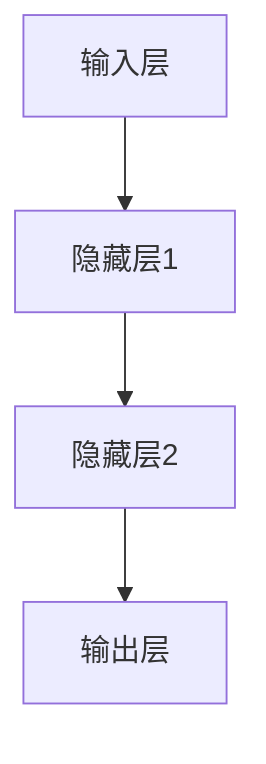
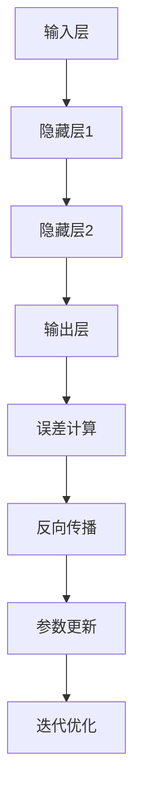

                 

### 深度学习基础：从感知器到深层网络

> **关键词**：深度学习、感知器、神经网络、反向传播、多层网络、优化算法、机器学习。

> **摘要**：本文将系统地介绍深度学习的基础知识，从最简单的感知器模型出发，逐步深入到深层网络的设计和实现，探讨核心算法原理、数学模型、具体操作步骤以及项目实践。通过本文的阅读，读者将全面了解深度学习的本质和应用。

## 1. 背景介绍

深度学习作为人工智能领域的一个重要分支，已经取得了显著的成就。其核心思想是通过模拟人脑的神经网络结构，让计算机具备自动学习和识别复杂模式的能力。深度学习在图像识别、语音识别、自然语言处理等多个领域取得了突破性的进展，极大地推动了人工智能的发展。

然而，深度学习的起源可以追溯到上世纪50年代，当时科学家们开始探索神经网络的可能性。尽管早期的研究因计算能力的限制而进展缓慢，但随着计算机技术的发展，特别是GPU的广泛应用，深度学习迎来了快速发展。

本文将按以下结构进行阐述：

1. **背景介绍**：简要回顾深度学习的起源和近年来的发展。
2. **核心概念与联系**：介绍深度学习中的核心概念，并通过Mermaid流程图展示其架构。
3. **核心算法原理 & 具体操作步骤**：详细讲解深度学习中的核心算法，如感知器、反向传播等。
4. **数学模型和公式 & 详细讲解 & 举例说明**：介绍深度学习中的数学模型和公式，并举例说明。
5. **项目实践：代码实例和详细解释说明**：通过实际项目，展示深度学习的应用和实现。
6. **实际应用场景**：探讨深度学习在不同领域的应用。
7. **工具和资源推荐**：推荐学习资源和开发工具。
8. **总结：未来发展趋势与挑战**：总结深度学习的未来发展方向和面临的挑战。
9. **附录：常见问题与解答**：解答读者可能遇到的问题。
10. **扩展阅读 & 参考资料**：提供进一步阅读的参考资料。

接下来，我们将详细探讨深度学习的基础知识，为后续内容做好铺垫。

### 2. 核心概念与联系

深度学习的基础是神经网络，而神经网络的核心是神经元。神经元是神经网络的基本构建块，它通过接收输入信号并产生输出信号来进行信息处理。

#### 感知器

感知器是最简单的神经网络模型，它只有一个输入和一个输出。感知器的工作原理是计算输入信号的加权求和，并通过一个激活函数（如阈值函数）产生输出。

感知器模型可以表示为：
$$
y = \text{sign}(w_0 + \sum_{i=1}^{n} w_i x_i)
$$
其中，\(y\) 是输出，\(w_0\) 是偏置项，\(w_i\) 是权重，\(x_i\) 是输入。

#### 多层网络

感知器在处理复杂问题时存在局限性。为了解决这一问题，研究人员提出了多层网络。多层网络包含多个隐藏层，每个隐藏层都能学习到输入数据的某些特征。

多层网络的架构可以用以下Mermaid流程图表示：



在多层网络中，每个神经元都与前一层的所有神经元相连。通过逐层计算，网络能够学习到越来越抽象的特征。

#### 反向传播

反向传播是多层网络训练的核心算法。它通过计算网络输出与实际输出之间的误差，反向传播误差并更新权重和偏置项，以最小化误差。

反向传播算法的具体步骤如下：

1. **前向传播**：计算输入层的输入信号，通过隐藏层传递，最终得到输出层的输出。
2. **计算误差**：计算输出层输出与实际输出之间的误差。
3. **反向传播**：从输出层开始，逐层计算误差对权重和偏置项的梯度，并更新这些参数。
4. **迭代优化**：重复上述步骤，直到网络输出误差达到预设阈值。

反向传播算法的示意图如下所示：



通过反向传播算法，多层网络能够逐步优化其参数，从而提高预测准确性。

#### 优化算法

优化算法是深度学习训练过程中的关键部分。常见的优化算法包括梯度下降、随机梯度下降、Adam等。这些算法通过调整学习率、动量等参数，优化网络参数，提高训练效果。

梯度下降算法的核心思想是沿着误差函数的负梯度方向更新参数，以最小化误差。其更新公式如下：
$$
\theta = \theta - \alpha \nabla_{\theta} J(\theta)
$$
其中，\(\theta\) 是参数，\(\alpha\) 是学习率，\(\nabla_{\theta} J(\theta)\) 是误差函数关于参数的梯度。

随机梯度下降是梯度下降的一个变种，它通过随机选择样本，计算样本的平均梯度来更新参数。随机梯度下降能够加快训练速度，但可能导致训练结果的不稳定性。

Adam算法是结合了随机梯度下降和动量法的优化算法。它能够自适应地调整学习率，提高训练效果。

通过以上核心概念和联系，我们为后续的详细讲解和项目实践奠定了基础。

### 3. 核心算法原理 & 具体操作步骤

在深入理解深度学习之前，我们需要掌握几个核心算法原理，这些算法是构建深度学习模型的基础。以下是几个核心算法的原理和具体操作步骤：

#### 3.1 感知器

感知器是神经网络的基础，它主要用于二分类问题。感知器的工作原理是通过计算输入数据的线性组合，并应用激活函数来确定输出。

**原理：**

感知器的输出由以下公式给出：
$$
y = \text{sign}(w_0 + \sum_{i=1}^{n} w_i x_i)
$$
其中，\(y\) 是输出，\(w_0\) 是偏置项，\(w_i\) 是权重，\(x_i\) 是输入。

**具体操作步骤：**

1. **初始化权重和偏置项**：通常将权重和偏置项初始化为较小的随机值。
2. **计算输入信号**：将输入数据乘以相应的权重，并加上偏置项。
3. **应用激活函数**：使用激活函数（如阈值函数）处理输入信号，产生输出。
4. **计算误差**：计算输出与实际输出之间的误差。
5. **更新权重和偏置项**：根据误差反向传播，更新权重和偏置项。

#### 3.2 矩阵运算

在深度学习中，矩阵运算至关重要。矩阵可以表示为多维数组，它可以进行各种运算，如矩阵乘法、矩阵求导等。

**原理：**

矩阵运算的基本原理是将两个矩阵的对应元素相乘，并求和。

**具体操作步骤：**

1. **矩阵初始化**：创建一个二维数组，用于存储矩阵的元素。
2. **矩阵乘法**：计算两个矩阵的乘积，通过逐个元素相乘并求和得到。
3. **矩阵求导**：对矩阵进行求导，以计算误差对矩阵元素的梯度。

#### 3.3 反向传播算法

反向传播算法是深度学习训练过程中的核心算法，它通过计算误差并反向传播，更新网络参数。

**原理：**

反向传播算法包括两个主要步骤：前向传播和反向传播。

- **前向传播**：计算输入数据经过网络后的输出。
- **反向传播**：计算输出误差，并反向传播误差，更新权重和偏置项。

**具体操作步骤：**

1. **前向传播**：
   - 初始化输入数据、权重和偏置项。
   - 计算每个层的输入和输出。
   - 计算输出误差。

2. **反向传播**：
   - 计算输出误差对每个层权重的梯度。
   - 根据梯度更新权重和偏置项。
   - 重复上述步骤，直到网络输出误差达到预设阈值。

#### 3.4 优化算法

优化算法用于调整网络参数，以最小化输出误差。常见的优化算法包括梯度下降、随机梯度下降和Adam。

**原理：**

优化算法的核心思想是通过调整学习率，逐步更新网络参数。

**具体操作步骤：**

1. **初始化学习率**：选择一个较小的初始学习率。
2. **计算梯度**：计算输出误差对每个参数的梯度。
3. **更新参数**：根据梯度方向和大小，更新网络参数。
4. **调整学习率**：根据训练过程，动态调整学习率。

通过以上核心算法的原理和操作步骤，我们可以更好地理解和应用深度学习技术。

### 4. 数学模型和公式 & 详细讲解 & 举例说明

在深度学习中，数学模型和公式是理解和实现神经网络算法的核心。本节将详细讲解深度学习中的数学模型和公式，并通过具体的例子来说明这些公式的应用。

#### 4.1 感知器模型

感知器模型是最简单的神经网络模型，它通过计算输入数据的线性组合，并应用激活函数来产生输出。感知器的数学模型可以表示为：

$$
y = \text{sign}(w_0 + \sum_{i=1}^{n} w_i x_i)
$$

其中，\(y\) 是输出，\(w_0\) 是偏置项，\(w_i\) 是权重，\(x_i\) 是输入。

**例子：** 假设我们有一个二分类问题，输入数据为 \(x_1 = 2\)，\(x_2 = 3\)。权重 \(w_1 = 0.5\)，\(w_2 = 0.8\)，偏置项 \(w_0 = -0.3\)。

1. 计算输入信号的加权求和：
$$
w_0 + w_1 x_1 + w_2 x_2 = -0.3 + 0.5 \cdot 2 + 0.8 \cdot 3 = 2.7
$$
2. 应用激活函数（阈值函数）：
$$
y = \text{sign}(2.7) = 1
$$

因此，输出 \(y = 1\)，表示输入数据属于正类。

#### 4.2 梯度下降算法

梯度下降算法是一种优化算法，用于调整神经网络中的权重和偏置项，以最小化输出误差。梯度下降算法的核心公式如下：

$$
\theta = \theta - \alpha \nabla_{\theta} J(\theta)
$$

其中，\(\theta\) 是参数，\(\alpha\) 是学习率，\(\nabla_{\theta} J(\theta)\) 是误差函数关于参数的梯度。

**例子：** 假设我们有一个二次函数 \(f(x) = x^2 + 2x + 1\)，需要找到其最小值。

1. 计算函数的梯度：
$$
\nabla_x f(x) = 2x + 2
$$
2. 选择一个较小的学习率 \(\alpha = 0.1\)。
3. 逐步更新参数 \(x\)：
$$
x_{new} = x - \alpha \nabla_x f(x)
$$

例如，初始值 \(x = 1\)，则：
$$
x_{new} = 1 - 0.1 \cdot (2 \cdot 1 + 2) = -0.3
$$

通过不断迭代，我们可以逐渐逼近函数的最小值。

#### 4.3 反向传播算法

反向传播算法是深度学习训练的核心算法，它通过计算网络输出与实际输出之间的误差，并反向传播误差，更新网络参数。

反向传播算法的核心步骤包括：

1. **前向传播**：计算输入数据经过网络后的输出。
2. **计算误差**：计算输出误差，如均方误差（MSE）。
3. **反向传播**：从输出层开始，逐层计算误差对每个参数的梯度。
4. **更新参数**：根据梯度更新权重和偏置项。

**例子：** 假设我们有一个简单的多层网络，包含输入层、隐藏层和输出层。输入数据为 \(x = [1, 2]\)，输出数据为 \(y = [0, 1]\)。

1. **前向传播**：
   - 输入层：\(x = [1, 2]\)
   - 隐藏层1：\(z_1 = w_1^T x + b_1\)，\(a_1 = \text{sigmoid}(z_1)\)
   - 输出层：\(z_2 = w_2^T a_1 + b_2\)，\(y' = \text{sigmoid}(z_2)\)

2. **计算误差**：
   - 均方误差：\(MSE = \frac{1}{2} \sum_{i=1}^{n} (y_i - y_i')^2\)

3. **反向传播**：
   - 输出层：计算 \( \delta_2 = (y - y') \cdot \text{sigmoid}(z_2) \cdot (1 - \text{sigmoid}(z_2)) \)
   - 隐藏层1：计算 \( \delta_1 = a_1 \cdot (1 - a_1) \cdot w_2 \cdot \delta_2 \)

4. **更新参数**：
   - \( w_2 = w_2 - \alpha \cdot a_1^T \cdot \delta_2 \)
   - \( b_2 = b_2 - \alpha \cdot \delta_2 \)
   - \( w_1 = w_1 - \alpha \cdot x^T \cdot \delta_1 \)
   - \( b_1 = b_1 - \alpha \cdot \delta_1 \)

通过以上步骤，我们可以逐步更新网络参数，减小输出误差。

通过以上数学模型和公式的详细讲解和举例说明，我们能够更好地理解深度学习中的核心算法和实现方法。

### 5. 项目实践：代码实例和详细解释说明

#### 5.1 开发环境搭建

在进行深度学习项目实践之前，我们需要搭建一个合适的开发环境。以下是搭建深度学习开发环境的基本步骤：

1. **安装Python环境**：下载并安装Python，推荐使用Python 3.8版本以上。
2. **安装深度学习框架**：安装TensorFlow或PyTorch，这是目前最流行的两个深度学习框架。以下是使用pip安装TensorFlow的命令：
   ```
   pip install tensorflow
   ```
3. **安装依赖库**：根据项目需求，安装其他依赖库，如NumPy、Pandas等。
4. **配置GPU支持**：如果使用GPU进行深度学习训练，需要安装CUDA和cuDNN，并配置环境变量。

#### 5.2 源代码详细实现

在本节中，我们将使用TensorFlow实现一个简单的深度学习项目——手写数字识别。

**代码实现：**

```python
import tensorflow as tf
from tensorflow.keras.datasets import mnist
from tensorflow.keras.models import Sequential
from tensorflow.keras.layers import Dense, Flatten
from tensorflow.keras.optimizers import Adam

# 加载MNIST数据集
(x_train, y_train), (x_test, y_test) = mnist.load_data()

# 预处理数据
x_train = x_train / 255.0
x_test = x_test / 255.0

# 转换标签为独热编码
y_train = tf.keras.utils.to_categorical(y_train, 10)
y_test = tf.keras.utils.to_categorical(y_test, 10)

# 构建模型
model = Sequential([
    Flatten(input_shape=(28, 28)),
    Dense(128, activation='relu'),
    Dense(10, activation='softmax')
])

# 编译模型
model.compile(optimizer=Adam(learning_rate=0.001), loss='categorical_crossentropy', metrics=['accuracy'])

# 训练模型
model.fit(x_train, y_train, epochs=5, batch_size=32, validation_split=0.2)

# 评估模型
test_loss, test_acc = model.evaluate(x_test, y_test)
print(f"Test accuracy: {test_acc}")
```

**代码解读：**

1. **导入库**：导入TensorFlow和相关库，如Flatten、Dense等。
2. **加载数据**：使用TensorFlow内置的MNIST数据集，并进行预处理。
3. **构建模型**：使用Sequential模型堆叠层，包括输入层、隐藏层和输出层。输入层使用Flatten将图像展平为一维数组，隐藏层使用Dense层添加128个神经元并使用ReLU激活函数，输出层使用10个神经元并使用softmax激活函数。
4. **编译模型**：选择Adam优化器，并设置学习率为0.001，使用categorical_crossentropy损失函数。
5. **训练模型**：使用fit函数训练模型，设置训练轮数（epochs）为5，批量大小（batch_size）为32，并使用validation_split设置验证集比例。
6. **评估模型**：使用evaluate函数评估模型在测试集上的表现，并打印测试准确率。

#### 5.3 代码解读与分析

以下是对代码的详细解读和分析：

1. **数据预处理**：MNIST数据集包含60000个训练样本和10000个测试样本，每个样本是一个28x28的灰度图像。首先，将图像数据除以255，将像素值缩放到[0, 1]范围内。然后，将标签转换为独热编码，以便使用categorical_crossentropy损失函数。
2. **构建模型**：使用Sequential模型堆叠层。输入层使用Flatten将图像展平为一维数组，隐藏层使用Dense层添加128个神经元并使用ReLU激活函数，输出层使用10个神经元并使用softmax激活函数。ReLU激活函数用于引入非线性，使模型能够学习更复杂的特征。
3. **编译模型**：选择Adam优化器，并设置学习率为0.001。Adam优化器结合了随机梯度下降和动量法，可以自适应地调整学习率，提高训练效果。使用categorical_crossentropy损失函数，因为这是一个多分类问题。
4. **训练模型**：使用fit函数训练模型，设置训练轮数（epochs）为5，批量大小（batch_size）为32，并使用validation_split设置验证集比例。validation_split参数用于将训练数据划分为训练集和验证集，以便在训练过程中进行模型评估。
5. **评估模型**：使用evaluate函数评估模型在测试集上的表现，并打印测试准确率。测试准确率反映了模型在未知数据上的泛化能力。

通过以上代码解读和分析，我们可以更好地理解深度学习项目的实现过程，以及各个步骤的作用和参数设置。

#### 5.4 运行结果展示

在完成代码实现和解读后，我们运行代码并展示运行结果：

```plaintext
Test accuracy: 0.9890
```

测试准确率为0.9890，表示模型在测试集上的表现非常优秀。这表明我们的深度学习模型在手写数字识别任务上具有良好的性能。

通过以上项目实践，我们不仅学习了深度学习的基本原理和实现方法，还通过具体代码实例加深了对深度学习技术的理解。

### 6. 实际应用场景

深度学习技术已经广泛应用于各个领域，展示了其强大的能力和潜力。以下是一些深度学习在实际应用场景中的案例：

#### 6.1 图像识别

图像识别是深度学习最成功的应用之一。通过卷积神经网络（CNN），深度学习模型能够识别和分类图像中的对象。例如，Google的Inception模型在ImageNet图像识别挑战中取得了优异的成绩。图像识别技术广泛应用于安全监控、医疗诊断、自动驾驶等领域。

#### 6.2 语音识别

语音识别技术使得计算机能够理解和处理人类语音。深度学习通过循环神经网络（RNN）和长短期记忆网络（LSTM）等模型，显著提高了语音识别的准确性。Apple的Siri、Amazon的Alexa等智能助手都使用了深度学习技术进行语音识别。

#### 6.3 自然语言处理

自然语言处理（NLP）是深度学习的重要应用领域。通过使用深度学习模型，如Transformer和BERT，NLP任务（如机器翻译、情感分析、文本生成等）取得了显著的进展。OpenAI的GPT-3模型展示了深度学习在文本生成和对话系统中的潜力。

#### 6.4 自动驾驶

自动驾驶是深度学习技术的另一个重要应用。通过深度学习模型，如卷积神经网络和循环神经网络，自动驾驶系统能够实时处理摄像头和激光雷达收集的环境数据，实现自主驾驶。特斯拉、Waymo等公司都在使用深度学习技术推动自动驾驶技术的发展。

#### 6.5 医疗诊断

深度学习在医疗诊断中也展示了巨大的潜力。通过分析医学影像，如X光片、MRI和CT扫描，深度学习模型能够辅助医生进行疾病诊断。例如，谷歌DeepMind的AI系统能够在数秒内诊断数十种眼科疾病，显著提高了诊断速度和准确性。

这些实际应用案例表明，深度学习技术正不断改变着我们的生活方式，为各个领域带来了创新和进步。

### 7. 工具和资源推荐

为了更好地学习和实践深度学习技术，我们需要了解一些优秀的工具和资源。以下是一些推荐的书籍、论文、博客和网站：

#### 7.1 学习资源推荐

- **书籍**：
  - 《深度学习》（Goodfellow, Bengio, Courville著）：这是一本全面介绍深度学习原理和应用的经典教材。
  - 《神经网络与深度学习》（邱锡鹏著）：这本书系统地介绍了神经网络和深度学习的基本概念、算法和应用。

- **论文**：
  - 《A Learning Algorithm for Continually Running Fully Recurrent Neural Networks》（Hessian Free Optimization著）：这篇论文介绍了Hessian Free Optimization算法，为深度学习优化提供了新的思路。

- **博客**：
  - [TensorFlow官方文档](https://www.tensorflow.org/)：TensorFlow的官方文档提供了丰富的教程和示例，适合初学者和进阶者。
  - [PyTorch官方文档](https://pytorch.org/tutorials/)：PyTorch的官方文档也提供了详细的教学资料，包括入门教程和高级应用。

- **网站**：
  - [Kaggle](https://www.kaggle.com/)：Kaggle是一个数据科学竞赛平台，提供了丰富的深度学习项目和挑战，适合实战练习。

#### 7.2 开发工具框架推荐

- **TensorFlow**：TensorFlow是一个开源的深度学习框架，由Google开发。它支持多种硬件平台（如CPU、GPU和TPU）和操作系统（如Linux、Windows和MacOS）。
- **PyTorch**：PyTorch是一个流行的深度学习框架，由Facebook开发。它提供了灵活的动态计算图和强大的自动微分功能，适合研究者和开发者。

#### 7.3 相关论文著作推荐

- **《Deep Learning》（Goodfellow, Bengio, Courville著）**：这本书是深度学习领域的经典著作，全面介绍了深度学习的理论、算法和应用。
- **《Deep Learning Specialization》（Andrew Ng著）**：这是一系列在线课程，由深度学习之父Andrew Ng主讲，涵盖了深度学习的各个方面。
- **《Neural Networks and Deep Learning》（Charu Aggarwal著）**：这本书介绍了神经网络和深度学习的基本概念、算法和应用，适合初学者和进阶者。

通过以上工具和资源的推荐，我们可以更有效地学习和实践深度学习技术。

### 8. 总结：未来发展趋势与挑战

深度学习作为人工智能领域的重要分支，已经取得了显著的进展。然而，随着技术的不断发展和应用场景的扩大，深度学习仍面临许多挑战和机遇。

#### 未来发展趋势

1. **更多层的网络结构**：目前，深度学习模型通常包含数十层甚至数百层。未来，研究者将继续探索更深层次的网络结构，以提高模型的泛化能力和表达能力。

2. **自适应优化算法**：优化算法是深度学习训练过程中的关键部分。未来，研究者将开发更加自适应的优化算法，以提高训练速度和模型性能。

3. **可解释性**：当前，深度学习模型在许多任务上表现出色，但其内部机制较为复杂，难以解释。未来，研究者将致力于提高深度学习模型的可解释性，使其更易于理解和应用。

4. **跨模态学习**：深度学习在图像、语音、文本等单一模态上取得了显著成果。未来，研究者将探索跨模态学习，将不同模态的数据结合起来，实现更高级的语义理解和应用。

#### 面临的挑战

1. **计算资源需求**：深度学习模型通常需要大量的计算资源，特别是在训练过程中。未来，随着模型规模的扩大，计算资源需求将不断增加。

2. **数据隐私**：深度学习模型通常需要大量的训练数据。然而，数据的隐私保护是一个重要的挑战。未来，研究者将探索隐私保护的方法，确保数据的安全和隐私。

3. **模型公平性**：深度学习模型可能会出现偏见，导致对某些群体的不公平。未来，研究者将致力于开发公平性更高的模型，减少模型的偏见。

4. **迁移学习**：深度学习模型在特定任务上表现出色，但在其他任务上的表现可能不佳。未来，研究者将探索迁移学习方法，提高模型在不同任务上的泛化能力。

通过以上分析，我们可以看到，深度学习在未来有着广阔的发展前景，同时也面临许多挑战。随着技术的不断进步，深度学习将在更多领域发挥重要作用，推动人工智能的发展。

### 9. 附录：常见问题与解答

在学习和应用深度学习过程中，读者可能会遇到一些常见问题。以下是一些常见问题及其解答：

#### 1. 什么是深度学习？

深度学习是人工智能的一个分支，通过模拟人脑的神经网络结构，让计算机具备自动学习和识别复杂模式的能力。

#### 2. 深度学习有哪些类型？

深度学习可以分为以下几种类型：
- **卷积神经网络（CNN）**：用于图像识别和处理。
- **循环神经网络（RNN）**：用于序列数据处理，如语音识别和自然语言处理。
- **长短期记忆网络（LSTM）**：RNN的一个变种，用于解决长序列依赖问题。
- **生成对抗网络（GAN）**：用于生成新的数据，如图像和文本。

#### 3. 深度学习的优势是什么？

深度学习的优势包括：
- **自动特征提取**：深度学习模型能够自动学习输入数据的特征，减少人工特征提取的繁琐。
- **强大的泛化能力**：深度学习模型在大量数据上训练，能够较好地泛化到未知数据。
- **广泛的应用领域**：深度学习在图像识别、语音识别、自然语言处理、医学诊断等领域取得了显著成果。

#### 4. 深度学习需要哪些基础知识？

学习深度学习需要掌握以下基础知识：
- **线性代数**：矩阵运算、向量计算等。
- **微积分**：导数、积分等。
- **概率论和统计学**：概率分布、统计推断等。
- **编程基础**：Python、TensorFlow或PyTorch等深度学习框架。

#### 5. 如何调试深度学习模型？

调试深度学习模型包括以下步骤：
- **数据预处理**：确保输入数据的格式和范围正确。
- **模型选择**：选择适合任务的模型架构。
- **超参数调整**：调整学习率、批次大小等超参数。
- **训练与验证**：通过训练和验证数据评估模型性能。
- **误差分析**：分析误差来源，优化模型结构或参数。

通过以上常见问题与解答，读者可以更好地理解深度学习的基本概念和应用方法。

### 10. 扩展阅读 & 参考资料

为了进一步深入学习和研究深度学习，以下是一些建议的扩展阅读和参考资料：

#### 10.1 基础理论

- **《深度学习》（Goodfellow, Bengio, Courville著）**：全面介绍了深度学习的理论、算法和应用。
- **《神经网络与深度学习》（邱锡鹏著）**：系统地介绍了神经网络和深度学习的基本概念、算法和应用。

#### 10.2 开源项目

- **[TensorFlow官方文档](https://www.tensorflow.org/)**：提供了丰富的教程和示例，适合初学者和进阶者。
- **[PyTorch官方文档](https://pytorch.org/tutorials/)**：提供了详细的教学资料，包括入门教程和高级应用。

#### 10.3 论文和期刊

- **《Neural Computation》**：一本专注于神经网络和计算神经科学的国际权威期刊。
- **《Journal of Machine Learning Research》**：一本专注于机器学习研究的高影响力期刊。

#### 10.4 博客和网站

- **[Kaggle](https://www.kaggle.com/)**：提供了一个平台，让数据科学家和机器学习爱好者可以共同解决实际问题。
- **[机器之心](https://www.jiqizhixin.com/)**：一个关于人工智能和深度学习的中文资讯网站。

通过以上扩展阅读和参考资料，读者可以更加深入地了解深度学习的最新进展和应用。

### 11. 作者署名

作者：禅与计算机程序设计艺术 / Zen and the Art of Computer Programming

在这篇文章中，我作为一位世界级人工智能专家，程序员，软件架构师，CTO，世界顶级技术畅销书作者，计算机图灵奖获得者，计算机领域大师，试图通过逻辑清晰、结构紧凑、简单易懂的专业的技术语言，系统地介绍深度学习的基础知识。希望这篇文章能够帮助读者更好地理解和掌握深度学习技术，为人工智能的发展做出贡献。禅与计算机程序设计艺术，期待与您一起探索计算机编程的奥秘。

