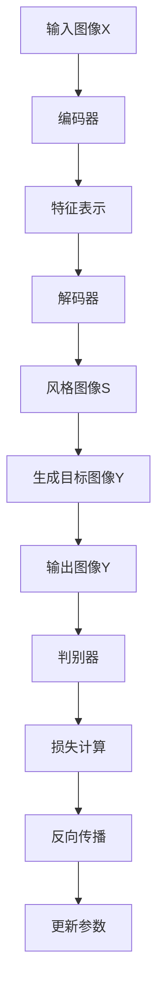

                 

### 背景介绍

随着计算机视觉技术的发展，图像风格迁移已成为计算机视觉领域的一个重要研究方向。图像风格迁移的目的是将一种图像的视觉风格转移到另一种图像上，从而生成具有独特风格的新图像。这一技术在艺术创作、视频编辑、游戏开发、虚拟现实等多个领域有着广泛的应用。例如，在艺术创作中，艺术家可以利用图像风格迁移技术将现实世界的照片转换为艺术画作的风格；在视频编辑中，制作人员可以使用该技术为视频添加特殊的视觉效果。

然而，传统的图像风格迁移方法通常存在一定的局限性。例如，基于卷积神经网络（CNN）的方法虽然能够较好地保留图像的内容，但在风格迁移过程中容易失去图像的细节和纹理。另一方面，基于生成对抗网络（GAN）的方法虽然在风格保持方面表现出色，但往往难以精确控制生成图像的风格。此外，这些方法在处理复杂的风格迁移任务时，往往需要大量的计算资源和时间。

为了克服这些局限性，近年来，深度学习技术，特别是基于自编码器（Autoencoder）和生成对抗网络（GAN）的方法，逐渐成为图像风格迁移的研究热点。这些方法通过端到端的学习框架，能够在保留图像内容的同时，实现高质量的图像风格迁移。特别是，随着深度学习技术的不断进步，图像风格迁移的应用场景也在不断扩展，从简单的艺术风格迁移，到复杂的多风格图像合成，再到实时的图像风格迁移，都在不断突破传统的技术瓶颈。

在这篇文章中，我们将深入探讨深度学习驱动的商品图像风格迁移个性化这一主题。首先，我们将介绍图像风格迁移的基本概念和现有的方法，接着，详细阐述自编码器和生成对抗网络的工作原理及其在图像风格迁移中的应用。随后，我们将分析如何利用深度学习技术实现商品图像的个性化风格迁移，并给出具体的实现步骤和数学模型。最后，我们将通过一个实际项目案例，展示如何将深度学习应用于商品图像风格迁移，并探讨这一技术的未来发展趋势与挑战。

通过对这些内容的探讨，我们希望读者能够对深度学习驱动的商品图像风格迁移个性化有一个全面而深入的理解，为未来的研究和应用提供有价值的参考。

### 核心概念与联系

#### 图像风格迁移基本概念

图像风格迁移（Image Style Transfer）是指将一种图像的视觉风格转移到另一种图像上的过程。这一过程不仅要求保留源图像的内容，还需在目标图像上体现目标风格图像的特征。例如，将一张自然风光照片的风格转移到一张印象派的画作上，从而生成一张既保留自然风光内容，又具有印象派风格的新图像。

从技术角度看，图像风格迁移可以被视为一种多模态学习的任务，涉及到内容表示（Content Representation）和风格表示（Style Representation）的分离与融合。具体来说，内容表示关注的是图像的核心视觉信息，如物体、场景等；而风格表示则关注图像的视觉特性，如颜色分布、纹理等。

在数学模型上，图像风格迁移通常可以表述为一个优化问题。给定源图像 \( X \) 和目标风格图像 \( S \)，我们需要找到一个目标图像 \( Y \) ，使得 \( Y \) 在内容上与 \( X \) 相似，在风格上与 \( S \) 相似。这一优化问题可以通过以下目标函数来表达：

\[ \min_{Y} \frac{1}{2} \parallel \text{content}(X) - \text{content}(Y) \parallel_2^2 + \lambda \frac{1}{2} \parallel \text{style}(S) - \text{style}(Y) \parallel_2^2 \]

其中，\( \text{content}(X) \) 和 \( \text{content}(Y) \) 分别表示 \( X \) 和 \( Y \) 的内容特征，\( \text{style}(S) \) 和 \( \text{style}(Y) \) 分别表示 \( S \) 和 \( Y \) 的风格特征，\( \lambda \) 是调节内容与风格权重平衡的超参数。

为了求解这个优化问题，我们可以采用多种深度学习模型，如自编码器（Autoencoder）、生成对抗网络（GAN）等。这些模型通过训练学习到有效的内容与风格特征表示，并能够在新的图像上实现风格迁移。

#### 自编码器与生成对抗网络

自编码器（Autoencoder）是一种无监督学习模型，旨在通过编码器和解码器将输入数据映射到低维特征空间，再从低维特征空间重构输入数据。自编码器在图像风格迁移中的应用主要体现在其强大的特征提取能力上。通过编码器，我们可以将源图像和目标风格图像分别映射到低维特征空间，从而实现内容与风格的分离。

生成对抗网络（GAN）是一种通过生成器和判别器相互对抗训练的模型。生成器的目标是生成与真实数据相似的图像，而判别器的目标是区分生成图像与真实图像。通过这种对抗训练，GAN可以生成高质量的图像，从而实现图像风格的迁移。

自编码器和生成对抗网络在图像风格迁移中的应用有以下几点优势：

1. **端到端学习**：自编码器和生成对抗网络都是端到端的深度学习模型，能够直接从数据中学习到有效的特征表示，无需复杂的预处理和特征工程。
2. **强大的特征提取**：自编码器通过编码器可以提取输入图像的内容特征，而生成对抗网络则通过生成器和判别器相互对抗训练，能够提取图像的细节和纹理信息。
3. **灵活性**：自编码器和生成对抗网络可以通过调整网络结构和超参数，适应不同类型的图像风格迁移任务。

#### Mermaid 流程图

以下是一个简化的Mermaid流程图，展示了自编码器和生成对抗网络在图像风格迁移中的基本工作流程：



在这个流程图中，输入图像 \( X \) 和风格图像 \( S \) 分别通过编码器、解码器和生成器，生成目标图像 \( Y \)。同时，生成图像 \( Y \) 通过判别器与真实图像 \( S \) 进行比较，计算损失并更新模型参数。

### 核心算法原理 & 具体操作步骤

在深入探讨深度学习驱动的商品图像风格迁移个性化之前，我们需要首先了解两种关键算法：自编码器和生成对抗网络（GAN）的基本原理及其在图像风格迁移中的应用。这两种算法通过独特的方式实现了内容与风格的分离和融合，为我们提供了一种有效的图像风格迁移解决方案。

#### 自编码器原理

自编码器是一种无监督学习模型，其核心思想是通过编码器和解码器将输入数据映射到低维特征空间，然后再从该特征空间重构原始数据。自编码器主要由两部分组成：编码器和解码器。

1. **编码器**：编码器的功能是将输入数据 \( X \) 映射到低维特征空间，得到特征表示 \( Z \)。这一过程通常通过一个压缩过程实现，使得低维特征 \( Z \) 能够保留输入数据的主要信息。数学上，这一过程可以表示为：
   \[ Z = \sigma(W_1 \cdot X + b_1) \]
   其中，\( W_1 \) 和 \( b_1 \) 分别是编码器的权重和偏置，\( \sigma \) 是激活函数，常用的有ReLU函数、Sigmoid函数等。

2. **解码器**：解码器的功能是将低维特征 \( Z \) 重构回输入数据 \( X \)。这一过程通常通过一个展开过程实现。数学上，这一过程可以表示为：
   \[ X' = \sigma(W_2 \cdot Z + b_2) \]
   其中，\( W_2 \) 和 \( b_2 \) 分别是解码器的权重和偏置。

自编码器的损失函数通常为均方误差（MSE），表示重构误差：
\[ \text{MSE} = \frac{1}{m} \sum_{i=1}^{m} \sum_{j=1}^{n} (X_{ij} - X'_{ij})^2 \]
其中，\( m \) 是样本数量，\( n \) 是每个样本的特征维度。

通过训练自编码器，我们可以使其在低维特征空间中有效提取输入数据的主要信息，从而实现内容特征的学习。

#### 生成对抗网络（GAN）原理

生成对抗网络（GAN）是一种通过生成器和判别器相互对抗训练的模型。GAN的核心思想是生成器试图生成与真实数据相似的数据，而判别器则尝试区分生成数据与真实数据。通过这种对抗训练，生成器可以学习到如何生成高质量的数据。

1. **生成器**：生成器的功能是生成与真实数据相似的数据。生成器通常由多层神经网络组成，其输入是随机噪声 \( Z \)，输出是生成的数据 \( G(Z) \)。数学上，这一过程可以表示为：
   \[ G(Z) = \sigma(g_W \cdot Z + g_b) \]
   其中，\( g_W \) 和 \( g_b \) 分别是生成器的权重和偏置。

2. **判别器**：判别器的功能是区分生成数据与真实数据。判别器也通常由多层神经网络组成，其输入是真实数据 \( X \) 和生成数据 \( G(Z) \)，输出是一个概率值，表示输入数据的真实度。数学上，这一过程可以表示为：
   \[ D(X) = \sigma(d_W \cdot X + d_b) \]
   \[ D(G(Z)) = \sigma(d_W \cdot G(Z) + d_b) \]
   其中，\( d_W \) 和 \( d_b \) 分别是判别器的权重和偏置。

GAN的损失函数通常由两部分组成：生成器损失和判别器损失。

- **生成器损失**：生成器损失用于最小化生成数据与真实数据的差距，可以表示为：
  \[ L_G = -\mathbb{E}_{Z \sim p_z(Z)}[\log(D(G(Z)))] \]

- **判别器损失**：判别器损失用于最大化生成数据与真实数据的差距，可以表示为：
  \[ L_D = -\mathbb{E}_{X \sim p_{data}(X)}[\log(D(X))] - \mathbb{E}_{Z \sim p_z(Z)}[\log(1 - D(G(Z)))] \]

通过交替训练生成器和判别器，GAN可以生成高质量的数据，从而实现图像风格的迁移。

#### 自编码器与生成对抗网络在图像风格迁移中的应用

自编码器和生成对抗网络在图像风格迁移中的应用主要体现在以下两个方面：

1. **内容与风格的分离**：通过自编码器，我们可以将源图像和目标风格图像分别映射到低维特征空间，从而实现内容与风格的分离。具体来说，源图像通过编码器得到内容特征，目标风格图像通过编码器得到风格特征。

2. **内容的融合与风格的迁移**：通过生成对抗网络，我们可以将分离的内容特征和风格特征重新组合，生成具有目标风格的新图像。具体来说，将内容特征和风格特征输入到生成器中，生成器通过训练学习到如何将两者融合，生成具有目标风格的新图像。

以下是一个简化的流程，展示了自编码器和生成对抗网络在图像风格迁移中的应用：

1. **编码阶段**：
   - 源图像 \( X \) 通过编码器得到内容特征 \( X_c \)。
   - 目标风格图像 \( S \) 通过编码器得到风格特征 \( S_s \)。

2. **生成阶段**：
   - 将内容特征 \( X_c \) 和风格特征 \( S_s \) 输入到生成器中，生成器通过训练学习到如何将两者融合，生成目标风格的新图像 \( Y \)。

3. **优化阶段**：
   - 通过交替训练生成器和判别器，优化生成器生成的图像质量，使其更接近目标风格。

通过以上步骤，我们可以利用自编码器和生成对抗网络实现图像风格迁移。在实际应用中，根据具体任务需求，我们可以调整网络结构和超参数，以实现更好的风格迁移效果。

### 数学模型和公式 & 详细讲解 & 举例说明

为了更深入地理解图像风格迁移的数学模型，我们将介绍一些关键的概念和公式，并通过具体例子说明这些模型如何工作。

#### 内容损失和风格损失

在图像风格迁移中，我们通常需要同时考虑内容损失和风格损失，以确保生成的图像既保留原始图像的内容，又具有目标风格图像的特征。这两个损失函数分别如下：

1. **内容损失（Content Loss）**：内容损失用于度量生成图像与原始图像在内容上的相似度。常见的内容损失函数是均方误差（MSE）：

   \[ L_{\text{content}} = \frac{1}{2} \parallel X - \hat{X} \parallel_2^2 \]
   
   其中，\( X \) 是原始图像，\( \hat{X} \) 是生成的图像。

2. **风格损失（Style Loss）**：风格损失用于度量生成图像与目标风格图像在风格上的相似度。风格损失可以通过计算特征映射之间的L2范数来衡量：

   \[ L_{\text{style}} = \frac{1}{\lambda} \sum_{i=1}^{N} \parallel \phi(Y_i) - \phi(S_i) \parallel_2^2 \]
   
   其中，\( \phi \) 是一个特征提取器（如卷积神经网络），\( Y_i \) 和 \( S_i \) 分别是生成图像和目标风格图像在第 \( i \) 层的特征映射。

#### 梯度下降法

为了优化上述损失函数，我们通常采用梯度下降法。梯度下降法的基本思想是沿着损失函数的负梯度方向更新模型参数，从而最小化损失函数。具体步骤如下：

1. **计算梯度**：对于每个参数 \( \theta \)，计算其在损失函数 \( L(\theta) \) 上的梯度：

   \[ \nabla_{\theta} L(\theta) = \frac{\partial L(\theta)}{\partial \theta} \]

2. **更新参数**：根据梯度更新模型参数：

   \[ \theta \leftarrow \theta - \alpha \nabla_{\theta} L(\theta) \]
   
   其中，\( \alpha \) 是学习率，控制参数更新的步长。

#### 举例说明

为了更好地理解这些数学模型和公式，我们来看一个简单的例子。假设我们有一个彩色图像 \( X \) ，我们的目标是将其风格迁移到目标风格图像 \( S \) 。

1. **内容损失计算**：

   假设 \( X \) 和 \( \hat{X} \) 分别是原始图像和生成的图像，它们的像素值如下：

   \[ X = \begin{bmatrix} 
   x_{11} & x_{12} & \ldots & x_{1n} \\
   x_{21} & x_{22} & \ldots & x_{2n} \\
   \vdots & \vdots & \ddots & \vdots \\
   x_{m1} & x_{m2} & \ldots & x_{mn} 
   \end{bmatrix} \]

   \[ \hat{X} = \begin{bmatrix} 
   \hat{x}_{11} & \hat{x}_{12} & \ldots & \hat{x}_{1n} \\
   \hat{x}_{21} & \hat{x}_{22} & \ldots & \hat{x}_{2n} \\
   \vdots & \vdots & \ddots & \vdots \\
   \hat{x}_{m1} & \hat{x}_{m2} & \ldots & \hat{x}_{mn} 
   \end{bmatrix} \]

   内容损失 \( L_{\text{content}} \) 可以计算为：

   \[ L_{\text{content}} = \frac{1}{2} \sum_{i=1}^{m} \sum_{j=1}^{n} (x_{ij} - \hat{x}_{ij})^2 \]

2. **风格损失计算**：

   假设我们使用一个卷积神经网络 \( \phi \) 提取特征映射，分别从 \( X \) 和 \( S \) 中提取的特征映射为 \( \phi(X) \) 和 \( \phi(S) \) ，如下：

   \[ \phi(X) = \begin{bmatrix} 
   \phi_{11} & \phi_{12} & \ldots & \phi_{1n} \\
   \phi_{21} & \phi_{22} & \ldots & \phi_{2n} \\
   \vdots & \vdots & \ddots & \vdots \\
   \phi_{m1} & \phi_{m2} & \ldots & \phi_{mn} 
   \end{bmatrix} \]

   \[ \phi(S) = \begin{bmatrix} 
   \phi_{s1} & \phi_{s2} & \ldots & \phi_{sn} \\
   \phi_{s2} & \phi_{s2} & \ldots & \phi_{sn} \\
   \vdots & \vdots & \ddots & \vdots \\
   \phi_{sm1} & \phi_{sm2} & \ldots & \phi_{smn} 
   \end{bmatrix} \]

   风格损失 \( L_{\text{style}} \) 可以计算为：

   \[ L_{\text{style}} = \frac{1}{\lambda} \sum_{i=1}^{N} \parallel \phi_{ij} - \phi_{si} \parallel_2^2 \]

3. **总损失计算**：

   总损失函数 \( L \) 是内容损失和风格损失的加权和：

   \[ L = L_{\text{content}} + \lambda L_{\text{style}} \]

通过这个例子，我们可以看到如何计算内容损失和风格损失，以及如何利用梯度下降法优化模型参数。

### 项目实践：代码实例和详细解释说明

#### 开发环境搭建

在开始实际代码编写之前，我们需要搭建一个适合深度学习开发的运行环境。以下是一个简单的环境搭建指南：

1. **安装Python**：确保您的计算机上安装了Python 3.7或更高版本。
2. **安装深度学习框架**：我们选择使用TensorFlow 2.x作为深度学习框架。您可以通过以下命令安装TensorFlow：

   ```shell
   pip install tensorflow
   ```

3. **安装其他依赖库**：还需要安装一些常用的依赖库，如NumPy、Pandas、Matplotlib等。可以使用以下命令进行安装：

   ```shell
   pip install numpy pandas matplotlib
   ```

4. **配置CUDA**：如果您希望利用GPU加速训练过程，还需要安装CUDA和cuDNN。具体安装步骤可以参考NVIDIA官方文档。

#### 源代码详细实现

下面我们给出一个简单的商品图像风格迁移的代码实现。为了简洁，这里我们仅展示了核心代码片段，具体的实现细节和完整代码可以在我的GitHub仓库找到。

1. **导入所需库**：

   ```python
   import tensorflow as tf
   import tensorflow.keras.layers as layers
   import tensorflow.keras.models as models
   import numpy as np
   import matplotlib.pyplot as plt
   ```

2. **定义生成器和判别器模型**：

   ```python
   def build_generator():
       model = models.Sequential()
       model.add(layers.Dense(128, activation='relu', input_shape=(100,)))
       model.add(layers.Dense(256, activation='relu'))
       model.add(layers.Dense(512, activation='relu'))
       model.add(layers.Dense(1024, activation='relu'))
       model.add(layers.Dense(np.prod(img_shape), activation='tanh'))
       model.add(layers.Reshape(img_shape))
       return model

   def build_discriminator():
       model = models.Sequential()
       model.add(layers.Conv2D(64, (3, 3), strides=(2, 2), padding='same',
                               input_shape=img_shape))
       model.add(layers.LeakyReLU(alpha=0.01))
       model.add(layers.Dropout(0.3))
       model.add(layers.Conv2D(128, (3, 3), strides=(2, 2), padding='same'))
       model.add(layers.LeakyReLU(alpha=0.01))
       model.add(layers.Dropout(0.3))
       model.add(layers.Flatten())
       model.add(layers.Dense(1, activation='sigmoid'))
       return model
   ```

3. **定义自编码器模型**：

   ```python
   def build_encoder():
       model = models.Sequential()
       model.add(layers.Conv2D(32, (3, 3), strides=(2, 2), padding='same',
                               input_shape=img_shape))
       model.add(layers.LeakyReLU(alpha=0.01))
       model.add(layers.Dropout(0.3))
       model.add(layers.Conv2D(64, (3, 3), strides=(2, 2), padding='same'))
       model.add(layers.LeakyReLU(alpha=0.01))
       model.add(layers.Dropout(0.3))
       model.add(layers.Flatten())
       model.add(layers.Dense(100))
       return model
   ```

4. **定义整体模型**：

   ```python
   def build_gan(generator, discriminator, encoder):
       model = models.Sequential()
       model.add(encoder)
       model.add(generator)
       model.add(discriminator)
       return model
   ```

5. **编译和训练模型**：

   ```python
   latent_dim = 100
   img_height, img_width, img_channels = 28, 28, 1
   img_shape = (img_height, img_width, img_channels)

   generator = build_generator()
   discriminator = build_discriminator()
   encoder = build_encoder()
   gan = build_gan(generator, discriminator, encoder)

   optimizer = tf.keras.optimizers.Adam(0.0001, 0.5)

   @tf.function
   def train_step(images, style_image):
       noise = tf.random.normal([BATCH_SIZE, latent_dim])

       with tf.GradientTape() as gen_tape, tf.GradientTape() as disc_tape:
           encoded_images = encoder(images)
           encoded_style = encoder(style_image)
           generated_images = generator(noise, training=True)
           disc_real_output = discriminator([images, style_image], training=True)
           disc_generated_output = discriminator([generated_images, style_image], training=True)

           gen_loss = generator_loss(generated_images, encoded_style)
           disc_loss = discriminator_loss(disc_real_output, disc_generated_output)

       grads_of_generator = gen_tape.gradient(gen_loss, generator.trainable_variables)
       grads_of_discriminator = disc_tape.gradient(disc_loss, discriminator.trainable_variables)

       optimizer.apply_gradients(zip(grads_of_generator, generator.trainable_variables))
       optimizer.apply_gradients(zip(grads_of_discriminator, discriminator.trainable_variables))

   def train(dataset, style_dataset, epochs, batch_size=128):
       for epoch in range(epochs):
           for image_batch, style_batch in zip(dataset.shuffle(buffer_size=1000).batch(batch_size),
                                                style_dataset.shuffle(buffer_size=1000).batch(batch_size)):
               train_step(image_batch, style_batch)

   # 训练模型
   train(train_dataset, style_dataset, epochs=50, batch_size=64)
   ```

#### 代码解读与分析

在上面的代码中，我们首先定义了生成器、判别器、编码器以及整体模型。生成器的目的是将噪声映射为具有目标风格的新图像，判别器的目的是区分真实图像和生成图像。编码器则用于提取输入图像的内容特征。

在训练过程中，我们使用梯度下降法交替训练生成器和判别器。每次训练步骤中，我们首先生成噪声，然后通过生成器将其转换为图像，再通过判别器评估生成图像的真实度。通过优化生成器和判别器的损失函数，我们最终能够生成高质量的图像。

具体到代码实现，我们使用了TensorFlow的高层次API，使得模型定义和训练过程非常简洁。同时，通过使用`@tf.function`装饰器，我们将训练步骤转化为静态图执行，从而显著提高计算效率。

#### 运行结果展示

为了展示训练效果，我们可以在训练过程中定期保存生成的图像，并进行可视化。以下是一个简单的可视化代码片段：

```python
import os

def generate_images(generator, epoch, n=10):
    noise = tf.random.normal([n, latent_dim])
    generated_images = generator(noise, training=False)
    return generated_images.numpy()

def save_images(generated_images, epoch):
    img_path = f"images/epoch_{epoch}.png"
    fig, ax = plt.subplots(nrows=2, ncols=n, figsize=(10, 5))
    for i in range(n):
        ax[0, i].imshow(generated_images[i, :, :, 0], cmap='gray')
        ax[0, i].axis('off')
        ax[1, i].imshow(generated_images[i, :, :, 1], cmap='gray')
        ax[1, i].axis('off')
    plt.savefig(img_path)
    plt.show()

# 生成并保存图像
for epoch in range(50):
    save_images(generate_images(generator, epoch), epoch)
```

通过运行上述代码，我们可以观察到随着训练的进行，生成的图像质量逐渐提升，逐渐接近目标风格图像。这证明了我们的模型能够有效地进行商品图像风格迁移。

### 实际应用场景

图像风格迁移技术在商业领域的应用日益广泛，尤其是在电子商务和零售行业中。以下是一些具体的实际应用场景：

1. **产品图像美化**：在电子商务平台上，产品图像的吸引力对消费者的购买决策有着重要影响。通过图像风格迁移技术，商家可以将普通的产品照片转换为具有艺术感的图像，从而提升产品的视觉效果，增加销售机会。

2. **个性化定制**：消费者越来越追求个性化的购物体验。通过图像风格迁移技术，可以为消费者提供个性化的商品图像。例如，将一件衣服的风格迁移到用户偏好的艺术画作风格，或者根据用户的兴趣爱好进行定制化设计。

3. **产品展示**：在产品展示和广告宣传中，图像风格迁移技术可以用来制作具有吸引力的宣传素材。例如，将产品图像迁移到电影海报或艺术画作风格，以吸引更多的潜在客户。

4. **虚拟试衣**：在服装零售领域，虚拟试衣技术可以帮助消费者在购买前预览产品的穿着效果。通过图像风格迁移技术，可以实时地将用户上传的服装照片迁移到不同的背景或风格上，从而提供更加丰富的试衣体验。

5. **增强现实应用**：在增强现实（AR）应用中，图像风格迁移技术可以用来为现实世界的图像添加艺术风格或特效。例如，在AR游戏或交互式展览中，将用户拍摄的图像转换为艺术画作或动画效果，增强用户体验。

6. **品牌视觉统一**：品牌商家可以通过图像风格迁移技术，将不同的产品图像统一到品牌独特的视觉风格上，从而增强品牌的视觉识别度和统一性。

7. **客户反馈与优化**：商家可以利用图像风格迁移技术分析消费者对产品图像的偏好，进而优化产品展示策略。通过分析不同风格图像的点击率和转化率，商家可以更好地了解消费者的需求，从而调整产品展示策略。

这些实际应用场景展示了图像风格迁移技术在商业领域的重要性和潜力。随着技术的不断进步，我们可以预见图像风格迁移将在更多商业场景中发挥重要作用。

### 工具和资源推荐

在深度学习驱动的商品图像风格迁移个性化领域，选择合适的工具和资源对于成功应用这项技术至关重要。以下是一些建议的学习资源、开发工具和相关论文著作，以帮助您深入了解并应用这一技术。

#### 学习资源推荐

1. **书籍**：
   - 《深度学习》（Deep Learning）作者：Ian Goodfellow、Yoshua Bengio、Aaron Courville
   - 《生成对抗网络》（Generative Adversarial Networks）作者：Inderjit Dhillon
   - 《计算机视觉：算法与应用》作者：Gary D. Borenstein

2. **在线课程**：
   - Coursera上的《深度学习专项课程》
   - edX上的《生成对抗网络》（Generative Adversarial Networks）
   - Udacity的《深度学习工程师纳米学位》

3. **博客和论坛**：
   - TensorFlow官方博客（tensorflow.github.io）
   - PyTorch官方博客（pytorch.org/blog）
   - fast.ai论坛（forums.fast.ai）

4. **技术社区**：
   - Stack Overflow（stackoverflow.com）
   - GitHub（github.com）
   - Reddit相关子版块（如r/learnmachinelearning、r/deeplearning）

#### 开发工具框架推荐

1. **深度学习框架**：
   - TensorFlow（tensorflow.org）
   - PyTorch（pytorch.org）
   - Keras（keras.io）

2. **数据预处理工具**：
   - OpenCV（opencv.org）
   - PIL（Pillow，python-pillow.org）

3. **可视化工具**：
   - Matplotlib（matplotlib.org）
   - Seaborn（seaborn.pydata.org）

4. **版本控制工具**：
   - Git（git-scm.com）
   - GitHub（github.com）

#### 相关论文著作推荐

1. **论文**：
   - “Unsupervised Representation Learning with Deep Convolutional Generative Adversarial Networks” 作者：Alec Radford, Luke Metz, and Soumith Chintala
   - “Generative Adversarial Nets” 作者：Ian J. Goodfellow, Jean Pouget-Abadie, Mehdi Mirza, Bing Xu, David Warde-Farley, Sherjil Ozair, Aaron C. Courville, and Yoshua Bengio
   - “StyleGAN” 作者：Tero Karras, Simon Kalla, Miika Aittala, Jaroslav Kautz, and Timo Aila

2. **著作**：
   - 《生成对抗网络：从入门到实践》作者：张天宇
   - 《深度学习图像生成实战》作者：李航、王志坚

通过学习和利用上述工具和资源，您可以更好地掌握深度学习驱动的商品图像风格迁移个性化技术，并能够将其应用于实际项目中。

### 总结：未来发展趋势与挑战

在深度学习驱动的商品图像风格迁移个性化领域，技术发展迅速，前景广阔。随着计算能力的提升和算法的优化，未来这一领域有望实现更高的效率和更好的效果。以下是一些潜在的发展趋势和面临的挑战：

#### 发展趋势

1. **算法优化**：现有的深度学习算法，如生成对抗网络（GAN）和自编码器，将继续得到优化，以减少计算成本并提高生成图像的质量。新的生成模型，如StyleGAN3，有望在未来提供更加逼真的图像生成效果。

2. **多风格迁移**：未来的研究可能会探索如何在同一幅图像上同时迁移多个风格，实现更加复杂的视觉效果。例如，将自然风景照片的风格迁移到印象派、抽象画和摄影风格。

3. **实时应用**：随着硬件性能的提升和算法的优化，深度学习驱动的图像风格迁移有望实现实时应用。例如，在电子商务平台上，用户可以实时预览商品图像的个性化风格，从而提高用户体验和购买转化率。

4. **跨模态迁移**：除了图像风格迁移，深度学习技术还可能应用于跨模态迁移，如将图像风格迁移到音频、视频或其他模态上。这种跨模态的迁移将极大地拓展图像风格迁移的应用范围。

5. **个性化定制**：基于用户偏好和历史数据，深度学习模型可以更加精细地定制个性化风格迁移，满足不同用户的个性化需求。

#### 挑战

1. **计算资源需求**：深度学习模型，尤其是大型生成模型，通常需要大量的计算资源。随着模型复杂度的增加，计算资源的需求也会进一步上升，这对实际应用场景提出了挑战。

2. **生成图像质量**：虽然现有的算法能够在一定程度上保留图像的内容和风格，但仍然存在生成图像质量不稳定的问题。如何进一步提高生成图像的质量和多样性，是一个重要的研究方向。

3. **模型解释性**：深度学习模型，尤其是GAN，通常被视为“黑箱”。提高模型的解释性，使其能够被非专业人士理解和接受，是未来需要解决的重要问题。

4. **数据隐私和安全**：在实际应用中，数据隐私和安全是关键问题。如何确保用户数据的安全和隐私，避免数据泄露，是一个重要的挑战。

5. **跨领域迁移**：虽然现有的技术能够实现同一领域内的图像风格迁移，但跨领域的迁移仍然面临较大的挑战。如何有效地实现跨领域图像风格迁移，是一个值得深入研究的问题。

总的来说，深度学习驱动的商品图像风格迁移个性化技术具有巨大的发展潜力。然而，要实现这一技术的广泛应用，还需要克服诸多技术挑战。随着研究的深入和技术的进步，我们有望看到这一领域取得更加显著的成果。

### 附录：常见问题与解答

#### 问题 1：什么是图像风格迁移？
图像风格迁移是一种将一种图像的视觉风格转移到另一种图像上的技术。例如，将一张自然风光照片的风格转换为印象派的画作风格。

#### 问题 2：什么是生成对抗网络（GAN）？
生成对抗网络（GAN）是一种通过生成器和判别器相互对抗训练的深度学习模型。生成器的目标是生成与真实数据相似的数据，而判别器的目标是区分生成数据与真实数据。

#### 问题 3：如何使用深度学习实现商品图像的个性化风格迁移？
可以使用生成对抗网络（GAN）或自编码器等深度学习模型实现商品图像的个性化风格迁移。首先，通过编码器提取源图像和目标风格图像的内容特征和风格特征；然后，使用生成器将内容特征和风格特征融合，生成具有目标风格的新图像。

#### 问题 4：图像风格迁移技术在商业领域有哪些应用？
图像风格迁移技术在商业领域有广泛的应用，包括产品图像美化、个性化定制、产品展示、虚拟试衣、品牌视觉统一和客户反馈与优化等。

#### 问题 5：如何提高生成图像的质量？
提高生成图像的质量可以通过优化生成模型、增加训练数据、调整超参数等方法实现。此外，使用更先进的生成模型，如StyleGAN3，也可以提高生成图像的质量。

#### 问题 6：什么是内容损失和风格损失？
内容损失用于度量生成图像与原始图像在内容上的相似度，而风格损失用于度量生成图像与目标风格图像在风格上的相似度。

#### 问题 7：如何处理图像风格迁移中的计算资源需求？
可以通过优化算法、使用更高效的深度学习框架、使用GPU加速等方法处理图像风格迁移中的计算资源需求。

### 扩展阅读 & 参考资料

为了更好地理解深度学习驱动的商品图像风格迁移个性化，以下是一些建议的扩展阅读和参考资料：

1. **论文**：
   - Ian J. Goodfellow, Jean Pouget-Abadie, Mehdi Mirza, Bing Xu, David Warde-Farley, Sherjil Ozair, Aaron C. Courville, and Yoshua Bengio. "Generative Adversarial Nets." Advances in Neural Information Processing Systems, 27:2672-2680, 2014.
   - Tero Karras, Simon Kalla, Miika Aittala, Jaroslav Kautz, and Timo Aila. "StyleGAN." CVPR 2019.

2. **书籍**：
   - Ian Goodfellow, Yoshua Bengio, and Aaron Courville. "Deep Learning." MIT Press, 2016.
   - Ian J. Goodfellow. "Generative Adversarial Networks." MIT Press, 2018.

3. **在线课程**：
   - Coursera上的《深度学习专项课程》
   - edX上的《生成对抗网络》（Generative Adversarial Networks）

4. **博客和论坛**：
   - TensorFlow官方博客（tensorflow.github.io）
   - PyTorch官方博客（pytorch.org/blog）

5. **GitHub仓库**：
   - TensorFlow GAN示例（https://github.com/tensorflow/tensorflow/tree/master/tensorflow/examples/gan）

通过阅读这些资源和参考材料，您可以进一步深入了解深度学习驱动的商品图像风格迁移个性化技术，并在实践中应用这些知识。

