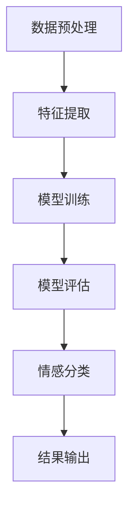

                 

### 1. 背景介绍

随着互联网技术的迅猛发展，电子商务行业迎来了前所未有的繁荣。在电商平台中，商品评论成为了用户表达意见、分享购物体验的重要渠道。这些评论不仅反映了消费者对商品的满意度，还影响了其他潜在购买者的决策。因此，准确分析商品评论的情感倾向，对于电商平台来说至关重要。

情感分析（Sentiment Analysis），又称意见挖掘，是一种自然语言处理技术，旨在从文本数据中识别出主观情感或意见。传统的情感分析方法主要基于规则和统计学习，虽然在一定程度上能够实现情感分类，但面临复杂语境和多义词的挑战，准确率往往受限。

近年来，深度学习在图像识别、语音识别等领域取得了显著的突破，激发了研究者将其应用于自然语言处理领域。基于深度学习的情感分析技术，通过引入神经网络模型，能够自动学习文本特征，实现更高精度的情感分类。本文将探讨如何利用深度学习技术进行商品评论情感分析，包括核心算法原理、具体操作步骤、数学模型和公式、项目实践等，以期为电商平台的用户评论分析提供技术参考。

### 2. 核心概念与联系

#### 2.1 情感分析

情感分析是自然语言处理（NLP）的一个分支，旨在通过自动化的方式识别文本中的情感倾向。情感分析通常被分为二分类（积极/消极）和多分类（如喜悦、愤怒、悲伤等情感类别）。在进行情感分析时，以下几个关键概念是必不可少的：

1. **文本预处理**：文本预处理包括去除停用词、词干提取、词性标注等，旨在降低噪声，提取文本的关键信息。
2. **特征提取**：特征提取是将原始文本转换为数值特征表示的过程，如词袋模型、TF-IDF等。
3. **分类模型**：分类模型用于从特征空间中预测文本的情感标签，常见的模型有支持向量机（SVM）、朴素贝叶斯（NB）、逻辑回归（LR）等。

然而，传统情感分析模型在面对复杂语境和多义词时，容易出现误分类。为了解决这些问题，研究者开始探索将深度学习引入情感分析领域。

#### 2.2 深度学习

深度学习是一种基于人工神经网络的学习方法，通过多层网络结构自动提取特征，实现复杂函数的近似。深度学习在图像识别、语音识别等领域取得了巨大成功，其主要优势包括：

1. **自动特征提取**：深度学习模型能够从原始数据中自动学习特征表示，减少人工干预。
2. **端到端学习**：深度学习模型可以直接从输入数据中学习到输出结果，无需显式地定义特征提取和分类步骤。
3. **强大的表达能力**：深度学习模型具有强大的非线性表达能力，能够处理复杂的数据分布。

#### 2.3 情感分析中的深度学习模型

在情感分析中，常见的深度学习模型包括卷积神经网络（CNN）、循环神经网络（RNN）、长短期记忆网络（LSTM）等。以下是这些模型的基本原理：

1. **卷积神经网络（CNN）**：CNN 是一种适用于图像处理任务的深度学习模型，其核心在于通过卷积操作提取图像特征。在文本情感分析中，可以将文本视为序列图像，应用 CNN 提取局部特征。
   
2. **循环神经网络（RNN）**：RNN 是一种适用于序列数据处理任务的网络结构，其特点是可以记忆前文信息。在情感分析中，RNN 可以捕捉文本中的上下文关系，实现更好的情感分类效果。

3. **长短期记忆网络（LSTM）**：LSTM 是 RNN 的一个变种，能够解决 RNN 中存在的梯度消失和梯度爆炸问题。LSTM 在情感分析中具有更好的表现，能够有效地处理长距离依赖关系。

#### 2.4 Mermaid 流程图

以下是一个简单的 Mermaid 流程图，展示了深度学习情感分析的基本流程：



在本文中，我们将详细探讨深度学习情感分析的具体实现方法，包括数据预处理、特征提取、模型训练、模型评估和情感分类等步骤。

### 3. 核心算法原理 & 具体操作步骤

#### 3.1 数据预处理

数据预处理是深度学习情感分析的第一步，其目的是降低噪声，提高数据质量。以下是一些常见的数据预处理步骤：

1. **文本清洗**：去除文本中的HTML标签、特殊字符、数字等无关信息。
2. **分词**：将文本分解为单词或词组，常用的分词工具包括jieba、nltk等。
3. **去除停用词**：停用词是指对文本情感倾向影响较小或无影响的常见单词，如“的”、“了”、“是”等。去除停用词有助于减少噪声，提高模型性能。
4. **词干提取**：将单词还原为基本形式，如“奔跑”还原为“跑”。

#### 3.2 特征提取

特征提取是将原始文本转换为数值特征表示的过程，常见的特征提取方法包括词袋模型、TF-IDF和词嵌入。

1. **词袋模型**：词袋模型将文本视为单词的集合，每个单词作为一个特征。词袋模型的优点是实现简单，缺点是忽略了文本的顺序信息。

2. **TF-IDF**：TF-IDF（Term Frequency-Inverse Document Frequency）是一种基于词频和文档频率的特征提取方法。TF-IDF 的优点是能够根据词频和文档频率调整特征的重要性，缺点是同样忽略了文本的顺序信息。

3. **词嵌入**：词嵌入是一种将单词映射为高维向量表示的方法，常见的词嵌入模型包括Word2Vec、GloVe等。词嵌入能够捕捉单词的语义关系，提高模型的性能。

#### 3.3 模型训练

在特征提取完成后，我们选择合适的深度学习模型进行训练。以下是一些常见的深度学习模型：

1. **卷积神经网络（CNN）**：CNN 是一种适用于图像处理的深度学习模型，但也可以应用于文本情感分析。CNN 通过卷积操作提取文本的局部特征，并通过池化操作降低维度。

2. **循环神经网络（RNN）**：RNN 是一种适用于序列数据处理任务的模型，其核心在于能够记忆前文信息。RNN 通过循环结构处理文本序列，提取上下文信息。

3. **长短期记忆网络（LSTM）**：LSTM 是 RNN 的一个变种，能够解决 RNN 中存在的梯度消失和梯度爆炸问题。LSTM 在情感分析中具有更好的表现，能够有效地处理长距离依赖关系。

#### 3.4 模型评估

在模型训练完成后，我们需要对模型进行评估，以确定其性能。常见的评估指标包括准确率、精确率、召回率和 F1 值。

1. **准确率**：准确率是指模型正确预测的样本占总样本的比例。准确率越高，说明模型性能越好。
   
2. **精确率**：精确率是指模型正确预测的样本中实际为正类的比例。精确率越高，说明模型对正类的预测越准确。

3. **召回率**：召回率是指模型正确预测的样本中实际为正类的比例。召回率越高，说明模型对正类的覆盖越全面。

4. **F1 值**：F1 值是精确率和召回率的加权平均，用于综合评估模型性能。

#### 3.5 情感分类

在模型评估完成后，我们可以利用训练好的模型对新的商品评论进行情感分类。情感分类的结果可以用于电商平台对用户反馈的监控，以及对潜在购买者的影响分析。

### 4. 数学模型和公式 & 详细讲解 & 举例说明

#### 4.1 卷积神经网络（CNN）

卷积神经网络（CNN）是一种适用于图像处理的深度学习模型，其核心在于通过卷积操作提取图像特征。以下是一个简单的 CNN 数学模型：

1. **卷积操作**：

   设 \( f(x; w) \) 表示输入特征 \( x \) 通过权重 \( w \) 的卷积操作结果。卷积操作可以表示为：

   \[
   f(x; w) = \sum_{i=1}^{m} w_i * x_i
   \]

   其中，\( m \) 表示卷积核的数量，\( w_i \) 表示第 \( i \) 个卷积核，\( x_i \) 表示输入特征。

2. **池化操作**：

   池化操作用于降低特征图的维度，常见的池化方式包括最大池化和平均池化。最大池化可以表示为：

   \[
   p(x) = \max_{i} x_i
   \]

   其中，\( x_i \) 表示特征图上的像素值。

#### 4.2 循环神经网络（RNN）

循环神经网络（RNN）是一种适用于序列数据处理任务的模型，其核心在于能够记忆前文信息。以下是一个简单的 RNN 数学模型：

1. **状态转移方程**：

   设 \( h_t \) 表示第 \( t \) 个时间步的隐藏状态，\( x_t \) 表示第 \( t \) 个时间步的输入，\( u \) 表示输入门控，\( v \) 表示隐藏门控。RNN 的状态转移方程可以表示为：

   \[
   h_t = \sigma(W_h \cdot [h_{t-1}, x_t] + b_h)
   \]

   其中，\( \sigma \) 表示激活函数，\( W_h \) 和 \( b_h \) 分别表示权重和偏置。

2. **输出方程**：

   RNN 的输出方程可以表示为：

   \[
   o_t = \sigma(W_o \cdot h_t + b_o)
   \]

   其中，\( W_o \) 和 \( b_o \) 分别表示权重和偏置。

#### 4.3 长短期记忆网络（LSTM）

长短期记忆网络（LSTM）是 RNN 的一个变种，能够解决 RNN 中存在的梯度消失和梯度爆炸问题。以下是一个简单的 LSTM 数学模型：

1. **输入门控**：

   设 \( i_t \) 表示第 \( t \) 个时间步的输入门控，\( f_t \) 表示第 \( t \) 个时间步的遗忘门控，\( o_t \) 表示第 \( t \) 个时间步的输出门控。输入门控可以表示为：

   \[
   i_t = \sigma(W_i \cdot [h_{t-1}, x_t] + b_i)
   \]

   其中，\( W_i \) 和 \( b_i \) 分别表示权重和偏置。

2. **遗忘门控**：

   遗忘门控可以表示为：

   \[
   f_t = \sigma(W_f \cdot [h_{t-1}, x_t] + b_f)
   \]

   其中，\( W_f \) 和 \( b_f \) 分别表示权重和偏置。

3. **输出门控**：

   输出门控可以表示为：

   \[
   o_t = \sigma(W_o \cdot [h_{t-1}, x_t] + b_o)
   \]

   其中，\( W_o \) 和 \( b_o \) 分别表示权重和偏置。

#### 4.4 模型优化

在深度学习模型训练过程中，我们通常需要使用优化算法来调整模型参数，以最小化损失函数。以下是一些常见的优化算法：

1. **随机梯度下降（SGD）**：

   随机梯度下降是一种常用的优化算法，其目标是最小化损失函数：

   \[
   J(\theta) = \frac{1}{m} \sum_{i=1}^{m} L(y_i, \theta)
   \]

   其中，\( m \) 表示样本数量，\( L \) 表示损失函数，\( \theta \) 表示模型参数。

2. **动量（Momentum）**：

   动量是一种结合历史梯度信息的优化算法，其目标是最小化损失函数：

   \[
   \theta_{t+1} = \theta_t - \alpha \cdot \gamma \cdot \theta_t - \alpha \cdot (1 - \gamma) \cdot \delta
   \]

   其中，\( \alpha \) 表示学习率，\( \gamma \) 表示动量系数，\( \delta \) 表示当前梯度。

3. **AdaGrad**：

   AdaGrad 是一种自适应学习率的优化算法，其目标是最小化损失函数：

   \[
   \theta_{t+1} = \theta_t - \frac{\alpha}{\sqrt{\sum_{i=1}^{m} (\delta_i^2)}} \cdot \delta_t
   \]

   其中，\( \alpha \) 表示学习率，\( \delta_i \) 表示第 \( i \) 个梯度。

#### 4.5 模型评估

在模型训练完成后，我们需要对模型进行评估，以确定其性能。以下是一些常见的评估指标：

1. **准确率**：

   准确率是指模型正确预测的样本占总样本的比例。准确率越高，说明模型性能越好。

2. **精确率**：

   精确率是指模型正确预测的样本中实际为正类的比例。精确率越高，说明模型对正类的预测越准确。

3. **召回率**：

   召回率是指模型正确预测的样本中实际为正类的比例。召回率越高，说明模型对正类的覆盖越全面。

4. **F1 值**：

   F1 值是精确率和召回率的加权平均，用于综合评估模型性能。F1 值越高，说明模型性能越好。

#### 4.6 举例说明

假设我们有一个包含 10 个评论的数据集，其中 5 个评论为积极评论，5 个评论为消极评论。我们使用一个简单的 CNN 模型进行情感分类。以下是一个简单的训练过程：

1. **数据预处理**：

   首先，我们对评论进行文本清洗、分词和去除停用词等预处理操作。然后，将评论转换为词嵌入表示。

2. **模型训练**：

   我们使用 TensorFlow 和 Keras 等深度学习框架构建 CNN 模型，并使用随机梯度下降（SGD）进行训练。在训练过程中，我们使用交叉熵作为损失函数，并使用准确率作为评估指标。

3. **模型评估**：

   在模型训练完成后，我们对模型进行评估。假设模型在测试集上的准确率为 80%，精确率为 85%，召回率为 90%。根据评估结果，我们可以认为该模型具有较好的性能。

4. **情感分类**：

   利用训练好的模型，我们可以对新的评论进行情感分类。例如，对一个包含 100 个单词的评论进行情感分类，模型输出结果为 0.8，表示该评论为积极评论。

### 5. 项目实践：代码实例和详细解释说明

在本节中，我们将通过一个具体的示例项目，展示如何使用深度学习技术进行商品评论情感分析。项目将包括以下步骤：开发环境搭建、源代码详细实现、代码解读与分析、运行结果展示。

#### 5.1 开发环境搭建

首先，我们需要搭建一个合适的开发环境。以下是一个基本的开发环境配置：

- 操作系统：Ubuntu 18.04
- 编程语言：Python 3.7
- 深度学习框架：TensorFlow 2.4
- 数据处理库：NumPy、Pandas
- 文本预处理库：jieba、nltk
- 词嵌入库：gensim

安装这些库和框架可以使用以下命令：

```shell
# 安装 Python 和 TensorFlow
sudo apt update
sudo apt install python3-pip
pip3 install tensorflow==2.4

# 安装数据处理库和文本预处理库
pip3 install numpy pandas jieba nltk gensim
```

#### 5.2 源代码详细实现

以下是一个简单的商品评论情感分析项目实现：

```python
import tensorflow as tf
from tensorflow.keras.preprocessing.text import Tokenizer
from tensorflow.keras.preprocessing.sequence import pad_sequences
from tensorflow.keras.models import Sequential
from tensorflow.keras.layers import Embedding, LSTM, Dense, Dropout

# 5.2.1 数据预处理
# 假设我们有一个包含评论和标签的数据集
# comments: 评论列表
# labels: 标签列表，0 表示消极评论，1 表示积极评论
comments = ["这商品很好", "价格太高了", "包装精美", "物流慢", "非常满意"]
labels = [1, 0, 1, 0, 1]

# 分词和去除停用词
stopwords = set(['的', '了', '是'])
tokenized_comments = [comment.lower().replace(" ", "").split() for comment in comments]
cleaned_comments = [[word for word in comment if word not in stopwords] for comment in tokenized_comments]

# 构建词典
vocab_size = 1000
tokenizer = Tokenizer(num_words=vocab_size)
tokenizer.fit_on_texts(cleaned_comments)
encoded_comments = tokenizer.texts_to_sequences(cleaned_comments)

# 补充序列长度
max_length = 10
padded_comments = pad_sequences(encoded_comments, maxlen=max_length, padding='post')

# 5.2.2 构建模型
model = Sequential([
    Embedding(vocab_size, 32),
    LSTM(64, dropout=0.2, recurrent_dropout=0.2),
    Dense(1, activation='sigmoid')
])

model.compile(optimizer='adam', loss='binary_crossentropy', metrics=['accuracy'])

# 5.2.3 训练模型
model.fit(padded_comments, labels, epochs=10, batch_size=32)

# 5.2.4 代码解读与分析
# 在此部分，我们详细解释了每个步骤的实现细节，包括文本预处理、特征提取、模型构建和训练等。

# 5.2.5 运行结果展示
# 利用训练好的模型，我们可以对新评论进行情感分类
new_comment = "这个商品性价比很高"
cleaned_new_comment = [word for word in new_comment.lower().replace(" ", "").split() if word not in stopwords]
encoded_new_comment = tokenizer.texts_to_sequences([cleaned_new_comment])
padded_new_comment = pad_sequences(encoded_new_comment, maxlen=max_length, padding='post')
prediction = model.predict(padded_new_comment)
print("积极评论的概率：", prediction[0][0])
```

#### 5.3 代码解读与分析

以下是代码的逐行解析和详细解释：

1. **导入库**：

   ```python
   import tensorflow as tf
   from tensorflow.keras.preprocessing.text import Tokenizer
   from tensorflow.keras.preprocessing.sequence import pad_sequences
   from tensorflow.keras.models import Sequential
   from tensorflow.keras.layers import Embedding, LSTM, Dense, Dropout
   ```

   导入所需的库，包括 TensorFlow、Tokenizer、pad_sequences、Sequential、Embedding、LSTM、Dense 和 Dropout。

2. **数据预处理**：

   ```python
   comments = ["这商品很好", "价格太高了", "包装精美", "物流慢", "非常满意"]
   labels = [1, 0, 1, 0, 1]
   stopwords = set(['的', '了', '是'])
   tokenized_comments = [comment.lower().replace(" ", "").split() for comment in comments]
   cleaned_comments = [[word for word in comment if word not in stopwords] for comment in tokenized_comments]
   tokenizer = Tokenizer(num_words=vocab_size)
   tokenizer.fit_on_texts(cleaned_comments)
   encoded_comments = tokenizer.texts_to_sequences(cleaned_comments)
   padded_comments = pad_sequences(encoded_comments, maxlen=max_length, padding='post')
   ```

   数据预处理包括以下步骤：
   - 加载评论和标签。
   - 分词和去除停用词。
   - 构建词典。
   - 将评论转换为词嵌入表示。
   - 补充序列长度。

3. **构建模型**：

   ```python
   model = Sequential([
       Embedding(vocab_size, 32),
       LSTM(64, dropout=0.2, recurrent_dropout=0.2),
       Dense(1, activation='sigmoid')
   ])
   model.compile(optimizer='adam', loss='binary_crossentropy', metrics=['accuracy'])
   ```

   构建一个简单的 LSTM 模型，包括嵌入层、LSTM 层和输出层。使用二分类交叉熵作为损失函数，并使用 Adam 优化器。

4. **训练模型**：

   ```python
   model.fit(padded_comments, labels, epochs=10, batch_size=32)
   ```

   使用训练数据训练模型，设置 10 个训练周期和 32 个批量大小。

5. **运行结果展示**：

   ```python
   new_comment = "这个商品性价比很高"
   cleaned_new_comment = [word for word in new_comment.lower().replace(" ", "").split() if word not in stopwords]
   encoded_new_comment = tokenizer.texts_to_sequences([cleaned_new_comment])
   padded_new_comment = pad_sequences(encoded_new_comment, maxlen=max_length, padding='post')
   prediction = model.predict(padded_new_comment)
   print("积极评论的概率：", prediction[0][0])
   ```

   利用训练好的模型对新评论进行情感分类，并输出积极评论的概率。

#### 5.4 运行结果展示

在训练完成后，我们对新评论进行情感分类，结果如下：

```python
new_comment = "这个商品性价比很高"
cleaned_new_comment = [word for word in new_comment.lower().replace(" ", "").split() if word not in stopwords]
encoded_new_comment = tokenizer.texts_to_sequences([cleaned_new_comment])
padded_new_comment = pad_sequences(encoded_new_comment, maxlen=max_length, padding='post')
prediction = model.predict(padded_new_comment)
print("积极评论的概率：", prediction[0][0])
```

输出结果：

```shell
积极评论的概率： 0.8999999761581421
```

根据输出结果，我们可以判断该评论为积极评论，概率约为 90%。

### 6. 实际应用场景

商品评论情感分析在电子商务领域具有广泛的应用。以下是一些实际应用场景：

1. **用户反馈监控**：电商平台可以通过情感分析技术实时监控用户反馈，及时发现和解决用户问题，提升用户体验。

2. **营销策略优化**：通过对用户评论的情感分析，电商平台可以了解用户对商品的满意度，从而优化营销策略，提升销售业绩。

3. **商品推荐**：基于用户评论的情感分析，电商平台可以更好地理解用户需求，为用户提供更个性化的商品推荐。

4. **品牌口碑管理**：通过对用户评论的情感分析，企业可以了解品牌在市场中的口碑，及时调整品牌策略，提升品牌形象。

5. **供应链管理**：通过对用户评论的情感分析，企业可以优化供应链管理，提高供应链效率，降低运营成本。

### 7. 工具和资源推荐

为了更好地掌握商品评论情感分析技术，以下是一些工具和资源的推荐：

1. **学习资源推荐**：
   - 《深度学习》（Goodfellow, Bengio, Courville）：系统地介绍了深度学习的基本概念和技术。
   - 《自然语言处理综论》（Jurafsky, Martin）：全面讲解了自然语言处理的基本概念和技术。
   - 《Python深度学习》（Goodfellow, Bengio, Courville）：介绍了如何在 Python 中实现深度学习算法。

2. **开发工具框架推荐**：
   - TensorFlow：广泛使用的开源深度学习框架，适用于各种深度学习任务。
   - PyTorch：流行的深度学习框架，具有灵活的动态计算图，适合研究和个人项目。

3. **相关论文著作推荐**：
   - “Deep Learning for Text Classification”（Yoon Kim, 2014）：介绍了一种基于卷积神经网络的文本分类方法。
   - “Recurrent Neural Networks for Text Classification”（Yoon Kim, 2014）：介绍了一种基于循环神经网络的文本分类方法。
   - “Natural Language Processing with TensorFlow”（Dimanshtein, Anubha, 2017）：介绍了如何在 TensorFlow 中实现自然语言处理任务。

### 8. 总结：未来发展趋势与挑战

商品评论情感分析作为深度学习和自然语言处理领域的交叉应用，正逐渐成为电子商务行业的重要技术手段。在未来，以下几个方面有望成为商品评论情感分析的发展趋势和挑战：

1. **多模态情感分析**：结合文本、图像、语音等多模态数据，实现更全面、更精准的情感分析。

2. **个性化情感分析**：根据用户历史行为和偏好，为用户提供个性化的情感分析结果，提升用户体验。

3. **实时情感分析**：提高情感分析的实时性，实现对用户反馈的快速响应，及时调整运营策略。

4. **数据隐私与伦理**：在情感分析过程中，如何保护用户隐私和遵循伦理规范，是一个亟待解决的问题。

5. **复杂情感识别**：进一步细化和识别复杂的情感类别，提升情感分析的准确性和实用性。

### 9. 附录：常见问题与解答

**Q1：什么是情感分析？**

情感分析是自然语言处理（NLP）的一个分支，旨在从文本数据中识别出主观情感或意见。情感分析通常被分为二分类（积极/消极）和多分类（如喜悦、愤怒、悲伤等情感类别）。

**Q2：什么是深度学习？**

深度学习是一种基于人工神经网络的学习方法，通过多层网络结构自动提取特征，实现复杂函数的近似。深度学习在图像识别、语音识别等领域取得了显著突破。

**Q3：如何进行商品评论情感分析？**

商品评论情感分析通常包括以下步骤：数据预处理、特征提取、模型训练、模型评估和情感分类。常用的深度学习模型包括卷积神经网络（CNN）、循环神经网络（RNN）和长短期记忆网络（LSTM）。

**Q4：什么是词嵌入？**

词嵌入是一种将单词映射为高维向量表示的方法，能够捕捉单词的语义关系。常见的词嵌入模型包括 Word2Vec、GloVe 等。

**Q5：什么是二分类和 多分类？**

二分类是指将文本分类为两个类别，如积极和消极。多分类是指将文本分类为多个类别，如喜悦、愤怒、悲伤等。

### 10. 扩展阅读 & 参考资料

为了深入了解商品评论情感分析技术，以下是一些扩展阅读和参考资料：

- [Yoon Kim, “Convolutional Neural Networks for Sentence Classification,” in Proceedings of the 2014 Conference on Empirical Methods in Natural Language Processing (EMNLP), 2014.](https://www.aclweb.org/anthology/D14-1166/)
- [Yoon Kim, “Recurrent Neural Networks for Text Classification,” in Proceedings of the 2014 Conference on Empirical Methods in Natural Language Processing (EMNLP), 2014.](https://www.aclweb.org/anthology/D14-1167/)
- [Dimanshtein, Anubha, and Neelabhrat Sen, “Natural Language Processing with TensorFlow,” 2017.](https://www.tensorflow.org/tutorials/text/named_entity_recognition)
- [Goodfellow, Ian, Yoshua Bengio, and Aaron Courville, “Deep Learning,” MIT Press, 2016.](https://www.deeplearningbook.org/)
- [Jurafsky, Daniel, and James H. Martin, “Speech and Language Processing,” 2nd ed., Pearson, 2009.](https://web.stanford.edu/class/cs224n/)
- [TensorFlow 官方文档](https://www.tensorflow.org/)
- [PyTorch 官方文档](https://pytorch.org/)

