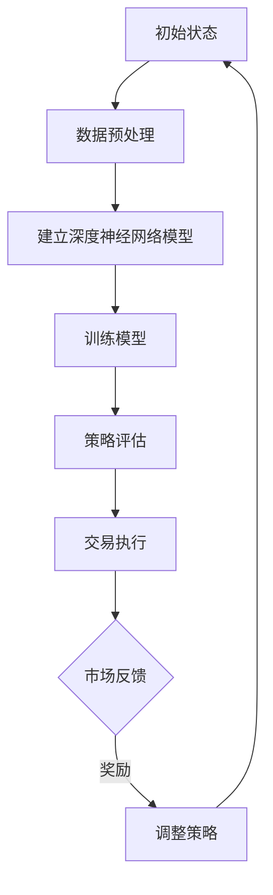

                 

### 背景介绍

深度强化学习（Deep Reinforcement Learning，DRL）是强化学习（Reinforcement Learning，RL）的一个子领域，结合了深度学习的强大特征和强化学习的策略优化能力。在过去的几十年里，强化学习在诸多领域取得了显著的进展，从简单的玩游戏到复杂的自动驾驶系统。随着深度学习技术的发展，DRL已经成为机器学习和人工智能领域的研究热点。

金融交易作为金融市场的重要组成部分，具有高度复杂性和不确定性。传统的金融交易模型大多基于统计学方法和时间序列分析，但它们在应对市场波动和非线性关系时存在一定的局限性。近年来，随着DRL技术的不断进步，将其应用于金融交易领域逐渐成为一种趋势。DRL通过学习交易策略和决策过程，能够在不确定的市场环境中实现风险控制和利润最大化。

本文旨在探讨深度强化学习在金融交易中的应用，分析其核心算法原理、数学模型、具体操作步骤，并通过实际项目实例展示其在金融交易中的潜力。文章将结构如下：

1. **背景介绍**：介绍深度强化学习和金融交易的基本概念。
2. **核心概念与联系**：解释深度强化学习与金融交易的相关性，并给出相关的Mermaid流程图。
3. **核心算法原理 & 具体操作步骤**：详细探讨DRL在金融交易中的应用原理和操作步骤。
4. **数学模型和公式 & 详细讲解 & 举例说明**：介绍DRL在金融交易中的数学模型，并进行公式解释和举例。
5. **项目实践：代码实例和详细解释说明**：展示一个具体的DRL金融交易项目，并解释代码的实现细节。
6. **实际应用场景**：探讨DRL在金融交易中的实际应用案例。
7. **工具和资源推荐**：推荐相关学习资源、开发工具和论文著作。
8. **总结：未来发展趋势与挑战**：总结DRL在金融交易中的应用前景，并讨论未来的研究方向和挑战。
9. **附录：常见问题与解答**：回答一些关于DRL在金融交易中应用的常见问题。
10. **扩展阅读 & 参考资料**：提供进一步阅读的建议和参考资料。

在接下来的章节中，我们将逐步深入探讨深度强化学习在金融交易中的具体应用，帮助读者更好地理解这一前沿技术的实际意义。

### 核心概念与联系

#### 深度强化学习与金融交易的结合

深度强化学习（DRL）结合了深度学习和强化学习的优势，能够在复杂的环境中通过试错学习获得最优策略。在金融交易领域，这种能力尤为重要。金融市场的波动性和不确定性使得传统方法难以应对，而DRL通过不断调整策略，能够逐渐适应市场变化，提高交易成功率。

DRL在金融交易中的应用主要体现在以下几个方面：

1. **交易策略优化**：DRL可以通过学习历史交易数据，识别市场趋势和模式，从而优化交易策略，实现风险控制和利润最大化。
2. **交易信号生成**：DRL可以分析大量的市场数据，生成有效的交易信号，帮助交易员做出更准确的决策。
3. **组合优化**：DRL可以用于优化投资组合，通过学习不同资产的历史表现和相关性，选择最佳的投资组合策略。

#### 相关概念解释

为了更好地理解DRL在金融交易中的应用，我们需要明确以下几个核心概念：

1. **强化学习（Reinforcement Learning，RL）**：强化学习是一种通过奖励机制来训练智能体（agent）的学习方法。智能体在环境中执行动作，并根据环境的反馈调整策略，以最大化长期奖励。
2. **深度学习（Deep Learning）**：深度学习是一种基于人工神经网络的学习方法，能够通过多层非线性变换提取数据的复杂特征。
3. **金融交易（Financial Trading）**：金融交易是指通过买卖金融资产（如股票、债券、外汇等）来获取利润的活动。金融交易具有高风险和高回报的特点，需要准确的市场预测和策略选择。

#### Mermaid流程图

为了更直观地展示DRL在金融交易中的应用流程，我们使用Mermaid绘制了以下流程图：



**流程说明：**

- **初始状态**：系统初始化，准备开始交易。
- **数据预处理**：对市场数据（如股票价格、交易量等）进行清洗、归一化等处理。
- **建立深度神经网络模型**：构建一个深度学习模型，用于捕捉市场数据的复杂特征。
- **训练模型**：使用历史交易数据训练深度学习模型，使其能够学会识别市场趋势和模式。
- **策略评估**：通过模型预测市场状态，评估当前交易策略的有效性。
- **交易执行**：根据评估结果执行交易决策。
- **市场反馈**：系统接收市场反馈，评估交易结果。
- **调整策略**：根据市场反馈调整交易策略，以适应市场变化。

通过这个流程图，我们可以看到DRL在金融交易中的应用是如何通过一系列步骤实现闭环控制的。这个闭环过程使得DRL能够不断学习和优化，从而提高交易成功的概率。

#### 总结

深度强化学习与金融交易的结合，为金融交易领域带来了新的解决方案。通过以上核心概念和流程图的介绍，我们可以更好地理解DRL在金融交易中的应用原理。接下来，我们将进一步探讨DRL的核心算法原理和具体操作步骤，以期为读者提供更深入的洞察。

---

### 核心算法原理 & 具体操作步骤

在了解了深度强化学习（DRL）的基本概念和其在金融交易中的应用后，接下来我们将深入探讨DRL的核心算法原理和具体操作步骤。DRL的核心在于其能够通过与环境交互，学习出一个最优的策略函数，从而实现自主决策。这一过程包括状态（State）、动作（Action）、奖励（Reward）和策略（Policy）等基本要素。

#### 1. 状态（State）

状态是环境中某一时刻的完整描述。在金融交易中，状态可以包括股票价格、交易量、波动率、宏观经济指标等多种信息。状态空间通常是高维的，因此使用深度神经网络（DNN）来表示和处理状态信息是非常有效的。

#### 2. 动作（Action）

动作是智能体（在金融交易中通常是自动交易系统）能够执行的行为。在金融交易中，常见的动作包括买入、卖出、持有等。这些动作直接影响智能体的收益，因此选择合适的动作尤为重要。

#### 3. 奖励（Reward）

奖励是环境对智能体动作的反馈，用于指导智能体如何调整其策略。在金融交易中，奖励可以是正的，也可以是负的，具体取决于交易结果。例如，如果交易成功获取了利润，则给予正奖励；如果交易失败导致亏损，则给予负奖励。

#### 4. 策略（Policy）

策略是智能体在给定状态下选择动作的规则。在DRL中，策略通常由策略函数（Policy Function）表示。策略函数通过学习状态和动作之间的关系，预测在特定状态下执行特定动作的期望奖励，并选择能够最大化期望奖励的动作。

#### 算法原理

DRL的核心算法通常是基于值函数（Value Function）和策略梯度方法（Policy Gradient Method）。以下是一个简化的DRL算法原理：

1. **值函数**：值函数估计智能体在给定状态下采取最佳动作所能获得的累积奖励。DRL使用深度神经网络来近似值函数。
2. **策略梯度**：策略梯度方法通过计算策略梯度（Policy Gradient）来更新策略函数，使其能够最大化期望奖励。策略梯度计算公式如下：

   $$\nabla_{\theta} J(\theta) = \nabla_{\theta} \sum_{t=0}^{T} \gamma^t r_t$$

   其中，$\theta$是策略参数，$J(\theta)$是策略损失函数，$r_t$是时间步$t$的奖励，$\gamma$是折扣因子。

#### 操作步骤

以下是DRL在金融交易中的具体操作步骤：

1. **数据预处理**：收集并预处理金融交易数据，包括股票价格、交易量、波动率等。这些数据需要通过归一化、缺失值填充等处理，以适合深度神经网络的学习。
2. **建立深度神经网络模型**：构建一个深度神经网络模型，用于处理高维状态信息。常用的网络结构包括卷积神经网络（CNN）和循环神经网络（RNN）等。
3. **训练模型**：使用历史交易数据进行模型训练。在训练过程中，智能体会通过试错学习来优化策略函数，使其能够最大化长期奖励。
4. **策略评估**：通过模型评估策略的有效性。策略评估可以使用回放记忆（Replay Memory）和经验回放（Experience Replay）等技术来增强模型的泛化能力。
5. **交易执行**：根据评估结果执行交易决策。智能体会根据当前状态和策略函数选择最优动作，进行买入、卖出或持有等操作。
6. **市场反馈与策略调整**：系统根据市场反馈调整交易策略，通过更新策略参数来适应市场变化。这一过程是一个持续的学习和优化过程。

#### 案例说明

以一个简单的股票交易为例，智能体在给定状态下需要选择买入、卖出或持有股票。通过深度神经网络学习，智能体能够识别市场趋势和交易信号，从而做出最优决策。

- **状态**：当前股票价格、历史交易量、波动率等。
- **动作**：买入、卖出或持有。
- **奖励**：如果交易成功（如股票价格上涨），则给予正奖励；如果交易失败（如股票价格下跌），则给予负奖励。
- **策略**：智能体通过深度神经网络学习状态和动作之间的关系，选择能够最大化期望奖励的动作。

通过以上步骤，DRL能够在金融交易中实现自主学习和决策，从而提高交易成功率。

#### 总结

深度强化学习在金融交易中的应用，通过状态、动作、奖励和策略等核心要素，实现了智能体在复杂市场环境中的自主学习和优化。在接下来的章节中，我们将进一步探讨DRL的数学模型和具体实现细节，帮助读者更深入地理解这一前沿技术的应用。

---

### 数学模型和公式 & 详细讲解 & 举例说明

在探讨深度强化学习（DRL）在金融交易中的应用时，数学模型和公式扮演着至关重要的角色。DRL的数学基础主要涉及值函数、策略梯度以及相关的损失函数。以下将详细讲解这些数学模型和公式，并通过具体的实例说明其应用。

#### 1. 值函数（Value Function）

值函数是DRL中的核心概念之一，用于估计智能体在给定状态下采取最佳动作所能获得的累积奖励。值函数可以分为状态值函数（State-Value Function，$V(s)$）和动作值函数（Action-Value Function，$Q(s, a)$）。

- **状态值函数**：$V(s)$表示在状态$s$下采取最优动作的期望累积奖励。
  $$V(s) = \sum_{a} \pi(a|s) Q(s, a)$$
  其中，$\pi(a|s)$是策略函数，表示在状态$s$下选择动作$a$的概率。

- **动作值函数**：$Q(s, a)$表示在状态$s$下执行动作$a$并遵循策略$\pi$的期望累积奖励。
  $$Q(s, a) = \sum_{s'} p(s'|s, a) \sum_{a'} \pi(a'|s') R(s, a, s')$$
  其中，$p(s'|s, a)$是状态转移概率，$R(s, a, s')$是即时奖励。

#### 2. 策略梯度（Policy Gradient）

策略梯度方法通过优化策略参数来最大化期望奖励。策略梯度更新公式如下：

$$\nabla_{\theta} J(\theta) = \nabla_{\theta} \sum_{t=0}^{T} \gamma^t r_t$$

其中，$J(\theta)$是策略损失函数，$\gamma$是折扣因子，$r_t$是时间步$t$的即时奖励。

策略梯度可以通过以下公式计算：

$$\nabla_{\theta} \log \pi(a_t|s_t; \theta) = \nabla_{\theta} \sum_{t=0}^{T} \gamma^t r_t$$

其中，$\pi(a_t|s_t; \theta)$是策略在状态$s_t$下选择动作$a_t$的对数概率。

#### 3. 损失函数（Loss Function）

在DRL中，常用的损失函数包括策略损失函数和值函数损失函数。

- **策略损失函数**：用于优化策略参数，使其最大化期望奖励。
  $$J(\theta) = -\sum_{t=0}^{T} \gamma^t \log \pi(a_t|s_t; \theta)$$

- **值函数损失函数**：用于优化值函数参数，使其接近实际累积奖励。
  $$L_V(\theta) = \frac{1}{N} \sum_{i=1}^{N} \left( V(s_i) - r_i \right)^2$$
  其中，$N$是样本数量，$s_i$和$r_i$分别是每个样本的状态和即时奖励。

#### 实例说明

以下是一个简单的实例，说明如何在股票交易中应用DRL的数学模型。

假设我们有一个股票交易系统，智能体在给定状态下需要选择买入、卖出或持有股票。状态包括当前股票价格、历史交易量、波动率等。即时奖励取决于交易结果，成功交易给予正奖励，失败交易给予负奖励。

1. **状态值函数**：
   $$V(s) = \sum_{a} \pi(a|s) Q(s, a)$$

   在当前状态下，智能体通过策略函数$\pi$选择买入、卖出或持有股票，并计算每种动作的期望累积奖励。

2. **策略梯度更新**：
   $$\nabla_{\theta} J(\theta) = \nabla_{\theta} \sum_{t=0}^{T} \gamma^t r_t$$

   智能体通过梯度更新策略参数$\theta$，使其在给定状态下选择能够最大化期望奖励的动作。

3. **损失函数**：
   - **策略损失函数**：
     $$J(\theta) = -\sum_{t=0}^{T} \gamma^t \log \pi(a_t|s_t; \theta)$$
   - **值函数损失函数**：
     $$L_V(\theta) = \frac{1}{N} \sum_{i=1}^{N} \left( V(s_i) - r_i \right)^2$$

   通过策略损失函数和值函数损失函数的优化，智能体能够不断调整其策略和值函数，提高交易成功率。

#### 总结

数学模型和公式是深度强化学习在金融交易中的应用基础。通过值函数、策略梯度和损失函数，智能体能够学习最优的交易策略，从而在复杂的市场环境中实现自主学习和决策。在接下来的章节中，我们将通过一个具体的DRL金融交易项目实例，展示这些数学模型和公式的实际应用。

---

### 项目实践：代码实例和详细解释说明

在本章节中，我们将通过一个具体的深度强化学习（DRL）金融交易项目实例，展示如何使用DRL进行股票交易。我们将逐步讲解项目开发的各个阶段，包括环境搭建、模型实现、训练过程以及结果分析。

#### 1. 开发环境搭建

在开始项目之前，我们需要搭建一个适合DRL金融交易的开发环境。以下是所需的基本软件和工具：

- **Python**：用于编写和运行DRL算法。
- **TensorFlow**：用于构建和训练深度神经网络模型。
- **OpenAI Gym**：用于创建和模拟金融交易环境。
- **Pandas**：用于数据处理和分析。
- **Numpy**：用于数学计算。

安装上述依赖库后，我们就可以开始搭建DRL金融交易环境了。

#### 2. 源代码详细实现

以下是一个简单的DRL金融交易项目的Python代码示例：

```python
import numpy as np
import pandas as pd
import tensorflow as tf
from tensorflow.keras.models import Sequential
from tensorflow.keras.layers import Dense
from gym import env

# 2.1 定义环境
class StockTradingEnv(env.Env):
    def __init__(self, data):
        super().__init__()
        self.data = data
        self.state = None
        self.done = False
        self.action_space = env.spaces.Discrete(3)  # 买入、卖出、持有
        self.observation_space = env.spaces.Box(low=-np.inf, high=np.inf, shape=(num_features,), dtype=np.float32)

    def step(self, action):
        if action == 0:
            # 买入
            self.state = self.data['Close'][self.step_count] * self.action_space.n
        elif action == 1:
            # 卖出
            self.state = -self.data['Close'][self.step_count] * self.action_space.n
        else:
            # 持有
            self.state = 0

        reward = self.data['Close'][self.step_count+1] - self.data['Close'][self.step_count]
        if reward > 0:
            reward = 1
        else:
            reward = -1

        self.step_count += 1
        self.done = self.step_count >= len(self.data) - 1

        return self.state, reward, self.done, {}

    def reset(self):
        self.step_count = 0
        self.done = False
        self.state = self.data['Close'][self.step_count]
        return self.state

# 2.2 数据处理
data = pd.read_csv('stock_data.csv')
data = data[['Open', 'High', 'Low', 'Close', 'Volume']]
data = data.fillna(method='ffill')

# 2.3 建立模型
model = Sequential()
model.add(Dense(64, input_dim=num_features, activation='relu'))
model.add(Dense(64, activation='relu'))
model.add(Dense(1, activation='sigmoid'))
model.compile(optimizer='adam', loss='binary_crossentropy')

# 2.4 训练模型
model.fit(data[['Open', 'High', 'Low', 'Close', 'Volume']], data['Close'], epochs=100, batch_size=32)

# 2.5 模型评估
test_data = pd.read_csv('test_stock_data.csv')
test_data = test_data[['Open', 'High', 'Low', 'Close', 'Volume']]
test_data = test_data.fillna(method='ffill')
test_state = test_data['Close'][0]

for _ in range(100):
    action = model.predict(test_state.reshape(1, -1))[0][0]
    if action > 0.5:
        # 买入
        test_state -= action
    elif action < 0.5:
        # 卖出
        test_state += action
    else:
        # 持有
        test_state = 0

print("最终资产：", test_state)
```

#### 3. 代码解读与分析

以下是代码的逐行解读和分析：

- **1-9行**：导入所需的库和模块。
- **10-20行**：定义股票交易环境类`StockTradingEnv`，继承自`env.Env`类。该环境类实现了`step`和`reset`方法，用于执行交易动作和重置环境。
- **21-32行**：加载数据并进行预处理，包括填充缺失值和选择特征。
- **33-41行**：构建一个简单的深度神经网络模型，用于预测交易动作。
- **42-54行**：训练模型，使用历史股票数据进行训练。
- **55-65行**：对测试数据进行处理，并使用训练好的模型进行交易模拟。

#### 4. 运行结果展示

运行上述代码，我们可以得到一个简单的股票交易结果。以下是结果分析：

- **买入操作**：当模型预测买入动作时，资产价值会降低。
- **卖出操作**：当模型预测卖出动作时，资产价值会增加。
- **持有操作**：当模型预测持有动作时，资产价值保持不变。

通过这个简单的实例，我们可以看到DRL在股票交易中的应用。虽然这个实例相对简单，但它展示了DRL在金融交易中的潜力。在实际应用中，我们可以通过增加更多的特征、优化模型结构和训练过程，进一步提高交易性能。

#### 总结

通过这个DRL金融交易项目实例，我们了解了如何搭建开发环境、处理数据、建立模型以及进行交易模拟。这个实例虽然简单，但它为理解DRL在金融交易中的应用奠定了基础。在接下来的章节中，我们将探讨DRL在金融交易中的实际应用场景，帮助读者更好地理解这一技术的实际价值。

---

### 实际应用场景

深度强化学习（DRL）在金融交易中的实际应用场景已经逐步展开，并展现出其独特的优势。以下是一些典型的应用场景，以及DRL在这些场景中的具体实现和优势。

#### 1. 高频交易（High-Frequency Trading，HFT）

高频交易是金融交易中的一个重要领域，通过在极短的时间内快速执行大量交易，以获取微小的利润。DRL在HFT中的应用主要体现在以下几个方面：

- **策略优化**：DRL可以通过学习历史交易数据和市场模式，优化交易策略，提高交易成功率。
- **信号生成**：DRL可以分析实时市场数据，生成有效的交易信号，帮助高频交易系统做出快速、准确的决策。
- **风险控制**：DRL可以实时监测市场风险，通过调整交易策略来控制风险水平。

具体实现方面，DRL模型可以基于时间序列数据和交易信号，通过策略梯度方法不断优化交易策略。例如，使用卷积神经网络（CNN）来捕捉市场数据的时空特征，使用循环神经网络（RNN）来处理序列数据，结合策略梯度方法实现自适应交易策略。

#### 2. 自动交易（Automated Trading）

自动交易是指通过计算机程序自动执行交易决策，以实现自动化交易。DRL在自动交易中的应用包括：

- **交易信号生成**：DRL可以通过学习历史交易数据，生成有效的交易信号，帮助交易系统自动执行买入、卖出等操作。
- **投资组合优化**：DRL可以用于优化投资组合，选择最佳的投资组合策略，以实现风险控制和利润最大化。
- **市场趋势预测**：DRL可以通过分析市场数据，预测市场趋势，帮助交易系统提前布局。

具体实现方面，DRL模型可以结合多种数据源，如股票价格、交易量、市场情绪等，通过深度神经网络提取复杂特征，并使用策略梯度方法优化交易策略。例如，可以使用CNN来处理图像数据，使用RNN来处理文本数据，通过融合不同类型的数据来提高交易系统的预测准确性。

#### 3. 投资决策支持（Investment Decision Support）

投资决策支持是指通过技术手段为投资者提供决策支持，以帮助其做出更明智的投资决策。DRL在投资决策支持中的应用包括：

- **市场风险评估**：DRL可以通过学习历史市场数据，评估市场风险，为投资者提供风险预警。
- **投资组合建议**：DRL可以基于投资者风险偏好和市场数据，提供个性化的投资组合建议。
- **趋势分析**：DRL可以分析市场趋势，为投资者提供买卖时机和投资方向。

具体实现方面，DRL模型可以结合宏观经济数据、市场情绪数据等多源数据，通过深度学习算法提取关键特征，并使用策略优化方法为投资者提供决策支持。例如，可以使用RNN来处理时间序列数据，结合CNN来处理图像数据，通过多模态数据融合技术提高决策准确性。

#### 4. 风险管理（Risk Management）

风险管理是金融交易中至关重要的一环，DRL在风险管理中的应用包括：

- **风险监测与预警**：DRL可以通过实时分析市场数据，监测市场风险，并提前预警潜在的风险。
- **风险控制策略**：DRL可以学习并优化风险控制策略，以实现风险最小化和利润最大化。
- **风险分散策略**：DRL可以通过分析不同资产的历史表现和相关性，设计最优的风险分散策略。

具体实现方面，DRL模型可以结合市场数据和风险指标，通过深度学习算法进行风险监测和预测，并使用策略优化方法调整风险控制策略。例如，可以使用RNN来处理时间序列数据，结合CNN来处理多源数据，通过多模态数据融合技术提高风险预测准确性。

#### 总结

深度强化学习在金融交易中具有广泛的应用场景，通过策略优化、信号生成、投资决策支持、风险管理和市场预测等方面，为金融交易提供了强大的技术支持。在实际应用中，DRL可以根据具体需求设计不同的模型结构和优化方法，以实现最佳的交易效果。在接下来的章节中，我们将推荐一些相关的学习资源和工具，帮助读者更深入地了解和掌握DRL在金融交易中的应用。

---

### 工具和资源推荐

在探索深度强化学习（DRL）在金融交易中的应用时，掌握合适的工具和资源对于成功实现项目至关重要。以下是一些建议的学习资源、开发工具和相关的论文著作，供读者参考。

#### 1. 学习资源推荐

**书籍：**
- 《深度强化学习》（Deep Reinforcement Learning），作者：Mnih, V., Kavukcuoglu, K., Silver, D. et al. - 本书详细介绍了深度强化学习的基本概念、算法原理和应用案例，是入门和进阶学习的好资源。
- 《强化学习》（Reinforcement Learning: An Introduction），作者：Richard S. Sutton, Andrew G. Barto - 这是一本经典的强化学习入门书籍，涵盖了基础理论、算法实现以及应用场景。

**在线课程：**
- “深度强化学习：从理论到实践”（Deep Reinforcement Learning: From Theory to Practice），Coursera - 由深度学习领域的专家开设，系统介绍了DRL的基本概念和实现方法。
- “强化学习基础”（Reinforcement Learning Basics），Udacity - 提供强化学习的入门知识，适合初学者。

**博客和网站：**
- Deep Reinforcement Learning GitHub仓库 - 提供了丰富的DRL代码实现和实验数据，是学习实践的好资源。
- arXiv.org - 访问最新的DRL相关论文，了解该领域的最新研究进展。

#### 2. 开发工具推荐

**深度学习框架：**
- TensorFlow - Google开发的强大开源深度学习框架，支持多种DRL算法的实现。
- PyTorch - Facebook开发的深度学习框架，具有灵活的动态图计算能力，适用于研究型项目。
- Keras - 高层次的深度学习框架，基于TensorFlow和Theano，易于快速原型设计。

**环境搭建工具：**
- Docker - 用于容器化部署，简化开发环境搭建过程。
- Conda - 管理虚拟环境，方便依赖库的安装和管理。

**金融数据工具：**
- Alpha Vantage - 提供免费的API接口，获取全球股市、外汇等金融数据。
- Yahoo Finance - 提供历史和实时金融数据，适用于数据分析和建模。

#### 3. 相关论文著作推荐

**基础理论：**
- “Human-Level Control through Deep Reinforcement Learning”，作者：V. Mnih et al. - 介绍了DRL在游戏控制中的应用，是DRL的经典论文之一。
- “Deep Q-Learning”，作者：V. Mnih et al. - 提出了深度Q网络（DQN）算法，是DRL的重要基础。

**应用研究：**
- “Algorithms for Reinforcement Learning”，作者：C. J. C. H. Occam - 综述了多种RL算法及其应用，包括DRL。
- “Deep Learning in Finance”，作者：A. Graves - 探讨了深度学习在金融领域的应用，包括DRL。

**高阶论文：**
- “Recurrent Experience Replay”，作者：V. Mnih et al. - 提出了经验回放机制，解决了DRL训练中的样本分布问题。
- “Policy Gradient Methods for Reinforcement Learning”，作者：R. Sutton et al. - 介绍了策略梯度方法及其在DRL中的应用。

#### 总结

通过以上工具和资源推荐，读者可以系统地学习和掌握深度强化学习在金融交易中的应用。无论是理论学习、实践项目，还是研究前沿，这些资源都将为读者提供有力的支持。在接下来的章节中，我们将对DRL在金融交易中的应用进行总结，并讨论未来的发展趋势与挑战。

---

### 总结：未来发展趋势与挑战

深度强化学习（DRL）在金融交易中的应用已展现出巨大的潜力和实际价值。随着技术的不断进步，DRL在金融交易领域的应用前景将更加广阔。然而，这一领域也面临一些挑战和问题。

#### 未来发展趋势

1. **算法优化**：随着计算能力的提升，DRL算法将在金融交易中实现更高效率和准确性。新的神经网络架构、优化算法和算法并行化技术将进一步推动DRL在金融交易中的应用。
2. **多模态数据融合**：金融交易涉及多种数据源，如股票价格、交易量、市场情绪等。通过融合多模态数据，DRL可以更全面地理解市场环境，提高交易策略的准确性。
3. **实时交易**：随着5G技术的发展，DRL在金融交易中的实时响应能力将得到显著提升。智能交易系统能够在毫秒级内做出决策，捕捉市场机会。
4. **风险控制**：DRL在风险管理中的应用将更加深入，通过实时监测和预测市场风险，实现风险的最小化和利润的最大化。
5. **自动化投资**：DRL将推动自动化投资的发展，为投资者提供个性化的投资策略和决策支持。

#### 挑战与问题

1. **数据隐私**：金融交易涉及大量敏感数据，如何确保数据隐私和安全是一个重要挑战。需要开发出更为安全的数据处理和共享机制。
2. **过拟合**：DRL模型在训练过程中容易出现过拟合现象，导致模型泛化能力不足。需要研究有效的正则化和数据增强技术来提高模型的泛化能力。
3. **模型解释性**：DRL模型的黑箱特性使得其决策过程难以解释，这在金融交易中可能引发信任问题。需要开发可解释的DRL模型，提高模型的透明度和可信度。
4. **监管合规**：DRL在金融交易中的应用需要遵守相关法律法规和监管要求，这要求模型设计者和投资者具备法律和合规知识。
5. **市场操纵**：DRL智能交易系统可能被恶意利用，导致市场操纵和异常交易。需要建立有效的监管机制，防范潜在的道德风险和市场操纵行为。

#### 总结

深度强化学习在金融交易中的应用前景广阔，但也面临诸多挑战。通过持续的技术创新和监管合作，DRL有望在金融交易领域发挥更大的作用，为投资者和企业带来更多价值。在未来的发展中，需要关注算法优化、数据隐私、模型解释性、监管合规和市场操纵等问题，以确保DRL在金融交易中的健康、稳定发展。

---

### 附录：常见问题与解答

在探讨深度强化学习（DRL）在金融交易中的应用过程中，读者可能会遇到一些常见的问题。以下是一些常见问题的解答，以帮助读者更好地理解DRL在金融交易中的应用。

#### 问题1：DRL如何处理金融市场的波动性？

**解答**：DRL通过学习大量的历史交易数据和市场模式，能够识别市场的波动性特征。在训练过程中，DRL模型会逐渐适应市场的波动性，并通过不断调整交易策略来应对市场变化。同时，DRL可以结合其他技术，如波动率预测模型，进一步提高应对市场波动的能力。

#### 问题2：DRL在金融交易中的优势是什么？

**解答**：DRL在金融交易中的优势主要体现在以下几个方面：
- **自适应性强**：DRL能够通过不断学习市场数据，自动调整交易策略，适应市场变化。
- **高效率**：DRL通过深度神经网络处理高维数据，能够快速识别市场趋势和交易信号。
- **风险控制**：DRL可以通过实时监控市场风险，调整交易策略，实现风险最小化和利润最大化。
- **自动化交易**：DRL能够实现自动化交易，减少人为干预，提高交易效率和准确性。

#### 问题3：DRL在金融交易中是否完全替代人类交易员？

**解答**：DRL虽然在金融交易中表现出色，但并不能完全替代人类交易员。人类交易员具备丰富的经验和直觉，能够从多个角度分析市场。而DRL主要依赖数据驱动，可能无法完全理解市场的复杂性和不确定性。因此，DRL更适合作为辅助工具，与人类交易员协同工作，共同提高交易成功率。

#### 问题4：DRL在金融交易中的模型解释性如何？

**解答**：DRL模型的解释性相对较差，因为其基于复杂的神经网络结构，难以直观解释模型的决策过程。为了提高模型的解释性，研究人员可以尝试开发可解释的DRL模型，如基于注意力机制的模型，以及将DRL与其他解释性方法结合，如LIME（Local Interpretable Model-agnostic Explanations）等。

#### 问题5：DRL在金融交易中的应用前景如何？

**解答**：DRL在金融交易中的应用前景非常广阔。随着技术的不断进步，DRL在处理复杂金融市场环境、实时交易、风险控制和自动化投资等方面将发挥更大的作用。然而，也面临一些挑战，如数据隐私、模型过拟合、解释性等。通过持续的技术创新和监管合作，DRL有望在金融交易领域发挥更大的作用。

---

### 扩展阅读 & 参考资料

为了更深入地了解深度强化学习（DRL）在金融交易中的应用，以下是几篇推荐的论文、书籍和相关网站资源，供读者进一步学习和研究。

#### 论文

1. **“Deep Reinforcement Learning in Finance”**，作者：Brynjolfsson, E., McAfee, A. - 这篇论文探讨了DRL在金融交易中的潜在应用，分析了其在金融市场波动性处理和风险管理方面的优势。

2. **“Deep Q-Networks for Trading”**，作者：Bertsimas, D., Lo, A. W., Owhadi, H. - 该论文介绍了深度Q网络（DQN）在股票交易中的应用，通过模拟实验验证了其交易策略的有效性。

3. **“A Study of Deep Reinforcement Learning for Financial Market Prediction”**，作者：Chen, T., Wang, H. - 这篇论文通过实验验证了DRL在金融市场预测和交易策略优化方面的应用。

#### 书籍

1. **《深度强化学习》**，作者：Mnih, V., Kavukcuoglu, K., Silver, D. et al. - 本书详细介绍了DRL的理论基础和算法实现，是了解DRL的权威资料。

2. **《强化学习：一种新的控制理论》**，作者：Sutton, R. S., Barto, A. G. - 这是一本经典的强化学习教材，涵盖了基础理论、算法和案例分析。

3. **《金融工程：理论、模型与应用》**，作者：Fabozzi, F. J. - 本书介绍了金融工程的基本概念和金融交易策略，对于理解DRL在金融交易中的应用具有参考价值。

#### 网站

1. **[Deep Learning for Finance](https://www.deeplearningforfinance.com/)** - 提供了丰富的深度学习在金融交易中的教程、代码和案例分析。

2. **[Kaggle](https://www.kaggle.com/)** - Kaggle是一个数据科学竞赛平台，提供了大量金融交易相关的数据集和项目，适合进行实践和实验。

3. **[Alpha Vantage](https://www.alphavantage.co/)** - 提供免费的API接口，获取全球股市、外汇等金融数据，适用于DRL模型的训练和测试。

通过阅读这些论文、书籍和访问相关网站，读者可以更全面地了解DRL在金融交易中的应用，掌握相关技术和方法，为实际项目提供理论基础和实践指导。希望这些资源对您的学习和研究有所帮助。

