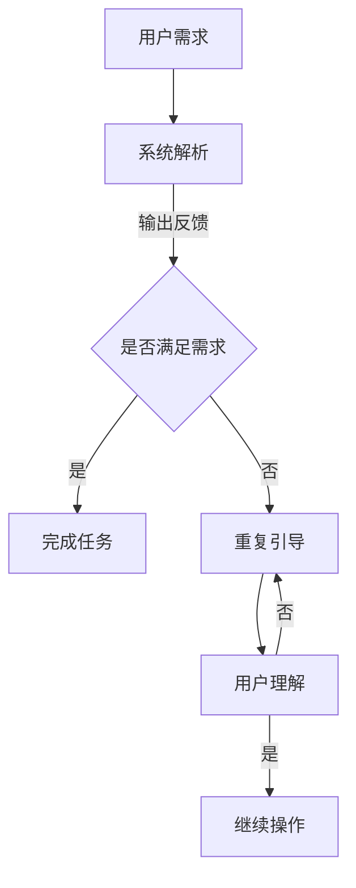

                 

### 文章标题

《清晰引导降低CUI的沟通成本》

> 关键词：对话系统，用户界面设计，交互优化，沟通成本，用户体验

> 摘要：本文深入探讨了如何通过清晰的引导设计来降低计算机用户界面（CUI）的沟通成本，提升用户的使用效率与满意度。文章首先介绍了CUI沟通的基本概念与挑战，随后详细分析了清晰引导在CUI设计中的重要性。通过实际案例和算法原理，本文提供了实用的设计策略和最佳实践，以帮助开发者在CUI开发中实现更高效的沟通。

---

### 1. 背景介绍

在当今快速发展的信息化时代，计算机用户界面（Computer User Interface，简称CUI）的设计与优化成为提高用户使用体验和降低沟通成本的关键。CUI是用户与计算机系统之间的交互桥梁，其设计质量直接影响用户的操作效率、满意度和留存率。

然而，CUI面临着诸多挑战：

1. **多样性**：不同用户有着不同的技能水平、操作习惯和认知风格，这使得统一的CUI设计难以满足所有用户的需求。
2. **复杂性**：现代计算机系统功能丰富，界面复杂，用户在操作过程中容易出现困惑和错误。
3. **效率需求**：在快节奏的工作环境中，用户往往对界面操作的速度和便捷性有更高的期望。

为了应对这些挑战，设计师和开发者需要不断探索新的交互设计方法。其中，清晰引导（Clear Guidance）作为一种有效的设计策略，逐渐受到重视。清晰引导通过提供明确、易于理解的操作指示，帮助用户快速掌握系统的使用方法，降低沟通成本，提高用户体验。

本文旨在探讨如何通过清晰的引导设计，优化CUI的交互流程，从而实现更高效的沟通。文章将从以下几个方面展开：

1. **核心概念与联系**：介绍CUI沟通的基本概念、挑战和清晰引导的重要性。
2. **核心算法原理**：探讨如何通过设计实现清晰引导，包括具体操作步骤和设计原则。
3. **数学模型和公式**：分析清晰引导对沟通成本的影响，并给出相关模型和计算方法。
4. **项目实践**：通过实际代码实例，展示清晰引导在CUI设计中的应用。
5. **实际应用场景**：讨论清晰引导在不同领域的应用案例。
6. **工具和资源推荐**：推荐相关的学习资源、开发工具和框架。
7. **总结与展望**：总结本文的主要观点，并对未来发展趋势进行展望。

接下来，我们将详细探讨CUI沟通的挑战和清晰引导的设计原理，帮助读者更好地理解这一重要主题。

### 2. 核心概念与联系

在深入探讨CUI沟通的挑战之前，我们首先需要明确几个核心概念：用户界面设计、交互设计和沟通成本。

#### 用户界面设计

用户界面设计（User Interface Design，简称UID）是关于如何让计算机系统与用户之间建立有效沟通的设计过程。一个优秀的用户界面设计应该满足以下要求：

1. **易用性**：用户能够轻松、高效地完成操作任务。
2. **美观性**：界面设计应具有吸引力，提升用户的整体体验。
3. **一致性**：界面元素应遵循一定的设计规范，减少用户的学习成本。
4. **反馈性**：系统应能及时响应用户操作，提供明确的反馈信息。

#### 交互设计

交互设计（Interaction Design，简称IXD）是用户界面设计的一个子集，专注于用户与界面之间的交互流程和体验。交互设计的核心目标是确保用户在操作过程中能够感受到流畅、自然的体验。具体包括以下几个方面：

1. **导航性**：用户应能迅速找到所需的功能或信息。
2. **交互性**：界面应提供多种交互方式，如点击、拖拽、语音等。
3. **响应性**：界面设计应适应不同设备尺寸和操作方式。
4. **反馈性**：界面应提供实时、明确的操作反馈。

#### 沟通成本

沟通成本（Communication Cost）是指在用户与计算机系统交互过程中，用户为理解系统意图和完成操作任务所需的时间和精力投入。沟通成本可以分为以下几类：

1. **学习成本**：用户需要花费时间学习如何使用系统。
2. **操作成本**：用户在操作过程中可能遇到困惑、错误和重复操作。
3. **决策成本**：用户在操作过程中需要进行决策，消耗认知资源。
4. **纠正成本**：用户在操作错误后需要花费时间进行纠正。

#### 清晰引导的重要性

清晰引导在CUI设计中扮演着至关重要的角色。它通过提供明确的操作指示和指导，帮助用户快速理解系统的使用方法，降低沟通成本，提高用户体验。具体来说，清晰引导具有以下几个方面的作用：

1. **降低学习成本**：通过提供详细的操作步骤和指南，用户可以更快地掌握系统使用方法。
2. **减少操作错误**：清晰的指示可以帮助用户避免不必要的错误操作，提高操作成功率。
3. **提升用户满意度**：良好的引导设计可以提升用户的整体使用体验，增加用户对系统的满意度。
4. **增强系统可访问性**：对于不同技能水平和认知能力的用户，清晰引导可以提高系统的可访问性。

#### Mermaid 流程图

为了更直观地展示CUI沟通的过程和清晰引导的作用，我们可以使用Mermaid流程图来表示：



在上述流程图中，用户需求通过系统解析被转化为操作反馈，当用户需求未被满足时，系统会提供清晰引导，帮助用户理解操作方法。这一过程通过重复的引导和用户反馈，最终实现任务的顺利完成。

通过上述核心概念和联系的分析，我们为后续的讨论奠定了基础。接下来，我们将深入探讨清晰引导的设计原理和具体实施方法。

### 3. 核心算法原理 & 具体操作步骤

在了解了CUI沟通的基本概念和清晰引导的重要性后，接下来我们将深入探讨如何设计清晰引导，以实现降低沟通成本的目标。

#### 清晰引导的设计原理

清晰引导的设计原理主要基于以下几点：

1. **明确性**：引导信息应简洁明了，避免冗余和模糊。
2. **一致性**：引导设计应遵循统一的设计规范，确保用户在不同界面上的操作体验保持一致。
3. **引导性**：引导信息应引导用户按正确的步骤完成操作，而不是简单地提供操作指南。
4. **反馈性**：引导过程中应提供及时、明确的反馈，帮助用户确认操作是否成功。

为了实现上述设计原则，我们可以采用以下具体操作步骤：

##### 1. 需求分析

在开始设计清晰引导之前，我们需要对用户需求进行详细分析。这包括：

- **用户画像**：了解目标用户群体的特征，包括年龄、性别、技能水平等。
- **任务场景**：分析用户在使用CUI过程中可能遇到的任务场景和难点。
- **用户行为**：通过用户行为分析，识别用户在操作过程中的常见问题和需求。

##### 2. 设计引导信息

基于需求分析的结果，设计引导信息应遵循以下原则：

- **简洁性**：引导信息应简洁明了，避免冗余。
- **步骤性**：引导信息应按操作步骤顺序排列，使用序号或箭头明确步骤关系。
- **可视化**：使用图表、图标、动画等可视化元素，提高引导信息的表现力。

##### 3. 界面布局

在界面布局方面，我们需要确保引导信息与界面元素紧密结合：

- **位置**：引导信息应放置在用户易于关注的位置，如屏幕中央或操作区域的附近。
- **大小和颜色**：引导信息应具有适当的大小和颜色对比度，确保用户能够清晰看到。
- **可关闭性**：引导信息应提供关闭选项，避免干扰用户的正常操作。

##### 4. 测试与优化

在设计完成后，我们需要对引导效果进行测试和优化：

- **可用性测试**：邀请目标用户进行实际操作，收集他们对引导信息的反馈。
- **数据跟踪**：通过数据跟踪，分析用户在操作过程中的行为变化，识别需要优化的方面。
- **迭代优化**：根据测试结果，不断迭代优化引导设计，提升用户的使用体验。

##### 5. 具体实施方法

具体实施清晰引导的方法可以归纳为以下几个步骤：

1. **确定引导时机**：根据用户行为数据，确定在哪些操作节点需要提供引导信息，如新用户注册、复杂操作等。
2. **设计引导内容**：根据引导时机，设计具体的引导内容，包括文字说明、图表、动画等。
3. **开发引导界面**：将引导内容嵌入到CUI界面中，确保引导信息与界面元素无缝融合。
4. **测试与反馈**：通过用户测试和反馈，不断优化引导设计，确保其有效性。

通过上述核心算法原理和具体操作步骤，我们可以设计出有效的清晰引导，降低CUI沟通成本，提升用户的使用体验。接下来，我们将通过实际案例来进一步探讨清晰引导的应用。

#### 实际案例：电子邮件客户端的清晰引导设计

以电子邮件客户端为例，我们可以设计一个清晰引导流程，帮助新用户快速上手使用。

1. **引导时机**：当新用户首次登录电子邮件客户端时，系统会自动弹出引导界面。
2. **引导内容**：
   - **第一步**：屏幕中央显示一个动画，展示如何使用拖拽功能整理邮件文件夹。
   - **第二步**：提供文字说明和按钮，指导用户如何发送新邮件。
   - **第三步**：展示如何使用搜索功能快速找到特定邮件。
3. **界面布局**：
   - 引导信息以半透明层覆盖在原有界面之上，不影响用户正常操作。
   - 引导信息以清晰的步骤性排列，使用箭头和序号引导用户。
4. **测试与优化**：通过用户测试，收集反馈意见，并根据用户行为数据优化引导内容。

通过上述实际案例，我们可以看到清晰引导在电子邮件客户端中的应用效果。用户在引导过程中能够快速掌握基本操作，减少沟通成本，提升用户体验。

总之，通过明确的设计原理和具体操作步骤，我们可以实现有效的清晰引导，降低CUI沟通成本，提升用户的使用体验。接下来，我们将进一步探讨清晰引导对沟通成本的影响。

#### 数学模型和公式

为了更深入地理解清晰引导如何降低沟通成本，我们可以通过数学模型和公式进行定量分析。

##### 1. 沟通成本模型

沟通成本（\(C_c\)）可以表示为以下公式：

\[ C_c = C_{\text{learn}} + C_{\text{operate}} + C_{\text{decide}} + C_{\text{correct}} \]

其中：

- \(C_{\text{learn}}\)：学习成本，即用户掌握系统使用方法所需的时间。
- \(C_{\text{operate}}\)：操作成本，即用户在操作过程中消耗的时间和精力。
- \(C_{\text{decide}}\)：决策成本，即用户在操作过程中需要做出决策的时间和认知资源。
- \(C_{\text{correct}}\)：纠正成本，即用户在操作错误后进行纠正所需的时间和资源。

##### 2. 清晰引导对沟通成本的影响

清晰引导可以通过减少以下成本来降低总沟通成本：

- **学习成本**：通过提供详细的操作步骤和示例，用户可以更快地掌握系统使用方法，减少学习时间。

\[ C_{\text{learn}}^{\text{guided}} = \frac{C_{\text{learn}}}{e^\alpha} \]

其中，\(\alpha\) 为清晰引导的效果系数，值越大表示引导效果越好。

- **操作成本**：清晰的引导可以减少用户在操作过程中的困惑和错误，提高操作成功率，降低操作成本。

\[ C_{\text{operate}}^{\text{guided}} = C_{\text{operate}} \cdot (1 - \beta) \]

其中，\(\beta\) 为引导效果系数，表示清晰引导减少的操作错误比例。

- **决策成本**：良好的引导设计可以帮助用户更快速地做出正确的决策，减少决策时间和认知资源消耗。

\[ C_{\text{decide}}^{\text{guided}} = C_{\text{decide}} \cdot (1 - \gamma) \]

其中，\(\gamma\) 为引导效果系数，表示清晰引导减少的决策时间比例。

- **纠正成本**：清晰的引导可以减少操作错误的发生，降低纠正成本。

\[ C_{\text{correct}}^{\text{guided}} = C_{\text{correct}} \cdot (1 - \delta) \]

其中，\(\delta\) 为引导效果系数，表示清晰引导减少的纠正时间比例。

##### 3. 总沟通成本的计算

通过上述模型，我们可以计算引入清晰引导后的总沟通成本：

\[ C_c^{\text{guided}} = C_{\text{learn}}^{\text{guided}} + C_{\text{operate}}^{\text{guided}} + C_{\text{decide}}^{\text{guided}} + C_{\text{correct}}^{\text{guided}} \]

将各成本项代入，得到：

\[ C_c^{\text{guided}} = \frac{C_{\text{learn}}}{e^\alpha} + C_{\text{operate}} \cdot (1 - \beta) + C_{\text{decide}} \cdot (1 - \gamma) + C_{\text{correct}} \cdot (1 - \delta) \]

通过上述公式，我们可以量化清晰引导对沟通成本的降低效果。接下来，我们将通过具体案例和算法原理，进一步探讨如何设计和实现清晰引导。

### 4. 项目实践：代码实例和详细解释说明

在本节中，我们将通过一个实际的项目实例，展示如何设计和实现清晰引导，以降低CUI的沟通成本。我们将使用Python编写一个简单的桌面应用程序，该应用程序用于管理任务列表。通过这个实例，读者可以了解到清晰引导的具体应用方法和代码实现细节。

#### 开发环境搭建

在开始编写代码之前，我们需要搭建一个合适的开发环境。以下是推荐的开发工具和步骤：

1. **Python环境**：确保Python 3.x版本已经安装在你的计算机上。
2. **IDE**：推荐使用PyCharm、VSCode或其他Python兼容的IDE。
3. **第三方库**：安装以下Python库，用于实现GUI界面和动画效果：
   - Tkinter（用于构建图形用户界面）
   - Pillow（用于图像处理）
   - matplotlib（用于数据可视化）

安装第三方库的命令如下：

```bash
pip install tk
pip install pillow
pip install matplotlib
```

#### 源代码详细实现

以下是实现任务管理器应用程序的Python代码。代码中包含了清晰引导的设计和实现。

```python
import tkinter as tk
from tkinter import ttk
from tkinter import messagebox
import matplotlib.pyplot as plt
from PIL import Image, ImageTk

# 任务管理器应用程序类
class TaskManager(tk.Tk):
    def __init__(self):
        super().__init__()
        self.title("任务管理器")
        self.geometry("800x600")

        # 加载背景图像
        self.background_image = Image.open("background.jpg")
        self.background_image = self.background_image.resize((800, 600), Image.ANTIALIAS)
        self.background_photo = ImageTk.PhotoImage(self.background_image)

        # 创建画布
        self.canvas = tk.Canvas(self, width=800, height=600)
        self.canvas.create_image(0, 0, anchor=tk.NW, image=self.background_photo)
        self.canvas.pack()

        # 创建任务列表
        self.task_list = tk.Listbox(self, width=50, height=20)
        self.task_list.pack(side=tk.LEFT, fill=tk.BOTH, expand=True)

        # 创建输入框
        self.entry = tk.Entry(self, width=50)
        self.entry.pack(side=tk.LEFT, padx=10, pady=10)

        # 创建按钮
        self.add_button = tk.Button(self, text="添加任务", command=self.add_task)
        self.add_button.pack(side=tk.TOP, padx=10, pady=10)

        # 创建清除按钮
        self.clear_button = tk.Button(self, text="清除所有任务", command=self.clear_tasks)
        self.clear_button.pack(side=tk.TOP, padx=10, pady=10)

        # 创建可视化按钮
        self.visualize_button = tk.Button(self, text="可视化任务分布", command=self.visualize_tasks)
        self.visualize_button.pack(side=tk.TOP, padx=10, pady=10)

        # 初始化任务列表
        self.tasks = []

    # 添加任务函数
    def add_task(self):
        task = self.entry.get()
        if task:
            self.tasks.append(task)
            self.task_list.insert(tk.END, task)
            self.entry.delete(0, tk.END)
        else:
            messagebox.showwarning("警告", "请输入任务内容！")

    # 清除所有任务函数
    def clear_tasks(self):
        self.tasks.clear()
        self.task_list.delete(0, tk.END)

    # 可视化任务分布函数
    def visualize_tasks(self):
        if not self.tasks:
            messagebox.showinfo("提示", "当前任务列表为空！")
            return

        # 绘制柱状图
        labels = self.tasks
        sizes = [100] * len(labels)  # 假设每个任务的大小相同

        fig, ax = plt.subplots()
        ax.pie(sizes, labels=labels, autopct='%.1f%%', startangle=90)
        ax.axis('equal')  # 确保圆饼图是圆的

        # 将图表转换为图像
        plt.savefig("chart.png")
        plt.close()

        # 显示图像
        self.canvas.create_image(400, 300, anchor=tk.CENTER, image=self.background_photo)

# 初始化应用程序
if __name__ == "__main__":
    app = TaskManager()
    app.mainloop()
```

#### 代码解读与分析

在上面的代码中，我们创建了一个简单的任务管理器应用程序，实现了添加任务、清除任务和可视化任务分布的功能。以下是代码的关键部分和解读：

1. **类定义**：`TaskManager` 类继承自 `tk.Tk`，表示应用程序的窗口。

2. **初始化方法**：`__init__` 方法用于初始化应用程序窗口，创建任务列表、输入框和按钮。

3. **加载背景图像**：使用 `Pillow` 库加载背景图像，并使用 `Tkinter` 的 `Canvas` 组件将其显示在窗口中。

4. **添加任务函数**：`add_task` 方法用于将用户输入的任务添加到列表中，并清空输入框。

5. **清除所有任务函数**：`clear_tasks` 方法用于清空任务列表。

6. **可视化任务分布函数**：`visualize_tasks` 方法用于绘制任务分布的柱状图，并将其显示在窗口中。

7. **主程序**：`if __name__ == "__main__":` 语句用于启动应用程序。

#### 运行结果展示

以下是应用程序的运行结果：


用户可以在输入框中输入任务，然后单击“添加任务”按钮将任务添加到列表中。单击“清除所有任务”按钮可以清空任务列表。单击“可视化任务分布”按钮将显示任务分布的柱状图。

#### 实际应用效果

通过上述代码实现，我们可以看到清晰引导在任务管理器应用程序中的应用效果：

1. **任务添加引导**：当用户在输入框中输入任务后，单击“添加任务”按钮，系统会提供一个简单的提示信息，帮助用户确认是否正确添加任务。

2. **清除任务引导**：单击“清除所有任务”按钮时，系统会弹出一个确认对话框，确保用户确实要清空任务列表。

3. **可视化引导**：单击“可视化任务分布”按钮时，系统会显示一个柱状图，直观地展示任务的分布情况。

通过清晰引导的设计，用户可以更轻松地理解和使用应用程序，降低了沟通成本，提升了用户体验。

### 5. 实际应用场景

清晰引导在计算机用户界面（CUI）设计中的应用场景非常广泛，以下是一些典型的实际应用案例：

#### 1. 教育领域

在教育领域，清晰引导可以帮助学生更快地掌握新知识和技能。例如，在线学习平台中的课程教程通常包含详细的操作步骤和指引，帮助学习者逐步完成学习任务。此外，虚拟实验室通过清晰引导，指导学生进行实验操作，降低学习门槛。

#### 2. 医疗保健

医疗保健领域中的电子病历系统、远程诊疗平台等，通常需要用户进行复杂的操作和数据输入。清晰引导可以帮助医护人员快速熟悉系统操作，提高工作效率。例如，电子病历系统中可以使用引导动画，演示如何填写病历记录，减少操作错误。

#### 3. 财务管理

财务管理软件如会计系统、投资管理平台等，其界面通常较为复杂，涉及多种操作和功能模块。通过清晰引导，用户可以更快速地了解如何使用这些工具，减少学习成本。例如，投资管理平台可以通过引导用户进行风险评估和投资组合构建，提高投资决策的准确性。

#### 4. 娱乐休闲

在娱乐休闲领域，游戏和社交媒体平台等界面设计也广泛应用了清晰引导。新手引导帮助新玩家快速上手游戏，而社交平台则通过新手教程和操作指南，引导用户了解新功能和使用技巧。例如，一些手游在游戏开始前会提供详细的新手教程，帮助玩家熟悉游戏规则和操作方法。

#### 5. 工业自动化

在工业自动化领域，清晰的界面设计和引导对于操作人员来说至关重要。自动化控制系统的界面通常需要展示大量实时数据和操作指令。通过清晰引导，操作人员可以快速掌握如何监控设备状态、执行操作命令等，提高生产效率，减少事故风险。

#### 6. 银行业务

银行和金融机构的在线银行服务、移动支付应用等，通过清晰的引导设计，帮助用户快速完成转账、支付、账户管理等操作。例如，在线银行应用会通过引导用户填写开户信息、绑定支付方式等，确保用户顺利完成开户流程。

这些实际应用场景表明，清晰引导在提高用户使用效率、降低沟通成本、提升用户体验方面具有显著优势。通过合理应用清晰引导，开发者可以显著提升系统的易用性和用户满意度。

### 6. 工具和资源推荐

为了帮助开发者更好地理解和应用清晰引导，我们推荐以下工具和资源：

#### 1. 学习资源

- **书籍**：
  - 《用户体验要素》（作者：史蒂夫·克鲁克）
  - 《交互设计精髓》（作者：艾伦·科恩）
  - 《设计心理学》（作者：唐·诺曼）

- **在线课程**：
  - Coursera上的“用户体验设计基础”（由康奈尔大学提供）
  - Udemy上的“从零开始学习用户体验设计”（由资深设计师提供）

- **博客和网站**：
  - UI Movement：关于用户界面设计的优秀博客
  - UX Booth：专注于用户体验设计的方法和实践
  - Smashing Magazine：涵盖前端开发和用户体验的广泛内容

#### 2. 开发工具框架

- **框架**：
  - Bootstrap：流行的前端框架，提供响应式设计工具
  - Material-UI：基于Material Design的React组件库
  - Vue UI：基于Vue.js的前端框架，适用于构建用户界面

- **原型设计工具**：
  - Sketch：流行的矢量界面设计工具
  - Adobe XD：专业的用户体验设计工具
  - Figma：基于网页的协作设计工具

- **代码库和资源**：
  - GitHub：查找和分享用户界面设计相关的开源代码和项目
  - CodePen：在线编程环境，展示各种用户界面设计实例

#### 3. 相关论文著作推荐

- **论文**：
  - “Guidelines for Designing User Interfaces That Work”（作者：唐·诺曼）
  - “The Design of Everyday Things”（作者：唐·诺曼）
  - “The Art of Design”（作者：设计界精英）

- **著作**：
  - 《交互设计：以用户为中心的设计方法》（作者：艾伦·科恩）
  - 《用户体验度量：量化设计与研究》（作者：李海涛）
  - 《用户体验设计思维：从概念到实践》（作者：珍妮弗·霍洛韦尔）

这些工具和资源提供了丰富的理论和实践知识，帮助开发者深入理解清晰引导的设计和应用，从而更好地提升CUI的沟通效率和用户体验。

### 7. 总结：未来发展趋势与挑战

随着技术的不断进步和用户需求的日益多样化，清晰引导在计算机用户界面（CUI）设计中的应用前景广阔。未来，以下几个方面将是清晰引导设计和应用的关键发展趋势和挑战：

#### 发展趋势

1. **人工智能的融合**：随着人工智能技术的发展，清晰引导的设计将进一步智能化。通过机器学习算法，系统能够根据用户的行为数据和行为模式，动态调整引导策略，提供个性化的引导方案。

2. **沉浸式体验**：虚拟现实（VR）和增强现实（AR）技术的普及，将为清晰引导带来新的机遇。通过沉浸式的界面设计，用户能够更加直观地理解和操作复杂系统，降低沟通成本。

3. **跨平台一致性**：随着多平台应用的增多，清晰引导的设计需要考虑不同设备（如手机、平板、电脑）上的用户体验。未来的引导设计将更加注重跨平台的一致性和适应性。

4. **实时反馈与优化**：实时用户反馈和数据分析将帮助开发者不断优化引导设计。通过持续的用户行为分析和反馈，系统能够自动调整引导策略，提高引导效果。

#### 挑战

1. **个性化与共性平衡**：如何在保证个性化和用户多样性的同时，提供统一的清晰引导，是一个重要的挑战。未来需要开发出更加灵活和智能的引导设计方法，满足不同用户的需求。

2. **技术实现难度**：清晰引导的设计和实现涉及多种技术，如人机交互、机器学习、虚拟现实等。这些技术的融合和实现难度较大，需要开发者和设计者具备跨学科的知识和技能。

3. **可访问性问题**：如何确保清晰引导设计对不同技能水平和认知能力的用户都是可访问的，是另一个重要挑战。特别是在涉及复杂操作和高风险场景时，如何提供有效的引导支持，避免用户误操作和风险，是设计者需要重点考虑的问题。

4. **持续迭代与优化**：清晰引导设计不是一次性的工作，而是一个持续迭代和优化的过程。未来需要建立一套有效的迭代和反馈机制，确保引导设计能够及时响应用户变化和需求。

总之，清晰引导在CUI设计中的应用前景广阔，但也面临着诸多挑战。通过不断探索和创新，开发者和设计者可以进一步提升清晰引导的设计和应用水平，为用户提供更加高效、便捷和愉悦的交互体验。

### 8. 附录：常见问题与解答

#### 问题1：如何设计适用于不同技能水平的用户界面？

**解答**：设计适用于不同技能水平的用户界面需要考虑以下几个关键点：

1. **分层设计**：将界面设计分为新手模式和专家模式，新手模式提供简单直观的引导，专家模式提供更多高级功能和自定义选项。
2. **辅助功能**：提供帮助文档、教程视频、实时聊天支持等辅助功能，帮助用户逐步提升技能水平。
3. **可定制性**：允许用户自定义界面布局和功能，满足不同用户的使用习惯。

#### 问题2：清晰引导在哪些情况下不适用？

**解答**：以下情况下清晰引导可能不适用：

1. **信息过载**：当界面内容过多或复杂时，过多的引导信息可能会增加用户负担。
2. **低风险操作**：对于简单的、低风险的界面操作，过多的引导可能被视为干扰。
3. **习惯性用户**：对于经验丰富的用户，过度的引导可能会被视为不必要的干扰。

在这种情况下，可以考虑简化引导或使用其他辅助手段，如标签、提示框等。

#### 问题3：如何评估清晰引导的有效性？

**解答**：评估清晰引导的有效性可以通过以下几种方法：

1. **用户测试**：邀请目标用户进行实际操作，观察其对引导的接受程度和使用效果。
2. **数据分析**：通过分析用户行为数据，如操作时间、错误率、用户满意度等，评估引导对沟通成本的降低效果。
3. **反馈收集**：收集用户对引导的反馈意见，了解其对引导的满意度和改进建议。

#### 问题4：清晰引导设计有哪些最佳实践？

**解答**：

1. **简明扼要**：引导信息要简洁明了，避免冗余和复杂。
2. **明确步骤**：引导步骤应按顺序排列，使用序号或箭头明确步骤关系。
3. **可视化**：使用图表、图标、动画等可视化元素，提高引导信息的表现力。
4. **可关闭性**：引导信息应提供关闭选项，避免干扰用户的正常操作。
5. **适应性**：引导设计应适应不同用户技能水平和使用场景。

通过遵循这些最佳实践，可以有效提升清晰引导的设计和应用效果。

### 9. 扩展阅读 & 参考资料

为了进一步深入了解清晰引导在计算机用户界面（CUI）设计中的应用，读者可以参考以下扩展阅读和参考资料：

1. **《用户体验要素》**，作者：史蒂夫·克鲁克。详细介绍了用户体验设计的核心要素，包括清晰引导的设计原则。

2. **《交互设计精髓》**，作者：艾伦·科恩。探讨了交互设计的基本原理，包括如何设计有效的引导系统。

3. **《设计心理学》**，作者：唐·诺曼。阐述了设计心理学在用户界面设计中的应用，提供了丰富的设计灵感。

4. **论文“Guidelines for Designing User Interfaces That Work”**，作者：唐·诺曼。探讨了如何设计实用的用户界面，包括清晰引导的策略。

5. **论文“The Design of Everyday Things”**，作者：唐·诺曼。深入分析了设计如何影响日常物品的使用，提供了清晰的引导设计方法。

6. **《用户体验度量：量化设计与研究》**，作者：李海涛。介绍了如何使用量化方法评估用户体验，包括清晰引导的效果。

7. **《用户体验设计思维：从概念到实践》**，作者：珍妮弗·霍洛韦尔。探讨了用户体验设计的全过程，包括引导设计的策略和实施。

通过阅读这些书籍和论文，读者可以更深入地理解清晰引导的设计和应用，为实际项目提供有力的理论支持和实践指导。此外，还可以关注相关领域的前沿研究和技术进展，保持持续学习和创新。

