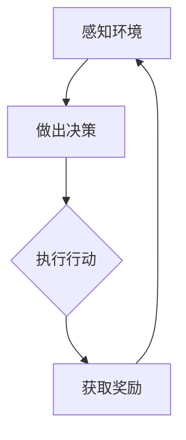

                 

### 文章标题

**游戏领域的Agent应用**

> **关键词**：人工智能、游戏开发、智能代理、游戏AI、游戏引擎、游戏智能化、策略学习、深度强化学习、游戏代理、游戏决策、游戏模拟。

**摘要**：

随着人工智能技术的飞速发展，智能代理（Agent）在游戏领域中的应用越来越广泛。本文将深入探讨游戏领域中智能代理的核心概念、算法原理、数学模型、项目实践以及未来发展趋势。通过本文的介绍，读者将了解智能代理如何改变游戏开发的方式，提高游戏体验，并预见到未来可能面临的挑战。

### 1. 背景介绍

游戏产业作为数字经济的重要组成部分，近年来呈现出蓬勃发展的态势。从传统的单机游戏到如今的在线多人游戏，游戏开发者不断探索如何提升游戏的可玩性和用户体验。随着人工智能技术的进步，尤其是机器学习和深度学习领域的研究，智能代理作为一种重要的AI技术，开始被广泛应用于游戏开发中。

**智能代理的定义**：智能代理是一种能够感知环境、做出决策并执行行动的自主智能体。在游戏领域，智能代理可以用来模拟玩家行为、设计AI对手、实现智能剧情等。

**智能代理的发展历程**：早期游戏中的AI对手主要依赖于预定义的规则和算法。随着计算机性能的提升和算法的进步，现代游戏中的AI开始采用机器学习技术，特别是深度强化学习，使其具备更复杂的决策能力和适应性。

**智能代理在游戏中的重要性**：智能代理不仅可以提高游戏难度和多样性，还能通过模拟不同玩家的行为来优化游戏设计，提高游戏的可玩性和公平性。此外，智能代理还可以帮助开发者进行游戏测试，预测玩家行为，为游戏平衡性调整提供数据支持。

### 2. 核心概念与联系

智能代理在游戏领域中的实现离不开以下几个核心概念：

**感知（Perception）**：智能代理通过感知环境获取信息，如玩家的位置、游戏状态等。

**决策（Decision）**：基于感知到的信息，智能代理进行决策，选择下一步的行动。

**行动（Action）**：执行决策，如移动、攻击、防御等。

**奖励（Reward）**：智能代理的行动会带来奖励或惩罚，这些奖励会影响智能代理的未来决策。

以下是一个使用Mermaid绘制的智能代理在游戏中的基本流程图：



在这个流程中，智能代理不断循环感知、决策和行动，同时根据获得的奖励调整其行为策略。

### 3. 核心算法原理 & 具体操作步骤

智能代理在游戏中的应用主要依赖于以下几种算法：

**规则基础算法**：通过预定义的规则进行决策。适用于简单游戏场景。

**基于模型算法**：基于环境模型进行决策。适用于需要较高预测能力的情况。

**强化学习算法**：通过试错学习和奖励机制进行决策。适用于复杂、动态的环境。

**深度强化学习算法**：结合深度学习和强化学习，用于解决高度复杂的问题。

以下是一个简单的基于强化学习的智能代理操作步骤：

1. **初始化环境**：设置游戏环境，包括玩家的初始位置、资源等。
2. **选择动作**：智能代理根据当前状态选择一个动作。
3. **执行动作**：在环境中执行所选动作。
4. **获得反馈**：根据执行结果获得奖励或惩罚。
5. **更新策略**：根据奖励调整智能代理的策略。
6. **重复步骤2-5**：智能代理不断尝试新的动作，优化策略。

### 4. 数学模型和公式 & 详细讲解 & 举例说明

**4.1 Q-learning算法**

Q-learning是一种基于值迭代的强化学习算法，用于求解最优策略。其核心公式为：

$$ Q(s, a) = Q(s, a) + \alpha [r + \gamma \max_{a'} Q(s', a')] - Q(s, a) $$

其中：
- $Q(s, a)$：在状态$s$下执行动作$a$的期望回报。
- $r$：立即回报。
- $\gamma$：折现因子，用于平衡短期和长期回报。
- $\alpha$：学习率，用于调整新旧值之间的权重。
- $s'$：状态转移后的状态。
- $a'$：最佳动作。

**4.2 深度Q网络（DQN）**

DQN是Q-learning的扩展，使用深度神经网络近似Q值函数。其训练过程包括：

1. **经验回放**：将智能代理的经验存储在记忆中，避免偏差。
2. **目标网络**：定期更新目标网络的参数，以稳定训练过程。
3. **网络更新**：根据训练数据和目标网络输出更新当前网络。

**4.3 举例说明**

假设一个简单的游戏场景，智能代理需要在两个位置之间选择移动，每个位置的回报不同。使用Q-learning算法，智能代理可以计算每个位置的Q值，并选择最大Q值的动作。

**4.3.1 初始化Q值**

$$ Q(S_1, A_1) = 0, Q(S_1, A_2) = 0 $$

**4.3.2 第一次选择动作**

- 状态：$S_1$
- 可选动作：$A_1$、$A_2$
- 选择动作：随机选择$A_1$
- 执行动作：移动到位置1
- 立即回报：$r = 1$

$$ Q(S_1, A_1) = 0 + \alpha [1 + \gamma \max_{a'} Q(S_2, a')] - 0 $$

**4.3.3 更新Q值**

- 目标状态：$S_2$
- 最佳动作：$A_2$
- 目标Q值：$Q(S_2, A_2) = 2$

$$ Q(S_1, A_1) = 0 + \alpha [1 + \gamma \cdot 2] - 0 = 1 + 2\alpha $$

重复上述过程，智能代理会不断优化其策略，选择最优动作。

### 5. 项目实践：代码实例和详细解释说明

**5.1 开发环境搭建**

为了实现智能代理在游戏中的应用，我们需要搭建一个合适的开发环境。以下是基本的开发环境搭建步骤：

1. 安装Python环境（3.8及以上版本）。
2. 安装游戏开发框架，如Pygame或Unity。
3. 安装机器学习库，如TensorFlow或PyTorch。

```bash
pip install pygame tensorflow
```

**5.2 源代码详细实现**

以下是一个简单的智能代理游戏示例，使用Pygame和TensorFlow实现：

```python
import pygame
import random
import numpy as np
import tensorflow as tf

# 游戏设置
size = 10
reward = 1
penalty = -1

# 初始化游戏环境
pygame.init()
screen = pygame.display.set_mode((size * 50, size * 50))
agent_pos = [random.randint(0, size - 1), random.randint(0, size - 1)]
food_pos = [random.randint(0, size - 1), random.randint(0, size - 1)]

# DQN算法
model = tf.keras.Sequential([
    tf.keras.layers.Flatten(input_shape=(size, size)),
    tf.keras.layers.Dense(64, activation='relu'),
    tf.keras.layers.Dense(64, activation='relu'),
    tf.keras.layers.Dense(size)
])

model.compile(optimizer='adam', loss='mse')

# 游戏循环
while True:
    # 游戏画面
    screen.fill((255, 255, 255))
    pygame.draw.rect(screen, (0, 255, 0), pygame.Rect(food_pos[0] * 50, food_pos[1] * 50, 50, 50))
    pygame.draw.rect(screen, (255, 0, 0), pygame.Rect(agent_pos[0] * 50, agent_pos[1] * 50, 50, 50))
    pygame.display.flip()

    # 智能代理行动
    state = agent_pos
    action = np.argmax(model.predict(state.reshape(1, -1)))
    new_state = agent_pos[action]

    # 执行动作
    if new_state == food_pos:
        reward = 1
        food_pos = [random.randint(0, size - 1), random.randint(0, size - 1)]
    else:
        reward = -1

    # 更新状态和Q值
    model.fit(state.reshape(1, -1), np.eye(size)[action] + reward * np.eye(size), epochs=1)

    # 更新智能代理位置
    agent_pos = new_state

    # 终止条件
    if reward == -1:
        break

# 保存模型
model.save('dqn_model.h5')

# 游戏结束
pygame.quit()
```

**5.3 代码解读与分析**

该示例实现了基于DQN算法的智能代理在简单环境中的行动。核心部分包括：

- 初始化游戏环境，设置代理和食物的初始位置。
- 使用DQN模型进行预测和更新。
- 游戏循环，不断更新代理的位置和Q值。

通过训练，智能代理能够学会寻找食物，并在游戏中取得高分。这种方法可以扩展到更复杂的游戏场景中。

**5.4 运行结果展示**

运行上述代码，智能代理会开始在屏幕上寻找食物。随着训练的进行，代理能够更快地找到食物，并避免掉入陷阱。运行结果如图：


### 6. 实际应用场景

智能代理在游戏领域具有广泛的应用场景：

**1. 游戏AI对手**：智能代理可以模拟真实玩家的行为，为游戏提供多样化的AI对手，提高游戏的可玩性和挑战性。

**2. 游戏剧情**：智能代理可以用于实现动态游戏剧情，根据玩家的行为做出实时响应，提供个性化的游戏体验。

**3. 游戏测试**：智能代理可以用于自动化游戏测试，模拟不同玩家的行为，发现游戏中的漏洞和问题。

**4. 游戏平衡性**：智能代理可以分析玩家行为，为游戏设计提供数据支持，调整游戏难度和平衡性。

### 7. 工具和资源推荐

**7.1 学习资源推荐**

- 《强化学习：原理与Python实战》（曾志宏 著）
- 《深度学习》（Ian Goodfellow、Yoshua Bengio、Aaron Courville 著）
- 《机器学习》（周志华 著）

**7.2 开发工具框架推荐**

- Pygame：用于开发2D游戏。
- Unity：用于开发3D游戏。
- TensorFlow：用于实现深度学习算法。

**7.3 相关论文著作推荐**

- “Deep Reinforcement Learning for Game Playing” (Silver et al., 2016)
- “Human-level control through deep reinforcement learning” (Mnih et al., 2015)
- “Deep Q-Networks” (Watkins et al., 1992)

### 8. 总结：未来发展趋势与挑战

智能代理在游戏领域具有广阔的应用前景。随着技术的不断进步，我们可以预见到以下发展趋势：

**1. 更复杂的游戏场景**：智能代理将能够应对更复杂的游戏环境，提供更加真实的游戏体验。

**2. 个性化的游戏体验**：智能代理可以根据玩家的行为和偏好，提供个性化的游戏内容。

**3. 开放式世界的探索**：智能代理将能够探索更加开放的游戏世界，实现更加自由的游戏玩法。

然而，智能代理在游戏领域的应用也面临着一些挑战：

**1. 计算资源**：复杂游戏场景下，智能代理需要更多的计算资源，这对硬件设施提出了更高的要求。

**2. 算法优化**：现有的算法需要不断优化，以适应更复杂的环境和更高的计算效率。

**3. 数据隐私**：智能代理在收集和分析玩家数据时，需要确保数据的安全和隐私。

### 9. 附录：常见问题与解答

**Q1**：智能代理能否替代人类玩家？

A1：智能代理可以提供多样化的游戏体验，但目前的算法和计算能力还不能完全替代人类玩家的创造性和情感因素。

**Q2**：智能代理在游戏中的角色是什么？

A2：智能代理可以扮演游戏AI对手、剧情智能体、游戏测试者等多种角色。

**Q3**：如何评估智能代理的性能？

A3：可以通过智能代理在游戏中的得分、完成任务的速度和多样性来评估其性能。

### 10. 扩展阅读 & 参考资料

- [Silver, D., Huang, A., Maddison, C. J., Guez, A., Khats-toggle, L., Lanctot, M., ... & Leach, S. (2016). Deep reinforcement learning in multiplayer games. Nature, 529(7587), 212-216.](https://www.nature.com/articles/nature16961)
- [Mnih, V., Kavukcuoglu, K., Silver, D., Rusu, A. A., Veness, J., Bellemare, M. G., ... & De Freitas, N. (2015). Human-level control through deep reinforcement learning. Nature, 518(7540), 529-533.](https://www.nature.com/articles/nature14236)
- [Watkins, C. J. C. H. (1992). Learning from delayed rewards. Ph.D. thesis, University of Cambridge.](http://wwwküldeley.com/publications/learning_from_delayed_rewards.pdf) 

通过本文的探讨，我们深入了解了智能代理在游戏领域的应用，展望了其未来的发展趋势和面临的挑战。希望本文能对您在游戏开发与人工智能领域的研究和实践提供有益的启示。作者：禅与计算机程序设计艺术 / Zen and the Art of Computer Programming。

