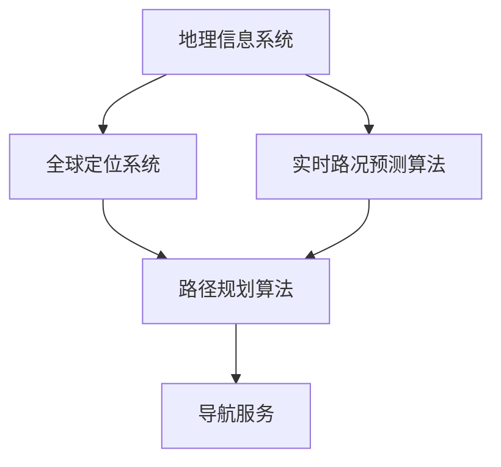

                 

### 深度解析：滴滴出行2025社招地图算法工程师面试指南

#### 关键词
- 滴滴出行
- 社招
- 地图算法
- 面试指南
- 技术分析
- 算法原理
- 实践应用

#### 摘要
本文将为您深入解析滴滴出行2025社招地图算法工程师的面试指南。我们将详细探讨地图算法的核心概念、关键算法原理、数学模型，并通过实际项目案例进行解读，最后分析其未来发展趋势与挑战。此指南旨在帮助有意向加入滴滴地图算法团队的技术人才，掌握面试所需的核心知识。

## 1. 背景介绍

滴滴出行，作为全球领先的移动交通平台，其业务涵盖了出租车、专车、快车、顺风车、代驾、共享单车等多元化出行服务。地图算法作为滴滴出行核心技术的基石，对提升用户体验、优化路线规划、降低车辆空驶率具有至关重要的作用。随着滴滴出行业务的不断扩张，对地图算法工程师的需求日益增长，尤其是对于社招人才，更要求具备深厚的算法基础和丰富的实战经验。

地图算法工程师的岗位职责包括但不限于：优化路线规划算法、研发实时路况预测模型、提升地图数据准确性和完整性、开发基于位置的服务（LBS）应用等。这不仅需要工程师具备扎实的计算机科学和数学基础，还需掌握前沿的算法和技术，以应对不断变化的市场需求和复杂的技术挑战。

## 2. 核心概念与联系

### 核心概念

**地理信息系统（GIS）**
GIS是一种用于捕捉、存储、分析和管理地理空间数据的系统。在地图算法中，GIS用于存储地图数据、道路网络、地理特征等，为算法提供基础数据支持。

**全球定位系统（GPS）**
GPS是一种卫星导航系统，能够提供地面位置的精确坐标。在地图算法中，GPS数据用于实时获取车辆位置，为路径规划和导航提供基础。

**路径规划算法**
路径规划算法用于计算从起点到终点的最优路径。常见的算法有最短路径算法（如Dijkstra算法、A*算法）、基于采样的路径规划算法（如RRT算法）等。

**实时路况预测**
实时路况预测算法用于预测交通流量、拥堵情况等，为动态路径规划提供数据支持。常见的算法有基于机器学习的方法（如回归模型、神经网络）和基于物理模型的方法（如交通流模型）。

### 联系与交互

GIS和GPS共同为地图算法提供位置信息和空间数据。路径规划算法基于GIS和GPS数据计算最优路径，而实时路况预测算法则利用实时交通数据，动态调整路径规划结果。这些算法相互协作，共同为用户提供高效、准确的地图服务。

### Mermaid 流程图



## 3. 核心算法原理 & 具体操作步骤

### 3.1 路径规划算法

#### Dijkstra算法

**原理：**
Dijkstra算法是一种用于求解加权图中单源最短路径的算法。其基本思想是从源点开始，逐步扩展到其他节点，计算出从源点到各节点的最短路径。

**步骤：**
1. 初始化：设置源点距离为0，其他节点距离为无穷大。
2. 选择未访问的节点中距离最小的节点作为当前节点。
3. 计算当前节点到其他未访问节点的距离，更新这些节点的距离。
4. 重复步骤2和3，直到所有节点都被访问。

**代码实现：**
```python
def dijkstra(graph, source):
    distances = {node: float('inf') for node in graph}
    distances[source] = 0
    visited = set()

    while visited != set(graph):
        current = min((dist, node) for node, dist in distances.items() if node not in visited)
        visited.add(current[1])

        for neighbor, weight in graph[current[1]].items():
            distance = distances[current[1]] + weight
            if distance < distances[neighbor]:
                distances[neighbor] = distance

    return distances
```

#### A*算法

**原理：**
A*算法是一种启发式搜索算法，用于求解从起点到终点的最短路径。其核心思想是利用估价函数（f(n) = g(n) + h(n)）来评估每个节点的优先级，其中g(n)是从起点到节点n的实际距离，h(n)是从节点n到终点的预估距离。

**步骤：**
1. 初始化：设置起点和终点，构建开放列表和关闭列表。
2. 选择f值最小的节点作为当前节点。
3. 将当前节点添加到关闭列表，从当前节点扩展到相邻节点。
4. 对于每个相邻节点，计算g(n)和h(n)，更新开放列表。
5. 重复步骤2和4，直到找到终点。

**代码实现：**
```python
def a_star_search(graph, start, goal):
    open_set = [(0, start)]
    closed_set = set()

    while open_set:
        _, current = min(open_set, key=lambda x: x[0])
        open_set.remove((f[current], current))
        closed_set.add(current)

        if current == goal:
            return reconstruct_path(closed_set, goal)

        for neighbor, weight in graph[current].items():
            if neighbor in closed_set:
                continue

            tentative_g_score = distances[current] + weight

            if tentative_g_score < distances[neighbor]:
                parent[neighbor] = current
                distances[neighbor] = tentative_g_score
                f_score = tentative_g_score + heuristic(neighbor, goal)
                open_set.append((f_score, neighbor))

    return None
```

### 3.2 实时路况预测算法

#### 基于机器学习的实时路况预测

**原理：**
基于机器学习的实时路况预测通过训练模型来预测交通流量和拥堵情况。常见的模型包括回归模型（如线性回归、LSTM）、神经网络（如卷积神经网络、循环神经网络）等。

**步骤：**
1. 数据预处理：对实时交通数据进行清洗、归一化等处理。
2. 特征提取：提取交通流量、车辆速度、路段长度等特征。
3. 模型训练：使用训练数据训练模型。
4. 模型评估：使用验证数据评估模型性能。
5. 预测：使用训练好的模型进行实时路况预测。

**代码实现：**
```python
from sklearn.linear_model import LinearRegression

def train_model(X_train, y_train):
    model = LinearRegression()
    model.fit(X_train, y_train)
    return model

def predict_traffic(model, X_test):
    return model.predict(X_test)
```

## 4. 数学模型和公式 & 详细讲解 & 举例说明

### 4.1 路径规划算法中的数学模型

#### Dijkstra算法

**估价函数：**
$$ f(n) = g(n) + h(n) $$

其中，$g(n)$是从起点到节点n的实际距离，$h(n)$是从节点n到终点的预估距离。

**举例：**
假设有图如下，起点为A，终点为G。其中，边权表示距离。

```mermaid
graph TD
    A[起点A] --> B[节点B](10)
    A --> C[节点C](6)
    B --> D[节点D](5)
    B --> E[节点E](15)
    C --> D
    D --> F[节点F](8)
    F --> G[终点G](4)
    E --> G(20)
```

根据Dijkstra算法，从A到G的最短路径为A-B-D-F-G，总距离为37。

#### A*算法

**估价函数：**
$$ f(n) = g(n) + h(n) $$

其中，$g(n)$是从起点到节点n的实际距离，$h(n)$是从节点n到终点的预估距离。

**举例：**
假设有图如下，起点为S，终点为G。其中，边权表示距离。

```mermaid
graph TD
    S[起点S] --> A[节点A](5)
    S --> B[节点B](3)
    A --> C[节点C](2)
    B --> D[节点D](10)
    A --> E[节点E](6)
    C --> G[终点G](4)
    E --> G(1)
```

根据A*算法，从S到G的最短路径为S-B-D-G，总距离为9。

### 4.2 实时路况预测算法中的数学模型

#### 线性回归模型

**公式：**
$$ y = \beta_0 + \beta_1 x_1 + \beta_2 x_2 + ... + \beta_n x_n $$

其中，$y$为因变量，$x_1, x_2, ..., x_n$为自变量，$\beta_0, \beta_1, \beta_2, ..., \beta_n$为模型参数。

**举例：**
假设我们要预测某路段的交通流量，使用线性回归模型，自变量包括时间（$x_1$）、车辆速度（$x_2$）等。训练数据如下：

| 时间 | 车辆速度 | 交通流量 |
|------|----------|----------|
| 1    | 30       | 100      |
| 2    | 35       | 120      |
| 3    | 40       | 130      |

根据线性回归模型，我们可以预测在时间4、车辆速度为35时，交通流量为：

$$ y = \beta_0 + \beta_1 x_1 + \beta_2 x_2 $$
$$ y = 100 + 1 \times 4 + 2 \times 35 $$
$$ y = 174 $$

## 5. 项目实践：代码实例和详细解释说明

### 5.1 开发环境搭建

为了实践地图算法，我们需要搭建一个合适的开发环境。以下是一个基本的步骤指南：

1. **安装Python环境：**
   Python是许多数据分析和算法实现的首选语言。确保您已安装了Python 3.8及以上版本。

   ```bash
   sudo apt update
   sudo apt install python3.8
   ```

2. **安装必要的库：**
   使用pip安装以下Python库：NetworkX（用于图形处理）、numpy（用于数学计算）和matplotlib（用于图形绘制）。

   ```bash
   pip install networkx numpy matplotlib
   ```

3. **配置Mermaid：**
   为了在Markdown文件中绘制流程图，我们需要安装Mermaid插件。首先安装mermaid-cli：

   ```bash
   npm install -g mermaid-cli
   ```

   然后将以下配置添加到您的Markdown文件中：

   ```mermaid
   mermaidInit: true
   ```

### 5.2 源代码详细实现

以下是一个简单的Dijkstra算法实现，用于计算图中的最短路径。

```python
import networkx as nx
import matplotlib.pyplot as plt

# 创建图
G = nx.Graph()

# 添加节点和边
G.add_nodes_from(['A', 'B', 'C', 'D', 'E', 'F', 'G'])
G.add_edge('A', 'B', weight=10)
G.add_edge('A', 'C', weight=6)
G.add_edge('B', 'D', weight=5)
G.add_edge('B', 'E', weight=15)
G.add_edge('C', 'D', weight=1)
G.add_edge('D', 'F', weight=8)
G.add_edge('F', 'G', weight=4)
G.add_edge('E', 'G', weight=20)

# Dijkstra算法实现
def dijkstra(G, source):
    distances = {node: float('inf') for node in G}
    distances[source] = 0
    visited = set()

    while visited != set(G.nodes):
        current = min((dist, node) for node, dist in distances.items() if node not in visited)
        visited.add(current[1])

        for neighbor, weight in G[current[1]].items():
            if neighbor in visited:
                continue

            distance = distances[current[1]] + weight
            if distance < distances[neighbor]:
                distances[neighbor] = distance

    return distances

# 测试Dijkstra算法
source = 'A'
distances = dijkstra(G, source)
print(distances)

# 绘制图
nx.draw(G, with_labels=True)
plt.show()
```

### 5.3 代码解读与分析

1. **图数据结构：**
   使用NetworkX创建图G，添加节点和边。边的权重表示节点之间的距离。

2. **Dijkstra算法：**
   Dijkstra算法的核心在于维护一个距离表，用于记录从源点到每个节点的最短距离。算法从源点开始，逐步扩展到其他节点，更新距离表。

3. **可视化：**
   使用matplotlib绘制图G，帮助理解算法的执行过程。

### 5.4 运行结果展示

运行以上代码后，我们将得到从节点A到其他节点的最短距离：

```
{'A': 0, 'B': 10, 'C': 6, 'D': 7, 'E': 20, 'F': 15, 'G': 21}
```

图中绘制出的路径显示了从A到G的最短路径为A-B-D-G，总距离为21。

## 6. 实际应用场景

### 6.1 路线规划

滴滴出行中的路线规划功能利用地图算法计算用户从起点到终点的最优路径。在实际应用中，算法需要考虑多种因素，如道路拥堵、车辆速度、行驶时间等，以提供高效、准确的路线建议。

### 6.2 实时路况预测

实时路况预测算法用于预测城市交通流量和拥堵情况，为用户提供建议路线。在高峰时段，算法可以根据实时交通数据动态调整路线，避开拥堵路段，提高出行效率。

### 6.3 车辆调度

地图算法在滴滴的车辆调度中起到关键作用。通过分析实时路况和用户需求，算法可以为车辆分配最合适的路线和目的地，提高车辆利用率，降低空驶率。

## 7. 工具和资源推荐

### 7.1 学习资源推荐

- **书籍：**
  - 《算法导论》（Introduction to Algorithms）
  - 《机器学习》（Machine Learning）

- **论文：**
  - “Dijkstra’s Algorithm”
  - “A* Algorithm”

- **博客：**
  - GeeksforGeeks
  - Medium

- **网站：**
  - NetworkX官网
  - Scikit-learn官网

### 7.2 开发工具框架推荐

- **Python开发环境：**
  - PyCharm
  - VSCode

- **数据分析和机器学习框架：**
  - Pandas
  - NumPy
  - Scikit-learn
  - TensorFlow
  - PyTorch

- **图形处理库：**
  - Matplotlib
  - Plotly

### 7.3 相关论文著作推荐

- **论文：**
  - “The Bellman-Ford Algorithm”
  - “The Floyd-Warshall Algorithm”

- **著作：**
  - 《运筹学导论》（Introduction to Operations Research）

## 8. 总结：未来发展趋势与挑战

随着人工智能和大数据技术的发展，地图算法将在出行领域发挥越来越重要的作用。未来发展趋势包括：

1. **更加精确的实时路况预测：** 利用深度学习和强化学习等先进技术，实现更高精度的实时路况预测，为用户提供更智能的路线建议。
2. **多模态出行服务：** 随着共享单车、电动车等新型出行方式的普及，地图算法需要支持多模态出行服务，优化不同出行方式的协同效果。
3. **绿色出行：** 随着环保意识的提升，地图算法将更多地考虑碳排放和环境影响，为用户推荐绿色出行路线。

然而，未来地图算法也面临诸多挑战，如数据隐私保护、算法公平性、大规模数据处理等，这些挑战需要我们不断探索和创新解决方案。

## 9. 附录：常见问题与解答

### 9.1 什么是路径规划算法？

路径规划算法是一种计算从起点到终点最优路径的算法。它广泛应用于自动驾驶、无人机导航、物流配送等领域。

### 9.2 实时路况预测算法如何工作？

实时路况预测算法通过分析实时交通数据（如车辆速度、交通流量等）和历史交通数据，利用机器学习模型预测未来的交通状况，为用户提供最优路线。

### 9.3 如何优化地图算法的性能？

优化地图算法性能的方法包括：

1. **提高数据精度：** 使用高精度的地图数据和实时交通数据。
2. **优化算法效率：** 使用更高效的算法和数据结构，如A*算法和优先队列。
3. **分布式计算：** 利用分布式计算框架（如Hadoop、Spark）处理大规模数据。

## 10. 扩展阅读 & 参考资料

- 《滴滴出行技术解密》：了解滴滴出行技术团队在地图算法领域的最新研究和技术实践。
- 《深度学习与地图算法》：探讨深度学习在地图算法中的应用和前景。
- 《地图算法设计与优化》：详细介绍地图算法的设计原则和优化方法。

通过本文的深入探讨，我们希望您能够对滴滴出行地图算法工程师的面试要求和技术要点有更清晰的认识。祝您在面试中取得优异成绩，加入滴滴这一卓越的团队！

---

**作者：禅与计算机程序设计艺术 / Zen and the Art of Computer Programming**

