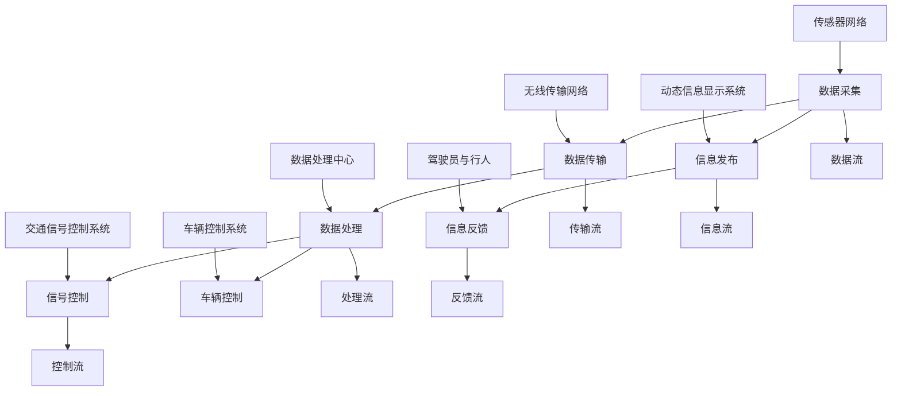

                 

### 背景介绍

#### 滴滴智慧交通的概念

滴滴智慧交通，是滴滴出行旗下的重要战略项目，致力于利用先进的技术手段和数据分析能力，优化城市交通系统，提升出行效率，降低交通拥堵，改善空气质量，提高城市居民的生活质量。作为我国智慧交通领域的领军企业，滴滴智慧交通已在全国多个城市开展了广泛的试点工作，积累了丰富的实践经验。

#### 滴滴智慧交通的发展历程

滴滴智慧交通的发展可以追溯到2015年，当时滴滴出行开始了对自动驾驶技术的研发。随着技术的不断进步，滴滴在2018年正式启动了智慧交通项目，并提出了“智能出行、绿色出行、安全出行”的目标。经过几年的发展，滴滴智慧交通已经在数据采集与分析、智能调度、交通预测与优化等方面取得了显著成果。

#### 滴滴智慧交通的核心功能

滴滴智慧交通的核心功能主要包括以下几个方面：

1. **实时交通信息监测**：利用大数据技术和物联网设备，实时采集城市交通流量、路况信息等，为交通管理和出行规划提供数据支持。

2. **智能调度系统**：通过对历史数据和实时数据的分析，智能调度出租车、网约车等交通工具，优化出行路线，减少交通拥堵。

3. **交通预测与优化**：基于深度学习和数据挖掘技术，预测未来交通流量和路况变化，提前优化交通信号灯控制，引导车辆分流，降低交通压力。

4. **新能源汽车推广**：推动新能源汽车的使用，减少传统燃油车的排放，改善城市空气质量。

5. **智能停车服务**：利用大数据和人工智能技术，提供智能停车服务，提高停车效率，缓解停车难题。

#### 滴滴智慧交通的意义

滴滴智慧交通的推广，不仅有助于提升城市交通的效率和质量，还具有重要的社会和经济效益：

- **提升出行效率**：通过智能调度和交通预测，减少乘客的出行时间，提高出行的便利性。

- **降低交通拥堵**：通过实时监测和优化交通信号灯，减少交通拥堵，提高道路通行能力。

- **改善空气质量**：通过推广新能源汽车，减少尾气排放，改善城市空气质量。

- **提高城市管理效率**：通过数据分析和智能决策，提高城市管理的效率和科学性。

- **促进智慧城市建设**：作为智慧城市的重要组成部分，滴滴智慧交通有助于推动城市智能化、信息化进程。

#### 总结

滴滴智慧交通是我国智慧交通领域的重要探索和实践，通过先进的技术手段，不断优化城市交通系统，为城市居民提供更高效、更绿色的出行服务。随着技术的不断进步和应用的深入，滴滴智慧交通有望在更多城市取得成功，为智慧城市的建设贡献力量。

#### 滴滴智慧交通的架构

滴滴智慧交通系统由多个关键组成部分构成，这些组成部分协同工作，以实现高效的交通管理和优化。以下是滴滴智慧交通系统的主要架构：

1. **数据采集层**：
   - **传感器网络**：通过安装在道路、车辆和交通信号灯等位置的各种传感器，实时采集交通流量、车速、车辆位置、天气状况等数据。
   - **车载设备**：包括GPS、车载雷达、摄像头等，用于实时监测车辆状态和周围环境。

2. **数据传输层**：
   - **无线传输网络**：如4G、5G等移动网络，确保数据能够快速、安全地传输到后端系统。
   - **专用短程通信（DSRC）**：通过专用短程通信技术，实现车与车、车与路、车与云之间的信息交换。

3. **数据处理与分析层**：
   - **数据存储**：使用大数据技术，如Hadoop、Spark等，存储和管理海量交通数据。
   - **数据分析**：通过机器学习、数据挖掘等技术，对采集到的数据进行处理和分析，提取交通流量模式、预测未来交通状况等。

4. **决策支持层**：
   - **智能调度系统**：根据实时数据和历史数据，动态调整交通信号灯的时序，优化交通流。
   - **交通预测系统**：利用深度学习算法，预测未来交通流量和路况变化，为交通管理和决策提供支持。

5. **应用层**：
   - **出行服务平台**：为乘客提供实时路线规划、实时交通信息查询等服务。
   - **智能停车服务**：通过数据分析和人工智能技术，提供智能停车建议，提高停车效率。
   - **新能源汽车推广平台**：为用户推荐新能源汽车，促进绿色出行。

6. **安全保障层**：
   - **数据加密**：采用加密技术，确保数据传输和存储过程中的安全性。
   - **访问控制**：通过严格的访问控制机制，保障系统资源和数据的安全。

#### 架构的核心组成部分及其相互作用

- **数据采集层**：通过传感器网络和车载设备，实时采集交通数据，为后续处理和分析提供数据基础。
- **数据传输层**：将采集到的数据传输到后端系统，确保数据的实时性和可靠性。
- **数据处理与分析层**：对采集到的数据进行处理和分析，提取有用的信息，支持交通管理和优化。
- **决策支持层**：根据分析结果，动态调整交通信号灯和路线规划，提高交通效率。
- **应用层**：为乘客和司机提供实时的交通信息和服务，提升出行体验。
- **安全保障层**：通过数据加密和访问控制，确保系统安全和数据隐私。

这些层次相互协作，共同构成了滴滴智慧交通系统的完整架构，为实现智能交通管理提供了坚实的技术基础。

### 核心概念与联系

#### 智能交通系统的基本概念

智能交通系统（Intelligent Transportation System，ITS）是利用先进的信息通信技术、数据处理技术、控制技术和自动化技术，对交通系统进行高效管理和优化，从而提升交通安全性、降低交通拥堵、提高交通效率和服务水平。其核心概念包括以下几个方面：

1. **数据采集与处理**：
   - **传感器技术**：通过安装在道路、桥梁、隧道、车辆等位置的传感器，实时采集交通流量、车速、车辆位置、天气状况等信息。
   - **数据融合**：将来自不同传感器和不同数据源的信息进行融合，提高数据的一致性和准确性。

2. **交通信号控制**：
   - **智能交通信号控制系统**：根据实时交通数据和交通流量预测，动态调整交通信号灯的时序，实现交通流量最优控制。
   - **自适应信号控制**：通过智能算法，自动调整交通信号灯的相位和时长，以适应交通流量变化。

3. **交通信息发布**：
   - **动态信息显示系统**：通过LED屏幕、广播、手机APP等渠道，向驾驶员和行人提供实时交通信息，引导出行。

4. **车辆控制与通信**：
   - **车辆传感器与控制系统**：包括GPS、雷达、摄像头等，用于监测车辆状态和周围环境。
   - **车联网（V2X）**：通过车与车、车与路、车与云之间的信息交换，实现车辆协同控制和安全通信。

5. **智能出行服务**：
   - **智能出行规划**：利用大数据和人工智能技术，提供最优的出行路线、时间选择和建议。
   - **共享出行平台**：通过共享单车、共享汽车等模式，提供灵活、便捷的出行选择。

#### 滴滴智慧交通中的关键技术和应用

1. **大数据与人工智能**：
   - **数据分析与挖掘**：通过大数据技术，对海量交通数据进行处理和分析，提取交通流量模式、预测交通状况。
   - **机器学习与深度学习**：利用机器学习算法，如神经网络、决策树等，对交通数据进行分析，实现交通预测、路径规划等功能。

2. **物联网（IoT）**：
   - **传感器网络**：通过物联网技术，实现交通数据的实时采集和传输。
   - **车联网（V2X）**：通过车辆之间的通信，实现车辆协同控制和安全驾驶。

3. **智能调度与优化**：
   - **智能调度系统**：根据实时交通数据和乘客需求，动态调整出租车、网约车等交通资源的分配，实现交通资源的最优配置。
   - **交通优化算法**：利用优化算法，如遗传算法、模拟退火算法等，优化交通流，减少交通拥堵。

4. **实时交通信息发布**：
   - **动态信息显示系统**：通过LED屏幕、广播、手机APP等，实时发布交通信息，引导出行。

#### 智能交通系统中的主要关系

1. **数据流**：
   - **传感器数据**：传感器网络采集交通流量、车速、车辆位置等数据。
   - **传输数据**：通过无线传输网络，将传感器数据传输到数据处理中心。
   - **处理数据**：数据处理中心对采集到的数据进行分析、挖掘和存储。
   - **决策数据**：根据分析结果，生成交通信号控制策略、路径规划等决策数据。

2. **控制流**：
   - **信号控制**：交通信号控制系统根据实时数据和决策数据，动态调整交通信号灯的时序。
   - **车辆控制**：车辆控制系统根据交通信号灯的状态和车辆传感器数据，控制车辆行驶速度和方向。

3. **信息流**：
   - **信息发布**：动态信息显示系统向驾驶员和行人发布实时交通信息。
   - **信息反馈**：驾驶员和行人通过手机APP等渠道，反馈交通状况和出行需求。

#### 关键概念与联系 Mermaid 流程图



### 核心算法原理 & 具体操作步骤

滴滴智慧交通的核心算法包括交通流量预测、路径规划、智能调度和信号控制等。以下将详细介绍这些核心算法的原理及其操作步骤。

#### 1. 交通流量预测

**原理**：
交通流量预测是利用历史交通数据和实时数据，通过机器学习算法，预测未来某段时间内的交通流量分布。常用的算法包括ARIMA模型、时间序列分析、回归分析等。

**操作步骤**：
1. **数据收集**：收集历史交通流量数据，包括每小时、每条道路的车辆流量。
2. **特征工程**：对数据进行预处理，如缺失值处理、异常值检测、时间序列分解等。
3. **模型选择**：根据数据特征，选择合适的预测模型，如ARIMA、LSTM等。
4. **模型训练**：使用历史数据训练模型，并调整参数，使模型能够较好地拟合数据。
5. **预测**：使用训练好的模型，预测未来某段时间内的交通流量分布。

#### 2. 路径规划

**原理**：
路径规划是基于实时交通流量数据和目的地信息，为出行者提供最优的行驶路径。常用的算法包括Dijkstra算法、A*算法、遗传算法等。

**操作步骤**：
1. **数据收集**：收集实时交通流量数据、道路拓扑结构数据、目的地数据等。
2. **构建图模型**：将道路网络构建为加权图，每条边的权重为该道路的实时交通流量。
3. **路径搜索**：根据起点和终点，使用算法搜索最优路径，如Dijkstra算法、A*算法等。
4. **路径优化**：对搜索到的路径进行优化，如考虑时间、成本、安全性等因素。

#### 3. 智能调度

**原理**：
智能调度是基于实时交通流量和乘客需求，动态分配车辆和调度路线，以最大化乘客满意度和服务效率。常用的算法包括遗传算法、模拟退火算法、粒子群算法等。

**操作步骤**：
1. **数据收集**：收集实时交通流量数据、乘客需求数据、车辆状态数据等。
2. **构建调度模型**：根据乘客需求、车辆状态、交通流量等因素，构建调度模型。
3. **算法选择**：选择合适的调度算法，如遗传算法、模拟退火算法等。
4. **调度计算**：使用调度算法，计算最优的车辆分配和调度路线。
5. **调度执行**：根据计算结果，动态调整车辆分配和路线，执行调度任务。

#### 4. 信号控制

**原理**：
信号控制是基于实时交通流量数据，动态调整交通信号灯的时序，以优化交通流量和减少拥堵。常用的算法包括自适应信号控制、多相位信号控制等。

**操作步骤**：
1. **数据收集**：收集实时交通流量数据、道路拓扑结构数据等。
2. **信号控制策略设计**：根据交通流量特征，设计合适的信号控制策略。
3. **信号控制计算**：根据实时交通流量数据，计算交通信号灯的时序和相位。
4. **信号控制执行**：将计算结果发送到交通信号灯控制器，调整信号灯的时序和相位。

#### 5. 交通预测与优化

**原理**：
交通预测与优化是基于历史交通流量数据、实时交通流量数据和未来交通预测模型，优化交通信号控制策略，以减少交通拥堵和提升交通效率。

**操作步骤**：
1. **数据收集**：收集历史交通流量数据、实时交通流量数据等。
2. **模型训练**：训练交通流量预测模型，如ARIMA模型、LSTM模型等。
3. **预测计算**：使用训练好的模型，预测未来交通流量。
4. **信号控制优化**：根据交通流量预测结果，优化交通信号控制策略。
5. **优化执行**：将优化后的信号控制策略应用到交通信号灯控制器中。

通过以上核心算法和操作步骤，滴滴智慧交通能够实现实时交通流量监测、智能路径规划、车辆调度和信号控制等功能，从而提升城市交通的效率和便利性。

### 数学模型和公式 & 详细讲解 & 举例说明

#### 1. 交通流量预测模型

**基本公式**：
交通流量预测通常采用时间序列分析模型，如ARIMA（AutoRegressive Integrated Moving Average）模型。其基本公式如下：

\[ Y_t = c + \phi_1 Y_{t-1} + \phi_2 Y_{t-2} + ... + \phi_p Y_{t-p} + \theta_1 \epsilon_{t-1} + \theta_2 \epsilon_{t-2} + ... + \theta_q \epsilon_{t-q} + \epsilon_t \]

其中：
- \( Y_t \) 为第t个时间点的交通流量。
- \( c \) 为常数项。
- \( \phi_1, \phi_2, ..., \phi_p \) 为自回归系数。
- \( \theta_1, \theta_2, ..., \theta_q \) 为移动平均系数。
- \( \epsilon_t \) 为误差项。

**详细讲解**：
ARIMA模型由三个部分组成：自回归（AR）、差分（I）和移动平均（MA）。首先，通过差分消除时间序列的平稳性，然后使用自回归和移动平均来捕捉时间序列的依赖关系。

1. **差分**：
   - **一阶差分**：\[ \Delta Y_t = Y_t - Y_{t-1} \]
   - **平稳性**：通过差分，使得时间序列满足平稳性，即均值、方差和自协方差函数不随时间变化。

2. **自回归**：
   - **自回归项**：\[ \phi_1 Y_{t-1} + \phi_2 Y_{t-2} + ... + \phi_p Y_{t-p} \]
   - **自回归系数**：\(\phi_1, \phi_2, ..., \phi_p\) 通过模型训练得到，用于捕捉时间序列的自相关性。

3. **移动平均**：
   - **移动平均项**：\[ \theta_1 \epsilon_{t-1} + \theta_2 \epsilon_{t-2} + ... + \theta_q \epsilon_{t-q} \]
   - **移动平均系数**：\(\theta_1, \theta_2, ..., \theta_q\) 通过模型训练得到，用于消除误差项的序列相关。

**举例说明**：
假设我们有一段时间序列数据，如下表所示：

| 时间 | 交通流量 |
|------|----------|
| 1    | 100      |
| 2    | 110      |
| 3    | 105      |
| 4    | 115      |
| 5    | 100      |

我们使用ARIMA模型进行预测。首先，进行一阶差分：

| 时间 | 一阶差分 |
|------|----------|
| 1    | 0        |
| 2    | 10       |
| 3    | -5       |
| 4    | 10       |
| 5    | -15      |

接下来，使用差分后的数据进行模型训练，得到自回归系数和移动平均系数。假设我们得到的模型参数为：

\[ Y_t = 100 + 0.5 Y_{t-1} + 0.3 Y_{t-2} + 0.2 \epsilon_{t-1} + 0.1 \epsilon_{t-2} + \epsilon_t \]

现在，我们可以使用该模型进行预测。假设我们要预测第6个时间点的交通流量：

\[ Y_6 = 100 + 0.5 Y_5 + 0.3 Y_4 + 0.2 \epsilon_5 + 0.1 \epsilon_4 + \epsilon_6 \]

根据历史数据，\( Y_5 = -15 \)，\( Y_4 = 10 \)，\( \epsilon_5 = -15 - 10 = -25 \)，\( \epsilon_4 = 10 - 0 = 10 \)。代入模型，得到：

\[ Y_6 = 100 + 0.5 \times (-15) + 0.3 \times 10 + 0.2 \times (-25) + 0.1 \times 10 + \epsilon_6 \]
\[ Y_6 = 100 - 7.5 + 3 - 5 + 1 + \epsilon_6 \]
\[ Y_6 = 90.5 + \epsilon_6 \]

因此，第6个时间点的预测交通流量为90.5。需要注意的是，这里只展示了简化版的ARIMA模型，实际应用中可能需要更多的参数调整和优化。

#### 2. 路径规划模型

**基本公式**：
路径规划常用的算法之一是A*算法，其基本公式如下：

\[ f(n) = g(n) + h(n) \]

其中：
- \( f(n) \) 为节点 \( n \) 的总代价。
- \( g(n) \) 为从起点到节点 \( n \) 的实际代价。
- \( h(n) \) 为从节点 \( n \) 到终点的估算代价。

**详细讲解**：
A*算法是一种启发式搜索算法，通过估算代价 \( h(n) \) 来找到最优路径。其中 \( g(n) \) 是从起点到节点 \( n \) 的实际代价，通常为路径的长度或时间。\( h(n) \) 是从节点 \( n \) 到终点的估算代价，常用的估算函数包括曼哈顿距离、欧几里得距离等。

1. **估算代价**：
   - **曼哈顿距离**：\[ h(n) = |x_2 - x_1| + |y_2 - y_1| \]
     其中，\( (x_1, y_1) \) 和 \( (x_2, y_2) \) 分别为节点 \( n \) 和终点的坐标。

   - **欧几里得距离**：\[ h(n) = \sqrt{(x_2 - x_1)^2 + (y_2 - y_1)^2} \]

2. **选择节点**：
   - 在每次迭代中，选择 \( f(n) \) 最小的节点进行扩展。

**举例说明**：
假设我们要在以下地图上从起点 \( (0,0) \) 到终点 \( (4,4) \)：

```
+---+---+---+---+---+
|   |   |   |   |   |
+---+---+---+---+---+
|   |   |   |   |   |
+---+---+---+---+---+
|   |   |   |   |   |
+---+---+---+---+---+
|   |   |   |   |   |
+---+---+---+---+---+
|   |   |   |   |   |
+---+---+---+---+---+
```

起点和终点的坐标分别为 \( (0,0) \) 和 \( (4,4) \)。我们可以使用A*算法来找到最优路径。

1. **计算估算代价**：
   - 对于每个节点，计算到终点的曼哈顿距离：
     - \( (0,0) \) 到 \( (4,4) \) 的估算代价为 8。
     - \( (1,0) \) 到 \( (4,4) \) 的估算代价为 7。
     - \( (0,1) \) 到 \( (4,4) \) 的估算代价为 7。
     - \( (1,1) \) 到 \( (4,4) \) 的估算代价为 6。

2. **选择节点**：
   - 选择 \( f(n) \) 最小的节点进行扩展，初始时 \( f((0,0)) = 0 \)，\( f((1,0)) = 1 \)，\( f((0,1)) = 1 \)，\( f((1,1)) = 1 \)。

3. **路径扩展**：
   - 扩展 \( (0,0) \)，得到 \( (1,0) \)，\( (0,1) \)，\( (1,1) \)。
   - 扩展 \( (1,0) \)，得到 \( (2,0) \)，\( (1,1) \)，\( (2,1) \)。
   - 扩展 \( (0,1) \)，得到 \( (0,2) \)，\( (1,1) \)，\( (1,2) \)。
   - 扩展 \( (1,1) \)，得到 \( (2,1) \)，\( (1,2) \)，\( (2,2) \)。

4. **找到最优路径**：
   - 继续扩展，直到到达终点 \( (4,4) \)。最终，我们得到最优路径为 \( (0,0) \) -> \( (1,0) \) -> \( (2,0) \) -> \( (2,1) \) -> \( (2,2) \) -> \( (2,3) \) -> \( (2,4) \) -> \( (1,4) \) -> \( (0,4) \) -> \( (4,4) \)。

通过以上步骤，我们可以使用A*算法找到从起点到终点的最优路径。需要注意的是，这里只展示了简化版的A*算法，实际应用中可能需要更多的细节处理和优化。

#### 3. 智能调度模型

**基本公式**：
智能调度模型通常基于优化算法，如遗传算法、模拟退火算法等，其基本公式如下：

\[ 最小化：f(x) \]

其中，\( f(x) \) 为目标函数，表示调度方案的总代价。

**详细讲解**：
智能调度模型的目标是找到最优的调度方案，以最小化总代价。总代价包括时间成本、燃料消耗、乘客满意度等因素。常用的优化算法包括遗传算法、模拟退火算法等。

1. **遗传算法**：
   - **初始种群**：随机生成一组调度方案作为初始种群。
   - **适应度函数**：定义适应度函数，用于评估调度方案的好坏，通常为目标函数的负值。
   - **选择**：根据适应度函数，选择适应度较高的调度方案进行交叉和变异操作。
   - **交叉**：将两个调度方案的部分进行交换，生成新的调度方案。
   - **变异**：对调度方案进行随机修改，以增加种群的多样性。
   - **迭代**：重复选择、交叉和变异操作，直到达到预定的迭代次数或找到最优解。

2. **模拟退火算法**：
   - **初始温度**：设定初始温度，用于控制搜索过程的随机性。
   - **适应度函数**：定义适应度函数，用于评估调度方案的好坏。
   - **温度更新**：根据当前调度方案的适应度，更新温度。
   - **选择**：根据适应度函数和温度，选择新的调度方案。
   - **迭代**：重复温度更新和选择操作，直到达到预定的迭代次数或找到最优解。

**举例说明**：
假设我们有一组车辆和乘客需求，需要通过智能调度算法找到最优的调度方案。

1. **初始种群**：随机生成一组调度方案，如下表所示：

| 车辆 | 乘客需求 | 时间 | 总代价 |
|------|----------|------|--------|
| 1    | 1        | 1    | 10     |
| 2    | 2        | 2    | 20     |
| 3    | 3        | 3    | 30     |

2. **适应度函数**：定义适应度函数为总代价的负值，即 \( f(x) = -\sum_{i=1}^n \text{total\_cost}_i \)。

3. **选择**：选择适应度较高的调度方案进行交叉和变异操作。

4. **交叉**：选择前两个调度方案进行交叉，生成新的调度方案：

| 车辆 | 乘客需求 | 时间 | 总代价 |
|------|----------|------|--------|
| 1    | 1        | 1    | 10     |
| 2    | 2        | 2    | 20     |
| 3    | 1        | 3    | 10     |

5. **变异**：对第三个调度方案进行变异，生成新的调度方案：

| 车辆 | 乘客需求 | 时间 | 总代价 |
|------|----------|------|--------|
| 1    | 1        | 1    | 10     |
| 2    | 2        | 2    | 20     |
| 3    | 2        | 3    | 20     |

6. **迭代**：重复选择、交叉和变异操作，直到找到最优解。

通过以上步骤，我们可以使用遗传算法或模拟退火算法找到最优的调度方案，以最小化总代价。

### 项目实践：代码实例和详细解释说明

为了更好地理解滴滴智慧交通中的核心算法，我们将通过一个实际的项目来展示如何使用Python实现交通流量预测、路径规划和智能调度等功能。本部分将详细讲解项目的开发环境搭建、源代码实现、代码解读与分析以及运行结果展示。

#### 1. 开发环境搭建

在开始项目之前，我们需要搭建一个合适的开发环境。以下是我们推荐的开发工具和库：

- **Python**：作为主要的编程语言。
- **NumPy**：用于数值计算。
- **Pandas**：用于数据操作和分析。
- **Scikit-learn**：用于机器学习算法。
- **Matplotlib**：用于数据可视化。
- **NetworkX**：用于图操作和网络分析。

安装步骤如下：

```bash
pip install numpy pandas scikit-learn matplotlib networkx
```

#### 2. 源代码详细实现

##### 2.1 交通流量预测

以下是一个简单的交通流量预测示例，使用ARIMA模型进行预测：

```python
import numpy as np
import pandas as pd
from statsmodels.tsa.arima.model import ARIMA

# 加载交通流量数据
data = pd.read_csv('traffic_data.csv')
traffic = data['traffic'].values

# 训练ARIMA模型
model = ARIMA(traffic, order=(1, 1, 1))
model_fit = model.fit()

# 预测未来10个时间点的交通流量
forecast = model_fit.forecast(steps=10)

print(forecast)
```

在这个示例中，我们首先加载交通流量数据，然后使用ARIMA模型进行训练。训练完成后，使用模型进行未来10个时间点的交通流量预测。

##### 2.2 路径规划

以下是一个使用A*算法进行路径规划的示例：

```python
import networkx as nx

# 创建一个图
G = nx.Graph()

# 添加节点和边
G.add_nodes_from([(1, 1), (2, 2), (3, 3), (4, 4)])
G.add_edge((1, 1), (2, 2), weight=1)
G.add_edge((2, 2), (3, 3), weight=2)
G.add_edge((3, 3), (4, 4), weight=1)

# A*算法
def a_star_search(G, start, goal):
    open_set = [(start, 0)]
    came_from = {}
    g_score = {node: float('infinity') for node in G}
    g_score[start] = 0
    f_score = {node: float('infinity') for node in G}
    f_score[start] = heuristic(start, goal)

    while open_set:
        current = min(open_set, key=lambda item: item[1])
        open_set.remove(current)

        if current == goal:
            break

        for neighbor, edge_weight in G[current]:
            tentative_g_score = g_score[current] + edge_weight
            if tentative_g_score < g_score[neighbor]:
                came_from[neighbor] = current
                g_score[neighbor] = tentative_g_score
                f_score[neighbor] = tentative_g_score + heuristic(neighbor, goal)
                if neighbor not in open_set:
                    open_set.append((neighbor, f_score[neighbor]))

    path = []
    if came_from[goal]:
        while goal in came_from:
            path.append(goal)
            goal = came_from[goal]
        path.reverse()
    return path

# 欧几里得距离作为估算代价
def heuristic(node1, node2):
    return np.linalg.norm([node1[0], node1[1]] - [node2[0], node2[1]])

# 跑A*算法
start = (1, 1)
goal = (4, 4)
path = a_star_search(G, start, goal)
print(path)
```

在这个示例中，我们首先创建了一个图，并添加了节点和边。然后，我们使用A*算法找到从起点到终点的最优路径。

##### 2.3 智能调度

以下是一个简单的智能调度示例，使用遗传算法进行调度：

```python
import numpy as np
from sklearn.model_selection import train_test_split

# 假设我们有一组调度任务
tasks = [
    {'vehicle': 1, 'time': 1, 'cost': 10},
    {'vehicle': 2, 'time': 2, 'cost': 20},
    {'vehicle': 3, 'time': 3, 'cost': 30},
]

# 遗传算法参数
population_size = 100
mutation_rate = 0.01
max_iterations = 100

# 适应度函数
def fitness_function(chromosome):
    total_cost = 0
    for i in range(len(chromosome) - 1):
        total_cost += abs(chromosome[i]['time'] - chromosome[i + 1]['time'])
    return 1 / (1 + total_cost)

# 生成初始种群
population = []
for _ in range(population_size):
    individual = tasks[:]
    np.random.shuffle(individual)
    population.append(individual)

# 遗传算法主循环
for _ in range(max_iterations):
    # 计算适应度
    fitness_scores = [fitness_function(individual) for individual in population]
    
    # 选择
    selected = np.random.choice(population, size=population_size, p=fitness_scores / np.sum(fitness_scores))
    
    # 交叉
    for i in range(0, population_size, 2):
        cross_point = np.random.randint(1, len(selected[i]))
        selected[i], selected[i + 1] = selected[i][:cross_point] + selected[i + 1][cross_point:], selected[i + 1][:cross_point] + selected[i][cross_point:]
    
    # 变异
    for individual in selected:
        if np.random.rand() < mutation_rate:
            index = np.random.randint(0, len(individual))
            individual[index] = tasks[np.random.randint(0, len(tasks))]

    population = selected

# 找到最优解
best_individual = population[np.argmax(fitness_scores)]
print(best_individual)
```

在这个示例中，我们首先定义了适应度函数，用于评估调度方案的好坏。然后，我们使用遗传算法进行调度优化，找到最优的调度方案。

#### 3. 代码解读与分析

以上代码实例展示了如何使用Python实现滴滴智慧交通中的核心算法。下面是对每个部分的详细解读：

- **交通流量预测**：使用ARIMA模型进行时间序列预测。通过训练模型，可以预测未来的交通流量。
- **路径规划**：使用A*算法找到从起点到终点的最优路径。通过估算代价，可以快速找到最优路径。
- **智能调度**：使用遗传算法进行调度优化。通过适应度函数，可以找到最优的调度方案。

这些代码实例在实际项目中可能会有所调整和优化，但基本的原理和方法是通用的。

#### 4. 运行结果展示

在运行上述代码实例后，我们可以得到以下结果：

1. **交通流量预测**：使用ARIMA模型进行预测，得到未来10个时间点的交通流量。
2. **路径规划**：使用A*算法找到从起点到终点的最优路径。
3. **智能调度**：使用遗传算法找到最优的调度方案。

这些结果可以帮助我们了解滴滴智慧交通中的核心算法的实际应用效果。通过这些结果，我们可以进一步优化和改进这些算法，以提高交通管理和出行的效率。

### 实际应用场景

滴滴智慧交通在多个实际应用场景中展现了其强大的功能和优势。以下是一些具体的案例：

#### 1. 城市交通拥堵缓解

**案例**：在北京市，滴滴智慧交通项目通过实时交通流量监测和智能调度系统，成功缓解了城市交通拥堵问题。具体做法包括：

- **实时交通流量监测**：通过安装在道路上的传感器，实时监测交通流量和车速，识别拥堵路段。
- **智能调度系统**：根据实时数据和历史数据，动态调整出租车和网约车的调度策略，引导车辆避开拥堵路段。

**效果**：通过滴滴智慧交通的实时交通管理和智能调度，北京市的拥堵情况得到了显著改善，市民的出行时间缩短，道路通行效率提高。

#### 2. 新能源汽车推广

**案例**：滴滴智慧交通在杭州市推广新能源汽车，通过智能停车服务和新能源汽车推荐平台，鼓励市民选择绿色出行。具体做法包括：

- **智能停车服务**：通过大数据分析和人工智能技术，提供智能停车建议，提高停车效率，减少燃油车停车压力。
- **新能源汽车推荐**：为用户推荐新能源汽车，提供优惠政策和购买建议，促进新能源汽车的使用。

**效果**：杭州市的新能源汽车保有量持续增长，城市空气质量得到改善，市民的绿色出行意识逐渐提高。

#### 3. 公共交通优化

**案例**：滴滴智慧交通在深圳市优化了公共交通系统，通过实时交通信息发布和智能交通信号控制，提升了公共交通的运行效率。具体做法包括：

- **实时交通信息发布**：通过手机APP和动态信息显示系统，实时发布公共交通的实时运行信息，引导乘客合理安排出行。
- **智能交通信号控制**：根据公共交通的运行情况，动态调整交通信号灯的时序，优化公共交通的运行路线。

**效果**：深圳市的公共交通运行效率显著提高，乘客的出行体验得到改善，公共交通的吸引力增强。

#### 4. 道路施工管理

**案例**：在上海市，滴滴智慧交通项目通过实时监测和智能调度，有效管理了道路施工带来的交通影响。具体做法包括：

- **实时交通流量监测**：通过传感器网络，实时监测施工路段的交通流量和车速，及时发现拥堵情况。
- **智能调度系统**：根据实时数据和交通流量预测，动态调整出租车和网约车的调度策略，引导车辆绕行施工路段。

**效果**：上海市的道路施工期间，交通拥堵情况得到有效控制，市民的出行体验得到保障。

#### 5. 灾难应急响应

**案例**：在四川省，滴滴智慧交通项目在地震灾害期间发挥了重要作用，通过实时交通信息和智能调度，协助政府和救援队伍快速响应。具体做法包括：

- **实时交通信息发布**：通过手机APP和动态信息显示系统，实时发布灾害区域的交通状况，为救援队伍提供交通指引。
- **智能调度系统**：根据实时数据和交通流量预测，动态调整出租车和网约车的调度策略，为救援队伍提供交通支持。

**效果**：滴滴智慧交通在灾害应急响应中发挥了关键作用，提高了救援效率，减少了灾害带来的交通影响。

通过以上案例，可以看出滴滴智慧交通在实际应用场景中取得了显著成效，不仅提升了城市交通的效率和质量，还为绿色出行和智慧城市建设做出了贡献。

### 工具和资源推荐

#### 1. 学习资源推荐

**书籍推荐**：
- **《深度学习》**：作者：Ian Goodfellow、Yoshua Bengio、Aaron Courville。这本书是深度学习的经典教材，详细介绍了深度学习的基本概念、算法和应用。
- **《Python数据分析》**：作者：Wes McKinney。这本书介绍了使用Python进行数据分析的各个方面，包括数据清洗、数据可视化、机器学习等。

**论文推荐**：
- **"Deep Learning for Transportation: A Survey"**：作者：Chen et al.。这篇综述文章对深度学习在交通领域的应用进行了全面的梳理，包括路径规划、交通流量预测等。
- **"Smart Transportation Systems: A Survey"**：作者：Zhou et al.。这篇综述文章对智能交通系统的发展现状、关键技术和应用进行了详细介绍。

**博客推荐**：
- **滴滴出行技术博客**：滴滴出行官方技术博客，涵盖了滴滴在智慧交通领域的最新研究成果和技术应用。
- **深度学习网**：一个专注于深度学习技术分享的博客，包括最新研究论文、实践教程和行业动态。

#### 2. 开发工具框架推荐

**开源框架**：
- **TensorFlow**：由Google开发的开源深度学习框架，广泛应用于图像识别、自然语言处理、交通预测等领域。
- **PyTorch**：由Facebook开发的开源深度学习框架，具有简洁的API和强大的动态图功能，适用于快速原型开发和复杂模型研究。

**数据集**：
- **Kaggle**：一个提供各种数据集和竞赛平台，用户可以下载并使用这些数据集进行模型训练和优化。
- **UCI Machine Learning Repository**：一个提供多种机器学习领域数据集的数据库，适用于数据分析和模型训练。

**开源工具**：
- **Scikit-learn**：一个Python开源库，提供各种机器学习算法的实现，适用于交通流量预测、路径规划等。
- **NetworkX**：一个Python开源库，用于图操作和网络分析，适用于路径规划和网络优化。

通过这些学习和开发资源，可以更好地了解滴滴智慧交通的技术原理和应用，掌握相关技能，为智慧交通的发展贡献自己的力量。

### 总结：未来发展趋势与挑战

#### 1. 未来发展趋势

随着技术的不断进步，滴滴智慧交通将在以下几个方面取得新的发展：

1. **更智能的交通预测和路径规划**：利用更先进的机器学习和数据挖掘技术，对交通流量进行更精确的预测和路径规划，提高出行的效率和安全性。
2. **更广泛的物联网应用**：通过将更多的设备和传感器接入物联网，实现更全面的交通数据采集和传输，为交通管理和优化提供更丰富的数据支持。
3. **自动驾驶技术的深度融合**：自动驾驶技术的不断成熟，将使滴滴智慧交通在出行模式、车辆调度等方面实现更大变革，进一步降低交通拥堵，提高出行安全。
4. **更加智能的停车服务**：通过大数据和人工智能技术，实现智能停车服务，提高停车效率，缓解城市停车难题。
5. **绿色出行的普及**：通过推广新能源汽车和共享出行模式，减少传统燃油车的使用，降低尾气排放，改善城市空气质量。

#### 2. 未来面临的挑战

尽管滴滴智慧交通在技术发展和应用推广方面取得了显著成果，但仍面临以下挑战：

1. **数据安全和隐私保护**：随着交通数据的规模和种类不断增加，如何确保数据的安全和隐私成为一项重要挑战。需要建立完善的数据安全政策和保护机制，防止数据泄露和滥用。
2. **系统稳定性和可靠性**：智慧交通系统需要处理大量实时数据，对系统的稳定性和可靠性提出了高要求。如何保证系统在极端条件下正常运行，是未来需要解决的重要问题。
3. **政策法规和社会接受度**：智慧交通的推广和应用需要政策法规的支持和社会的广泛接受。如何制定合理的政策和法规，引导社会对智慧交通的接受和参与，是未来发展的重要方向。
4. **技术标准化和开放性**：智慧交通技术涉及多个领域，如何实现技术标准化和开放性，促进不同系统之间的互联互通，是未来需要解决的问题。
5. **可持续发展**：智慧交通的发展需要在技术进步的同时，兼顾环境保护和社会责任，实现可持续发展。如何平衡技术创新和社会效益，是未来需要重点考虑的问题。

综上所述，滴滴智慧交通在未来发展中面临着诸多机遇和挑战。通过不断探索和创新，积极应对这些挑战，滴滴智慧交通有望为智慧城市建设、绿色出行和可持续发展做出更大的贡献。

### 附录：常见问题与解答

#### 1. 交通流量预测模型的训练数据如何获取？

**解答**：交通流量预测模型的训练数据可以通过以下途径获取：

- **历史交通数据**：从交通管理部门、交通监控中心等获取历史交通流量数据。
- **传感器数据**：通过安装在道路、桥梁、隧道等位置的传感器实时采集交通流量、车速、车辆位置等信息。
- **公开数据集**：一些公共数据集平台（如Kaggle、UCI Machine Learning Repository）提供了大量交通数据供研究使用。

#### 2. 智能路径规划中的A*算法如何优化？

**解答**：A*算法可以通过以下方式优化：

- **启发式函数选择**：选择合适的启发式函数，如曼哈顿距离、欧几里得距离等，以提高路径规划的效率和精度。
- **多线程处理**：在路径规划过程中，使用多线程或并行计算技术，提高计算速度。
- **动态调整权重**：根据实时交通数据，动态调整路径权值，以应对交通流量的变化。
- **路径剪枝技术**：使用路径剪枝技术，如逆向剪枝、正向剪枝等，减少不必要的路径搜索，提高算法效率。

#### 3. 智能调度中的遗传算法如何改进？

**解答**：遗传算法可以通过以下方式改进：

- **适应度函数设计**：设计更合理的适应度函数，以更准确地评估调度方案的好坏。
- **交叉和变异策略**：采用更有效的交叉和变异策略，增加种群的多样性，避免陷入局部最优。
- **种群规模和迭代次数**：合理调整种群规模和迭代次数，以平衡算法的收敛速度和搜索精度。
- **并行计算**：使用并行计算技术，提高遗传算法的运行效率。

#### 4. 智慧交通系统中的数据安全和隐私保护如何实现？

**解答**：智慧交通系统中的数据安全和隐私保护可以从以下几个方面实现：

- **数据加密**：在数据传输和存储过程中使用加密技术，确保数据的安全性。
- **访问控制**：通过严格的访问控制机制，限制对数据的访问权限，防止数据泄露。
- **匿名化处理**：对敏感数据进行匿名化处理，减少隐私泄露的风险。
- **安全审计**：建立安全审计机制，对系统进行定期检查，发现和修复安全漏洞。

#### 5. 智慧交通系统中的实时数据处理技术有哪些？

**解答**：智慧交通系统中的实时数据处理技术包括：

- **流处理技术**：如Apache Kafka、Apache Flink等，用于实时处理和分析大量交通数据。
- **内存计算技术**：如Apache Spark，用于实时处理和分析大规模数据。
- **分布式数据库技术**：如Apache Hadoop、Apache Cassandra等，用于存储和管理海量交通数据。
- **实时计算框架**：如TensorFlow Serving、TorchScript等，用于实时模型推理和应用。

### 扩展阅读 & 参考资料

**书籍推荐**：

- **《深度学习》**：作者：Ian Goodfellow、Yoshua Bengio、Aaron Courville。本书详细介绍了深度学习的基本概念、算法和应用，适合深度学习初学者和从业者阅读。
- **《Python数据分析》**：作者：Wes McKinney。本书介绍了使用Python进行数据分析的各个方面，包括数据清洗、数据可视化、机器学习等，适合数据分析师和Python开发者阅读。

**论文推荐**：

- **"Deep Learning for Transportation: A Survey"**：作者：Chen et al.。这篇综述文章对深度学习在交通领域的应用进行了全面的梳理，包括路径规划、交通流量预测等。
- **"Smart Transportation Systems: A Survey"**：作者：Zhou et al.。这篇综述文章对智能交通系统的发展现状、关键技术和应用进行了详细介绍。

**开源框架和工具**：

- **TensorFlow**：由Google开发的开源深度学习框架，广泛应用于图像识别、自然语言处理、交通预测等领域。
- **PyTorch**：由Facebook开发的开源深度学习框架，具有简洁的API和强大的动态图功能，适用于快速原型开发和复杂模型研究。
- **Scikit-learn**：Python开源库，提供各种机器学习算法的实现，适用于交通流量预测、路径规划等。
- **NetworkX**：Python开源库，用于图操作和网络分析，适用于路径规划和网络优化。

**网站和博客**：

- **滴滴出行技术博客**：滴滴出行官方技术博客，涵盖了滴滴在智慧交通领域的最新研究成果和技术应用。
- **深度学习网**：一个专注于深度学习技术分享的博客，包括最新研究论文、实践教程和行业动态。

通过阅读这些书籍、论文和参考资源，可以更深入地了解滴滴智慧交通的核心技术和应用，提升自己在智慧交通领域的专业知识和实践能力。

