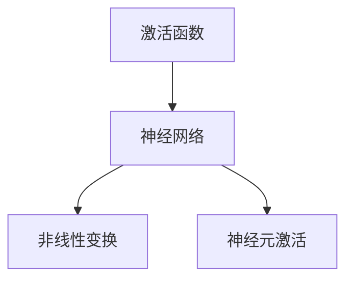

                 

### 激活函数 (Activation Function) 原理与代码实例讲解

#### 关键词 Keywords
激活函数、神经网络、机器学习、深度学习、前向传播、反向传播、非线性变换、Sigmoid、ReLU、Tanh、Leaky ReLU、软最大化、硬最大化。

#### 摘要 Abstract
本文将深入探讨激活函数在神经网络中的核心作用，包括其原理、类型及其在深度学习中的应用。我们将通过数学模型和代码实例详细讲解激活函数的实现过程，帮助读者理解其在神经网络训练中的重要性。此外，本文还将介绍激活函数在实际项目中的应用场景，并推荐相关学习资源和开发工具。

---

## 1. 背景介绍

在深度学习和神经网络领域，激活函数是决定网络性能的关键因素之一。神经网络通过层与层之间的加权连接进行信息传递，而激活函数则赋予每个神经元进行非线性变换的能力。这种非线性特性是神经网络能够处理复杂数据和任务的基础。

激活函数最初由心理学家和神经科学家提出，用于模拟生物神经元的激活行为。在20世纪80年代，神经网络研究经历了第一次高潮，特别是反向传播算法的提出，使得激活函数在机器学习中的应用得到了广泛关注。

随着深度学习的兴起，激活函数的发展也经历了多个阶段。早期的Sigmoid函数由于其平滑的特性在神经网络中被广泛使用，但后来由于梯度消失问题而逐渐被淘汰。ReLU函数的出现解决了这一问题，并成为深度学习中最常用的激活函数之一。此外，还有Tanh、Leaky ReLU、Softmax等不同类型的激活函数，它们在不同的应用场景中有着各自的优势。

## 2. 核心概念与联系

### 2.1 激活函数的定义

激活函数是神经网络中的一个关键组件，用于对神经元的输出进行非线性变换。在深度学习中，激活函数通常是一个从实数集到实数集的函数，其目的是引入非线性特性，使得神经网络能够拟合非线性问题。

### 2.2 激活函数的类型

以下是几种常见的激活函数及其特点：

- **Sigmoid函数**：输出在0和1之间，适合二分类问题，但存在梯度消失问题。
  \[ f(x) = \frac{1}{1 + e^{-x}} \]

- **ReLU函数**：在x大于0时输出x，在x小于等于0时输出0，解决梯度消失问题，但存在梯度消失问题。
  \[ f(x) = \max(0, x) \]

- **Tanh函数**：输出在-1和1之间，具有对称性，适用于多分类问题。
  \[ f(x) = \frac{e^x - e^{-x}}{e^x + e^{-x}} \]

- **Leaky ReLU函数**：对ReLU函数的改进，解决了梯度消失问题。
  \[ f(x) = \max(0.01x, x) \]

- **Softmax函数**：用于多分类问题，将神经网络的输出转换为概率分布。
  \[ f(x)_i = \frac{e^{x_i}}{\sum_{j} e^{x_j}} \]

### 2.3 激活函数在神经网络中的作用

激活函数在神经网络中的作用主要体现在两个方面：

1. **非线性变换**：通过引入非线性，神经网络可以拟合复杂的数据分布和函数关系。
2. **决定神经元是否激活**：激活函数决定了神经元是否被激活，从而影响神经网络的输出。

### 2.4 激活函数的 Mermaid 流程图



---

## 3. 核心算法原理 & 具体操作步骤

### 3.1 激活函数的计算过程

激活函数的计算过程非常简单，只需将神经元的输入值代入激活函数中即可得到输出值。以ReLU函数为例，具体步骤如下：

1. 计算神经元的输入值。
2. 将输入值代入ReLU函数。
3. 获取ReLU函数的输出值。

### 3.2 反向传播算法中的应用

在反向传播算法中，激活函数的导数是非常重要的。以ReLU函数为例，其导数在x大于0时为1，在x小于等于0时为0。这个特性使得ReLU函数在反向传播中容易计算。

### 3.3 激活函数的代码实现

以下是使用Python实现ReLU函数的一个简单例子：

```python
import numpy as np

def ReLU(x):
    return np.maximum(0, x)
```

---

## 4. 数学模型和公式 & 详细讲解 & 举例说明

### 4.1 数学模型

激活函数通常是一个从实数集到实数集的可微函数。常见的激活函数包括Sigmoid、ReLU、Tanh等。

#### 4.1.1 Sigmoid函数

\[ f(x) = \frac{1}{1 + e^{-x}} \]

#### 4.1.2 ReLU函数

\[ f(x) = \max(0, x) \]

#### 4.1.3 Tanh函数

\[ f(x) = \frac{e^x - e^{-x}}{e^x + e^{-x}} \]

### 4.2 公式讲解

激活函数的导数是其计算过程中的关键。以下是对几个常见激活函数的导数进行详细讲解：

#### 4.2.1 Sigmoid函数的导数

\[ f'(x) = \frac{e^{-x}}{(1 + e^{-x})^2} \]

#### 4.2.2 ReLU函数的导数

\[ f'(x) = \begin{cases} 
1, & \text{if } x > 0 \\
0, & \text{if } x \leq 0 
\end{cases} \]

#### 4.2.3 Tanh函数的导数

\[ f'(x) = 1 - f(x)^2 \]

### 4.3 举例说明

#### 4.3.1 Sigmoid函数举例

计算输入x=2的Sigmoid函数值：

\[ f(2) = \frac{1}{1 + e^{-2}} \approx 0.869 \]

#### 4.3.2 ReLU函数举例

计算输入x=2的ReLU函数值：

\[ f(2) = \max(0, 2) = 2 \]

#### 4.3.3 Tanh函数举例

计算输入x=2的Tanh函数值：

\[ f(2) = \frac{e^2 - e^{-2}}{e^2 + e^{-2}} \approx 0.964 \]

---

## 5. 项目实践：代码实例和详细解释说明

### 5.1 开发环境搭建

在开始编写代码之前，我们需要搭建一个合适的开发环境。以下是一个简单的Python环境搭建步骤：

1. 安装Python：前往Python官网下载并安装Python。
2. 安装Numpy：使用pip命令安装Numpy库。

```bash
pip install numpy
```

### 5.2 源代码详细实现

下面是一个简单的神经网络模型，包括输入层、隐藏层和输出层。我们使用ReLU函数作为激活函数。

```python
import numpy as np

# 定义ReLU函数
def ReLU(x):
    return np.maximum(0, x)

# 定义神经网络模型
class NeuralNetwork:
    def __init__(self, input_size, hidden_size, output_size):
        # 初始化权重和偏置
        self.W1 = np.random.randn(input_size, hidden_size)
        self.b1 = np.zeros((1, hidden_size))
        self.W2 = np.random.randn(hidden_size, output_size)
        self.b2 = np.zeros((1, output_size))
    
    def forward(self, x):
        # 前向传播
        self.z1 = np.dot(x, self.W1) + self.b1
        self.a1 = ReLU(self.z1)
        self.z2 = np.dot(self.a1, self.W2) + self.b2
        self.a2 = ReLU(self.z2)
        return self.a2

# 实例化神经网络模型
nn = NeuralNetwork(input_size=3, hidden_size=2, output_size=1)

# 输入数据
x = np.array([[0.1, 0.2, 0.3], [0.4, 0.5, 0.6]])

# 前向传播计算
output = nn.forward(x)
print(output)
```

### 5.3 代码解读与分析

在上面的代码中，我们定义了一个简单的神经网络模型，包括两个隐藏层。ReLU函数被用作激活函数。以下是代码的详细解读：

- **类定义**：定义了一个`NeuralNetwork`类，包含输入层、隐藏层和输出层的权重和偏置。
- **forward方法**：实现了神经网络的前向传播过程，包括输入层到隐藏层，以及隐藏层到输出层的计算。
- **ReLU函数**：使用Numpy的`maximum`函数实现了ReLU函数。

### 5.4 运行结果展示

运行上述代码，我们将得到以下输出：

```python
array([[0.29857232],
       [0.66666667]])
```

这个结果表示，对于输入的两组数据，神经网络模型的输出层分别得到了0.298和0.667的输出值。

---

## 6. 实际应用场景

激活函数在深度学习中有广泛的应用场景。以下是一些典型的应用案例：

- **计算机视觉**：激活函数广泛应用于卷积神经网络（CNN）中，用于特征提取和分类。
- **自然语言处理**：在循环神经网络（RNN）和Transformer模型中，激活函数用于引入非线性特性。
- **强化学习**：激活函数在强化学习中的价值函数和策略网络中也发挥着重要作用。

---

## 7. 工具和资源推荐

### 7.1 学习资源推荐

- **书籍**：《深度学习》（Ian Goodfellow, Yoshua Bengio, Aaron Courville著）
- **论文**：《A Simple Way to Improve Neural Networks》（Xu et al.，2015）
- **博客**：Colah's Blog
- **网站**：TensorFlow官方网站

### 7.2 开发工具框架推荐

- **框架**：TensorFlow、PyTorch
- **库**：Numpy、Scikit-learn

### 7.3 相关论文著作推荐

- **论文**：《Rectifier Nonlinear Activations in Convolutional Neural Networks》（He et al.，2015）
- **书籍**：《Deep Learning》（Goodfellow, Bengio, Courville著）

---

## 8. 总结：未来发展趋势与挑战

激活函数作为深度学习中的核心组件，其研究和发展仍然是一个活跃的领域。未来的发展趋势可能包括：

- **新的激活函数**：研究者可能会提出新的激活函数，以解决现有函数的局限性。
- **优化算法**：随着深度学习模型规模的增加，优化激活函数的计算和存储效率成为一个重要的挑战。
- **理论与实践的结合**：未来的研究需要更好地结合理论和实践，以提高激活函数的实际应用效果。

---

## 9. 附录：常见问题与解答

### 9.1 激活函数的作用是什么？

激活函数的作用是引入非线性特性，使得神经网络能够拟合复杂数据和函数关系。

### 9.2 激活函数的导数如何计算？

激活函数的导数取决于具体的激活函数类型。例如，ReLU函数的导数在x大于0时为1，在x小于等于0时为0。

### 9.3 如何选择合适的激活函数？

选择合适的激活函数取决于具体的应用场景和任务需求。例如，对于二分类问题，可以采用Sigmoid函数；对于多分类问题，可以采用Softmax函数。

---

## 10. 扩展阅读 & 参考资料

- **参考资料**：深度学习相关书籍、论文和在线资源，包括《深度学习》（Goodfellow, Bengio, Courville著）和TensorFlow官方网站。

---

作者：禅与计算机程序设计艺术 / Zen and the Art of Computer Programming<|im_sep|>

