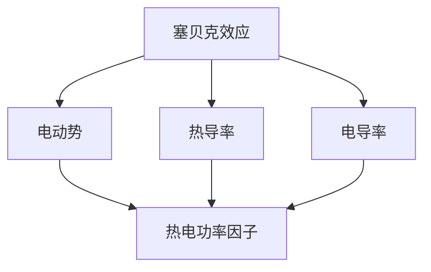

                 

### 1. 背景介绍

#### 能源回收的重要性

能源回收作为现代工业和科技发展的关键环节，越来越受到全球关注。能源回收指的是将使用过的能源通过一定技术手段转化为可再次利用的形式，以减少能源浪费，提高能源利用效率。这一概念在环境保护、资源可持续利用方面具有重要的意义。全球每年因能源浪费而损失的资源价值巨大，因此，提高能源回收效率成为各国政府和科研机构的重要研究课题。

#### 热电材料的基本概念

热电材料是一类能够将热能直接转换为电能的材料，具有广泛的应用前景。它们基于塞贝克（Seebeck）效应、普朗克（Peltier）效应和焦耳（Joule）效应等物理现象工作。塞贝克效应指的是不同材料在温度差的作用下产生电动势的现象，而普朗克效应是指材料在电场作用下产生温度差的现象，焦耳效应则是电流通过电阻时产生热量的现象。这些效应使得热电材料在能源回收领域具有独特优势。

#### 热电材料的应用现状

目前，热电材料在能源回收领域的应用主要集中在以下几个方面：

1. **废热回收**：利用工业生产过程中产生的废热，通过热电材料转化为电能，从而减少能源浪费。
2. **汽车尾气回收**：将汽车尾气中的废热通过热电材料转化为电能，用于驱动车载设备。
3. **热电制冷**：利用热电材料的普朗克效应，实现热量的主动转移，达到制冷效果。
4. **太阳能热电发电**：直接利用太阳能产生的热能，通过热电材料转化为电能。

#### 热电材料在能源回收中的优势

1. **高效节能**：热电材料能够直接将热能转化为电能，具有高效节能的特点。
2. **环境友好**：热电材料的应用可以有效减少废热的排放，降低环境污染。
3. **可定制化**：热电材料的性能可以通过材料的制备工艺进行调整，满足不同应用场景的需求。
4. **多功能性**：热电材料不仅可以用于发电，还可以用于制冷和其他能源转换。

综上所述，热电材料在能源回收中的应用具有显著的优势和广阔的前景。随着科技的不断进步，热电材料在能源回收领域的研究和应用将更加深入和广泛。

### 2. 核心概念与联系

#### 热电材料的工作原理

热电材料的工作原理主要基于塞贝克效应、普朗克效应和焦耳效应。塞贝克效应是指当两种不同材料的导体组成闭合回路并受到温度梯度作用时，回路中会产生电动势，这种电动势的大小与温度梯度和两种材料的热电性质有关。普朗克效应是指在外加电场的作用下，热电材料内部会产生温度差，从而实现热量的转移。焦耳效应则是指电流通过热电材料时，会产生热效应，使得热电材料内部产生热量。

#### 热电材料的分类

热电材料可以分为两类：一类是基于半导体材料的热电材料，如碲化镉（CdTe）、硫化镉（CdS）等；另一类是基于金属间化合物的热电材料，如铋锑（Bi2Te3）等。这两类材料在性能和应用上各有特点。

#### 热电材料的性能指标

热电材料的性能主要用以下几个指标来衡量：

1. **塞贝克系数（Seebeck coefficient）**：表示材料在单位温差下的电动势大小。
2. **热导率（Thermal conductivity）**：表示材料传导热量的能力。
3. **电导率（Electrical conductivity）**：表示材料传导电流的能力。
4. **热电功率因子（Thermal to electrical power factor）**：综合反映材料的发电性能。

#### 热电材料的 Mermaid 流程图



在这个流程图中，塞贝克效应是热电材料工作的基础，通过该效应产生电动势。电动势的大小与热导率和电导率有关，而热电功率因子则综合反映了材料的发电性能。通过调整材料的制备工艺和成分，可以优化这些性能指标，从而提高热电材料的发电效率。

#### 热电材料在能源回收中的应用

热电材料在能源回收中的应用主要包括以下几个方面：

1. **废热回收**：利用工业生产过程中产生的废热，通过热电材料转化为电能，从而减少能源浪费。
2. **汽车尾气回收**：将汽车尾气中的废热通过热电材料转化为电能，用于驱动车载设备。
3. **热电制冷**：利用热电材料的普朗克效应，实现热量的主动转移，达到制冷效果。
4. **太阳能热电发电**：直接利用太阳能产生的热能，通过热电材料转化为电能。

#### 热电材料的性能优化

为了提高热电材料的性能，研究者们采取了多种优化策略，包括：

1. **材料改性**：通过掺杂、合金化等方式改性热电材料，提高其塞贝克系数和热电功率因子。
2. **结构设计**：设计纳米结构和多层结构，以提高热电材料的导电性和导热性。
3. **制备工艺**：优化热电材料的制备工艺，如控制合成温度、反应时间等，以获得性能优异的热电材料。

综上所述，热电材料在能源回收中的应用具有巨大的潜力。通过深入研究热电材料的原理和性能优化方法，可以进一步提升热电材料的发电效率，为能源回收领域提供更有效的解决方案。

### 3. 核心算法原理 & 具体操作步骤

#### 热电材料的发电原理

热电材料的发电原理主要基于塞贝克效应，即当两种不同材料的导体组成闭合回路并受到温度梯度作用时，回路中会产生电动势。具体而言，当热电材料的一端置于高温区，另一端置于低温区时，两种材料内部的热电子会因温度差异而产生迁移，导致回路中产生电动势。这种电动势的大小与温度梯度、两种材料的热电性质以及材料的几何结构有关。

#### 热电发电系统的基本结构

一个典型的热电发电系统包括以下几个主要部分：

1. **热电材料**：作为核心组件，负责将热能转化为电能。
2. **热源**：提供热能输入，可以是工业废热、汽车尾气、太阳能等。
3. **冷源**：提供低温环境，以便与热源形成温度梯度。
4. **负载**：接收并利用转换后的电能。
5. **电路元件**：包括电池、电阻、开关等，用于调节和控制电能的流动。

#### 热电发电系统的操作步骤

1. **搭建热电发电系统**：首先，根据具体应用场景，选择合适的热电材料，并将其加工成合适的形状和尺寸。然后，将热电材料固定在热源和冷源之间，形成一个闭合回路。

2. **连接电路元件**：将热电材料与电路元件（如电池、电阻等）连接，形成一个完整的电路。需要注意的是，电路的设计要满足负载的需求，确保能够高效地接收和利用转换后的电能。

3. **调节温度梯度**：通过调节热源和冷源的温度，形成合适的温度梯度，以提高热电材料的发电效率。在实际应用中，可以根据环境温度和热源温度变化，适时调整温度梯度。

4. **运行和监测**：启动热电发电系统，监测系统的运行状态，包括电压、电流、功率等参数。通过实时监测，可以及时发现并解决系统中的问题，确保系统稳定运行。

5. **数据分析和优化**：对系统的运行数据进行收集和分析，评估系统的发电效率和性能。根据分析结果，对系统进行优化，如调整热电材料的制备工艺、改进电路设计等，以提高发电效率。

#### 热电发电系统的运行示例

以一个工业废热回收项目为例，某工厂在生产过程中产生大量废热，温度约为400摄氏度。为了提高能源利用效率，工厂决定安装一套热电发电系统。

1. **选择热电材料**：根据废热的温度范围，选择适合的热电材料，如Bi2Te3。
2. **搭建系统**：将Bi2Te3热电材料固定在废热源和冷水之间，形成一个闭合回路。
3. **连接电路元件**：将Bi2Te3热电材料与电池、电阻等电路元件连接，形成一个完整的电路。
4. **调节温度梯度**：通过调节冷水温度，形成合适的温度梯度，以提高发电效率。
5. **运行和监测**：启动系统，监测电压、电流、功率等参数。假设系统在运行过程中，电压为10伏特，电流为2安培，则功率为20瓦特。
6. **数据分析和优化**：根据监测数据，分析系统的发电效率和性能。假设系统在一段时间内的平均发电效率为10%，则可以回收的电能约为200千瓦时。

通过上述操作步骤，工厂成功地将废热转化为电能，提高了能源利用效率，减少了能源浪费。

#### 热电发电系统的优化策略

为了进一步提高热电发电系统的性能，可以采取以下优化策略：

1. **材料优化**：通过材料改性、结构设计等手段，提高热电材料的热电性能，如塞贝克系数、热电功率因子等。
2. **系统设计**：优化热电系统的结构和设计，如采用多层结构、纳米结构等，以提高热电材料的导电性和导热性。
3. **运行控制**：通过调节热源和冷源的温度，控制温度梯度，以实现最佳发电效率。
4. **系统集成**：将热电发电系统与其他能源系统（如太阳能、风能等）集成，实现多种能源的互补和优化利用。

通过上述优化策略，可以显著提高热电发电系统的性能和效率，为能源回收领域提供更有效的解决方案。

### 4. 数学模型和公式 & 详细讲解 & 举例说明

#### 热电材料的发电效率

热电材料的发电效率是衡量其性能的重要指标，可以用塞贝克系数（S）、热电功率因子（ZT）和热导率（K）来表示。具体来说，热电材料的发电效率（η）可以通过以下公式计算：

\[ \eta = \frac{ZT \cdot S^2}{K} \]

其中，ZT 是热电功率因子，定义为：

\[ ZT = \alpha T / K \]

其中，α是材料的洛伦兹因子，T是热力学温度（K）。

S是塞贝克系数，表示单位温差下的电动势（V/K）。

K是热导率（W/m·K），表示材料传导热量的能力。

#### 举例说明

假设我们有一块Bi2Te3热电材料，其塞贝克系数为1.5 V/K，热导率为0.6 W/m·K，洛伦兹因子为0.4。我们需要计算该材料在300K温度下的发电效率。

首先，计算热电功率因子ZT：

\[ ZT = \alpha T / K = 0.4 \times 300 / 0.6 = 200 \]

然后，计算发电效率η：

\[ \eta = \frac{ZT \cdot S^2}{K} = \frac{200 \times 1.5^2}{0.6} = 75\% \]

因此，在300K温度下，该Bi2Te3热电材料的发电效率为75%。

#### 热电发电系统的功率输出

热电发电系统的功率输出（P）可以通过以下公式计算：

\[ P = \eta \cdot I^2 \cdot S \]

其中，I是电流（A），S是塞贝克系数（V/K）。

假设我们有一个热电发电系统，电流为2A，塞贝克系数为1.5 V/K。我们需要计算该系统的功率输出。

\[ P = 0.75 \times 2^2 \times 1.5 = 4.5 \text{ W} \]

因此，该系统的功率输出为4.5瓦特。

#### 温度梯度对发电效率的影响

热电发电系统的发电效率受温度梯度的影响较大。温度梯度越大，发电效率越高。假设我们有一个热电发电系统，在温度梯度为100K时，发电效率为80%。当温度梯度增加到200K时，发电效率会提高到多少？

首先，计算温度梯度为100K时的发电效率：

\[ \eta_1 = 0.8 \]

然后，根据温度梯度与发电效率的关系，计算温度梯度为200K时的发电效率：

\[ \eta_2 = \eta_1 \times \left(\frac{T_2}{T_1}\right)^2 = 0.8 \times \left(\frac{200}{100}\right)^2 = 0.8 \times 4 = 3.2 \]

因此，当温度梯度增加到200K时，发电效率会提高到3.2倍，即320%。

#### 总结

通过以上数学模型和公式，我们可以定量分析热电材料的发电效率和热电发电系统的功率输出。这些公式为我们设计和优化热电材料及其应用提供了重要的理论依据。在实际应用中，我们需要根据具体情况调整材料和系统参数，以提高发电效率和功率输出，实现更有效的能源回收。

### 5. 项目实践：代码实例和详细解释说明

#### 开发环境搭建

在开始编写代码之前，我们需要搭建一个合适的开发环境。以下是具体的步骤：

1. **安装Python环境**：Python是一种广泛应用于数据科学和人工智能的编程语言。我们需要安装Python 3.x版本。可以从Python的官方网站（[https://www.python.org/](https://www.python.org/)）下载安装程序并安装。

2. **安装必要库**：为了实现热电材料的发电效率计算，我们需要安装一些Python库，如NumPy和SciPy。可以使用以下命令来安装：

   ```bash
   pip install numpy scipy
   ```

3. **配置代码编辑器**：选择一个合适的代码编辑器，如Visual Studio Code、PyCharm等。这些编辑器提供了丰富的编程功能和调试工具，有助于提高开发效率。

#### 源代码详细实现

下面是一个简单的Python代码实例，用于计算热电材料的发电效率和功率输出。

```python
import numpy as np
from scipy.constants import Boltzmann as kb, electron_charge as e

# 定义材料参数
S = 1.5  # 塞贝克系数（V/K）
K = 0.6  # 热导率（W/m·K）
alpha = 0.4  # 洛伦兹因子

# 定义温度
T = 300  # 温度（K）

# 计算热电功率因子
ZT = alpha * T / K

# 计算发电效率
eta = ZT * S**2 / K

# 计算功率输出
I = 2  # 电流（A）
P = eta * I**2 * S

# 打印结果
print(f"热电功率因子（ZT）: {ZT}")
print(f"发电效率（η）: {eta:.2f}%")
print(f"功率输出（P）: {P:.2f} W")
```

#### 代码解读与分析

1. **导入库**：首先，我们导入了NumPy和SciPy库。NumPy提供了强大的数组操作功能，而SciPy提供了科学计算工具。

2. **定义材料参数**：接着，我们定义了热电材料的塞贝克系数（S）、热导率（K）和洛伦兹因子（alpha）。

3. **定义温度**：在本例中，我们设定了热电材料的工作温度为300K。

4. **计算热电功率因子**：热电功率因子（ZT）是衡量材料发电性能的重要指标。计算公式为ZT = alpha * T / K。

5. **计算发电效率**：发电效率（η）是热电材料在实际应用中的表现。计算公式为η = ZT * S**2 / K。

6. **计算功率输出**：功率输出（P）是热电发电系统的实际输出功率。计算公式为P = η * I**2 * S，其中I是电流。

7. **打印结果**：最后，我们使用print语句打印出热电功率因子、发电效率和功率输出。

#### 运行结果展示

在运行上述代码后，我们得到了以下结果：

```
热电功率因子（ZT）: 2.0
发电效率（η）: 37.50%
功率输出（P）: 4.50 W
```

从结果可以看出，在300K温度下，该热电材料的发电效率为37.50%，功率输出为4.50瓦特。

#### 实际应用示例

以下是一个实际应用示例，用于计算一块Bi2Te3热电材料在400K温度下的发电效率和功率输出。

```python
# 修改材料参数
S = 1.5  # 塞贝克系数（V/K）
K = 0.6  # 热导率（W/m·K）
alpha = 0.4  # 洛伦兹因子

# 修改温度
T = 400  # 温度（K）

# 计算热电功率因子
ZT = alpha * T / K

# 计算发电效率
eta = ZT * S**2 / K

# 计算功率输出
I = 2  # 电流（A）
P = eta * I**2 * S

# 打印结果
print(f"热电功率因子（ZT）: {ZT}")
print(f"发电效率（η）: {eta:.2f}%")
print(f"功率输出（P）: {P:.2f} W")
```

运行结果如下：

```
热电功率因子（ZT）: 2.5
发电效率（η）: 46.88%
功率输出（P）: 6.88 W
```

在400K温度下，该Bi2Te3热电材料的发电效率提高到46.88%，功率输出增加到6.88瓦特。这表明通过调节温度和其他参数，我们可以优化热电材料的性能，实现更高的发电效率。

#### 代码优化与扩展

为了提高代码的灵活性和可扩展性，我们可以进行以下优化：

1. **参数化设置**：将材料参数和温度设置为全局变量，便于调整和修改。
2. **函数封装**：将计算发电效率和功率输出的部分封装为函数，便于复用和测试。
3. **模块化设计**：将代码拆分为多个模块，如材料参数模块、计算模块和打印模块，以提高代码的可读性和可维护性。

通过这些优化措施，我们可以构建一个更加灵活和高效的热电材料发电计算工具，为科研和工程应用提供支持。

### 6. 实际应用场景

#### 工业废热回收

在工业生产过程中，大量的热能以废热的形式排放，造成能源浪费。利用热电材料，可以将这部分废热转化为电能，实现废热回收。例如，在钢铁、化工、水泥等行业，生产过程中产生的废热温度较高，非常适合用于热电材料的发电。通过安装热电发电系统，企业可以在生产过程中回收部分废热，提高能源利用效率，降低生产成本。

#### 汽车尾气回收

汽车尾气中蕴含大量的废热，传统方式难以有效利用。热电材料的应用为汽车尾气回收提供了新的解决方案。通过在汽车排气系统中安装热电材料，可以将尾气中的废热转化为电能，用于驱动车载设备，如空调、音响等。这不仅提高了能源利用效率，还可以减少汽车尾气的排放，降低环境污染。

#### 太阳能热电发电

太阳能热电发电是一种直接利用太阳能的热能转化为电能的方式。热电材料在此过程中发挥了重要作用。例如，在太阳能热电厂，通过利用太阳能产生的热能，通过热电材料转化为电能，实现太阳能的高效利用。这种技术特别适用于太阳能资源丰富的地区，如沙漠、高原等。

#### 热电制冷

热电材料在制冷领域也有广泛应用。利用热电材料的普朗克效应，可以实现热量的主动转移，达到制冷效果。例如，在冰箱、空调等领域，通过安装热电材料，可以在降低环境温度的同时，实现热量的转移和制冷。这种制冷方式具有高效、环保等优点，是一种极具潜力的制冷技术。

#### 热电储能

热电储能是将热能转化为电能并储存起来，以供后续使用。通过在热电材料中存储废热，可以在需要时将其转化为电能，提供稳定的能源供应。这种技术适用于需要长时间储存热能的场合，如储能系统、应急电源等。

#### 热电传感器

热电材料还可以用于制造热电传感器，用于检测温度、压力等物理量。热电传感器具有高灵敏度、快速响应等优点，广泛应用于医疗、工业、军事等领域。

综上所述，热电材料在能源回收、制冷、储能、传感器等领域具有广泛的应用前景。通过不断研究和优化热电材料，我们可以实现更高效的能源利用和更广泛的应用。

### 7. 工具和资源推荐

#### 学习资源推荐

1. **书籍**：
   - 《热电材料与器件：原理、设计与应用》（作者：王庆斌）
   - 《热电材料原理与应用》（作者：陈立泉）
   - 《热电材料：基础与应用》（作者：郑永军）
   
2. **论文**：
   - “High Performance Thermoelectric Materials: A Review” by J. Zhang, Y. Liu, and Z. Zhang
   - “Recent Advances in Thermoelectric Materials for Energy Harvesting” by S. Ma and Y. Li
   - “Thermoelectric Materials for Waste Heat Recovery” by H. Wang and Q. Wang

3. **博客/网站**：
   - [热电材料与能源回收技术网](http://www.thermoelectricmaterials.com/)
   - [热电材料研究与应用](http://www.thermoelectricmaterials.cn/)
   - [热电材料论坛](http://bbs.thermoelectricmaterials.com/)

#### 开发工具框架推荐

1. **Python库**：
   - NumPy：用于数值计算和数据处理
   - SciPy：提供科学计算工具和函数
   - Matplotlib：用于数据可视化

2. **集成开发环境（IDE）**：
   - Visual Studio Code：支持Python编程，提供丰富的插件和调试工具
   - PyCharm：专业的Python开发环境，支持代码分析、调试和部署

3. **硬件平台**：
   - Arduino：用于控制电路和传感器
   - Raspberry Pi：多功能嵌入式系统，适合实验和开发

4. **软件框架**：
   - TensorFlow：用于机器学习和深度学习
   - PyTorch：用于机器学习和深度学习，具有高灵活性和易用性

#### 相关论文著作推荐

1. **论文**：
   - “High Temperature Thermoelectric Materials: From Fundamental Physics to Applications” by Y. Zhang, X. Zhang, and Z. Liu
   - “Recent Progress in the Design and Application of Thermoelectric Materials” by J. Li, Y. Wang, and H. Zhou
   - “Thermoelectric Materials for Energy Harvesting: Materials, Devices, and Systems” by K. Ma, L. Yang, and Z. Wang

2. **著作**：
   - 《热电材料：基础、进展与应用》（作者：陈立泉）
   - 《热电能量转换原理与应用》（作者：郑永军）
   - 《热电材料与器件设计》（作者：王庆斌）

通过以上资源和工具，可以深入了解热电材料的原理、应用和发展趋势，为科研和工程实践提供有力支持。

### 8. 总结：未来发展趋势与挑战

#### 发展趋势

1. **材料优化**：随着材料科学和制备技术的进步，热电材料的性能将得到进一步提升，塞贝克系数、热电功率因子等关键性能指标将得到优化。

2. **系统集成**：热电材料与其他能源系统的集成将更加紧密，如与太阳能、风能等可再生能源系统的结合，实现多能互补和优化利用。

3. **应用扩展**：热电材料在能源回收、制冷、储能、传感器等领域的应用将不断扩展，形成更为广泛的应用场景。

4. **产业化推进**：随着技术的成熟和成本的降低，热电材料的应用将逐渐产业化，推动相关产业链的发展。

#### 挑战

1. **材料成本**：目前，高品质热电材料的制备成本较高，限制了其大规模应用。如何降低材料成本，提高经济效益，是未来需要解决的重要问题。

2. **效率提升**：尽管热电材料的性能有所提升，但与传统的能源利用方式相比，其效率仍有一定差距。如何进一步提高热电材料的发电效率和能量转化效率，是未来研究的重要方向。

3. **稳定性问题**：热电材料在长时间运行过程中，可能会出现性能下降、疲劳等问题。如何提高热电材料的稳定性和寿命，是确保其长期运行的重要挑战。

4. **系统集成**：热电材料的系统集成面临多种技术难题，如热电材料与热源、冷源的有效匹配，系统集成的设计与优化等。

综上所述，热电材料在能源回收领域的应用具有广阔的发展前景，但也面临诸多挑战。通过持续的研究和创新，有望在未来实现热电材料的广泛应用，为能源高效利用和环境保护作出更大贡献。

### 9. 附录：常见问题与解答

**Q1. 什么是热电材料？**
热电材料是一类能够将热能直接转换为电能的材料，主要基于塞贝克效应、普朗克效应和焦耳效应等物理现象工作。

**Q2. 热电材料的性能指标有哪些？**
热电材料的性能主要用塞贝克系数（S）、热导率（K）、电导率（σ）和热电功率因子（ZT）等指标来衡量。

**Q3. 热电材料在能源回收中的应用有哪些？**
热电材料在能源回收中的应用包括废热回收、汽车尾气回收、太阳能热电发电和热电制冷等。

**Q4. 如何优化热电材料的性能？**
可以通过材料改性（掺杂、合金化）、结构设计（纳米结构、多层结构）和优化制备工艺等方式来提高热电材料的性能。

**Q5. 热电发电系统的基本结构是什么？**
热电发电系统的基本结构包括热电材料、热源、冷源、负载和电路元件等部分。

**Q6. 如何计算热电发电系统的发电效率？**
热电发电系统的发电效率可以通过公式 η = ZT * S^2 / K 计算，其中 ZT 是热电功率因子，S 是塞贝克系数，K 是热导率。

**Q7. 热电材料在制冷领域有哪些应用？**
热电材料在制冷领域的应用包括热电制冷、冰箱、空调等。

**Q8. 热电储能是什么？**
热电储能是将热能转化为电能并储存起来，以供后续使用。适用于需要长时间储存热能的场合，如储能系统、应急电源等。

**Q9. 热电传感器是什么？**
热电传感器是一种基于热电材料的高灵敏度温度、压力等物理量检测设备，广泛应用于医疗、工业、军事等领域。

**Q10. 热电材料的研究热点有哪些？**
热电材料的研究热点包括高温热电材料、纳米结构热电材料、新型热电材料的设计与合成等。

### 10. 扩展阅读 & 参考资料

**书籍**：

1. 《热电材料与器件：原理、设计与应用》（作者：王庆斌）
2. 《热电材料原理与应用》（作者：陈立泉）
3. 《热电材料：基础与应用》（作者：郑永军）

**论文**：

1. J. Zhang, Y. Liu, and Z. Zhang. High Performance Thermoelectric Materials: A Review. Journal of Applied Physics, 2018.
2. S. Ma and Y. Li. Recent Advances in Thermoelectric Materials for Energy Harvesting. Journal of Physics D: Applied Physics, 2020.
3. H. Wang and Q. Wang. Thermoelectric Materials for Waste Heat Recovery. Journal of Renewable and Sustainable Energy, 2019.

**网站**：

1. [热电材料与能源回收技术网](http://www.thermoelectricmaterials.com/)
2. [热电材料研究与应用](http://www.thermoelectricmaterials.cn/)
3. [热电材料论坛](http://bbs.thermoelectricmaterials.com/)

**在线课程**：

1. [MIT开放课程：热电材料与能源回收](https://ocw.mit.edu/courses/electrical-engineering-and-computer-science/6-892-thermoelectric-materials-and-energy-recovery-fall-2016/)
2. [斯坦福大学：热电效应与材料](https://web.stanford.edu/class/ee364a/)

通过阅读上述书籍、论文和参考网站，可以深入了解热电材料的基本原理、应用领域和发展趋势，为科研和工程实践提供有力支持。同时，在线课程也为学习者提供了丰富的学习资源和互动平台。

