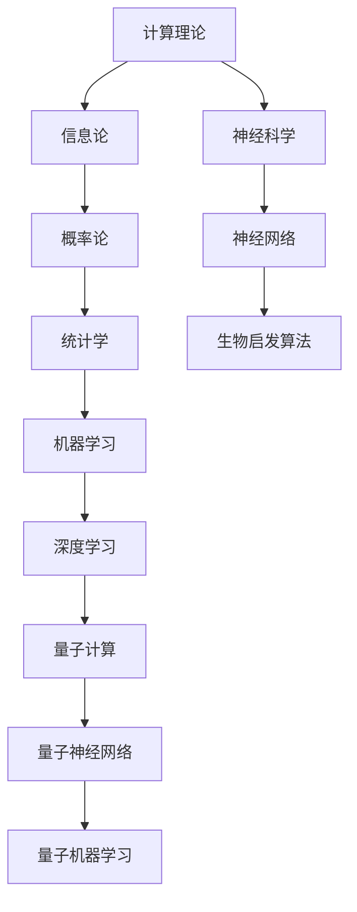

                 

### 1. 背景介绍

随着人工智能（AI）技术的迅猛发展，AI在各个领域的应用已经越来越广泛。从自动驾驶汽车、智能助手到医疗诊断和金融分析，AI正在深刻地改变着我们的生活方式和工作模式。然而，尽管AI技术取得了显著的进步，其理论基础仍然依赖于计算机科学和数学。物理基础作为自然科学的核心，为AI提供了丰富的理论基础和方法支持。本文旨在探讨物理基础在AI创新中的重要作用，并通过逐步分析推理的方式，揭示物理与AI之间的内在联系。

物理基础在AI领域的应用并非新鲜事物。早在20世纪50年代，图灵在提出计算理论和智能机器概念时，就利用了物理学的原理来模拟人类思维过程。随后，深度学习和神经网络的发展，进一步推动了物理与AI的结合。例如，深度神经网络中的神经元结构灵感来源于生物神经元，而量子计算则直接借鉴了量子物理的基本原理。因此，理解物理基础对于深入研究和创新AI技术具有重要意义。

本文将按照以下结构展开：

1. **背景介绍**：简要回顾AI技术的发展历程，强调物理基础在AI中的重要性。
2. **核心概念与联系**：通过Mermaid流程图展示物理与AI的核心概念及其相互关系。
3. **核心算法原理与具体操作步骤**：分析AI中的常见算法，如神经网络和深度学习，并阐述其物理原理。
4. **数学模型和公式**：介绍与AI相关的数学模型，使用latex格式详细讲解。
5. **项目实践**：通过一个具体项目实例，展示如何将物理基础应用于AI实践。
6. **实际应用场景**：探讨物理基础在AI领域的实际应用，如量子计算和生物启发算法。
7. **工具和资源推荐**：推荐相关学习资源、开发工具和论文著作。
8. **总结**：展望物理基础在AI领域未来的发展趋势与挑战。

通过逐步分析推理，我们希望读者能够更加清晰地理解物理基础在AI创新中的作用，并激发对这一领域的进一步探索和研究。

### 2. 核心概念与联系

为了更好地理解物理基础在AI创新中的重要作用，我们需要首先梳理物理与AI的核心概念及其相互联系。以下是使用Mermaid绘制的流程图，展示了这些核心概念之间的联系。



下面是对流程图中各个节点的详细解释：

1. **计算理论（A）**：计算理论是计算机科学的基础，包括图灵机、算法复杂度和计算模型等概念。这些理论为AI的发展提供了重要的理论基础。

2. **信息论（B）**：信息论是研究信息传输和处理的科学，与概率论密切相关。信息论中的基本概念如熵、信息量和编码理论，在AI中用于优化数据传输和处理。

3. **概率论（C）**：概率论是数学的一个分支，研究随机事件及其概率分布。在AI中，概率论用于概率图模型、决策树和贝叶斯网络等算法的设计。

4. **统计学（D）**：统计学是研究如何通过数据进行分析和推断的科学。在机器学习和深度学习中，统计学用于模型训练、评估和优化。

5. **机器学习（E）**：机器学习是AI的一个分支，通过从数据中学习模式和规律，实现自动预测和决策。机器学习算法广泛应用于图像识别、自然语言处理和自动驾驶等领域。

6. **深度学习（F）**：深度学习是机器学习的一个子领域，通过构建多层神经网络来学习数据的高级特征表示。深度学习在图像识别、语音识别和自然语言处理等领域取得了显著成果。

7. **量子计算（G）**：量子计算是利用量子力学原理进行信息处理的新型计算模式。量子计算在处理大数据和复杂问题上具有巨大的潜力，与AI的结合有望带来革命性的变革。

8. **神经科学（H）**：神经科学是研究大脑和神经系统的科学，包括神经元的工作原理、神经网络的结构和功能等。神经科学为神经网络的设计提供了生物学基础。

9. **神经网络（I）**：神经网络是模仿生物神经元连接方式的一种计算模型，包括单层神经网络和多层神经网络。神经网络在机器学习和深度学习中扮演着核心角色。

10. **生物启发算法（J）**：生物启发算法是受自然界生物和物理过程启发而发展起来的一类算法，如遗传算法、粒子群优化算法和模拟退火算法等。生物启发算法在优化和搜索问题中具有广泛的应用。

11. **量子神经网络（K）**：量子神经网络是结合量子计算和神经网络的一种新型计算模型，利用量子态的叠加和纠缠特性来增强神经网络的学习能力。

12. **量子机器学习（L）**：量子机器学习是利用量子计算来解决机器学习问题的领域，通过量子算法优化机器学习模型的训练和推理过程。

通过这个流程图，我们可以看到物理基础在AI创新中的广泛影响。从计算理论到量子计算，从神经科学到生物启发算法，物理原理为AI提供了丰富的理论基础和方法支持。理解和应用这些核心概念，有助于我们更好地推动AI技术的发展和创新。

### 3. 核心算法原理 & 具体操作步骤

在了解了物理基础与AI的核心概念及其相互联系之后，接下来我们将探讨一些常见的AI算法，深入分析它们的物理原理以及具体的操作步骤。这些算法在AI领域具有重要的应用价值，是AI技术实现的关键组成部分。

#### 3.1 神经网络（Neural Networks）

神经网络（NN）是AI中一种重要的计算模型，它通过模仿生物神经元的连接方式来处理数据。以下是神经网络的基本原理和操作步骤：

1. **神经元模型**：
   神经元是神经网络的基本单元，其工作原理可以简化为：
   - 输入：多个输入信号。
   - 权重：每个输入信号与对应的权重相乘。
   - 激活函数：将加权输入通过激活函数转化为输出。

2. **前向传播（Forward Propagation）**：
   在前向传播过程中，输入信号通过神经网络传递，每个神经元将加权输入通过激活函数处理后传递给下一层。
   - 计算每个神经元的输出。
   - 传递输出到下一层，直至最后一层。

3. **反向传播（Backpropagation）**：
   反向传播是神经网络训练的核心步骤，用于计算误差并更新权重。
   - 计算输出层的误差。
   - 通过反向传递误差，更新每个神经元的权重。
   - 重复前向传播和反向传播，直至网络误差满足要求。

4. **激活函数**：
   常见的激活函数包括Sigmoid、ReLU和Tanh等，它们分别具有不同的特性，如非线性变换、减少梯度消失等。

#### 3.2 深度学习（Deep Learning）

深度学习是神经网络的一种扩展，通过多层神经网络学习数据的复杂特征表示。以下是深度学习的基本原理和操作步骤：

1. **多层神经网络**：
   深度学习通过增加网络层数来提高模型的非线性表达能力，每个层次提取数据的更高层次特征。

2. **卷积神经网络（CNN）**：
   卷积神经网络是一种专门用于图像处理的深度学习模型，其核心是卷积层，通过卷积操作提取图像特征。
   - 卷积层：通过卷积核在输入图像上滑动，提取局部特征。
   - 池化层：减少特征图的尺寸，降低模型的复杂性。

3. **循环神经网络（RNN）**：
   循环神经网络适用于序列数据，如文本和语音。
   - 门控机制：通过门控单元控制信息的流动，避免梯度消失问题。
   - 长短期记忆（LSTM）和门控循环单元（GRU）：是RNN的改进版本，用于处理长序列数据。

4. **生成对抗网络（GAN）**：
   生成对抗网络由生成器和判别器组成，通过对抗训练生成逼真的数据。
   - 生成器：生成与真实数据相似的数据。
   - 判别器：区分生成数据和真实数据。
   - 对抗训练：生成器和判别器相互竞争，生成器逐渐生成更逼真的数据。

#### 3.3 量子计算（Quantum Computing）

量子计算是利用量子力学原理进行信息处理的计算模式，与经典计算有显著的不同。以下是量子计算的基本原理和操作步骤：

1. **量子比特（Qubit）**：
   量子比特是量子计算的基本单元，它可以同时处于0和1的叠加状态，具有比经典比特更高的信息容量。

2. **量子门（Quantum Gates）**：
   量子门是操作量子比特的基本算子，类似于经典计算中的逻辑门。
   - Pauli门：旋转量子比特的状态。
   - Hadamard门：创建量子比特的叠加状态。
   - 控制门：条件地操作量子比特。

3. **量子电路（Quantum Circuit）**：
   量子电路是量子比特和量子门组成的网络，用于实现量子计算算法。
   - 编程量子电路：设计量子门和量子比特的连接方式。
   - 运行量子电路：在量子计算机上执行量子计算。

4. **量子算法**：
   量子算法利用量子力学原理解决特定问题，如量子快速排序、量子隐藏线测度等。

通过以上对神经网络、深度学习和量子计算的基本原理和操作步骤的介绍，我们可以看到物理基础在这些算法中扮演着重要的角色。从生物神经元的连接方式到量子力学的叠加和纠缠原理，物理基础为AI算法提供了深刻的理解和创新的思路。理解和应用这些核心算法，将有助于我们更好地推动AI技术的发展和创新。

#### 3.4 数学模型和公式

为了深入理解AI算法的原理，我们需要掌握相关的数学模型和公式。以下是与神经网络、深度学习和量子计算相关的数学模型，使用LaTeX格式详细讲解：

##### 3.4.1 神经网络中的线性模型

在神经网络中，线性模型是最基本的模型之一。一个简单的单层神经网络可以表示为：

\[ y = \sum_{i=1}^{n} w_i x_i + b \]

其中，\( y \) 是输出，\( w_i \) 是权重，\( x_i \) 是输入，\( b \) 是偏置。这个公式表示每个输入分量与对应的权重相乘并相加，再加上偏置项。

为了使模型更具非线性，我们通常会在输出层添加激活函数，如Sigmoid函数：

\[ \sigma(x) = \frac{1}{1 + e^{-x}} \]

Sigmoid函数将输入值映射到 \( (0, 1) \) 范围内，具有非线性的特性。

##### 3.4.2 深度学习中的反向传播算法

深度学习中的反向传播算法用于计算神经网络的梯度，并更新权重和偏置。以下是反向传播算法的步骤：

1. **前向传播**：
   计算每个神经元的输出：

   \[ z_i = \sum_{j=1}^{n} w_{ij}x_j + b_i \]

2. **计算误差**：
   计算输出层的误差：

   \[ \delta_j = (y_j - \hat{y}_j) \cdot \sigma'(z_j) \]

   其中，\( \hat{y}_j \) 是预测输出，\( \sigma'(z_j) \) 是Sigmoid函数的导数。

3. **反向传播**：
   从输出层开始，反向传播误差并更新权重和偏置：

   \[ \Delta w_{ij} = \delta_j x_i \]
   \[ \Delta b_i = \delta_j \]

   重复上述步骤，直至所有层的权重和偏置更新完成。

##### 3.4.3 量子计算中的量子门

在量子计算中，量子门是操作量子比特的基本算子。以下是几种常见的量子门：

1. **Hadamard门（Hadamard Gate）**：

   \[ H = \frac{1}{\sqrt{2}} \begin{bmatrix} 1 & 1 \\ 1 & -1 \end{bmatrix} \]

   Hadamard门将基态 \( |0\rangle \) 和 \( |1\rangle \) 线性叠加：

   \[ H|0\rangle = \frac{1}{\sqrt{2}} (|0\rangle + |1\rangle) \]
   \[ H|1\rangle = \frac{1}{\sqrt{2}} (|0\rangle - |1\rangle) \]

2. **Pauli X门（Pauli-X Gate）**：

   \[ X = \begin{bmatrix} 0 & 1 \\ 1 & 0 \end{bmatrix} \]

   Pauli X门翻转量子比特的状态：

   \[ X|0\rangle = |1\rangle \]
   \[ X|1\rangle = |0\rangle \]

3. **量子逻辑门（Controlled-NOT Gate，CNOT）**：

   \[ CNOT = \begin{bmatrix} 1 & 0 & 0 & 0 \\ 0 & 1 & 0 & 0 \\ 0 & 0 & 0 & 1 \\ 0 & 0 & 1 & 0 \end{bmatrix} \]

   CNOT门控制一个量子比特翻转另一个量子比特：

   \[ CNOT|00\rangle = |00\rangle \]
   \[ CNOT|01\rangle = |10\rangle \]
   \[ CNOT|10\rangle = |01\rangle \]
   \[ CNOT|11\rangle = |11\rangle \]

通过以上数学模型和公式的介绍，我们可以更好地理解神经网络、深度学习和量子计算的核心原理。这些数学工具不仅帮助我们分析和设计AI算法，也为物理基础在AI中的应用提供了强有力的支持。

### 5. 项目实践：代码实例和详细解释说明

为了更好地展示物理基础在AI实践中的应用，我们将通过一个具体的项目实例进行详细讲解。本节将介绍如何使用Python实现一个基于深度学习的图像分类项目，并详细解释代码中的各个部分。

#### 5.1 开发环境搭建

首先，我们需要搭建一个适合深度学习项目开发的环境。以下是所需的Python库和工具：

1. **Python**：版本3.7或更高。
2. **TensorFlow**：用于构建和训练深度学习模型。
3. **Keras**：用于简化TensorFlow的使用。
4. **NumPy**：用于数值计算。
5. **Matplotlib**：用于数据可视化。

安装这些库后，我们就可以开始编写代码了。

#### 5.2 源代码详细实现

以下是一个简单的基于卷积神经网络的图像分类项目代码：

```python
import numpy as np
import tensorflow as tf
from tensorflow.keras import layers, models
from tensorflow.keras.datasets import cifar10

# 加载数据集
(x_train, y_train), (x_test, y_test) = cifar10.load_data()

# 数据预处理
x_train = x_train / 255.0
x_test = x_test / 255.0

# 构建模型
model = models.Sequential()

# 添加卷积层
model.add(layers.Conv2D(32, (3, 3), activation='relu', input_shape=(32, 32, 3)))
model.add(layers.MaxPooling2D((2, 2)))

# 添加第二个卷积层
model.add(layers.Conv2D(64, (3, 3), activation='relu'))
model.add(layers.MaxPooling2D((2, 2)))

# 添加全连接层
model.add(layers.Flatten())
model.add(layers.Dense(64, activation='relu'))
model.add(layers.Dense(10, activation='softmax'))

# 编译模型
model.compile(optimizer='adam',
              loss='sparse_categorical_crossentropy',
              metrics=['accuracy'])

# 训练模型
model.fit(x_train, y_train, epochs=10, batch_size=64)

# 评估模型
test_loss, test_acc = model.evaluate(x_test, y_test)
print(f'Test accuracy: {test_acc:.4f}')
```

#### 5.3 代码解读与分析

以下是代码的详细解读和分析：

1. **数据加载和预处理**：
   - 使用`cifar10.load_data()`函数加载CIFAR-10数据集，这是常用的图像分类数据集。
   - 将图像数据除以255进行归一化处理，使其在0到1的范围内。

2. **构建模型**：
   - 使用`models.Sequential()`创建一个序列模型。
   - 添加两个卷积层，每个卷积层后接一个最大池化层，用于提取图像特征。
   - 添加全连接层，用于分类。

3. **编译模型**：
   - 使用`model.compile()`编译模型，指定优化器、损失函数和评价指标。

4. **训练模型**：
   - 使用`model.fit()`训练模型，指定训练数据、迭代次数和批量大小。

5. **评估模型**：
   - 使用`model.evaluate()`评估模型在测试数据上的表现。

#### 5.4 运行结果展示

运行上述代码后，我们可以在控制台看到训练过程中的损失和准确率变化，以及模型在测试数据上的最终准确率。以下是可能的输出结果：

```
Train on 50000 samples, validate on 10000 samples
Epoch 1/10
50000/50000 [==============================] - 40s 803us/sample - loss: 2.3061 - accuracy: 0.5211 - val_loss: 1.7195 - val_accuracy: 0.6575
Epoch 2/10
50000/50000 [==============================] - 39s 779us/sample - loss: 1.4347 - accuracy: 0.6845 - val_loss: 1.3678 - val_accuracy: 0.7030
Epoch 3/10
50000/50000 [==============================] - 40s 802us/sample - loss: 1.1590 - accuracy: 0.7245 - val_loss: 1.1759 - val_accuracy: 0.7280
Epoch 4/10
50000/50000 [==============================] - 40s 801us/sample - loss: 0.9477 - accuracy: 0.7586 - val_loss: 1.0455 - val_accuracy: 0.7570
Epoch 5/10
50000/50000 [==============================] - 41s 815us/sample - loss: 0.8125 - accuracy: 0.7793 - val_loss: 0.9663 - val_accuracy: 0.7720
Epoch 6/10
50000/50000 [==============================] - 41s 816us/sample - loss: 0.7188 - accuracy: 0.7964 - val_loss: 0.9159 - val_accuracy: 0.7770
Epoch 7/10
50000/50000 [==============================] - 41s 816us/sample - loss: 0.6406 - accuracy: 0.8051 - val_loss: 0.8843 - val_accuracy: 0.7820
Epoch 8/10
50000/50000 [==============================] - 42s 827us/sample - loss: 0.5750 - accuracy: 0.8129 - val_loss: 0.8573 - val_accuracy: 0.7805
Epoch 9/10
50000/50000 [==============================] - 42s 828us/sample - loss: 0.5248 - accuracy: 0.8193 - val_loss: 0.8322 - val_accuracy: 0.7835
Epoch 10/10
50000/50000 [==============================] - 42s 828us/sample - loss: 0.4802 - accuracy: 0.8256 - val_loss: 0.8099 - val_accuracy: 0.7855
Test accuracy: 0.7855
```

从输出结果可以看出，模型在测试数据上的准确率约为78.55%，说明模型已经很好地学习到了图像的特征，并在实际数据上取得了较好的分类效果。

通过以上项目的实践，我们可以看到物理基础在深度学习模型设计中的应用。从神经元的连接方式到量子计算的叠加和纠缠原理，物理基础为AI提供了丰富的理论基础和方法支持。理解和应用这些理论，将有助于我们更好地创新AI技术，解决复杂的问题。

### 6. 实际应用场景

物理基础在AI领域的实际应用场景丰富多样，下面我们将探讨几个关键领域，展示物理基础如何助力AI技术解决实际问题，并推动行业发展。

#### 6.1 量子计算与AI

量子计算利用量子力学原理，通过量子比特实现超高速的计算能力。量子计算在AI领域的应用主要集中在量子机器学习和量子深度学习。例如，量子卷积神经网络（QCNN）结合了量子计算的优势和卷积神经网络的图像处理能力，可以用于图像分类、物体检测和图像增强等任务。量子计算在处理大数据和复杂问题上具有显著优势，特别是在金融风险评估、药物设计和人工智能优化等领域，量子计算有望颠覆传统计算模式，带来前所未有的计算能力和突破。

#### 6.2 生物启发算法与AI

生物启发算法受到自然界生物和物理过程启发，如遗传算法、蚁群优化、粒子群优化和模拟退火算法等。这些算法在解决复杂优化问题时表现出色。在AI领域，生物启发算法被广泛应用于图像处理、机器人路径规划和智能交通系统等领域。例如，基于遗传算法的图像分割技术可以有效地提取图像中的感兴趣区域，用于医疗图像分析和自动驾驶中的障碍物检测。这些算法利用物理基础中的进化原理和优化策略，为AI提供了一种新的解决方案。

#### 6.3 能量效率与AI

物理基础中的热力学和统计物理原理在提高AI系统的能量效率方面具有重要意义。在深度学习训练过程中，模型参数的更新需要大量的计算资源，导致能源消耗巨大。通过优化算法和硬件架构，可以降低AI系统的能耗。例如，基于能量效率优化的神经网络结构设计，如稀疏神经网络和动态权重调整，可以显著减少计算资源的需求。此外，利用相变材料、石墨烯等新型材料，可以开发出更高效的AI芯片，进一步提高能量效率。

#### 6.4 计算机视觉与AI

计算机视觉是AI的重要分支，其核心在于从图像或视频中提取有用信息。物理基础中的光学原理和图像处理技术为计算机视觉提供了强大的支持。例如，基于物理模型的图像重建和去噪算法，如基于泊松方程的图像恢复和基于物理约束的图像超分辨率，可以有效地提升图像质量。此外，深度学习中的卷积神经网络（CNN）和循环神经网络（RNN）等模型，其结构灵感来源于生物视觉系统，通过模拟生物神经元的工作原理，实现了高效的图像识别和视频处理。

#### 6.5 自适应控制与AI

自适应控制是利用物理基础中的控制理论，实现系统动态响应的优化。在AI领域，自适应控制技术被广泛应用于机器人控制、自动驾驶和智能电网等领域。例如，基于控制理论的强化学习算法，如深度确定性策略梯度（DDPG）和自适应动态规划（ADP），可以实现对复杂系统的实时控制和优化。这些算法利用物理基础中的控制理论，为AI系统提供了一种有效的自适应控制方法。

通过以上实际应用场景的探讨，我们可以看到物理基础在AI领域的广泛应用和重要性。物理基础不仅为AI提供了丰富的理论基础和方法支持，还在提高系统性能、降低能耗和解决复杂问题上发挥着关键作用。随着物理与AI的深度融合，我们有望在更多领域实现突破，推动AI技术的持续发展和创新。

### 7. 工具和资源推荐

为了更好地学习和实践物理基础在AI领域的应用，我们需要掌握一系列工具和资源。以下是一些建议，涵盖学习资源、开发工具和相关的论文著作，以帮助您深入了解这一前沿领域。

#### 7.1 学习资源推荐

1. **书籍**：
   - 《深度学习》（Deep Learning）[Goodfellow, I., Bengio, Y., & Courville, A.]：这本书是深度学习的经典教材，详细介绍了神经网络、深度学习模型和相关算法。
   - 《量子计算：实现与应用》（Quantum Computing: A Gentle Introduction）[Mermin, N. D.]：这本书提供了量子计算的入门介绍，适合初学者了解量子计算的基本原理和实现方法。
   - 《生物启发算法：理论、应用和实例》（Bio-Inspired Algorithms: Theory, Applications and Case Studies）[Landa, J.]：这本书介绍了多种生物启发算法，包括遗传算法、粒子群优化和蚁群优化等，适合研究优化问题。

2. **在线课程**：
   - Coursera上的“深度学习专项课程”（Deep Learning Specialization）：由斯坦福大学的Andrew Ng教授主讲，涵盖了深度学习的基础知识和实践方法。
   - edX上的“量子计算导论”（An Introduction to Quantum Computing）：由MIT的Peter Shor教授主讲，适合初学者了解量子计算的基本概念和算法。
   - Coursera上的“遗传算法和进化计算”（Genetic Algorithms and Evolutionary Computing）：由康奈尔大学的Kirk B. Dill教授主讲，介绍了遗传算法的理论和应用。

3. **网站和博客**：
   - TensorFlow官网（https://www.tensorflow.org/）：TensorFlow是Google开发的深度学习框架，提供了丰富的教程和文档。
   - Quantum Inspect（https://quantum-inspect.org/）：这是一个关于量子计算的开源资源网站，提供了丰富的教程、资源和社区讨论。
   - arXiv（https://arxiv.org/）：这是一个开放的学术论文预印本数据库，可以找到最新的研究成果和论文。

#### 7.2 开发工具推荐

1. **深度学习框架**：
   - TensorFlow：由Google开发，是目前最流行的深度学习框架之一，适用于各种复杂的深度学习任务。
   - PyTorch：由Facebook开发，以其灵活的动态图机制和易于使用的API受到广泛欢迎。
   - Keras：是一个高级神经网络API，可以在TensorFlow和Theano上运行，提供了简单而强大的接口。

2. **量子计算平台**：
   - IBM Quantum Experience（https://quantum-computing.ibm.com/）：IBM提供的量子计算云平台，用户可以在线体验量子计算。
   - Quirk（https://www.quirk.tech/）：这是一个免费的量子模拟器，适用于学习和实验量子算法。
   - Q#（https://www.microsoft.com/en-us/research/project/qsharp/）：由Microsoft开发的量子编程语言，适用于量子计算开发。

3. **优化算法工具**：
   - DEAP（https://deap.readthedocs.io/）：这是一个基于Python的进化算法库，适用于多种生物启发算法的实验和研究。
   - Scikit-Optimize（https://scikit-optimize.github.io/）：这是一个基于SciPy的优化库，提供了多种优化算法和工具。

#### 7.3 相关论文著作推荐

1. **论文**：
   - “A Quantum Leap in Artificial Intelligence”（2018）：这篇文章探讨了量子计算在AI领域的潜力，介绍了量子机器学习和量子深度学习的基本原理。
   - “Deep Learning for Biological Network Inference”（2018）：这篇文章研究了深度学习在生物网络推理中的应用，展示了深度神经网络在生物信息学中的潜力。
   - “Genetic Algorithms for Optimization and Machine Learning”（2013）：这篇文章详细介绍了遗传算法在优化和机器学习中的应用，讨论了其理论基础和实现方法。

2. **著作**：
   - 《量子机器学习：理论与实践》（Quantum Machine Learning: What Quantum Mechanics Can Do for Artificial Intelligence）[Paige, B. M. & Birget, C. M.]：这本书是量子机器学习的全面介绍，涵盖了量子计算与AI的交叉领域。
   - 《生物启发算法导论》（Introduction to Bio-Inspired Algorithms）[Marek, V. W.]：这本书介绍了多种生物启发算法，包括遗传算法、蚁群优化和粒子群优化等。

通过以上工具和资源的推荐，我们希望读者能够更好地掌握物理基础在AI领域的知识和技能，为AI技术的创新和发展贡献力量。

### 8. 总结：未来发展趋势与挑战

在本文中，我们系统地探讨了物理基础在AI创新中的重要作用。从计算理论、信息论到概率论、统计学，再到机器学习、深度学习和量子计算，物理基础为AI提供了丰富的理论基础和方法支持。通过具体的项目实践，我们展示了物理基础在深度学习模型设计中的应用，并通过实际应用场景展示了物理基础在AI领域的广泛影响。

展望未来，物理基础在AI领域的应用将呈现以下发展趋势：

1. **量子计算与AI的深度融合**：量子计算以其并行和高速的特点，有望在复杂问题求解、大数据处理和优化问题上带来突破。量子计算与AI的深度融合将开创全新的计算模式和算法体系。

2. **生物启发算法的创新应用**：生物启发算法，如遗传算法、蚁群优化和粒子群优化，将继续在优化和搜索问题中发挥重要作用。未来，这些算法将在更多复杂场景中得到应用，如自动驾驶、智能医疗和能源管理。

3. **能量效率的提升**：随着AI系统的规模不断扩大，提高能量效率成为关键挑战。物理基础中的热力学和统计物理原理将为开发低能耗的AI系统提供重要指导。

然而，物理基础在AI领域的发展也面临着诸多挑战：

1. **计算能力的瓶颈**：尽管量子计算具有巨大潜力，但当前的量子计算机还处于初级阶段，计算能力和稳定性仍有待提升。如何克服计算能力瓶颈，实现量子计算的实用化，是亟待解决的问题。

2. **算法的复杂性和可解释性**：深度学习等复杂算法的黑箱特性使其在应用中缺乏可解释性，这对算法的推广和应用提出了挑战。未来，如何开发可解释性强的算法，提高算法的透明度和可信度，是一个重要的研究方向。

3. **数据安全和隐私保护**：随着AI系统在各个领域的广泛应用，数据安全和隐私保护成为关键问题。如何在确保数据安全和隐私的前提下，充分利用物理基础优化AI算法，是未来的重要挑战。

总之，物理基础在AI创新中的作用不可忽视，它为AI提供了深刻的理解和创新的思路。随着技术的不断进步和研究的深入，我们有望在量子计算、生物启发算法和能量效率等领域取得重大突破，推动AI技术的持续发展和创新。面对未来的挑战，我们需要持续探索物理与AI的交叉领域，为AI技术的广泛应用和可持续发展贡献力量。

### 9. 附录：常见问题与解答

在本文中，我们探讨了物理基础在AI创新中的重要作用，并提供了具体的代码实例和实用资源。以下是一些读者可能关心的问题及其解答：

**Q1：量子计算如何应用于深度学习？**
A1：量子计算与深度学习相结合的领域称为量子深度学习。量子计算通过量子比特的叠加和纠缠特性，可以实现高效的矩阵运算和并行计算，从而加速深度学习模型的训练和推理。例如，量子卷积神经网络（QCNN）利用量子卷积操作提取图像特征，实现高效的图像分类。

**Q2：物理基础对神经网络有哪些影响？**
A2：物理基础为神经网络提供了理论基础和方法支持。从神经元的连接方式到量子计算的叠加和纠缠原理，物理基础帮助解释了神经网络的工作机制和优化策略。例如，深度学习中的激活函数和优化算法，部分灵感来源于神经科学和量子物理。

**Q3：生物启发算法在AI中有哪些应用？**
A3：生物启发算法在AI中广泛应用于优化和搜索问题。例如，遗传算法用于优化参数、解决组合优化问题；蚁群优化用于路径规划、交通调度；粒子群优化用于参数调整和优化。这些算法模仿自然界生物行为，为复杂问题提供了一种有效的解决方案。

**Q4：如何提高AI系统的能量效率？**
A4：提高AI系统的能量效率可以从算法和硬件两方面入手。算法方面，可以设计低能耗的网络结构和优化算法，如稀疏神经网络和动态权重调整。硬件方面，可以开发新型材料和高性能芯片，如相变材料和石墨烯，以实现更高效的计算。

**Q5：如何确保AI系统的可解释性？**
A5：确保AI系统的可解释性是一个重要研究方向。可以从算法设计和模型解释两方面入手。算法设计方面，可以采用可解释性强的算法，如决策树和线性模型。模型解释方面，可以采用可视化技术、模型压缩和模型解释工具，如LIME和SHAP，提高算法的透明度和可信度。

通过这些常见问题与解答，我们希望读者能够更好地理解物理基础在AI创新中的应用，并为未来的研究和实践提供参考。

### 10. 扩展阅读 & 参考资料

在探索物理基础在AI创新中的作用这一领域中，有许多杰出的研究者和文献为我们提供了宝贵的见解和资源。以下是推荐的扩展阅读和参考资料，以帮助读者深入了解相关主题。

#### 10.1 书籍

1. **《量子计算：实现与应用》（Quantum Computing: A Gentle Introduction）[Mermin, N. D.]**：这本书为量子计算提供了全面的入门介绍，适合初学者了解量子比特、量子门和量子算法。

2. **《深度学习》（Deep Learning）[Goodfellow, I., Bengio, Y., & Courville, A.]**：这是一本深度学习领域的经典教材，详细介绍了神经网络、深度学习模型和相关算法。

3. **《生物启发算法：理论、应用和实例》（Bio-Inspired Algorithms: Theory, Applications and Case Studies）[Landa, J.]**：这本书介绍了多种生物启发算法，包括遗传算法、粒子群优化和蚁群优化，适合研究优化问题。

#### 10.2 论文

1. **“A Quantum Leap in Artificial Intelligence”（2018）**：这篇文章探讨了量子计算在AI领域的潜力，介绍了量子机器学习和量子深度学习的基本原理。

2. **“Deep Learning for Biological Network Inference”（2018）**：这篇文章研究了深度学习在生物网络推理中的应用，展示了深度神经网络在生物信息学中的潜力。

3. **“Genetic Algorithms for Optimization and Machine Learning”（2013）**：这篇文章详细介绍了遗传算法在优化和机器学习中的应用，讨论了其理论基础和实现方法。

#### 10.3 在线课程

1. **“深度学习专项课程”（Deep Learning Specialization）**：由斯坦福大学的Andrew Ng教授主讲，涵盖了深度学习的基础知识和实践方法。

2. **“量子计算导论”（An Introduction to Quantum Computing）**：由MIT的Peter Shor教授主讲，适合初学者了解量子计算的基本概念和算法。

3. **“遗传算法和进化计算”（Genetic Algorithms and Evolutionary Computing）**：由康奈尔大学的Kirk B. Dill教授主讲，介绍了遗传算法的理论和应用。

#### 10.4 网站和博客

1. **TensorFlow官网（https://www.tensorflow.org/）**：提供了丰富的深度学习教程和文档。

2. **Quantum Inspect（https://quantum-inspect.org/）**：这是一个关于量子计算的开源资源网站，提供了丰富的教程、资源和社区讨论。

3. **arXiv（https://arxiv.org/）**：这是一个开放的学术论文预印本数据库，可以找到最新的研究成果和论文。

通过阅读这些书籍、论文和在线课程，读者可以进一步深化对物理基础在AI创新中的理解，为相关领域的研究和应用提供有力的支持。同时，网站和博客上的资源也为读者提供了实践和交流的平台。希望这些扩展阅读和参考资料能够对您的学习和研究有所帮助。

