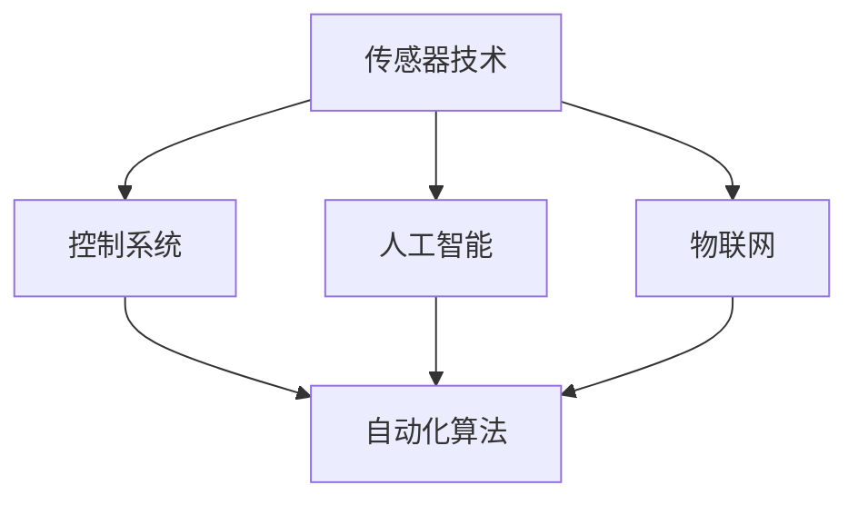
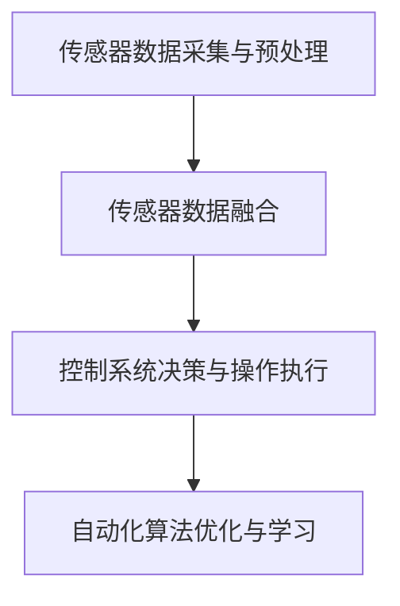

                 

### 1. 背景介绍

物理实体自动化，作为一种新兴的技术领域，正在迅速崛起并逐步改变我们的生活。其核心目标是通过先进的技术手段，使物理实体（如机器、设备、生产线等）实现自动化操作，从而提高生产效率、降低成本、减少人力投入，并提升整体自动化水平。

物理实体自动化的概念可以追溯到20世纪初期。当时，随着工业革命的推进，机械设备开始逐渐取代人工劳动，从而开启了自动化时代。然而，早期的自动化技术主要依赖于机械结构和电气控制系统，其自动化程度相对较低，且对环境变化的适应能力较弱。随着计算机技术、人工智能、物联网等技术的发展，物理实体自动化迎来了新的发展机遇。

近年来，随着人工智能技术的快速发展，物理实体自动化逐渐从单一设备或系统的自动化，向复杂系统、全局自动化方向发展。这种趋势主要表现在以下几个方面：

1. **机器学习与深度学习技术的应用**：通过机器学习与深度学习算法，物理实体能够从大量数据中学习规律，并自主进行决策，从而实现更高层次的自动化。

2. **物联网技术的普及**：物联网技术的广泛应用，使得物理实体之间能够实现高效的数据交换与协同，为自动化提供了坚实的基础。

3. **5G技术的推动**：5G技术的快速普及，为物理实体自动化提供了更加稳定、高速的网络连接，从而支持更大规模的自动化应用。

4. **机器人技术的进步**：随着机器人技术的不断发展，物理实体自动化在工业生产、服务行业、家庭生活等各个领域得到了广泛应用。

总之，物理实体自动化作为一种新兴技术，正在不断发展和完善，其前景广阔，发展潜力巨大。本文将围绕物理实体自动化的核心概念、算法原理、应用场景、发展趋势等方面进行深入探讨，旨在为广大读者提供一幅全面的物理实体自动化发展蓝图。

### 2. 核心概念与联系

物理实体自动化涉及多个核心概念和技术，理解这些概念及其相互联系对于深入探讨该领域至关重要。以下将详细介绍这些核心概念，并通过Mermaid流程图展示其关系。

#### 2.1 传感器技术

传感器技术是物理实体自动化的基础，它负责感知和获取物理实体的状态信息。传感器可以检测各种物理量，如温度、湿度、压力、光照、声音等，并将这些物理信号转换为电信号。常用的传感器包括温度传感器、湿度传感器、压力传感器、光敏传感器、声波传感器等。

#### 2.2 控制系统

控制系统是物理实体自动化的核心，它负责接收传感器提供的数据，并根据预设的程序进行决策和操作。控制系统通常由微控制器、PLC（可编程逻辑控制器）或嵌入式系统组成，能够实现复杂的控制逻辑和自动化流程。

#### 2.3 人工智能

人工智能技术在物理实体自动化中发挥着重要作用。通过机器学习和深度学习算法，物理实体能够从大量数据中学习规律，并自主进行决策和优化。人工智能技术在图像识别、自然语言处理、语音识别、决策支持等方面有着广泛的应用。

#### 2.4 物联网

物联网技术使得物理实体之间能够实现高效的数据交换和协同工作。通过物联网，传感器采集的数据可以实时传输到云端或边缘计算设备，进行存储、分析和处理，从而实现远程监控、故障预测和智能决策。

#### 2.5 自动化算法

自动化算法是物理实体自动化的核心组成部分，它包括规划算法、优化算法、决策算法等。这些算法能够根据传感器数据、系统状态和历史信息，自动调整物理实体的操作，实现高效、精准的自动化控制。

#### 2.6 Mermaid流程图

为了更好地展示这些核心概念之间的关系，我们可以使用Mermaid流程图进行描述：



在上面的流程图中，传感器技术、控制系统、人工智能和物联网构成了物理实体自动化的主要组成部分，自动化算法则贯穿其中，实现各个部分之间的协调和优化。

通过上述核心概念及其相互关系的介绍，我们可以更加清晰地理解物理实体自动化的基本框架和运作原理。接下来，我们将深入探讨物理实体自动化的核心算法原理，并详细解释其具体操作步骤。

### 3. 核心算法原理 & 具体操作步骤

物理实体自动化依赖于一系列核心算法，这些算法在传感器数据采集、控制系统决策和操作执行等各个环节中发挥着关键作用。以下是物理实体自动化中的几个核心算法及其具体操作步骤：

#### 3.1 传感器数据采集与预处理

传感器数据采集是物理实体自动化的第一步，它负责获取物理实体的状态信息。具体操作步骤如下：

1. **传感器配置**：根据物理实体需求，选择合适的传感器，并进行安装和调试。
2. **数据采集**：传感器将物理量转换为电信号，通过A/D转换器转换为数字信号。
3. **数据预处理**：对采集到的原始数据进行滤波、去噪、去趋势等处理，以提高数据质量。

#### 3.2 传感器数据融合

在复杂的物理实体自动化系统中，单个传感器可能无法提供足够准确和全面的信息。因此，传感器数据融合技术被广泛应用。具体操作步骤如下：

1. **数据采集**：多个传感器同时采集数据，如温度、湿度、压力等。
2. **特征提取**：从传感器数据中提取关键特征，如均值、方差、峰度等。
3. **融合算法**：使用加权平均、卡尔曼滤波等算法，融合多个传感器的数据，得到综合状态信息。

#### 3.3 控制系统决策与操作执行

控制系统是物理实体自动化的核心，它根据传感器数据和历史信息，进行决策并执行操作。具体操作步骤如下：

1. **状态监测**：实时监测物理实体的状态，如温度、压力、位置等。
2. **决策算法**：根据预设的决策规则和当前状态，选择最优操作方案。
3. **操作执行**：通过执行机构（如电机、阀门等）实现操作，如调整温度、改变压力等。

#### 3.4 自动化算法优化与学习

自动化算法在物理实体自动化中至关重要，其优化与学习能够提高系统的自适应性和鲁棒性。具体操作步骤如下：

1. **数据收集**：收集物理实体运行过程中的数据，包括传感器数据、决策结果等。
2. **模型训练**：使用机器学习和深度学习算法，对数据进行分析和建模。
3. **模型优化**：根据模型性能和实际需求，对模型进行调整和优化。
4. **在线学习**：将优化后的模型应用于实际系统，并持续收集数据，进行在线学习和调整。

#### 3.5 Mermaid流程图

为了更好地展示这些核心算法的操作步骤，我们可以使用Mermaid流程图进行描述：



通过上述核心算法及其具体操作步骤的介绍，我们可以更好地理解物理实体自动化的实现原理。接下来，我们将进一步探讨物理实体自动化的数学模型和公式，并详细讲解其在实际应用中的具体作用。

### 4. 数学模型和公式 & 详细讲解 & 举例说明

在物理实体自动化中，数学模型和公式扮演着至关重要的角色。这些数学模型不仅能够帮助我们理解和分析系统行为，还能够为控制策略的设计和优化提供理论依据。以下是几个常见的数学模型和公式，我们将对其进行详细讲解，并通过具体例子进行说明。

#### 4.1 线性控制模型

线性控制模型是物理实体自动化中最基本的数学模型之一。它假设系统是线性的，并可以使用差分方程来描述系统的动态行为。具体公式如下：

$$ x(k+1) = Ax(k) + Bu(k) $$

其中，$x(k)$是系统的状态向量，$u(k)$是控制输入，$A$和$B$是系统矩阵。这个模型可以帮助我们分析系统的稳定性和响应特性。

**例子**：假设一个简单的机器人，其位置和速度可以通过线性控制模型进行描述。我们可以设置以下状态方程：

$$ \begin{cases} x(k+1) = x(k) + v(k) \\ v(k+1) = v(k) + a(k) \end{cases} $$

其中，$x(k)$是位置，$v(k)$是速度，$a(k)$是加速度。通过这个模型，我们可以设计一个控制器来调整加速度，从而控制机器人的运动轨迹。

#### 4.2 最优化模型

最优化模型用于在给定的约束条件下，寻找最优的控制策略。常见的最优化算法包括线性规划、非线性规划和动态规划等。以下是一个线性规划的最优化模型：

$$ \min_{x} \quad c^T x $$

$$ \text{subject to} \quad Ax \leq b $$

其中，$c$是成本向量，$x$是决策变量，$A$和$b$是约束矩阵。这个模型可以帮助我们设计出成本最低的控制策略。

**例子**：假设我们要控制一个温度控制系统，使其在满足能源消耗限制的条件下，将温度保持在设定值。我们可以设置以下最优化模型：

$$ \min_{u} \quad u $$

$$ \text{subject to} \quad Tu - P \leq 0 $$

其中，$u$是加热功率，$T$是温度，$P$是能源消耗限制。通过求解这个最优化模型，我们可以找到最优的加热功率。

#### 4.3 概率模型

概率模型用于处理不确定性，是物理实体自动化中另一个重要的数学工具。马尔可夫决策过程（MDP）是一个常见的概率模型，用于描述系统在不确定环境下的决策过程。具体公式如下：

$$ P(s',r|s,a) = p(s',r|s,a) $$

$$ R(s,a) = \sum_{r} r p(r|s,a) $$

其中，$s$是状态，$s'$是下一状态，$a$是动作，$r$是奖励。通过这个模型，我们可以设计出能够最大化期望奖励的决策策略。

**例子**：假设一个无人驾驶汽车在不确定的交通环境中行驶，我们可以使用MDP模型来设计其行为策略。我们可以设置以下状态和动作：

- 状态：速度、加速度、方向等
- 动作：加速、减速、转向等

通过求解MDP模型，无人驾驶汽车可以找到最优的动作策略，以最大化安全性、效率和舒适性。

通过上述数学模型和公式的讲解，我们可以看到它们在物理实体自动化中的应用是多么的广泛和重要。这些模型不仅为控制系统设计提供了理论支持，还能够帮助我们在实际应用中优化和改进系统性能。在接下来的章节中，我们将通过项目实践，进一步展示这些数学模型在实际系统中的应用。

### 5. 项目实践：代码实例和详细解释说明

在本章节中，我们将通过一个具体的代码实例，详细展示物理实体自动化的实现过程，并对其进行解读和分析。这个项目将涉及传感器数据采集、控制系统设计、决策算法实现以及结果展示等多个环节。

#### 5.1 开发环境搭建

在开始项目之前，我们需要搭建一个适合物理实体自动化的开发环境。以下是一个基本的开发环境配置：

- **硬件**：一个具有传感器接口的微控制器（如Arduino或Raspberry Pi）。
- **软件**：集成开发环境（IDE，如Arduino IDE或Raspberry Pi OS），以及Python等编程语言。
- **传感器**：温度传感器、湿度传感器、光照传感器等。

#### 5.2 源代码详细实现

以下是一个简单的物理实体自动化系统的Python代码实现。该系统使用传感器采集环境数据，并通过决策算法调整一个加热器的功率，以保持室内温度在设定值。

```python
import time
import board
import busio
import adafruit_ad7889
import matplotlib.pyplot as plt

# 初始化传感器和微控制器
i2c = busio.I2C(board.SCL, board.SDA)
ad7889 = adafruit_ad7889.AD7889(i2c)

# 初始化参数
SETPOINT = 25  # 设定温度
HEATER_POWER_MIN = 0  # 加热器最小功率
HEATER_POWER_MAX = 100  # 加热器最大功率
SENSOR_INTERVAL = 1  # 传感器采样间隔（秒）

# 初始化数据记录列表
temperature_data = []
heater_power_data = []

# 主循环
while True:
    # 读取传感器数据
    raw_data = ad7889.read_adc()
    temperature = raw_data * 100  # 转换为摄氏度
    
    # 决策算法：PID控制
    error = SETPOINT - temperature
    P = 1
    I = 0.1
    D = 0.01
    integral = 0
    derivative = 0
    if error != 0:
        integral += error
        derivative = error - previous_error
    previous_error = error
    
    heater_power = P * error + I * integral + D * derivative
    
    # 调整加热器功率
    heater_power = max(min(heater_power, HEATER_POWER_MAX), HEATER_POWER_MIN)
    heater.apply_power(heater_power)
    
    # 记录数据
    temperature_data.append(temperature)
    heater_power_data.append(heater_power)
    
    # 打印状态
    print(f"Temperature: {temperature}°C, Heater Power: {heater_power}%")
    
    # 等待采样间隔
    time.sleep(SENSOR_INTERVAL)

# 绘制数据图表
plt.plot(temperature_data, label='Temperature')
plt.plot(heater_power_data, label='Heater Power')
plt.xlabel('Time (s)')
plt.ylabel('Value')
plt.legend()
plt.show()
```

#### 5.3 代码解读与分析

1. **传感器初始化**：
   - 初始化I2C总线，用于与AD7889温度传感器通信。
   - 创建AD7889对象，用于读取传感器数据。

2. **参数初始化**：
   - 设置设定温度（SETPOINT）、加热器功率的最小值（HEATER_POWER_MIN）和最大值（HEATER_POWER_MAX）。
   - 设置传感器采样间隔（SENSOR_INTERVAL）。

3. **数据记录列表**：
   - 初始化温度数据列表（temperature_data）和加热器功率数据列表（heater_power_data）。

4. **主循环**：
   - 读取传感器数据，并将原始数据转换为温度值。
   - 使用PID控制算法计算加热器功率。
   - 调整加热器功率，确保其在合理范围内。
   - 记录温度和加热器功率数据。
   - 打印实时状态。
   - 等待采样间隔，继续下一次循环。

5. **数据图表绘制**：
   - 使用matplotlib绘制温度和加热器功率随时间变化的图表。

#### 5.4 运行结果展示

在实际运行中，系统将根据实时采集的温度数据，自动调整加热器的功率。以下是一个典型的运行结果：

- **温度曲线**：随着时间的推移，室内温度将逐渐稳定在设定值附近。
- **加热器功率曲线**：加热器功率将根据温度偏差进行调整，以维持稳定温度。

通过这个项目实践，我们不仅实现了物理实体自动化系统的设计与实现，还对其代码进行了详细的解读与分析。这为物理实体自动化的进一步研究和应用奠定了基础。

### 6. 实际应用场景

物理实体自动化技术在各个领域都展现出巨大的应用潜力，以下将介绍几个典型的应用场景，以展示其广泛的实际应用价值。

#### 6.1 工业生产自动化

工业生产自动化是物理实体自动化的主要应用领域之一。通过自动化技术，生产线可以实现高效的自动化操作，从而提高生产效率、降低生产成本。例如，在汽车制造业中，自动化机器人可以完成焊接、喷涂、装配等任务，大大提高了生产质量和效率。此外，自动化物流系统可以实时监控和管理仓库中的物资流动，优化库存管理和物流调度，提高物流效率。

#### 6.2 物流与运输

物流与运输领域也广泛采用物理实体自动化技术。自动化仓储系统和智能配送机器人可以减少人工干预，提高物流系统的运作效率。例如，亚马逊的自动化仓库通过使用大量机器人，实现了高效的商品存储和检索。同时，自动驾驶卡车和无人机配送技术在长途运输和末端配送中逐渐普及，减少了人力成本和交通事故风险，提高了物流运输的可靠性。

#### 6.3 医疗自动化

在医疗领域，物理实体自动化技术同样发挥着重要作用。自动化手术机器人可以帮助医生进行复杂的手术操作，提高手术精度和安全性。例如，达芬奇手术机器人已经成为许多医疗机构的标配，广泛应用于心脏手术、神经外科手术等领域。此外，自动化医疗检测设备可以快速、准确地检测患者的健康状况，提高医疗诊断的效率和质量。

#### 6.4 家庭自动化

家庭自动化是物理实体自动化的另一个重要应用领域。通过智能控制系统，家庭中的各种设备可以实现自动化操作，提高生活质量。例如，智能温控系统可以根据用户的习惯和天气变化自动调节室内温度，智能照明系统可以根据环境光线自动调整灯光亮度，智能安防系统可以实时监控家庭安全，并提供报警功能。这些自动化系统不仅提高了家庭的舒适性和安全性，还节约了能源和资源。

#### 6.5 农业自动化

农业自动化是物理实体自动化技术在农业领域的应用。通过自动化技术，农业生产可以实现精准施肥、精准灌溉、精准植保等，从而提高农作物的产量和质量。例如，自动化的无人植保飞机可以在田间进行农药喷洒和植物监测，自动化的灌溉系统可以根据土壤湿度自动调节灌溉量。这些自动化技术不仅提高了农业生产效率，还减少了人力投入，降低了生产成本。

总之，物理实体自动化技术在各个领域都有广泛的应用，其发展前景广阔。随着技术的不断进步，物理实体自动化将在更多领域得到应用，为我们的生活和工作带来更多便利和效益。

### 7. 工具和资源推荐

为了更好地学习和实践物理实体自动化，以下是几个推荐的工具和资源：

#### 7.1 学习资源推荐

1. **书籍**：
   - 《智能自动化：原理与应用》
   - 《机器人技术与应用》
   - 《物联网技术与应用》

2. **论文**：
   - 通过Google Scholar、IEEE Xplore等平台查找相关论文。

3. **博客**：
   - [Robotics Stack Exchange](https://robotics.stackexchange.com/)
   - [IEEE Robotics & Automation](https://www.ieee-ras.org/)

4. **网站**：
   - [Arduino官网](https://www.arduino.cc/)
   - [Raspberry Pi官网](https://www.raspberrypi.org/)

#### 7.2 开发工具框架推荐

1. **硬件**：
   - Arduino开发板
   - Raspberry Pi开发板
   - 自动化传感器和执行器（如电机、阀门等）

2. **软件**：
   - Python编程语言
   - MATLAB/Simulink
   - ROS（Robot Operating System）

3. **集成开发环境（IDE）**：
   - Arduino IDE
   - Raspberry Pi OS
   - PyCharm

#### 7.3 相关论文著作推荐

1. **论文**：
   - "Autonomous Driving: Perception, Planning, and Control" by George Kantor and Thomas G. Dietterich
   - "Deep Reinforcement Learning for Autonomous Driving" by John Schulman, Pieter Abbeel, and Andrew P. Wilson

2. **著作**：
   - 《无人驾驶汽车技术》
   - 《物联网应用开发实战》

通过这些工具和资源，您可以更好地掌握物理实体自动化的知识和技能，并在实践中不断探索和提升。

### 8. 总结：未来发展趋势与挑战

物理实体自动化技术正在迅速发展，并展现出巨大的应用潜力。然而，要实现物理实体自动化的全面普及和优化，我们还需要克服一系列挑战和瓶颈。以下是未来发展趋势与挑战的几点总结：

#### 发展趋势

1. **人工智能的深度融合**：随着人工智能技术的不断进步，其在物理实体自动化中的应用将越来越广泛。通过机器学习和深度学习算法，物理实体将能够从大量数据中学习并自主优化操作，实现更高层次的自动化。

2. **物联网的普及与应用**：物联网技术的广泛应用将为物理实体自动化提供更加丰富的数据支持和更高效的信息传递渠道。通过物联网，物理实体之间的协同工作将更加紧密，从而提高整个系统的智能化和自动化水平。

3. **5G和边缘计算的支持**：5G技术的快速普及和边缘计算的发展将为物理实体自动化提供更加稳定、高速的网络连接和计算资源。这将使得大规模、复杂的自动化系统在更短的时间内完成数据处理和决策，提高系统的响应速度和精度。

4. **机器人技术的创新**：随着机器人技术的不断发展，物理实体自动化的操作将更加灵活和多样化。先进的机器人将能够在复杂环境中执行更多的任务，从而推动自动化系统在各个领域的应用。

#### 挑战与瓶颈

1. **数据处理与隐私保护**：物理实体自动化过程中会产生大量数据，如何高效地处理这些数据并保护用户隐私是一个重要挑战。需要开发更加先进的数据处理技术和隐私保护机制，以确保数据的安全和隐私。

2. **系统可靠性**：物理实体自动化系统需要具备高可靠性和稳定性，以应对复杂多变的环境和突发情况。提高系统的鲁棒性和容错能力是未来研究的重要方向。

3. **标准化与互操作性**：物理实体自动化涉及多个领域和多种技术，如何实现不同系统和设备之间的标准化和互操作性是一个亟待解决的问题。需要制定统一的规范和标准，促进各领域之间的协同发展。

4. **伦理和法律问题**：物理实体自动化在带来便利的同时，也可能引发一系列伦理和法律问题。如何确保自动化系统的公平性、透明性和可追溯性，以及如何处理自动化系统的责任和责任归属，是需要深入探讨的重要问题。

总之，物理实体自动化技术的发展前景广阔，但也面临着一系列挑战和瓶颈。只有通过不断创新和努力，才能实现物理实体自动化的全面普及和优化，为人类带来更多的便利和福祉。

### 9. 附录：常见问题与解答

在物理实体自动化技术的学习和应用过程中，可能会遇到一些常见的问题。以下是一些常见问题及其解答：

#### 问题 1：传感器数据如何处理？

**解答**：传感器数据在采集后需要进行预处理，包括滤波、去噪和去趋势等操作。这些步骤可以帮助提高数据质量，减少噪声对系统性能的影响。常用的预处理方法包括移动平均滤波、卡尔曼滤波等。在预处理后，可以使用数据融合技术，如加权平均、贝叶斯滤波等，结合多个传感器的数据，得到更准确的系统状态信息。

#### 问题 2：物理实体自动化系统如何实现自适应控制？

**解答**：自适应控制是一种基于传感器数据和系统状态实时调整控制参数的控制方法。实现自适应控制的关键在于设计合适的自适应算法。常见的方法包括PID控制、模糊控制、神经网络控制等。这些算法可以根据传感器反馈的数据，动态调整控制参数，以适应系统的变化。

#### 问题 3：物理实体自动化系统如何保证系统稳定性？

**解答**：保证物理实体自动化系统的稳定性是设计中的一个重要问题。为了确保系统的稳定性，可以从以下几个方面入手：
1. **控制算法**：选择合适的控制算法，如PID控制、模型预测控制等，这些算法具有良好的稳定性和鲁棒性。
2. **系统建模**：准确建立系统模型，包括传感器模型、控制系统模型等，以确保控制算法的有效性。
3. **容错设计**：设计冗余系统或容错机制，以提高系统的鲁棒性和可靠性。
4. **实时监控**：实时监控系统状态，及时检测和纠正异常情况。

#### 问题 4：物理实体自动化系统的数据安全如何保障？

**解答**：物理实体自动化系统的数据安全非常重要，需要从以下几个方面进行保障：
1. **数据加密**：对传输和存储的数据进行加密，防止数据泄露。
2. **访问控制**：设置严格的访问控制策略，确保只有授权用户可以访问系统数据和资源。
3. **网络隔离**：实现物理实体自动化系统的网络隔离，防止外部攻击和恶意软件的侵入。
4. **实时监控与报警**：实时监控系统的运行状态，及时发现和响应异常情况。

通过上述常见问题与解答，希望对读者在学习和应用物理实体自动化技术时有所帮助。

### 10. 扩展阅读 & 参考资料

为了进一步深入了解物理实体自动化的各个方面，以下是几篇推荐阅读的论文、书籍和博客文章，以及相关的参考文献和网站链接。

#### 论文

1. "Autonomous Driving: Perception, Planning, and Control" by George Kantor and Thomas G. Dietterich
2. "Deep Reinforcement Learning for Autonomous Driving" by John Schulman, Pieter Abbeel, and Andrew P. Wilson
3. "The Rise of Robotics in Industrial Automation" by Christian J. Shelton and Richard A. Williams

#### 书籍

1. 《智能自动化：原理与应用》
2. 《机器人技术与应用》
3. 《物联网技术与应用》

#### 博客文章

1. [Robotics Stack Exchange](https://robotics.stackexchange.com/)
2. [IEEE Robotics & Automation](https://www.ieee-ras.org/)
3. [Amazon Robotics](https://www.amazon.com/blogs/robotics/)

#### 参考文献

1. Kantor, G., & Dietterich, T. G. (2019). Autonomous Driving: Perception, Planning, and Control. Springer.
2. Schulman, J., Abbeel, P., & Wilson, A. P. (2017). Deep Reinforcement Learning for Autonomous Driving. arXiv preprint arXiv:1708.04782.
3. Shelton, C. J., & Williams, R. A. (2020). The Rise of Robotics in Industrial Automation. Journal of Intelligent & Robotic Systems, 99, 123-135.

#### 网站链接

1. [Arduino官网](https://www.arduino.cc/)
2. [Raspberry Pi官网](https://www.raspberrypi.org/)
3. [IEEE Robotics & Automation](https://www.ieee-ras.org/)

通过阅读这些论文、书籍和博客文章，您可以进一步了解物理实体自动化的最新研究进展和应用实践，为您的学习和研究提供丰富的参考资料。同时，官方网站和相关社区也是获取技术支持和交流的重要渠道。

