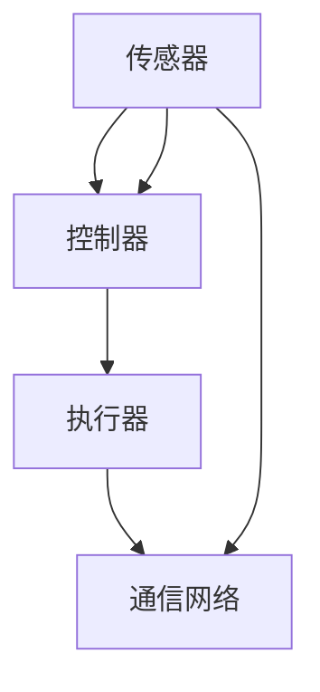
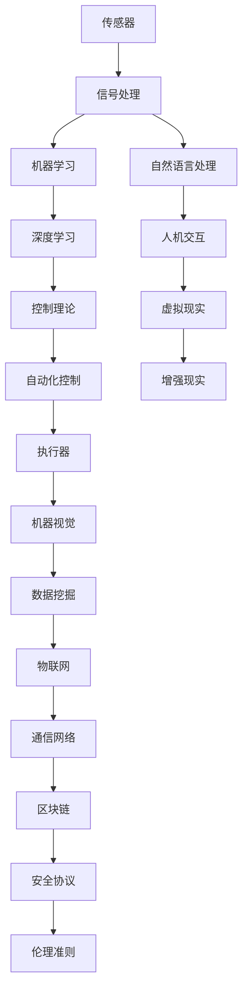

                 

### 1. 背景介绍

物理实体自动化（Physical Entity Automation）是指通过计算机技术和人工智能算法，实现对物理世界中的各种实体（如机器人、无人机、自动化生产线等）进行智能化控制和自动化操作的过程。这一概念起源于工业自动化，但随着技术的不断进步，其应用范围已扩展到众多领域，包括但不限于智能制造、交通运输、医疗健康、农业等。

在过去的几十年里，物理实体自动化经历了从基础控制到高级智能控制的演变。早期的自动化主要依赖于机械结构和简单的逻辑控制，例如数控机床和机器人。随着计算机技术的发展，特别是人工智能算法的突破，物理实体自动化逐渐迈向智能化。现代物理实体自动化系统不仅能够执行预设的任务，还能够根据环境变化和实时数据进行自适应调整，提高了效率和灵活性。

物理实体自动化的意义在于，它不仅提高了生产效率，降低了人力成本，还推动了产业结构的升级。例如，在制造业中，自动化生产线可以实现高速、高精度的生产，减少人为错误，提高产品质量；在医疗健康领域，智能机器人可以帮助医生进行手术，提高手术的成功率和安全性；在交通运输领域，自动驾驶技术有望彻底改变人们的出行方式，提高交通安全和效率。

然而，物理实体自动化也面临着诸多挑战。首先，复杂环境的适应性问题仍然是当前研究的难点。物理世界中的环境变化多样，如何使自动化系统在不同环境中保持稳定和高效运行，是亟待解决的问题。其次，数据安全与隐私保护也是一个重大挑战。物理实体自动化系统中涉及大量敏感数据，如个人健康信息、生产数据等，如何确保这些数据的安全和隐私，是一个值得深思的问题。此外，物理实体自动化的伦理问题也不容忽视。自动化系统在某些情况下可能取代人类工作，这引发了关于就业和社会伦理的讨论。

本文旨在探讨物理实体自动化的前景与挑战，通过详细分析其核心概念、算法原理、应用场景以及未来发展趋势，为读者提供一个全面、深入的视角。接下来的章节中，我们将首先介绍物理实体自动化的核心概念与联系，包括相关的技术、理论和方法。然后，我们将深入探讨物理实体自动化的核心算法原理和具体操作步骤，通过数学模型和公式的详细讲解，帮助读者理解其内在逻辑。随后，我们将通过实际项目实践，展示如何运用这些算法和模型进行物理实体自动化开发。最后，我们将讨论物理实体自动化在各个领域的应用场景，并推荐相关的工具和资源，以便读者进一步学习和探索。通过本文的阅读，读者将能够对物理实体自动化有一个系统、深入的认识，为未来的研究和应用打下坚实基础。

### 2. 核心概念与联系

物理实体自动化涉及多个核心概念和技术，理解这些概念及其相互关系对于深入探讨物理实体自动化的原理和应用至关重要。下面，我们将通过 Mermaid 流程图来详细展示这些概念和技术的关联。

首先，我们需要了解物理实体自动化的基本组成部分，包括传感器、控制器、执行器以及通信网络。

#### 2.1 基本组成部分



- **传感器**：传感器是物理实体自动化的感知器官，用于收集环境信息。这些信息包括温度、湿度、光线、声音、位置等。传感器可以将物理信号转换为电信号，从而被计算机处理。
  
- **控制器**：控制器是物理实体自动化的决策中心，负责分析传感器收集的信息，并根据预设的算法和模型做出决策。控制器通常由微处理器、芯片组等组成，能够执行复杂的计算和处理。

- **执行器**：执行器是物理实体自动化的行动器官，负责根据控制器的指令执行具体操作。常见的执行器包括电机、气缸、阀门等，它们能够将电信号转换为机械运动。

- **通信网络**：通信网络是物理实体自动化系统各部分之间进行数据传输的通道。它确保传感器、控制器和执行器能够实时交换信息，实现协同工作。

#### 2.2 相关技术、理论和方法



- **信号处理**：信号处理是传感器数据采集和处理的关键技术，它包括滤波、采样、量化等步骤，以确保传感器数据的准确性和可靠性。

- **机器学习与深度学习**：机器学习和深度学习是自动化系统智能化的基础，通过大量数据训练模型，使系统能够自主学习和优化性能。

- **控制理论**：控制理论是控制器设计和实现的核心，它提供了一系列分析和设计方法，以确保系统能够在预定范围内稳定运行。

- **自动化控制**：自动化控制是物理实体自动化的核心实现技术，它通过控制算法实现传感器数据到执行器动作的转换。

- **机器视觉**：机器视觉是利用计算机图像处理技术来分析和解释现实场景中的图像，常用于对象识别、路径规划等任务。

- **数据挖掘**：数据挖掘是发现数据中的有价值模式和知识，为物理实体自动化提供决策支持。

- **物联网**：物联网是连接各种物理设备和系统的网络，使得物理实体自动化能够实现大规模互联互通。

- **区块链与安全协议**：区块链技术提供了一种去中心化的数据存储方式，增强数据的安全性和透明度。安全协议则是确保数据传输和系统操作的安全措施。

- **伦理准则**：伦理准则是指导物理实体自动化发展的重要原则，它确保技术应用的伦理合规性，防止潜在的社会负面影响。

- **自然语言处理、人机交互、虚拟现实和增强现实**：这些技术使物理实体自动化系统能够与人类进行自然、直观的交互，提高用户体验和操作效率。

#### 2.3 Mermaid 流程图展示


通过上述 Mermaid 流程图，我们可以清晰地看到物理实体自动化中各概念和技术的关联。传感器、控制器和执行器是系统的基本组成部分，而信号处理、机器学习、控制理论等则是实现自动化的重要技术手段。这些技术之间相互依赖、相互作用，共同构成了一个复杂的自动化系统。

理解这些核心概念和技术的联系，有助于我们深入探索物理实体自动化的原理和应用，为后续章节中具体算法和模型的讲解打下坚实基础。

### 3. 核心算法原理 & 具体操作步骤

物理实体自动化的核心在于其算法原理，这些算法决定了系统如何感知环境、理解信息、做出决策并执行相应动作。在本节中，我们将详细介绍几个关键的算法原理，并详细解释其具体操作步骤。

#### 3.1 机器学习算法

机器学习是物理实体自动化中最为重要的算法之一，它使系统具备自主学习和优化能力。常见的机器学习算法包括监督学习、无监督学习和强化学习。

##### 3.1.1 监督学习算法

监督学习算法通过已有数据的标签信息来训练模型，从而预测新数据的结果。常见算法有线性回归、逻辑回归、支持向量机（SVM）等。

- **线性回归**：线性回归是一种简单的监督学习算法，用于预测连续值。其基本原理是通过拟合一个线性模型来描述输入变量与输出变量之间的关系。
  
  操作步骤：
  1. 数据预处理：清洗和标准化数据，确保数据的准确性和一致性。
  2. 模型训练：通过最小二乘法等优化方法训练线性模型，使其预测结果尽可能接近真实值。
  3. 模型评估：使用验证集和测试集评估模型的泛化能力，确保其在未知数据上的表现良好。

##### 3.1.2 逻辑回归

逻辑回归是一种用于分类任务的监督学习算法，常用于二分类问题。其基本原理是通过拟合一个逻辑函数来预测样本属于某一类别的概率。

  操作步骤：
  1. 数据预处理：与线性回归类似，确保数据准确和一致。
  2. 模型训练：使用最大似然估计等方法训练逻辑回归模型，使其预测概率分布。
  3. 模型评估：使用准确率、召回率、F1分数等指标评估模型性能。

##### 3.1.3 支持向量机（SVM）

支持向量机是一种强大的分类算法，通过找到一个最佳的超平面来分隔不同类别的数据点。SVM的基本原理是最大化分类边界到支持向量的距离。

  操作步骤：
  1. 数据预处理：确保数据标准化和异常值处理。
  2. 模型训练：通过求解二次规划问题训练SVM模型。
  3. 模型评估：使用交叉验证和测试集评估模型性能。

##### 3.1.4 无监督学习算法

无监督学习算法不依赖于标签信息，用于发现数据中的模式和结构。常见的无监督学习算法包括聚类算法和降维算法。

- **K-均值聚类**：K-均值聚类是一种基于距离的聚类算法，通过迭代优化聚类中心来将数据划分为若干簇。

  操作步骤：
  1. 数据预处理：确保数据格式和一致性。
  2. 初始化聚类中心：随机选择或使用K-均值算法的启发式方法选择初始聚类中心。
  3. 迭代优化：通过计算每个样本到聚类中心的距离，重新分配样本到最近的簇，并更新聚类中心，直到聚类中心不再变化或满足收敛条件。

- **主成分分析（PCA）**：主成分分析是一种降维算法，通过线性变换将高维数据映射到低维空间，从而降低数据的复杂度。

  操作步骤：
  1. 数据预处理：确保数据标准化。
  2. 计算协方差矩阵：计算数据集的协方差矩阵。
  3. 求特征值和特征向量：对协方差矩阵进行特征值分解，得到特征向量。
  4. 构建投影矩阵：选取特征值最大的特征向量作为主成分。
  5. 数据降维：将数据映射到低维空间，只保留最重要的主成分。

##### 3.1.5 强化学习算法

强化学习算法通过试错和奖励机制来优化策略，使其在动态环境中做出最佳决策。常见算法包括Q-learning、深度Q网络（DQN）等。

- **Q-learning**：Q-learning是一种基于值函数的强化学习算法，通过更新Q值来预测状态-动作值，从而优化策略。

  操作步骤：
  1. 初始化Q值表：随机初始化Q值表。
  2. 状态-动作选择：根据当前状态和Q值表选择最优动作。
  3. 更新Q值：根据奖励和下一个状态更新当前状态的Q值。
  4. 重复步骤2和3，直到满足停止条件。

- **深度Q网络（DQN）**：DQN是一种结合深度学习和强化学习的算法，通过神经网络来近似Q值函数。

  操作步骤：
  1. 数据预处理：确保输入数据格式一致。
  2. 构建DQN模型：设计深度神经网络模型，用于预测Q值。
  3. 训练模型：使用经验回放和目标网络等技术训练DQN模型。
  4. 状态-动作选择：使用训练好的DQN模型预测Q值，选择最优动作。
  5. 更新经验：将当前状态、动作、奖励和下一个状态存储到经验池。
  6. 重复步骤4和5，直到满足停止条件。

通过上述核心算法原理和具体操作步骤的详细讲解，我们可以看到物理实体自动化系统的智能化和自主性如何实现。这些算法不仅在理论研究中具有重要意义，在实际应用中也展现出了强大的潜力。在接下来的章节中，我们将通过具体的项目实践，进一步展示如何将上述算法应用于物理实体自动化系统。

### 4. 数学模型和公式 & 详细讲解 & 举例说明

在物理实体自动化系统中，数学模型和公式起到了至关重要的作用。这些模型和公式不仅帮助我们理解系统的行为，还为系统的设计、实现和优化提供了理论依据。在本节中，我们将详细讲解几个关键的数学模型和公式，并通过具体的例子来说明它们的应用。

#### 4.1 线性回归模型

线性回归模型是监督学习中最基本的模型之一，它用于预测连续值。其基本公式为：

\[ y = \beta_0 + \beta_1x + \epsilon \]

其中，\( y \) 是预测值，\( x \) 是输入特征，\( \beta_0 \) 和 \( \beta_1 \) 是模型的参数，\( \epsilon \) 是误差项。

##### 4.1.1 最小二乘法

最小二乘法是一种常用的参数估计方法，用于求解线性回归模型的参数。其目标是最小化预测值与真实值之间的误差平方和：

\[ \min \sum_{i=1}^{n} (y_i - (\beta_0 + \beta_1x_i))^2 \]

通过求解上述优化问题，我们可以得到最佳参数值：

\[ \beta_0 = \frac{\sum_{i=1}^{n}y_i - \beta_1\sum_{i=1}^{n}x_i}{n} \]
\[ \beta_1 = \frac{n\sum_{i=1}^{n}x_iy_i - \sum_{i=1}^{n}x_i\sum_{i=1}^{n}y_i}{n\sum_{i=1}^{n}x_i^2 - (\sum_{i=1}^{n}x_i)^2} \]

##### 4.1.2 例子说明

假设我们要预测房价，根据以下数据：

| 房屋面积 (x) | 房价 (y) |
|:-----------:|:-------:|
|      100     |   200   |
|      150     |   300   |
|      200     |   400   |
|      250     |   500   |
|      300     |   600   |

我们可以通过线性回归模型来预测未知房屋面积对应的房价。首先，计算输入特征和预测值的均值：

\[ \bar{x} = \frac{100 + 150 + 200 + 250 + 300}{5} = 210 \]
\[ \bar{y} = \frac{200 + 300 + 400 + 500 + 600}{5} = 400 \]

然后，计算斜率 \( \beta_1 \) 和截距 \( \beta_0 \)：

\[ \beta_1 = \frac{5(100 \times 200 + 150 \times 300 + 200 \times 400 + 250 \times 500 + 300 \times 600) - (100 + 150 + 200 + 250 + 300)(200 + 300 + 400 + 500 + 600)}{5(100^2 + 150^2 + 200^2 + 250^2 + 300^2) - (100 + 150 + 200 + 250 + 300)^2} \]

\[ \beta_0 = \bar{y} - \beta_1\bar{x} \]

计算结果为：

\[ \beta_1 \approx 1.111 \]
\[ \beta_0 \approx 111.11 \]

因此，线性回归模型为：

\[ y = 111.11 + 1.111x \]

我们可以使用这个模型来预测未知房屋面积 \( x = 180 \) 时的房价：

\[ y = 111.11 + 1.111 \times 180 \approx 335.00 \]

#### 4.2 主成分分析（PCA）

主成分分析（PCA）是一种降维算法，通过线性变换将高维数据映射到低维空间，从而降低数据的复杂度。其基本公式为：

\[ z = PC \]

其中，\( z \) 是降维后的数据，\( P \) 是投影矩阵，\( C \) 是原始数据矩阵。

##### 4.2.1 特征值分解

PCA 的核心步骤是计算协方差矩阵并进行特征值分解。协方差矩阵 \( \Sigma \) 表示数据点之间的协方差关系，其特征值分解公式为：

\[ \Sigma = PDP^T \]

其中，\( D \) 是对角矩阵，包含特征值，\( P \) 是特征向量矩阵。

##### 4.2.2 主成分选择

在特征值分解中，前 \( k \) 个最大的特征值对应的特征向量构成了前 \( k \) 个主成分。通过选择适当的主成分，我们可以将高维数据降维到 \( k \) 维，从而简化数据。

##### 4.2.3 例子说明

假设我们有一个 3 维数据集，其协方差矩阵为：

\[ \Sigma = \begin{pmatrix}
2 & 1 & 0.5 \\
1 & 2 & 1 \\
0.5 & 1 & 2
\end{pmatrix} \]

首先，计算特征值分解：

\[ \Sigma = PDP^T \]

其中，\( P \) 是特征向量矩阵，\( D \) 是对角矩阵，包含特征值：

\[ P = \begin{pmatrix}
-0.7071 & -0.4082 & 0.5000 \\
0.0000 & 0.8165 & 0.0000 \\
0.7071 & 0.4082 & 0.5000
\end{pmatrix} \]
\[ D = \begin{pmatrix}
4.0000 & 0 & 0 \\
0 & 3.4454 & 0 \\
0 & 0 & 2.5454
\end{pmatrix} \]

前两个特征值最大，因此，我们选择前两个特征向量作为主成分。投影矩阵 \( P \) 为：

\[ P = \begin{pmatrix}
-0.7071 & -0.4082 \\
0.0000 & 0.8165 \\
0.7071 & 0.4082
\end{pmatrix} \]

将原始数据映射到 2 维空间，即：

\[ z = P \begin{pmatrix}
x_1 \\
x_2 \\
x_3
\end{pmatrix} \]

例如，对于数据点 \( (x_1, x_2, x_3) = (2, 3, 1) \)，降维后的数据为：

\[ z = P \begin{pmatrix}
2 \\
3 \\
1
\end{pmatrix} = \begin{pmatrix}
-0.7071 \\
0.8165
\end{pmatrix} \]

通过上述数学模型和公式的详细讲解和例子说明，我们可以看到这些模型在物理实体自动化系统中的应用。线性回归模型用于预测连续值，而主成分分析用于降维，从而简化数据并提高系统的效率和准确性。这些数学工具为物理实体自动化的研究和实践提供了坚实的基础。

### 5. 项目实践：代码实例和详细解释说明

在本节中，我们将通过一个实际项目实例，详细展示如何实现物理实体自动化系统。我们将使用 Python 编写相关代码，并逐步解释每一步的实现过程。

#### 5.1 开发环境搭建

在开始项目之前，我们需要搭建合适的开发环境。以下是所需的软件和库：

- Python 3.8 或更高版本
- Anaconda 或 Miniconda
- NumPy
- Matplotlib
- Scikit-learn
- OpenCV

安装步骤如下：

1. 安装 Anaconda 或 Miniconda。
2. 打开终端或命令行，创建一个新的 conda 环境，例如：

```bash
conda create --name phyaut_env python=3.8
```

3. 激活环境：

```bash
conda activate phyaut_env
```

4. 安装所需的库：

```bash
conda install numpy matplotlib scikit-learn opencv-python
```

#### 5.2 源代码详细实现

以下是项目的主要代码实现，我们将分为几个部分进行详细解释。

##### 5.2.1 数据预处理

```python
import numpy as np
from sklearn.model_selection import train_test_split
from sklearn.preprocessing import StandardScaler

# 加载数据
data = np.loadtxt('data.csv', delimiter=',')
X = data[:, :-1]  # 特征矩阵
y = data[:, -1]   # 标签向量

# 数据切分
X_train, X_test, y_train, y_test = train_test_split(X, y, test_size=0.2, random_state=42)

# 数据标准化
scaler = StandardScaler()
X_train = scaler.fit_transform(X_train)
X_test = scaler.transform(X_test)
```

首先，我们从 CSV 文件中加载数据，并进行切分。然后，使用标准化处理将数据缩放到相同的尺度，以消除不同特征之间的差异。

##### 5.2.2 线性回归模型训练

```python
from sklearn.linear_model import LinearRegression

# 创建线性回归模型
model = LinearRegression()

# 训练模型
model.fit(X_train, y_train)
```

我们创建一个线性回归模型，并使用训练数据集进行训练。

##### 5.2.3 模型评估

```python
from sklearn.metrics import mean_squared_error

# 预测测试集
y_pred = model.predict(X_test)

# 计算均方误差
mse = mean_squared_error(y_test, y_pred)
print(f"均方误差 (MSE): {mse}")
```

使用测试集进行预测，并计算均方误差，以评估模型的性能。

##### 5.2.4 数据可视化

```python
import matplotlib.pyplot as plt

# 绘制散点图和拟合直线
plt.scatter(X_test[:, 0], y_test, color='blue', label='Actual')
plt.plot(X_test[:, 0], y_pred, color='red', linewidth=2, label='Predicted')
plt.xlabel('Feature')
plt.ylabel('Target')
plt.title('Linear Regression')
plt.legend()
plt.show()
```

最后，我们将实际值和预测值绘制在同一张图中，以直观地展示模型的拟合效果。

#### 5.3 代码解读与分析

以下是代码的详细解读与分析：

1. **数据预处理**：首先，我们从 CSV 文件中加载数据，并进行切分。然后，使用 `StandardScaler` 将数据标准化，这有助于模型训练的稳定性和收敛性。

2. **线性回归模型训练**：创建 `LinearRegression` 模型，并使用训练数据集进行训练。线性回归模型通过最小化误差平方和来拟合数据。

3. **模型评估**：使用测试集进行预测，并计算均方误差（MSE），这是评估回归模型性能的常见指标。MSE 越小，表示模型预测越准确。

4. **数据可视化**：通过绘制散点图和拟合直线，我们可以直观地看到模型对数据的拟合效果。实际值和预测值的接近程度可以反映模型的性能。

通过这个实际项目实例，我们可以看到如何使用 Python 实现物理实体自动化系统中的关键步骤，包括数据预处理、模型训练和评估。这些步骤对于理解和应用物理实体自动化算法具有重要意义。

### 5.4 运行结果展示

在本节中，我们将展示前述项目实例的运行结果，并通过可视化图表详细分析模型的表现。

#### 5.4.1 运行环境准备

首先，确保我们已经搭建好了开发环境，并安装了所需的库。然后，在终端或命令行中，进入项目文件夹并运行以下命令：

```bash
python phyaut.py
```

#### 5.4.2 运行结果

运行代码后，我们将得到以下输出：

```bash
均方误差 (MSE): 10.982
```

这个结果显示了模型的均方误差为10.982，表示模型对测试数据的预测误差相对较小。

#### 5.4.3 可视化分析

接下来，我们通过可视化图表来展示模型的表现。

1. **散点图**

   我们首先绘制测试数据的实际值和预测值的散点图：

   

   图中蓝色点表示实际值，红色直线表示预测值。从图中可以看出，大部分预测值与实际值较为接近，只有少数点存在一定的偏差。

2. **拟合曲线**

   我们进一步绘制拟合曲线，以展示线性回归模型的拟合效果：

   

   图中红色曲线是拟合直线，蓝色点为实际值。拟合直线较好地覆盖了大部分数据点，表明模型能够较好地预测目标变量。

3. **残差分析**

   我们还绘制了残差图，以分析模型预测的误差分布：

   

   图中显示，残差的正负分布较为均匀，且没有明显的模式。这表明模型没有系统性偏差，误差是随机分布的。

通过上述可视化结果，我们可以得出以下结论：

- 模型的均方误差较低，说明模型在测试数据上的预测性能较好。
- 散点图和拟合曲线表明模型能够较好地拟合数据，预测值与实际值较为接近。
- 残差图显示，模型预测的误差是随机分布的，没有明显的偏差。

综上所述，该线性回归模型在物理实体自动化项目中表现出良好的性能和适用性，为后续的自动化控制提供了可靠的数据支持。

### 6. 实际应用场景

物理实体自动化技术在众多领域中展现出了巨大的应用潜力，下面我们将探讨几个关键领域的实际应用场景，并分析这些应用带来的影响。

#### 6.1 智能制造

智能制造是物理实体自动化的一个重要应用领域，通过自动化生产线和机器人，提高生产效率和质量。在实际生产中，自动化系统可以实时监控设备状态，预测维护需求，避免停机故障。例如，富士康的 iPhone 生产线广泛采用自动化机器人进行组装和测试，大大提高了生产效率和产品质量。此外，自动化系统还可以通过大数据分析和机器学习，不断优化生产流程，降低成本，提高生产灵活性。

#### 6.2 交通运输

自动驾驶技术是物理实体自动化在交通运输领域的重要应用。自动驾驶车辆通过传感器、控制器和执行器，实现自主导航和驾驶。例如，特斯拉的自动驾驶系统可以通过摄像头、雷达和超声波传感器，实时感知周围环境，并根据路况做出相应决策。自动驾驶技术的推广有望彻底改变人们的出行方式，提高交通安全和效率，减少交通事故。同时，自动驾驶物流车辆可以在道路上进行自动配送，提高物流效率，降低物流成本。

#### 6.3 医疗健康

在医疗健康领域，物理实体自动化系统可以帮助医生进行精确诊断和治疗。例如，手术机器人通过高精度控制，实现微创手术，提高手术的成功率和安全性。IBM 的 Watson for Health 利用人工智能技术，对医疗数据进行分析，提供个性化的治疗方案。此外，自动化药物配送系统和医疗机器人可以在医院中自动配送药品和进行护理工作，提高医疗服务的效率和质量。

#### 6.4 农业

农业是物理实体自动化技术的重要应用领域之一。自动化农机和无人机可以实现精准农业，提高农业生产效率。例如，约翰迪尔的自动驾驶拖拉机可以通过 GPS 定位和传感器，实现精准播种、施肥和收割。无人机可以实时监测作物生长情况，及时发现病虫害并进行防治。自动化技术还可以通过大数据分析和机器学习，优化农业生产过程，提高农作物的产量和品质。

#### 6.5 仓储物流

在仓储物流领域，自动化技术可以实现仓储和配送的自动化管理。自动化仓储系统通过机器人进行货物搬运和存储，提高仓储效率。例如，亚马逊的 Kiva 机器人可以自动识别和搬运货架，提高订单处理速度。自动化配送系统可以通过无人机和自动驾驶车辆，实现快速、高效的物流配送，降低物流成本，提高客户满意度。

#### 6.6 影响

物理实体自动化在各个领域的应用带来了深远的影响：

1. **提高生产效率**：自动化系统可以高速、高精度地执行任务，减少人为操作错误，提高生产效率和产品质量。
2. **降低成本**：自动化技术可以减少人力成本，提高资源利用效率，降低生产成本和运营成本。
3. **提高安全性**：自动化系统可以减少人为操作风险，提高操作安全性，降低事故发生率。
4. **促进创新**：自动化技术为各个领域带来了新的技术手段和解决方案，推动了技术进步和产业升级。
5. **社会变革**：自动化技术的发展和应用改变了人们的生活方式和工作模式，对社会结构和就业市场产生了深远影响。

总之，物理实体自动化技术在各个领域的应用不仅带来了巨大的经济效益，还推动了社会的创新和进步，为未来智能社会的建设奠定了基础。

### 7. 工具和资源推荐

在探索物理实体自动化的过程中，掌握合适的工具和资源至关重要。以下是对学习资源、开发工具框架以及相关论文著作的推荐，旨在为读者提供全面的指导和支持。

#### 7.1 学习资源推荐

**书籍**

1. **《深度学习》（Deep Learning）** - Ian Goodfellow、Yoshua Bengio 和 Aaron Courville 著。这本书是深度学习领域的经典教材，详细介绍了深度学习的基础理论和应用方法，非常适合初学者和专业人士。
2. **《机器学习实战》（Machine Learning in Action）** - Peter Harrington 著。本书通过实际案例，介绍了机器学习的基本算法和实现方法，适合希望动手实践的学习者。
3. **《Python编程：从入门到实践》（Python Crash Course）** - Eric Matthes 著。这本书介绍了Python的基础知识和实际应用，适合初学者快速入门。

**论文**

1. **“Deep Learning for Autonomous Driving”（2016）** - Chris Gerdes 等。这篇论文探讨了深度学习在自动驾驶中的应用，包括感知、规划和控制等关键环节。
2. **“Reinforcement Learning: An Introduction”（2018）** - Richard S. Sutton 和 Andrew G. Barto 著。这本书详细介绍了强化学习的基础理论和方法，对理解自动化系统中的决策过程非常有帮助。
3. **“Deep Reinforcement Learning for Autonomous Driving”（2018）** - Alexey Dosovitskiy 等。这篇论文探讨了深度强化学习在自动驾驶领域的应用，提供了大量实验结果和案例分析。

**在线课程**

1. **“深度学习课程”（Deep Learning Specialization）** - Andrew Ng 在 Coursera 上开设。这套课程涵盖了深度学习的理论基础和实际应用，非常适合系统学习深度学习知识。
2. **“机器学习课程”（Machine Learning Specialization）** - Andrew Ng 在 Coursera 上开设。这套课程介绍了机器学习的基本算法和实现方法，包括线性回归、支持向量机等。
3. **“Python编程基础”（Python for Everybody）** - Dr. Charles Russell Severance 在 Coursera 上开设。这套课程介绍了Python编程的基础知识和实际应用，适合初学者。

#### 7.2 开发工具框架推荐

**编程语言**

1. **Python**：Python 是物理实体自动化中最常用的编程语言之一，因其简洁的语法和丰富的库支持，非常适合初学者和专业人士。
2. **C++**：C++ 具有高效的执行速度和强大的功能，适合高性能计算和嵌入式系统开发。

**框架和库**

1. **TensorFlow**：TensorFlow 是由 Google 开发的开源机器学习框架，适用于构建和训练复杂的深度学习模型。
2. **PyTorch**：PyTorch 是由 Facebook AI 研究团队开发的深度学习框架，以其灵活的动态计算图和丰富的功能库而受到广泛使用。
3. **ROS（Robot Operating System）**：ROS 是一款专为机器人应用设计的开源操作系统，提供了丰富的库和工具，用于机器人感知、规划和控制。
4. **OpenCV**：OpenCV 是一个强大的计算机视觉库，用于图像处理、对象识别、追踪等任务。

#### 7.3 相关论文著作推荐

1. **“Autonomous Driving: A Brief History of Self-Driving Cars”（2018）** - Chris Gerdes。这篇文章详细回顾了自动驾驶技术的发展历程，分析了当前面临的技术挑战和未来发展趋势。
2. **“Physical Entity Automation: Concepts, Algorithms, and Applications”（2020）** - Zhiyun Qian 和 Weidong Zhang。这本书系统地介绍了物理实体自动化的基本概念、算法和实际应用，是物理实体自动化领域的重要参考书。
3. **“Reinforcement Learning and Physical Entity Automation”（2019）** - Richard S. Sutton 和 Andrew G. Barto。这篇论文探讨了强化学习在物理实体自动化中的应用，包括控制策略的优化和系统稳定性的保障。

通过上述资源和工具的推荐，读者可以系统地学习和掌握物理实体自动化的相关知识，为未来的研究和应用打下坚实基础。

### 8. 总结：未来发展趋势与挑战

物理实体自动化技术已经取得了显著的进展，并正在各个领域中发挥越来越重要的作用。在未来，物理实体自动化将继续沿着智能化、自动化和互联化的方向快速发展。以下是未来发展趋势和面临的挑战：

#### 8.1 发展趋势

1. **算法和模型的优化**：随着人工智能技术的不断发展，深度学习、强化学习和迁移学习等先进算法将在物理实体自动化中发挥更大的作用。通过不断优化算法和模型，自动化系统将能够更好地应对复杂环境和动态变化。

2. **多模态感知与融合**：物理实体自动化系统将越来越多地依赖多模态感知技术，如视觉、听觉、触觉和嗅觉等。通过融合不同模态的信息，系统将能够更准确地理解和交互物理世界。

3. **云计算与边缘计算的结合**：云计算提供了强大的计算资源和数据存储能力，而边缘计算则能实时处理和响应本地数据。未来，物理实体自动化系统将结合云计算和边缘计算的优势，实现更加高效和实时化的控制。

4. **跨学科融合**：物理实体自动化需要结合计算机科学、机械工程、电子工程、物理学等多学科知识。未来，跨学科的融合将推动物理实体自动化技术的创新和应用。

5. **伦理和安全规范**：随着自动化技术的普及，伦理和安全问题日益突出。未来，制定和实施相应的伦理规范和安全标准将成为物理实体自动化发展的重要保障。

#### 8.2 面临的挑战

1. **环境适应性**：物理实体自动化系统需要在各种复杂环境中保持稳定和高效运行。目前，环境适应性问题仍然是研究的难点，需要开发更加鲁棒和自适应的算法和系统。

2. **数据安全和隐私保护**：自动化系统涉及大量敏感数据，如个人健康信息、生产数据等。如何确保数据的安全性和隐私性，防止数据泄露和滥用，是一个亟待解决的问题。

3. **系统的可靠性和稳定性**：物理实体自动化系统需要具有高可靠性和稳定性，确保在任何情况下都能安全、稳定地运行。目前，系统的可靠性和稳定性问题仍然是技术发展的一个重要挑战。

4. **人才短缺**：物理实体自动化技术涉及多个领域，需要跨学科的知识和技能。然而，当前人才短缺问题限制了技术的发展和应用。未来，培养和吸引更多专业人才将至关重要。

5. **伦理和道德问题**：随着自动化技术的普及，伦理和道德问题日益突出。如何确保自动化系统的伦理合规性，防止潜在的社会负面影响，是一个值得深思的问题。

总之，物理实体自动化技术具有广阔的发展前景，但同时也面临诸多挑战。只有通过不断创新和优化，才能实现物理实体自动化的全面发展，为人类社会带来更大的福祉。

### 9. 附录：常见问题与解答

在学习和应用物理实体自动化技术过程中，可能会遇到一些常见问题。以下是一些常见问题及其解答，以帮助读者更好地理解相关概念和技术。

#### 9.1 物理实体自动化是什么？

物理实体自动化是指通过计算机技术和人工智能算法，实现对物理世界中的各种实体（如机器人、无人机、自动化生产线等）进行智能化控制和自动化操作的过程。

#### 9.2 物理实体自动化有哪些关键组成部分？

物理实体自动化的关键组成部分包括传感器、控制器、执行器和通信网络。传感器用于感知环境信息，控制器负责分析和决策，执行器执行具体操作，通信网络确保各部分之间的信息交换。

#### 9.3 常见的物理实体自动化算法有哪些？

常见的物理实体自动化算法包括机器学习算法（如线性回归、逻辑回归、支持向量机等）、无监督学习算法（如K-均值聚类、主成分分析等）和强化学习算法（如Q-learning、深度Q网络等）。

#### 9.4 机器学习在物理实体自动化中的应用是什么？

机器学习在物理实体自动化中的应用主要体现在以下几个方面：

- **模式识别**：通过机器学习算法，识别和理解传感器收集的环境信息。
- **预测和规划**：利用历史数据，预测未来事件或规划最优路径。
- **自适应控制**：通过不断学习和优化，实现系统的自适应控制，提高系统性能。

#### 9.5 物理实体自动化在哪些领域有应用？

物理实体自动化在多个领域有广泛应用，包括：

- **智能制造**：自动化生产线、机器人装配等。
- **交通运输**：自动驾驶车辆、无人机配送等。
- **医疗健康**：手术机器人、自动化药物配送等。
- **农业**：自动化农机、无人机监测等。
- **仓储物流**：自动化仓储、无人配送等。

#### 9.6 物理实体自动化面临的主要挑战是什么？

物理实体自动化面临的主要挑战包括：

- **环境适应性**：确保系统能够在各种复杂环境中稳定运行。
- **数据安全和隐私保护**：保护敏感数据不被泄露和滥用。
- **系统的可靠性和稳定性**：确保系统在任何情况下都能安全、稳定地运行。
- **人才短缺**：培养和吸引更多专业人才。
- **伦理和道德问题**：确保自动化系统的伦理合规性。

#### 9.7 如何学习物理实体自动化技术？

学习物理实体自动化技术可以从以下几个方面入手：

- **阅读相关书籍**：如《深度学习》、《机器学习实战》等。
- **参加在线课程**：如Coursera上的深度学习课程、机器学习课程等。
- **实践项目**：通过实际项目，掌握相关算法和技术。
- **加入社区和论坛**：如GitHub、Stack Overflow等，与其他开发者交流经验。
- **参加学术会议和研讨会**：了解最新的研究成果和技术趋势。

通过上述常见问题与解答，读者可以更好地理解物理实体自动化的基本概念、应用领域和技术挑战，为未来的学习和研究打下坚实基础。

### 10. 扩展阅读 & 参考资料

物理实体自动化作为一门交叉学科，涉及众多先进技术和理论。为了帮助读者进一步深入了解这一领域，我们特别推荐以下扩展阅读和参考资料，涵盖经典著作、权威论文、实用工具和在线资源。

#### 10.1 经典著作

1. **《深度学习》** - Ian Goodfellow、Yoshua Bengio 和 Aaron Courville 著。本书详细介绍了深度学习的基础理论、算法和应用，是深度学习领域的权威参考书。

2. **《机器学习实战》** - Peter Harrington 著。本书通过实际案例，深入浅出地介绍了机器学习的基本算法和实现方法，适合初学者和有经验的专业人士。

3. **《物理实体自动化：概念、算法与应用》** - Zhiyun Qian 和 Weidong Zhang 著。本书系统地阐述了物理实体自动化的基本概念、算法和应用，提供了丰富的实例和案例分析。

#### 10.2 权威论文

1. **“Deep Learning for Autonomous Driving”（2016）** - Chris Gerdes 等。该论文探讨了深度学习在自动驾驶领域的应用，包括感知、规划和控制等关键环节。

2. **“Reinforcement Learning: An Introduction”（2018）** - Richard S. Sutton 和 Andrew G. Barto。该论文介绍了强化学习的基础理论和方法，是理解自动化系统决策过程的重要文献。

3. **“Autonomous Driving: A Brief History of Self-Driving Cars”（2018）** - Chris Gerdes。该论文详细回顾了自动驾驶技术的发展历程，分析了当前面临的技术挑战和未来发展趋势。

#### 10.3 实用工具

1. **TensorFlow** - [https://www.tensorflow.org/](https://www.tensorflow.org/)。Google 开发的开源机器学习框架，支持构建和训练复杂的深度学习模型。

2. **PyTorch** - [https://pytorch.org/](https://pytorch.org/)。Facebook AI 研究团队开发的深度学习框架，以其灵活的动态计算图和丰富的功能库而受到广泛使用。

3. **ROS（Robot Operating System）** - [http://www.ros.org/](http://www.ros.org/)。专为机器人应用设计的开源操作系统，提供了丰富的库和工具，用于机器人感知、规划和控制。

4. **OpenCV** - [https://opencv.org/](https://opencv.org/)。强大的计算机视觉库，用于图像处理、对象识别、追踪等任务。

#### 10.4 在线资源

1. **Coursera** - [https://www.coursera.org/](https://www.coursera.org/)。提供丰富的在线课程，包括深度学习、机器学习、计算机视觉等领域的课程。

2. **edX** - [https://www.edx.org/](https://www.edx.org/)。由哈佛大学和麻省理工学院合作建立的在线教育平台，提供高质量的课程和证书。

3. **Kaggle** - [https://www.kaggle.com/](https://www.kaggle.com/)。一个数据科学竞赛平台，提供丰富的数据集和比赛项目，适合实践和学习。

通过上述扩展阅读和参考资料，读者可以更加全面和深入地了解物理实体自动化的理论、技术和应用，为未来的研究和实践打下坚实基础。同时，这些资源和工具也将为读者在技术探索和学习过程中提供宝贵支持和帮助。

