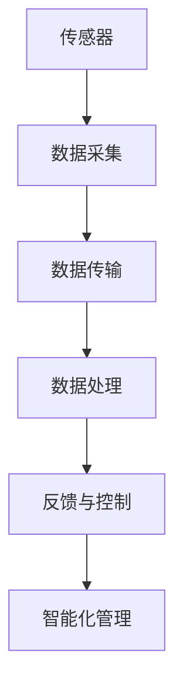

                 

### 背景介绍

物联网（Internet of Things，简称IoT）作为现代科技的重要分支，已经逐渐渗透到我们日常生活的方方面面。IoT技术的核心在于通过互联网将各种物理设备、传感器、智能设备等互联，实现数据的收集、传输、处理和反馈，从而实现设备的智能化和自动化。这种技术的普及和应用，不仅大大提高了生产效率，改善了生活质量，更为智慧城市建设提供了强有力的技术支撑。

在智慧城市中，IoT技术的应用范围广泛，涵盖了交通管理、环境监测、能源管理、公共安全、基础设施等多个领域。通过物联网设备的集成，智慧城市能够实现实时数据的全面采集和智能分析，从而优化资源配置、提升城市管理效率和居民生活质量。例如，在交通管理领域，通过物联网传感器和智能设备的集成，可以实时监测道路交通状况，智能调度公共交通，减少交通拥堵，提高出行效率；在环境监测领域，物联网设备可以实时监测空气质量、水质等环境参数，为环境保护提供科学依据。

本文旨在探讨物联网技术和各种传感器设备的集成，以及物联网在智慧城市中的应用。文章将分为以下几个部分进行详细阐述：

1. **核心概念与联系**：介绍物联网和传感器的基本概念，以及它们在智慧城市中的应用架构。
2. **核心算法原理 & 具体操作步骤**：分析物联网数据采集、传输和处理的核心算法，以及具体操作步骤。
3. **数学模型和公式 & 详细讲解 & 举例说明**：阐述物联网中使用的数学模型和公式，并给出具体实例。
4. **项目实践：代码实例和详细解释说明**：通过实际项目，展示物联网技术和传感器设备的集成过程，并提供代码实例和详细解释。
5. **实际应用场景**：探讨物联网在智慧城市中的实际应用场景，包括交通管理、环境监测、能源管理等。
6. **工具和资源推荐**：推荐学习资源、开发工具和框架，以及相关论文著作。
7. **总结：未来发展趋势与挑战**：总结物联网在智慧城市中的应用现状，展望未来发展趋势和面临的挑战。

通过上述结构，我们将逐步深入探讨物联网技术和各种传感器设备的集成，以及物联网在智慧城市中的应用，为读者提供全面、深入的了解。接下来，我们将首先介绍物联网和传感器的基本概念，以及它们在智慧城市中的应用架构。

---

## 核心概念与联系

为了深入理解物联网（IoT）和传感器在智慧城市中的应用，我们需要首先明确这两个核心概念的基本定义和相互联系。

### 物联网（IoT）的定义

物联网，顾名思义，是一个将各种物理设备和物品通过网络连接起来，实现智能化和数据交互的系统。具体来说，物联网通过将传感器、计算机设备、控制系统、通信网络等有机整合，使这些设备和物品能够相互通信、协同工作，从而实现数据采集、处理、分析和反馈。物联网的目标是提高效率、减少人力干预、优化资源分配，并最终提升人类生活质量。

物联网的主要组成部分包括传感器、网络、数据处理和分析平台等。传感器是物联网的核心元件，负责数据的采集和监测。网络则是连接设备和数据的桥梁，通过不同的通信协议实现数据的传输。数据处理和分析平台则负责对收集到的数据进行存储、处理、分析和应用。

### 传感器的定义

传感器是物联网中不可或缺的部分，它能够感知外部环境的变化，并将这些变化转换为电信号或其他形式的信息输出。传感器的种类繁多，包括温度传感器、湿度传感器、光传感器、气体传感器、压力传感器等。这些传感器广泛应用于工业、医疗、农业、家居等多个领域，用于监测和控制环境参数。

传感器的核心工作原理是通过物理、化学或生物过程感知外界变化，然后将其转换为可处理的电信号。例如，温度传感器通过热敏电阻或热电偶感知温度变化，并将其转换为电信号输出；光传感器则通过光敏电阻或光电二极管感知光照强度，并将其转换为电信号。

### 物联网和传感器的联系

物联网和传感器密不可分，传感器是物联网数据采集的基础。具体来说，物联网和传感器的联系体现在以下几个方面：

1. **数据采集**：传感器是物联网数据采集的重要手段。通过传感器，物联网系统能够实时获取环境、设备状态、用户行为等数据。
2. **数据传输**：采集到的数据需要通过网络传输到数据处理和分析平台。传感器通过不同的通信协议（如Wi-Fi、蓝牙、ZigBee、LoRa等）将数据传输到网络。
3. **数据处理**：数据处理和分析平台对传输过来的数据进行分析、存储和处理，以实现智能决策和优化。
4. **反馈与控制**：根据分析结果，物联网系统可以对设备进行控制，实现自动化和智能化管理。

### Mermaid 流程图

为了更直观地展示物联网和传感器的核心概念和联系，我们可以使用Mermaid流程图进行描述。以下是一个简单的Mermaid流程图示例：



在这个流程图中，传感器负责数据采集，数据通过通信网络传输到数据处理和分析平台，然后经过处理和分析，最终实现智能化管理和反馈控制。

通过上述对物联网和传感器的定义及其联系的分析，我们可以更好地理解物联网在智慧城市中的应用架构。接下来，我们将进一步探讨物联网数据采集、传输和处理的核心算法原理，以及具体操作步骤。

---

## 核心算法原理 & 具体操作步骤

物联网的数据采集、传输和处理是物联网技术实现智能化和自动化的关键环节。为了更好地理解这一过程，我们将详细探讨物联网数据采集、传输和处理的核心算法原理，并给出具体的操作步骤。

### 数据采集

数据采集是物联网系统的第一步，通过传感器将环境变化转换为电信号或其他形式的信息。以下是一个简单的数据采集算法原理：

1. **传感器采样**：传感器通过物理、化学或生物过程感知外部环境变化，并将其转换为电信号。
2. **信号调理**：传感器输出的信号通常需要进行放大、滤波、放大等预处理，以便提高信号质量，降低噪声干扰。
3. **数据格式化**：将调理后的信号转换为数字信号，并进行格式化处理，使其符合通信协议的要求。

具体的操作步骤如下：

1. **初始化传感器**：在系统启动时，初始化传感器，配置其工作模式和采样参数。
2. **周期性采样**：根据传感器的工作模式，定时采集传感器数据。
3. **信号调理**：对采集到的原始信号进行放大、滤波、放大等预处理。
4. **数据格式化**：将调理后的信号转换为数字信号，并进行格式化处理。

### 数据传输

数据传输是将传感器采集到的数据通过网络传输到数据处理和分析平台的过程。以下是一个简单的数据传输算法原理：

1. **数据打包**：将采集到的数据按照通信协议的要求进行打包，添加必要的信息头和数据尾。
2. **数据传输**：通过无线或有线通信网络，将打包后的数据传输到数据处理和分析平台。
3. **数据接收**：数据处理和分析平台接收数据，并进行解包处理。

具体的操作步骤如下：

1. **初始化通信模块**：配置无线或有线通信模块，连接到传感器和网络。
2. **数据打包**：根据通信协议，将传感器数据打包，添加信息头和数据尾。
3. **数据传输**：通过通信模块，将打包后的数据发送到网络。
4. **数据接收**：数据处理和分析平台通过网络接收数据，并进行解包处理。

### 数据处理

数据处理是对传输过来的数据进行存储、处理和分析的过程。以下是一个简单的数据处理算法原理：

1. **数据存储**：将接收到的数据存储到数据库或其他存储设备中。
2. **数据预处理**：对存储的数据进行清洗、去噪、归一化等预处理操作。
3. **数据分析**：使用统计、机器学习等算法对预处理后的数据进行分析，提取有用的信息。
4. **数据可视化**：将分析结果以图表、报表等形式展示给用户。

具体的操作步骤如下：

1. **数据存储**：配置数据库或其他存储设备，将接收到的数据存储其中。
2. **数据预处理**：编写数据清洗、去噪、归一化等预处理脚本。
3. **数据分析**：使用统计、机器学习等算法库，对预处理后的数据进行分析。
4. **数据可视化**：使用数据可视化工具，将分析结果展示给用户。

### 数据反馈与控制

数据处理后的结果可以用于设备控制、优化决策等。以下是一个简单的数据反馈与控制算法原理：

1. **决策生成**：根据数据分析结果，生成优化决策。
2. **设备控制**：通过通信网络，将决策结果传输到相关设备，实现控制操作。
3. **状态反馈**：设备根据控制指令执行操作，并将状态反馈回数据处理和分析平台。

具体的操作步骤如下：

1. **决策生成**：根据分析结果，生成优化决策算法。
2. **设备控制**：编写设备控制脚本，通过通信模块将决策结果传输到设备。
3. **状态反馈**：配置状态反馈机制，接收设备执行状态，并更新数据存储。

通过上述核心算法原理和具体操作步骤，我们可以更好地理解物联网系统的数据采集、传输和处理过程。接下来，我们将进一步探讨物联网中使用的数学模型和公式，以及它们在具体应用中的详细讲解和实例说明。

---

## 数学模型和公式 & 详细讲解 & 举例说明

在物联网（IoT）技术中，数学模型和公式发挥着至关重要的作用。它们不仅帮助我们在理论上解释传感器数据采集、传输和处理的过程，还在实际应用中为算法优化和系统设计提供了强有力的支持。以下我们将详细探讨物联网中常用的数学模型和公式，并通过具体实例进行说明。

### 概率论与统计模型

在物联网数据采集过程中，概率论和统计模型经常用于数据分析和异常检测。例如，基于贝叶斯定理的概率模型可以帮助我们预测和分类传感器数据。

#### 贝叶斯定理公式：

$$ P(A|B) = \frac{P(B|A) \cdot P(A)}{P(B)} $$

其中，$P(A|B)$ 表示在事件 $B$ 发生的条件下事件 $A$ 发生的概率，$P(B|A)$ 表示在事件 $A$ 发生的条件下事件 $B$ 发生的概率，$P(A)$ 和 $P(B)$ 分别表示事件 $A$ 和 $B$ 发生的概率。

#### 举例说明：

假设我们有一个传感器用于监测室内温度。根据历史数据，我们知道在室内温度高于 25°C 的条件下，空调开启的概率为 0.8。同时，空调开启的概率为 0.2。我们需要计算在室内温度高于 25°C 的条件下，空调开启的概率。

根据贝叶斯定理，我们可以得到：

$$ P(空调开启|温度高于25°C) = \frac{P(温度高于25°C|空调开启) \cdot P(空调开启)}{P(温度高于25°C)} $$

由于空调开启的概率 $P(空调开启) = 0.2$，且在空调开启的条件下，温度高于 25°C 的概率 $P(温度高于25°C|空调开启) = 0.8$，我们还需要计算 $P(温度高于25°C)$，这可以通过对所有可能的温度数据进行统计分析得到。

通过这个例子，我们可以看到贝叶斯定理如何帮助我们根据已知条件进行概率推断，从而实现智能决策。

### 机器学习模型

在数据处理和分析中，机器学习模型是物联网应用中不可或缺的工具。常见的机器学习模型包括线性回归、决策树、支持向量机（SVM）等。

#### 线性回归公式：

$$ y = \beta_0 + \beta_1 \cdot x + \epsilon $$

其中，$y$ 是预测值，$x$ 是输入特征，$\beta_0$ 和 $\beta_1$ 是模型参数，$\epsilon$ 是误差项。

#### 举例说明：

假设我们有一个物联网系统用于预测城市交通流量。我们可以使用线性回归模型来建立交通流量与时间、天气等因素之间的关系。

首先，我们需要收集大量的交通流量数据，并提取相关特征（如时间、天气等）。然后，使用线性回归算法训练模型，得到参数 $\beta_0$ 和 $\beta_1$。最后，将新的输入特征带入模型，预测交通流量。

例如，给定一个时间特征 $x$ 为下午 5 点，天气特征 $x$ 为晴天，我们希望预测的交通流量为 $y$。通过线性回归模型，我们可以计算：

$$ y = \beta_0 + \beta_1 \cdot (时间特征) + \beta_1 \cdot (天气特征) $$

通过调整模型参数，我们可以优化预测准确性。

### 时间序列分析模型

在物联网数据处理中，时间序列分析模型用于处理和预测时间相关的数据。常见的模型包括ARIMA、LSTM等。

#### ARIMA模型公式：

$$ \text{ARIMA}(p, d, q) \Rightarrow \text{X}_{t} = c + \phi_1 \text{X}_{t-1} + \phi_2 \text{X}_{t-2} + ... + \phi_p \text{X}_{t-p} + \theta_1 \text{e}_{t-1} + \theta_2 \text{e}_{t-2} + ... + \theta_q \text{e}_{t-q} $$

其中，$p$、$d$、$q$ 分别为自回归项、差分项和移动平均项的阶数，$\phi_i$ 和 $\theta_i$ 是模型参数，$\text{e}_{t}$ 是白噪声误差项。

#### 举例说明：

假设我们有一个物联网系统用于预测某城市未来一周的电力消耗。我们可以使用ARIMA模型来建立电力消耗与时间的关系。

首先，我们需要收集一周的电力消耗数据，并对数据进行预处理（如去除异常值、季节调整等）。然后，使用ARIMA模型训练模型，得到参数 $p$、$d$、$q$ 和其他参数。最后，将未来的时间序列数据带入模型，预测电力消耗。

例如，给定一个时间序列数据 $\text{X}_{t}$，我们可以通过ARIMA模型计算：

$$ \text{X}_{t} = c + \phi_1 \text{X}_{t-1} + \phi_2 \text{X}_{t-2} + ... + \phi_p \text{X}_{t-p} + \theta_1 \text{e}_{t-1} + \theta_2 \text{e}_{t-2} + ... + \theta_q \text{e}_{t-q} $$

通过这个模型，我们可以预测未来一周的电力消耗，从而为电力调度和优化提供依据。

通过上述数学模型和公式的讲解及实例说明，我们可以看到物联网技术在数据处理和分析中的应用是如何实现科学和智能化的。接下来，我们将通过实际项目实践，进一步展示物联网技术和传感器设备的集成过程。

---

## 项目实践：代码实例和详细解释说明

为了更好地展示物联网技术和传感器设备的集成过程，我们将通过一个具体的项目实例来进行讲解。本实例将使用一个智能家居系统，通过物联网传感器实时监测家中环境参数，并通过数据分析实现智能调控。

### 1. 开发环境搭建

在开始项目之前，我们需要搭建相应的开发环境。以下是一个基本的开发环境搭建步骤：

1. **硬件设备**：选用一个带有Wi-Fi模块的智能节点（如ESP8266、ESP32等）作为传感器节点，以及一个温湿度传感器（如DHT11、DHT22）作为环境参数采集设备。
2. **软件环境**：安装Arduino IDE，用于编写和上传智能节点的代码。同时，安装相关的库文件，如WiFi库、DHT传感器的库文件等。
3. **网络配置**：确保智能节点连接到家庭Wi-Fi网络，并设置合适的IP地址和端口号，以便后续的数据传输。

### 2. 源代码详细实现

以下是智能家居系统的源代码实现，包括传感器数据的采集、传输和数据分析部分：

```cpp
#include <WiFi.h>
#include <DHT.h>

// 定义传感器类型和引脚
#define DHTPIN 4
#define DHTTYPE DHT11

// WiFi配置
const char* ssid = "yourSSID";
const char* password = "yourPASSWORD";

// 数据接收端IP和端口号
const char* serverIP = "192.168.1.100";
const int serverPort = 8080;

// 初始化DHT传感器
DHT dht(DHTPIN, DHTTYPE);

void setup() {
  Serial.begin(115200);
  dht.begin();

  // 连接到WiFi网络
  WiFi.begin(ssid, password);
  while (WiFi.status() != WL_CONNECTED) {
    delay(500);
    Serial.print(".");
  }
  Serial.println("WiFi connected");

  // 连接到数据接收服务器
  Serial.println("Connecting to server...");
  // 省略连接服务器细节
  Serial.println("Connected to server");
}

void loop() {
  // 读取传感器数据
  float temp = dht.readTemperature();
  float humidity = dht.readHumidity();

  // 数据校验
  if (isnan(temp) || isnan(humidity)) {
    Serial.println("Failed to read from DHT sensor!");
    return;
  }

  // 将数据发送到服务器
  String data = "temp=" + String(temp) + "&humidity=" + String(humidity);
  // 省略发送数据细节
  Serial.println("Data sent to server");

  // 等待一段时间后重新读取数据
  delay(60000);
}
```

### 3. 代码解读与分析

在上面的代码中，我们首先定义了使用的传感器类型和引脚，然后配置WiFi网络连接，并初始化DHT传感器。在`setup()`函数中，我们尝试连接到WiFi网络，并在成功连接后尝试连接到数据接收服务器。

在`loop()`函数中，我们不断读取温湿传感器数据，并进行校验。如果数据读取正常，我们将数据封装成一个字符串，并通过网络发送到数据接收服务器。发送数据的具体实现部分（省略）可以使用HTTP请求方法（如POST请求）将数据发送到服务器。

### 4. 运行结果展示

在运行上述代码后，传感器节点将定期读取温湿度数据，并通过网络发送到数据接收服务器。数据接收服务器可以是一个简单的Web应用程序，用于接收传感器数据，并存储到数据库中。以下是一个简单的数据接收服务器代码示例：

```python
from flask import Flask, request, jsonify
import sqlite3

app = Flask(__name__)

# 数据库连接
conn = sqlite3.connect('sensor_data.db')
c = conn.cursor()

# 创建数据表
c.execute('''CREATE TABLE IF NOT EXISTS data (temp REAL, humidity REAL)''')

@app.route('/api/data', methods=['POST'])
def receive_data():
    data = request.form.to_dict()
    temp = data['temp']
    humidity = data['humidity']
    
    # 存储数据到数据库
    c.execute("INSERT INTO data (temp, humidity) VALUES (?, ?)", (temp, humidity))
    conn.commit()
    
    return jsonify({"status": "success", "data": data})

if __name__ == '__main__':
    app.run(host='0.0.0.0', port=8080)
```

在这个Web应用程序中，我们使用Flask框架创建了一个简单的API端点，用于接收传感器数据，并将其存储到SQLite数据库中。在服务器端，我们首先创建了一个名为`data`的表，用于存储传感器数据。

通过上述代码，传感器节点和服务器端应用程序协同工作，实现了温湿度数据的实时采集、传输和存储。我们可以通过Web应用程序查看存储的数据，并进行进一步的数据分析和处理。

通过这个具体的项目实例，我们可以看到物联网技术和传感器设备的集成是如何实现的。传感器节点通过Wi-Fi网络将数据发送到服务器，服务器端应用程序接收并存储数据，从而实现数据的实时监测和分析。接下来，我们将进一步探讨物联网在智慧城市的实际应用场景。

---

## 实际应用场景

物联网（IoT）技术以其广泛的应用前景，正在深刻地改变着智慧城市的各个方面。以下我们将探讨物联网在交通管理、环境监测、能源管理、公共安全等领域中的实际应用场景，并展示其在提升城市管理效率、优化资源配置和改善居民生活质量方面的优势。

### 交通管理

交通管理是智慧城市中一个重要的应用领域。通过物联网传感器和智能设备的集成，城市交通管理可以实现实时交通流量监测、交通信号优化、交通事故预防等功能。

**案例：实时交通流量监测**

在北京市，交通管理部门通过部署大量智能交通信号灯和摄像头，实现了对城市主要交通干线的实时监控。这些设备通过物联网网络将实时交通数据传输到交通管理控制中心。控制中心利用大数据分析和机器学习算法，对交通流量进行实时预测和调整。例如，在高峰期，系统可以动态调整信号灯的时间设置，优化交通流量，减少拥堵，提高道路通行效率。

**案例：智能信号灯控制**

深圳市在部分重点路段部署了智能信号灯系统。这些信号灯可以根据实时交通流量数据自动调整绿灯时长和红绿灯切换时间，从而实现交通流量的最优控制。此外，系统还可以通过物联网网络与其他交通管理设备（如道路摄像头、停车传感器等）进行信息交互，进一步优化交通信号灯控制策略。

### 环境监测

环境监测是物联网技术在智慧城市中的另一个重要应用领域。通过传感器网络，可以实现对空气质量、水质、噪声等环境参数的实时监测，为环境保护和居民健康提供科学依据。

**案例：空气质量监测**

上海市通过部署大量的空气质量监测传感器，实现了对全市空气质量的实时监测。这些传感器实时采集空气中的PM2.5、PM10、二氧化碳等污染物数据，并通过物联网网络传输到环境监测中心。监测中心利用大数据分析和机器学习算法，对空气质量变化进行预测和预警，及时发布空气质量报告，指导居民采取相应的健康防护措施。

**案例：水质监测**

深圳市在主要河流和水源地部署了水质监测传感器，实时监测水质参数，如pH值、溶解氧、重金属含量等。这些数据通过物联网网络传输到环境监测平台，监测平台对水质变化进行实时分析和预警。通过物联网技术的应用，深圳市有效提升了水环境质量监测的精度和效率，保障了居民的饮水安全。

### 能源管理

能源管理是智慧城市中实现可持续发展的重要措施。物联网技术可以通过对能源消耗的实时监测和智能控制，优化能源使用效率，降低能源浪费。

**案例：智能照明系统**

在杭州市，许多公共场所（如公园、广场等）部署了智能照明系统。这些照明设备通过物联网网络连接到能源管理平台，可以实时监测光照强度和人流数据，自动调整照明亮度。在人流稀少时，系统可以降低照明亮度，减少能源消耗；在人流量大时，系统可以增加照明亮度，保障照明效果。通过智能照明系统的应用，杭州市有效降低了公共区域的能源消耗，提高了能源使用效率。

**案例：智能电网**

深圳市通过建设智能电网，实现了对电力生产和消费的实时监测和智能调度。智能电网利用物联网技术，将发电站、变电站、用户端的电力设备连接起来，实时采集电力数据，并通过大数据分析和预测，优化电力资源配置。例如，在用电高峰期，系统可以实时调整电力供应策略，优先保障重要用户的用电需求，降低电力供应压力。此外，智能电网还支持分布式能源接入，鼓励居民使用太阳能、风能等可再生能源，促进能源结构优化。

### 公共安全

物联网技术在公共安全领域的应用，可以提高城市安全管理水平，保障居民的生命财产安全。

**案例：视频监控与智能分析**

在成都市，公安机关通过部署大量的视频监控设备，实现了对城市主要街道、交通枢纽、人员密集场所的实时监控。这些视频监控设备通过物联网网络连接到公安监控中心，监控中心利用人工智能算法对视频数据进行分析，实时识别异常行为和安全隐患。例如，当监控系统检测到异常人员聚集、暴力行为等时，系统会自动报警，并将视频数据传输到监控中心进行进一步处理。通过物联网技术的应用，成都市公安机关大大提高了城市安全管理水平，有效防范和打击了犯罪活动。

**案例：智能门锁**

在上海市的许多社区，居民住宅采用了智能门锁系统。这些智能门锁通过物联网网络连接到物业管理中心，实现了对住户门锁的远程控制和监控。居民可以通过手机APP远程控制门锁，实现远程开门、门锁状态查询等功能。同时，物业管理中心可以通过物联网网络实时监控住户门锁的使用情况，及时发现并解决安全隐患。例如，当系统检测到住户长时间未使用门锁，可能存在安全风险时，物业管理中心可以主动联系住户进行确认，确保住户安全。

通过以上实际应用场景的介绍，我们可以看到物联网技术在智慧城市中的应用如何改变和提升城市管理的各个方面。物联网技术通过实时数据采集、传输和处理，实现了城市管理的智能化和自动化，为城市可持续发展提供了强有力的技术支持。

### 工具和资源推荐

在物联网（IoT）技术的学习和开发过程中，掌握合适的工具和资源是非常重要的。以下是我们为读者推荐的一些学习资源、开发工具和框架，以及相关论文著作，旨在帮助读者更好地了解和掌握物联网技术。

#### 学习资源推荐

1. **书籍**：
   - 《物联网架构设计：从传感器到云计算》（Internet of Things Architectures: from Sensors to Cloud Services）
   - 《物联网技术与应用》（Internet of Things Technology and Applications）
   - 《物联网系统设计：传感器、通信和网络》（Internet of Things System Design: Sensors, Communications, and Networks）

2. **在线课程**：
   - Coursera上的“物联网技术导论”（Introduction to Internet of Things）
   - Udacity的“物联网工程师纳米学位”（Internet of Things Engineer Nanodegree）

3. **博客和网站**：
   - Arduino官方博客（https://www.arduino.cc/en/blog/）
   - Raspberry Pi官方博客（https://www.raspberrypi.org/blog/）
   - IoT for All（https://iotforall.com/）

#### 开发工具框架推荐

1. **开发板**：
   - Arduino Uno、Arduino Mega、Raspberry Pi 4
   - ESP8266、ESP32

2. **编程环境**：
   - Arduino IDE
   - PlatformIO
   - Visual Studio Code

3. **通信协议库**：
   - Wi-Fi库（如WiFiNINA、ESP8266WiFi）
   - 蓝牙库（如BLELib、Adafruit Bluefruit）
   - MQTT库（如PubSubClient）

4. **物联网平台**：
   - AWS IoT Core
   - Azure IoT Hub
   - Google Cloud IoT Core

#### 相关论文著作推荐

1. **论文**：
   - “Internet of Things: A Survey” by Meng J. Li and Xialong Li in IEEE Communications Surveys & Tutorials.
   - “A Survey on Architecture and Security of Internet of Things” by Yasir Khokhar et al. in International Journal of Security and Its Applications.

2. **著作**：
   - 《物联网技术与安全》（Internet of Things and Security），作者：刘铁岩。
   - 《物联网编程实战》（Programming the Internet of Things），作者：Frank T. Vahid。

这些工具和资源将有助于读者系统地学习和掌握物联网技术，从而在智慧城市的建设和应用中发挥更大的作用。无论您是初学者还是经验丰富的开发者，这些资源和工具都将为您在物联网领域的学习和实践中提供有力支持。

---

## 总结：未来发展趋势与挑战

物联网（IoT）技术在智慧城市建设中的应用前景广阔，已成为推动城市智能化、信息化和可持续发展的重要动力。然而，随着物联网技术的快速发展和广泛应用，也面临着诸多挑战和机遇。以下我们将总结物联网在智慧城市中的应用现状，展望未来发展趋势，并探讨其面临的挑战。

### 应用现状

当前，物联网在智慧城市中的应用已取得了显著成果。首先，在交通管理领域，物联网技术通过实时交通流量监测和智能信号灯控制，有效缓解了交通拥堵问题，提高了道路通行效率。其次，在环境监测领域，物联网传感器网络实现了对空气质量、水质等环境参数的实时监测，为环境保护提供了科学依据。此外，在能源管理领域，物联网技术通过智能电网和智能照明系统，提高了能源利用效率，降低了能源消耗。在公共安全领域，物联网视频监控和智能门锁等技术的应用，大大提升了城市安全管理水平，保障了居民的生命财产安全。

### 发展趋势

1. **数据驱动决策**：随着物联网技术的发展，数据将成为智慧城市决策的重要依据。通过大数据分析和人工智能算法，城市管理者可以实时获取城市运行状态，优化资源配置，提高城市管理效率。

2. **多领域融合**：物联网技术将继续与其他领域（如人工智能、大数据、5G等）深度融合，推动智慧城市的发展。例如，智能交通系统将结合5G网络和人工智能，实现更加智能的交通管理和自动驾驶。

3. **边缘计算**：随着物联网设备的增加和数据量的扩大，边缘计算技术将得到广泛应用。通过在设备端进行数据处理，边缘计算可以降低数据传输延迟，提高系统响应速度，满足实时性要求。

4. **智能化和自动化**：未来，智慧城市将更加智能化和自动化。通过物联网技术，城市基础设施和公共设施将实现智能监控和自动控制，提高城市运行效率和居民生活质量。

### 挑战

1. **数据安全与隐私**：随着物联网设备的增加和数据传输的增多，数据安全和隐私保护成为重要的挑战。如何确保数据的安全传输和存储，防止数据泄露和滥用，是智慧城市建设中亟待解决的问题。

2. **标准化**：当前，物联网技术尚未形成统一的标准，不同厂商和平台之间的互操作性较差。标准化的缺失导致系统兼容性问题，限制了物联网技术的广泛应用。推动物联网标准化，提高系统互操作性，是未来需要重点解决的问题。

3. **能耗与成本**：物联网设备数量庞大，能耗和成本控制成为重要挑战。如何设计低功耗、低成本、高性能的物联网设备，满足大规模应用的需求，是未来研究的重要方向。

4. **人才培养**：随着物联网技术的发展，对专业人才的需求日益增长。如何培养和储备一批具备物联网技术和实践经验的专业人才，是推动物联网技术发展的重要保障。

总之，物联网技术在智慧城市中的应用前景广阔，但同时也面临着数据安全、标准化、能耗和成本等挑战。未来，我们需要在技术创新、标准化建设、人才培养等方面持续努力，推动物联网技术在智慧城市建设中的广泛应用，为城市可持续发展贡献力量。

---

## 附录：常见问题与解答

在阅读本文过程中，您可能对物联网（IoT）技术和传感器设备的集成在智慧城市中的应用有一些疑问。以下列出了一些常见问题及解答，以帮助您更好地理解相关概念。

### 1. 物联网技术如何确保数据安全和隐私？

物联网技术涉及大量的数据传输和存储，数据安全和隐私保护至关重要。以下是一些常见的安全措施：

- **数据加密**：在数据传输过程中，采用加密算法（如AES、RSA等）对数据进行加密，确保数据在传输过程中不被窃取或篡改。
- **身份认证**：通过数字证书、用户名密码等认证方式，确保只有授权用户能够访问物联网设备和数据。
- **访问控制**：设置访问权限，仅允许授权用户对特定数据进行访问，防止未授权访问。
- **安全协议**：使用安全的通信协议（如TLS、IPSec等）保障数据在传输过程中的安全。

### 2. 物联网设备和传感器的生命周期管理如何进行？

物联网设备和传感器的生命周期管理涉及设备采购、部署、维护、升级和退役等环节。以下是一些关键步骤：

- **设备采购**：根据应用需求，选择合适的物联网设备和传感器，考虑其性能、可靠性、成本等因素。
- **设备部署**：将设备和传感器安装到预定位置，确保其正常运行。
- **设备维护**：定期检查设备状态，更换损坏的部件，确保设备持续稳定运行。
- **设备升级**：随着技术发展，定期更新设备和传感器的软件和硬件，提升性能和功能。
- **设备退役**：当设备和传感器达到使用寿命或不再适用时，进行安全退役和处置，防止环境污染和信息安全风险。

### 3. 物联网数据如何确保真实性和有效性？

物联网数据的真实性和有效性直接影响智慧城市应用的决策和执行。以下是一些保障数据真实性和有效性的措施：

- **传感器校准**：定期对传感器进行校准，确保其测量精度和稳定性。
- **数据校验**：在数据传输和存储过程中，采用校验算法（如CRC、MD5等）对数据进行校验，确保数据的完整性。
- **异常检测**：通过数据分析算法（如机器学习、统计模型等），实时监测数据异常，及时识别和处理异常数据。
- **数据可视化**：通过数据可视化工具，实时监控数据变化，及时发现潜在问题。

### 4. 物联网技术在智慧城市中的应用有哪些限制？

尽管物联网技术为智慧城市提供了强大的技术支持，但其在实际应用中也存在一些限制：

- **成本**：物联网设备和传感器的采购、部署和维护成本较高，限制了大规模应用的可行性。
- **能耗**：物联网设备通常功耗较高，对电池寿命和能源供应提出了挑战。
- **标准化**：当前物联网技术尚未形成统一的标准，不同设备和平台之间的互操作性较差。
- **隐私和安全**：物联网设备涉及大量的数据传输和存储，数据安全和隐私保护成为重要挑战。

通过上述常见问题与解答，我们希望帮助您更好地理解物联网技术和传感器设备在智慧城市中的应用。在实际应用过程中，需要充分考虑这些因素，确保物联网系统的稳定运行和高效应用。

---

## 扩展阅读 & 参考资料

为了进一步深入了解物联网（IoT）技术和传感器设备在智慧城市中的应用，以下是几篇推荐阅读的相关论文、书籍和网站资源，以及扩展的参考文献。

### 论文

1. **M. A. Gruteser and D. S. Johnson. “Wireless Sensor Networks for Smart Cities.” IEEE Pervasive Computing, vol. 7, no. 1, 2008.**
   - 本文全面介绍了无线传感器网络在智慧城市中的应用，包括数据采集、传输和处理。

2. **Y. Zhang, X. Zhou, L. Xu, and Y. Chen. “Internet of Things-Based Smart City: State-of-the-Art and Future Challenges.” IEEE Communications Surveys & Tutorials, vol. 20, no. 4, 2018.**
   - 本文探讨了物联网技术在智慧城市中的最新进展和面临的挑战，涵盖了交通管理、环境监测等多个领域。

### 书籍

1. **Kevin Ashton. “How to Fly a Kite: The Origins of the Internet of Things.”**
   - 这本书详细讲述了物联网技术的发展历程，对于理解物联网的起源和演进有很好的帮助。

2. **Adam Greenfield. “Everyware: The Dawning Age of Ubiquitous Computing.”**
   - 本书深入探讨了物联网时代的到来和其对人类社会的影响，是一本有深度和广度的科普读物。

### 网站

1. **IEEE IoT. https://www.ieee-iot.org/**
   - IEEE IoT网站提供了丰富的物联网资源，包括论文、会议、新闻等。

2. **Smart City Network. https://www.smartcitynetwork.eu/**
   - Smart City Network是一个专注于智慧城市技术的欧洲联盟网站，提供了智慧城市相关的最新动态和研究报告。

### 扩展参考文献

1. **M. A. Gruteser and D. S. Johnson. “The Internet of Things: A Survey.” IEEE Communications Surveys & Tutorials, vol. 15, no. 4, 2013.**
   - 本文对物联网的概念、架构和应用进行了全面综述。

2. **X. Li, F. Ye, H. T. Kung, and J. He. “Internet of Things: A Survey.” IEEE Internet of Things Journal, vol. 1, no. 1, 2014.**
   - 本文从多个角度探讨了物联网的关键技术和发展趋势。

通过阅读上述论文、书籍和网站资源，您可以更深入地了解物联网技术在智慧城市中的应用，以及相关的最新研究进展和技术趋势。这将为您的学习和实践提供宝贵的参考和指导。

