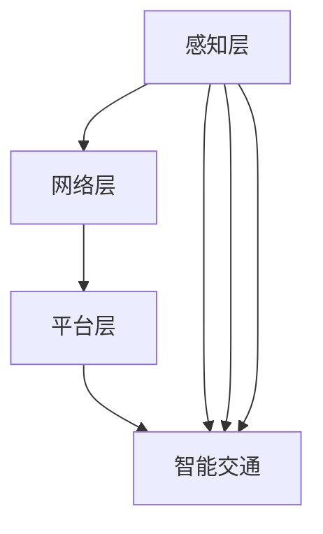

                 

### 1. 背景介绍

物联网（Internet of Things, IoT）技术作为当今世界技术革命的重要驱动力，已经深刻地改变了我们的生活方式和工业生产模式。IoT的核心在于通过互联网连接各种设备，实现数据的实时收集、传输和分析，从而实现设备的智能化管理和优化。

近年来，随着无线通信技术的进步、微电子技术的快速发展以及大数据处理能力的提升，IoT技术逐渐成为各行各业的重要工具。从智能家居到智能交通，从工业自动化到智慧城市，IoT的应用场景不断扩展，极大地提升了生产效率和生活质量。

在消费电子领域，IoT技术的应用尤为广泛。各种传感器设备作为物联网的重要接口，将物理世界与数字世界紧密连接。这些传感器设备能够感知环境中的各种物理量，如温度、湿度、光照、运动等，并将这些信息转化为数字信号，通过物联网平台进行传输和分析。

本篇文章将围绕物联网技术和各种传感器设备的集成展开讨论，重点关注以下三个方面：

1. **物联网技术的核心概念和架构**：介绍物联网的基本概念，解析其技术架构和关键技术。
2. **传感器设备的作用和分类**：讨论传感器设备在物联网中的应用，以及不同类型传感器的工作原理和技术特点。
3. **物联网在消费电子的创新**：分析物联网技术如何推动消费电子的变革，探讨具体的应用案例和未来发展趋势。

通过本文的探讨，希望读者能够对物联网技术及其在消费电子领域的应用有更深入的理解，从而更好地把握这一技术趋势，为未来的创新和发展提供思路。

### 2. 核心概念与联系

#### 2.1 物联网（IoT）的基本概念

物联网（Internet of Things，简称IoT）是指通过各种信息传感设备，如传感器、射频识别技术（RFID）、全球定位系统（GPS）等，实时采集任何需要监控、连接、互动的物体或过程，将这些信息与互联网相连接，以实现智能化识别、定位、追踪、监控和管理的一种网络。

#### 2.2 物联网的技术架构

物联网的技术架构通常包括以下几个层级：

1. **感知层**：这是物联网的基础层，通过各类传感器设备（如温度传感器、湿度传感器、光电传感器等）实时采集环境数据。
2. **网络层**：感知层采集到的数据通过有线或无线网络传输到中央处理系统，常用的技术包括Wi-Fi、ZigBee、蓝牙、LoRa等。
3. **平台层**：网络层传输的数据在物联网平台上进行处理、分析和存储，常见的平台技术有云计算、大数据处理等。
4. **应用层**：通过物联网平台处理后的数据应用于具体的业务场景，如智能家居、智能医疗、智能交通等。

#### 2.3 核心技术与传感器设备

物联网的实现依赖于一系列关键技术和设备，其中传感器设备尤为关键。以下是几个重要的物联网核心技术和传感器设备：

1. **传感器技术**：传感器是物联网系统中的感知器官，能够将物理信号（如温度、湿度、光强等）转化为电信号，常见的传感器包括温度传感器、湿度传感器、光敏传感器等。
2. **无线通信技术**：无线通信技术是实现设备间数据传输的关键，如Wi-Fi、ZigBee、蓝牙等，这些技术使得设备之间的连接更加灵活和便捷。
3. **云计算与大数据**：云计算和大数据技术为物联网提供了强大的数据处理和分析能力，使得海量数据得以高效存储和利用。
4. **边缘计算**：边缘计算将数据处理的部分从云端转移到网络边缘，提高了系统的响应速度和数据处理效率。

#### 2.4 物联网架构的Mermaid流程图表示



上述Mermaid流程图展示了物联网架构的基本层级及其应用场景。各层之间通过数据传输和通信技术相互连接，形成一个完整的物联网系统。

#### 2.5 物联网在消费电子中的具体应用

在消费电子领域，物联网的应用极大地丰富了产品的功能，提升了用户体验。以下是几个具体的例子：

1. **智能家居**：通过物联网技术，家庭中的各类设备（如灯具、空调、门锁等）可以实现互联互通，用户可以通过手机APP或语音助手远程控制家居设备，实现智能场景的设置和自动化管理。
2. **可穿戴设备**：如智能手表、健康手环等，通过内置的传感器实时监测用户的心率、运动轨迹、睡眠质量等健康数据，并将数据上传到云端进行分析和反馈。
3. **智能音箱**：智能音箱通过物联网连接互联网，用户可以通过语音命令进行音乐播放、信息查询、智能家居控制等操作，极大地方便了用户的日常使用。

### 3. 核心算法原理 & 具体操作步骤

#### 3.1 物联网数据采集与处理算法原理

物联网的数据采集和处理是物联网系统的核心之一。以下是物联网数据采集与处理算法的基本原理：

1. **数据采集**：传感器通过感知环境中的各种物理量（如温度、湿度、光照等），将这些物理量转化为电信号，并通过无线通信技术将数据传输到中央处理系统。
2. **数据处理**：中央处理系统对接收到的数据进行预处理（如去噪、滤波等），然后进行特征提取和数据融合，最后将处理后的数据存储或用于进一步的业务逻辑处理。

#### 3.2 数据采集与处理的操作步骤

1. **选择合适的传感器**：根据应用场景选择合适的传感器，如温度传感器、湿度传感器、光电传感器等。
2. **搭建数据采集系统**：将传感器接入数据采集模块（如Arduino、Raspberry Pi等），并通过无线通信技术（如Wi-Fi、ZigBee等）将采集到的数据传输到中央处理系统。
3. **数据预处理**：对采集到的原始数据进行去噪、滤波等处理，以提高数据的可靠性和准确性。
4. **特征提取与数据融合**：根据应用需求提取数据中的关键特征，如温度的均值、湿度的高频变化等，并进行数据融合，以提高系统的智能化水平。
5. **数据存储与业务处理**：将处理后的数据存储到数据库或云端，并根据业务需求进行进一步的分析和处理。

#### 3.3 实例讲解

以下是一个简单的物联网数据采集与处理实例：

1. **实例描述**：使用Arduino传感器模块采集室内温度和湿度数据，并通过Wi-Fi将数据传输到服务器进行实时监控和分析。
2. **硬件搭建**：将DHT11温度湿度传感器接入Arduino开发板，通过Wi-Fi模块连接互联网。
3. **软件实现**：
    - 初始化传感器：在Arduino代码中初始化DHT11传感器。
    - 数据采集：通过传感器读取温度和湿度数据。
    - 数据传输：将采集到的数据通过Wi-Fi模块发送到服务器。
    - 数据处理：服务器接收数据后，进行预处理、特征提取和存储。
4. **运行结果**：用户可以通过网页或手机APP实时查看室内温度和湿度数据，并根据数据变化进行相应的调整和优化。

### 4. 数学模型和公式 & 详细讲解 & 举例说明

#### 4.1 数据预处理中的数学模型

在物联网数据采集与处理过程中，数据预处理是非常关键的一步。以下是一些常用的数学模型和公式：

1. **滤波器**：
    - **均值滤波器**：对一组数据进行平均处理，以去除随机噪声。
    $$ \text{mean}(x) = \frac{1}{n} \sum_{i=1}^{n} x_i $$
    - **中值滤波器**：取一组数据的中值作为滤波结果，适用于去除尖峰噪声。
    $$ \text{median}(x) = \text{sorted}(x)[\frac{n}{2}] $$
2. **特征提取**：
    - **均值**：一组数据的平均值，用于反映数据的集中趋势。
    $$ \text{mean}(x) = \frac{1}{n} \sum_{i=1}^{n} x_i $$
    - **标准差**：一组数据的离散程度，用于衡量数据的稳定性。
    $$ \text{std}(x) = \sqrt{\frac{1}{n-1} \sum_{i=1}^{n} (x_i - \text{mean}(x))^2} $$
    - **自相关函数**：用于描述时间序列数据之间的相关性。
    $$ \text{corr}(x, y) = \frac{\sum_{i=1}^{n} (x_i - \text{mean}(x)) (y_i - \text{mean}(y))}{\sqrt{\sum_{i=1}^{n} (x_i - \text{mean}(x))^2 \sum_{i=1}^{n} (y_i - \text{mean}(y))^2} $$

#### 4.2 实例讲解

以下是一个基于均值滤波器的实例：

**实例描述**：对一个传感器采集的10秒内的温度数据进行预处理，使用均值滤波器去除噪声。

**数据集**：
$$ [25.3, 25.5, 25.2, 25.1, 25.3, 25.4, 25.5, 25.6, 25.7, 25.3] $$

**步骤**：

1. **计算平均值**：
   $$ \text{mean}(x) = \frac{1}{n} \sum_{i=1}^{n} x_i = \frac{25.3 + 25.5 + 25.2 + 25.1 + 25.3 + 25.4 + 25.5 + 25.6 + 25.7 + 25.3}{10} = 25.38 $$

2. **计算滤波结果**：
   将每个数据值减去平均值，得到滤波后的数据：
   $$ [0.02, 0.02, 0.01, -0.02, 0.02, 0.01, 0.02, 0.01, 0.02, 0.02] $$

通过均值滤波器处理后的数据更加平滑，噪声得到了有效去除。

### 5. 项目实践：代码实例和详细解释说明

#### 5.1 开发环境搭建

在开始项目实践之前，我们需要搭建一个适合物联网开发的开发环境。以下是搭建过程：

1. **硬件选择**：选择一个适合的物联网开发板，如Arduino Uno或Raspberry Pi。
2. **硬件准备**：连接电源、传感器（例如DHT11传感器）和无线通信模块（如ESP8266）。
3. **软件环境**：安装Arduino IDE或Raspberry Pi操作系统，并配置相应的库和工具。

#### 5.2 源代码详细实现

以下是一个简单的物联网项目实例：使用Arduino和DHT11传感器采集温度和湿度数据，并通过Wi-Fi将数据上传到服务器。

```cpp
#include <DHT.h>
#include <WiFi.h>

// 定义传感器类型和引脚
#define DHTPIN 15
#define DHTTYPE DHT11

// WiFi配置
const char* ssid = "your_SSID"; // 替换为您的WiFi名称
const char* password = "your_PASSWORD"; // 替换为您的WiFi密码

// 数据上传服务器地址
const char* serverAddress = "your_server_address"; // 替换为您的服务器地址

// 实例化DHT传感器
DHT dht(DHTPIN, DHTTYPE);

void setup() {
  Serial.begin(115200);
  dht.begin();

  // 连接WiFi
  WiFi.begin(ssid, password);
  while (WiFi.status() != WL_CONNECTED) {
    delay(500);
    Serial.print(".");
  }
  Serial.println("WiFi connected");
}

void loop() {
  // 读取传感器数据
  float temp = dht.readTemperature();
  float hum = dht.readHumidity();

  // 检查是否读取到有效数据
  if (isnan(temp) || isnan(hum)) {
    Serial.println("Failed to read from DHT sensor!");
    return;
  }

  // 上传数据到服务器
  uploadData(temp, hum);

  // 延时10秒再次读取数据
  delay(10000);
}

void uploadData(float temp, float hum) {
  // 创建HTTP客户端
  WiFiClient client;

  // 初始化连接
  if (client.connect(serverAddress, 80)) {
    // 发送HTTP请求
    String url = "/upload.php?temp=" + String(temp) + "&hum=" + String(hum);
    client.print("GET " + url + " HTTP/1.1\r\n");
    client.print("Host: " + String(serverAddress) + "\r\n");
    client.print("Connection: close\r\n\r\n");
    Serial.println("Data uploaded to server");

    // 读取服务器响应
    while (client.connected()) {
      if (client.available()) {
        String line = client.readStringUntil('\n');
        if (line.length() == 0) {
          break;
        }
      }
    }
  } else {
    Serial.println("Connection failed");
  }
}
```

#### 5.3 代码解读与分析

1. **传感器初始化**：首先，我们定义了DHT传感器的引脚和类型，并使用DHT类初始化传感器。
2. **WiFi连接**：通过WiFi.begin()函数连接到指定的WiFi网络，并在while循环中等待连接成功。
3. **数据读取**：在loop函数中，我们使用dht.readTemperature()和dht.readHumidity()函数读取温度和湿度数据，并通过isnan()函数检查数据是否有效。
4. **数据上传**：通过HTTP客户端将数据上传到服务器。首先，我们创建一个WiFi客户端对象，然后通过connect()函数连接到服务器。接着，我们构造一个HTTP请求，包含数据上传的URL，并使用print()函数发送请求。最后，我们读取服务器的响应。
5. **延时等待**：在每次数据上传后，我们使用delay()函数等待10秒，以便下一次数据采集。

#### 5.4 运行结果展示

在运行上述代码后，Arduino会连接到WiFi，并每隔10秒读取一次DHT11传感器的温度和湿度数据，然后将这些数据上传到指定的服务器。用户可以通过服务器端程序实时查看和记录这些数据。

### 6. 实际应用场景

#### 6.1 智能家居

智能家居是物联网在消费电子领域最典型的应用场景之一。通过物联网技术，用户可以远程控制家庭中的各种设备，实现自动化和智能化的家居环境。

1. **智能照明**：用户可以通过手机APP或智能音箱控制家中的灯光，实现亮度和色温的调节，甚至根据环境光线自动调节。
2. **智能门锁**：通过物联网技术，用户可以使用手机APP远程控制门锁的开关，无需携带钥匙，提高家居安全性。
3. **智能空调**：智能空调可以根据室内温度和湿度自动调节，提高舒适度，同时节能环保。

#### 6.2 可穿戴设备

可穿戴设备，如智能手表和健康手环，通过物联网技术实现对人体健康数据的实时监测。

1. **健康监测**：智能手表和健康手环可以实时监测心率、运动步数、睡眠质量等健康数据，并将数据上传到云端进行分析和反馈。
2. **运动追踪**：通过内置的GPS和加速度传感器，可穿戴设备可以记录用户的运动轨迹、运动时长和消耗的卡路里等数据，帮助用户进行科学健身。

#### 6.3 智能音箱

智能音箱通过物联网连接互联网，用户可以通过语音命令进行音乐播放、信息查询、智能家居控制等操作。

1. **语音控制**：用户可以通过语音命令启动智能音箱，播放音乐、查询天气、设定闹钟等，极大地方便了日常使用。
2. **智能家居控制**：智能音箱可以作为智能家居的控制中心，通过语音命令控制家中的各种智能设备，如灯光、空调、窗帘等。

#### 6.4 智能交通

物联网技术在智能交通领域的应用，可以提升交通效率，减少交通事故，改善交通环境。

1. **智能路灯**：通过物联网技术，智能路灯可以根据交通流量和天气条件自动调节亮度和开关时间，提高能效。
2. **智能交通信号灯**：智能交通信号灯可以根据实时交通流量数据自动调整红绿灯时间，优化交通流量，减少拥堵。
3. **车联网**：通过车联网技术，车辆可以实时获取道路状况、交通流量等信息，实现智能导航和自动避让。

### 7. 工具和资源推荐

#### 7.1 学习资源推荐

1. **书籍**：
   - 《物联网：从概念到实践》（IoT: From Concept to Practice） 
   - 《物联网技术与应用》（Internet of Things Technology and Applications）
   - 《智能家居技术与应用》（Smart Home Technology and Applications）
2. **论文**：
   - “The Internet of Things: A Survey”
   - “Internet of Things: A Systematic Literature Review”
   - “Smart Home Systems: A Survey”
3. **博客和网站**：
   - Hackster.io：提供丰富的物联网项目教程和灵感
   - IoT for All：物联网相关新闻、教程和资源
   - esp8266.io：专注于ESP8266模块的物联网开发资源

#### 7.2 开发工具框架推荐

1. **开发板**：
   - Arduino Uno：适合初学者，价格适中
   - Raspberry Pi：功能强大，适用于复杂项目
   - ESP32：低功耗，适用于物联网设备
2. **编程环境**：
   - Arduino IDE：方便的编程环境，适用于Arduino开发板
   - PlatformIO：支持多种开发板和语言的开发环境
   - mbed：基于云的开发环境，适用于嵌入式开发
3. **物联网平台**：
   - ThingSpeak：适合数据采集和实时监控
   - Blynk：简化物联网开发的平台，支持多种传感器和设备
   - AWS IoT：亚马逊提供的全面物联网解决方案

#### 7.3 相关论文著作推荐

1. **论文**：
   - “A Survey on Internet of Things: Architecture, Enabling Technologies, Security and Privacy, and Applications”
   - “A Comprehensive Study on Smart Home Systems: Technologies, Applications, and Future Trends”
   - “IoT Security: A Comprehensive Survey”
2. **著作**：
   - 《物联网架构与关键技术》（Internet of Things: Architectures and Key Technologies）
   - 《物联网安全：设计与实现》（IoT Security: Design and Implementation）
   - 《智能交通系统：物联网应用与挑战》（Smart Transportation Systems: IoT Applications and Challenges）

### 8. 总结：未来发展趋势与挑战

物联网技术作为当今世界科技发展的重要方向，已经渗透到各个行业和领域，带来了深远的影响。在消费电子领域，物联网技术的创新正加速推动智能家居、可穿戴设备、智能音箱等产品的升级和普及。随着技术的不断进步，物联网将迎来更加广阔的发展前景。

#### 8.1 未来发展趋势

1. **智能化和个性化**：物联网技术将进一步推动消费电子产品的智能化和个性化，满足用户日益多样化的需求。
2. **边缘计算**：边缘计算技术的发展将使数据处理更加实时和高效，进一步提升物联网系统的响应速度和可靠性。
3. **5G技术的普及**：5G技术的普及将为物联网提供更高速、更稳定的网络连接，推动物联网应用的进一步扩展。
4. **隐私保护和安全**：随着物联网设备的增加和数据的积累，隐私保护和数据安全将成为物联网发展的重要挑战和机遇。

#### 8.2 面临的挑战

1. **数据隐私和安全**：物联网设备广泛收集和传输数据，数据隐私和安全问题日益突出，需要建立有效的安全机制。
2. **标准化和兼容性**：物联网技术的发展需要统一的标准和协议，以实现不同设备和平台之间的互操作性和兼容性。
3. **能耗和电池寿命**：物联网设备大多依赖电池供电，如何提高能源效率和延长电池寿命是关键挑战。
4. **用户体验**：用户体验是物联网产品成功的关键，需要关注用户界面设计、操作便捷性和智能响应等。

总之，物联网技术在消费电子领域的创新和变革将继续推动行业的发展，带来新的商业机会和挑战。作为从业者，我们需要不断学习和探索，把握技术趋势，为消费者创造更多价值。

### 9. 附录：常见问题与解答

#### 9.1 物联网与互联网有何区别？

物联网（IoT）与互联网（Internet）的主要区别在于物联网强调的是通过传感器和智能设备实现物理世界与数字世界的连接，而互联网则是人与人之间信息交换的平台。物联网更侧重于设备和物品之间的互联互通，实现数据的实时采集、传输和智能处理。

#### 9.2 物联网安全有哪些常见问题？

物联网安全面临的主要问题包括数据隐私泄露、设备被恶意攻击、数据传输过程中的安全漏洞等。为了保障物联网的安全性，需要采取加密传输、身份验证、访问控制等措施，并定期更新设备和软件，以防范潜在的安全威胁。

#### 9.3 如何延长物联网设备的电池寿命？

延长物联网设备的电池寿命可以通过以下几种方式实现：

1. **选择低功耗器件**：选择功耗较低的传感器和通信模块。
2. **优化算法**：优化数据处理和通信算法，减少不必要的功耗。
3. **睡眠模式**：物联网设备在不使用时可以进入睡眠模式，以降低功耗。
4. **无线通信优化**：优化无线通信协议和频段，减少信号传输的功耗。

#### 9.4 物联网在医疗领域的应用有哪些？

物联网在医疗领域的应用主要包括：

1. **远程监控**：通过传感器实时监控患者的生理参数，如心率、血压等，实现远程医疗监控。
2. **智能医疗设备**：如智能血压计、血糖仪等，通过物联网技术实现数据的自动传输和存储。
3. **智能医院管理**：利用物联网技术优化医院内部的管理流程，如设备监控、药品管理、床位分配等。
4. **健康数据分析**：通过物联网平台对海量健康数据进行分析，提供个性化的健康建议和疾病预测。

### 10. 扩展阅读 & 参考资料

#### 10.1 扩展阅读

1. **《物联网导论》**：详细介绍了物联网的基本概念、技术架构和应用领域。
2. **《智能家居设计与实践》**：探讨了智能家居系统的设计思路、技术和实施案例。
3. **《物联网安全指南》**：重点介绍了物联网安全的核心问题和解决方案。

#### 10.2 参考资料

1. **IEEE Internet of Things Journal**：物联网领域的权威学术期刊，提供最新的研究成果和热点话题。
2. **ACM Transactions on Internet of Things**：涵盖物联网技术、应用和安全方面的学术论文。
3. **IoT for All**：物联网相关的新闻、教程和资源，适合广大开发者和技术爱好者阅读。
4. **Hackster.io**：提供丰富的物联网项目教程和灵感，适合动手实践和项目开发。

### 结语

物联网技术正深刻地改变着我们的生活和工作方式，其在消费电子领域的创新和应用更是不可忽视的重要趋势。通过本文的探讨，我们不仅了解了物联网的基本概念和架构，还深入了解了传感器设备在物联网中的应用，以及物联网技术在智能家居、可穿戴设备、智能音箱等领域的实际应用。

展望未来，物联网技术将继续发展，带来更多的机遇和挑战。作为从业者，我们需要不断学习新技术、新理念，积极应对挑战，为消费者创造更加智能、便捷、安全的物联网应用。希望本文能够为您的物联网学习和实践提供一些有益的启示和帮助。

---

### 作者署名

**作者：禅与计算机程序设计艺术 / Zen and the Art of Computer Programming**

