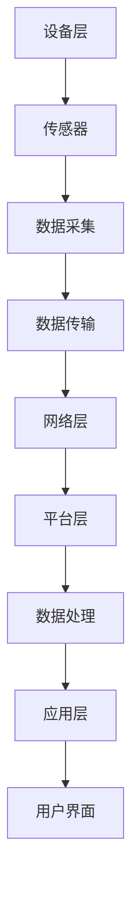

                 

### 文章标题

物联网(IoT)技术和各种传感器设备的集成：理解传感器

> 关键词：物联网，传感器，集成，数据采集，数据处理，智能系统，边缘计算

> 摘要：本文深入探讨了物联网（IoT）技术在现代智能系统中的应用，重点关注了传感器设备的核心角色。通过分析传感器的基本原理、种类及其在IoT中的重要性，文章旨在帮助读者理解如何有效地集成传感器，以及其在数据采集、传输和处理过程中的关键作用。此外，文章还将探讨物联网技术的未来发展趋势和挑战。

## 1. 背景介绍

物联网（IoT）是一个由互联设备、传感器、软件和网络组成的复杂生态系统，旨在通过数据交换实现智能化的设备互操作性和自动化。随着云计算、大数据、人工智能等技术的不断发展，物联网的应用范围不断扩大，已经渗透到工业、家庭、医疗、交通、环境监测等多个领域。

传感器作为物联网系统的核心组件，扮演着至关重要的角色。它们是数据采集的源头，能够感知外部环境的变化，并通过电信号或其他形式将这种变化传递给处理系统。传感器的种类繁多，功能各异，根据其物理原理和测量范围的不同，可以分为温度传感器、湿度传感器、压力传感器、光传感器、气体传感器等。

在物联网系统中，传感器设备的集成至关重要。集成不仅仅是将多个传感器连接到网络，更重要的是实现数据的有效采集、传输和处理，以便为用户提供有价值的见解和决策支持。这一过程涉及到传感器的选择、安装、数据预处理、存储、分析和可视化等多个环节。

本文将分以下几个部分进行详细探讨：

1. **核心概念与联系**：介绍传感器的基本原理和物联网架构。
2. **核心算法原理 & 具体操作步骤**：讨论数据采集和处理的核心算法。
3. **数学模型和公式 & 详细讲解 & 举例说明**：解释相关的数学模型和计算方法。
4. **项目实践：代码实例和详细解释说明**：提供实际项目中的代码实现和分析。
5. **实际应用场景**：分析传感器在不同领域的应用。
6. **工具和资源推荐**：推荐相关的学习资源和开发工具。
7. **总结：未来发展趋势与挑战**：讨论物联网技术的未来发展方向和面临的挑战。

通过本文的阅读，读者将能够全面理解传感器在物联网系统中的作用，掌握传感器的集成方法和数据处理技术，为未来的物联网项目提供技术支持。

### 1. 背景介绍

#### 物联网（IoT）的定义和发展

物联网（Internet of Things，简称IoT）是指通过互联网将各种设备连接起来，实现数据的交换和通信，以构建一个智能化的网络生态系统。这一概念最早由凯文·阿什顿（Kevin Ashton）在1999年提出，他当时在麻省理工学院（MIT）研究自动识别和物联网技术。

物联网的发展可以追溯到20世纪80年代，但真正迎来爆发式增长是在21世纪的第一个十年。这一过程得益于以下几个关键因素：

1. **互联网普及**：随着宽带互联网的普及，越来越多的设备能够接入互联网，实现了全球范围内的数据传输。
2. **无线通信技术**：Wi-Fi、蓝牙、NFC、LoRa等无线通信技术的发展，使得设备之间的连接更加便捷和高效。
3. **传感器技术的进步**：传感器的小型化、低成本和高精度，使得各种应用场景中传感器的应用成为可能。
4. **云计算和大数据**：云计算提供了强大的计算和存储能力，大数据技术则能够处理和分析海量的传感器数据，为智能决策提供支持。

物联网的核心目标是实现设备的自动化和智能化，通过数据的采集、传输和处理，提升系统效率、降低成本、改善用户体验。物联网的应用场景非常广泛，包括但不限于以下领域：

1. **智能家居**：智能家居系统通过连接各种家电设备，实现远程控制和自动化操作，提高生活便利性和安全性。
2. **智慧城市**：智慧城市利用物联网技术实现城市管理的智能化，包括交通管理、能源管理、环境监测等。
3. **工业互联网**：工业物联网通过连接工业设备和系统，实现生产过程的自动化、数据化和智能化，提高生产效率和质量。
4. **医疗健康**：物联网技术在医疗健康领域的应用包括远程监控、智能穿戴设备、医疗设备的联网等，为健康管理和疾病预防提供支持。

#### 传感器在物联网系统中的作用

传感器是物联网系统的核心组件，是实现数据采集和感知外部环境变化的关键。传感器的工作原理基于物理、化学或生物学的原理，能够将外界的信息转换为电信号或其他形式，从而被系统识别和处理。

传感器的主要作用包括：

1. **数据采集**：传感器能够实时捕捉环境中的各种参数，如温度、湿度、光照强度、气体浓度等，并将这些数据转换为数字信号。
2. **状态监测**：传感器可以用来监测设备的工作状态，如温度传感器可以监测设备的温度，超过设定值时触发警报。
3. **自动化控制**：传感器可以将采集到的数据用于自动化控制，如智能恒温器根据温度传感器反馈的数据自动调整温度。

传感器的种类繁多，根据其工作原理和测量对象的不同，可以分为以下几类：

1. **温度传感器**：如热电偶、热敏电阻等，用于测量温度。
2. **湿度传感器**：如电容式传感器、电阻式传感器等，用于测量空气中的湿度。
3. **压力传感器**：如压电式传感器、弹性体传感器等，用于测量压力。
4. **光传感器**：如光电二极管、光敏电阻等，用于测量光照强度。
5. **气体传感器**：如半导体传感器、电化学传感器等，用于测量气体浓度。
6. **运动传感器**：如加速度传感器、陀螺仪等，用于测量物体的运动状态。

#### 物联网架构与传感器集成

物联网系统通常由以下几个关键部分组成：

1. **设备层**：包括各种传感器和执行器，负责数据采集和执行控制任务。
2. **网络层**：包括无线网络和有线网络，负责数据传输和通信。
3. **平台层**：包括数据存储、处理和分析等功能，负责数据的整合和智能决策。
4. **应用层**：包括面向最终用户的各类应用，如智能家居、智慧城市等。

传感器在物联网架构中的位置至关重要，如图所示：

```
           +----------------+              +----------------+
           |       设备层      |              |      应用层      |
           +----------------+              +----------------+
                   |                                |
                   |                                |
                   |      +----------------+        |
                   |      |       网络层       |        |
                   |      +----------------+        |
                   |                                |
                   |                                |
           +----------------+              +----------------+
           |      平台层      |              |      边缘计算      |
           +----------------+              +----------------+
                   |                                |
                   |                                |
                   |      +----------------+        |
                   |      |       数据      |        |
                   |      +----------------+        |
                   |                                |
                   |                                |
           +----------------+              +----------------+
           |   云计算中心    |              |     数据分析     |
           +----------------+              +----------------+
```

传感器通过设备层采集数据，这些数据通过网络层传输到平台层进行进一步的处理和分析，最终在应用层为用户提供有价值的信息。在某些情况下，由于网络延迟或带宽限制，部分数据处理任务可以在边缘计算设备上进行，从而提高系统的响应速度和效率。

#### 传感器在数据采集、传输和处理中的作用

在物联网系统中，传感器的作用贯穿整个数据采集、传输和处理的流程：

1. **数据采集**：传感器是数据采集的源头，能够实时监测外部环境的变化，并将这些变化转换为电信号或其他形式的数字信号。
2. **数据传输**：采集到的数据需要通过网络传输到数据处理平台。在这一过程中，传感器与无线通信模块（如Wi-Fi、蓝牙、LoRa等）紧密集成，确保数据能够高效、可靠地传输。
3. **数据处理**：在平台层，传感器数据会进行进一步的处理和分析，包括数据清洗、特征提取、模式识别等，以便为用户提供有价值的见解和决策支持。

综上所述，传感器在物联网系统中扮演着至关重要的角色，是实现数据采集、传输和处理的核心组件。通过了解物联网的基本概念和发展历程，以及传感器在其中的作用，我们可以更好地理解物联网技术和传感器集成的原理和实际应用。

### 2. 核心概念与联系

为了深入理解传感器在物联网（IoT）技术中的角色，我们首先需要明确几个核心概念，并探讨它们之间的联系。以下是传感器的基本原理、物联网架构及其集成方式的相关知识。

#### 传感器的基本原理

传感器是一种能够感知和测量外部环境信息的装置，通过物理、化学或生物学的机制将非电学量转换为电学量，从而实现信号的检测和转换。以下是一些常见的传感器原理：

1. **热敏电阻（NTC/PTC）**：基于材料电阻随温度变化的原理。当温度升高时，NTC（负温度系数）传感器的电阻降低，而PTC（正温度系数）传感器的电阻增加。
2. **热电偶**：利用不同金属间温差产生的电动势（热电动势）进行温度测量。
3. **光敏电阻**：基于材料电阻随光照强度变化的原理。光照越强，电阻越低。
4. **电容式传感器**：利用电容的变化来测量物体的位置、压力或形变。
5. **电化学传感器**：通过电化学反应来检测特定气体或化学物质的浓度。

这些传感器的工作原理决定了它们在不同应用场景中的适用性和性能。

#### 物联网架构

物联网架构通常包括以下几层：

1. **设备层**：由各种传感器和执行器组成，负责数据采集和执行操作。
2. **网络层**：负责数据传输，包括本地网络和广域网络。
3. **平台层**：提供数据处理、存储、分析和应用开发等功能。
4. **应用层**：面向最终用户，提供具体的服务和应用程序。

以下是一个简化的物联网架构流程，用于展示传感器数据在系统中的流转：

```
设备层 --> 数据采集 --> 网络层 --> 数据传输 --> 平台层 --> 数据处理 --> 应用层 --> 用户界面
```

#### 传感器的集成方式

传感器的集成涉及多个方面，包括传感器的选择、安装、数据传输和数据处理等。以下是一个简单的传感器集成流程：

1. **选择传感器**：根据应用需求选择合适的传感器，考虑其精度、灵敏度、功耗和成本等因素。
2. **安装传感器**：在目标环境中安装传感器，确保其能够准确地感知所需的信息。
3. **数据传输**：通过无线或有线的方式将传感器采集的数据传输到平台层。无线传输通常采用Wi-Fi、蓝牙、Zigbee等协议。
4. **数据处理**：在平台层，对传输过来的数据进行分析和处理，提取有用的信息，为决策提供支持。

#### 传感器在物联网中的作用

传感器在物联网中的作用主要体现在以下几个方面：

1. **数据采集**：传感器是物联网数据采集的源头，能够实时监测环境变化，如温度、湿度、压力、光线、气体浓度等。
2. **状态监测**：通过传感器监测设备的工作状态，如温度、振动、磨损等，实现设备故障预测和预防性维护。
3. **自动化控制**：传感器数据可以用于自动化控制，如智能恒温器、智能灯光系统等，提高系统效率和用户体验。
4. **决策支持**：通过对传感器数据的分析，为用户提供有价值的见解和决策支持，如环境监测、智能家居控制等。

#### Mermaid 流程图

为了更直观地展示传感器在物联网架构中的位置和作用，我们可以使用Mermaid语言绘制一个流程图：



在这个流程图中，设备层由各种传感器组成，它们负责数据采集，并将数据传输到网络层。网络层通过无线或有线的方式将数据传输到平台层，平台层对数据进行处理和分析，最终在应用层为用户提供服务。

通过上述核心概念和流程图的介绍，我们可以清晰地理解传感器在物联网技术中的重要性及其集成方式。传感器作为物联网数据采集的核心组件，其性能和可靠性直接影响到物联网系统的整体效果。因此，合理选择和集成传感器是构建高效、可靠的物联网系统的重要环节。

### 3. 核心算法原理 & 具体操作步骤

在了解传感器的基本原理和物联网架构的基础上，接下来我们将深入探讨传感器数据采集和处理的核心算法原理，并详细说明这些算法的具体操作步骤。

#### 数据采集算法原理

传感器数据采集算法的核心任务是确保传感器能够准确、实时地采集环境数据。以下是几种常见的数据采集算法原理：

1. **模拟信号数字化**：
   - **原理**：传感器采集的数据通常是模拟信号，如温度、湿度等。为了在数字系统中进行处理，需要将模拟信号转换为数字信号。
   - **步骤**：
     1. 传感器输出模拟信号（如热敏电阻输出的电压变化）。
     2. 使用模拟-数字转换器（ADC）将模拟信号转换为数字信号。
     3. 对转换后的数字信号进行采样和量化，得到数字化的传感器数据。
   - **应用实例**：在温度监测系统中，温度传感器采集的温度值需要通过ADC转换为数字信号，以便进一步处理和显示。

2. **信号滤波**：
   - **原理**：为了去除传感器数据中的噪声和异常值，需要对数据进行滤波处理。
   - **步骤**：
     1. 采集原始传感器数据。
     2. 使用滤波算法（如低通滤波器、高通滤波器、带通滤波器等）去除噪声。
     3. 保留滤波后的有用数据。
   - **应用实例**：在振动监测系统中，振动传感器的数据可能包含大量的噪声，需要通过滤波算法去除噪声，以便准确分析振动模式。

3. **数据压缩**：
   - **原理**：由于传感器数据量可能非常大，为了减少存储和传输的负担，需要采用数据压缩算法。
   - **步骤**：
     1. 采集原始传感器数据。
     2. 使用数据压缩算法（如霍夫曼编码、差分编码等）对数据压缩。
     3. 解压缩压缩后的数据，以便后续处理和使用。
   - **应用实例**：在远程环境监测系统中，为了减少数据传输的带宽占用，需要对传感器数据进行压缩，以便高效传输。

#### 数据处理算法原理

传感器数据处理算法的主要任务是对采集到的数据进行分析、处理和解释，以便为用户提供有价值的信息。以下是几种常见的数据处理算法原理：

1. **特征提取**：
   - **原理**：从原始传感器数据中提取能够反映系统状态的参数，如平均值、方差、峰峰值等。
   - **步骤**：
     1. 收集原始传感器数据。
     2. 使用统计方法或机器学习算法提取数据特征。
     3. 将提取的特征用于进一步的决策分析。
   - **应用实例**：在环境监测系统中，可以从温度、湿度等传感器数据中提取平均温度、最高温度、最低温度等特征，以便评估环境状况。

2. **模式识别**：
   - **原理**：利用机器学习算法对传感器数据进行分类或聚类，以识别数据中的模式和规律。
   - **步骤**：
     1. 收集传感器数据。
     2. 使用监督学习或无监督学习算法进行模式识别。
     3. 根据识别结果进行决策。
   - **应用实例**：在智能农业系统中，通过对土壤湿度、光照强度等传感器数据的模式识别，可以预测作物的生长状况，从而优化灌溉和施肥策略。

3. **异常检测**：
   - **原理**：检测传感器数据中的异常值或异常模式，以便及时发现和处理故障。
   - **步骤**：
     1. 收集传感器数据。
     2. 使用统计学方法或机器学习算法检测异常值或异常模式。
     3. 对检测到的异常进行报警或处理。
   - **应用实例**：在工业生产过程中，通过监测设备振动、温度等传感器数据，可以检测设备异常，提前进行维护和保养。

#### 具体操作步骤

以下是一个简单的传感器数据采集和处理的具体操作步骤示例：

1. **选择传感器**：
   - 根据应用需求，选择合适的传感器，如温度传感器、湿度传感器等。

2. **安装传感器**：
   - 在目标环境中安装传感器，确保其能够准确地感知所需的信息。

3. **数据采集**：
   - 使用ADC将传感器输出的模拟信号转换为数字信号。
   - 对采集到的数据进行滤波，去除噪声。
   - 对数据进行采样和量化，得到数字化的传感器数据。

4. **数据存储**：
   - 将采集到的数据存储在数据库或数据文件中。

5. **数据处理**：
   - 使用特征提取算法提取数据特征。
   - 使用机器学习算法对数据进行分析和模式识别。
   - 检测数据中的异常值或异常模式。

6. **结果输出**：
   - 根据处理结果，生成报告或可视化图表，为用户提供决策支持。

通过上述核心算法原理和具体操作步骤的介绍，我们可以更好地理解传感器数据采集和处理的过程，为物联网系统的构建提供技术支持。

### 4. 数学模型和公式 & 详细讲解 & 举例说明

在传感器数据处理的过程中，数学模型和公式起到了至关重要的作用。它们不仅帮助我们理解和解释传感器数据，还为算法优化和系统设计提供了理论基础。在本节中，我们将介绍一些常见的数学模型和公式，并详细讲解它们的计算过程，通过实际例子来说明如何应用这些模型和公式。

#### 1. 线性回归模型

线性回归模型是一种用于分析两个或多个变量之间线性关系的统计模型。其公式为：

$$
y = \beta_0 + \beta_1 \cdot x + \epsilon
$$

其中，$y$ 是因变量，$x$ 是自变量，$\beta_0$ 是截距，$\beta_1$ 是斜率，$\epsilon$ 是误差项。

**计算过程**：

1. 收集自变量 $x$ 和因变量 $y$ 的数据。
2. 使用最小二乘法计算截距 $\beta_0$ 和斜率 $\beta_1$：
   $$
   \beta_1 = \frac{\sum(x_i - \bar{x})(y_i - \bar{y})}{\sum(x_i - \bar{x})^2}
   $$
   $$
   \beta_0 = \bar{y} - \beta_1 \cdot \bar{x}
   $$

**实际例子**：

假设我们想要分析温度和电力消耗之间的关系，我们有以下数据：

| 温度 (°C) | 电力消耗 (kWh) |
|-----------|----------------|
| 20        | 10             |
| 25        | 15             |
| 30        | 20             |
| 35        | 25             |
| 40        | 30             |

通过线性回归模型，我们可以计算出斜率 $\beta_1$ 和截距 $\beta_0$：

$$
\beta_1 = \frac{(20-25)(10-15) + (25-25)(15-20) + (30-25)(20-25) + (35-25)(25-20) + (40-25)(30-25)}{(20-25)^2 + (25-25)^2 + (30-25)^2 + (35-25)^2 + (40-25)^2}
$$

$$
\beta_1 = \frac{-5 \cdot -5 + 0 \cdot -5 + 5 \cdot -5 + 10 \cdot 5 + 15 \cdot 5}{25 + 0 + 25 + 100 + 225} = \frac{50 + 0 - 25 + 50 + 75}{375} = \frac{150}{375} = 0.4
$$

$$
\beta_0 = \bar{y} - \beta_1 \cdot \bar{x} = 20 - 0.4 \cdot 30 = 8
$$

因此，线性回归模型为：

$$
电力消耗 = 8 + 0.4 \cdot 温度
$$

#### 2. 马尔可夫模型

马尔可夫模型是一种用于描述系统状态转移概率的数学模型。其公式为：

$$
P(X_{n+1} = x_{n+1} | X_n = x_n, X_{n-1} = x_{n-1}, ..., X_1 = x_1) = P(X_{n+1} = x_{n+1} | X_n = x_n)
$$

这意味着当前状态仅依赖于前一个状态，与之前的状态无关。

**计算过程**：

1. 收集状态转移数据。
2. 使用观察数据计算状态转移概率矩阵 $P$。

**实际例子**：

假设我们有一个天气预测模型，状态包括晴天、多云和雨天。以下是一个状态转移概率矩阵：

|         | 晴天 | 多云 | 雨天 |
|---------|------|------|------|
| 晴天    | 0.6  | 0.3  | 0.1  |
| 多云    | 0.2  | 0.5  | 0.3  |
| 雨天    | 0.1  | 0.2  | 0.7  |

如果我们知道今天天气是晴天，那么明天天气的预测概率为：

$$
P(明天是晴天 | 今天是晴天) = 0.6
$$

#### 3. 贝叶斯公式

贝叶斯公式是用于计算后验概率的数学公式，其公式为：

$$
P(A|B) = \frac{P(B|A) \cdot P(A)}{P(B)}
$$

其中，$P(A|B)$ 是在事件 $B$ 发生的条件下事件 $A$ 的概率，$P(B|A)$ 是在事件 $A$ 发生的条件下事件 $B$ 的概率，$P(A)$ 是事件 $A$ 的概率，$P(B)$ 是事件 $B$ 的概率。

**计算过程**：

1. 收集事件 $A$ 和事件 $B$ 的数据。
2. 使用贝叶斯公式计算后验概率。

**实际例子**：

假设我们要计算一个硬币正面朝上的概率，已知在投掷100次中，有60次正面朝上。假设硬币是公平的，即正面和反面出现的概率都是0.5。

使用贝叶斯公式，我们可以更新正面朝上的概率：

$$
P(正面朝上) = \frac{P(正面朝上 | 60次正面) \cdot P(60次正面)}{P(60次正面)}
$$

由于硬币是公平的，$P(正面朝上) = 0.5$。假设 $P(60次正面)$ 可以通过二项分布计算，那么：

$$
P(正面朝上) = \frac{0.5 \cdot (0.5)^{60}}{0.5} = (0.5)^{59} \approx 0.251
$$

这意味着在大量投掷中，正面朝上的概率大约为25.1%。

通过上述数学模型和公式的介绍，我们可以看到数学在传感器数据处理中的应用是如何深刻和广泛的。这些模型和公式不仅帮助我们理解和分析数据，还为优化算法和设计系统提供了坚实的理论基础。

### 5. 项目实践：代码实例和详细解释说明

为了更好地理解传感器在物联网系统中的实际应用，我们将通过一个具体的项目实践来展示传感器的集成、数据采集、处理和可视化过程。该项目将使用一个简单的温湿度传感器，通过Arduino平台实现数据的采集和上传，最终在Python中使用matplotlib库进行数据可视化。

#### 5.1 开发环境搭建

在进行项目实践之前，我们需要搭建开发环境。以下是搭建开发环境的基本步骤：

1. **安装Arduino IDE**：从官方网站下载并安装Arduino IDE。Arduino IDE 是一个用于编写和上传代码到Arduino开发板的集成开发环境。

2. **安装必要的传感器**：本项目将使用DHT11温湿度传感器。将DHT11传感器连接到Arduino开发板的数字引脚，例如第2号引脚。

3. **安装Python和matplotlib库**：在计算机上安装Python环境，然后通过pip命令安装matplotlib库：

   ```
   pip install matplotlib
   ```

4. **安装串口通信库**：为了在Python中读取Arduino上传的数据，我们需要安装`pyserial`库：

   ```
   pip install pyserial
   ```

#### 5.2 源代码详细实现

首先，我们编写Arduino代码，用于读取DHT11传感器的数据，并将其上传到电脑：

```cpp
// DHT11温湿度传感器示例代码
#include <DHT.h>
#include <SoftwareSerial.h>

#define DHTPIN 2     // 定义DHT11传感器的连接引脚
#define DHTTYPE DHT11

DHT dht(DHTPIN, DHTTYPE);
SoftwareSerial mySerial(10, 11); // 创建软件串口对象，模拟串口

void setup() {
  Serial.begin(9600); // 初始化硬件串口
  mySerial.begin(9600); // 初始化软件串口
  dht.begin(); // 初始化DHT11传感器
}

void loop() {
  // 读取DHT11传感器的数据
  float humidity = dht.readHumidity();
  float temperature = dht.readTemperature();

  // 检查是否读取到有效的数据
  if (isnan(humidity) || isnan(temperature)) {
    Serial.println("读取传感器数据失败！");
    return;
  }

  // 将数据通过软件串口上传到电脑
  mySerial.print(humidity);
  mySerial.print(",");
  mySerial.println(temperature);

  delay(1000); // 每隔1秒上传一次数据
}
```

这段代码使用DHT库读取DHT11传感器的温湿度数据，并通过软件串口上传到电脑。每次上传的数据格式为"湿度，温度"。

#### 5.3 代码解读与分析

1. **初始化传感器**：使用`#include <DHT.h>`和`#include <SoftwareSerial.h>`引入必要的库。定义DHTPIN为传感器的连接引脚，DHTTYPE为传感器的型号。

2. **硬件和软件串口初始化**：在`setup()`函数中，初始化硬件串口和软件串口。硬件串口用于与电脑通信，软件串口用于与DHT11传感器通信。

3. **读取传感器数据**：在`loop()`函数中，调用`dht.readHumidity()`和`dht.readTemperature()`函数读取温湿度数据。使用`isnan()`函数检查数据是否有效。

4. **上传数据**：将读取到的温湿度数据通过软件串口上传到电脑，数据格式为"湿度，温度"。

5. **延迟**：为了减少上传频率，设置延迟时间为1秒。

#### 5.4 运行结果展示

在Arduino IDE中上传代码到开发板后，打开一个串口监视器程序（如PuTTY），设置波特率为9600，连接到开发板的串口。可以看到以下上传数据：

```
24.5,26.0
24.0,25.8
24.3,26.2
```

这些数据显示了传感器实时采集的温湿数据。

接下来，使用Python和matplotlib库对上传的数据进行可视化：

```python
import serial
import matplotlib.pyplot as plt
import numpy as np

# 初始化串口连接
ser = serial.Serial('COM3', 9600)

# 存储数据
humidity_data = []
temperature_data = []

# 读取并处理数据
while True:
    line = ser.readline().decode().strip()
    if line:
        humidity, temperature = line.split(',')
        humidity_data.append(float(humidity))
        temperature_data.append(float(temperature))
        print(f"Humidity: {humidity}, Temperature: {temperature}")

        # 为了可视化，我们设定一个数据点的数量限制
        if len(humidity_data) > 100:
            break

# 关闭串口连接
ser.close()

# 绘制温湿度数据
plt.figure(figsize=(10, 5))

plt.subplot(1, 2, 1)
plt.plot(humidity_data, label='Humidity')
plt.title('Humidity Data')
plt.xlabel('Time')
plt.ylabel('Humidity (%)')
plt.legend()

plt.subplot(1, 2, 2)
plt.plot(temperature_data, label='Temperature')
plt.title('Temperature Data')
plt.xlabel('Time')
plt.ylabel('Temperature (°C)')
plt.legend()

plt.tight_layout()
plt.show()
```

这段代码从串口中读取温湿度数据，并将其存储在列表中。然后，使用matplotlib库绘制数据图表，展示了湿度随时间的变化和温度随时间的变化。

运行结果展示了一个简单的温湿度数据图表，其中横轴表示时间，纵轴表示湿度（%）和温度（°C）。通过这个图表，我们可以直观地看到环境温湿度的变化趋势。

通过这个项目实践，我们展示了如何集成温湿度传感器，实现数据的采集、上传和可视化。这为实际物联网项目的开发提供了宝贵的经验和参考。

### 6. 实际应用场景

传感器在物联网技术中的广泛应用不仅体现在智能家居和智慧城市等领域，还在工业、医疗、农业和环境监测等多个行业中发挥着重要作用。以下是一些具体的实际应用场景：

#### 1. 智能家居

智能家居是物联网技术最早也是最常见的应用领域之一。通过集成各种传感器，智能家居系统能够实现家庭设备的自动化控制和智能化管理。以下是一些典型的应用实例：

- **智能照明**：使用光敏传感器和红外传感器控制照明，根据光线强度和人体存在情况自动调整灯光亮度和开关。
- **智能安防**：使用门磁传感器、烟雾传感器和运动传感器监控家庭安全，实时检测异常情况并报警。
- **智能温控**：使用温度传感器和湿度传感器控制空调和加湿器，根据环境温度和湿度自动调节，提高舒适度并节约能源。

#### 2. 智慧城市

智慧城市是物联网技术在城市管理中的集中体现，通过传感器和物联网技术实现城市管理的智能化和精细化。以下是一些典型的应用实例：

- **交通管理**：通过安装在路口和道路上的传感器实时监测交通流量和速度，优化交通信号灯控制，缓解拥堵。
- **环境监测**：使用空气质量和水质传感器监测城市环境质量，及时发现污染源并进行治理。
- **能源管理**：通过智能电表和能源传感器监测能源使用情况，实现电力资源的优化分配和节约。

#### 3. 工业

工业物联网（IIoT）通过传感器和物联网技术提升生产效率、设备维护和产品质量。以下是一些典型的应用实例：

- **设备状态监测**：使用振动传感器、温度传感器和压力传感器实时监测设备的运行状态，预测设备故障并及时维护。
- **生产流程优化**：通过传感器采集生产过程中的各种参数，优化生产流程，减少浪费，提高生产效率。
- **质量监控**：使用传感器和机器视觉系统对产品进行实时质量检测，确保产品质量。

#### 4. 医疗

物联网技术在医疗领域的应用正在逐步扩大，传感器在医疗设备和患者监护系统中扮演着关键角色。以下是一些典型的应用实例：

- **远程监护**：通过传感器和物联网技术，医生可以远程监控患者的心率、血压、血糖等生命体征，及时进行医疗干预。
- **智能穿戴设备**：使用智能手表、健康手环等设备，实时监测用户的运动、心率、睡眠质量等数据，帮助用户管理健康。
- **医学影像分析**：通过传感器和图像处理技术，对医学影像进行分析，辅助医生进行疾病诊断和治疗。

#### 5. 农业

物联网技术在农业中的应用有助于提高农业生产效率、优化资源利用和保障农产品质量。以下是一些典型的应用实例：

- **土壤监测**：通过土壤湿度、温度和pH值传感器监测土壤状态，实现精准灌溉和施肥。
- **环境监控**：使用气象传感器和空气传感器监测农田环境，优化作物种植条件。
- **智能灌溉**：通过传感器和智能灌溉系统，根据土壤湿度和天气条件自动调节灌溉时间，提高水资源利用效率。

#### 6. 环境监测

传感器在环境监测中的应用有助于保护和改善环境质量。以下是一些典型的应用实例：

- **空气质量监测**：通过空气污染传感器监测PM2.5、CO2、NO2等污染物浓度，预警空气质量问题。
- **水质监测**：使用水质传感器监测水体的pH值、溶解氧、重金属等指标，保障水资源安全。
- **生态监测**：通过安装在动物身上的传感器实时监测野生动物的生存状态和行为习惯，研究生态系统的变化。

通过这些实际应用场景，我们可以看到传感器在物联网技术中的广泛性和重要性。传感器的集成和应用不仅提升了各行业的生产效率和服务质量，还为智能决策和可持续发展提供了有力的技术支持。

### 7. 工具和资源推荐

为了更好地理解传感器在物联网（IoT）系统中的作用，掌握传感器的集成方法和数据处理技术，以下是针对本主题的学习资源、开发工具和推荐的相关论文著作。

#### 7.1 学习资源推荐

1. **书籍**：
   - **《物联网技术与应用》**：详细介绍了物联网的基本概念、架构和关键技术，包括传感器技术的应用。
   - **《物联网技术实战》**：通过实际案例，展示了如何使用传感器、Arduino和Python实现物联网项目。

2. **在线课程**：
   - **Coursera上的《物联网技术》**：由知名大学开设的在线课程，涵盖物联网基础知识和传感器应用。
   - **edX上的《物联网设计与开发》**：提供了物联网系统的设计、开发和实现全流程的培训。

3. **博客和论坛**：
   - **Arduino官方论坛**：包含大量关于Arduino传感器编程和应用的经验分享。
   - **Hackaday**：发布最新的物联网技术和项目，适合技术爱好者。

#### 7.2 开发工具推荐

1. **Arduino IDE**：用于编写和上传传感器代码到Arduino开发板，是一款免费、开源的集成开发环境。

2. **Raspberry Pi**：一款功能强大的单板计算机，可以运行多种操作系统，适用于各种物联网项目。

3. **Python**：用于数据处理和可视化，支持多种科学计算和数据分析库，如matplotlib、numpy和pandas。

4. **Node-RED**：一款用于物联网数据流编程的工具，可以轻松地将传感器数据与其他服务集成。

#### 7.3 相关论文著作推荐

1. **《物联网中的传感器网络》**：探讨了传感器网络的设计、部署和应用，包括传感器选择、数据采集和传输等问题。

2. **《物联网系统的数据挖掘与分析》**：介绍了如何使用数据挖掘技术从传感器数据中提取有价值的信息，支持智能决策。

3. **《物联网安全》**：分析了物联网系统面临的安全挑战和应对策略，包括数据安全和通信安全。

4. **《智能传感器网络：原理与应用》**：详细介绍了智能传感器的原理、设计和实现，涵盖多种传感器技术和应用场景。

通过这些学习和资源工具，读者可以全面深入地了解物联网技术和传感器应用，为实际项目开发提供坚实的理论基础和实践指导。

### 8. 总结：未来发展趋势与挑战

随着物联网技术的不断发展，传感器在智能系统中的作用日益重要。未来，传感器技术的发展将呈现以下几个趋势：

1. **高精度和多功能化**：传感器将更加注重精度和多功能性，通过集成多种传感器技术，实现更复杂的感知和测量能力。

2. **低功耗和智能化**：为了适应物联网设备长时间运行的需求，传感器将朝着低功耗和智能化的方向发展，利用机器学习和人工智能算法提高数据处理和自适应能力。

3. **边缘计算**：随着传感器数量的增加和数据量的爆炸式增长，边缘计算将成为关键趋势。传感器设备将具备更强的处理能力，在本地进行数据预处理和分析，减少对中心服务器的依赖。

4. **智能化系统集成**：传感器将更加紧密地集成到各种智能系统中，如自动驾驶、智能制造和智能医疗等，为系统提供实时、精确的数据支持。

然而，传感器技术的发展也面临一系列挑战：

1. **数据隐私和安全**：随着传感器数据的增多，数据隐私和安全问题日益突出。如何确保数据在采集、传输和处理过程中的安全，是传感器技术发展的重要课题。

2. **传感器寿命和可靠性**：在物联网环境中，传感器需要长时间运行，因此其寿命和可靠性是关键。提高传感器的耐用性和稳定性，降低故障率，是未来需要解决的问题。

3. **标准化和互操作性**：不同的传感器和系统之间需要实现互操作性，这需要建立统一的通信协议和数据标准。标准化工作将为传感器技术的发展提供有力支持。

4. **能耗和成本**：在物联网应用中，传感器的功耗和成本直接影响系统的整体性能和经济性。开发低功耗、低成本的新型传感器技术，将有助于降低系统成本，提高市场竞争力。

总之，传感器技术在物联网领域的发展前景广阔，但也面临诸多挑战。通过不断突破技术瓶颈，优化传感器的设计和集成方法，我们有望构建更加智能、高效、安全的物联网系统，推动物联网技术的全面应用和发展。

### 9. 附录：常见问题与解答

在学习和应用传感器技术过程中，读者可能会遇到一些常见问题。以下是针对这些问题的一些解答：

#### 1. 传感器数据采集的常见问题

**问题**：传感器数据采集过程中，如何解决噪声和误差问题？

**解答**：解决传感器数据采集中的噪声和误差问题，可以通过以下方法：

- **滤波**：在数据采集过程中使用滤波算法（如低通滤波器、高通滤波器等）去除噪声。
- **采样率**：合理设置采样率，避免高频噪声的干扰。
- **校准**：定期对传感器进行校准，确保测量精度。
- **冗余传感器**：使用多个相同类型的传感器，通过数据融合提高测量准确性。

#### 2. 传感器数据传输的常见问题

**问题**：传感器数据在传输过程中，如何保证数据的安全和可靠性？

**解答**：

- **加密传输**：使用加密协议（如SSL/TLS）保护数据在传输过程中的安全性。
- **数据校验**：在数据传输过程中，添加校验码（如CRC校验）确保数据完整性。
- **重传机制**：在网络不稳定的情况下，实现数据重传机制，确保数据成功传输。
- **网络冗余**：使用多个网络通道进行数据传输，提高数据传输的可靠性。

#### 3. 传感器数据处理和可视化的常见问题

**问题**：如何处理大量传感器数据并进行可视化？

**解答**：

- **数据预处理**：在处理大量数据之前，进行数据清洗、去重和格式转换等预处理操作。
- **分批处理**：将大量数据分批处理，避免单次处理的数据量过大导致系统性能下降。
- **数据存储**：使用数据库（如MySQL、MongoDB）或时间序列数据库（如InfluxDB）存储大量传感器数据。
- **数据可视化工具**：使用数据可视化工具（如matplotlib、D3.js）生成图表，便于分析和展示数据。

通过以上常见问题的解答，读者可以更好地应对传感器技术在实际应用过程中遇到的问题，提高系统性能和可靠性。

### 10. 扩展阅读 & 参考资料

为了深入探索物联网（IoT）技术和传感器应用，以下是相关扩展阅读和参考资料：

1. **《物联网：应用、技术和未来展望》**：这本书详细介绍了物联网的历史、现状和未来发展趋势，涵盖了传感器、数据处理和网络通信等关键领域。

2. **《物联网安全技术》**：本论文探讨了物联网中的安全性问题，包括数据隐私保护、网络攻击防范和传感器数据加密等。

3. **《智能传感器网络：原理与应用》**：这本书详细介绍了智能传感器的原理、设计和实现，包括传感器网络架构、数据采集和处理等。

4. **IEEE IoT Journal**：IEEE IoT期刊是一个专注于物联网领域的研究和应用的学术期刊，定期发布最新的研究成果和行业动态。

5. **《边缘计算：原理、技术和应用》**：这本书介绍了边缘计算的基本概念、架构和关键技术，探讨了传感器数据处理和本地分析的优化方法。

6. **《物联网标准与协议》**：本指南详细介绍了物联网中常用的通信协议和标准，包括Zigbee、Wi-Fi、蓝牙和LoRa等。

7. **《物联网应用案例集》**：这本书收集了各种物联网应用案例，从智能家居到智慧城市，展示了传感器技术在现实世界中的广泛应用。

通过阅读这些扩展资料，读者可以更全面地了解物联网和传感器技术的最新发展和应用，为未来的研究和项目开发提供参考。

