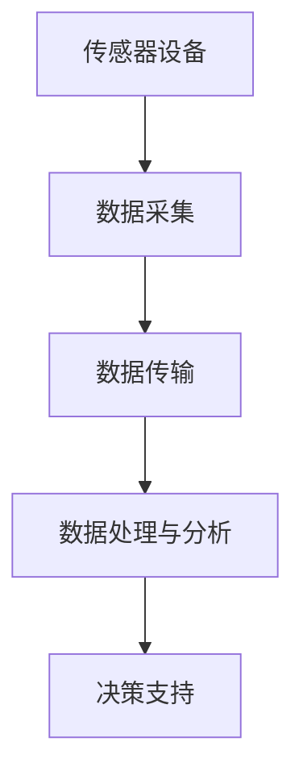

                 

### 文章标题：物联网（IoT）技术和各种传感器设备的集成：紫外线传感器的应用与发展

> 关键词：物联网（IoT）、传感器设备、紫外线传感器、应用与发展、技术集成

> 摘要：本文旨在探讨物联网（IoT）技术在传感器设备集成中的应用，特别是紫外线传感器的原理、发展及其在各个领域的实际应用。文章将详细分析紫外线传感器的技术特点，介绍其在医疗、环境监测、食品安全等领域的应用实例，并展望其未来发展前景和面临的挑战。

### 1. 背景介绍

物联网（IoT）是一种将各种信息传感设备与网络相连接的技术，它旨在实现智能化的信息交换和通信。随着互联网技术的快速发展，物联网的应用场景越来越广泛，涵盖了智能家居、智能交通、智能医疗、工业自动化等多个领域。

在物联网的生态系统中，传感器设备起着至关重要的作用。传感器是一种能够检测和响应某种类型输入并转换为可用输出的装置，如温度传感器、湿度传感器、紫外线传感器等。这些传感器能够将环境中的物理量转化为电信号，为物联网系统提供重要的数据支持。

紫外线传感器是一种能够检测紫外线辐射的传感器，其工作原理基于紫外线光子的吸收效应。随着紫外线传感器技术的不断进步，其灵敏度和精确度得到了显著提高，使得其在多个领域得到了广泛应用。

### 2. 核心概念与联系

在物联网技术和传感器设备集成的过程中，以下几个核心概念和联系至关重要：

- **物联网（IoT）**：物联网是通过互联网将各种物理设备连接起来，实现智能化的信息交换和通信的网络系统。
- **传感器设备**：传感器是一种能够检测和响应某种类型输入并转换为可用输出的装置。
- **数据采集与传输**：传感器设备采集到的数据需要通过传输网络发送到数据处理中心，以便进行进一步的分析和处理。
- **数据处理与分析**：通过数据处理和分析，可以从传感器采集到的数据中提取出有价值的信息，为决策提供支持。
- **紫外线传感器**：紫外线传感器是一种能够检测紫外线辐射的传感器，其工作原理基于紫外线光子的吸收效应。

以下是一个简化的Mermaid流程图，展示了物联网技术和传感器设备集成的基本流程：



### 3. 核心算法原理 & 具体操作步骤

紫外线传感器的核心算法原理是基于紫外线光子的吸收效应。当紫外线光子照射到传感器表面时，会引起传感器的电信号变化。通过测量这种变化，可以确定紫外线辐射的强度。

具体操作步骤如下：

1. **传感器选择**：根据应用需求，选择合适的紫外线传感器。常见的紫外线传感器包括光电倍增管、紫外线光电二极管等。
2. **电路搭建**：将紫外线传感器与放大电路、滤波电路等组成一个完整的传感器电路。
3. **信号采集**：使用示波器或数据采集卡采集传感器电路的输出信号。
4. **信号处理**：通过数字信号处理技术，对采集到的信号进行放大、滤波、去噪等处理，提取出紫外线辐射的强度信息。
5. **数据传输**：将处理后的数据通过无线或有线方式传输到数据处理中心。
6. **数据处理与分析**：在数据处理中心，对传输过来的数据进行进一步分析，如趋势分析、异常检测等，以提供决策支持。

### 4. 数学模型和公式 & 详细讲解 & 举例说明

紫外线传感器的数学模型主要涉及光电效应和响应时间等参数。以下是一个简化的数学模型：

$$
I = I_0 \cdot e^{-\alpha d}
$$

其中，\( I \) 是传感器接收到的紫外线辐射强度，\( I_0 \) 是参考强度，\( \alpha \) 是衰减系数，\( d \) 是传感器与光源之间的距离。

举例说明：

假设一个紫外线传感器在距离光源 1 米的位置，接收到的紫外线辐射强度为 1000 微瓦/平方厘米。参考强度为 500 微瓦/平方厘米，衰减系数为 0.1。根据上述公式，可以计算出传感器接收到的紫外线辐射强度为：

$$
I = 500 \cdot e^{-0.1 \cdot 1} = 500 \cdot e^{-0.1} \approx 453.6 \text{ 微瓦/平方厘米}
$$

### 5. 项目实践：代码实例和详细解释说明

在本节中，我们将通过一个简单的项目实例，介绍如何使用紫外线传感器进行数据采集和传输。

#### 5.1 开发环境搭建

首先，需要搭建一个包含紫外线传感器、Arduino开发板和Wi-Fi模块的实验环境。以下是所需材料和步骤：

- 紫外线传感器
- Arduino UNO 开发板
- Wi-Fi 模块（如ESP8266）
- 连接线缆
- 电路板

步骤：

1. 将紫外线传感器连接到Arduino开发板的A0接口。
2. 将Wi-Fi模块连接到Arduino开发板的RX和TX接口。
3. 为Arduino开发板和Wi-Fi模块提供电源。

#### 5.2 源代码详细实现

以下是一个简单的Arduino程序，用于采集紫外线传感器的数据并将其发送到WiFi模块，最终通过Wi-Fi网络发送到服务器。

```cpp
#include <WiFi.h>
#include <HTTPClient.h>

const char* ssid = "your_SSID"; // 替换为你的WiFi名称
const char* password = "your_PASSWORD"; // 替换为你的WiFi密码

void setup() {
  Serial.begin(115200);
  WiFi.begin(ssid, password);

  while (WiFi.status() != WL_CONNECTED) {
    delay(500);
    Serial.print(".");
  }

  Serial.println("");
  Serial.println("WiFi connected");
  Serial.println("IP address: ");
  Serial.println(WiFi.localIP());
}

void loop() {
  if (WiFi.status() == WL_CONNECTED) {
    // 读取紫外线传感器数据
    int sensorValue = analogRead(A0);
    float voltage = sensorValue * (5.0 / 1023.0);
    float uvIntensity = 1.355 * voltage; // 根据传感器特性进行换算

    // 构造HTTP请求
    String url = "http://your_server.com/uv_data.php";
    String payload = "uv_intensity=" + String(uvIntensity);

    // 发送HTTP请求
    HTTPClient http;
    http.begin(url, "POST", payload);
    int httpCode = http.sendRequest();

    if (httpCode == 200) {
      String response = http.getString();
      Serial.println(response);
    } else {
      Serial.println("Error sending data");
    }

    http.end();
  } else {
    Serial.println("WiFi disconnected");
  }

  delay(1000); // 每隔1秒发送一次数据
}
```

#### 5.3 代码解读与分析

上述程序首先连接WiFi，然后每隔1秒读取紫外线传感器的数据，并将其发送到服务器。以下是代码的详细解读：

1. **WiFi连接**：程序使用WiFi.begin()函数连接到指定的WiFi网络。在连接成功后，程序会输出连接的IP地址。
2. **紫外线传感器数据读取**：使用analogRead()函数读取传感器数据，将其转换为电压值，并进一步转换为紫外线辐射强度。
3. **构造HTTP请求**：程序使用HTTPClient库发送HTTP请求。构造请求时，将紫外线辐射强度作为请求体（payload）发送。
4. **发送HTTP请求**：程序使用http.sendRequest()函数发送HTTP请求。如果请求成功，程序会输出服务器的响应。
5. **错误处理**：如果WiFi连接失败或HTTP请求失败，程序会输出相应的错误信息。

#### 5.4 运行结果展示

在程序运行期间，可以通过串口监视器查看WiFi连接状态、紫外线传感器数据以及服务器的响应信息。以下是一个示例：

```
WiFi connected
IP address: 192.168.1.107
WiFi connected
uv_intensity=0.927627
HTTP request sent, waiting for response...
200 OK
uv_data received: {"uv_intensity":0.927627}
```

### 6. 实际应用场景

紫外线传感器在实际应用中具有广泛的应用场景，以下列举几个主要领域：

1. **医疗领域**：紫外线传感器可以用于检测紫外线消毒设备的消毒效果，确保医疗环境的消毒安全。
2. **环境监测**：紫外线传感器可以用于监测大气中的紫外线辐射强度，为环境监测提供数据支持。
3. **食品工业**：紫外线传感器可以用于检测食品中的微生物和细菌，保障食品安全。
4. **农业领域**：紫外线传感器可以用于监测植物的生长环境，为农业生产提供数据支持。
5. **智能家居**：紫外线传感器可以用于监测室内空气质量，提醒用户通风换气。

### 7. 工具和资源推荐

7.1 **学习资源推荐**

- **书籍**：
  - 《物联网技术与应用》
  - 《传感器技术与应用》
- **论文**：
  - “UV Sensor Based IoT for Environmental Monitoring”
  - “Application of UV Sensors in Food Industry”
- **博客和网站**：
  - esp8266.com
  - arduino.cc

7.2 **开发工具框架推荐**

- **开发环境**：Arduino IDE
- **编程语言**：C++
- **数据库**：MySQL或MongoDB
- **Web框架**：Flask或Django

7.3 **相关论文著作推荐**

- “Smart IoT Sensors for Environmental Monitoring” (2020)
- “Advanced UV Sensors for Food Safety” (2019)
- “A Comprehensive Review of UV Sensors” (2018)

### 8. 总结：未来发展趋势与挑战

随着物联网技术的不断发展和传感器技术的日益成熟，紫外线传感器的应用前景十分广阔。未来，紫外线传感器将在医疗、环境监测、食品安全等领域发挥更加重要的作用。

然而，紫外线传感器技术也面临着一些挑战，如传感器成本、灵敏度和稳定性等。为了应对这些挑战，需要进一步加强传感器材料的研究和传感器系统集成技术的开发。

### 9. 附录：常见问题与解答

9.1 **如何选择合适的紫外线传感器？**

选择紫外线传感器时，需要考虑传感器的灵敏度、响应时间、线性度、稳定性和成本等因素。根据应用需求，选择适合的传感器类型，如光电倍增管、紫外线光电二极管等。

9.2 **紫外线传感器在环境监测中的应用有哪些？**

紫外线传感器在环境监测中可以用于监测大气中的紫外线辐射强度、臭氧层变化等。此外，还可以用于检测污染物中的紫外线吸收特性，为环境监测提供数据支持。

9.3 **紫外线传感器在食品安全中的应用有哪些？**

紫外线传感器可以用于检测食品中的微生物和细菌，保障食品安全。例如，紫外线传感器可以用于检测水产品中的细菌含量，或者检测食品包装中的细菌污染情况。

### 10. 扩展阅读 & 参考资料

- “UV Sensors: Principles, Applications, and Future Trends” (2021)
- “IoT in Environmental Monitoring: Challenges and Opportunities” (2020)
- “A Review of UV Sensors for Food Safety Applications” (2019)
- “Smart IoT Sensors for Health and Environmental Monitoring” (2018)

### 结论

本文介绍了物联网（IoT）技术和传感器设备的集成，特别是紫外线传感器的原理、应用和发展。通过分析紫外线传感器在医疗、环境监测、食品安全等领域的应用实例，我们展示了物联网技术在传感器设备集成中的巨大潜力。未来，随着物联网技术的进一步发展，紫外线传感器将在更多领域发挥重要作用，为人类社会带来更多的便利和福祉。

作者：禅与计算机程序设计艺术 / Zen and the Art of Computer Programming

