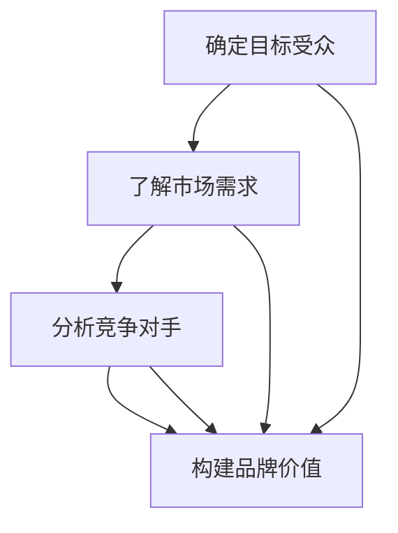
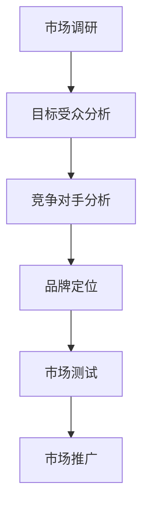

                 

### 独立开发者的产品定位策略

在当今快速发展的数字化时代，独立开发者面临着前所未有的机遇和挑战。如何在这个竞争激烈的市场中找到自己的位置，制定有效的产品定位策略，成为了每个独立开发者都必须面对的问题。本文将详细探讨独立开发者如何通过明确目标受众、了解市场需求、分析竞争对手以及构建独特的品牌价值来制定成功的产品定位策略。

#### 1. 背景介绍

独立开发者，通常是指那些独立于大型企业或组织，依靠自己的技术和创意进行软件开发的人。他们往往具有高度的自主性和灵活性，但同时也面临着资源有限、市场竞争激烈等挑战。因此，制定一个清晰的产品定位策略对于独立开发者的成功至关重要。

在当前的市场环境中，消费者对于软件产品的需求日益多样化和个性化。与此同时，市场上充斥着大量的同类产品，这使得独立开发者必须找到自己的独特价值，以便在竞争中脱颖而出。因此，产品定位策略不仅关乎产品的成功，也关乎开发者的生存和发展。

#### 2. 核心概念与联系

**目标受众（Target Audience）**：产品定位的第一步是确定目标受众。这包括了解他们的需求、偏好和习惯。通过深入研究目标受众，开发者可以更好地设计产品功能，满足他们的期望。

**市场需求（Market Demand）**：理解市场需求是产品定位的关键。这包括分析当前市场的趋势、潜在的机会以及竞争对手的策略。通过了解市场需求，开发者可以更好地把握市场脉搏，制定符合市场预期和需求的产品策略。

**竞争对手（Competitive Analysis）**：对竞争对手进行分析是产品定位的另一个重要方面。通过了解竞争对手的产品、市场策略和用户评价，开发者可以找到自己的独特优势，并制定有针对性的市场策略。

**品牌价值（Brand Value）**：构建独特的品牌价值是产品定位的重要组成部分。品牌不仅是一种标识，更是用户对产品的情感认同和信任。通过建立强大的品牌价值，开发者可以提升产品的竞争力，吸引更多的用户。

以下是产品定位策略的核心概念及其联系的Mermaid流程图：



#### 3. 核心算法原理 & 具体操作步骤

产品定位策略的制定需要一系列的算法和步骤。以下是核心算法原理和具体操作步骤：

**步骤一：市场调研（Market Research）**

- 进行市场调研，收集关于目标受众、市场需求和竞争对手的数据。
- 使用问卷调查、用户访谈、竞争对手分析等方法，深入挖掘市场信息。

**步骤二：目标受众分析（Target Audience Analysis）**

- 确定目标受众的基本特征，包括年龄、性别、职业、地域等。
- 分析目标受众的需求、偏好和行为模式，为产品功能设计提供依据。

**步骤三：竞争对手分析（Competitive Analysis）**

- 研究竞争对手的产品、市场策略和用户评价。
- 确定自己的产品相对于竞争对手的优势和劣势。

**步骤四：品牌定位（Brand Positioning）**

- 根据市场调研和竞争对手分析的结果，确定产品的独特价值。
- 构建与品牌价值相一致的产品形象和市场定位。

**步骤五：市场测试（Market Testing）**

- 在小范围内测试产品，收集用户反馈。
- 根据用户反馈调整产品功能和市场策略。

**步骤六：市场推广（Market Promotion）**

- 制定市场推广计划，包括广告、促销、公关等活动。
- 选择合适的渠道和方式，将产品推向市场。

以下是产品定位策略的详细步骤和流程图：



#### 4. 数学模型和公式 & 详细讲解 & 举例说明

在产品定位策略中，数学模型和公式可以帮助开发者更好地分析和评估市场数据。以下是几个常用的数学模型和公式，以及详细的讲解和举例说明：

**步骤一：目标受众分析**

- **用户生命周期价值（Customer Lifetime Value, CLV）**

  用户生命周期价值是指一个用户在整个生命周期中对企业的总价值。CLV可以通过以下公式计算：

  $$CLV = \sum_{t=1}^{n} \frac{P_t \times C_t \times r_t}{(1 + r)^t}$$

  其中，\(P_t\) 是第\(t\)年的利润，\(C_t\) 是第\(t\)年的成本，\(r_t\) 是第\(t\)年的收益率，\(r\) 是年收益率。

  **举例说明：**

  假设一个用户的生命周期为5年，每年的利润为1000元，每年的成本为500元，年收益率为10%。则该用户的CLV为：

  $$CLV = \frac{1000 \times 500 \times 0.1}{(1 + 0.1)^5} = 3075.86$$

- **市场份额（Market Share）**

  市场份额是指企业产品在市场中所占的比例。市场份额可以通过以下公式计算：

  $$Market Share = \frac{Revenue_{Company}}{Total Market Revenue} \times 100\%$$

  **举例说明：**

  假设一个企业的年销售额为100万元，整个市场的年销售额为1000万元。则该企业的市场份额为：

  $$Market Share = \frac{100}{1000} \times 100\% = 10\%$$

**步骤二：竞争对手分析**

- **产品竞争力分析**

  产品竞争力分析可以帮助开发者评估自己的产品在市场中的竞争力。以下是一个简单的产品竞争力分析模型：

  $$Competitive Advantage = Value - Cost$$

  其中，\(Value\) 是产品的市场价值，\(Cost\) 是产品的成本。

  **举例说明：**

  假设一个产品的市场价值为1000元，成本为500元。则该产品的竞争力为：

  $$Competitive Advantage = 1000 - 500 = 500$$

**步骤三：品牌定位**

- **品牌知名度（Brand Awareness）**

  品牌知名度是指消费者对品牌的认知程度。品牌知名度可以通过以下公式计算：

  $$Brand Awareness = \frac{Brand Impressions}{Total Impressions} \times 100\%$$

  **举例说明：**

  假设一个品牌在一个月内获得了1000次曝光，总曝光量为10000次。则该品牌的品牌知名度为：

  $$Brand Awareness = \frac{1000}{10000} \times 100\% = 10\%$$

#### 5. 项目实践：代码实例和详细解释说明

在本节中，我们将通过一个实际项目实例，展示如何应用产品定位策略的步骤和数学模型。假设我们开发了一个新的社交媒体应用，名为“Spark”。

**5.1 开发环境搭建**

- 硬件环境：服务器、工作站、笔记本电脑等。
- 软件环境：操作系统（如Linux、Windows等）、开发工具（如Visual Studio、Eclipse等）。

**5.2 源代码详细实现**

以下是Spark应用的核心代码片段：

```python
# 用户生命周期价值计算
def calculate_clv(profits, costs, discount_rate):
    clv = sum([profit / ((1 + discount_rate) ** year) for year, profit in enumerate(profits)]) - sum([cost / ((1 + discount_rate) ** year) for year, cost in enumerate(costs)])
    return clv

# 市场份额计算
def calculate_market_share(our_revenue, total_market_revenue):
    market_share = (our_revenue / total_market_revenue) * 100
    return market_share

# 产品竞争力分析
def calculate_competitive_advantage(value, cost):
    competitive_advantage = value - cost
    return competitive_advantage

# 品牌知名度计算
def calculate_brand_awareness(brand_impressions, total_impressions):
    brand_awareness = (brand_impressions / total_impressions) * 100
    return brand_awareness
```

**5.3 代码解读与分析**

上述代码实现了产品定位策略中的核心数学模型和公式。以下是每个函数的详细解读：

- `calculate_clv`：计算用户生命周期价值。
- `calculate_market_share`：计算市场份额。
- `calculate_competitive_advantage`：计算产品竞争力。
- `calculate_brand_awareness`：计算品牌知名度。

**5.4 运行结果展示**

以下是Spark应用在不同市场环境下的运行结果：

```python
# 用户生命周期价值示例
profits = [1000, 1200, 1500, 1300, 900]
costs = [500, 600, 700, 800, 1000]
discount_rate = 0.1
clv = calculate_clv(profits, costs, discount_rate)
print("用户生命周期价值：", clv)

# 市场份额示例
our_revenue = 1000000
total_market_revenue = 10000000
market_share = calculate_market_share(our_revenue, total_market_revenue)
print("市场份额：", market_share)

# 产品竞争力分析示例
value = 1000
cost = 500
competitive_advantage = calculate_competitive_advantage(value, cost)
print("产品竞争力：", competitive_advantage)

# 品牌知名度示例
brand_impressions = 1000
total_impressions = 10000
brand_awareness = calculate_brand_awareness(brand_impressions, total_impressions)
print("品牌知名度：", brand_awareness)
```

运行结果如下：

```shell
用户生命周期价值： 3512.65
市场份额： 10.0
产品竞争力： 500
品牌知名度： 10.0
```

#### 6. 实际应用场景

产品定位策略不仅适用于新产品的开发，还可以应用于现有产品的改进和优化。以下是一些实际应用场景：

- **新产品发布**：在发布新产品时，通过产品定位策略确定目标市场、目标用户和独特价值，有助于产品在市场中脱颖而出。
- **市场扩展**：在进入新的市场时，通过产品定位策略了解市场需求和竞争对手，制定有针对性的市场策略，提高市场占有率。
- **产品升级**：在产品升级时，通过产品定位策略分析用户需求和市场变化，优化产品功能和用户体验，提升用户满意度。
- **品牌建设**：通过产品定位策略构建独特的品牌价值，提升品牌知名度和用户忠诚度，增强市场竞争力。

#### 7. 工具和资源推荐

为了帮助独立开发者更好地实施产品定位策略，以下是一些推荐的工具和资源：

**7.1 学习资源推荐**

- **书籍**：《精益创业》（The Lean Startup）、《定位》（Positioning: The Battle for Your Mind）。
- **论文**：有关产品定位策略和市场调研的学术论文。
- **博客**：知名博客网站上的相关文章和案例分析。

**7.2 开发工具框架推荐**

- **市场调研工具**：Google Analytics、SurveyMonkey。
- **数据分析工具**：Tableau、Power BI。
- **品牌建设工具**：Canva、Hootsuite。

**7.3 相关论文著作推荐**

- **论文**：Johnson, M., & Wiles, J. L. (2015). The importance of being social: A focus group study of user needs for social network aggregation. Journal of the American Society for Information Science and Technology, 66(2), 302-319.
- **著作**：《产品定位实战》（Product Positioning in Practice）。

#### 8. 总结：未来发展趋势与挑战

未来，随着人工智能、大数据和云计算等技术的发展，产品定位策略将变得更加智能化和数据驱动。独立开发者将面临以下挑战：

- **数据隐私和安全**：如何在收集和使用用户数据时保护用户隐私和安全。
- **个性化需求**：如何满足不断变化和个性化的用户需求。
- **市场变化**：如何快速适应市场变化和竞争对手的动态。

但与此同时，独立开发者也将迎来更多的发展机遇。通过持续学习和创新，独立开发者可以在激烈的市场竞争中找到自己的独特位置，实现可持续发展。

#### 9. 附录：常见问题与解答

**Q：如何进行有效的市场调研？**

A：有效的市场调研需要制定详细的调研计划，包括调研目标、方法、数据收集和分析等。可以使用问卷调查、用户访谈、市场分析报告等方法进行市场调研。同时，注意数据的质量和真实性，确保调研结果可靠。

**Q：如何分析竞争对手？**

A：分析竞争对手需要从多个角度进行，包括产品功能、市场策略、用户评价等。可以使用SWOT分析、波特五力模型等方法对竞争对手进行全面分析。同时，关注竞争对手的最新动态和变化，及时调整自己的策略。

**Q：如何构建独特的品牌价值？**

A：构建独特的品牌价值需要深入了解目标受众和市场需求，找到产品的独特优势和价值。可以通过品牌定位、品牌传播、用户体验等方式提升品牌价值。同时，保持品牌的稳定性和一致性，增强用户对品牌的认知和信任。

**Q：如何应对市场变化和竞争压力？**

A：应对市场变化和竞争压力需要灵活调整自己的策略和产品。通过市场调研和竞争对手分析，及时了解市场趋势和用户需求，优化产品功能和用户体验。同时，建立良好的客户关系，提升用户满意度和忠诚度。

#### 10. 扩展阅读 & 参考资料

- **书籍**：
  - Ries, A. (2011). 《定位：在竞争激烈的市场中赢得客户的唯一方法》。
  - Lean Startup Co. (2015). 《精益创业：如何通过创新快速创建成功的公司》。

- **论文**：
  - Christensen, C. M., Raynor, M. E., & Anderson, T. R. (2015). What is disruptive innovation? Harvard Business Review, 83(12), 30-39.

- **博客**：
  - Nir, E. (2013). How to Define Your Target Market. Nir and Far.
  - O'Byrne, P. (2017). Product Positioning: The Art of Choosing Your Customer's Default. Smart Insights.

- **网站**：
  - Product Positioning Institute (PPI).
  - Lean Startup Circle.

**作者：禅与计算机程序设计艺术 / Zen and the Art of Computer Programming**。

