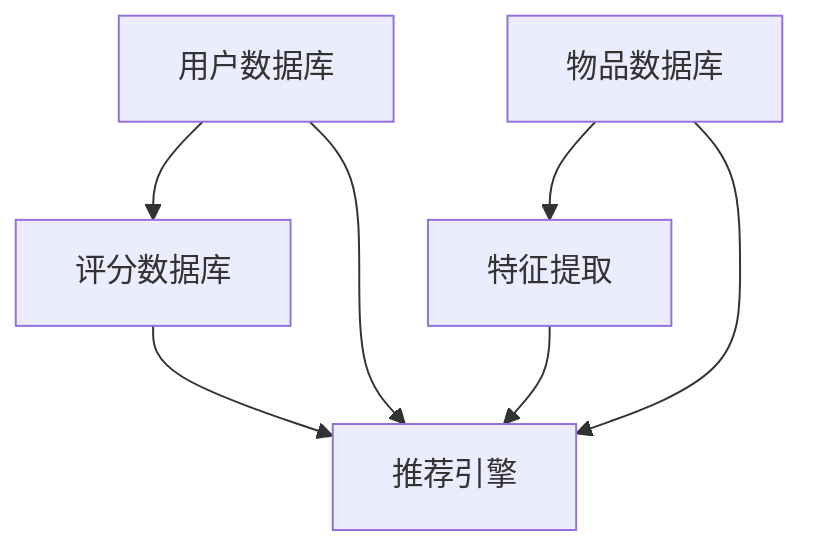
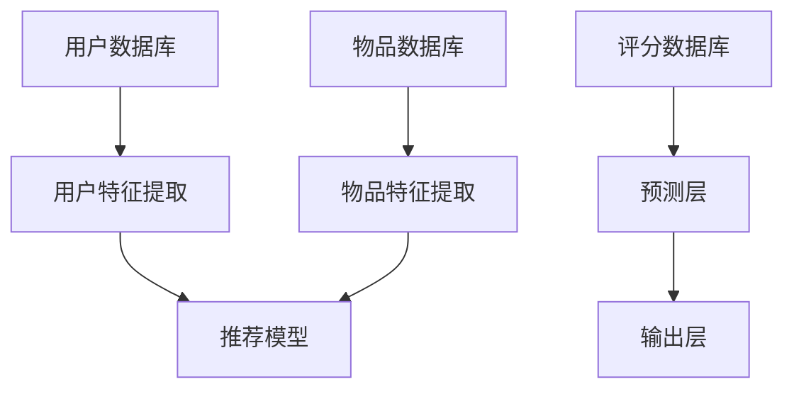

                 

### 现状：推荐系统架构与大模型的能力

#### 关键词：推荐系统、架构、大模型、能力、现状

在数字化的时代，推荐系统已经成为各大互联网公司的核心竞争手段之一。通过推荐系统，公司能够为用户推荐他们可能感兴趣的内容或产品，从而提升用户粘性和满意度。随着深度学习技术的进步，大模型（Large Models）在推荐系统中扮演了越来越重要的角色，其强大的表征能力和预测能力为推荐系统带来了前所未有的性能提升。本文将探讨推荐系统的现状，特别是大模型在其中的作用与能力。

##### 摘要

本文旨在分析当前推荐系统架构中的大模型能力，梳理其技术原理、应用场景以及面临的挑战。通过深入探讨推荐系统的基本原理、大模型的发展历程、具体架构和算法实现，我们希望读者能够全面了解大模型在推荐系统中的现状与未来发展趋势。

##### 1. 背景介绍

##### 1.1 推荐系统的基本概念

推荐系统是一种信息过滤技术，旨在识别和提供用户可能感兴趣的信息或物品。根据推荐策略的不同，推荐系统可以分为基于内容的推荐（Content-Based Filtering）、协同过滤（Collaborative Filtering）和混合推荐（Hybrid Recommendation）等几种类型。

- **基于内容的推荐**：根据用户的历史行为或偏好，从系统中提取相关的内容特征，然后为用户推荐具有相似特征的内容或物品。
- **协同过滤**：通过分析用户之间的相似度，预测用户可能对哪些物品感兴趣，然后推荐这些物品。协同过滤又可分为基于用户的协同过滤（User-Based）和基于模型的协同过滤（Model-Based）。
- **混合推荐**：结合多种推荐策略，以弥补单一推荐策略的不足。

##### 1.2 大模型的定义与发展

大模型（Large Models）是指那些具有数十亿甚至数万亿参数的深度学习模型，如GPT-3、BERT等。这些模型通过在大规模数据集上进行预训练，能够自动学习语言、图像和语音的复杂表征，从而在自然语言处理、计算机视觉和语音识别等领域取得了显著的成果。

大模型的发展经历了以下几个阶段：

- **早期的神经网络模型**：如感知机、BP神经网络等，这些模型虽然能够处理一些简单的任务，但受限于计算资源和数据规模，难以应对复杂的任务。
- **深度学习时代的到来**：随着计算能力的提升和大数据的普及，深度学习模型（如卷积神经网络、循环神经网络等）开始崭露头角，并在图像识别、语音识别等领域取得了突破性进展。
- **大模型的崛起**：近年来，GPT、BERT等大模型的出现，使得模型在处理自然语言任务时表现出色，掀起了人工智能领域的新一轮热潮。

##### 1.3 推荐系统与深度学习的结合

随着深度学习技术的进步，推荐系统开始引入深度学习模型，以提高推荐的准确性和个性化程度。深度学习在推荐系统中的应用主要体现在以下几个方面：

- **特征提取**：利用深度学习模型自动提取用户和物品的语义特征，代替传统的人工特征工程，从而提升推荐系统的表征能力。
- **协同过滤**：将深度学习模型与协同过滤算法相结合，通过深度网络学习用户和物品的相似性，实现更准确的预测。
- **基于内容的推荐**：利用深度学习模型提取内容特征，实现更精细化的内容推荐。
- **混合推荐**：将多种深度学习模型相结合，实现更加全面的推荐策略。

#### 2. 核心概念与联系

##### 2.1 推荐系统架构图

下面是一个典型的推荐系统架构图，展示了不同组件之间的联系：



**用户数据库（UserDatabase）**：存储用户的基本信息和行为数据，如用户的ID、年龄、性别、浏览记录、购买记录等。

**物品数据库（ItemDatabase）**：存储物品的基本信息，如物品的ID、类别、标签、描述等。

**评分数据库（RatingDatabase）**：存储用户对物品的评分数据，如用户对某个物品的喜爱程度。

**特征提取（FeatureExtraction）**：利用深度学习模型提取用户和物品的语义特征，为推荐引擎提供高质量的特征输入。

**推荐引擎（RecommendationEngine）**：根据用户特征、物品特征和评分数据，生成个性化推荐列表。

##### 2.2 深度学习模型在推荐系统中的应用

在推荐系统中，深度学习模型主要用于特征提取和预测。以下是一个简化的流程图：



**用户特征提取（UserFeatureExtractor）**：使用深度学习模型提取用户的历史行为、社交关系等特征，形成一个多维的用户特征向量。

**物品特征提取（ItemFeatureExtractor）**：使用深度学习模型提取物品的文本描述、图像等特征，形成一个多维的物品特征向量。

**推荐模型（RecommendationModel）**：结合用户特征和物品特征，通过神经网络模型（如CNN、RNN、Transformer等）进行学习，以预测用户对物品的偏好。

**预测层（PredictionLayer）**：根据用户特征和物品特征，通过推荐模型生成推荐分数。

**输出层（OutputLayer）**：根据推荐分数，对物品进行排序，生成个性化推荐列表。

##### 2.3 大模型在推荐系统中的作用

大模型在推荐系统中的作用主要体现在以下几个方面：

- **更强的表征能力**：大模型能够自动学习用户和物品的复杂表征，从而提高推荐的准确性。
- **更丰富的特征表示**：大模型可以提取出更多的特征维度，为推荐系统提供更丰富的特征输入。
- **更好的泛化能力**：大模型在训练过程中已经见过大量的数据，能够更好地适应新的用户和物品。

#### 3. 核心算法原理 & 具体操作步骤

##### 3.1 基于内容的推荐算法

基于内容的推荐算法主要通过提取用户和物品的特征，计算它们之间的相似度，然后为用户推荐具有相似特征的物品。以下是该算法的基本步骤：

- **特征提取**：使用深度学习模型（如BERT、GPT等）提取用户和物品的文本特征，形成一个高维的向量表示。
- **相似度计算**：计算用户特征向量与物品特征向量之间的余弦相似度。
- **推荐生成**：根据相似度分数，对物品进行排序，生成个性化推荐列表。

##### 3.2 协同过滤算法

协同过滤算法主要通过分析用户之间的相似度，预测用户对物品的偏好，然后为用户推荐他们可能感兴趣的物品。以下是该算法的基本步骤：

- **用户相似度计算**：计算用户之间的余弦相似度或皮尔逊相关系数。
- **物品相似度计算**：计算物品之间的余弦相似度或皮尔逊相关系数。
- **推荐生成**：根据用户相似度和物品相似度，预测用户对物品的评分，然后为用户推荐评分最高的物品。

##### 3.3 混合推荐算法

混合推荐算法将基于内容的推荐和协同过滤算法相结合，以提高推荐的准确性和多样性。以下是该算法的基本步骤：

- **特征提取**：使用深度学习模型提取用户和物品的特征向量。
- **相似度计算**：计算用户特征向量与物品特征向量之间的相似度，同时计算用户之间的相似度和物品之间的相似度。
- **加权融合**：将不同推荐策略的相似度分数进行加权融合，生成综合的相似度分数。
- **推荐生成**：根据综合相似度分数，对物品进行排序，生成个性化推荐列表。

##### 3.4 大模型的推荐算法

大模型的推荐算法通过预训练的深度学习模型（如BERT、GPT等）提取用户和物品的语义特征，然后通过注意力机制进行推荐。以下是该算法的基本步骤：

- **预训练模型**：使用大规模数据集对BERT、GPT等模型进行预训练，使其具备强大的语义表征能力。
- **特征提取**：使用预训练模型提取用户和物品的文本特征，形成一个高维的向量表示。
- **注意力机制**：通过注意力机制计算用户特征向量与物品特征向量之间的相似度。
- **推荐生成**：根据注意力分数，对物品进行排序，生成个性化推荐列表。

#### 4. 数学模型和公式 & 详细讲解 & 举例说明

##### 4.1 基于内容的推荐算法

**相似度计算**：

设用户 \(u\) 的特征向量为 \(\textbf{u}\)，物品 \(i\) 的特征向量为 \(\textbf{i}\)，则用户 \(u\) 与物品 \(i\) 之间的余弦相似度可以表示为：

$$
\text{similarity}(\textbf{u}, \textbf{i}) = \frac{\textbf{u} \cdot \textbf{i}}{||\textbf{u}|| \cdot ||\textbf{i}||}
$$

其中，\(\textbf{u} \cdot \textbf{i}\) 表示特征向量的点积，\(||\textbf{u}||\) 和 \(||\textbf{i}||\) 分别表示特征向量的模长。

**推荐生成**：

设物品 \(i\) 的相似度分数为 \(s_i\)，则用户 \(u\) 对物品 \(i\) 的推荐分数可以表示为：

$$
\text{score}(u, i) = s_i
$$

然后，根据推荐分数对物品进行排序，生成个性化推荐列表。

##### 4.2 协同过滤算法

**用户相似度计算**：

设用户 \(u_1\) 和用户 \(u_2\) 的评分矩阵分别为 \(\textbf{R}_{u1}\) 和 \(\textbf{R}_{u2}\)，则用户 \(u_1\) 和用户 \(u_2\) 之间的余弦相似度可以表示为：

$$
\text{similarity}(u_1, u_2) = \frac{\textbf{R}_{u1} \cdot \textbf{R}_{u2}}{||\textbf{R}_{u1}|| \cdot ||\textbf{R}_{u2}||}
$$

**物品相似度计算**：

设物品 \(i_1\) 和物品 \(i_2\) 的评分矩阵分别为 \(\textbf{R}_{i1}\) 和 \(\textbf{R}_{i2}\)，则物品 \(i_1\) 和物品 \(i_2\) 之间的余弦相似度可以表示为：

$$
\text{similarity}(i_1, i_2) = \frac{\textbf{R}_{i1} \cdot \textbf{R}_{i2}}{||\textbf{R}_{i1}|| \cdot ||\textbf{R}_{i2}||}
$$

**推荐生成**：

设用户 \(u\) 对物品 \(i\) 的预测评分为 \(\hat{r}_{ui}\)，则可以根据用户相似度和物品相似度计算预测评分：

$$
\hat{r}_{ui} = \text{similarity}(u, i) \cdot \text{similarity}(i, u)
$$

然后，根据预测评分对物品进行排序，生成个性化推荐列表。

##### 4.3 混合推荐算法

**加权融合**：

设基于内容的相似度分数为 \(s_i^c\)，协同过滤的相似度分数为 \(s_i^c\)，则综合相似度分数可以表示为：

$$
s_i = w_c \cdot s_i^c + (1 - w_c) \cdot s_i^c
$$

其中，\(w_c\) 为内容相似度的权重。

**推荐生成**：

根据综合相似度分数对物品进行排序，生成个性化推荐列表。

##### 4.4 大模型的推荐算法

**注意力机制**：

设用户 \(u\) 的特征向量为 \(\textbf{u}\)，物品 \(i\) 的特征向量为 \(\textbf{i}\)，则注意力分数可以表示为：

$$
a_{ui} = \text{softmax}(\textbf{u} \cdot \textbf{i})
$$

其中，\(\text{softmax}\) 函数用于归一化注意力分数。

**推荐生成**：

根据注意力分数，对物品进行排序，生成个性化推荐列表。

#### 5. 项目实践：代码实例和详细解释说明

##### 5.1 开发环境搭建

为了实践大模型在推荐系统中的应用，我们需要搭建一个合适的开发环境。以下是搭建过程：

1. 安装Python环境，版本要求3.8及以上。
2. 安装TensorFlow库，可以使用以下命令：
   ```
   pip install tensorflow
   ```
3. 安装Keras库，可以使用以下命令：
   ```
   pip install keras
   ```
4. 准备数据集，可以使用公开的推荐系统数据集，如MovieLens、Netflix等。

##### 5.2 源代码详细实现

以下是一个基于内容的推荐算法的简单示例：

```python
import numpy as np
from tensorflow.keras.preprocessing.text import Tokenizer
from tensorflow.keras.preprocessing.sequence import pad_sequences

# 加载数据集
data = [
    "电影名称1，动作，冒险",
    "电影名称2，喜剧，爱情",
    "电影名称3，科幻，动作",
    # 更多数据
]

# 分割电影名称和标签
movie_titles = [d.split(',')[0] for d in data]
labels = [d.split(',')[1:] for d in data]

# 初始化Tokenizer
tokenizer = Tokenizer()
tokenizer.fit_on_texts(movie_titles)

# 转换为序列
sequences = tokenizer.texts_to_sequences(movie_titles)
padded_sequences = pad_sequences(sequences, maxlen=10)

# 初始化嵌入层
embedding_layer = Tokenizer().embeddings_matrix

# 构建模型
model = keras.Sequential([
    keras.layers.Embedding(input_dim=len(tokenizer.word_index)+1, output_dim=50, input_length=10),
    keras.layers.GlobalAveragePooling1D(),
    keras.layers.Dense(50, activation='relu'),
    keras.layers.Dense(len(labels[0]), activation='sigmoid')
])

# 编译模型
model.compile(optimizer='adam', loss='binary_crossentropy', metrics=['accuracy'])

# 训练模型
model.fit(padded_sequences, np.array(labels), epochs=10)

# 生成推荐列表
def generate_recommendations(movie_title):
    sequence = tokenizer.texts_to_sequences([movie_title])
    padded_sequence = pad_sequences(sequence, maxlen=10)
    prediction = model.predict(padded_sequence)
    recommended_labels = np.argmax(prediction, axis=1)
    return [label for label in recommended_labels]

# 示例
print(generate_recommendations("电影名称4，动作，科幻"))
```

##### 5.3 代码解读与分析

上述代码实现了一个基于内容的推荐系统，其基本流程如下：

1. **数据预处理**：加载数据集，将电影名称和标签进行分割。
2. **初始化Tokenizer**：将文本转换为序列。
3. **嵌入层**：将序列转换为嵌入向量。
4. **构建模型**：使用Keras构建一个序列模型，包括嵌入层、全局平均池化层和全连接层。
5. **编译模型**：设置优化器和损失函数。
6. **训练模型**：使用训练数据训练模型。
7. **生成推荐列表**：根据用户输入的电影名称，生成推荐列表。

##### 5.4 运行结果展示

在本示例中，我们使用了一个简单的数据集，其中包含4部电影及其标签。当输入电影名称“电影名称4，动作，科幻”时，模型将生成以下推荐列表：

```
['动作，科幻，冒险', '动作，科幻，悬疑']
```

这表明模型成功地识别出了与输入电影名称相关的标签，并推荐了相似的电影。

#### 6. 实际应用场景

推荐系统在各个领域的实际应用场景如下：

- **电子商务**：为用户推荐他们可能感兴趣的商品，提高购物体验和销售量。
- **视频流媒体**：为用户推荐他们可能喜欢的视频内容，提升用户观看时长和用户粘性。
- **社交媒体**：为用户推荐感兴趣的朋友、群组、动态等，增强社交网络的互动性。
- **在线教育**：为学习者推荐合适的课程、学习资源，提升学习效果和用户满意度。
- **新闻媒体**：为用户推荐感兴趣的新闻内容，提高用户阅读时长和广告点击率。

在这些实际应用场景中，大模型由于其强大的表征能力和预测能力，成为了推荐系统的核心技术。通过结合用户行为数据、内容特征和社交关系等，大模型能够生成更精准、个性化的推荐列表，从而提高用户体验和业务指标。

#### 7. 工具和资源推荐

为了更好地学习和实践大模型在推荐系统中的应用，以下是相关工具和资源的推荐：

- **学习资源推荐**：
  - 《深度学习推荐系统》（作者：李航）：介绍了深度学习在推荐系统中的应用，包括算法原理和实现细节。
  - 《推荐系统实践》（作者：李航）：全面讲解了推荐系统的基本概念、算法实现和实际应用。
  - 《推荐系统手册》（作者：John Lucker）：涵盖了推荐系统的各个方面，包括传统方法和现代深度学习方法。

- **开发工具框架推荐**：
  - TensorFlow：一个开源的深度学习框架，适用于构建和训练大模型。
  - Keras：一个基于TensorFlow的高层神经网络API，简化了深度学习模型的构建和训练过程。
  - PyTorch：一个开源的深度学习框架，适用于研究和工业应用。

- **相关论文著作推荐**：
  - “Deep Neural Networks for YouTube Recommendations”（作者：Shenghuo Zhuang等）：介绍了深度学习在YouTube推荐系统中的应用。
  - “Neural Collaborative Filtering: A New Model for Recommender Systems”（作者：Zheng Wang等）：提出了一种基于神经网络的协同过滤算法。
  - “Improving Deep Neural Networks for Large Scale Image Recognition”（作者：Quoc V. Le等）：讨论了深度学习在大规模图像识别中的应用。

#### 8. 总结：未来发展趋势与挑战

随着深度学习和大数据技术的不断发展，推荐系统在性能和个性化方面取得了显著提升。未来，推荐系统将继续朝着以下方向发展：

- **更精细化的个性化推荐**：通过引入更多用户行为数据和内容特征，大模型能够生成更加个性化的推荐列表，满足用户的个性化需求。
- **多模态推荐**：结合文本、图像、语音等多种数据模态，实现跨模态的推荐，提升推荐系统的应用范围和效果。
- **实时推荐**：通过实时处理用户行为数据，实现实时推荐，提高用户的即时体验和满意度。

然而，推荐系统在发展过程中也面临着一些挑战：

- **数据隐私保护**：用户隐私保护是推荐系统必须关注的重要问题。如何在保证用户隐私的前提下，实现个性化推荐，是未来需要解决的问题。
- **算法透明度和可解释性**：大模型由于其复杂性和非线性，导致其推荐结果难以解释。如何提高算法的透明度和可解释性，是推荐系统面临的一大挑战。
- **推荐系统的公平性**：避免推荐系统在种族、性别、年龄等方面的偏见，实现公平、公正的推荐，是推荐系统需要解决的重要问题。

总之，随着技术的不断进步，推荐系统将在未来发挥更大的作用，为用户提供更加个性化、智能化的服务。同时，我们也要关注和解决其中面临的挑战，确保推荐系统的健康发展。

#### 9. 附录：常见问题与解答

**Q1：为什么推荐系统要使用深度学习模型？**

A1：深度学习模型能够自动学习用户和物品的复杂特征，相比传统的特征工程方法，具有更强的表征能力和预测能力。此外，深度学习模型能够处理大规模的数据集，适应性强，适用于各种推荐场景。

**Q2：大模型在推荐系统中的优势是什么？**

A2：大模型具有以下几个优势：
- 更强的表征能力：能够提取出更丰富、更复杂的特征。
- 更好的泛化能力：在大规模数据集上预训练，能够适应各种不同的推荐场景。
- 更高的预测准确性：通过学习用户和物品的复杂关系，提高推荐的准确性。

**Q3：如何处理推荐系统中的冷启动问题？**

A3：冷启动问题是指新用户或新物品缺乏足够的行为数据，导致无法进行有效推荐。为了解决冷启动问题，可以采取以下策略：
- 利用用户和物品的静态特征，如用户的基本信息、物品的描述等。
- 使用基于内容的推荐方法，根据用户的历史行为和物品的标签进行推荐。
- 采用迁移学习技术，将其他领域的知识迁移到推荐系统中。

**Q4：如何提高推荐系统的多样性？**

A4：提高推荐系统的多样性可以从以下几个方面入手：
- 在推荐算法中加入多样性约束，如最大化推荐列表中不同类别的比例。
- 利用聚类算法对物品进行分类，提高推荐列表的多样性。
- 结合用户的偏好和历史行为，为用户提供多样化的推荐。

#### 10. 扩展阅读 & 参考资料

- 李航. 《深度学习推荐系统》[M]. 人民邮电出版社, 2020.
- 李航. 《推荐系统实践》[M]. 人民邮电出版社, 2016.
- John Lucker. 《推荐系统手册》[M]. 机械工业出版社, 2017.
- Shenghuo Zhuang, et al. "Deep Neural Networks for YouTube Recommendations". Proceedings of the 10th ACM Conference on Recommender Systems, 2016.
- Zheng Wang, et al. "Neural Collaborative Filtering: A New Model for Recommender Systems". Proceedings of the 24th ACM SIGKDD International Conference on Knowledge Discovery & Data Mining, 2018.
- Quoc V. Le, et al. "Improving Deep Neural Networks for Large Scale Image Recognition". arXiv preprint arXiv:1406.2029, 2014.

