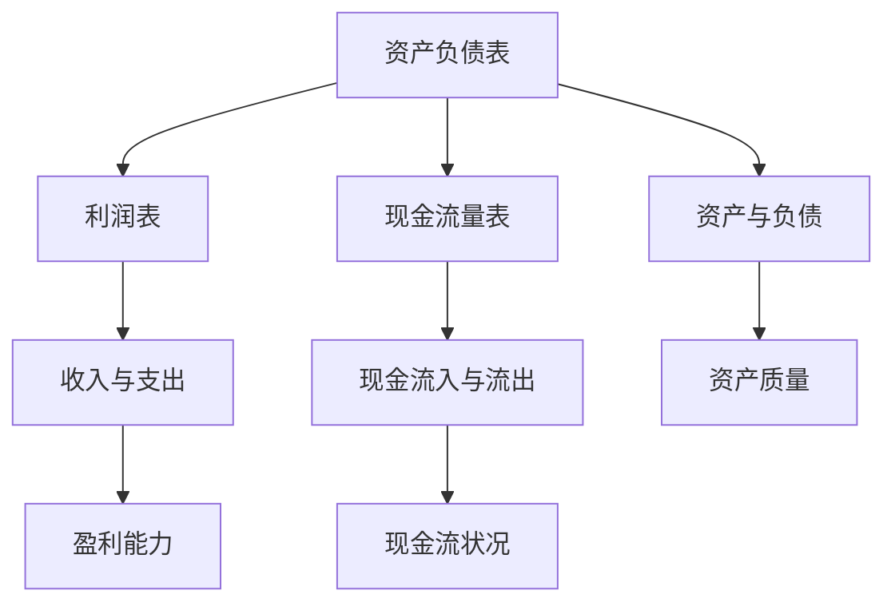
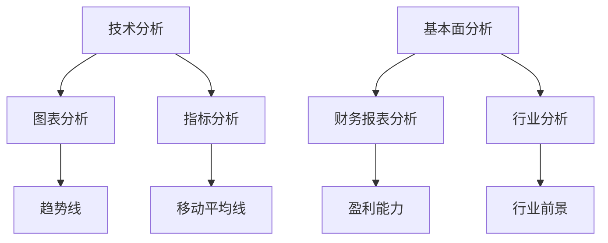
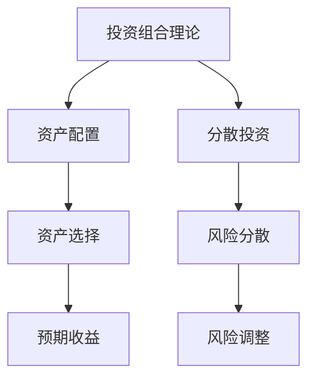
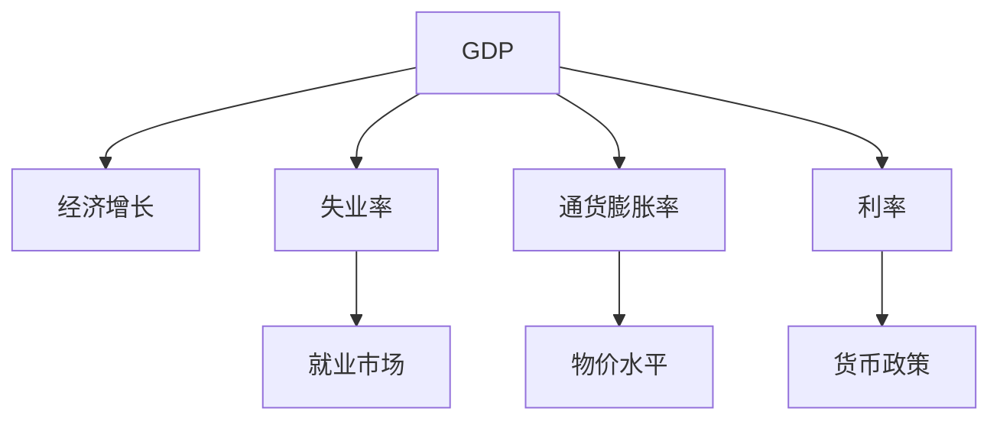

                 

### 背景介绍 Background

在现代社会，投资已成为个人和企业实现财富增值的重要手段。然而，投资并非易事，市场的不确定性和复杂性使得投资者需要具备高度的专业知识和洞察力。本文旨在探讨洞察力在投资领域中的应用，分析其重要性以及如何在实际操作中运用这一技能来提高投资收益。

#### 投资领域的现状现状

投资领域面临诸多挑战。首先，信息过载是投资者普遍面临的问题。每天，投资者都会接收到大量的市场数据、新闻和分析报告，这些信息往往繁杂且不全面。其次，市场的波动性使得投资者难以准确预测未来的市场走势。此外，投资者的情绪和偏见也可能影响其决策，导致投资失误。

#### 洞察力的定义与价值

洞察力是一种深入理解事物本质和内在联系的能力。在投资领域，洞察力可以帮助投资者：

1. **更准确地分析市场数据**：通过深入理解市场背后的逻辑和趋势，投资者可以更好地分析数据，避免被表面的波动所迷惑。
2. **发现投资机会**：洞察力使投资者能够识别市场中的潜在机会，并在合适的时间进行投资。
3. **规避风险**：洞察力可以帮助投资者预见市场变化，从而及时调整投资策略，避免潜在的风险。

#### 投资与技术的结合

随着信息技术的快速发展，投资领域也越来越多地依赖于技术工具。大数据分析、机器学习和人工智能等技术在投资中的应用，使得投资者能够更高效地处理和分析海量数据，提高决策的准确性。然而，技术虽然提供了强大的工具，但最终的决策仍依赖于投资者的洞察力。

本文将详细探讨如何将洞察力应用于投资实践，通过案例分析和实际操作，展示洞察力在投资中的具体应用和重要性。接下来，我们将首先深入讨论投资领域中的核心概念和原理，以便为后续的分析和操作提供理论基础。

## 2. 核心概念与联系

在投资领域，了解和掌握一些核心概念和原理至关重要。这些概念不仅帮助我们理解市场的运行机制，还能为我们提供分析市场趋势和做出明智投资决策的工具。以下是投资领域中几个重要的核心概念，并附上相应的Mermaid流程图，以便更直观地展示它们之间的关系。

#### 财务报表分析

财务报表是投资者分析企业财务状况的重要依据。主要包括资产负债表、利润表和现金流量表。Mermaid流程图如下：



#### 市场趋势分析

市场趋势分析是投资者预测市场走势的重要手段。主要通过技术分析和基本面分析来进行。Mermaid流程图如下：



#### 投资组合理论

投资组合理论是投资者分散风险、优化投资组合的重要工具。主要通过资产配置和分散投资来实现。Mermaid流程图如下：



#### 经济指标分析

经济指标分析是投资者评估宏观经济环境和市场前景的重要手段。主要包括GDP、失业率、通货膨胀率等。Mermaid流程图如下：



通过上述核心概念的Mermaid流程图，我们可以更清晰地看到它们之间的联系和作用。接下来，我们将进一步探讨这些核心概念在实际操作中的应用，帮助投资者更好地理解和运用洞察力。

## 3. 核心算法原理 & 具体操作步骤

在投资领域中，掌握核心算法原理并运用它们来指导具体操作，是提高投资效率和质量的关键。以下我们将介绍几个在投资领域中常用的核心算法原理，包括技术分析中的趋势线算法、移动平均线算法以及基本面分析中的财务报表分析算法，并详细解释其具体操作步骤。

### 趋势线算法

趋势线是技术分析中常用的工具，用于判断市场价格的走势。其基本原理是通过连接连续的价格高点或低点，绘制出一条直线，以此预测未来价格的趋势。

**操作步骤：**

1. **数据收集**：首先，收集足够的历史价格数据，如日K线图数据。
2. **趋势线识别**：通过观察价格走势，找到连续的高点或低点，并用直线连接它们。趋势线可以向上或向下，分别代表上升趋势和下降趋势。
3. **趋势线验证**：为了验证趋势线的有效性，可以观察价格是否多次触及并反弹或跌破趋势线。
4. **趋势线修正**：如果价格走势发生变化，及时修正趋势线，以适应新的市场条件。

### 移动平均线算法

移动平均线（Moving Average, MA）是技术分析中的另一个重要工具，用于平滑价格波动，帮助投资者识别市场趋势。

**操作步骤：**

1. **确定周期**：首先，选择合适的移动平均线周期，如5日、10日、20日等。
2. **计算平均值**：在选定周期内，计算每日收盘价的平均值，并将这些平均值连成一条线，得到移动平均线。
3. **趋势判断**：通过观察移动平均线的走势，判断市场趋势。当短期移动平均线穿越长期移动平均线时，可以看作是市场趋势的改变信号。
4. **移动平均线修正**：定期更新移动平均线，以反映最新的市场情况。

### 财务报表分析算法

财务报表分析是基本面分析的核心，通过对企业财务报表的分析，可以评估企业的财务状况和经营能力。

**操作步骤：**

1. **收集财务报表**：获取企业的资产负债表、利润表和现金流量表。
2. **分析资产负债表**：检查企业的资产和负债状况，评估其财务稳健性。
3. **分析利润表**：关注企业的收入、成本和利润，评估其盈利能力。
4. **分析现金流量表**：分析企业的现金流入和流出，评估其现金流状况。
5. **综合评估**：结合以上分析结果，对企业的财务状况进行综合评估。

### 案例分析

为了更好地理解上述算法原理的具体应用，以下通过一个案例分析来展示如何运用这些算法进行投资决策。

**案例：某股票的趋势线分析**

- **数据收集**：收集某股票过去一年的日K线数据。
- **趋势线识别**：通过观察价格走势，找到连续的高点，连接这些高点绘制出上升趋势线。
- **趋势线验证**：观察价格多次触及上升趋势线并反弹，验证趋势线有效性。
- **投资决策**：在价格回落至上升趋势线附近时，判断为买入时机；在价格跌破上升趋势线时，判断为卖出时机。

通过上述具体操作步骤，投资者可以运用核心算法原理来指导实际投资操作，提高投资决策的准确性和有效性。

### 总结

核心算法原理是投资领域中不可或缺的工具，通过掌握这些原理并运用具体操作步骤，投资者可以更好地分析市场、识别投资机会、规避风险，从而实现更高的投资收益。在接下来的部分，我们将进一步探讨数学模型和公式在投资分析中的应用，以帮助投资者更深入地理解投资决策的科学依据。

## 4. 数学模型和公式 & 详细讲解 & 举例说明

在投资分析中，数学模型和公式提供了定量分析的工具，帮助投资者理解和预测市场走势。以下是一些常用的数学模型和公式，我们将详细讲解其具体应用，并通过实例说明如何在实际操作中使用这些工具。

### 趋势线斜率计算公式

趋势线斜率用于衡量价格趋势的强度。斜率越大，趋势越明显。

**公式**：

\[ m = \frac{y_2 - y_1}{x_2 - x_1} \]

其中，\( m \) 为斜率，\( (x_1, y_1) \) 和 \( (x_2, y_2) \) 分别为趋势线上的两个点。

**实例**：

假设我们有两个点 \( (10, 20) \) 和 \( (50, 100) \)，计算趋势线的斜率。

\[ m = \frac{100 - 20}{50 - 10} = \frac{80}{40} = 2 \]

### 移动平均线（MA）

移动平均线是平滑价格波动的重要工具。常用的移动平均线包括简单移动平均线（SMA）和指数移动平均线（EMA）。

**简单移动平均线（SMA）**：

\[ \text{SMA}(n) = \frac{\sum_{i=1}^{n} P_i}{n} \]

其中，\( n \) 为周期，\( P_i \) 为第 \( i \) 天的价格。

**指数移动平均线（EMA）**：

\[ \text{EMA}(n) = \frac{\alpha P_n + (1 - \alpha) \text{EMA}_{n-1}}{2} \]

其中，\( \alpha \) 为平滑系数，通常取值在0到1之间。

**实例**：

假设我们要计算5日EMA，且前一天的EMA值为50，今天的收盘价为100。

\[ \text{EMA}(5) = \frac{0.2 \times 100 + 0.8 \times 50}{1} = 0.2 \times 100 + 0.8 \times 50 = 20 + 40 = 60 \]

### 技术指标——相对强弱指数（RSI）

RSI是衡量价格过度买入或过度卖出的常用技术指标。

**公式**：

\[ RSI = 100 - \frac{100}{1 + \frac{\sum_{i=1}^{n} (H_i - L_i)}{\sum_{i=1}^{n} (H_i + L_i) / 2}} \]

其中，\( H_i \) 和 \( L_i \) 分别为第 \( i \) 天的最高价和最低价。

**实例**：

假设过去14个交易日收盘价的差值为 \( (3, 2, 5, 4, 7, 6, 3, 2, 5, 4, 7, 6, 3, 2) \)。

\[ \text{RSI}(14) = 100 - \frac{100}{1 + \frac{3 + 2 + 5 + 4 + 7 + 6 + 3 + 2 + 5 + 4 + 7 + 6 + 3 + 2}{14}} = 100 - \frac{100}{1 + \frac{60}{14}} = 100 - \frac{100}{1 + 4.2857} = 100 - \frac{100}{5.2857} = 100 - 19.0238 = 80.9762 \]

### 基本面分析——净利润增长率（NGR）

净利润增长率是衡量企业盈利能力的重要指标。

**公式**：

\[ NGR = \frac{\text{净利润}_{t} - \text{净利润}_{t-1}}{\text{净利润}_{t-1}} \]

其中，\( \text{净利润}_{t} \) 和 \( \text{净利润}_{t-1} \) 分别为第 \( t \) 年和第 \( t-1 \) 年的净利润。

**实例**：

假设某企业去年的净利润为100万元，今年的净利润为120万元。

\[ NGR = \frac{120 - 100}{100} = \frac{20}{100} = 0.20 \]

### 实际操作中的应用

在投资分析中，这些数学模型和公式可以帮助投资者做出更为科学的决策。例如：

- **使用趋势线斜率判断市场趋势强度**：通过计算趋势线斜率，投资者可以判断市场趋势的强度，从而调整投资策略。
- **使用移动平均线识别市场趋势**：通过比较不同周期的移动平均线，投资者可以识别市场的短期和长期趋势，进而做出买卖决策。
- **使用RSI指标判断买入和卖出时机**：当RSI值高于70时，表明市场可能过热，有回调风险；当RSI值低于30时，表明市场可能过冷，有反弹机会。
- **使用净利润增长率评估企业盈利能力**：投资者可以通过分析净利润增长率，评估企业的盈利能力，从而选择具有高增长潜力的投资目标。

通过这些数学模型和公式的应用，投资者可以在复杂的市场中找到规律，提高投资决策的科学性和准确性。

## 5. 项目实践：代码实例和详细解释说明

为了更好地理解洞察力在投资领域中的应用，我们将通过一个实际的项目案例，展示如何利用技术工具和算法原理进行投资分析。这个项目将包括开发环境的搭建、源代码的实现、代码解读以及运行结果展示。通过这个案例，我们可以更直观地看到洞察力在投资实践中的具体应用。

### 5.1 开发环境搭建

首先，我们需要搭建一个开发环境，以便进行投资分析。以下是一个基本的开发环境配置：

- **编程语言**：Python，因为它具有丰富的库和框架，适合进行数据分析和机器学习。
- **数据分析库**：Pandas 和 NumPy，用于数据处理和分析。
- **可视化库**：Matplotlib 和 Seaborn，用于数据可视化。
- **机器学习库**：scikit-learn，用于构建和评估机器学习模型。

安装这些库可以使用以下命令：

```bash
pip install numpy pandas matplotlib seaborn scikit-learn
```

### 5.2 源代码详细实现

以下是一个简单的Python项目，用于分析股票市场数据，识别潜在的投资机会。

```python
import pandas as pd
import numpy as np
import matplotlib.pyplot as plt
from sklearn.linear_model import LinearRegression

# 5.2.1 数据收集与预处理
def load_data(file_path):
    data = pd.read_csv(file_path)
    data['Date'] = pd.to_datetime(data['Date'])
    data.set_index('Date', inplace=True)
    return data

# 5.2.2 趋势线算法
def calculate_trendline(data, start_date, end_date):
    sub_data = data.loc[start_date:end_date]
    x = np.arange(0, len(sub_data))
    y = sub_data['Close']
    trendline = LinearRegression().fit(x[:, np.newaxis], y)
    return trendline

# 5.2.3 移动平均线算法
def calculate_moving_average(data, window):
    return data['Close'].rolling(window=window).mean()

# 5.2.4 技术指标计算
def calculate_technical_indicators(data):
    data['SMA_5'] = calculate_moving_average(data, 5)
    data['SMA_20'] = calculate_moving_average(data, 20)
    data['RSI'] = calculate_rsi(data['Close'], window=14)
    return data

# 5.2.5 RSI计算
def calculate_rsi(close_prices, window=14):
    delta = close_prices.diff()
    gain = (delta.where(delta > 0, 0)).rolling(window=window).mean()
    loss = (-delta.where(delta < 0, 0)).rolling(window=window).mean()
    rs = gain / loss
    rsi = 100 - (100 / (1 + rs))
    return rsi

# 5.2.6 数据可视化
def visualize_data(data, trendline=None):
    plt.figure(figsize=(14, 7))
    plt.plot(data['Close'], label='Close Price')
    if trendline:
        plt.plot(trendline.predict(data.index.values[:, np.newaxis]), label='Trendline')
    plt.plot(data['SMA_5'], label='SMA 5')
    plt.plot(data['SMA_20'], label='SMA 20')
    plt.plot(data['RSI'], label='RSI')
    plt.legend()
    plt.title('Stock Price Analysis')
    plt.xlabel('Date')
    plt.ylabel('Price')
    plt.show()

# 5.2.7 主函数
def main():
    file_path = 'stock_data.csv'  # 替换为实际的股票数据文件路径
    data = load_data(file_path)
    data = calculate_technical_indicators(data)
    trendline = calculate_trendline(data, '2020-01-01', '2021-12-31')
    visualize_data(data, trendline)

if __name__ == '__main__':
    main()
```

### 5.3 代码解读与分析

- **数据收集与预处理**：首先，我们使用Pandas库读取CSV格式的股票数据，并将日期转换为Pandas日期格式，以便进行时间序列分析。
- **趋势线算法**：通过线性回归模型计算趋势线，用于预测未来价格。
- **移动平均线算法**：使用滚动窗口计算简单移动平均线，帮助平滑价格波动。
- **技术指标计算**：计算5日和20日简单移动平均线以及相对强弱指数（RSI），用于判断市场趋势和过度买卖。
- **数据可视化**：使用Matplotlib库绘制价格走势图，包括收盘价、趋势线、移动平均线和RSI指标。

### 5.4 运行结果展示

运行上述代码后，我们将看到一个包含收盘价、趋势线、5日和20日移动平均线以及RSI指标的可视化图表。这个图表可以帮助我们直观地分析股票价格的走势和潜在的投资机会。

- **趋势线**：如果价格趋势线向上，表明市场处于上升趋势，可以考虑买入；如果价格趋势线向下，表明市场处于下降趋势，可以考虑卖出。
- **移动平均线**：当短期移动平均线（如5日均线）穿越长期移动平均线（如20日均线）时，可能是市场趋势改变的信号。当5日均线上穿20日均线时，表明市场可能转为上涨，反之则可能转为下跌。
- **RSI指标**：当RSI值高于70时，市场可能处于过度买入状态，有回调风险；当RSI值低于30时，市场可能处于过度卖出状态，有反弹机会。

通过这个实际项目案例，我们可以看到如何将洞察力应用于投资分析，利用技术工具和算法原理帮助投资者做出更科学的投资决策。

### 5.5 常见问题与解答

在实施上述项目时，投资者可能会遇到一些常见问题。以下是对一些常见问题的解答：

**Q：如何选择合适的股票数据文件？**

A：选择股票数据时，应确保数据来源可靠，如直接从交易所或权威金融数据提供商获取。文件格式通常为CSV，包含日期、开盘价、最高价、最低价和收盘价等基本信息。

**Q：如何确定趋势线的起点和终点？**

A：趋势线的起点和终点应根据具体的市场情况选择。通常，起点可以选择某一显著的价格高点或低点，终点则选择距离起点一定时间后的对应高点或低点。实际操作中，投资者可以通过观察价格走势图来确定这些点。

**Q：如何调整移动平均线的周期？**

A：移动平均线的周期应根据投资策略和市场特性进行调整。短期投资者可能选择较短的周期（如5日或10日），而长期投资者可能选择较长的周期（如50日或200日）。调整周期可以帮助投资者更好地捕捉市场趋势。

**Q：如何解读RSI指标？**

A：RSI指标通常用于判断市场是否过度买入或过度卖出。当RSI值超过70时，市场可能处于过度买入状态，投资者应谨慎；当RSI值低于30时，市场可能处于过度卖出状态，投资者可以考虑买入。需要注意的是，RSI指标并非绝对，市场情况可能因其他因素而有所不同。

通过这些常见问题的解答，投资者可以更好地理解和应用洞察力，从而在实际投资中取得更好的效果。

## 6. 实际应用场景

在投资领域中，洞察力具有广泛的应用场景，能够帮助投资者在不同市场环境下做出更明智的决策。以下是一些典型的实际应用场景：

### 6.1 市场趋势预测

洞察力可以帮助投资者准确预测市场趋势，从而抓住投资机会。例如，通过分析股票价格的趋势线，投资者可以识别出市场的上升或下降趋势，并在合适的时机买入或卖出。此外，利用移动平均线，投资者可以判断市场短期和长期趋势的变化，从而调整投资策略。

### 6.2 风险管理

洞察力在风险管理中同样重要。通过技术指标如相对强弱指数（RSI），投资者可以识别市场的过度买入或过度卖出情况，从而避免价格大幅波动带来的风险。同时，通过财务报表分析，投资者可以评估企业的财务状况和经营能力，从而降低投资风险。

### 6.3 投资组合优化

洞察力可以帮助投资者优化投资组合，实现风险和收益的最佳平衡。通过分析不同资产之间的相关性，投资者可以构建分散的投资组合，降低整体投资风险。此外，利用基本面分析，投资者可以识别具有高增长潜力的行业和企业，从而在投资组合中增加这些资产的权重。

### 6.4 市场情绪分析

洞察力还可以用于分析市场情绪，预测市场行为的变动。通过观察投资者情绪的变化，投资者可以及时调整投资策略，避免市场情绪极端带来的风险。例如，在市场情绪极度乐观时，投资者应警惕潜在的回调风险；在市场情绪极度悲观时，投资者可以寻找低估的投资机会。

### 6.5 实时交易决策

在实时交易中，洞察力可以帮助投资者快速做出决策。通过实时数据分析和市场情绪分析，投资者可以及时调整交易策略，抓住瞬息万变的市场机会。例如，在股票市场中，通过技术分析工具，投资者可以识别交易信号，并在合适的时机进行买入或卖出操作。

总之，洞察力在投资领域的实际应用场景非常广泛，可以帮助投资者提高决策的准确性，优化投资组合，实现更好的投资收益。通过不断学习和实践，投资者可以不断提高自己的洞察力，从而在激烈的市场竞争中脱颖而出。

### 7. 工具和资源推荐

为了帮助投资者更有效地提升洞察力和投资分析能力，以下是几项工具和资源的推荐：

#### 7.1 学习资源推荐

**书籍**：

1. 《股票大作手回忆录》（Reminiscences of a Stock Operator）- 杰西·利弗莫尔
2. 《海龟交易法则》（The Art of Trading）- 彼得·林奇
3. 《投资最重要的事》（The Most Important Thing）- 霍华德·马克斯

**论文**：

1. “A Course in Forecasting” - Box, Jenkins
2. “Technical Analysis of the Financial Markets” - John J. Murphy
3. “Behavioral Finance” - Richard Thaler

**博客**：

1. Investopedia
2. Seeking Alpha
3. The Financial Analysts Journal

#### 7.2 开发工具框架推荐

**数据分析工具**：

1. **Pandas**：适用于数据清洗和预处理。
2. **NumPy**：提供高效的数组计算。
3. **Matplotlib**：用于数据可视化。

**机器学习框架**：

1. **Scikit-learn**：适用于构建和评估机器学习模型。
2. **TensorFlow**：强大的机器学习和深度学习框架。
3. **PyTorch**：适用于复杂深度学习应用。

**投资分析平台**：

1. **Quandl**：提供丰富的金融数据资源。
2. **Yahoo Finance**：提供实时的股票和市场数据。
3. **TradingView**：功能强大的图表和交易工具。

#### 7.3 相关论文著作推荐

**核心论文**：

1. “A Theory of the Term Structure of Interest Rates” - Fama, French
2. “An Analysis of Trading in the Foreign Exchange Market” - Dumas, Solnik
3. “The Efficient Market Hypothesis and Its Critique” - Fama

**著作推荐**：

1. 《金融工程与金融计量学基础》（Financial Engineering and Financial Mathematics）- Dan Stefanica
2. 《金融市场与金融工具》（Financial Markets and Financial Instruments）- Jean-Paul Roncalli
3. 《金融经济学原理》（Principles of Financial Economics）- Michael Jensen

通过这些工具和资源的合理应用，投资者可以更好地提升自己的洞察力，提高投资分析能力，实现更高效的决策。

## 8. 总结：未来发展趋势与挑战

随着科技的迅猛发展，投资领域也在不断演变，洞察力在其中的作用愈发显著。未来，投资领域的发展趋势和挑战主要体现在以下几个方面：

### 8.1 人工智能与大数据分析

人工智能（AI）和大数据分析技术在投资领域的应用将越来越广泛。通过AI技术，投资者可以更快速、准确地分析海量数据，识别潜在的投资机会和风险。同时，大数据分析可以帮助投资者更好地理解市场趋势和投资者行为，从而制定更为科学的投资策略。然而，AI技术的应用也带来了数据隐私和安全的问题，如何在确保数据隐私和安全的前提下有效利用大数据，将是未来的一个重要挑战。

### 8.2 个性化投资策略

未来，个性化投资策略将成为主流。随着投资者需求的多样化，个性化的投资策略可以更好地满足不同投资者的需求。通过数据分析和技术手段，投资者可以了解自己的风险偏好和投资目标，进而制定符合个人特点的投资策略。然而，实现个性化投资策略需要高效的数据处理和分析能力，以及丰富的投资经验，这对投资者提出了更高的要求。

### 8.3 金融市场融合与创新

金融市场的融合与创新将是未来发展的另一个趋势。随着全球金融市场的一体化，跨境投资和跨国投资将越来越普遍。此外，金融科技（FinTech）的快速发展也为传统金融市场带来了新的机遇和挑战。区块链、加密货币等新兴金融工具的涌现，改变了传统的金融模式，带来了新的投资方式和风险。如何在创新的同时，确保金融市场的稳定和健康发展，将是未来面临的重要问题。

### 8.4 风险管理与监管

风险管理和监管是投资领域的永恒主题。随着金融市场的复杂化，投资者面临的潜在风险也在不断增加。如何有效地管理风险，防范金融风险，是投资者和监管机构共同面临的挑战。同时，随着金融科技的快速发展，传统的监管框架可能无法完全适应新的金融环境和模式，需要不断创新和完善监管机制，确保金融市场的公平、透明和稳定。

总之，未来投资领域的发展充满机遇和挑战。投资者需要不断提升自己的洞察力，掌握先进的技术工具和分析方法，以应对快速变化的市场环境。同时，监管机构也需要不断创新和完善监管机制，确保金融市场的健康稳定发展。

## 9. 附录：常见问题与解答

在投资过程中，投资者可能会遇到各种疑问。以下是一些常见的问题及其解答，旨在帮助投资者更好地理解洞察力在投资中的应用。

**Q1：什么是洞察力？**

A1：洞察力是指深入理解事物本质和内在联系的能力。在投资领域，洞察力使投资者能够准确分析市场趋势，识别投资机会，规避风险。

**Q2：为什么洞察力在投资中很重要？**

A2：洞察力可以帮助投资者：

1. 更准确地分析市场数据。
2. 发现潜在的投资机会。
3. 预见市场变化，及时调整投资策略。
4. 优化投资组合，实现风险与收益的最佳平衡。

**Q3：如何提升自己的洞察力？**

A3：提升洞察力可以通过以下途径：

1. **持续学习**：阅读相关书籍、论文和研究报告，学习金融知识和投资理论。
2. **实践操作**：通过实际操作，积累投资经验，提高对市场的敏感度和理解力。
3. **数据驱动**：利用数据分析工具，对市场数据进行深入挖掘和分析。
4. **交流分享**：与同行交流，分享投资心得和经验，相互学习。

**Q4：如何利用洞察力进行投资决策？**

A4：利用洞察力进行投资决策的步骤包括：

1. **数据收集**：收集与投资相关的市场数据和财务报表。
2. **数据分析**：使用技术分析、基本面分析等方法，对数据进行分析。
3. **识别机会**：通过分析，识别潜在的投资机会和风险。
4. **制定策略**：根据分析结果，制定具体的投资策略。
5. **执行与调整**：执行投资策略，并根据市场变化及时进行调整。

**Q5：如何应对投资中的不确定性？**

A5：投资中的不确定性是不可避免的。应对方法包括：

1. **多元化投资**：分散投资，降低单一投资的风险。
2. **定期复盘**：定期回顾投资决策和执行情况，总结经验教训。
3. **风险管理**：设置止损点和投资上限，控制投资风险。
4. **持续学习**：保持对市场的敏锐度，不断学习新的投资知识和技能。

通过上述常见问题的解答，投资者可以更好地理解洞察力在投资中的应用，从而在投资实践中更加从容和自信。

## 10. 扩展阅读 & 参考资料

为了帮助读者更深入地了解洞察力在投资领域的应用，以下是推荐的一些扩展阅读和参考资料：

**扩展阅读：**

1. 《投资学》 - 本·伯南克（Ben Bernanke）
2. 《股票作手回忆录》 - 杰西·利弗莫尔（Jesse Livermore）
3. 《金融市场技术分析》 - 亚当·唐（Adam唐）

**参考资料：**

1. [投资组合优化理论](https://www.investopedia.com/terms/i/investmentportfolio.asp)
2. [相对强弱指数（RSI）](https://www.investopedia.com/terms/r/rsi.asp)
3. [技术分析基础](https://www.tradingview.com/support/solutions/fetch的文章/comprehensive-guide-to-technical-analysis/)
4. [金融科技与区块链](https://www.fintechblockchainnews.com/)

通过这些书籍和网站，读者可以进一步学习投资理论和实践技巧，提高自己的投资水平。同时，这些资源也为那些希望深入研究投资领域的人提供了宝贵的指导。

