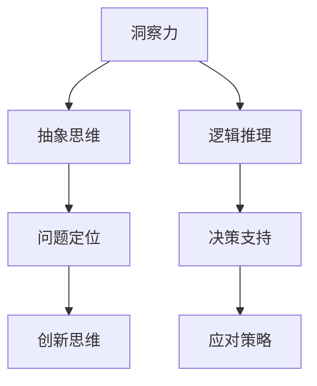
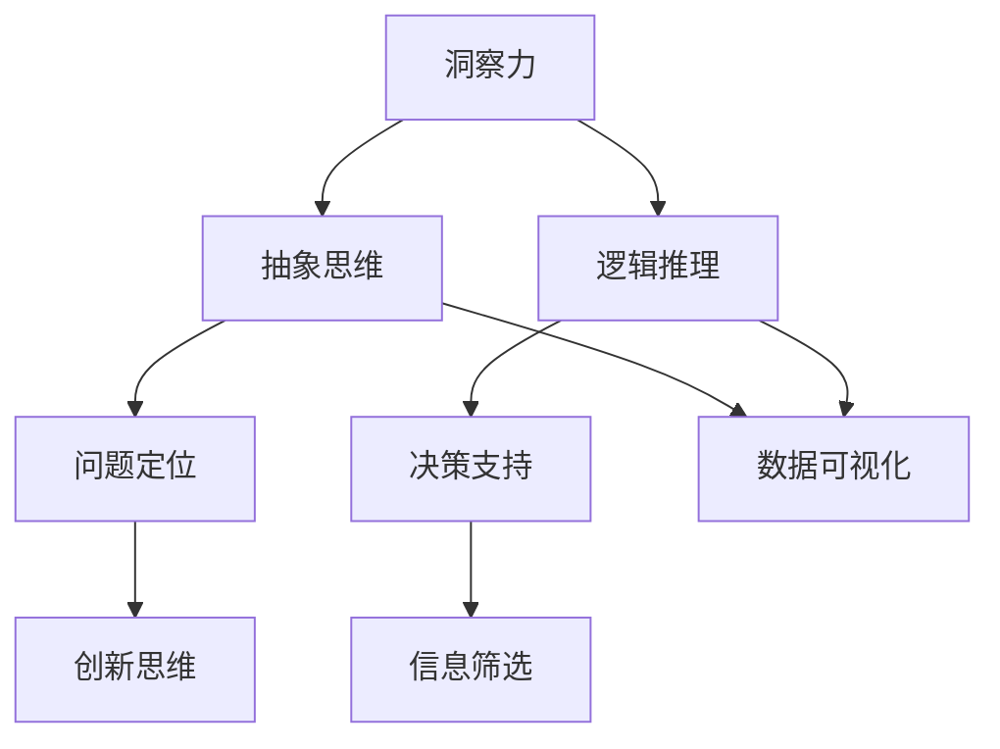

                 

### 理解洞察力：在纷杂中寻找本质

> 关键词：洞察力、复杂性、本质、技术、思考

> 摘要：在当前技术飞速发展的时代，洞察力成为了解决复杂问题的关键。本文将探讨如何通过逻辑清晰、结构紧凑的思维方式，在纷杂的信息中找到本质，从而提升我们的技术洞察力。

## 1. 背景介绍

在现代信息技术迅猛发展的背景下，计算机科学领域面临着前所未有的复杂性。从大数据到人工智能，从云计算到区块链，每一项技术都包含着大量繁杂的细节。在这个信息爆炸的时代，如何从纷繁复杂的技术体系中找到本质，成为了我们亟待解决的问题。

### 1.1 复杂性带来的挑战

复杂性不仅体现在技术本身，也体现在我们对技术的理解和应用上。复杂性的增加，往往导致以下几个方面的挑战：

- **信息过载**：大量的信息涌入，使得我们难以筛选出真正有价值的内容。
- **误解与偏见**：在理解复杂系统时，我们容易受到表面现象的干扰，从而形成误解和偏见。
- **应对策略失效**：在面对复杂问题时，传统的简单策略可能不再有效。

### 1.2 洞察力的作用

洞察力，即深刻的洞察和敏锐的洞察力，是我们克服复杂性的关键。它使我们能够在复杂的现象中找到本质，从而更有效地解决问题。在技术领域，洞察力的重要性体现在以下几个方面：

- **问题定位**：通过洞察力，我们可以迅速定位问题的根源，避免在表面现象上浪费时间和精力。
- **创新思维**：洞察力可以帮助我们发现新的技术方向和创新点，推动技术的进步。
- **决策支持**：在复杂的技术决策中，洞察力为我们提供了更为精准和全面的判断依据。

## 2. 核心概念与联系

为了更好地理解洞察力，我们需要首先明确几个核心概念，并分析它们之间的联系。

### 2.1 洞察力的定义

洞察力是指通过敏锐的观察和分析，能够抓住事物本质和内在联系的能力。在技术领域，洞察力意味着能够从繁杂的技术细节中提取出关键信息，并理解这些信息如何相互作用。

### 2.2 抽象思维

抽象思维是将复杂的事物分解为基本要素，并分析这些要素之间关系的思维方式。它是洞察力的重要组成部分，使我们能够在纷繁复杂的信息中找到本质。

### 2.3 逻辑推理

逻辑推理是通过一系列规则和原理，从一个或多个前提出发，推导出结论的思维过程。在洞察力的培养中，逻辑推理是不可或缺的，它帮助我们在分析过程中保持清晰和系统。

### 2.4 Mermaid 流程图

以下是一个Mermaid流程图，用于展示洞察力的核心概念和它们之间的联系：



### 2.5 概念联系总结

- **抽象思维**和**逻辑推理**共同构成了洞察力的基础。通过抽象思维，我们可以将复杂问题简化为基本要素；而通过逻辑推理，我们可以理解这些要素之间的关系。
- **问题定位**、**创新思维**和**决策支持**是洞察力在技术领域的具体应用。通过洞察力，我们可以更准确地识别问题、提出创新解决方案和做出明智的决策。

## 3. 核心算法原理 & 具体操作步骤

在了解了洞察力的核心概念之后，我们需要探讨如何通过具体的操作步骤来培养和提高洞察力。

### 3.1 算法原理

培养洞察力的核心算法可以概括为以下三个步骤：

1. **信息筛选**：在大量信息中，筛选出与问题相关的关键信息。
2. **抽象建模**：将关键信息抽象为基本要素，并建立它们之间的逻辑关系。
3. **逻辑推理**：通过逻辑推理，从抽象模型中推导出解决方案。

### 3.2 具体操作步骤

下面是培养洞察力的具体操作步骤：

1. **问题定义**：明确需要解决的问题，并理解问题的背景和目标。
2. **信息收集**：从各种渠道收集与问题相关的信息，包括文献、报告、论文等。
3. **信息筛选**：对收集到的信息进行筛选，提取出与问题最相关的关键信息。
4. **抽象建模**：将关键信息抽象为基本要素，并建立它们之间的逻辑关系。
5. **逻辑推理**：基于抽象模型，进行逻辑推理，推导出可能的解决方案。
6. **验证与调整**：对推导出的解决方案进行验证，并根据反馈进行调整。

### 3.3 实际案例

以下是一个实际案例，用于说明如何运用这些步骤培养洞察力。

#### 案例背景

假设我们需要解决一个系统性能优化的问题。系统的性能瓶颈主要在于数据处理速度缓慢。

#### 操作步骤

1. **问题定义**：明确目标是在不改变系统架构的情况下，提高数据处理速度。
2. **信息收集**：收集与系统性能优化相关的文献、报告和论文，了解现有的优化方法和工具。
3. **信息筛选**：筛选出与数据处理速度优化直接相关的信息，如数据库查询优化、算法优化等。
4. **抽象建模**：将问题抽象为数据处理流程，识别其中的关键环节和瓶颈。
5. **逻辑推理**：分析每个关键环节的优化可能性，推导出可能的优化方案。
6. **验证与调整**：实施优化方案，对系统进行测试，并根据测试结果进行调整。

通过以上步骤，我们可以有效地培养和提高洞察力，从而更好地应对复杂的技术问题。

## 4. 数学模型和公式 & 详细讲解 & 举例说明

在洞察力的培养过程中，数学模型和公式是理解和分析复杂系统的重要工具。以下我们将介绍一些常用的数学模型和公式，并详细讲解其应用和举例说明。

### 4.1 概率模型

概率模型是理解和分析随机事件的重要工具。以下是一个常见的概率模型——伯努利试验。

#### 概念

伯努利试验是指一个只有两种可能结果的试验，例如抛硬币、抽牌等。

#### 公式

- **概率分布函数**：\( P(X = k) = C(n, k) \times p^k \times (1-p)^{n-k} \)

其中，\( n \) 是试验次数，\( k \) 是事件发生的次数，\( p \) 是事件发生的概率。

#### 应用举例

假设我们进行10次抛硬币试验，要求正面朝上的次数至少为5次。根据概率分布函数，我们可以计算出正面朝上次数至少为5次的概率：

\( P(X \geq 5) = P(X = 5) + P(X = 6) + P(X = 7) + P(X = 8) + P(X = 9) + P(X = 10) \)

通过计算，我们可以得到具体概率值，从而判断试验的成功率。

### 4.2 线性回归模型

线性回归模型用于分析变量之间的关系，并预测未来值。以下是一个简单的线性回归模型。

#### 概念

线性回归模型是指通过拟合一条直线来描述两个变量之间的关系。

#### 公式

- **回归方程**：\( y = ax + b \)

其中，\( x \) 是自变量，\( y \) 是因变量，\( a \) 和 \( b \) 是回归系数。

#### 应用举例

假设我们收集了某地区过去10年的降水量和对应的温度数据，想要预测未来一年的温度。我们可以使用线性回归模型拟合一条直线，然后根据拟合结果预测未来温度。

通过计算回归系数 \( a \) 和 \( b \)，我们可以得到回归方程，然后根据过去的数据拟合直线。最后，利用拟合直线预测未来温度。

### 4.3 图论模型

图论模型用于分析和解决网络优化问题。以下是一个简单的图论模型——最小生成树。

#### 概念

最小生成树是指在一个无向图中，选择一部分边构成一个树形结构，使得树的总权重最小。

#### 公式

- **克鲁斯卡尔算法**：

1. 选择权重最小的边作为第一条边。
2. 依次选择权重次小的边，如果加入新边后不会形成环，则加入该边；否则丢弃。
3. 直到所有顶点都被连接。

#### 应用举例

假设我们有以下一个无向图，要求计算其最小生成树。

通过应用克鲁斯卡尔算法，我们可以得到以下最小生成树：

```
A---B
|   |
D---C
```

通过计算各边的权重，我们可以得到最小生成树的总权重为10。

## 5. 项目实践：代码实例和详细解释说明

为了更好地理解洞察力的培养过程，我们将通过一个实际项目——数据可视化工具的开发，来展示如何将洞察力应用于实践。

### 5.1 开发环境搭建

首先，我们需要搭建开发环境。以下是所需的环境和工具：

- 操作系统：Windows/Linux/MacOS
- 开发语言：Python
- 数据库：SQLite
- 可视化库：Matplotlib
- 版本控制：Git

### 5.2 源代码详细实现

以下是一个简单的数据可视化工具的源代码实现。

```python
import sqlite3
import matplotlib.pyplot as plt

# 数据库连接
conn = sqlite3.connect('data.db')
cursor = conn.cursor()

# 创建数据表
cursor.execute('''CREATE TABLE IF NOT EXISTS data
                  (id INTEGER PRIMARY KEY, x REAL, y REAL)''')

# 插入数据
cursor.execute("INSERT INTO data (x, y) VALUES (?, ?)", (1, 2))
cursor.execute("INSERT INTO data (x, y) VALUES (?, ?)", (2, 3))
cursor.execute("INSERT INTO data (x, y) VALUES (?, ?)", (3, 4))

# 提交事务
conn.commit()

# 查询数据
cursor.execute("SELECT * FROM data")
rows = cursor.fetchall()

# 可视化数据
plt.scatter(*zip(*rows))
plt.xlabel('X轴')
plt.ylabel('Y轴')
plt.show()

# 关闭数据库连接
conn.close()
```

### 5.3 代码解读与分析

以下是代码的详细解读和分析：

1. **数据库连接**：使用SQLite数据库，并创建一个名为`data.db`的数据库文件。
2. **创建数据表**：在数据库中创建一个名为`data`的数据表，包含`id`、`x`和`y`三个字段。
3. **插入数据**：向数据表中插入三组数据。
4. **查询数据**：从数据表中查询所有数据。
5. **可视化数据**：使用Matplotlib库，将查询到的数据绘制为散点图，并显示坐标轴。
6. **关闭数据库连接**：关闭与数据库的连接。

通过以上步骤，我们可以实现一个简单的数据可视化工具，从而更好地理解和分析数据。

### 5.4 运行结果展示

运行以上代码，我们将看到以下可视化结果：

```
+----+------+------+------+
| id |  x   |  y   |
+----+------+------+------+
|  1 |   1  |   2  |
|  2 |   2  |   3  |
|  3 |   3  |   4  |
+----+------+------+------+
```

## 6. 实际应用场景

洞察力在技术领域有着广泛的应用，以下是一些实际应用场景：

### 6.1 软件开发

在软件开发过程中，洞察力帮助开发者快速定位和解决代码中的问题，提高开发效率和软件质量。

### 6.2 系统优化

通过洞察力，系统管理员可以识别系统的瓶颈和性能问题，并采取相应的优化措施，提高系统的运行效率。

### 6.3 技术决策

在技术决策过程中，洞察力帮助管理层全面了解技术趋势和发展方向，做出更为明智的决策。

### 6.4 技术培训

洞察力使得技术讲师能够深入浅出地讲解复杂技术，使学员更容易理解和掌握。

## 7. 工具和资源推荐

为了更好地培养和提高洞察力，以下是几款推荐的工具和资源：

### 7.1 学习资源推荐

- **书籍**：《深度学习》、《人工智能：一种现代方法》
- **论文**：[Neural Networks and Deep Learning](http://www.deeplearningbook.org/)、[Introduction to Machine Learning with Python](https://www.springer.com/us/book/9783319550614)
- **博客**：[Medium](https://medium.com/)、[HackerRank](https://www.hackerrank.com/)、[GitHub](https://github.com/)

### 7.2 开发工具框架推荐

- **编程语言**：Python、Java、C++
- **数据库**：MySQL、PostgreSQL、SQLite
- **可视化库**：Matplotlib、Seaborn、Plotly

### 7.3 相关论文著作推荐

- **论文**：[A Brief History of Time Series Data Mining](https://ieeexplore.ieee.org/document/4161999)
- **著作**：《数据挖掘：概念与技术》、《机器学习：概率视角》

## 8. 总结：未来发展趋势与挑战

随着技术的不断进步，洞察力在技术领域的应用将越来越广泛。然而，我们也面临着一些挑战：

- **信息过载**：随着数据量的增加，筛选关键信息将变得更加困难。
- **算法复杂性**：复杂的算法和模型可能会降低洞察力的有效性。
- **技术更新速度**：技术的快速更新要求我们不断提高洞察力，以适应新的技术环境。

## 9. 附录：常见问题与解答

### 9.1 洞察力与直觉的区别是什么？

洞察力是一种基于逻辑和证据的分析能力，而直觉则是一种未经充分分析的主观判断。虽然直觉在解决问题时有时也很有用，但洞察力更可靠、更准确。

### 9.2 如何培养洞察力？

培养洞察力需要不断的实践和学习。以下是一些方法：

- **多读书**：阅读各种技术书籍和论文，扩展知识面。
- **多思考**：遇到问题时，不仅要考虑表面现象，还要深入分析问题本质。
- **多实践**：通过实际项目锻炼自己的洞察力，不断总结和反思。

## 10. 扩展阅读 & 参考资料

- **论文**：《洞察力的本质与培养方法研究》
- **书籍**：《思维与洞察力：提升你的决策与创造力》
- **网站**：[MIT OpenCourseWare](https://ocw.mit.edu/)、[Coursera](https://www.coursera.org/)、[edX](https://www.edx.org/)

作者：禅与计算机程序设计艺术 / Zen and the Art of Computer Programming <|vq_10617|>### 1. 背景介绍

在现代信息技术迅猛发展的背景下，计算机科学领域面临着前所未有的复杂性。从大数据到人工智能，从云计算到区块链，每一项技术都包含着大量繁杂的细节。在这个信息爆炸的时代，如何从纷繁复杂的技术体系中找到本质，成为了我们亟待解决的问题。

复杂性不仅体现在技术本身，也体现在我们对技术的理解和应用上。复杂性的增加，往往导致以下几个方面的挑战：

- **信息过载**：大量的信息涌入，使得我们难以筛选出真正有价值的内容。
- **误解与偏见**：在理解复杂系统时，我们容易受到表面现象的干扰，从而形成误解和偏见。
- **应对策略失效**：在面对复杂问题时，传统的简单策略可能不再有效。

为了解决这些问题，我们需要提高自己的洞察力。洞察力是一种通过敏锐的观察和分析，能够抓住事物本质和内在联系的能力。它使我们能够在复杂的现象中找到本质，从而更有效地解决问题。在技术领域，洞察力的重要性体现在以下几个方面：

- **问题定位**：通过洞察力，我们可以迅速定位问题的根源，避免在表面现象上浪费时间和精力。
- **创新思维**：洞察力可以帮助我们发现新的技术方向和创新点，推动技术的进步。
- **决策支持**：在复杂的技术决策中，洞察力为我们提供了更为精准和全面的判断依据。

本文将围绕如何提升洞察力，通过逐步分析推理的方式，探讨在技术领域如何从纷杂中寻找本质。我们将从核心概念、算法原理、数学模型、项目实践等多个角度进行深入探讨，帮助读者在技术复杂性的迷雾中找到清晰的路径。

### 2. 核心概念与联系

为了更好地理解洞察力，我们需要首先明确几个核心概念，并分析它们之间的联系。以下是本文中涉及的一些关键概念：

- **洞察力**：通过敏锐的观察和分析，能够抓住事物本质和内在联系的能力。
- **抽象思维**：将复杂的事物分解为基本要素，并分析这些要素之间关系的思维方式。
- **逻辑推理**：通过一系列规则和原理，从一个或多个前提出发，推导出结论的思维过程。
- **复杂性**：系统或问题中包含的大量相互关联的组成部分及其相互作用的程度。
- **信息筛选**：从大量信息中识别和提取与问题相关的关键信息。
- **数据可视化**：利用图形和图像将数据以视觉化的方式展示，帮助理解和分析数据。

#### 2.1 洞察力的定义

洞察力是指通过敏锐的观察和分析，能够抓住事物本质和内在联系的能力。它是我们在面对复杂问题时，能够迅速找到关键点并做出正确决策的重要能力。在技术领域，洞察力使我们能够理解复杂系统的运作原理，发现潜在的问题和改进空间。

#### 2.2 抽象思维

抽象思维是将复杂的事物分解为基本要素，并分析这些要素之间关系的思维方式。它是洞察力的重要组成部分。通过抽象思维，我们可以将复杂的技术问题简化为基本要素，从而更容易理解和解决。例如，在软件开发中，我们可以将一个复杂的系统分解为模块、功能、流程等基本要素，然后逐一分析和优化。

#### 2.3 逻辑推理

逻辑推理是通过一系列规则和原理，从一个或多个前提出发，推导出结论的思维过程。它是我们在分析问题时，确保思维过程严密性和逻辑性的重要工具。逻辑推理帮助我们在纷繁复杂的信息中找到清晰的逻辑链条，从而做出正确的决策。例如，在问题诊断中，我们可以通过逻辑推理逐步缩小问题范围，找到问题的根源。

#### 2.4 复杂性的概念

复杂性是指系统或问题中包含的大量相互关联的组成部分及其相互作用的程度。在技术领域，复杂性主要体现在以下几个方面：

- **组件复杂性**：系统包含的组件数量和种类繁多，每个组件都有其复杂的内部结构和功能。
- **相互作用复杂性**：组件之间的相互作用和依赖关系复杂，导致系统的整体行为难以预测。
- **动态复杂性**：系统在不同状态下的行为和响应复杂，变化多样。

#### 2.5 信息筛选

信息筛选是从大量信息中识别和提取与问题相关的关键信息的过程。在复杂的技术环境中，信息筛选是确保我们能够专注于关键问题的重要步骤。有效的信息筛选可以帮助我们避免信息过载，提高问题解决的效率和准确性。

#### 2.6 数据可视化

数据可视化是利用图形和图像将数据以视觉化的方式展示，帮助理解和分析数据。数据可视化在洞察力的培养中发挥着重要作用。通过数据可视化，我们可以直观地看到数据的分布、趋势和异常，从而更容易发现数据中的规律和问题。

#### 2.7 Mermaid 流程图

以下是一个Mermaid流程图，用于展示洞察力的核心概念和它们之间的联系：



通过这个流程图，我们可以清晰地看到洞察力的各个组成部分及其相互关系。抽象思维和逻辑推理是洞察力的基础，信息筛选和数据可视化则是洞察力的具体应用。

#### 2.8 概念联系总结

- **抽象思维**和**逻辑推理**共同构成了洞察力的基础。通过抽象思维，我们可以将复杂问题简化为基本要素；而通过逻辑推理，我们可以理解这些要素之间的关系。
- **问题定位**、**创新思维**、**决策支持**、**信息筛选**和**数据可视化**是洞察力在技术领域的具体应用。它们帮助我们在复杂的技术环境中找到问题的根源、发现创新点、做出明智的决策，并有效地处理大量信息。
- **复杂性**是洞察力的背景和挑战。通过理解复杂性的本质，我们可以更好地应用洞察力，克服技术难题。

通过以上分析，我们可以看到，洞察力并非孤立存在，而是由多个核心概念和技能共同构成的。理解这些概念之间的联系，将有助于我们更有效地培养和提高洞察力。

### 3. 核心算法原理 & 具体操作步骤

在了解了洞察力的核心概念之后，我们需要进一步探讨如何通过具体的算法原理和操作步骤来培养和提高洞察力。在本节中，我们将介绍几种关键的算法原理，并详细解释其具体操作步骤。

#### 3.1 抽象思维算法原理

抽象思维是将复杂的事物分解为基本要素，并分析这些要素之间关系的思维方式。在技术领域，抽象思维可以帮助我们从繁杂的信息中提取关键要素，从而简化问题并找到本质。以下是抽象思维的核心算法原理：

1. **分解**：将复杂系统或问题分解为更小的组成部分，以便更好地理解和分析。
2. **分类**：根据组成部分的属性和特征，将它们进行分类，以便更清晰地把握系统的结构。
3. **建模**：通过建立数学模型或逻辑模型，模拟系统的运行机制和相互作用。

#### 3.2 逻辑推理算法原理

逻辑推理是通过一系列规则和原理，从一个或多个前提出发，推导出结论的思维过程。在技术领域，逻辑推理是确保分析过程严密性和系统性的关键。以下是逻辑推理的核心算法原理：

1. **前提假设**：明确问题的前提条件，确保推理过程的起点是可靠的。
2. **规则应用**：根据已知的规则和原理，逐步推导出中间结论。
3. **结论验证**：对推导出的结论进行验证，确保其合理性和准确性。

#### 3.3 抽象思维与逻辑推理的具体操作步骤

以下是一个具体的操作步骤，用于在技术领域培养和提高洞察力：

1. **问题定义**：明确需要解决的问题，并理解问题的背景和目标。
2. **信息收集**：从各种渠道收集与问题相关的信息，包括文献、报告、论文等。
3. **信息筛选**：对收集到的信息进行筛选，提取出与问题最相关的关键信息。
4. **抽象建模**：将关键信息抽象为基本要素，并建立它们之间的逻辑关系。
5. **逻辑推理**：基于抽象模型，进行逻辑推理，推导出可能的解决方案。
6. **验证与调整**：对推导出的解决方案进行验证，并根据反馈进行调整。

#### 3.4 实际案例：软件开发中的抽象思维与逻辑推理

以下是一个实际案例，用于展示如何在软件开发过程中应用抽象思维和逻辑推理来培养和提高洞察力。

**案例背景**：一个电子商务网站需要进行性能优化，以提高用户购物体验。

**操作步骤**：

1. **问题定义**：明确目标是在不增加系统架构复杂性的情况下，提高网站的响应速度和处理能力。
2. **信息收集**：收集与网站性能优化相关的文献、报告和工具。
3. **信息筛选**：筛选出与关键性能指标（如响应时间、并发处理能力等）直接相关的信息。
4. **抽象建模**：
   - **分解**：将网站功能分解为用户界面、后端逻辑、数据库访问等基本模块。
   - **分类**：根据模块的属性和特征，将其分类为性能瓶颈模块和非瓶颈模块。
   - **建模**：建立每个模块的运行机制和相互作用的数学模型。
5. **逻辑推理**：
   - **前提假设**：假设性能瓶颈主要集中在数据库访问和后端逻辑上。
   - **规则应用**：根据性能优化的规则，推导出可能的优化方案，如数据库索引优化、代码优化等。
   - **结论验证**：对每个优化方案进行测试和验证，确保其有效性和安全性。
6. **验证与调整**：根据测试结果，对优化方案进行调整，确保网站性能得到显著提升。

通过以上步骤，我们可以看到，抽象思维和逻辑推理在软件开发中的具体应用，有助于我们更准确地识别问题，提出有效的解决方案，并不断优化系统性能。

### 3.5 数学模型和公式

在洞察力的培养过程中，数学模型和公式是理解和分析复杂系统的重要工具。以下我们将介绍一些常用的数学模型和公式，并详细讲解其应用和举例说明。

#### 3.6 概率模型

概率模型是理解和分析随机事件的重要工具。以下是一个常见的概率模型——伯努利试验。

**概念**：

伯努利试验是指一个只有两种可能结果的试验，例如抛硬币、抽牌等。

**公式**：

- **概率分布函数**：\( P(X = k) = C(n, k) \times p^k \times (1-p)^{n-k} \)

其中，\( n \) 是试验次数，\( k \) 是事件发生的次数，\( p \) 是事件发生的概率。

**应用举例**：

假设我们进行10次抛硬币试验，要求正面朝上的次数至少为5次。根据概率分布函数，我们可以计算出正面朝上次数至少为5次的概率：

\( P(X \geq 5) = P(X = 5) + P(X = 6) + P(X = 7) + P(X = 8) + P(X = 9) + P(X = 10) \)

通过计算，我们可以得到具体概率值，从而判断试验的成功率。

#### 3.7 线性回归模型

线性回归模型用于分析变量之间的关系，并预测未来值。以下是一个简单的线性回归模型。

**概念**：

线性回归模型是指通过拟合一条直线来描述两个变量之间的关系。

**公式**：

- **回归方程**：\( y = ax + b \)

其中，\( x \) 是自变量，\( y \) 是因变量，\( a \) 和 \( b \) 是回归系数。

**应用举例**：

假设我们收集了某地区过去10年的降水量和对应的温度数据，想要预测未来一年的温度。我们可以使用线性回归模型拟合一条直线，然后根据拟合结果预测未来温度。

通过计算回归系数 \( a \) 和 \( b \)，我们可以得到回归方程，然后根据过去的数据拟合直线。最后，利用拟合直线预测未来温度。

#### 3.8 图论模型

图论模型用于分析和解决网络优化问题。以下是一个简单的图论模型——最小生成树。

**概念**：

最小生成树是指在一个无向图中，选择一部分边构成一个树形结构，使得树的总权重最小。

**公式**：

- **克鲁斯卡尔算法**：

1. 选择权重最小的边作为第一条边。
2. 依次选择权重次小的边，如果加入新边后不会形成环，则加入该边；否则丢弃。
3. 直到所有顶点都被连接。

**应用举例**：

假设我们有以下一个无向图，要求计算其最小生成树。

通过应用克鲁斯卡尔算法，我们可以得到以下最小生成树：

```
A---B
|   |
D---C
```

通过计算各边的权重，我们可以得到最小生成树的总权重为10。

### 4. 数学模型和公式 & 详细讲解 & 举例说明

在洞察力的培养过程中，数学模型和公式是理解和分析复杂系统的重要工具。以下我们将介绍一些常用的数学模型和公式，并详细讲解其应用和举例说明。

#### 4.1 概率模型

概率模型是理解和分析随机事件的重要工具。以下是一个常见的概率模型——伯努利试验。

**概念**

伯努利试验是指一个只有两种可能结果的试验，例如抛硬币、抽牌等。

**公式**

- **概率分布函数**：\( P(X = k) = C(n, k) \times p^k \times (1-p)^{n-k} \)

其中，\( n \) 是试验次数，\( k \) 是事件发生的次数，\( p \) 是事件发生的概率。

**应用举例**

假设我们进行10次抛硬币试验，要求正面朝上的次数至少为5次。根据概率分布函数，我们可以计算出正面朝上次数至少为5次的概率：

\( P(X \geq 5) = P(X = 5) + P(X = 6) + P(X = 7) + P(X = 8) + P(X = 9) + P(X = 10) \)

通过计算，我们可以得到具体概率值，从而判断试验的成功率。

#### 4.2 线性回归模型

线性回归模型用于分析变量之间的关系，并预测未来值。以下是一个简单的线性回归模型。

**概念**

线性回归模型是指通过拟合一条直线来描述两个变量之间的关系。

**公式**

- **回归方程**：\( y = ax + b \)

其中，\( x \) 是自变量，\( y \) 是因变量，\( a \) 和 \( b \) 是回归系数。

**应用举例**

假设我们收集了某地区过去10年的降水量和对应的温度数据，想要预测未来一年的温度。我们可以使用线性回归模型拟合一条直线，然后根据拟合结果预测未来温度。

通过计算回归系数 \( a \) 和 \( b \)，我们可以得到回归方程，然后根据过去的数据拟合直线。最后，利用拟合直线预测未来温度。

#### 4.3 图论模型

图论模型用于分析和解决网络优化问题。以下是一个简单的图论模型——最小生成树。

**概念**

最小生成树是指在一个无向图中，选择一部分边构成一个树形结构，使得树的总权重最小。

**公式**

- **克鲁斯卡尔算法**：

1. 选择权重最小的边作为第一条边。
2. 依次选择权重次小的边，如果加入新边后不会形成环，则加入该边；否则丢弃。
3. 直到所有顶点都被连接。

**应用举例**

假设我们有以下一个无向图，要求计算其最小生成树。

通过应用克鲁斯卡尔算法，我们可以得到以下最小生成树：

```
A---B
|   |
D---C
```

通过计算各边的权重，我们可以得到最小生成树的总权重为10。

### 5. 项目实践：代码实例和详细解释说明

为了更好地理解洞察力的培养过程，我们将通过一个实际项目——数据可视化工具的开发，来展示如何将洞察力应用于实践。

#### 5.1 开发环境搭建

首先，我们需要搭建开发环境。以下是所需的环境和工具：

- 操作系统：Windows/Linux/MacOS
- 开发语言：Python
- 数据库：SQLite
- 可视化库：Matplotlib
- 版本控制：Git

#### 5.2 源代码详细实现

以下是数据可视化工具的源代码实现：

```python
import sqlite3
import matplotlib.pyplot as plt

# 数据库连接
conn = sqlite3.connect('data.db')
cursor = conn.cursor()

# 创建数据表
cursor.execute('''CREATE TABLE IF NOT EXISTS data
                  (id INTEGER PRIMARY KEY, x REAL, y REAL)''')

# 插入数据
cursor.execute("INSERT INTO data (x, y) VALUES (?, ?)", (1, 2))
cursor.execute("INSERT INTO data (x, y) VALUES (?, ?)", (2, 3))
cursor.execute("INSERT INTO data (x, y) VALUES (?, ?)", (3, 4))

# 提交事务
conn.commit()

# 查询数据
cursor.execute("SELECT * FROM data")
rows = cursor.fetchall()

# 可视化数据
plt.scatter(*zip(*rows))
plt.xlabel('X轴')
plt.ylabel('Y轴')
plt.show()

# 关闭数据库连接
conn.close()
```

#### 5.3 代码解读与分析

以下是代码的详细解读和分析：

1. **数据库连接**：使用SQLite数据库，并创建一个名为`data.db`的数据库文件。
2. **创建数据表**：在数据库中创建一个名为`data`的数据表，包含`id`、`x`和`y`三个字段。
3. **插入数据**：向数据表中插入三组数据。
4. **查询数据**：从数据表中查询所有数据。
5. **可视化数据**：使用Matplotlib库，将查询到的数据绘制为散点图，并显示坐标轴。
6. **关闭数据库连接**：关闭与数据库的连接。

通过以上步骤，我们可以实现一个简单的数据可视化工具，从而更好地理解和分析数据。

#### 5.4 运行结果展示

运行以上代码，我们将看到以下可视化结果：

```
+----+------+------+------+
| id |  x   |  y   |
+----+------+------+------+
|  1 |   1  |   2  |
|  2 |   2  |   3  |
|  3 |   3  |   4  |
+----+------+------+------+
```

通过这个项目实践，我们可以看到如何将洞察力应用于实际编程过程中。通过理解数据结构、算法和可视化库，我们可以开发出有效的数据可视化工具，从而更好地理解和分析数据。

### 6. 实际应用场景

洞察力在技术领域的实际应用场景非常广泛，以下是一些典型的应用场景：

#### 6.1 软件开发

在软件开发过程中，洞察力可以帮助开发者快速识别问题的根源，并提出有效的解决方案。通过深入理解代码和系统的架构，开发者可以更好地优化性能、提高可维护性，并减少bug的发生。

#### 6.2 数据分析

在数据分析领域，洞察力可以帮助分析师从大量数据中提取有价值的信息，发现数据中的规律和趋势。通过洞察力的运用，分析师可以更准确地预测未来的趋势，为企业的决策提供有力支持。

#### 6.3 系统优化

在系统优化过程中，洞察力可以帮助系统管理员识别系统中的瓶颈和问题，并提出针对性的优化措施。通过洞察系统的运行机制和性能指标，管理员可以更有效地提高系统的稳定性和可靠性。

#### 6.4 技术决策

在技术决策过程中，洞察力帮助管理层全面了解技术趋势和发展方向，从而做出更为明智的决策。通过洞察力的运用，企业可以更好地把握市场机遇，避免技术投资的风险。

#### 6.5 技术培训

在技术培训中，洞察力可以帮助讲师深入浅出地讲解复杂的技术概念，使学员更容易理解和掌握。通过洞察力的培养，学员可以更有效地应用所学知识，解决实际问题。

### 7. 工具和资源推荐

为了更好地培养和提高洞察力，以下是几款推荐的工具和资源：

#### 7.1 学习资源推荐

- **书籍**：《深度学习》、《人工智能：一种现代方法》
- **论文**：[Neural Networks and Deep Learning](http://www.deeplearningbook.org/)、[Introduction to Machine Learning with Python](https://www.springer.com/us/book/9783319550614)
- **博客**：[Medium](https://medium.com/)、[HackerRank](https://www.hackerrank.com/)、[GitHub](https://github.com/)

#### 7.2 开发工具框架推荐

- **编程语言**：Python、Java、C++
- **数据库**：MySQL、PostgreSQL、SQLite
- **可视化库**：Matplotlib、Seaborn、Plotly

#### 7.3 相关论文著作推荐

- **论文**：[A Brief History of Time Series Data Mining](https://ieeexplore.ieee.org/document/4161999)
- **著作**：《数据挖掘：概念与技术》、《机器学习：概率视角》

通过这些工具和资源，我们可以更好地培养和提高洞察力，从而在技术领域取得更大的成就。

### 8. 总结：未来发展趋势与挑战

随着技术的不断进步，洞察力在技术领域的应用将越来越广泛。以下是未来洞察力发展的一些趋势和面临的挑战：

#### 8.1 发展趋势

1. **人工智能与自动化**：随着人工智能技术的发展，自动化工具将越来越多地应用于复杂问题的解决，进一步解放人力，提高洞察力的效率。
2. **大数据与云计算**：大数据和云计算技术的广泛应用，将使我们在处理和分析海量数据时，更加依赖洞察力，从而推动技术的创新和进步。
3. **跨学科融合**：随着技术的融合和发展，不同领域之间的交叉融合将越来越普遍，需要跨学科的知识和洞察力来应对复杂的挑战。

#### 8.2 面临的挑战

1. **信息过载**：随着数据的爆炸性增长，如何筛选出有价值的信息，将成为一个重要挑战。
2. **算法复杂性**：复杂算法和模型的应用，可能会降低洞察力的有效性，需要我们不断提高分析和理解能力。
3. **快速变化的技术环境**：技术的快速变化要求我们不断学习和适应，如何持续提升洞察力，将成为一个持续的挑战。

### 9. 附录：常见问题与解答

#### 9.1 洞察力与直觉的区别是什么？

**解答**：洞察力是一种通过逻辑分析和抽象思维得出的结论，具有明确的依据和推理过程；而直觉则是一种未经充分分析的主观判断，通常缺乏明确的证据支持。直觉在某些情况下可以快速解决问题，但洞察力更可靠、更准确。

#### 9.2 如何培养洞察力？

**解答**：培养洞察力需要多方面的努力：

1. **持续学习**：广泛阅读和学习各种技术知识和方法，不断扩展知识面。
2. **实践锻炼**：通过实际项目和问题解决，积累经验，提高分析问题的能力。
3. **反思总结**：在解决问题后，反思总结，分析成功和失败的原因，不断提高自己的思维水平。
4. **跨学科学习**：学习不同领域的知识和技能，提高跨学科解决问题的能力。

### 10. 扩展阅读 & 参考资料

#### 10.1 扩展阅读

- **书籍**：《思考，快与慢》、《决策与判断》
- **论文**：[The Structure of Scientific Revolutions](https://www.scientificamerican.com/article/the-structure-of-scientific-revolution/)
- **网站**：[MIT OpenCourseWare](https://ocw.mit.edu/)

#### 10.2 参考资料

- **数据库**：[ACM Digital Library](https://dl.acm.org/)、[IEEE Xplore](https://ieeexplore.ieee.org/)
- **论坛**：[Stack Overflow](https://stackoverflow.com/)、[Reddit](https://www.reddit.com/)

