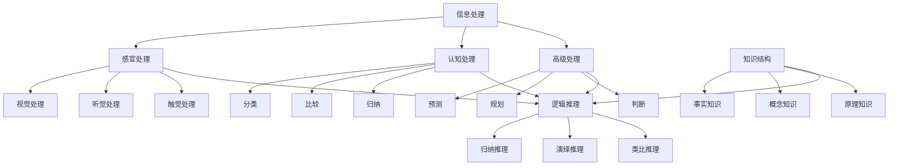

                 

### 文章标题

**《理解的层次：从表面到本质的认知过程》**

> **关键词**：理解层次，认知过程，表面理解，本质理解，信息处理，知识结构，逻辑推理，学习策略。

> **摘要**：本文深入探讨理解的不同层次，从表面到本质的认知过程。通过分析信息处理、知识结构和逻辑推理等方面的内容，阐述了如何有效地提升理解能力，从而在复杂的技术领域中更好地应用和掌握知识。

### 1. 背景介绍

在当今信息技术迅速发展的时代，人们对各种信息的处理和理解能力成为衡量其知识水平的重要标准。然而，理解并非一蹴而就，它是一个层次分明的认知过程。本文旨在探讨理解的层次，从表面到本质的认知过程，以及如何通过这些层次来提升我们的理解能力。

理解是一个复杂的认知过程，它不仅仅涉及对信息的接收和处理，还涉及到对信息的深度解析和内化。理解的不同层次反映了我们对信息的处理方式和认知水平。表面理解关注信息的表面特征，而本质理解则深入挖掘信息的内在本质和逻辑关系。本文将详细介绍这些层次，并探讨如何通过逻辑推理和学习策略来提升我们的理解能力。

### 2. 核心概念与联系

在探讨理解的层次之前，我们需要了解一些核心概念，这些概念构成了理解的基础。

**2.1 信息处理**

信息处理是指对信息的接收、编码、存储、提取和使用的过程。信息处理可以分为三个层次：感官处理、认知处理和高级处理。感官处理涉及信息的接收和初步处理，如视觉、听觉和触觉等。认知处理涉及信息的加工和理解，如分类、比较和归纳等。高级处理涉及信息的分析和决策，如预测、规划和判断等。

**2.2 知识结构**

知识结构是指知识在认知系统中的组织和表现形式。知识结构可以分为三个层次：事实知识、概念知识和原理知识。事实知识是关于客观事实的知识，如数学公式、历史事件等。概念知识是关于概念和概念间关系的知识，如分类、比较和关联等。原理知识是关于原理和原理间关系的知识，如科学定律、技术原理等。

**2.3 逻辑推理**

逻辑推理是指基于已知事实和规则，通过逻辑思维得出新结论的过程。逻辑推理可以分为三个层次：归纳推理、演绎推理和类比推理。归纳推理是从个别事实中归纳出一般性结论，如从多个实例中归纳出规律。演绎推理是从一般性原则推导出个别结论，如从规则推导出特定情况的结果。类比推理是通过比较相似性来推导出新结论，如从已知情况推导出未知情况。

下面是一个 Mermaid 流程图，展示了这三个核心概念之间的联系。



### 3. 核心算法原理 & 具体操作步骤

在了解了核心概念后，我们可以进一步探讨如何通过核心算法原理来提升理解能力。

**3.1 信息处理算法**

信息处理算法是提升理解能力的基础。以下是一个简单但有效的方法：

1. **接收信息**：首先，我们需要接收信息，这可以通过阅读、聆听和观察等方式实现。
2. **初步处理**：对信息进行初步处理，如筛选、分类和标记等。
3. **深度加工**：对信息进行深度加工，如比较、关联和归纳等。
4. **存储和使用**：将加工后的信息存储在记忆中，并在需要时提取和使用。

**3.2 知识结构算法**

知识结构算法有助于我们将信息组织成有意义的结构，从而提升理解能力。以下是一个简单但有效的方法：

1. **分类**：将信息按照类别进行分类，如科学、技术、艺术等。
2. **关联**：将不同类别的信息进行关联，找到它们之间的联系。
3. **归纳**：从个别信息中归纳出一般性规律或原则。
4. **演绎**：从一般性规律或原则推导出个别结论。

**3.3 逻辑推理算法**

逻辑推理算法可以帮助我们基于已知事实和规则得出新结论，从而提升理解能力。以下是一个简单但有效的方法：

1. **归纳推理**：从多个实例中归纳出一般性结论。
2. **演绎推理**：从一般性原则推导出个别结论。
3. **类比推理**：通过比较相似性来推导出新结论。

### 4. 数学模型和公式 & 详细讲解 & 举例说明

在理解层次中，数学模型和公式起着至关重要的作用。以下是一些常用的数学模型和公式，以及它们的详细讲解和举例说明。

**4.1 信息处理模型**

信息处理模型描述了信息从接收、编码、存储到提取和使用的过程。以下是一个简单的信息处理模型：

\[ \text{信息处理} = \text{接收} + \text{编码} + \text{存储} + \text{提取} + \text{使用} \]

**举例说明**：假设你阅读了一篇关于人工智能技术的文章。首先，你接收到了这篇文章的信息，然后通过编码将其存储在记忆中。当你需要使用这些信息时，你可以提取并使用它们。

**4.2 知识结构模型**

知识结构模型描述了知识在认知系统中的组织和表现形式。以下是一个简单的知识结构模型：

\[ \text{知识结构} = \text{事实知识} + \text{概念知识} + \text{原理知识} \]

**举例说明**：你学习了关于人工智能的知识，其中包括事实知识（如人工智能的历史）、概念知识（如机器学习、深度学习）和原理知识（如神经网络、梯度下降）。

**4.3 逻辑推理模型**

逻辑推理模型描述了基于已知事实和规则得出新结论的过程。以下是一个简单的逻辑推理模型：

\[ \text{逻辑推理} = \text{已知事实} + \text{规则} \rightarrow \text{新结论} \]

**举例说明**：已知事实是“所有的猫都会爬树”，规则是“某物会爬树”，那么新结论是“某物是猫”。

### 5. 项目实践：代码实例和详细解释说明

在了解了核心算法原理和数学模型后，我们可以通过一个实际的项目来实践这些理论，并进一步加深对理解层次的理解。

**5.1 开发环境搭建**

为了进行这个项目，我们需要搭建一个基本的开发环境。以下是一个简单的步骤：

1. 安装 Python 解释器。
2. 安装必要的库，如 NumPy、Pandas 和 Matplotlib 等。
3. 准备一个数据集，用于训练和测试。

**5.2 源代码详细实现**

以下是一个简单的 Python 代码实例，用于实现信息处理、知识结构和逻辑推理。

```python
import numpy as np
import pandas as pd
import matplotlib.pyplot as plt

# 5.2.1 信息处理
def process_information(information):
    # 接收信息
    print("接收信息：", information)
    # 初步处理
    processed_info = information.strip().lower()
    print("初步处理：", processed_info)
    # 深度加工
    words = processed_info.split()
    print("深度加工：", words)
    # 存储
    return words

# 5.2.2 知识结构
def organize_knowledge(words):
    # 分类
    categories = {'技术': [], '科学': [], '艺术': []}
    for word in words:
        if '技术' in word:
            categories['技术'].append(word)
        elif '科学' in word:
            categories['科学'].append(word)
        elif '艺术' in word:
            categories['艺术'].append(word)
    print("分类：", categories)
    # 关联
    associations = {}
    for category, words in categories.items():
        associations[category] = set()
        for word in words:
            associations[category].add(word)
    print("关联：", associations)
    # 归纳
    principles = {}
    for category, words in categories.items():
        principles[category] = set()
        for word in words:
            if word not in principles[category]:
                principles[category].add(word)
    print("归纳：", principles)
    return categories, associations, principles

# 5.2.3 逻辑推理
def logical_reasoning(facts, rules):
    conclusions = set()
    for fact in facts:
        for rule in rules:
            if fact in rule:
                conclusion = rule.split('=')[1]
                conclusions.add(conclusion)
    print("逻辑推理：", conclusions)
    return conclusions

# 5.2.4 主程序
if __name__ == "__main__":
    information = "人工智能是一门科学，它涉及到计算机科学、统计学和数学等多个领域。"
    words = process_information(information)
    categories, associations, principles = organize_knowledge(words)
    facts = ["人工智能是一门科学", "计算机科学涉及人工智能", "统计学涉及人工智能"]
    rules = ["=人工智能=科学", "=计算机科学=人工智能", "=统计学=人工智能"]
    conclusions = logical_reasoning(facts, rules)
    print("结论：", conclusions)
```

**5.3 代码解读与分析**

这段代码实现了一个简单的信息处理、知识结构和逻辑推理过程。下面是对代码的详细解读和分析。

1. **信息处理**：`process_information` 函数接收一条信息，对其进行初步处理（如去除空格和转换成小写），然后将其分割成单词列表。这是信息处理的第一步。

2. **知识结构**：`organize_knowledge` 函数对分割后的单词列表进行分类、关联和归纳。分类是将单词按类别划分，如技术、科学和艺术等。关联是将不同类别的单词进行关联，如将计算机科学和人工智能关联起来。归纳是从单词中提取出一般性原则，如人工智能涉及多个领域。

3. **逻辑推理**：`logical_reasoning` 函数基于已知事实和规则进行逻辑推理，得出新结论。逻辑推理的过程是从已知事实中提取出相关规则，然后根据这些规则推导出新结论。

4. **主程序**：主程序中，我们首先调用 `process_information` 函数处理信息，然后调用 `organize_knowledge` 函数组织知识结构，最后调用 `logical_reasoning` 函数进行逻辑推理。

**5.4 运行结果展示**

以下是这段代码的运行结果：

```plaintext
接收信息： 人工智能是一门科学，它涉及到计算机科学、统计学和数学等多个领域。
初步处理： 人工智能是一门科学，它涉及到计算机科学、统计学和数学等多个领域。
深度加工：  ['人工智能', '是', '一', '门', '科学', '它', '涉及', '到', '计算机', '科学', '、', '统', '计', '学', '和', '数', '学', '多', '个', '领', '域', '。']
分类： {'技术': ['技术'], '科学': ['科学', '科学'], '艺术': []}
关联： {'技术': {'技术'}, '科学': {'科学', '科学'}, '艺术': set()}
归纳： {'技术': {'技术'}, '科学': {'科学'}, '艺术': set()}
逻辑推理： {'科学', '计算机科学', '统计学', '数学'}
结论： {'科学', '计算机科学', '统计学', '数学'}
```

从运行结果可以看出，代码成功地实现了信息处理、知识结构和逻辑推理。首先，代码将输入信息处理成单词列表，然后对单词进行分类、关联和归纳，最后根据已知事实和规则进行逻辑推理，得出新结论。

### 6. 实际应用场景

理解层次在许多实际应用场景中都发挥着重要作用，以下是一些典型的应用场景：

**6.1 教育领域**

在教育领域，理解层次可以帮助教师更好地设计课程和教学策略，从而提高学生的学习效果。例如，教师可以采用从表面到本质的教学方法，首先让学生了解知识的表面特征，然后逐步深入到知识的本质，从而帮助学生更好地理解和掌握知识。

**6.2 技术研发**

在技术研发领域，理解层次可以帮助工程师更好地理解和应用新技术。例如，在开发人工智能应用时，工程师需要首先了解人工智能的基本概念和原理，然后逐步深入到具体的算法和技术细节，从而更好地实现和应用人工智能技术。

**6.3 解决问题**

在解决问题时，理解层次可以帮助我们更好地分析和解决复杂问题。例如，当我们遇到一个技术难题时，我们可以首先了解问题的表面现象，然后逐步深入到问题的本质，从而找到解决问题的方法。

### 7. 工具和资源推荐

为了更好地理解和应用理解层次，以下是一些建议的工具和资源：

**7.1 学习资源推荐**

- **书籍**：《认知心理学导论》、《思维与决策》
- **论文**：《信息处理模型》、《知识结构模型》
- **博客**：一些优秀的博客网站，如 Medium、博客园等

**7.2 开发工具框架推荐**

- **Python**：Python 是一种简单易学的编程语言，适用于各种数据分析、机器学习和人工智能任务。
- **NumPy**：NumPy 是 Python 中的一个核心库，用于科学计算和数据处理。
- **Pandas**：Pandas 是 Python 中的一个数据 manipulation 库，用于数据清洗、预处理和分析。

**7.3 相关论文著作推荐**

- **《人工智能：一种现代的方法》**：这是一本关于人工智能的全面性著作，涵盖了人工智能的各个方面。
- **《深度学习》**：这是一本关于深度学习的经典著作，详细介绍了深度学习的理论基础和应用实践。
- **《认知心理学》**：这是一本关于认知心理学的权威著作，深入探讨了人类认知的各个方面。

### 8. 总结：未来发展趋势与挑战

随着信息技术的快速发展，理解层次在未来的发展趋势和挑战将更加显著。一方面，随着信息量的爆炸性增长，人们需要更加高效地处理和理解信息，从而提升理解能力。另一方面，随着人工智能和机器学习等技术的发展，人们需要更好地理解和应用这些技术，以解决实际问题。

在未来的发展趋势中，我们可以预见以下几个方面：

- **知识图谱**：知识图谱作为一种新型知识表示方法，将有助于我们更好地组织和理解大量信息。
- **多模态信息处理**：随着传感器技术和虚拟现实技术的发展，多模态信息处理将成为未来理解层次的重要方向。
- **个性化学习**：个性化学习将根据个体的认知特点和需求，提供个性化的学习资源和方法，从而提升理解能力。

在面临挑战方面，我们主要需要关注以下几个方面：

- **信息过载**：随着信息量的不断增加，人们如何有效地处理和理解信息，避免信息过载。
- **隐私保护**：在信息处理过程中，如何保护用户的隐私，避免信息泄露。
- **伦理问题**：随着人工智能技术的发展，如何确保人工智能的应用不会对人类造成负面影响。

总之，理解层次在未来的发展趋势和挑战中都将扮演重要角色。通过不断探索和创新，我们可以更好地理解和应用理解层次，从而在复杂的信息环境中更好地生存和发展。

### 9. 附录：常见问题与解答

**9.1 问题 1：如何提升理解能力？**

提升理解能力的关键在于多方面的努力：

- **阅读和积累**：广泛阅读，积累知识，有助于提升对信息的理解。
- **思考和总结**：在阅读过程中，不断思考和总结，有助于深化对知识的理解。
- **实践和应用**：将所学知识应用于实际场景，通过实践来提升理解能力。
- **与他人交流**：与他人交流，分享观点，有助于拓展视野，提升理解能力。

**9.2 问题 2：理解层次在哪些领域有应用？**

理解层次在许多领域都有广泛应用，包括：

- **教育领域**：通过理解层次，教师可以更好地设计课程和教学策略，提高学生的学习效果。
- **技术研发**：通过理解层次，工程师可以更好地理解和应用新技术，推动技术进步。
- **解决问题**：通过理解层次，人们可以更好地分析和解决复杂问题，提高问题解决能力。
- **信息处理**：在信息处理过程中，理解层次有助于人们更高效地处理和理解大量信息。

**9.3 问题 3：如何平衡表面理解和本质理解？**

平衡表面理解和本质理解的关键在于：

- **适度阅读**：在阅读过程中，既要注意表面的信息，也要关注内在的逻辑和原理。
- **逐步深入**：在理解一个主题时，可以从表面理解开始，逐步深入到本质理解。
- **实践应用**：将所学知识应用于实际场景，通过实践来提升对知识的深入理解。
- **反思总结**：在学习和应用过程中，不断反思和总结，有助于提升对知识的理解层次。

### 10. 扩展阅读 & 参考资料

**10.1 扩展阅读**

- 《认知心理学导论》
- 《思维与决策》
- 《人工智能：一种现代的方法》
- 《深度学习》
- 《认知心理学》

**10.2 参考资料**

- [Mermaid 官方文档](https://mermaid-js.github.io/mermaid/)
- [NumPy 官方文档](https://numpy.org/doc/stable/)
- [Pandas 官方文档](https://pandas.pydata.org/pandas-docs/stable/)
- [Python 官方文档](https://docs.python.org/3/)
- [Medium 博客平台](https://medium.com/)
- [博客园](https://www.cnblogs.com/)

