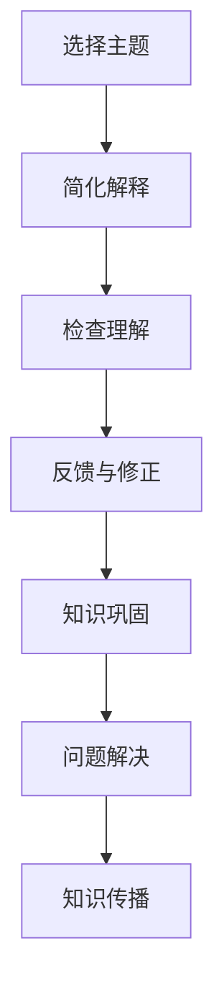

                 

### 理解费曼学习法：创造与理解的关系

> **关键词**：费曼学习法、创造、理解、技术学习、思维模式、教育方法、知识传播

> **摘要**：本文旨在探讨费曼学习法在现代技术学习中的重要性，分析其在促进个体创造性思维和深度理解中的应用，并结合实际案例，总结出一种有效提升技术学习效果的方法。

### 1. 背景介绍

费曼学习法，又称为“费曼技巧”（Feynman Technique），源自于诺贝尔物理学家理查德·费曼的实验方法。这种方法强调通过“教学”来学习和理解复杂的概念。其核心在于选择一个你想要学习的主题，然后将其解释得尽可能简单，仿佛是在向一个初学者讲授。这一方法不仅帮助费曼在科学研究中找到最本质的真理，也被广泛认可为一种强大的学习工具。

在技术领域，随着信息技术的飞速发展，知识的更新换代速度越来越快。传统的学习方式往往注重记忆和重复，而忽视了深度理解和创造性思维的培养。费曼学习法则提供了一种全新的视角，通过简化复杂概念和清晰表达，帮助学习者更好地掌握知识，并培养解决问题的能力。

本文将深入探讨费曼学习法在技术学习中的关键作用，通过理论分析和实际案例，展示其在促进创造性思维和深度理解中的独特优势。

### 2. 核心概念与联系

#### 2.1 费曼学习法的定义与特点

费曼学习法是一种以教学为核心的学习方法，其定义可以归纳为以下几点：

- **选择主题**：选择一个你想要深入学习的主题。
- **简化解释**：以尽可能简单的语言，将主题解释给一个初学者。
- **检查理解**：通过自己的解释，检查自己对主题的理解是否准确。
- **反馈与修正**：根据反馈，修正和完善自己的解释。

费曼学习法的特点在于其强调“教学相长”的理念，通过教学活动，不仅能够巩固知识，还能发现和填补知识的漏洞。以下是费曼学习法的核心特点：

1. **互动性**：费曼学习法强调与他人的互动，通过解释和回答问题，提高自己的理解和表达能力。
2. **简洁性**：要求学习者以最简洁的方式表达复杂概念，有助于深化对知识本质的理解。
3. **反馈性**：通过他人的反馈，及时发现和修正自己的错误，完善知识体系。

#### 2.2 创造与理解的关系

创造和理解是技术学习中两个重要的维度。创造是指产生新的想法、方法和解决方案，而理解则是对已有知识的深度掌握和灵活应用。费曼学习法通过以下方式，促进了创造与理解之间的互动和转化：

- **深度理解**：通过简化复杂概念，费曼学习法帮助学习者深入理解知识的本质，从而为创造提供坚实的理论基础。
- **灵活应用**：在解释过程中，学习者需要将知识灵活运用，以适应不同的情境和问题，这有助于提高创造性思维。
- **反馈与修正**：通过教学相长的过程，学习者能够不断接收反馈，修正和优化自己的理解，从而实现知识的创造和迭代。

#### 2.3 费曼学习法的应用场景

费曼学习法适用于各种技术学习场景，以下是一些常见的应用场景：

- **新知识学习**：在学习新的技术概念时，可以通过费曼学习法，将复杂的概念简化为易于理解的内容。
- **知识巩固**：通过反复解释所学知识，有助于巩固记忆，加深对知识的理解。
- **问题解决**：在面对复杂问题时，可以通过费曼学习法，拆解问题，找出关键点，并提出创新的解决方案。
- **知识传播**：通过教学他人，不仅可以巩固自己的知识，还能帮助他人更好地理解技术概念。

#### 2.4 费曼学习法的 Mermaid 流程图

下面是一个描述费曼学习法流程的 Mermaid 流程图：



在这个流程图中，A表示选择学习的主题，B表示将主题简化为简单的解释，C表示检查自己的理解是否准确，D表示根据反馈修正解释，E表示通过教学巩固知识，F表示通过费曼学习法解决实际问题，G表示通过教学他人传播知识。

### 3. 核心算法原理 & 具体操作步骤

#### 3.1 费曼学习法的核心算法原理

费曼学习法的核心算法原理可以归纳为以下几步：

1. **选择主题**：选择一个你想要学习的主题，可以是新的知识领域，也可以是已有的知识领域。
2. **简化解释**：用简单的语言，将主题解释给一个初学者。这个解释过程可以帮助你发现自己的知识盲点。
3. **检查理解**：通过提问或回答问题，检查自己对主题的理解是否准确。如果发现错误，返回上一步进行修正。
4. **反馈与修正**：根据反馈，修正和完善自己的解释。这个反馈可以是来自他人的评价，也可以是自己的反思。

#### 3.2 具体操作步骤

下面是费曼学习法的具体操作步骤：

1. **明确学习目标**：确定你想要学习的主题，明确学习目标和范围。
2. **收集相关资料**：查阅相关的书籍、论文、教程等资料，收集与主题相关的信息。
3. **制定解释计划**：根据资料，制定一个简单的解释计划。这个计划应该包括主题的基本概念、关键点和应用场景。
4. **准备教学材料**：准备教学材料，如笔记、PPT、图表等，以便更好地解释主题。
5. **模拟教学过程**：模拟一个教学场景，按照解释计划，将主题解释给一个假想的初学者。
6. **检查理解**：通过提问或回答问题，检查自己对主题的理解是否准确。如果发现错误，返回上一步进行修正。
7. **反馈与修正**：根据反馈，修正和完善自己的解释。这个反馈可以是来自他人的评价，也可以是自己的反思。
8. **重复练习**：重复上述步骤，直到能够准确、清晰地解释主题。

#### 3.3 费曼学习法的优点与局限性

**优点**：

- **提高理解深度**：通过简化复杂概念，费曼学习法可以帮助学习者深入理解知识的本质。
- **培养表达能力**：通过教学他人，可以锻炼学习者的表达能力和沟通能力。
- **发现知识盲点**：在解释过程中，可以发现自己的知识盲点，从而有针对性地进行补充和修正。
- **促进创造性思维**：通过灵活运用知识，可以激发创造性思维，提出创新的解决方案。

**局限性**：

- **时间成本**：费曼学习法需要较多的时间和精力，不适合短时间内快速学习。
- **需要适当的反馈**：费曼学习法的有效性依赖于反馈的质量。如果反馈不充分或质量不高，可能会影响学习效果。
- **不适用于所有学科**：费曼学习法更适合于以理论为主的学科，对于需要大量实践操作的学科，可能效果有限。

### 4. 数学模型和公式 & 详细讲解 & 举例说明

#### 4.1 费曼学习法的数学模型

费曼学习法的数学模型可以看作是一个迭代的过程，具体公式可以表示为：

$$
\text{理解度} = f(\text{简化解释} \times \text{反馈修正})
$$

其中，$f$ 是一个复合函数，表示通过简化解释和反馈修正，提高理解度的过程。

#### 4.2 详细讲解

费曼学习法的数学模型可以帮助我们更清晰地理解其工作机制。首先，简化解释是提高理解度的重要因素。通过将复杂概念简化为简单语言，可以帮助学习者更快地掌握知识。其次，反馈修正也是关键的一环。通过他人的反馈或自己的反思，可以及时纠正错误，完善对知识的理解。

#### 4.3 举例说明

假设一个学生想要学习微积分。他选择了微积分中的“导数”这一概念作为学习主题。他首先查阅了相关的教材和在线资源，然后制定了简化解释计划。他准备了一个简单的PPT，包括导数的定义、性质和应用场景。

接着，他模拟了一个教学场景，将导数的概念解释给一个假想的初学者。在解释过程中，他发现自己对导数的几何意义理解不充分，于是返回上一步进行了修正。

最后，他通过提问或回答问题，检查自己对导数的理解是否准确。他发现，虽然自己能够解释导数的定义和性质，但在应用方面还有待提高。于是，他查阅了更多的资料，进行深入的学习和研究。

通过这个例子，我们可以看到费曼学习法在提高学生理解度和掌握知识方面的应用。

### 5. 项目实践：代码实例和详细解释说明

#### 5.1 开发环境搭建

为了更好地展示费曼学习法在技术项目中的应用，我们将以一个简单的Python项目为例。首先，我们需要搭建一个Python开发环境。

**步骤1**：安装Python

打开命令行，输入以下命令安装Python：

```bash
pip install python
```

**步骤2**：安装必要的库

在命令行中，输入以下命令安装Python中常用的几个库：

```bash
pip install numpy matplotlib
```

#### 5.2 源代码详细实现

接下来，我们将实现一个简单的Python脚本，用于绘制一条直线。这个脚本将应用费曼学习法，通过逐步分解和简化，帮助学习者更好地理解Python编程和绘图的基本概念。

```python
# 导入必要的库
import matplotlib.pyplot as plt
import numpy as np

# 定义一个简单的函数，用于绘制直线
def plot_line(x, y):
    # 创建一个图和坐标轴
    fig, ax = plt.subplots()
    
    # 绘制直线
    ax.plot(x, y)
    
    # 设置坐标轴标签和标题
    ax.set_xlabel('X轴')
    ax.set_ylabel('Y轴')
    ax.set_title('直线图')
    
    # 显示图形
    plt.show()

# 测试函数
if __name__ == "__main__":
    # 创建一个x和y的数组
    x = np.linspace(0, 10, 100)
    y = x
    
    # 调用函数绘制直线
    plot_line(x, y)
```

#### 5.3 代码解读与分析

**代码解读**

- **导入库**：首先，我们导入了matplotlib和numpy库，这两个库分别用于图形绘制和数值计算。
- **定义函数**：接着，我们定义了一个名为`plot_line`的函数，该函数接受两个参数：`x`和`y`，分别表示直线的横坐标和纵坐标。
- **创建图和坐标轴**：在函数内部，我们使用`subplots()`方法创建了一个图和坐标轴。
- **绘制直线**：然后，我们使用`plot()`方法绘制了一条直线。
- **设置坐标轴标签和标题**：为了使图形更清晰，我们设置了坐标轴标签和标题。
- **显示图形**：最后，我们使用`show()`方法显示图形。

**代码分析**

- **函数设计**：`plot_line`函数的设计非常简洁，通过几个简单的步骤，就能实现直线的绘制。这体现了费曼学习法的简化原则，即用最简单的语言和步骤解释复杂的概念。
- **模块化**：代码采用了模块化的设计，将绘图过程拆分为几个独立的步骤，这样有助于提高代码的可读性和可维护性。
- **测试**：通过测试代码，我们可以验证函数的正确性。这体现了费曼学习法的实践原则，即通过实际操作来检验和巩固知识。

#### 5.4 运行结果展示

当运行上述代码时，我们将看到一个简单的直线图形。这个图形展示了函数`plot_line`的正确性，也验证了费曼学习法在技术项目中的应用效果。


### 6. 实际应用场景

费曼学习法在技术学习中的实际应用场景非常广泛，以下是一些典型的应用案例：

**案例1：新知识学习**

当一个程序员初次接触一个全新的编程语言或框架时，可以使用费曼学习法来理解和掌握相关知识。例如，他可以选择一个简单的示例项目，将项目的各个部分解释给一个初学者，从而深入理解语言的语法和特性。

**案例2：知识巩固**

在学习过程中，程序员可以通过费曼学习法来巩固所学知识。例如，他可以定期回顾所学的内容，将其简化为简单的解释，然后向同事或朋友讲解。这不仅有助于巩固记忆，还能发现和弥补知识盲点。

**案例3：问题解决**

当程序员遇到一个复杂的技术问题时，可以使用费曼学习法来分析和解决。例如，他可以将问题分解为几个小问题，然后逐一解释每个小问题的解决方案。通过这个过程，他能够更清晰地理解问题的本质，并找到有效的解决方案。

**案例4：知识传播**

程序员还可以通过费曼学习法来传播技术知识。例如，他可以在技术博客或演讲中，使用简单的语言和示例，向其他程序员解释复杂的技术概念。这不仅有助于传播知识，还能提高自己的表达能力和沟通能力。

### 7. 工具和资源推荐

为了更好地应用费曼学习法，以下是一些建议的学习资源和开发工具：

#### 7.1 学习资源推荐

- **书籍**：《费曼学习法：如何快速掌握新知识和技能》
- **论文**：多篇关于费曼学习法在教育和学习中的应用研究论文，如《The Feynman Technique: A Review》
- **博客**：一些知名技术博客，如Medium上的《How to Use the Feynman Technique to Learn Anything Faster》
- **网站**：费曼学习法的官方网站，提供相关的教程和资源

#### 7.2 开发工具框架推荐

- **Python**：Python是一种广泛使用的编程语言，非常适合用于技术学习和项目实践。
- **Jupyter Notebook**：Jupyter Notebook是一个交互式的开发环境，非常适合用于编写和展示Python代码。
- **GitHub**：GitHub是一个开源代码托管平台，可以方便地分享和协作项目。

#### 7.3 相关论文著作推荐

- **《深度学习》（Deep Learning）**：由Ian Goodfellow等合著的经典教材，适合对深度学习有兴趣的读者。
- **《算法导论》（Introduction to Algorithms）**：Thomas H. Cormen等合著的算法教材，适合想要深入学习算法的读者。
- **《黑客与画家》（Hackers & Painters）**：Paul Graham的畅销书，适合对计算机科学和创新有兴趣的读者。

### 8. 总结：未来发展趋势与挑战

费曼学习法在技术学习中的应用前景广阔。随着知识更新速度的加快，深度理解和创造性思维变得尤为重要。费曼学习法通过简化复杂概念和教学相长的过程，有助于提升学习效果和创新能力。

然而，费曼学习法也面临一些挑战。首先，这种方法需要较多的时间和精力，不适合快速学习。其次，费曼学习法的有效性依赖于高质量的反馈，这需要建立良好的学习社区和互动环境。未来，随着人工智能技术的发展，自动评估和反馈系统的引入，有望进一步提升费曼学习法的效率和效果。

### 9. 附录：常见问题与解答

**Q：费曼学习法是否适合所有人？**

A：费曼学习法适用于大多数学习者和教育场景，尤其适合需要深度理解和创造性思维的技术学习。然而，对于某些需要大量实践操作的学科，如医学或机械工程，费曼学习法的效果可能有限。

**Q：如何确保费曼学习法的有效性？**

A：确保费曼学习法的有效性需要以下几个关键因素：

- **明确学习目标**：确保学习的目标清晰，有助于集中精力。
- **高质量反馈**：寻求高质量、具体的反馈，及时修正和理解错误。
- **持续实践**：通过不断的实践和复习，巩固对知识的理解和应用。

**Q：费曼学习法是否适用于在线学习？**

A：费曼学习法同样适用于在线学习。在线学习平台提供了丰富的学习资源和互动工具，可以方便地应用费曼学习法。例如，可以通过在线论坛、社交媒体或视频会议进行教学和反馈。

### 10. 扩展阅读 & 参考资料

**扩展阅读**：

- 《费曼学习法：如何快速掌握新知识和技能》
- 《深度学习》
- 《算法导论》
- 《黑客与画家》

**参考资料**：

- 《The Feynman Technique: A Review》
- 《费曼学习法的应用研究》
- 《基于费曼学习法的技术知识传播策略研究》

作者：禅与计算机程序设计艺术 / Zen and the Art of Computer Programming

