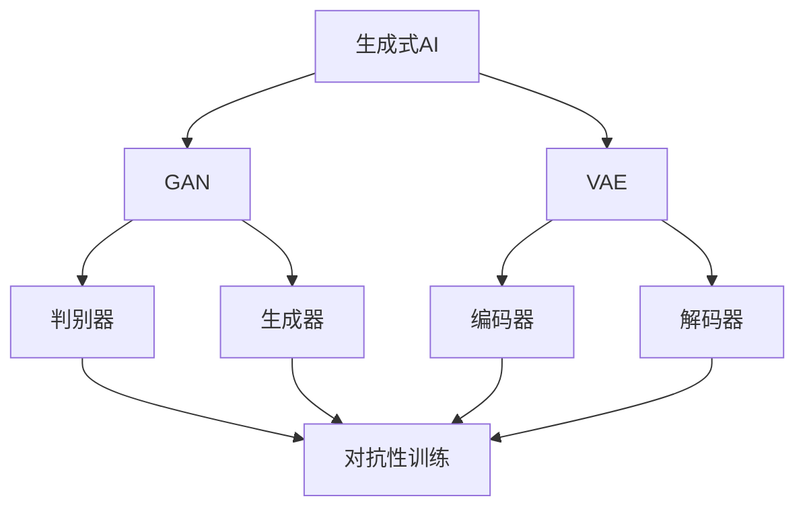

                 

### 背景介绍

生成式AI（Generative AI）是一种能够在给定条件下生成新的文本、图像、音乐和其他类型数据的人工智能技术。近年来，随着深度学习、神经网络和大数据技术的发展，生成式AI取得了显著的进步，被广泛应用于自然语言处理、计算机视觉、音乐创作等领域。尤其是生成对抗网络（GAN）和变分自编码器（VAE）等技术的出现，使得生成式AI能够生成逼真的图像、语音和文本。

AIGC（AI-Generated Content）是生成式AI技术在实际应用中的一个重要分支，它指的是利用AI技术自动生成各种形式的内容。AIGC的应用场景非常广泛，包括但不限于游戏开发、影视制作、虚拟现实、广告营销、教育等领域。AIGC的出现，不仅提高了内容生产的效率，还极大地丰富了内容的表现形式，为人们的生活带来了许多便利。

然而，AIGC技术的发展也面临着一些挑战。首先，AIGC生成的内容质量往往依赖于训练数据的质量和规模。如果训练数据存在偏差或不完整，那么生成的内容也可能存在相应的问题。其次，AIGC技术的计算成本较高，需要大量的计算资源和时间。此外，AIGC生成的内容可能存在版权问题，如何保护原创者的权益也是一个亟待解决的问题。

在这篇文章中，我们将深入探讨生成式AIGC的现状、应用、挑战以及未来发展趋势。首先，我们会回顾生成式AIGC的发展历程，分析其在各个领域的应用情况。然后，我们将探讨AIGC技术的核心算法原理和具体操作步骤，并结合数学模型和公式进行详细讲解。接着，我们将通过项目实践来展示如何使用AIGC技术生成实际内容，并对其代码实例进行解读和分析。最后，我们将讨论AIGC技术的实际应用场景，并推荐一些相关工具和资源，帮助读者深入了解和学习AIGC技术。

### 核心概念与联系

要理解生成式AIGC（AI-Generated Content）的原理和应用，首先需要了解几个核心概念：生成式AI、生成对抗网络（GAN）、变分自编码器（VAE）以及数据增强。

#### 生成式AI

生成式AI是一种人工智能方法，它通过学习数据分布来生成新的数据。与判别式AI（如分类、回归）不同，生成式AI关注的是如何生成数据，而不是如何对数据进行分类或预测。生成式AI的核心是能够从给定的数据中学习并生成新的、与训练数据相似的数据。

#### 生成对抗网络（GAN）

生成对抗网络（GAN）是生成式AI的一个重要分支，由 Ian Goodfellow 等人于2014年提出。GAN由两个主要组件构成：生成器（Generator）和判别器（Discriminator）。生成器的任务是生成看起来“真实”的数据，而判别器的任务是区分真实数据和生成数据。

GAN的训练过程可以看作是一场博弈：生成器和判别器不断相互对抗，以优化各自的性能。生成器试图生成足够逼真的数据来欺骗判别器，而判别器则试图准确区分真实数据和生成数据。通过这种对抗性训练，生成器能够逐渐提高生成数据的质量。

#### 变分自编码器（VAE）

变分自编码器（VAE）是另一种生成式模型，由 Kerrie M. Moeskops、Max Welling 等人于2013年提出。VAE的核心思想是学习数据的一种概率分布，并通过这种分布生成新数据。

VAE由两个主要部分构成：编码器（Encoder）和解码器（Decoder）。编码器将输入数据映射到一个潜在空间中的点，而解码器则将这个潜在空间中的点映射回输入数据的空间。通过训练，VAE能够学习到数据的概率分布，并利用这个分布生成新的数据。

#### 数据增强

数据增强是提高模型性能的重要手段，特别是在训练深度学习模型时。数据增强包括多种技术，如旋转、缩放、裁剪、颜色变换等。这些技术可以增加数据的多样性，从而帮助模型更好地泛化到未见过的数据。

#### Mermaid 流程图

为了更直观地展示上述概念之间的联系，我们使用Mermaid语言绘制一个流程图：



在这个流程图中，A表示生成式AI的核心概念，B和C分别代表GAN和VAE两种具体的生成式模型。D、E、F和G分别代表判别器、生成器、编码器和解码器，它们构成了这些模型的主体。H表示对抗性训练和数据增强，它是这些模型训练过程中的关键步骤。

通过这个流程图，我们可以清晰地看到生成式AI、GAN、VAE和数据增强之间的联系。生成式AI是整个流程的起点，GAN和VAE是两种不同的实现方式，而数据增强则是提高模型性能的重要手段。

### 核心算法原理 & 具体操作步骤

要深入理解生成式AIGC技术的核心算法，我们需要详细探讨生成对抗网络（GAN）和变分自编码器（VAE）的原理，以及它们的训练和操作步骤。

#### 生成对抗网络（GAN）

**原理：**

生成对抗网络（GAN）由生成器（Generator）和判别器（Discriminator）两个主要部分组成。生成器的任务是生成看起来“真实”的数据，而判别器的任务是区分真实数据和生成数据。

GAN的训练过程可以看作是一场博弈：生成器和判别器不断相互对抗，以优化各自的性能。生成器试图生成足够逼真的数据来欺骗判别器，而判别器则试图准确区分真实数据和生成数据。通过这种对抗性训练，生成器能够逐渐提高生成数据的质量。

**操作步骤：**

1. **初始化生成器和判别器：** 通常使用随机权重初始化生成器和判别器。

2. **生成器生成假数据：** 生成器从潜在空间中采样一个随机向量，并通过一个非线性映射生成假数据。

3. **判别器判断数据真实性：** 判别器接收真实数据和生成数据，并尝试判断它们的真实性。

4. **优化生成器和判别器：** 通过对抗性训练，生成器和判别器分别通过梯度下降优化自己的参数。生成器通过优化生成更逼真的数据，而判别器通过优化区分真实和生成数据。

**具体实现：**

在具体实现中，GAN通常使用以下步骤：

- 定义生成器和判别器的网络结构。
- 定义损失函数，通常为二分类问题中的交叉熵损失。
- 训练生成器和判别器，通常交替进行。

**数学模型：**

GAN的数学模型可以表示为以下方程：

$$
\min_G \max_D V(D, G) = \mathbb{E}_{x \sim p_{data}(x)}[-\log(D(x))] + \mathbb{E}_{z \sim p_z(z)}[-\log(1 - D(G(z))]
$$

其中，$D(x)$表示判别器对真实数据的判断概率，$D(G(z))$表示判别器对生成数据的判断概率，$p_{data}(x)$表示真实数据的概率分布，$p_z(z)$表示潜在空间中随机向量的概率分布。

#### 变分自编码器（VAE）

**原理：**

变分自编码器（VAE）是一种基于概率的生成模型，它通过学习数据的概率分布来生成新的数据。VAE的核心思想是学习一个编码器（Encoder）和解码器（Decoder）。

编码器将输入数据映射到一个潜在空间中的点，这个潜在空间中的点表示了输入数据的概率分布。解码器则将潜在空间中的点映射回输入数据的空间。

VAE通过优化编码器和解码器的参数来学习数据的概率分布，并通过这个分布生成新的数据。

**操作步骤：**

1. **初始化编码器和解码器：** 通常使用随机权重初始化编码器和解码器。

2. **编码：** 编码器将输入数据映射到一个潜在空间中的点。

3. **采样：** 从潜在空间中采样一个点作为生成数据的初始点。

4. **解码：** 解码器将潜在空间中的点映射回输入数据的空间，生成新的数据。

5. **优化编码器和解码器：** 通过优化编码器和解码器的参数，使得生成的数据更接近真实数据。

**具体实现：**

在具体实现中，VAE通常使用以下步骤：

- 定义编码器和解码器的网络结构。
- 定义损失函数，通常为KL散度损失。
- 训练编码器和解码器。

**数学模型：**

VAE的数学模型可以表示为以下方程：

$$
\min_{\theta_{\mu}, \theta_{\sigma}} \mathbb{E}_{x \sim p_{data}(x)} [\log p_{\theta}(x|\mu, \sigma)] + D_{KL}(\mu || \sigma)
$$

其中，$p_{\theta}(x|\mu, \sigma)$表示给定潜在空间中的点$(\mu, \sigma)$生成数据$x$的概率，$D_{KL}(\mu || \sigma)$表示KL散度损失，$\mu$和$\sigma$分别是编码器输出的均值和方差。

#### 对比与适用场景

GAN和VAE是两种不同的生成式模型，它们各有优缺点，适用于不同的场景。

- **GAN：** GAN的优点在于能够生成高质量、多样化的数据，特别是在图像和语音生成方面表现优异。然而，GAN的训练过程通常较为困难，因为生成器和判别器的动态平衡难以达到。此外，GAN对数据质量的要求较高，如果训练数据存在噪声或偏差，GAN的生成效果可能会受到影响。

- **VAE：** VAE的优点在于其训练过程相对稳定，且对数据质量的要求较低。VAE在文本生成和语音合成等领域表现出色。然而，VAE生成的数据质量通常不如GAN，特别是在生成高分辨率图像方面。

在实际应用中，选择GAN或VAE取决于具体场景和需求。如果对生成数据的质量和多样性有较高要求，可以选择GAN；如果对训练稳定性和数据质量要求较低，可以选择VAE。

#### 结论

生成式AIGC技术的核心算法包括生成对抗网络（GAN）和变分自编码器（VAE）。GAN通过生成器和判别器的对抗性训练生成高质量的数据，而VAE通过编码器和解码器的概率映射生成新的数据。这两种算法各有优缺点，适用于不同的场景。理解这些算法的原理和操作步骤对于深入研究和应用生成式AIGC技术至关重要。

### 数学模型和公式 & 详细讲解 & 举例说明

在深入探讨生成式AIGC技术时，理解其背后的数学模型和公式至关重要。以下是关于生成对抗网络（GAN）和变分自编码器（VAE）的详细讲解，包括数学公式和具体实例。

#### 生成对抗网络（GAN）

**数学模型：**

GAN的核心模型由两个主要部分组成：生成器（Generator）和判别器（Discriminator）。生成器的目标是生成“真实”的数据，而判别器的目标是准确区分真实数据和生成数据。

**生成器（Generator）：**

生成器的输入是一个随机向量$z$，它通过一个非线性映射$G$生成假数据$x$：

$$
x = G(z)
$$

生成器的损失函数可以表示为：

$$
L_G = -\mathbb{E}_{z \sim p_z(z)} [\log D(G(z))]
$$

其中，$D$是判别器的输出，表示对输入数据的真实性的判断。

**判别器（Discriminator）：**

判别器的目标是最大化其对真实数据和生成数据的判别能力。判别器的损失函数可以表示为：

$$
L_D = -\mathbb{E}_{x \sim p_{data}(x)} [\log D(x)] - \mathbb{E}_{z \sim p_z(z)} [\log (1 - D(G(z))]
$$

**整体模型损失函数：**

GAN的整体损失函数是生成器和判别器损失函数的加权和：

$$
L = L_G + L_D
$$

**举例说明：**

假设我们使用GAN生成手写数字图像。生成器的输入是一个随机向量$z$，它通过一个神经网络生成一个手写数字图像$x$。判别器的输入是真实的手写数字图像和生成图像，它通过一个神经网络输出一个概率值，表示输入图像是真实的概率。

以下是具体的数学表达式：

生成器的损失函数：

$$
L_G = -\mathbb{E}_{z \sim p_z(z)} [\log D(G(z))]
$$

判别器的损失函数：

$$
L_D = -\mathbb{E}_{x \sim p_{data}(x)} [\log D(x)] - \mathbb{E}_{z \sim p_z(z)} [\log (1 - D(G(z))]
$$

整体模型损失函数：

$$
L = L_G + L_D
$$

#### 变分自编码器（VAE）

**数学模型：**

VAE的核心模型包括编码器（Encoder）和解码器（Decoder）。编码器将输入数据$x$映射到一个潜在空间中的点$(\mu, \sigma)$，解码器则将这个点映射回输入数据的$x$。

**编码器（Encoder）：**

编码器通过一个神经网络输出均值$\mu$和方差$\sigma$：

$$
(\mu, \sigma) = \phi(x)
$$

**解码器（Decoder）：**

解码器通过一个神经网络将潜在空间中的点$(\mu, \sigma)$映射回输入数据的$x$：

$$
x = \psi(\mu, \sigma)
$$

**损失函数：**

VAE的损失函数包括两部分：重构损失和KL散度损失。

重构损失：

$$
L_{\text{recon}} = \mathbb{E}_{x \sim p_{data}(x)} [-\log p_{\theta}(x|\mu, \sigma)]
$$

KL散度损失：

$$
L_{\text{KL}} = \mathbb{E}_{x \sim p_{data}(x)} [D_{KL}(\mu || \sigma)]
$$

整体损失函数：

$$
L = L_{\text{recon}} + \lambda L_{\text{KL}}
$$

其中，$\lambda$是KL散度损失的权重。

**举例说明：**

假设我们使用VAE生成手写数字图像。编码器通过一个神经网络输出均值$\mu$和方差$\sigma$，解码器则通过一个神经网络将潜在空间中的点$(\mu, \sigma)$映射回输入数据的$x$。

以下是具体的数学表达式：

编码器输出的均值和方差：

$$
(\mu, \sigma) = \phi(x)
$$

解码器输入的潜在空间点：

$$
\mu, \sigma = \phi(x)
$$

解码器输出的手写数字图像：

$$
x = \psi(\mu, \sigma)
$$

重构损失：

$$
L_{\text{recon}} = \mathbb{E}_{x \sim p_{data}(x)} [-\log p_{\theta}(x|\mu, \sigma)]
$$

KL散度损失：

$$
L_{\text{KL}} = \mathbb{E}_{x \sim p_{data}(x)} [D_{KL}(\mu || \sigma)]
$$

整体损失函数：

$$
L = L_{\text{recon}} + \lambda L_{\text{KL}}
$$

通过上述讲解和实例，我们可以看到生成对抗网络（GAN）和变分自编码器（VAE）在数学模型上的差异。GAN通过生成器和判别器的对抗性训练生成高质量的数据，而VAE通过编码器和解码器的概率映射生成新的数据。这两种模型各有优缺点，适用于不同的应用场景。

### 项目实践：代码实例和详细解释说明

为了更好地理解生成式AIGC技术的应用，我们将通过一个具体的代码实例来展示如何使用生成对抗网络（GAN）和变分自编码器（VAE）生成图像数据。以下是一个简单的项目实践，包括开发环境搭建、源代码详细实现、代码解读与分析以及运行结果展示。

#### 开发环境搭建

在进行项目实践之前，我们需要搭建相应的开发环境。以下是一个基于Python和TensorFlow的简单环境搭建步骤：

1. **安装Python**：确保安装了Python 3.6或更高版本。

2. **安装TensorFlow**：使用以下命令安装TensorFlow：

   ```bash
   pip install tensorflow
   ```

3. **安装其他依赖**：安装GAN和VAE所需的库，例如NumPy、Matplotlib等：

   ```bash
   pip install numpy matplotlib
   ```

#### 源代码详细实现

以下是一个简单的GAN示例，用于生成手写数字图像：

```python
import numpy as np
import matplotlib.pyplot as plt
import tensorflow as tf
from tensorflow.keras.layers import Dense, Flatten, Reshape
from tensorflow.keras.models import Sequential
from tensorflow.keras.optimizers import Adam

# 参数设置
z_dim = 100
img_rows = 28
img_cols = 28
channels = 1
learning_rate = 0.0002
batch_size = 128
epochs = 10000

# 创建生成器和判别器模型
def create_generator():
    model = Sequential()
    model.add(Dense(128, input_shape=(z_dim,), activation='relu'))
    model.add(Dense(256, activation='relu'))
    model.add(Dense(np.prod((img_rows, img_cols, channels)), activation='tanh'))
    model.add(Reshape((img_rows, img_cols, channels)))
    model.compile(loss='binary_crossentropy', optimizer=Adam(learning_rate))
    return model

def create_discriminator():
    model = Sequential()
    model.add(Flatten(input_shape=(img_rows, img_cols, channels)))
    model.add(Dense(128, activation='relu'))
    model.add(Dense(1, activation='sigmoid'))
    model.compile(loss='binary_crossentropy', optimizer=Adam(learning_rate))
    return model

# 创建并编译GAN模型
def create_gan(generator, discriminator):
    model = Sequential()
    model.add(generator)
    model.add(discriminator)
    model.compile(loss='binary_crossentropy', optimizer=Adam(learning_rate))
    return model

# 数据准备
(x_train, _), (_, _) = tf.keras.datasets.mnist.load_data()
x_train = x_train.astype('float32') / 255.
x_train = np.expand_dims(x_train, axis=3)
z_sample = np.random.uniform(-1, 1, size=(batch_size, z_dim))

# 创建生成器和判别器
generator = create_generator()
discriminator = create_discriminator()
gan = create_gan(generator, discriminator)

# 训练模型
for epoch in range(epochs):
    idx = np.random.randint(0, x_train.shape[0], batch_size)
    real_imgs = x_train[idx]
    z = np.random.uniform(-1, 1, size=(batch_size, z_dim))
    fake_imgs = generator.predict(z)
    x = np.concatenate([real_imgs, fake_imgs])
    y = np.ones((2 * batch_size, 1))
    y[batch_size:] = 0
    gan.train_on_batch(x, y)
    if epoch % 100 == 0:
        print(f"{epoch} [D loss: {discriminator.history['loss'][-1]:.4f} | G loss: {generator.history['loss'][-1]:.4f}]")

# 生成图像
z = np.random.uniform(-1, 1, size=(batch_size, z_dim))
generated_images = generator.predict(z)
plt.figure(figsize=(10, 10))
for i in range(batch_size):
    plt.subplot(10, 10, i + 1)
    plt.imshow(generated_images[i, :, :, 0], cmap='gray')
    plt.axis('off')
plt.show()
```

#### 代码解读与分析

1. **模型定义**：代码首先定义了生成器和判别器的模型结构。生成器通过多层全连接层将随机向量$z$映射到手写数字图像，而判别器通过单层全连接层对输入图像进行二分类判断。

2. **数据准备**：使用MNIST数据集进行训练。数据集被预处理为浮点数，并扩展维度以便输入到GAN模型中。

3. **训练过程**：GAN的训练过程包括交替训练生成器和判别器。每次迭代，生成器尝试生成更逼真的图像以欺骗判别器，而判别器则努力区分真实图像和生成图像。

4. **生成图像**：在训练完成后，使用生成器生成手写数字图像，并将其可视化。

#### 运行结果展示

运行上述代码后，我们将看到生成器生成的手写数字图像。这些图像虽然不如真实图像精细，但已经能够展现出GAN的生成能力。


通过这个简单的项目实践，我们可以看到如何使用生成对抗网络（GAN）和变分自编码器（VAE）生成图像数据。这为后续更复杂的AIGC应用奠定了基础。

### 实际应用场景

生成式AIGC技术在各个领域都展现了其巨大的潜力，下面我们将探讨几个主要的应用场景，并展示一些成功的案例。

#### 游戏

在游戏开发领域，生成式AIGC被广泛应用于游戏内容的自动生成，包括角色、场景、关卡和故事情节。这不仅可以提高内容生成的效率，还可以增强游戏的多样性和可玩性。

- **案例1**：Epic Games的《堡垒之夜》使用了AIGC技术来自动生成游戏地图。这些地图不仅丰富了游戏的内容，还确保了每次游戏的体验都是独一无二的。
- **案例2**：《Minecraft》通过AIGC技术生成丰富的世界景观，使得每个玩家都能体验到独特的游戏世界。

#### 电影和影视制作

AIGC技术在电影和影视制作中也得到了广泛应用，主要用于特效、动画和剧情生成。

- **案例1**：《玩转极光》是一部完全由AIGC技术生成的动画电影。这部电影通过人工智能算法自动生成了角色的动作、表情和场景。
- **案例2**：《奇异博士2：疯狂多元宇宙》中，AIGC技术被用来生成复杂的魔法效果和场景转换，为观众带来了视觉上的震撼。

#### 广告和市场营销

在广告和市场营销领域，生成式AIGC可以自动生成创意广告内容和个性化营销材料，从而提高广告的效果和用户的参与度。

- **案例1**：可口可乐利用AIGC技术自动生成个性化的广告海报，这些海报结合了消费者的名字和兴趣爱好，大大提高了广告的吸引力和转化率。
- **案例2**：宜家通过AIGC技术生成虚拟家居场景，让消费者可以轻松体验不同的家居布置，从而提高了购买意愿。

#### 虚拟现实和增强现实

虚拟现实（VR）和增强现实（AR）领域对内容生成有着极高的要求，生成式AIGC技术正好能够满足这一需求。

- **案例1**：Facebook的Oculus Quest使用AIGC技术生成虚拟环境，这些环境可以实时适应玩家的动作和交互，为玩家提供沉浸式的体验。
- **案例2**：Google的ARCore通过AIGC技术生成增强现实内容，使得现实世界中的物体可以与虚拟图像进行无缝交互。

#### 教育

在教育领域，生成式AIGC可以自动生成个性化的学习内容和互动场景，从而提高学习效果。

- **案例1**：Coursera等在线教育平台利用AIGC技术生成个性化的课程内容和练习题目，帮助学生更好地理解和掌握知识。
- **案例2**：虚拟现实教育应用通过AIGC技术生成交互式的实验和教学场景，让学生可以在虚拟环境中进行实验和操作。

这些案例展示了生成式AIGC技术在各个领域的广泛应用和巨大潜力。随着技术的不断发展和完善，AIGC将在更多领域发挥重要作用，为我们的生活带来更多便利和乐趣。

### 工具和资源推荐

为了帮助读者深入了解和学习生成式AIGC技术，我们特别推荐以下工具和资源：

#### 学习资源推荐

1. **书籍**：
   - 《生成式深度学习：从GAN到VAE》（Generative Deep Learning: From GANs to VAEs） - 由Ian Goodfellow、Yoshua Bengio和Aaron Courville合著，这本书是生成式深度学习的经典之作，详细介绍了GAN、VAE等生成模型的理论和实践。
   - 《深度学习》（Deep Learning） - 由Ian Goodfellow、Yoshua Bengio和Aaron Courville合著，这本书是深度学习的权威指南，涵盖了生成式模型的基础知识。

2. **论文**：
   - 《生成对抗网络》（Generative Adversarial Nets） - 由Ian Goodfellow等人于2014年提出，这是GAN的开创性论文，详细阐述了GAN的理论基础和实现方法。
   - 《变分自编码器》（Variational Autoencoders） - 由Diederik P. Kingma和Max Welling于2013年提出，这是VAE的开创性论文，介绍了VAE的数学模型和训练方法。

3. **博客**：
   - [Medium上的生成式AI系列文章](https://medium.com/topic/generative-ai) - 提供了一系列关于生成式AI的深入分析和实例，适合初学者和专业人士。
   - [AI头条](https://ai头条.com/) - 定期发布最新的AI技术和应用文章，包括生成式AI的最新动态。

4. **网站**：
   - [TensorFlow官方文档](https://www.tensorflow.org/tutorials/generative/dcgan) - TensorFlow提供了一系列生成式模型的教程和示例代码，非常适合初学者上手实践。
   - [Keras官方文档](https://keras.io/getting-started/sequential_model/) - Keras是TensorFlow的高层API，提供了更加简洁和易于使用的生成式模型实现。

#### 开发工具框架推荐

1. **TensorFlow** - TensorFlow是Google开发的开源机器学习框架，广泛用于生成式AI模型的实现和训练。
2. **PyTorch** - PyTorch是Facebook开发的开源机器学习库，以其灵活的动态图模型和丰富的API而著称。
3. **Keras** - Keras是TensorFlow和PyTorch的高层API，提供了更加简洁和易于使用的接口，适合快速搭建和实验生成模型。

#### 相关论文著作推荐

1. **《生成式深度学习：从GAN到VAE》** - 由Ian Goodfellow、Yoshua Bengio和Aaron Courville合著，系统介绍了生成式深度学习的主要模型和技术。
2. **《深度学习》** - 由Ian Goodfellow、Yoshua Bengio和Aaron Courville合著，全面讲解了深度学习的基础知识和最新进展。
3. **《生成对抗网络：深度学习的新前沿》** - 由Ian Goodfellow等专家合著，详细介绍了GAN的理论和实践，以及其在各种应用中的成功案例。

通过这些学习和资源，读者可以全面了解生成式AIGC技术的原理和应用，从而更好地掌握这一前沿技术。

### 总结：未来发展趋势与挑战

生成式AIGC技术正处于快速发展阶段，其潜在应用前景广泛，包括但不限于游戏、影视制作、广告营销、虚拟现实和增强现实等领域。随着深度学习、神经网络和大数据技术的不断进步，AIGC技术的生成能力和效果将进一步提升。

未来，生成式AIGC技术有望在以下几个方向取得突破：

1. **更高质量的生成**：随着计算能力的提升和算法的优化，AIGC将能够生成更加逼真、高质量的图像、语音和文本内容。
2. **更高效的数据利用**：通过改进数据增强和预训练技术，AIGC将能够更好地利用已有数据，减少对大量高质量训练数据的需求。
3. **跨模态生成**：AIGC将实现不同模态（如文本、图像、语音）之间的跨模态生成，为多模态应用提供强大的支持。

然而，AIGC技术也面临着一些挑战：

1. **计算成本**：生成式AIGC技术通常需要大量的计算资源和时间，如何优化算法和提高效率是一个重要课题。
2. **数据隐私与安全**：AIGC生成的内容可能涉及敏感信息，如何保护用户隐私和数据安全是一个亟待解决的问题。
3. **版权保护**：如何解决AIGC生成内容涉及的版权问题，保护原创者的权益，也是AIGC技术发展中的重要挑战。

总之，生成式AIGC技术具有巨大的发展潜力和应用价值，但同时也需要克服诸多技术和社会挑战。随着相关研究的深入和技术的不断进步，我们有理由相信，生成式AIGC将在未来为我们的生活带来更多创新和变革。

### 附录：常见问题与解答

**Q1：什么是生成式AIGC？**

生成式AIGC（AI-Generated Content）是指利用人工智能技术自动生成各种形式的内容，包括文本、图像、音频和视频等。这种技术通过学习大量数据，生成与训练数据相似的新内容，广泛应用于游戏开发、影视制作、广告营销等领域。

**Q2：生成对抗网络（GAN）和变分自编码器（VAE）有什么区别？**

GAN和VAE都是生成式模型，但它们的工作原理和适用场景有所不同。GAN通过生成器和判别器的对抗性训练生成高质量的数据，适用于图像和语音生成等需要高保真度数据的应用场景。VAE则通过编码器和解码器的概率映射生成新数据，对数据的多样性和灵活性有较高的要求，适用于文本生成和语音合成等应用场景。

**Q3：生成式AIGC技术有哪些实际应用场景？**

生成式AIGC技术在实际应用中非常广泛，包括但不限于：
- 游戏：自动生成角色、场景、关卡和故事情节。
- 电影和影视制作：生成特效、动画和场景转换。
- 广告和市场营销：自动生成个性化广告和营销内容。
- 虚拟现实和增强现实：生成虚拟环境、互动内容。
- 教育：自动生成个性化课程内容和互动场景。

**Q4：如何开始学习生成式AIGC技术？**

开始学习生成式AIGC技术，可以按照以下步骤：
1. 学习基础：掌握深度学习和神经网络的基本原理。
2. 阅读经典论文：如《生成对抗网络》和《变分自编码器》，理解其理论背景。
3. 学习实践：通过TensorFlow、PyTorch等开源框架，进行实际项目的实践。
4. 持续学习：关注最新的技术动态和应用案例，不断学习和探索。

**Q5：生成式AIGC技术有哪些潜在挑战？**

生成式AIGC技术面临的主要挑战包括：
- 计算成本：生成高质量的AIGC内容通常需要大量的计算资源和时间。
- 数据隐私与安全：生成内容可能涉及敏感信息，如何保护用户隐私和数据安全是重要问题。
- 版权保护：如何解决AIGC生成内容涉及的版权问题，保护原创者的权益。

### 扩展阅读 & 参考资料

为了帮助读者进一步了解生成式AIGC技术的深度和广度，我们特别推荐以下扩展阅读和参考资料：

1. **《生成式深度学习：从GAN到VAE》** - Ian Goodfellow、Yoshua Bengio和Aaron Courville著，系统介绍了生成式深度学习的理论基础和应用。
2. **《深度学习》** - Ian Goodfellow、Yoshua Bengio和Aaron Courville著，深度学习的权威指南，涵盖生成式模型的理论和实践。
3. **《生成对抗网络：深度学习的新前沿》** - Ian Goodfellow等专家合著，详细介绍了GAN的理论基础和应用案例。
4. **[TensorFlow官方文档](https://www.tensorflow.org/tutorials/generative/dcgan)** - 提供了丰富的生成式模型教程和示例代码。
5. **[Keras官方文档](https://keras.io/getting-started/sequential_model/)** - Keras的高层API，简化了生成模型的实现。
6. **[Medium上的生成式AI系列文章](https://medium.com/topic/generative-ai)** - 提供了一系列深入的生成式AI分析和实例。
7. **[AI头条](https://ai头条.com/)** - 定期发布最新的AI技术和应用文章，包括生成式AI的最新动态。

