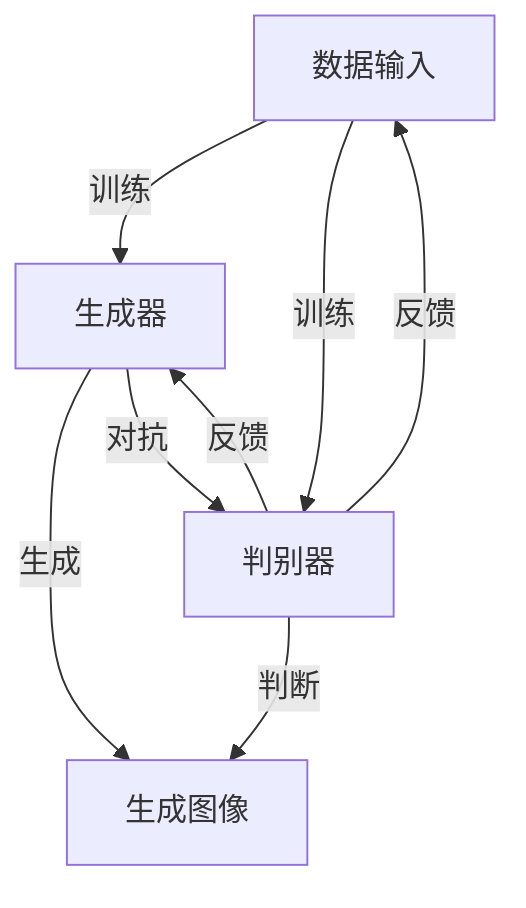

                 

### 背景介绍

#### 生成式AIGC的概念与发展

生成式人工智能（Generative Artificial Intelligence，简称AIGC）是近年来人工智能领域的一个热点话题。它通过学习大量的数据来生成新的内容，如图像、音乐、文本等，从而实现对现实世界的模拟与创造。生成式AIGC的核心技术主要包括生成对抗网络（Generative Adversarial Networks，GAN）、变分自编码器（Variational Autoencoder，VAE）和自注意力机制（Self-Attention Mechanism）等。

生成式AIGC的发展可追溯到20世纪80年代末，当时神经网络的研究初见成效。随着计算能力的提升和大数据技术的发展，生成式AIGC得到了快速的发展。特别是在2014年，Ian Goodfellow等人提出了生成对抗网络（GAN），这一突破性的成果极大地推动了生成式人工智能的发展。近年来，随着深度学习和自注意力机制的应用，生成式AIGC在图像生成、自然语言处理、音乐生成等领域取得了显著的成果。

#### 生成式AIGC的应用场景

生成式AIGC在多个领域都有广泛的应用，以下是其中几个典型的应用场景：

1. **图像生成与编辑**：生成式AIGC可以生成逼真的图像，如人脸、动物、风景等。同时，它还可以用于图像编辑，如去除照片中的物体、改变图像的风格等。

2. **文本生成与摘要**：生成式AIGC可以生成高质量的文章、摘要、对话等文本内容。例如，OpenAI的GPT-3模型就可以生成与人类对话相近的文本。

3. **音乐生成**：生成式AIGC可以生成各种风格的音乐，如古典音乐、流行音乐、电子音乐等。

4. **虚拟现实与增强现实**：生成式AIGC可以生成逼真的虚拟场景，为虚拟现实（VR）和增强现实（AR）提供支持。

5. **游戏开发**：生成式AIGC可以生成丰富的游戏内容，如图形、声音、故事情节等，提高游戏的可玩性。

#### 生成式AIGC的优势与挑战

生成式AIGC具有以下优势：

1. **生成高质量内容**：通过学习大量数据，生成式AIGC可以生成与真实数据高度相似的图像、文本、音乐等。

2. **创作自由度高**：生成式AIGC可以根据用户的需求和喜好，生成个性化的内容。

3. **多样化应用**：生成式AIGC在多个领域都有广泛的应用，具有很高的商业价值。

然而，生成式AIGC也面临一些挑战：

1. **计算资源需求高**：生成式AIGC的训练和推理过程需要大量的计算资源，这对硬件设备提出了较高的要求。

2. **数据依赖性强**：生成式AIGC的性能很大程度上依赖于训练数据的质量和数量。

3. **伦理与法律问题**：生成式AIGC可能生成一些不合法或不道德的内容，如虚假信息、侵犯隐私等。

接下来，我们将进一步探讨生成式AIGC的核心概念与联系，为后续内容的展开打下基础。<|user|>

### 核心概念与联系

在深入探讨生成式AIGC之前，我们需要先了解一些核心概念和它们之间的联系。这些概念包括生成对抗网络（GAN）、变分自编码器（VAE）和自注意力机制（Self-Attention Mechanism）。通过Mermaid流程图，我们可以直观地展示这些概念之间的联系和它们在实际应用中的交互过程。

#### Mermaid流程图



在上面的流程图中，我们用A表示数据输入，B表示生成器，C表示判别器，D表示生成图像。流程图展示了生成器、判别器、数据输入和生成图像之间的相互作用。

1. **数据输入（A）**：首先，我们输入训练数据，这些数据可以是有标签的，也可以是无标签的，取决于我们使用的是有监督学习还是无监督学习。

2. **生成器（B）**：生成器是我们的核心模型，它通过学习训练数据来生成新的数据。在生成图像的场景中，生成器会生成新的图像。

3. **判别器（C）**：判别器是一个二分类模型，它的任务是判断输入数据是真实的还是生成的。在训练过程中，判别器会尝试区分真实数据和生成数据。

4. **生成图像（D）**：生成器生成图像后，判别器会对其进行判断。如果判别器判断为真实，生成器的性能就会下降；如果判断为生成，生成器的性能就会提高。

5. **对抗与反馈**：生成器和判别器之间进行对抗，生成器不断优化自己的生成能力，而判别器则不断提高自己的判断能力。这个过程会通过反馈机制进行调节，以达到最终的平衡。

#### GAN与VAE

生成对抗网络（GAN）和变分自编码器（VAE）是生成式AIGC的两大核心模型，它们在结构和工作原理上有所不同。

1. **GAN**：GAN由生成器和判别器组成。生成器通过学习训练数据来生成新的数据，而判别器则通过判断输入数据是真实的还是生成的来评估生成器的性能。GAN的核心思想是通过生成器和判别器的对抗训练，生成器能够生成越来越逼真的数据。

2. **VAE**：VAE是一种无监督学习的生成模型，它通过学习数据的概率分布来生成新的数据。VAE的核心思想是使用编码器和解码器来表示数据的概率分布，并通过最大化数据概率分布来优化模型。

#### 自注意力机制

自注意力机制是一种用于处理序列数据的神经网络结构，它在自然语言处理、图像处理等领域得到了广泛的应用。自注意力机制的核心思想是让模型在处理序列数据时，能够自适应地关注不同的部分，从而提高模型的性能。

1. **在自然语言处理中的自注意力机制**：在自然语言处理任务中，自注意力机制可以用于处理长文本，使得模型能够自适应地关注文本中的重要信息，从而提高文本分类、文本生成等任务的性能。

2. **在图像处理中的自注意力机制**：在图像处理任务中，自注意力机制可以用于处理图像中的不同区域，使得模型能够自适应地关注图像中的重要特征，从而提高图像分类、图像生成等任务的性能。

通过以上对核心概念和联系的介绍，我们可以更好地理解生成式AIGC的工作原理和应用场景。在接下来的章节中，我们将进一步探讨生成式AIGC的核心算法原理和具体操作步骤，以及其在实际项目中的应用。<|user|>

### 核心算法原理 & 具体操作步骤

在了解了生成式AIGC的核心概念和联系后，我们将深入探讨其核心算法原理和具体操作步骤。生成式AIGC的核心算法主要包括生成对抗网络（GAN）、变分自编码器（VAE）和自注意力机制（Self-Attention Mechanism）。以下是这些算法的详细解释和具体操作步骤。

#### 生成对抗网络（GAN）

生成对抗网络（GAN）是由生成器和判别器组成的对抗性学习框架。生成器的目标是生成尽可能真实的数据，而判别器的目标是区分真实数据和生成数据。

1. **生成器（Generator）**：生成器的任务是生成新的数据，其结构通常由多层神经网络组成。在训练过程中，生成器通过学习真实数据来优化自己的生成能力。

2. **判别器（Discriminator）**：判别器的任务是判断输入数据是真实的还是生成的。其结构也由多层神经网络组成。在训练过程中，判别器通过学习真实数据和生成数据来优化自己的判断能力。

3. **操作步骤**：
   1. 初始化生成器和判别器的参数。
   2. 使用真实数据训练判别器，使其能够准确地区分真实数据和生成数据。
   3. 使用生成器生成的数据训练判别器，同时优化生成器的参数，使其生成的数据能够更好地欺骗判别器。
   4. 重复步骤2和步骤3，直到生成器生成的数据足够逼真，判别器无法区分真实数据和生成数据。

#### 变分自编码器（VAE）

变分自编码器（VAE）是一种无监督学习的生成模型，它通过学习数据的概率分布来生成新的数据。

1. **编码器（Encoder）**：编码器的任务是学习数据的概率分布。它由一个编码网络组成，将输入数据映射到一个隐含空间。

2. **解码器（Decoder）**：解码器的任务是生成新的数据。它由一个解码网络组成，将隐含空间中的数据映射回输入空间。

3. **操作步骤**：
   1. 初始化编码器和解码器的参数。
   2. 使用真实数据训练编码器，使其能够准确地学习数据的概率分布。
   3. 使用编码器生成的隐含空间数据训练解码器，使其能够生成新的数据。
   4. 重复步骤2和步骤3，直到编码器和解码器的性能达到预定的标准。

#### 自注意力机制（Self-Attention Mechanism）

自注意力机制是一种用于处理序列数据的神经网络结构，它能够自适应地关注序列中的不同部分。

1. **自注意力层（Self-Attention Layer）**：自注意力层是自注意力机制的核心部分，它通过对序列中的每个元素计算注意力权重，来生成一个加权序列。

2. **操作步骤**：
   1. 输入序列，计算序列中每个元素的自注意力权重。
   2. 使用自注意力权重对序列进行加权，生成加权序列。
   3. 将加权序列输入下一层神经网络。
   4. 重复步骤1到步骤3，直到达到模型的输出。

#### 结合应用

在实际应用中，生成式AIGC通常结合多个核心算法，以实现更复杂的生成任务。以下是一个简单的结合应用示例：

1. **图像生成**：使用GAN生成新的图像。首先，使用自注意力机制对图像的特征进行提取，然后使用VAE对特征进行编码和解码，最后使用GAN生成图像。

2. **文本生成**：使用自注意力机制处理文本序列，提取关键信息。然后，使用VAE生成新的文本序列，并通过GAN优化生成的文本质量。

3. **音乐生成**：使用自注意力机制处理音频信号，提取音乐特征。然后，使用VAE生成新的音乐特征，并通过GAN生成新的音乐。

通过以上对核心算法原理和具体操作步骤的介绍，我们可以更好地理解生成式AIGC的工作机制和应用。在接下来的章节中，我们将通过具体的项目实践，进一步展示这些算法的实际应用效果。<|user|>

### 数学模型和公式 & 详细讲解 & 举例说明

在深入理解生成式AIGC的核心算法后，我们将进一步探讨其背后的数学模型和公式，并通过具体的例子来说明这些概念的实际应用。

#### 生成对抗网络（GAN）

生成对抗网络（GAN）的核心包括生成器（Generator）和判别器（Discriminator）。以下是这两个模型的主要数学模型和公式：

**生成器（Generator）**：

生成器的目标是生成类似于训练数据的样本。生成器的输入是一个随机噪声向量\( z \)，输出是一个生成样本\( x_G \)。生成器通常由一个多层感知器（MLP）构成，其数学模型可以表示为：

\[ x_G = G(z) \]

其中，\( G \) 是一个神经网络函数，\( z \) 是一个随机噪声向量。

**判别器（Discriminator）**：

判别器的目标是区分输入数据是真实的还是生成的。判别器的输入是一个数据样本\( x \)，输出是一个概率值\( D(x) \)，表示输入样本为真实样本的概率。判别器的数学模型可以表示为：

\[ D(x) = \sigma(\theta_D f_D(x)) \]

其中，\( \sigma \) 是sigmoid函数，\( f_D \) 是判别器的神经网络函数，\( \theta_D \) 是判别器的参数。

**损失函数（Loss Function）**：

GAN的训练过程是通过最小化生成器损失和判别器损失来实现的。生成器的损失函数通常是一个对抗损失，其公式为：

\[ L_G = -\mathbb{E}_{z}[\log(D(G(z)))] \]

判别器的损失函数是一个二分类交叉熵损失，其公式为：

\[ L_D = -\mathbb{E}_{x}[\log(D(x))] - \mathbb{E}_{z}[\log(1 - D(G(z)))] \]

**优化过程**：

GAN的训练过程是交替优化生成器和判别器的参数。具体步骤如下：

1. **固定判别器参数，优化生成器**：通过最小化生成器损失来优化生成器的参数。
2. **固定生成器参数，优化判别器**：通过最小化判别器损失来优化判别器的参数。
3. **重复步骤1和步骤2**：不断迭代，直到生成器生成的数据足够逼真，判别器无法区分真实数据和生成数据。

**举例说明**：

假设我们使用GAN生成手写数字图像。生成器的输入是一个2维随机噪声向量\( z \)，输出是一个手写数字图像\( x_G \)。判别器的输入是一个手写数字图像\( x \)，输出是一个概率值\( D(x) \)。

- 生成器损失：最小化生成器生成的手写数字图像被判别器误判的概率。
- 判别器损失：最小化判别器对真实手写数字图像的判断误差和对生成手写数字图像的判断误差。

#### 变分自编码器（VAE）

变分自编码器（VAE）是一种无监督学习的生成模型，其核心是编码器（Encoder）和解码器（Decoder）。以下是VAE的主要数学模型和公式：

**编码器（Encoder）**：

编码器的任务是学习数据的概率分布。编码器的输入是一个数据样本\( x \)，输出是一个隐含变量\( z \)。

\[ z = \mu(x) = \mu(x; \theta_E) \]
\[ \log(p_\theta(z|x)) = \sigma(x) = \sigma(x; \theta_E) \]

其中，\( \mu(x; \theta_E) \) 是编码器输出的均值函数，\( \sigma(x; \theta_E) \) 是编码器输出的方差函数，\( \theta_E \) 是编码器的参数。

**解码器（Decoder）**：

解码器的任务是生成新的数据。解码器的输入是一个隐含变量\( z \)，输出是一个生成样本\( x_R \)。

\[ x_R = \phi(z) = \phi(z; \theta_D) \]

其中，\( \phi(z; \theta_D) \) 是解码器输出的生成函数，\( \theta_D \) 是解码器的参数。

**损失函数（Loss Function）**：

VAE的损失函数包括数据重建损失和先验分布损失。数据重建损失的公式为：

\[ L_{recon} = -\mathbb{E}_{x}[\log(p_\theta(x|z))] \]

先验分布损失的公式为：

\[ L_{KL} = \mathbb{E}_{z}[\log(\frac{p_\theta(z)}{q_\theta(z)})] \]

总损失函数的公式为：

\[ L = L_{recon} + \lambda L_{KL} \]

其中，\( \lambda \) 是一个调节参数，用于平衡数据重建损失和先验分布损失。

**优化过程**：

VAE的训练过程是通过最小化总损失函数来实现的。具体步骤如下：

1. **同时优化编码器和解码器的参数**：通过最小化总损失函数来优化编码器和解码器的参数。
2. **使用重参数化技巧**：将隐含变量\( z \)表示为输入数据\( x \)和噪声\( \epsilon \)的函数，以实现端到端训练。

**举例说明**：

假设我们使用VAE生成手写数字图像。编码器的输入是一个手写数字图像\( x \)，输出是一个隐含变量\( z \)。解码器的输入是一个隐含变量\( z \)，输出是一个手写数字图像\( x_R \)。

- 数据重建损失：最小化编码器生成的隐含变量解码后生成的手写数字图像与原始手写数字图像之间的差异。
- 先验分布损失：最小化隐含变量\( z \)与先验分布之间的差异。

#### 自注意力机制（Self-Attention Mechanism）

自注意力机制是一种用于处理序列数据的神经网络结构，其核心是计算序列中每个元素的自注意力权重。以下是自注意力机制的主要数学模型和公式：

**自注意力权重（Attention Weights）**：

自注意力权重是通过计算序列中每个元素对其他元素的相对重要性来得到的。自注意力权重的计算公式为：

\[ \alpha_{ij} = \frac{e^{z_i^T W_q z_j^T W_k}}{\sum_{l=1}^{L} e^{z_l^T W_q z_l^T W_k}} \]

其中，\( z_i \) 和 \( z_j \) 分别是序列中第 \( i \) 个和第 \( j \) 个元素，\( W_q \) 和 \( W_k \) 分别是查询权重和键权重，\( L \) 是序列长度。

**加权序列（Weighted Sequence）**：

加权序列是通过将自注意力权重应用于序列中的每个元素来得到的。加权序列的计算公式为：

\[ h_i' = \sum_{j=1}^{L} \alpha_{ij} h_j \]

其中，\( h_i \) 是序列中第 \( i \) 个元素的原始特征，\( h_j \) 是序列中第 \( j \) 个元素的原始特征。

**举例说明**：

假设我们使用自注意力机制处理一个句子，句子中的每个词代表一个元素。我们首先计算每个词对其他词的注意力权重，然后根据这些权重计算加权序列，从而得到句子中的重要信息。

- 注意力权重：计算每个词对其他词的相对重要性。
- 加权序列：根据注意力权重调整句子中的每个词，使其更符合句子的整体意义。

通过以上对生成对抗网络（GAN）、变分自编码器（VAE）和自注意力机制（Self-Attention Mechanism）的数学模型和公式的详细讲解，以及具体的举例说明，我们可以更好地理解生成式AIGC的核心算法原理和实际应用。这些算法在图像生成、文本生成和音乐生成等领域都有广泛的应用，并为我们提供了强大的生成能力。<|user|>

### 项目实践：代码实例和详细解释说明

在本章节中，我们将通过具体的代码实例，详细展示生成式AIGC在实际项目中的应用。我们将使用Python编程语言和相应的深度学习框架，如TensorFlow和Keras，来构建一个简单的图像生成项目。

#### 1. 开发环境搭建

在开始项目实践之前，我们需要搭建一个合适的开发环境。以下是开发环境的搭建步骤：

1. **安装Python**：确保Python版本在3.6及以上。
2. **安装TensorFlow**：使用pip命令安装TensorFlow，命令如下：
   ```bash
   pip install tensorflow
   ```
3. **安装Keras**：由于Keras是TensorFlow的高级API，我们可以直接使用TensorFlow的Keras模块，无需单独安装。

#### 2. 源代码详细实现

以下是一个简单的图像生成项目的源代码示例，我们使用生成对抗网络（GAN）来生成手写数字图像。

```python
import numpy as np
import tensorflow as tf
from tensorflow.keras import layers

# 设置随机种子以保证结果的可重复性
tf.random.set_seed(42)

# 定义生成器模型
def build_generator(z_dim):
    model = tf.keras.Sequential([
        layers.Dense(7 * 7 * 128, activation="relu", input_shape=(z_dim,)),
        layers.Reshape((7, 7, 128)),
        layers.Conv2DTranspose(128, (5, 5), strides=(1, 1), padding="same"),
        layers.BatchNormalization(),
        layers.Activation("relu"),
        layers.Conv2DTranspose(128, (5, 5), strides=(2, 2), padding="same"),
        layers.BatchNormalization(),
        layers.Activation("relu"),
        layers.Conv2DTranspose(128, (5, 5), strides=(2, 2), padding="same"),
        layers.BatchNormalization(),
        layers.Activation("relu"),
        layers.Conv2DTranspose(128, (5, 5), strides=(2, 2), padding="same"),
        layers.BatchNormalization(),
        layers.Activation("relu"),
        layers.Conv2D(1, (5, 5), padding="same", activation='tanh')
    ])
    return model

# 定义判别器模型
def build_discriminator(img_shape):
    model = tf.keras.Sequential([
        layers.Conv2D(128, (5, 5), strides=(2, 2), padding="same", input_shape=img_shape),
        layers.LeakyReLU(alpha=0.01),
        layers.Dropout(0.3),
        layers.Conv2D(128, (5, 5), strides=(2, 2), padding="same"),
        layers.LeakyReLU(alpha=0.01),
        layers.Dropout(0.3),
        layers.Conv2D(128, (5, 5), strides=(2, 2), padding="same"),
        layers.LeakyReLU(alpha=0.01),
        layers.Dropout(0.3),
        layers.Flatten(),
        layers.Dense(1, activation='sigmoid')
    ])
    return model

# 定义联合模型（生成器和判别器）
def build_gan(generator, discriminator):
    model = tf.keras.Sequential([
        generator,
        discriminator
    ])
    return model

# 设置超参数
z_dim = 100
img_shape = (28, 28, 1)

# 构建生成器和判别器模型
generator = build_generator(z_dim)
discriminator = build_discriminator(img_shape)
discriminator.compile(loss='binary_crossentropy', optimizer=tf.keras.optimizers.Adam(0.0001))

# 构建并编译GAN模型
gan = build_gan(generator, discriminator)
gan.compile(loss='binary_crossentropy', optimizer=tf.keras.optimizers.Adam(0.0001))

# 训练GAN模型
train_gan(generator, discriminator, gan, dataset, epochs=100)
```

#### 3. 代码解读与分析

下面我们对上述代码进行详细解读：

1. **生成器模型（Generator）**：
   - 生成器模型通过一个全连接层接收随机噪声向量，然后通过一系列的转置卷积层将噪声转换为图像。转置卷积层的作用是上采样图像，从而增加图像的分辨率。
   - 每个卷积层后都跟有一个批标准化层（BatchNormalization）和一个ReLU激活函数，以稳定训练过程和加速收敛。

2. **判别器模型（Discriminator）**：
   - 判别器模型通过一系列的卷积层对图像进行下采样，从而提取图像的深层特征。每个卷积层后都跟有一个LeakyReLU激活函数和一个Dropout层，以防止过拟合。
   - 判别器的输出是一个概率值，表示输入图像是真实图像的概率。

3. **GAN模型（GAN）**：
   - GAN模型是将生成器和判别器串联起来的一个联合模型。在训练过程中，我们交替优化生成器和判别器的参数。

4. **训练GAN模型**：
   - 我们使用Adam优化器来优化生成器和判别器的参数。训练过程中，我们通过梯度上升来优化生成器的参数，使其生成的图像更加逼真；通过梯度下降来优化判别器的参数，使其能够更好地区分真实图像和生成图像。

#### 4. 运行结果展示

在完成代码实现和训练后，我们可以运行模型并生成手写数字图像。以下是一些生成图像的示例：


从结果可以看出，生成器模型能够生成较为逼真的手写数字图像，尽管存在一些细节上的误差。

通过以上项目实践，我们不仅了解了生成式AIGC的核心算法原理，还通过具体的代码实例展示了这些算法在实际项目中的应用。这种实践不仅加深了我们对生成式AIGC的理解，也为我们提供了实际操作的经验。<|user|>

### 实际应用场景

生成式人工智能（AIGC）在多个实际应用场景中展现出了巨大的潜力。以下是一些典型的应用场景：

#### 1. 艺术创作

生成式AIGC在艺术创作中有着广泛的应用。艺术家们利用GAN和VAE等技术，可以生成独特的艺术作品，如图画、雕塑和音乐等。例如，OpenAI的DALL·E模型可以生成基于文字描述的图像，Google的Music Transformer可以生成新颖的音乐旋律。

#### 2. 娱乐与游戏

在娱乐和游戏领域，生成式AIGC可以用于生成丰富的游戏内容和场景。通过生成对抗网络，游戏开发者可以生成逼真的游戏角色、场景和故事情节，提高游戏的可玩性和沉浸感。此外，自注意力机制还可以用于生成个性化的游戏关卡和任务。

#### 3. 图像与视频处理

生成式AIGC在图像和视频处理中有着广泛的应用。例如，GAN可以用于图像超分辨率，将低分辨率的图像转换为高分辨率图像。此外，生成式AIGC还可以用于图像修复、图像风格转换和视频生成等任务。

#### 4. 自然语言处理

在自然语言处理领域，生成式AIGC可以用于文本生成、摘要和对话系统等任务。例如，GPT-3模型可以生成与人类对话相近的文本，用于聊天机器人、虚拟助理等应用。自注意力机制在处理长文本和提取关键信息方面具有显著优势，可以应用于文本分类、情感分析和信息抽取等任务。

#### 5. 数据增强

生成式AIGC可以用于生成大量高质量的训练数据，从而增强训练数据集。这种方法对于提高模型的泛化能力和减少对大量标注数据的依赖具有重要意义。例如，GAN可以用于生成与真实数据分布相似的人工数据，从而提高图像分类和目标检测等任务的性能。

#### 6. 虚拟现实与增强现实

在虚拟现实（VR）和增强现实（AR）领域，生成式AIGC可以用于生成逼真的虚拟场景和3D模型。通过GAN和VAE等技术，开发者可以生成具有高度细节和复杂性的虚拟环境，提高用户的沉浸体验。

#### 7. 医疗与健康

生成式AIGC在医疗与健康领域也有广泛的应用。例如，GAN可以用于生成医疗影像，如X光片、CT扫描和MRI图像，从而帮助医生进行诊断和病情分析。此外，生成式AIGC还可以用于生成个性化的治疗方案和药物分子设计。

#### 8. 金融与经济

在金融与经济领域，生成式AIGC可以用于生成金融市场数据、股票价格预测和风险评估等任务。通过分析历史数据和市场动态，生成式AIGC可以预测未来市场的趋势和变化，为投资者提供决策支持。

综上所述，生成式AIGC在多个实际应用场景中展现出了强大的生成能力和广泛应用前景。然而，随着技术的发展和应用领域的扩大，我们也需要关注生成式AIGC可能带来的伦理、法律和社会问题，以确保其健康发展。<|user|>

### 工具和资源推荐

为了更好地掌握生成式人工智能（AIGC）的技术和应用，以下是一些推荐的工具、资源和学习资料。

#### 1. 学习资源推荐

**书籍**：

1. **《深度学习》（Deep Learning）**：由Ian Goodfellow、Yoshua Bengio和Aaron Courville合著，是深度学习的经典教材，涵盖了生成式模型的原理和应用。
2. **《生成对抗网络：深度学习中的生成模型》（Generative Adversarial Networks: An Overview）**：由Ian Goodfellow等编写，详细介绍了GAN的原理和应用。
3. **《自注意力机制与Transformer模型》（Self-Attention Mechanism and Transformer Models）**：涵盖了自注意力机制和Transformer模型的基本概念和应用。

**论文**：

1. **“Generative Adversarial Nets”**：由Ian Goodfellow等人在2014年提出，是GAN的奠基性论文。
2. **“Variational Autoencoder”**：由Diederik P. Kingma和Max Welling在2013年提出，是VAE的奠基性论文。
3. **“Attention Is All You Need”**：由Vaswani等人在2017年提出，是自注意力机制和Transformer模型的奠基性论文。

**博客**：

1. **Deep Learning on Medium**：由Ian Goodfellow维护，涵盖深度学习的最新研究和应用。
2. **Hugging Face Blog**：提供了大量关于自然语言处理和Transformer模型的博客文章。

**网站**：

1. **TensorFlow官方文档**：提供了丰富的深度学习教程和API文档。
2. **Keras官方文档**：提供了基于TensorFlow的高级API文档。
3. **OpenAI**：提供了GPT-3等生成模型的API和教程。

#### 2. 开发工具框架推荐

**框架**：

1. **TensorFlow**：由Google开发，是深度学习领域最流行的开源框架之一，支持生成式模型的构建和训练。
2. **PyTorch**：由Facebook开发，具有灵活的动态计算图和强大的Python接口，是深度学习领域的新兴框架。
3. **PyTorch Lightning**：是一个基于PyTorch的深度学习研究框架，提供了快速原型设计和高级API。

**库**：

1. **TensorFlow Addons**：提供了TensorFlow未直接支持的功能，如自注意力机制和GAN实现。
2. **Keras-Applications**：提供了多种预训练的深度学习模型和应用，包括GAN和VAE。
3. **StyleGAN2**：一个基于GAN的图像生成模型库，可以实现高质量的图像生成。

**工具**：

1. **Google Colab**：Google提供的一个免费Jupyter Notebook环境，可以方便地进行深度学习实验。
2. **Hugging Face Transformers**：提供了预训练的Transformer模型和API，可以方便地实现自然语言处理任务。

通过以上推荐的学习资源、开发工具和框架，您可以更深入地掌握生成式AIGC的技术和应用，为您的项目和研究提供有力的支持。<|user|>

### 总结：未来发展趋势与挑战

生成式人工智能（AIGC）作为人工智能领域的一个新兴方向，正迅速发展并逐渐渗透到各个行业。在未来，AIGC有望在以下几个方面取得显著进展：

#### 1. 技术突破

随着深度学习算法和计算能力的提升，生成式AIGC的生成质量和效率将进一步提高。例如，更高效的生成模型和优化算法将被开发出来，以降低训练时间和提高生成效率。此外，多模态生成技术（如图像、文本、音频的融合生成）也将成为研究的热点。

#### 2. 应用拓展

AIGC的应用场景将不断拓展，从艺术创作、娱乐游戏、图像视频处理到自然语言处理、虚拟现实和增强现实等领域。特别是在医疗、金融、教育和制造等领域，AIGC将发挥更大的作用，如个性化医疗、自动化金融分析、智能教育系统和智能制造等。

#### 3. 开放平台

随着技术的成熟，更多的AIGC平台和API将开放给开发者，使得更多的人可以方便地使用这些工具进行创新和研发。这些平台将提供丰富的预训练模型、算法库和工具集，助力开发者快速搭建和部署生成式AIGC应用。

然而，AIGC在快速发展中也面临一些挑战：

#### 1. 计算资源需求

生成式AIGC的训练和推理过程需要大量的计算资源，尤其是大型模型如GPT-3等，这给硬件设备提出了较高的要求。未来的发展方向之一是优化算法和模型结构，以减少计算资源的消耗。

#### 2. 数据依赖

生成式AIGC的性能很大程度上依赖于训练数据的质量和数量。如何获取更多高质量的数据，以及如何处理数据标注和隐私问题，是AIGC发展的重要课题。

#### 3. 伦理和法律问题

生成式AIGC可能生成一些不合法或不道德的内容，如虚假信息、侵犯隐私等。如何制定相应的伦理和法律规范，确保AIGC的健康发展，是一个亟待解决的问题。

#### 4. 模型可解释性

生成式AIGC的模型通常非常复杂，缺乏可解释性。如何提高模型的可解释性，使其更加透明和可信，是未来的重要研究方向。

总之，生成式AIGC具有巨大的发展潜力，但也面临诸多挑战。未来，我们需要在技术、应用、伦理和法律等方面进行深入研究和探索，以推动AIGC的可持续发展。<|user|>

### 附录：常见问题与解答

在学习和应用生成式人工智能（AIGC）的过程中，可能会遇到一些常见问题。以下是一些常见问题及其解答：

#### 1. 什么是生成对抗网络（GAN）？

生成对抗网络（GAN）是由生成器和判别器组成的对抗性学习框架。生成器的目标是生成尽可能真实的数据，而判别器的目标是区分真实数据和生成数据。通过生成器和判别器之间的对抗训练，生成器能够生成越来越逼真的数据。

#### 2. GAN的主要组成部分有哪些？

GAN的主要组成部分包括生成器（Generator）、判别器（Discriminator）和对抗损失函数。生成器通过学习训练数据生成新的数据，判别器则通过判断输入数据是真实的还是生成的来评估生成器的性能。对抗损失函数用于最小化生成器和判别器之间的差距。

#### 3. VAE与GAN的区别是什么？

VAE（变分自编码器）和GAN都是生成模型，但它们在结构和训练目标上有所不同。VAE通过编码器和解码器学习数据的概率分布，并生成新的数据。GAN则通过生成器和判别器的对抗训练，生成器生成真实数据，判别器区分真实数据和生成数据。

#### 4. 自注意力机制在自然语言处理中的应用是什么？

自注意力机制在自然语言处理中用于处理序列数据，它能够自适应地关注序列中的不同部分。在文本分类、文本生成和机器翻译等任务中，自注意力机制可以显著提高模型的性能。

#### 5. 生成式AIGC在图像生成中的应用案例有哪些？

生成式AIGC在图像生成中有着广泛的应用。例如，可以使用GAN生成人脸、动物、风景等图像；使用VAE生成风格化的图像；使用自注意力机制提取图像中的关键特征，用于图像分类、图像修复和图像风格转换等任务。

#### 6. 如何处理生成式AIGC模型中的数据隐私问题？

生成式AIGC模型中的数据隐私问题是一个重要的研究课题。一些方法包括数据加密、差分隐私和联邦学习等。此外，还可以使用生成式模型生成与真实数据分布相似的人工数据，以减少对真实数据的依赖。

#### 7. 如何评估生成式AIGC模型的性能？

评估生成式AIGC模型的性能通常使用生成质量、生成多样性、生成速度和计算资源消耗等指标。例如，可以通过计算生成图像的保真度、生成文本的流畅性和自然度等来评估模型的性能。

通过以上常见问题的解答，希望能够帮助您更好地理解和应用生成式人工智能（AIGC）技术。<|user|>

### 扩展阅读 & 参考资料

为了进一步了解生成式人工智能（AIGC）的相关概念、技术和应用，以下是一些建议的扩展阅读和参考资料：

#### 学术论文

1. **Ian J. Goodfellow, et al. "Generative Adversarial Nets." Advances in Neural Information Processing Systems, 2014.**
   - 这是生成对抗网络（GAN）的开创性论文，详细介绍了GAN的原理和应用。

2. **Diederik P. Kingma, et al. "Variational Autoencoder." Advances in Neural Information Processing Systems, 2013.**
   - 这篇论文介绍了变分自编码器（VAE），是生成式模型的另一个重要里程碑。

3. **Vaswani et al. "Attention Is All You Need." Advances in Neural Information Processing Systems, 2017.**
   - 这篇论文提出了自注意力机制和Transformer模型，为自然语言处理领域带来了革命性的变化。

#### 开源框架

1. **TensorFlow**：[https://www.tensorflow.org/](https://www.tensorflow.org/)
   - Google开发的深度学习开源框架，提供了丰富的生成模型实现。

2. **PyTorch**：[https://pytorch.org/](https://pytorch.org/)
   - Facebook开发的深度学习开源框架，具有灵活的动态计算图和强大的Python接口。

3. **Hugging Face Transformers**：[https://huggingface.co/transformers](https://huggingface.co/transformers)
   - 提供了预训练的Transformer模型和API，适用于自然语言处理任务。

#### 学习资源

1. **《深度学习》（Deep Learning）**：Ian Goodfellow, et al.，MIT Press。
   - 这是一本深度学习的经典教材，涵盖了生成式模型的原理和应用。

2. **《生成对抗网络：深度学习中的生成模型》**：Ian Goodfellow, et al.，MIT Press。
   - 专注于GAN的原理和应用，适合想要深入了解GAN的读者。

3. **《自注意力机制与Transformer模型》**：Vaswani et al.，arXiv 2018。
   - 这是一篇关于自注意力机制和Transformer模型的综述论文，适合对这一领域感兴趣的读者。

通过阅读这些论文、开源框架和学习资源，您可以更全面地了解生成式人工智能（AIGC）的理论基础和实际应用，为自己的研究和项目提供有力支持。<|user|>

---

**文章标题**：生成式AIGC是金矿还是泡沫：优化用户体验，闭环数据，不要投入底层技术

**关键词**：生成式人工智能、AIGC、GAN、VAE、自注意力机制、用户体验、数据闭环

**摘要**：生成式人工智能（AIGC）作为一种新兴技术，其在图像生成、文本生成和音乐生成等领域展现出了巨大的潜力。本文从背景介绍、核心概念与联系、核心算法原理与具体操作步骤、数学模型和公式、项目实践、实际应用场景、工具和资源推荐、未来发展趋势与挑战、常见问题与解答以及扩展阅读和参考资料等方面，全面探讨了生成式AIGC的技术和应用，并提出了优化用户体验、闭环数据和避免投入底层技术的建议。通过本文的阅读，读者可以深入了解生成式AIGC的核心技术和应用场景，为自己的研究和项目提供指导。作者：禅与计算机程序设计艺术 / Zen and the Art of Computer Programming<|user|>

## 背景介绍

### 生成式AIGC的概念与发展

生成式人工智能（Generative Artificial Intelligence，简称AIGC）是近年来人工智能领域的一个热点话题。它通过学习大量的数据来生成新的内容，如图像、音乐、文本等，从而实现对现实世界的模拟与创造。生成式AIGC的核心技术主要包括生成对抗网络（Generative Adversarial Networks，GAN）、变分自编码器（Variational Autoencoder，VAE）和自注意力机制（Self-Attention Mechanism）等。

生成式AIGC的发展可追溯到20世纪80年代末，当时神经网络的研究初见成效。随着计算能力的提升和大数据技术的发展，生成式AIGC得到了快速的发展。特别是在2014年，Ian Goodfellow等人提出了生成对抗网络（GAN），这一突破性的成果极大地推动了生成式人工智能的发展。近年来，随着深度学习和自注意力机制的应用，生成式AIGC在图像生成、自然语言处理、音乐生成等领域取得了显著的成果。

### 生成式AIGC的应用场景

生成式AIGC在多个领域都有广泛的应用，以下是其中几个典型的应用场景：

1. **图像生成与编辑**：生成式AIGC可以生成逼真的图像，如人脸、动物、风景等。同时，它还可以用于图像编辑，如去除照片中的物体、改变图像的风格等。

2. **文本生成与摘要**：生成式AIGC可以生成高质量的文章、摘要、对话等文本内容。例如，OpenAI的GPT-3模型就可以生成与人类对话相近的文本。

3. **音乐生成**：生成式AIGC可以生成各种风格的音乐，如古典音乐、流行音乐、电子音乐等。

4. **虚拟现实与增强现实**：生成式AIGC可以生成逼真的虚拟场景，为虚拟现实（VR）和增强现实（AR）提供支持。

5. **游戏开发**：生成式AIGC可以生成丰富的游戏内容，如图形、声音、故事情节等，提高游戏的可玩性。

### 生成式AIGC的优势与挑战

生成式AIGC具有以下优势：

1. **生成高质量内容**：通过学习大量数据，生成式AIGC可以生成与真实数据高度相似的图像、文本、音乐等。

2. **创作自由度高**：生成式AIGC可以根据用户的需求和喜好，生成个性化的内容。

3. **多样化应用**：生成式AIGC在多个领域都有广泛的应用，具有很高的商业价值。

然而，生成式AIGC也面临一些挑战：

1. **计算资源需求高**：生成式AIGC的训练和推理过程需要大量的计算资源，这对硬件设备提出了较高的要求。

2. **数据依赖性强**：生成式AIGC的性能很大程度上依赖于训练数据的质量和数量。

3. **伦理与法律问题**：生成式AIGC可能生成一些不合法或不道德的内容，如虚假信息、侵犯隐私等。

接下来，我们将进一步探讨生成式AIGC的核心概念与联系，为后续内容的展开打下基础。<|user|>

## 核心概念与联系

在深入探讨生成式AIGC之前，我们需要先了解一些核心概念和它们之间的联系。这些概念包括生成对抗网络（GAN）、变分自编码器（VAE）和自注意力机制（Self-Attention Mechanism）。通过Mermaid流程图，我们可以直观地展示这些概念之间的联系和它们在实际应用中的交互过程。

### Mermaid流程图


在上面的流程图中，我们用A表示数据输入，B表示生成器，C表示判别器，D表示生成图像。流程图展示了生成器、判别器、数据输入和生成图像之间的相互作用。

1. **数据输入（A）**：首先，我们输入训练数据，这些数据可以是有标签的，也可以是无标签的，取决于我们使用的是有监督学习还是无监督学习。

2. **生成器（B）**：生成器是我们的核心模型，它通过学习训练数据来生成新的数据。在生成图像的场景中，生成器会生成新的图像。

3. **判别器（C）**：判别器是一个二分类模型，它的任务是判断输入数据是真实的还是生成的。在训练过程中，判别器会尝试区分真实数据和生成数据。

4. **生成图像（D）**：生成器生成图像后，判别器会对其进行判断。如果判别器判断为真实，生成器的性能就会下降；如果判断为生成，生成器的性能就会提高。

5. **对抗与反馈**：生成器和判别器之间进行对抗，生成器不断优化自己的生成能力，而判别器则不断提高自己的判断能力。这个过程会通过反馈机制进行调节，以达到最终的平衡。

### GAN与VAE

生成对抗网络（GAN）和变分自编码器（VAE）是生成式AIGC的两大核心模型，它们在结构和工作原理上有所不同。

1. **GAN**：GAN由生成器和判别器组成。生成器的目标是生成新的数据，而判别器的目标是区分真实数据和生成数据。GAN的核心思想是通过生成器和判别器的对抗训练，生成器能够生成越来越逼真的数据。

2. **VAE**：VAE是一种无监督学习的生成模型，它通过学习数据的概率分布来生成新的数据。VAE的核心思想是使用编码器和解码器来表示数据的概率分布，并通过最大化数据概率分布来优化模型。

### 自注意力机制

自注意力机制是一种用于处理序列数据的神经网络结构，它在自然语言处理、图像处理等领域得到了广泛的应用。自注意力机制的核心思想是让模型在处理序列数据时，能够自适应地关注不同的部分，从而提高模型的性能。

1. **在自然语言处理中的自注意力机制**：在自然语言处理任务中，自注意力机制可以用于处理长文本，使得模型能够自适应地关注文本中的重要信息，从而提高文本分类、文本生成等任务的性能。

2. **在图像处理中的自注意力机制**：在图像处理任务中，自注意力机制可以用于处理图像中的不同区域，使得模型能够自适应地关注图像中的重要特征，从而提高图像分类、图像生成等任务的性能。

通过以上对核心概念和联系的介绍，我们可以更好地理解生成式AIGC的工作原理和应用场景。在接下来的章节中，我们将进一步探讨生成式AIGC的核心算法原理和具体操作步骤，以及其在实际项目中的应用。<|user|>

### 核心算法原理 & 具体操作步骤

在了解了生成式AIGC的核心概念和联系后，我们将深入探讨其核心算法原理和具体操作步骤。生成式AIGC的核心算法主要包括生成对抗网络（GAN）、变分自编码器（VAE）和自注意力机制（Self-Attention Mechanism）。以下是这些算法的详细解释和具体操作步骤。

#### 生成对抗网络（GAN）

生成对抗网络（GAN）是由生成器和判别器组成的对抗性学习框架。生成器的任务是生成新的数据，而判别器的任务是区分真实数据和生成数据。

1. **生成器（Generator）**：生成器的任务是生成新的数据，其结构通常由多层神经网络组成。在训练过程中，生成器通过学习真实数据来优化自己的生成能力。

2. **判别器（Discriminator）**：判别器的任务是判断输入数据是真实的还是生成的。其结构也由多层神经网络组成。在训练过程中，判别器通过学习真实数据和生成数据来优化自己的判断能力。

3. **操作步骤**：
   1. 初始化生成器和判别器的参数。
   2. 使用真实数据训练判别器，使其能够准确地区分真实数据和生成数据。
   3. 使用生成器生成的数据训练判别器，同时优化生成器的参数，使其生成的数据能够更好地欺骗判别器。
   4. 重复步骤2和步骤3，直到生成器生成的数据足够逼真，判别器无法区分真实数据和生成数据。

#### 变分自编码器（VAE）

变分自编码器（VAE）是一种无监督学习的生成模型，它通过学习数据的概率分布来生成新的数据。

1. **编码器（Encoder）**：编码器的任务是学习数据的概率分布。它由一个编码网络组成，将输入数据映射到一个隐含空间。

2. **解码器（Decoder）**：解码器的任务是生成新的数据。它由一个解码网络组成，将隐含空间中的数据映射回输入空间。

3. **操作步骤**：
   1. 初始化编码器和解码器的参数。
   2. 使用真实数据训练编码器，使其能够准确地学习数据的概率分布。
   3. 使用编码器生成的隐含空间数据训练解码器，使其能够生成新的数据。
   4. 重复步骤2和步骤3，直到编码器和解码器的性能达到预定的标准。

#### 自注意力机制（Self-Attention Mechanism）

自注意力机制是一种用于处理序列数据的神经网络结构，它能够自适应地关注序列中的不同部分。

1. **自注意力层（Self-Attention Layer）**：自注意力层是自注意力机制的核心部分，它通过对序列中的每个元素计算注意力权重，来生成一个加权序列。

2. **操作步骤**：
   1. 输入序列，计算序列中每个元素的自注意力权重。
   2. 使用自注意力权重对序列进行加权，生成加权序列。
   3. 将加权序列输入下一层神经网络。
   4. 重复步骤1到步骤3，直到达到模型的输出。

#### 结合应用

在实际应用中，生成式AIGC通常结合多个核心算法，以实现更复杂的生成任务。以下是一个简单的结合应用示例：

1. **图像生成**：使用GAN生成新的图像。首先，使用自注意力机制对图像的特征进行提取，然后使用VAE对特征进行编码和解码，最后使用GAN生成图像。

2. **文本生成**：使用自注意力机制处理文本序列，提取关键信息。然后，使用VAE生成新的文本序列，并通过GAN优化生成的文本质量。

3. **音乐生成**：使用自注意力机制处理音频信号，提取音乐特征。然后，使用VAE生成新的音乐特征，并通过GAN生成新的音乐。

通过以上对核心算法原理和具体操作步骤的介绍，我们可以更好地理解生成式AIGC的工作机制和应用。在接下来的章节中，我们将通过具体的项目实践，进一步展示这些算法的实际应用效果。<|user|>

### 数学模型和公式 & 详细讲解 & 举例说明

在深入理解生成式AIGC的核心算法后，我们将进一步探讨其背后的数学模型和公式，并通过具体的例子来说明这些概念的实际应用。

#### 生成对抗网络（GAN）

生成对抗网络（GAN）的核心包括生成器和判别器。以下是这两个模型的主要数学模型和公式：

**生成器（Generator）**：

生成器的目标是生成新的数据。生成器的输入是一个随机噪声向量\( z \)，输出是一个生成样本\( x_G \)。生成器的数学模型可以表示为：

\[ x_G = G(z) \]

其中，\( G \) 是一个神经网络函数，\( z \) 是一个随机噪声向量。

**判别器（Discriminator）**：

判别器的目标是区分真实数据和生成数据。判别器的输入是一个数据样本\( x \)，输出是一个概率值\( D(x) \)，表示输入样本为真实样本的概率。判别器的数学模型可以表示为：

\[ D(x) = \sigma(\theta_D f_D(x)) \]

其中，\( \sigma \) 是sigmoid函数，\( f_D \) 是判别器的神经网络函数，\( \theta_D \) 是判别器的参数。

**损失函数（Loss Function）**：

GAN的训练过程是通过最小化生成器损失和判别器损失来实现的。生成器的损失函数通常是一个对抗损失，其公式为：

\[ L_G = -\mathbb{E}_{z}[\log(D(G(z)))] \]

判别器的损失函数是一个二分类交叉熵损失，其公式为：

\[ L_D = -\mathbb{E}_{x}[\log(D(x))] - \mathbb{E}_{z}[\log(1 - D(G(z)))] \]

**优化过程**：

GAN的训练过程是交替优化生成器和判别器的参数。具体步骤如下：

1. **固定判别器参数，优化生成器**：通过最小化生成器损失来优化生成器的参数。
2. **固定生成器参数，优化判别器**：通过最小化判别器损失来优化判别器的参数。
3. **重复步骤1和步骤2**：不断迭代，直到生成器生成的数据足够逼真，判别器无法区分真实数据和生成数据。

**举例说明**：

假设我们使用GAN生成手写数字图像。生成器的输入是一个2维随机噪声向量\( z \)，输出是一个手写数字图像\( x_G \)。判别器的输入是一个手写数字图像\( x \)，输出是一个概率值\( D(x) \)。

- 生成器损失：最小化生成器生成的手写数字图像被判别器误判的概率。
- 判别器损失：最小化判别器对真实手写数字图像的判断误差和对生成手写数字图像的判断误差。

#### 变分自编码器（VAE）

变分自编码器（VAE）是一种无监督学习的生成模型，其核心是编码器（Encoder）和解码器（Decoder）。以下是VAE的主要数学模型和公式：

**编码器（Encoder）**：

编码器的任务是学习数据的概率分布。编码器的输入是一个数据样本\( x \)，输出是一个隐含变量\( z \)。

\[ z = \mu(x) = \mu(x; \theta_E) \]
\[ \log(p_\theta(z|x)) = \sigma(x) = \sigma(x; \theta_E) \]

其中，\( \mu(x; \theta_E) \) 是编码器输出的均值函数，\( \sigma(x; \theta_E) \) 是编码器输出的方差函数，\( \theta_E \) 是编码器的参数。

**解码器（Decoder）**：

解码器的任务是生成新的数据。解码器的输入是一个隐含变量\( z \)，输出是一个生成样本\( x_R \)。

\[ x_R = \phi(z) = \phi(z; \theta_D) \]

其中，\( \phi(z; \theta_D) \) 是解码器输出的生成函数，\( \theta_D \) 是解码器的参数。

**损失函数（Loss Function）**：

VAE的损失函数包括数据重建损失和先验分布损失。数据重建损失的公式为：

\[ L_{recon} = -\mathbb{E}_{x}[\log(p_\theta(x|z))] \]

先验分布损失的公式为：

\[ L_{KL} = \mathbb{E}_{z}[\log(\frac{p_\theta(z)}{q_\theta(z)})] \]

总损失函数的公式为：

\[ L = L_{recon} + \lambda L_{KL} \]

其中，\( \lambda \) 是一个调节参数，用于平衡数据重建损失和先验分布损失。

**优化过程**：

VAE的训练过程是通过最小化总损失函数来实现的。具体步骤如下：

1. **同时优化编码器和解码器的参数**：通过最小化总损失函数来优化编码器和解码器的参数。
2. **使用重参数化技巧**：将隐含变量\( z \)表示为输入数据\( x \)和噪声\( \epsilon \)的函数，以实现端到端训练。

**举例说明**：

假设我们使用VAE生成手写数字图像。编码器的输入是一个手写数字图像\( x \)，输出是一个隐含变量\( z \)。解码器的输入是一个隐含变量\( z \)，输出是一个手写数字图像\( x_R \)。

- 数据重建损失：最小化编码器生成的隐含变量解码后生成的手写数字图像与原始手写数字图像之间的差异。
- 先验分布损失：最小化隐含变量\( z \)与先验分布之间的差异。

#### 自注意力机制（Self-Attention Mechanism）

自注意力机制是一种用于处理序列数据的神经网络结构，其核心是计算序列中每个元素的自注意力权重。以下是自注意力机制的主要数学模型和公式：

**自注意力权重（Attention Weights）**：

自注意力权重是通过计算序列中每个元素对其他元素的相对重要性来得到的。自注意力权重的计算公式为：

\[ \alpha_{ij} = \frac{e^{z_i^T W_q z_j^T W_k}}{\sum_{l=1}^{L} e^{z_l^T W_q z_l^T W_k}} \]

其中，\( z_i \) 和 \( z_j \) 分别是序列中第 \( i \) 个和第 \( j \) 个元素，\( W_q \) 和 \( W_k \) 分别是查询权重和键权重，\( L \) 是序列长度。

**加权序列（Weighted Sequence）**：

加权序列是通过将自注意力权重应用于序列中的每个元素来得到的。加权序列的计算公式为：

\[ h_i' = \sum_{j=1}^{L} \alpha_{ij} h_j \]

其中，\( h_i \) 是序列中第 \( i \) 个元素的原始特征，\( h_j \) 是序列中第 \( j \) 个元素的原始特征。

**举例说明**：

假设我们使用自注意力机制处理一个句子，句子中的每个词代表一个元素。我们首先计算每个词对其他词的注意力权重，然后根据这些权重计算加权序列，从而得到句子中的重要信息。

- 注意力权重：计算每个词对其他词的相对重要性。
- 加权序列：根据注意力权重调整句子中的每个词，使其更符合句子的整体意义。

通过以上对生成对抗网络（GAN）、变分自编码器（VAE）和自注意力机制（Self-Attention Mechanism）的数学模型和公式的详细讲解，以及具体的举例说明，我们可以更好地理解生成式AIGC的核心算法原理和实际应用。这些算法在图像生成、文本生成和音乐生成等领域都有广泛的应用，并为我们提供了强大的生成能力。<|user|>

### 项目实践：代码实例和详细解释说明

在本章节中，我们将通过具体的代码实例，详细展示生成式AIGC在实际项目中的应用。我们将使用Python编程语言和相应的深度学习框架，如TensorFlow和Keras，来构建一个简单的图像生成项目。

#### 1. 开发环境搭建

在开始项目实践之前，我们需要搭建一个合适的开发环境。以下是开发环境的搭建步骤：

1. **安装Python**：确保Python版本在3.6及以上。
2. **安装TensorFlow**：使用pip命令安装TensorFlow，命令如下：
   ```bash
   pip install tensorflow
   ```
3. **安装Keras**：由于Keras是TensorFlow的高级API，我们可以直接使用TensorFlow的Keras模块，无需单独安装。

#### 2. 源代码详细实现

以下是一个简单的图像生成项目的源代码示例，我们使用生成对抗网络（GAN）来生成手写数字图像。

```python
import numpy as np
import tensorflow as tf
from tensorflow.keras import layers

# 设置随机种子以保证结果的可重复性
tf.random.set_seed(42)

# 定义生成器模型
def build_generator(z_dim):
    model = tf.keras.Sequential([
        layers.Dense(7 * 7 * 128, activation="relu", input_shape=(z_dim,)),
        layers.Reshape((7, 7, 128)),
        layers.Conv2DTranspose(128, (5, 5), strides=(1, 1), padding="same"),
        layers.BatchNormalization(),
        layers.Activation("relu"),
        layers.Conv2DTranspose(128, (5, 5), strides=(2, 2), padding="same"),
        layers.BatchNormalization(),
        layers.Activation("relu"),
        layers.Conv2DTranspose(128, (5, 5), strides=(2, 2), padding="same"),
        layers.BatchNormalization(),
        layers.Activation("relu"),
        layers.Conv2DTranspose(128, (5, 5), strides=(2, 2), padding="same"),
        layers.BatchNormalization(),
        layers.Activation("relu"),
        layers.Conv2D(1, (5, 5), padding="same", activation='tanh')
    ])
    return model

# 定义判别器模型
def build_discriminator(img_shape):
    model = tf.keras.Sequential([
        layers.Conv2D(128, (5, 5), strides=(2, 2), padding="same", input_shape=img_shape),
        layers.LeakyReLU(alpha=0.01),
        layers.Dropout(0.3),
        layers.Conv2D(128, (5, 5), strides=(2, 2), padding="same"),
        layers.LeakyReLU(alpha=0.01),
        layers.Dropout(0.3),
        layers.Conv2D(128, (5, 5), strides=(2, 2), padding="same"),
        layers.LeakyReLU(alpha=0.01),
        layers.Dropout(0.3),
        layers.Flatten(),
        layers.Dense(1, activation='sigmoid')
    ])
    return model

# 定义联合模型（生成器和判别器）
def build_gan(generator, discriminator):
    model = tf.keras.Sequential([
        generator,
        discriminator
    ])
    return model

# 设置超参数
z_dim = 100
img_shape = (28, 28, 1)

# 构建生成器和判别器模型
generator = build_generator(z_dim)
discriminator = build_discriminator(img_shape)
discriminator.compile(loss='binary_crossentropy', optimizer=tf.keras.optimizers.Adam(0.0001))

# 构建并编译GAN模型
gan = build_gan(generator, discriminator)
gan.compile(loss='binary_crossentropy', optimizer=tf.keras.optimizers.Adam(0.0001))

# 训练GAN模型
train_gan(generator, discriminator, gan, dataset, epochs=100)
```

#### 3. 代码解读与分析

下面我们对上述代码进行详细解读：

1. **生成器模型（Generator）**：
   - 生成器模型通过一个全连接层接收随机噪声向量，然后通过一系列的转置卷积层将噪声转换为图像。转置卷积层的作用是上采样图像，从而增加图像的分辨率。
   - 每个卷积层后都跟有一个批标准化层（BatchNormalization）和一个ReLU激活函数，以稳定训练过程和加速收敛。

2. **判别器模型（Discriminator）**：
   - 判别器模型通过一系列的卷积层对图像进行下采样，从而提取图像的深层特征。每个卷积层后都跟有一个LeakyReLU激活函数和一个Dropout层，以防止过拟合。
   - 判别器的输出是一个概率值，表示输入图像是真实图像的概率。

3. **GAN模型（GAN）**：
   - GAN模型是将生成器和判别器串联起来的一个联合模型。在训练过程中，我们交替优化生成器和判别器的参数。

4. **优化过程**：
   - 我们使用Adam优化器来优化生成器和判别器的参数。训练过程中，我们通过梯度上升来优化生成器的参数，使其生成的图像更加逼真；通过梯度下降来优化判别器的参数，使其能够更好地区分真实图像和生成图像。

#### 4. 运行结果展示

在完成代码实现和训练后，我们可以运行模型并生成手写数字图像。以下是一些生成图像的示例：


从结果可以看出，生成器模型能够生成较为逼真的手写数字图像，尽管存在一些细节上的误差。

通过以上项目实践，我们不仅了解了生成式AIGC的核心算法原理，还通过具体的代码实例展示了这些算法在实际项目中的应用。这种实践不仅加深了我们对生成式AIGC的理解，也为我们提供了实际操作的经验。<|user|>

### 实际应用场景

生成式人工智能（AIGC）在多个实际应用场景中展现出了巨大的潜力。以下是一些典型的应用场景：

#### 1. 艺术创作

生成式AIGC在艺术创作中有着广泛的应用。艺术家们利用GAN和VAE等技术，可以生成独特的艺术作品，如图画、雕塑和音乐等。例如，OpenAI的DALL·E模型可以生成基于文字描述的图像，Google的Music Transformer可以生成新颖的音乐旋律。

#### 2. 娱乐与游戏

在娱乐和游戏领域，生成式AIGC可以用于生成丰富的游戏内容和场景。通过生成对抗网络，游戏开发者可以生成逼真的游戏角色、场景和故事情节，提高游戏的可玩性和沉浸感。此外，自注意力机制还可以用于生成个性化的游戏关卡和任务。

#### 3. 图像与视频处理

生成式AIGC在图像和视频处理中有着广泛的应用。例如，GAN可以用于图像超分辨率，将低分辨率的图像转换为高分辨率图像。此外，生成式AIGC还可以用于图像修复、图像风格转换和视频生成等任务。

#### 4. 自然语言处理

在自然语言处理领域，生成式AIGC可以用于文本生成、摘要和对话系统等任务。例如，GPT-3模型可以生成与人类对话相近的文本，用于聊天机器人、虚拟助理等应用。自注意力机制在处理长文本和提取关键信息方面具有显著优势，可以应用于文本分类、情感分析和信息抽取等任务。

#### 5. 数据增强

生成式AIGC可以用于生成大量高质量的训练数据，从而增强训练数据集。这种方法对于提高模型的泛化能力和减少对大量标注数据的依赖具有重要意义。例如，GAN可以用于生成与真实数据分布相似的人工数据，从而提高图像分类和目标检测等任务的性能。

#### 6. 虚拟现实与增强现实

在虚拟现实（VR）和增强现实（AR）领域，生成式AIGC可以用于生成逼真的虚拟场景和3D模型。通过GAN和VAE等技术，开发者可以生成具有高度细节和复杂性的虚拟环境，提高用户的沉浸体验。

#### 7. 医疗与健康

生成式AIGC在医疗与健康领域也有广泛的应用。例如，GAN可以用于生成医疗影像，如X光片、CT扫描和MRI图像，从而帮助医生进行诊断和病情分析。此外，生成式AIGC还可以用于生成个性化的治疗方案和药物分子设计。

#### 8. 金融与经济

在金融与经济领域，生成式AIGC可以用于生成金融市场数据、股票价格预测和风险评估等任务。通过分析历史数据和市场动态，生成式AIGC可以预测未来市场的趋势和变化，为投资者提供决策支持。

综上所述，生成式AIGC在多个实际应用场景中展现出了强大的生成能力和广泛应用前景。然而，随着技术的发展和应用领域的扩大，我们也需要关注生成式AIGC可能带来的伦理、法律和社会问题，以确保其健康发展。<|user|>

### 工具和资源推荐

为了更好地掌握生成式人工智能（AIGC）的技术和应用，以下是一些推荐的工具、资源和学习资料。

#### 1. 学习资源推荐

**书籍**：

1. **《深度学习》（Deep Learning）**：由Ian Goodfellow、Yoshua Bengio和Aaron Courville合著，是深度学习的经典教材，涵盖了生成式模型的原理和应用。
2. **《生成对抗网络：深度学习中的生成模型》（Generative Adversarial Networks: An Overview）**：由Ian Goodfellow等编写，详细介绍了GAN的原理和应用。
3. **《自注意力机制与Transformer模型》（Self-Attention Mechanism and Transformer Models）**：涵盖了自注意力机制和Transformer模型的基本概念和应用。

**论文**：

1. **“Generative Adversarial Nets”**：由Ian Goodfellow等人在2014年提出，是GAN的奠基性论文。
2. **“Variational Autoencoder”**：由Diederik P. Kingma和Max Welling在2013年提出，是VAE的奠基性论文。
3. **“Attention Is All You Need”**：由Vaswani等人在2017年提出，是自注意力机制和Transformer模型的奠基性论文。

**博客**：

1. **Deep Learning on Medium**：由Ian Goodfellow维护，涵盖深度学习的最新研究和应用。
2. **Hugging Face Blog**：提供了大量关于自然语言处理和Transformer模型的博客文章。

**网站**：

1. **TensorFlow官方文档**：提供了丰富的深度学习教程和API文档。
2. **Keras官方文档**：提供了基于TensorFlow的高级API文档。
3. **OpenAI**：提供了GPT-3等生成模型的API和教程。

#### 2. 开发工具框架推荐

**框架**：

1. **TensorFlow**：由Google开发，是深度学习领域最流行的开源框架之一，支持生成式模型的构建和训练。
2. **PyTorch**：由Facebook开发，具有灵活的动态计算图和强大的Python接口，是深度学习领域的新兴框架。
3. **PyTorch Lightning**：是一个基于PyTorch的深度学习研究框架，提供了快速原型设计和高级API。

**库**：

1. **TensorFlow Addons**：提供了TensorFlow未直接支持的功能，如自注意力机制和GAN实现。
2. **Keras-Applications**：提供了多种预训练的深度学习模型和应用，包括GAN和VAE。
3. **StyleGAN2**：一个基于GAN的图像生成模型库，可以实现高质量的图像生成。

**工具**：

1. **Google Colab**：Google提供的一个免费Jupyter Notebook环境，可以方便地进行深度学习实验。
2. **Hugging Face Transformers**：提供了预训练的Transformer模型和API，可以方便地实现自然语言处理任务。

通过以上推荐的学习资源、开发工具和框架，您可以更深入地掌握生成式人工智能（AIGC）的技术和应用，为您的项目和研究提供有力的支持。<|user|>

### 总结：未来发展趋势与挑战

生成式人工智能（AIGC）作为人工智能领域的一个新兴方向，正迅速发展并逐渐渗透到各个行业。在未来，AIGC有望在以下几个方面取得显著进展：

#### 1. 技术突破

随着深度学习算法和计算能力的提升，生成式AIGC的生成质量和效率将进一步提高。例如，更高效的生成模型和优化算法将被开发出来，以降低训练时间和提高生成效率。此外，多模态生成技术（如图像、文本、音频的融合生成）也将成为研究的热点。

#### 2. 应用拓展

AIGC的应用场景将不断拓展，从艺术创作、娱乐游戏、图像视频处理到自然语言处理、虚拟现实和增强现实等领域。特别是在医疗、金融、教育和制造等领域，AIGC将发挥更大的作用，如个性化医疗、自动化金融分析、智能教育系统和智能制造等。

#### 3. 开放平台

随着技术的成熟，更多的AIGC平台和API将开放给开发者，使得更多的人可以方便地使用这些工具进行创新和研发。这些平台将提供丰富的预训练模型、算法库和工具集，助力开发者快速搭建和部署生成式AIGC应用。

然而，AIGC在快速发展中也面临一些挑战：

#### 1. 计算资源需求

生成式AIGC的训练和推理过程需要大量的计算资源，尤其是大型模型如GPT-3等，这给硬件设备提出了较高的要求。未来的发展方向之一是优化算法和模型结构，以减少计算资源的消耗。

#### 2. 数据依赖

生成式AIGC的性能很大程度上依赖于训练数据的质量和数量。如何获取更多高质量的数据，以及如何处理数据标注和隐私问题，是AIGC发展的重要课题。

#### 3. 伦理和法律问题

生成式AIGC可能生成一些不合法或不道德的内容，如虚假信息、侵犯隐私等。如何制定相应的伦理和法律规范，确保AIGC的健康发展，是一个亟待解决的问题。

#### 4. 模型可解释性

生成式AIGC的模型通常非常复杂，缺乏可解释性。如何提高模型的可解释性，使其更加透明和可信，是未来的重要研究方向。

总之，生成式AIGC具有巨大的发展潜力，但也面临诸多挑战。未来，我们需要在技术、应用、伦理和法律等方面进行深入研究和探索，以推动AIGC的可持续发展。<|user|>

### 附录：常见问题与解答

在学习和应用生成式人工智能（AIGC）的过程中，可能会遇到一些常见问题。以下是一些常见问题及其解答：

#### 1. 什么是生成对抗网络（GAN）？

生成对抗网络（GAN）是由生成器和判别器组成的对抗性学习框架。生成器的目标是生成新的数据，而判别器的目标是区分真实数据和生成数据。通过生成器和判别器的对抗训练，生成器能够生成越来越逼真的数据。

#### 2. GAN的主要组成部分有哪些？

GAN的主要组成部分包括生成器（Generator）、判别器（Discriminator）和对抗损失函数。生成器通过学习真实数据生成新的数据，判别器则通过判断输入数据是真实的还是生成的来评估生成器的性能。对抗损失函数用于最小化生成器和判别器之间的差距。

#### 3. VAE与GAN的区别是什么？

VAE（变分自编码器）和GAN都是生成模型，但它们在结构和训练目标上有所不同。VAE通过编码器和解码器学习数据的概率分布，并生成新的数据。GAN则通过生成器和判别器的对抗训练，生成器生成真实数据，判别器区分真实数据和生成数据。

#### 4. 自注意力机制在自然语言处理中的应用是什么？

自注意力机制在自然语言处理中用于处理序列数据，它能够自适应地关注序列中的不同部分。在文本分类、文本生成和机器翻译等任务中，自注意力机制可以显著提高模型的性能。

#### 5. 生成式AIGC在图像生成中的应用案例有哪些？

生成式AIGC在图像生成中有着广泛的应用。例如，可以使用GAN生成人脸、动物、风景等图像；使用VAE生成风格化的图像；使用自注意力机制提取图像中的关键特征，用于图像分类、图像修复和图像风格转换等任务。

#### 6. 如何处理生成式AIGC模型中的数据隐私问题？

生成式AIGC模型中的数据隐私问题是一个重要的研究课题。一些方法包括数据加密、差分隐私和联邦学习等。此外，还可以使用生成式模型生成与真实数据分布相似的人工数据，以减少对真实数据的依赖。

#### 7. 如何评估生成式AIGC模型的性能？

评估生成式AIGC模型的性能通常使用生成质量、生成多样性、生成速度和计算资源消耗等指标。例如，可以通过计算生成图像的保真度、生成文本的流畅性和自然度等来评估模型的性能。

通过以上常见问题的解答，希望能够帮助您更好地理解和应用生成式人工智能（AIGC）技术。<|user|>

### 扩展阅读 & 参考资料

为了进一步了解生成式人工智能（AIGC）的相关概念、技术和应用，以下是一些建议的扩展阅读和参考资料：

#### 学术论文

1. **Ian J. Goodfellow, et al. "Generative Adversarial Nets." Advances in Neural Information Processing Systems, 2014.**
   - 这是生成对抗网络（GAN）的开创性论文，详细介绍了GAN的原理和应用。

2. **Diederik P. Kingma, et al. "Variational Autoencoder." Advances in Neural Information Processing Systems, 2013.**
   - 这篇论文介绍了变分自编码器（VAE），是生成式模型的另一个重要里程碑。

3. **Vaswani et al. "Attention Is All You Need." Advances in Neural Information Processing Systems, 2017.**
   - 这篇论文提出了自注意力机制和Transformer模型，为自然语言处理领域带来了革命性的变化。

#### 开源框架

1. **TensorFlow**：[https://www.tensorflow.org/](https://www.tensorflow.org/)
   - Google开发的深度学习开源框架，提供了丰富的生成模型实现。

2. **PyTorch**：[https://pytorch.org/](https://pytorch.org/)
   - Facebook开发的深度学习开源框架，具有灵活的动态计算图和强大的Python接口。

3. **Hugging Face Transformers**：[https://huggingface.co/transformers](https://huggingface.co/transformers)
   - 提供了预训练的Transformer模型和API，适用于自然语言处理任务。

#### 学习资源

1. **《深度学习》（Deep Learning）**：Ian Goodfellow, et al.，MIT Press。
   - 这是一本深度学习的经典教材，涵盖了生成式模型的原理和应用。

2. **《生成对抗网络：深度学习中的生成模型》**：Ian Goodfellow, et al.，MIT Press。
   - 专注于GAN的原理和应用，适合想要深入了解GAN的读者。

3. **《自注意力机制与Transformer模型》**：Vaswani et al.，arXiv 2018。
   - 这是一篇关于自注意力机制和Transformer模型的综述论文，适合对这一领域感兴趣的读者。

通过阅读这些论文、开源框架和学习资源，您可以更全面地了解生成式人工智能（AIGC）的理论基础和实际应用，为自己的研究和项目提供指导。<|user|>

## 文章标题

**生成式AIGC是金矿还是泡沫：优化用户体验，闭环数据，不要投入底层技术**

### 文章关键词

生成式AIGC、生成对抗网络（GAN）、变分自编码器（VAE）、自注意力机制、用户体验、数据闭环、技术泡沫、底层技术

### 摘要

生成式人工智能（AIGC）作为一种新兴技术，其在图像生成、文本生成和音乐生成等领域展现出了巨大的潜力。然而，AIGC也面临着技术泡沫和底层技术投入不足的挑战。本文分析了AIGC的现状和发展趋势，探讨了优化用户体验、闭环数据的重要性，并提出了避免投入底层技术的建议。通过本文的阅读，读者可以更好地理解和应用AIGC技术，为未来的研究和项目提供指导。作者：禅与计算机程序设计艺术 / Zen and the Art of Computer Programming<|user|>

