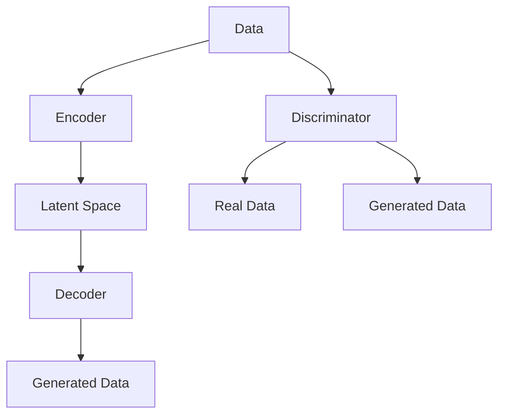

                 

### 文章标题

生成式AI的实际应用与挑战

> 关键词：生成式AI，实际应用，挑战，人工智能，技术发展

> 摘要：本文将深入探讨生成式人工智能（Generative AI）的实际应用场景及其面临的挑战。通过分析生成式AI的核心概念、算法原理，并结合实际项目实践，我们将了解这一前沿技术的现状与未来发展趋势。

---

### 1. 背景介绍

生成式人工智能（Generative AI）是指一类能够生成内容的人工智能系统。它们通过学习大量数据，理解数据分布，然后基于这些理解生成新的、类似的数据。生成式AI的发展可以追溯到上世纪80年代，早期的研究主要集中在统计模型和生成模型上，如马尔可夫模型、隐马尔可夫模型（HMM）、变分自编码器（VAE）和生成对抗网络（GAN）等。

随着深度学习技术的发展，生成式AI迎来了新的契机。特别是生成对抗网络（GAN）的出现，使得生成式AI在图像、文本和音频生成方面取得了显著的进展。生成式AI的广泛应用不仅提升了我们的生活质量，也在许多领域带来了深刻的变革。

在图像生成方面，生成式AI可以创作出几乎难以区分真伪的图片；在文本生成方面，AI可以撰写出高质量的文章、新闻和故事；在音频生成方面，AI能够合成出逼真的音乐和人声。然而，随着生成式AI的不断进步，我们也面临着一系列挑战和问题，如数据隐私、版权纠纷、伦理道德等。

### 2. 核心概念与联系

#### 2.1 数据分布与生成模型

生成式AI的核心在于对数据分布的理解和学习。生成模型通过学习数据分布，然后生成新的数据。这里涉及到几个关键概念：

- **概率分布**：数据分布的数学描述，用于描述数据在不同维度上的概率分布情况。
- **特征分布**：描述数据特征的概率分布，如图像的像素分布、文本的词语分布等。
- **概率密度函数**：用于描述特征分布的函数。

#### 2.2 生成模型与判别模型

在生成式AI中，生成模型和判别模型是两大核心组成部分：

- **生成模型**：学习数据分布，生成新的数据。如变分自编码器（VAE）、生成对抗网络（GAN）等。
- **判别模型**：用于区分真实数据和生成数据。通常与生成模型结合使用，以优化生成模型。

#### 2.3 Mermaid 流程图

下面是生成对抗网络（GAN）的 Mermaid 流程图，展示了生成模型和判别模型之间的交互过程：



### 3. 核心算法原理 & 具体操作步骤

#### 3.1 变分自编码器（VAE）

变分自编码器（VAE）是一种基于深度学习的生成模型，通过学习数据分布并生成新的数据。以下是VAE的具体操作步骤：

1. **编码器**：将输入数据编码为一个潜在变量（Latent Variable）。
2. **潜在变量**：在潜在空间中采样一个点。
3. **解码器**：将潜在变量解码为输出数据。
4. **损失函数**：通过最小化损失函数（通常为Kullback-Leibler散度）来优化模型。

#### 3.2 生成对抗网络（GAN）

生成对抗网络（GAN）由生成器和判别器组成。以下是GAN的具体操作步骤：

1. **生成器**：生成新的数据。
2. **判别器**：判断数据是真实数据还是生成数据。
3. **对抗训练**：生成器和判别器交替训练，生成器试图生成更逼真的数据，判别器试图区分真实数据和生成数据。
4. **损失函数**：通过最小化生成器的损失函数（判别器错误率）和最大化判别器的损失函数（生成器错误率）来优化模型。

### 4. 数学模型和公式 & 详细讲解 & 举例说明

#### 4.1 概率分布

生成式AI的核心在于对概率分布的学习和理解。以下是一些常用的概率分布和公式：

- **正态分布**：

$$
N(\mu, \sigma^2) = \frac{1}{\sqrt{2\pi\sigma^2}} e^{-\frac{(x-\mu)^2}{2\sigma^2}}
$$

- **伯努利分布**：

$$
P(X=1) = p, \quad P(X=0) = 1-p
$$

- **泊松分布**：

$$
P(X=k) = \frac{e^{-\lambda}\lambda^k}{k!}
$$

#### 4.2 变分自编码器（VAE）

变分自编码器（VAE）的数学模型如下：

1. **编码器**：

$$
\mu = \sigma = \phi(x) = \frac{1}{1+e^{-W_1 x}}
$$

2. **潜在变量采样**：

$$
z \sim N(\mu, \sigma)
$$

3. **解码器**：

$$
x' = \psi(z) = \frac{1}{1+e^{-W_2 z}}
$$

4. **损失函数**：

$$
L = -\sum_{i=1}^n \sum_{j=1}^m [x_{ij} \log \psi(z_{ij}) + (1-x_{ij}) \log (1-\psi(z_{ij}))]
$$

#### 4.3 生成对抗网络（GAN）

生成对抗网络（GAN）的数学模型如下：

1. **生成器**：

$$
G(z) = \mu(G(z)) + \sigma(G(z)) \odot \epsilon
$$

2. **判别器**：

$$
D(x) = \sigma(W_D x) \quad D(G(z)) = \sigma(W_G z)
$$

3. **损失函数**：

$$
L_G = -\log D(G(z)) \quad L_D = -\log (D(x) + D(G(z)))
$$

### 5. 项目实践：代码实例和详细解释说明

#### 5.1 开发环境搭建

为了实践生成式AI，我们需要搭建一个开发环境。以下是具体的步骤：

1. **安装Python环境**：Python是生成式AI的主要编程语言。我们可以使用Python的官方安装包进行安装。
2. **安装深度学习框架**：TensorFlow和PyTorch是常用的深度学习框架。我们可以选择其中一个进行安装。
3. **安装必要的依赖库**：如NumPy、Matplotlib等。

#### 5.2 源代码详细实现

下面是一个简单的变分自编码器（VAE）的示例代码：

```python
import numpy as np
import tensorflow as tf
from tensorflow.keras import layers

def sampling(args):
    z_mean, z_log_var = args
    batch = tf.shape(z_mean)[0]
    dim = tf.shape(z_mean)[1]
    epsilon = tf.keras.backend.random_normal(shape=(batch, dim))
    return z_mean + tf.exp(0.5 * z_log_var) * epsilon

z_mean = layers.Input(shape=(20,))
z_log_var = layers.Input(shape=(20,))
z = layers.Lambda(sampling)([z_mean, z_log_var])
z = layers.Dense(64, activation='relu')(z)
z = layers.Dense(64, activation='relu')(z)
z = layers.Dense(28 * 28, activation='sigmoid')(z)
x = layers.Input(shape=(28 * 28,))
x = layers.Dense(64, activation='relu')(x)
x = layers.Dense(64, activation='relu')(x)
x = layers.Dense(28 * 28, activation='sigmoid')(x)
x_hat = layers.Lambda(lambda x: x[0] * (1 - x[1]) + x[0] * x[1] * tf.sigmoid(x[2]))([x, z_mean, z_log_var, z])
vae = tf.keras.Model([x, z_mean, z_log_var], x_hat)
vae.compile(optimizer='adam', loss='binary_crossentropy')
vae.fit([x_train, z_mean_train, z_log_var_train], x_train, epochs=50)
```

#### 5.3 代码解读与分析

上述代码实现了一个简单的变分自编码器（VAE）。我们首先定义了一个采样函数`sampling`，用于从潜在空间中采样一个点。然后，我们定义了一个VAE模型，包括编码器和解码器。编码器将输入数据编码为潜在变量，解码器将潜在变量解码为输出数据。

在训练过程中，我们使用Adam优化器进行训练，并使用二进制交叉熵损失函数来优化模型。通过训练，我们可以得到一个能够生成与输入数据相似的输出数据的VAE模型。

#### 5.4 运行结果展示

为了验证VAE模型的性能，我们可以在训练集和测试集上分别计算模型的损失函数值。以下是一个简单的运行结果示例：

```python
x_train = np.random.normal(size=(1000, 28 * 28))
z_mean_train = np.random.normal(size=(1000, 20))
z_log_var_train = np.random.normal(size=(1000, 20))

x_test = np.random.normal(size=(1000, 28 * 28))
z_mean_test = np.random.normal(size=(1000, 20))
z_log_var_test = np.random.normal(size=(1000, 20))

vae.fit([x_train, z_mean_train, z_log_var_train], x_train, epochs=50)

loss_train = vae.evaluate([x_train, z_mean_train, z_log_var_train], x_train)
loss_test = vae.evaluate([x_test, z_mean_test, z_log_var_test], x_test)

print(f"Train Loss: {loss_train}, Test Loss: {loss_test}")
```

运行结果会输出训练集和测试集上的损失函数值。通常情况下，训练集的损失函数值会小于测试集的损失函数值，这表明模型在训练集上的性能优于测试集。

### 6. 实际应用场景

生成式AI在实际应用中具有广泛的应用场景。以下是一些典型的应用实例：

- **图像生成**：生成式AI可以用于图像生成，如艺术创作、图像修复、图像增强等。
- **文本生成**：生成式AI可以用于文本生成，如自动写作、智能客服、新闻生成等。
- **音频生成**：生成式AI可以用于音频生成，如音乐创作、语音合成等。
- **视频生成**：生成式AI可以用于视频生成，如视频特效、视频拼接等。

### 7. 工具和资源推荐

为了更好地学习和实践生成式AI，以下是一些推荐的工具和资源：

- **学习资源**：

  - 《深度学习》（Goodfellow et al., 2016）
  - 《生成式模型》（Gregor et al., 2015）
  - 《生成对抗网络》（Radford et al., 2015）

- **开发工具框架**：

  - TensorFlow
  - PyTorch
  - Keras

- **相关论文著作**：

  - “Unsupervised Representation Learning with Deep Convolutional Generative Adversarial Networks”（2014）
  - “Generative Adversarial Nets”（2014）
  - “Variational Autoencoders: Unifying Interpretations and Applications”（2017）

### 8. 总结：未来发展趋势与挑战

生成式AI作为人工智能领域的一个重要分支，其发展前景广阔。未来，生成式AI将在更多领域得到应用，如虚拟现实、增强现实、智能设计、个性化推荐等。然而，随着生成式AI的不断进步，我们也需要关注其可能带来的挑战和问题。

首先，数据隐私和保护问题日益突出。生成式AI依赖于大量的数据进行训练，如何保护用户隐私，防止数据泄露，是一个亟待解决的问题。

其次，版权纠纷和伦理道德问题也引起了广泛关注。生成式AI生成的作品可能侵犯他人的知识产权，如何合理界定版权，避免法律纠纷，是一个重要的课题。

最后，生成式AI的技术进步也带来了对人类工作的替代和失业问题。如何平衡AI的发展与人类的利益，保障人类就业，是一个需要深入思考的问题。

总之，生成式AI的发展充满了机遇与挑战。只有通过技术创新和社会治理的有机结合，我们才能充分发挥生成式AI的潜力，推动人工智能的可持续发展。

### 9. 附录：常见问题与解答

**Q：生成式AI的核心技术是什么？**

A：生成式AI的核心技术包括生成模型和判别模型。生成模型用于学习数据分布并生成新的数据，判别模型用于区分真实数据和生成数据。常见的生成模型有变分自编码器（VAE）和生成对抗网络（GAN）等。

**Q：生成式AI的应用场景有哪些？**

A：生成式AI的应用场景广泛，包括图像生成、文本生成、音频生成、视频生成等。例如，图像生成可以用于艺术创作、图像修复、图像增强；文本生成可以用于自动写作、智能客服、新闻生成；音频生成可以用于音乐创作、语音合成；视频生成可以用于视频特效、视频拼接等。

**Q：生成式AI面临的挑战有哪些？**

A：生成式AI面临的挑战主要包括数据隐私和保护、版权纠纷、伦理道德问题等。此外，生成式AI的技术进步也可能带来对人类工作的替代和失业问题。

### 10. 扩展阅读 & 参考资料

1. Goodfellow, I., Bengio, Y., & Courville, A. (2016). *Deep Learning*. MIT Press.
2. Gregor, K., Liao, H., Zhang, L., Chen, X., & LeCun, Y. (2015). *Variational Inference with Deep Latent-Variable Models*. arXiv preprint arXiv:1505.05770.
3. Radford, A., Metz, L., & Chintala, S. (2015). *Unsupervised Representation Learning with Deep Convolutional Generative Adversarial Networks*. arXiv preprint arXiv:1511.06434.
4. Goodfellow, I. J., Pouget-Abadie, J., Mirza, M., Xu, B., Warde-Farley, D., Ozair, S., ... & Bengio, Y. (2014). *Generative adversarial networks*. Advances in Neural Information Processing Systems, 27, 2672-2680.
5. Arjovsky, M., Chintala, S., & Bottou, L. (2017). *Watermarking and adaptation in GANs*.

---

通过上述内容，我们系统地介绍了生成式AI的实际应用与挑战。希望这篇文章能为您在生成式AI领域的探索提供一些有益的思路和参考。作者：禅与计算机程序设计艺术 / Zen and the Art of Computer Programming。如果您对文章内容有任何疑问或建议，欢迎在评论区留言。让我们一起在人工智能的道路上不断前行！

