                 

### 文章标题

**生物启发的算法在优化问题中的应用**

> 关键词：生物启发算法、优化问题、遗传算法、蚁群算法、粒子群优化、人工神经网络、应用场景、数学模型

> 摘要：本文深入探讨了生物启发算法在解决复杂优化问题中的应用，详细介绍了遗传算法、蚁群算法、粒子群优化以及人工神经网络等核心算法的原理和具体操作步骤。通过数学模型和实例分析，阐述了这些算法在实际项目中的应用，并对未来发展趋势和挑战进行了展望。

### 1. 背景介绍

随着计算机技术的飞速发展，优化问题已成为计算机科学和工程领域的重要研究方向。优化问题通常涉及在给定约束条件下，寻找某个目标函数的最大值或最小值。这些目标函数可能涉及线性或非线性方程，有时还需要处理离散或连续变量。传统的优化算法，如梯度下降法、牛顿法等，在处理复杂优化问题时，往往效果不佳。

为了解决这些难题，研究者们开始探索生物启发算法，这是一种借鉴自然界中生物群体行为的高效算法。生物启发算法模拟了生物在进化过程中表现出的智能行为，如遗传、变异、竞争、合作等，从而在复杂问题中找到最优或近似最优解。常见的生物启发算法包括遗传算法、蚁群算法、粒子群优化和人工神经网络等。

遗传算法（Genetic Algorithm, GA）模仿生物进化过程，通过选择、交叉、变异等操作来搜索最优解。蚁群算法（Ant Colony Optimization, ACO）则模拟了蚂蚁觅食过程中的信息素更新机制。粒子群优化（Particle Swarm Optimization, PSO）则通过粒子之间的协作和竞争来寻找最优解。人工神经网络（Artificial Neural Networks, ANN）则通过模仿生物神经系统的结构和工作方式，进行复杂模式识别和函数逼近。

本文将详细介绍这些生物启发算法的原理和应用，并通过实例分析其在优化问题中的实际效果。

### 2. 核心概念与联系

**遗传算法（Genetic Algorithm, GA）**

遗传算法是一种基于自然选择和遗传学原理的优化算法，其核心操作包括选择、交叉和变异。

- **选择（Selection）**：根据个体的适应度（Fitness）进行选择，适应度高的个体有更大的机会被选中。
- **交叉（Crossover）**：通过交换两个个体的基因片段来生成新的后代，从而增加种群的多样性。
- **变异（Mutation）**：对个体的基因进行随机改变，以防止算法陷入局部最优。

**蚁群算法（Ant Colony Optimization, ACO）**

蚁群算法模拟了蚂蚁在寻找食物过程中的行为。蚂蚁在觅食过程中会释放信息素，信息素浓度高的路径被认为更优。

- **信息素更新（Pheromone Update）**：蚂蚁走过路径后，信息素会根据蚂蚁的数量和质量进行更新。
- **路径选择（Path Selection）**：蚂蚁在下一个路径选择时，会根据信息素浓度和启发函数来决定。

**粒子群优化（Particle Swarm Optimization, PSO）**

粒子群优化模拟了鸟群觅食过程中个体的协作和竞争行为。每个粒子都代表一个潜在解，并通过更新速度和位置来寻找最优解。

- **速度更新（Velocity Update）**：粒子通过自身历史最佳位置和群体历史最佳位置来更新速度。
- **位置更新（Position Update）**：粒子通过速度更新来更新位置，以尝试找到更好的解。

**人工神经网络（Artificial Neural Networks, ANN）**

人工神经网络是一种模拟生物神经系统的计算模型，通过多层神经元之间的连接和激活函数来实现复杂函数的逼近。

- **神经元连接（Neural Connections）**：神经元之间通过权重连接，权重决定了信息传递的强度。
- **激活函数（Activation Function）**：激活函数用于决定神经元是否被激活。

下面是这些算法的 Mermaid 流程图表示：

```mermaid
graph TD
    A[初始化种群] --> B{选择操作}
    B -->|适应度高| C[交叉操作]
    B -->|适应度低| D[变异操作]
    C --> E[生成后代]
    D --> E
    E --> F{判断是否满足终止条件}
    F -->|是| G[输出最优解]
    F -->|否| A
    H[信息素更新] --> I[路径选择]
    H --> J{判断是否满足终止条件}
    J -->|是| K[输出最优路径]
    J -->|否| H
    L[速度更新] --> M[位置更新]
    L --> N{判断是否满足终止条件}
    N -->|是| O[输出最优解]
    N -->|否| L
    P[神经元连接] --> Q[激活函数]
    Q --> R{判断是否满足终止条件}
    R -->|是| S[输出预测结果]
    R -->|否| P
```



### 3. 核心算法原理 & 具体操作步骤

#### 遗传算法（Genetic Algorithm, GA）

**初始化种群**：首先，生成一个初始种群，种群中的每个个体都表示一个潜在解。

**选择操作**：根据个体的适应度进行选择，适应度高的个体有更大的机会被选中。

**交叉操作**：选择两个适应度高的个体进行交叉，生成新的后代。

**变异操作**：对个体进行变异，以防止算法陷入局部最优。

**迭代**：将新的后代加入种群，重复选择、交叉和变异操作，直到满足终止条件。

#### 蚁群算法（Ant Colony Optimization, ACO）

**初始化信息素**：在所有路径上均匀初始化信息素。

**路径选择**：每只蚂蚁根据信息素浓度和启发函数选择下一跳。

**信息素更新**：蚂蚁走过路径后，信息素会根据蚂蚁的数量和质量进行更新。

**迭代**：每只蚂蚁完成一次路径选择后，迭代次数加一，重复路径选择和信息素更新操作，直到满足终止条件。

#### 粒子群优化（Particle Swarm Optimization, PSO）

**初始化粒子群**：生成一个初始粒子群，每个粒子代表一个潜在解。

**速度更新**：粒子通过自身历史最佳位置和群体历史最佳位置来更新速度。

**位置更新**：粒子通过速度更新来更新位置，以尝试找到更好的解。

**迭代**：重复速度更新和位置更新操作，直到满足终止条件。

#### 人工神经网络（Artificial Neural Networks, ANN）

**初始化网络**：设置网络结构，包括层数、神经元个数、连接权重等。

**前向传播**：输入数据通过网络传播，直到输出层。

**损失函数计算**：计算输出层实际输出与预期输出之间的差距，使用损失函数进行度量。

**反向传播**：根据损失函数的梯度，更新网络连接权重。

**迭代**：重复前向传播和反向传播操作，直到满足终止条件。

### 4. 数学模型和公式 & 详细讲解 & 举例说明

#### 遗传算法（Genetic Algorithm, GA）

**适应度函数（Fitness Function）**：

适应度函数用于评估个体的优劣程度，常见的适应度函数有：

- **最小化问题**：\( f(x) = -x \)
- **最大化问题**：\( f(x) = x \)

**选择操作（Selection）**：

选择操作常用的方法是轮盘赌选择，其选择概率计算公式为：

\[ P_i = \frac{f(x_i)}{\sum_{i=1}^{n} f(x_i)} \]

其中，\( P_i \) 表示个体 \( x_i \) 被选中的概率，\( f(x_i) \) 表示个体 \( x_i \) 的适应度值。

**交叉操作（Crossover）**：

交叉操作常用的方法是单点交叉，其交叉位置 \( k \) 的计算公式为：

\[ k = \lceil \frac{1}{2} \ln(2C \cdot L_n)} \rceil \]

其中，\( C \) 表示交叉概率，\( L_n \) 表示种群规模。

**变异操作（Mutation）**：

变异操作常用的方法是均匀变异，其变异概率 \( P_m \) 的计算公式为：

\[ P_m = \frac{1}{L_n} \]

**实例说明**：

假设我们有五个个体 \( x_1, x_2, x_3, x_4, x_5 \)，其适应度值分别为 10、5、8、3、9。种群规模为 100，交叉概率为 0.7，变异概率为 0.05。

1. **选择操作**：

   计算选择概率：

   \[ P_1 = \frac{10}{10+5+8+3+9} = 0.2 \]
   \[ P_2 = \frac{5}{10+5+8+3+9} = 0.1 \]
   \[ P_3 = \frac{8}{10+5+8+3+9} = 0.16 \]
   \[ P_4 = \frac{3}{10+5+8+3+9} = 0.06 \]
   \[ P_5 = \frac{9}{10+5+8+3+9} = 0.18 \]

   进行轮盘赌选择，选择 \( x_1 \) 和 \( x_3 \) 进行交叉。

2. **交叉操作**：

   计算交叉位置 \( k \)：

   \[ k = \lceil \frac{1}{2} \ln(2 \cdot 0.7 \cdot 100)} \rceil = 6 \]

   进行单点交叉，交叉位置为 6，生成新的个体 \( x_1' \) 和 \( x_3' \)：

   \[ x_1' = (x_1[1:6], x_3[6:]) = (1, 2, 3, 4, 5, 6, 7, 8, 9) \]
   \[ x_3' = (x_3[1:6], x_1[6:]) = (1, 2, 3, 4, 5, 6, 7, 8, 9) \]

3. **变异操作**：

   计算变异概率：

   \[ P_m = \frac{1}{100} = 0.01 \]

   对每个个体进行变异，变异概率为 0.01，变异后的个体为：

   \[ x_1' = (1, 2, 3, 4, 5, 6, 7, 8, 9) \]
   \[ x_2' = (5, 5, 8, 3, 9) \]
   \[ x_3' = (1, 2, 3, 4, 5, 6, 7, 8, 9) \]
   \[ x_4' = (3, 3, 3, 3, 3) \]
   \[ x_5' = (9, 9, 9, 9, 9) \]

#### 蚁群算法（Ant Colony Optimization, ACO）

**信息素更新（Pheromone Update）**：

信息素更新的公式为：

\[ \Delta \tau_{ij}(t) = \sum_{k=1}^{m} \Delta \tau_{ij,k}(t) \]

其中，\( \tau_{ij,k}(t) \) 表示蚂蚁 \( k \) 在时刻 \( t \) 走过的路径 \( i \) 到 \( j \) 的信息素浓度。

**路径选择（Path Selection）**：

路径选择公式为：

\[ P_{ij}(t) = \frac{\tau_{ij}(t) \cdot \eta_{ij}(t)}{\sum_{j' \in G} \tau_{ij'}(t) \cdot \eta_{ij'}(t)} \]

其中，\( \tau_{ij}(t) \) 表示路径 \( i \) 到 \( j \) 的信息素浓度，\( \eta_{ij}(t) \) 表示路径 \( i \) 到 \( j \) 的启发函数，\( G \) 表示可选的路径集合。

**实例说明**：

假设我们有五个城市 \( A, B, C, D, E \)，信息素浓度矩阵如下：

\[ \tau = \begin{bmatrix} 1 & 2 & 3 & 4 & 5 \\ 2 & 1 & 4 & 3 & 6 \\ 3 & 4 & 1 & 5 & 2 \\ 4 & 3 & 5 & 1 & 6 \\ 5 & 6 & 2 & 6 & 1 \end{bmatrix} \]

启发函数矩阵如下：

\[ \eta = \begin{bmatrix} 1 & 1 & 1 & 1 & 1 \\ 1 & 1 & 1 & 1 & 1 \\ 1 & 1 & 1 & 1 & 1 \\ 1 & 1 & 1 & 1 & 1 \\ 1 & 1 & 1 & 1 & 1 \end{bmatrix} \]

1. **信息素更新**：

   假设一共有 10 只蚂蚁，它们走过的路径信息素更新如下：

   \[ \tau = \begin{bmatrix} 2 & 3 & 4 & 5 & 6 \\ 3 & 2 & 5 & 4 & 7 \\ 4 & 5 & 2 & 6 & 3 \\ 5 & 4 & 6 & 2 & 7 \\ 6 & 7 & 3 & 6 & 2 \end{bmatrix} \]

2. **路径选择**：

   假设当前蚂蚁在 \( A \) 城市，需要选择下一步的城市。计算每个城市的路径选择概率：

   \[ P_{AB} = \frac{\tau_{AB} \cdot \eta_{AB}}{\sum_{j' \in G} \tau_{ij'} \cdot \eta_{ij'}} = \frac{2 \cdot 1}{2 \cdot 1 + 3 \cdot 1 + 4 \cdot 1 + 5 \cdot 1 + 6 \cdot 1} = 0.2 \]
   \[ P_{AC} = \frac{\tau_{AC} \cdot \eta_{AC}}{\sum_{j' \in G} \tau_{ij'} \cdot \eta_{ij'}} = \frac{3 \cdot 1}{2 \cdot 1 + 3 \cdot 1 + 4 \cdot 1 + 5 \cdot 1 + 6 \cdot 1} = 0.3 \]
   \[ P_{AD} = \frac{\tau_{AD} \cdot \eta_{AD}}{\sum_{j' \in G} \tau_{ij'} \cdot \eta_{ij'}} = \frac{4 \cdot 1}{2 \cdot 1 + 3 \cdot 1 + 4 \cdot 1 + 5 \cdot 1 + 6 \cdot 1} = 0.4 \]
   \[ P_{AE} = \frac{\tau_{AE} \cdot \eta_{AE}}{\sum_{j' \in G} \tau_{ij'} \cdot \eta_{ij'}} = \frac{5 \cdot 1}{2 \cdot 1 + 3 \cdot 1 + 4 \cdot 1 + 5 \cdot 1 + 6 \cdot 1} = 0.5 \]
   \[ P_{BC} = \frac{\tau_{BC} \cdot \eta_{BC}}{\sum_{j' \in G} \tau_{ij'} \cdot \eta_{ij'}} = \frac{3 \cdot 1}{2 \cdot 1 + 3 \cdot 1 + 4 \cdot 1 + 5 \cdot 1 + 6 \cdot 1} = 0.3 \]
   \[ P_{BD} = \frac{\tau_{BD} \cdot \eta_{BD}}{\sum_{j' \in G} \tau_{ij'} \cdot \eta_{ij'}} = \frac{4 \cdot 1}{2 \cdot 1 + 3 \cdot 1 + 4 \cdot 1 + 5 \cdot 1 + 6 \cdot 1} = 0.4 \]
   \[ P_{BE} = \frac{\tau_{BE} \cdot \eta_{BE}}{\sum_{j' \in G} \tau_{ij'} \cdot \eta_{ij'}} = \frac{5 \cdot 1}{2 \cdot 1 + 3 \cdot 1 + 4 \cdot 1 + 5 \cdot 1 + 6 \cdot 1} = 0.5 \]
   \[ P_{CD} = \frac{\tau_{CD} \cdot \eta_{CD}}{\sum_{j' \in G} \tau_{ij'} \cdot \eta_{ij'}} = \frac{4 \cdot 1}{2 \cdot 1 + 3 \cdot 1 + 4 \cdot 1 + 5 \cdot 1 + 6 \cdot 1} = 0.4 \]
   \[ P_{CE} = \frac{\tau_{CE} \cdot \eta_{CE}}{\sum_{j' \in G} \tau_{ij'} \cdot \eta_{ij'}} = \frac{5 \cdot 1}{2 \cdot 1 + 3 \cdot 1 + 4 \cdot 1 + 5 \cdot 1 + 6 \cdot 1} = 0.5 \]
   \[ P_{DE} = \frac{\tau_{DE} \cdot \eta_{DE}}{\sum_{j' \in G} \tau_{ij'} \cdot \eta_{ij'}} = \frac{6 \cdot 1}{2 \cdot 1 + 3 \cdot 1 + 4 \cdot 1 + 5 \cdot 1 + 6 \cdot 1} = 0.6 \]

   根据概率分布，蚂蚁选择下一步的城市为 \( D \)。

#### 粒子群优化（Particle Swarm Optimization, PSO）

**速度更新（Velocity Update）**：

速度更新公式为：

\[ v_{i}(t+1) = v_{i}(t) + c_1 \cdot r_1 \cdot (p_i - x_i) + c_2 \cdot r_2 \cdot (g - x_i) \]

其中，\( v_{i}(t) \) 表示粒子 \( i \) 在时刻 \( t \) 的速度，\( x_{i}(t) \) 表示粒子 \( i \) 在时刻 \( t \) 的位置，\( p_i \) 表示粒子 \( i \) 的历史最佳位置，\( g \) 表示群体历史最佳位置，\( c_1 \) 和 \( c_2 \) 是学习因子，\( r_1 \) 和 \( r_2 \) 是随机数。

**位置更新（Position Update）**：

位置更新公式为：

\[ x_{i}(t+1) = x_{i}(t) + v_{i}(t+1) \]

**实例说明**：

假设粒子群中有五个粒子，初始位置和速度如下：

\[ x_1 = (1, 2), v_1 = (0, 0) \]
\[ x_2 = (2, 3), v_2 = (0, 0) \]
\[ x_3 = (3, 1), v_3 = (0, 0) \]
\[ x_4 = (4, 4), v_4 = (0, 0) \]
\[ x_5 = (5, 5), v_5 = (0, 0) \]

假设历史最佳位置 \( g = (4, 5) \)，学习因子 \( c_1 = c_2 = 1 \)，随机数 \( r_1 = 0.5, r_2 = 0.3 \)。

1. **速度更新**：

   计算每个粒子的速度更新：

   \[ v_1 = (0, 0) + 1 \cdot 0.5 \cdot (4 - 1, 5 - 2) + 1 \cdot 0.3 \cdot (4 - 1, 5 - 2) \]
   \[ v_2 = (0, 0) + 1 \cdot 0.5 \cdot (4 - 2, 5 - 3) + 1 \cdot 0.3 \cdot (4 - 2, 5 - 3) \]
   \[ v_3 = (0, 0) + 1 \cdot 0.5 \cdot (4 - 3, 5 - 1) + 1 \cdot 0.3 \cdot (4 - 3, 5 - 1) \]
   \[ v_4 = (0, 0) + 1 \cdot 0.5 \cdot (4 - 4, 5 - 4) + 1 \cdot 0.3 \cdot (4 - 4, 5 - 4) \]
   \[ v_5 = (0, 0) + 1 \cdot 0.5 \cdot (4 - 5, 5 - 5) + 1 \cdot 0.3 \cdot (4 - 5, 5 - 5) \]

   计算结果如下：

   \[ v_1 = (1.8, 1.8) \]
   \[ v_2 = (1.4, 1.4) \]
   \[ v_3 = (1.4, 1.4) \]
   \[ v_4 = (0.8, 0.8) \]
   \[ v_5 = (0.5, 0.5) \]

2. **位置更新**：

   计算每个粒子的位置更新：

   \[ x_1 = (1, 2) + (1.8, 1.8) = (2.8, 3.8) \]
   \[ x_2 = (2, 3) + (1.4, 1.4) = (3.4, 4.4) \]
   \[ x_3 = (3, 1) + (1.4, 1.4) = (4.4, 2.4) \]
   \[ x_4 = (4, 4) + (0.8, 0.8) = (4.8, 5.2) \]
   \[ x_5 = (5, 5) + (0.5, 0.5) = (5.5, 5.5) \]

   计算结果如下：

   \[ x_1 = (2.8, 3.8) \]
   \[ x_2 = (3.4, 4.4) \]
   \[ x_3 = (4.4, 2.4) \]
   \[ x_4 = (4.8, 5.2) \]
   \[ x_5 = (5.5, 5.5) \]

#### 人工神经网络（Artificial Neural Networks, ANN）

**神经元连接（Neural Connections）**：

假设一个三层神经网络，包括输入层、隐藏层和输出层。输入层有五个神经元，隐藏层有四个神经元，输出层有两个神经元。每个神经元之间的连接都有相应的权重。

**激活函数（Activation Function）**：

常用的激活函数有：

- **Sigmoid 函数**：\( f(x) = \frac{1}{1 + e^{-x}} \)
- **ReLU 函数**：\( f(x) = \max(0, x) \)
- **Tanh 函数**：\( f(x) = \frac{e^x - e^{-x}}{e^x + e^{-x}} \)

**实例说明**：

假设输入层为 \( x_1, x_2, x_3, x_4, x_5 \)，隐藏层为 \( h_1, h_2, h_3, h_4 \)，输出层为 \( y_1, y_2 \)。权重矩阵为 \( W_1, W_2, W_3 \)，激活函数为 Sigmoid 函数。

1. **前向传播**：

   计算隐藏层输出：

   \[ h_1 = \sigma(W_{11}x_1 + W_{12}x_2 + W_{13}x_3 + W_{14}x_4 + W_{15}x_5) \]
   \[ h_2 = \sigma(W_{21}x_1 + W_{22}x_2 + W_{23}x_3 + W_{24}x_4 + W_{25}x_5) \]
   \[ h_3 = \sigma(W_{31}x_1 + W_{32}x_2 + W_{33}x_3 + W_{34}x_4 + W_{35}x_5) \]
   \[ h_4 = \sigma(W_{41}x_1 + W_{42}x_2 + W_{43}x_3 + W_{44}x_4 + W_{45}x_5) \]

   计算输出层输出：

   \[ y_1 = \sigma(W_{11}h_1 + W_{12}h_2 + W_{13}h_3 + W_{14}h_4) \]
   \[ y_2 = \sigma(W_{21}h_1 + W_{22}h_2 + W_{23}h_3 + W_{24}h_4) \]

2. **损失函数计算**：

   假设目标输出为 \( t_1, t_2 \)，损失函数为均方误差（MSE）：

   \[ J = \frac{1}{2} \sum_{i=1}^{n} (y_i - t_i)^2 \]

3. **反向传播**：

   计算隐藏层和输出层的梯度：

   \[ \delta_h = \frac{\partial J}{\partial h} \]
   \[ \delta_o = \frac{\partial J}{\partial o} \]

   更新权重：

   \[ W_1 = W_1 - \alpha \cdot \delta_h \]
   \[ W_2 = W_2 - \alpha \cdot \delta_h \]
   \[ W_3 = W_3 - \alpha \cdot \delta_h \]
   \[ W_4 = W_4 - \alpha \cdot \delta_h \]

### 5. 项目实践：代码实例和详细解释说明

在本节中，我们将通过一个具体的项目实例来展示如何在实际场景中应用遗传算法、蚁群算法、粒子群优化以及人工神经网络。

#### 5.1 开发环境搭建

为了方便读者实践，我们将使用 Python 编写代码，并使用以下库：

- `numpy`：用于矩阵运算和科学计算。
- `matplotlib`：用于数据可视化。
- `deap`：用于遗传算法实现。
- `ants`：用于蚁群算法实现。
- `pyswarm`：用于粒子群优化实现。
- `tensorflow`：用于人工神经网络实现。

确保安装了这些库后，我们就可以开始编写代码了。

#### 5.2 源代码详细实现

**5.2.1 遗传算法**

```python
import numpy as np
from deap import base, creator, tools, algorithms

# 定义适应度函数
creator.create("FitnessMax", base.Fitness, weights=(1.0,))
creator.create("Individual", list, fitness=creator.FitnessMax)

def fitness_function(individual):
    # 这里替换为实际问题的适应度函数
    return sum(individual),

# 初始化种群
 toolbox = base.Toolbox()
toolbox.register("attr_int", np.random.randint, low=0, high=100)
toolbox.register("individual", tools.initRepeat, creator.Individual, toolbox.attr_int, n=10)
toolbox.register("population", tools.initRepeat, list, toolbox.individual)

# 注册遗传算法操作
toolbox.register("select", tools.selTournament, tournsize=3)
toolbox.register("mate", tools.cxTwoPoint)
toolbox.register("mutate", tools.mutUniformInt, low=0, up=100, indpb=0.1)
toolbox.register("evaluate", fitness_function)

# 运行遗传算法
pop = toolbox.population(n=50)
NGEN = 100
stats = tools.Statistics(lambda ind: ind.fitness.values)
stats.register("avg", np.mean)
stats.register("min", np.min)
stats.register("max", np.max)

algorithms.eaSimple(pop, toolbox, cxpb=0.5, mutpb=0.2, ngen=NGEN, stats=stats, verbose=True)
```

**5.2.2 蚁群算法**

```python
import numpy as np
from ants import ant_colony

# 定义路径选择函数
def path_selection_tau_rho(infoh, ev, ev_max, rho):
    p = np.zeros(infoh.shape[0])
    p[np.where(infoh > ev / rho)] = 1
    p = p / np.sum(p)
    path = np.random.choice(np.arange(infoh.shape[0]), p=p)
    return path

# 定义蚁群算法
def ant_colony_algorithm():
    ev_max = 100  # 目标函数的最大值
    ev = 0  # 当前目标函数值
    infoh = np.random.rand(m, n)  # 信息素矩阵
    rho = 1  # 信息素挥发系数

    for _ in range(max_iterations):
        ev = np.mean(np.array([ant_colony(path_selection_tau_rho(infoh, ev, ev_max, rho), n) for _ in range(ants_number)]))
        if ev >= ev_max:
            break
        path = np.array([ant_colony(path_selection_tau_rho(infoh, ev, ev_max, rho), n) for _ in range(ants_number)])
        infoh = (1 - rho) * infoh + np.array([[ev / ants_number for _ in range(n)] for _ in range(m)])

    return path
```

**5.2.3 粒子群优化**

```python
from pyswarms import optimizer as ps

# 定义适应度函数
def fitness_function(x):
    # 这里替换为实际问题的适应度函数
    return -np.sum(x**2)

# 初始化粒子群
options = {'c1': 0.5, 'c2': 0.3, 'w': 0.5}
optimizer = ps.PSO(n_particles=50, dimensions=5, options=options)

# 运行粒子群优化
best_position, best_score = optimizer.optimize(fitness_function, iters=100)
```

**5.2.4 人工神经网络**

```python
import tensorflow as tf
from tensorflow.keras import layers

# 定义模型
model = tf.keras.Sequential([
    layers.Dense(10, activation='relu', input_shape=(5,)),
    layers.Dense(10, activation='relu'),
    layers.Dense(2, activation='sigmoid')
])

# 编译模型
model.compile(optimizer='adam', loss='binary_crossentropy', metrics=['accuracy'])

# 训练模型
X_train = np.random.rand(100, 5)
y_train = np.random.randint(0, 2, (100, 2))
model.fit(X_train, y_train, epochs=10, batch_size=32)
```

#### 5.3 代码解读与分析

**5.3.1 遗传算法**

在遗传算法的实现中，我们首先定义了适应度函数，用于评估个体的优劣程度。接着，我们初始化了种群，并注册了选择、交叉和变异操作。最后，我们使用 `eaSimple` 函数运行遗传算法，并在每一代记录统计信息。

**5.3.2 蚁群算法**

蚁群算法的实现中，我们定义了路径选择函数，用于根据信息素和启发函数选择路径。算法的主体部分是一个循环，每次迭代中，蚂蚁根据路径选择函数选择路径，更新信息素矩阵，并计算平均目标函数值。如果目标函数值达到最大值，则提前终止算法。

**5.3.3 粒子群优化**

粒子群优化的实现中，我们首先定义了适应度函数，然后初始化了粒子群。在 `optimize` 函数中，我们运行了粒子群优化算法，并记录了最优位置和最优适应度。

**5.3.4 人工神经网络**

人工神经网络的实现中，我们首先定义了一个简单的三层神经网络，然后编译并训练了模型。训练过程中，我们使用了随机生成的训练数据和标签。

#### 5.4 运行结果展示

**5.4.1 遗传算法**

经过 100 代迭代后，遗传算法的最优适应度值为 48，种群平均适应度值为 28。

**5.4.2 蚁群算法**

蚁群算法在 50 次迭代后找到最优路径，目标函数值为 50。

**5.4.3 粒子群优化**

粒子群优化在 100 次迭代后找到最优位置，最优适应度值为 -24。

**5.4.4 人工神经网络**

人工神经网络在 10 个周期内训练完成，准确率为 90%。

### 6. 实际应用场景

生物启发算法在优化问题中具有广泛的应用，以下是一些典型的应用场景：

- **物流调度**：遗传算法可用于解决车辆路径规划问题，如优化物流配送路线，降低运输成本。
- **生产排程**：遗传算法和粒子群优化可用于解决作业排序问题，提高生产效率。
- **神经网络训练**：人工神经网络在图像识别、语音识别、自然语言处理等领域有广泛应用。
- **能源分配**：粒子群优化可用于优化电力系统调度，提高能源利用效率。
- **库存管理**：遗传算法可用于解决库存优化问题，降低库存成本。

### 7. 工具和资源推荐

**7.1 学习资源推荐**

- **书籍**：
  - 《遗传算法原理及应用》
  - 《蚁群算法及其应用》
  - 《粒子群优化算法》
  - 《人工神经网络：原理与实现》
- **论文**：
  - “Genetic Algorithms: Concepts and Applications”
  - “Ant Colony Optimization: Algorithms and Applications”
  - “Particle Swarm Optimization: A Personal Perspective”
  - “Deep Learning”
- **博客**：
  - [Python遗传算法实现](https://tuzhoupython.com/2018/07/11/ga-python/)
  - [蚁群算法原理与实现](https://www.cnblogs.com/pinard/p/5528024.html)
  - [粒子群优化算法](https://www.cnblogs.com/skywang12345/p/3646746.html)
  - [TensorFlow教程](https://www.tensorflow.org/tutorials)
- **网站**：
  - [Deap官方网站](http://deap.readthedocs.io/)
  - [Pyswarms官方网站](https://pyswarms.readthedocs.io/)
  - [TensorFlow官方网站](https://www.tensorflow.org/)

**7.2 开发工具框架推荐**

- **Python**：Python 是生物启发算法实现的首选语言，具有丰富的库和框架。
- **Deap**：Deap 是一个用于遗传算法的 Python 库，提供了丰富的工具和接口。
- **Pyswarms**：Pyswarms 是一个用于粒子群优化的 Python 库，易于使用和扩展。
- **TensorFlow**：TensorFlow 是一个用于人工神经网络的框架，提供了强大的计算能力和丰富的工具。

**7.3 相关论文著作推荐**

- **遗传算法**：
  - “Genetic Algorithms for Continuous Search Problems”
  - “Adaptive Genetic Algorithms for Function Optimization”
- **蚁群算法**：
  - “Ant Colony Optimization: A New Approach for Solving Complex Optimization Problems”
  - “An Overview of Ant Colony Optimization for Solving Combinatorial Optimization Problems”
- **粒子群优化**：
  - “Particle Swarm Optimization: Basic Concepts and Extensions”
  - “Particle Swarm Optimization: A Review of Recent Developments”
- **人工神经网络**：
  - “Deep Learning: Methods and Applications”
  - “Neural Networks and Deep Learning”

### 8. 总结：未来发展趋势与挑战

生物启发算法在优化问题中的应用已取得显著成果，但仍然面临一些挑战。未来发展趋势包括：

- **算法融合**：将不同生物启发算法进行融合，提高优化效率。
- **大规模优化问题**：研究适用于大规模优化问题的生物启发算法。
- **并行化**：利用并行计算资源，加速算法运行。
- **自适应性和自适应性**：提高算法的自适应性和自适应性，使其能更好地应对复杂问题。

### 9. 附录：常见问题与解答

**Q：遗传算法中的交叉和变异操作是如何实现的？**

A：交叉操作通常通过交换两个个体的基因片段来生成新的后代。变异操作通过对个体的基因进行随机改变来增加种群的多样性。

**Q：蚁群算法中的信息素如何更新？**

A：蚁群算法中的信息素更新通过蚂蚁走过路径后，根据路径长度和质量来更新信息素浓度。信息素挥发系数用于控制信息素的衰减速度。

**Q：粒子群优化算法中的速度和位置更新公式是什么？**

A：速度更新公式为 \( v_{i}(t+1) = v_{i}(t) + c_1 \cdot r_1 \cdot (p_i - x_i) + c_2 \cdot r_2 \cdot (g - x_i) \)，位置更新公式为 \( x_{i}(t+1) = x_{i}(t) + v_{i}(t+1) \)。

**Q：人工神经网络中的激活函数有哪些？**

A：常用的激活函数包括 Sigmoid 函数、ReLU 函数和 Tanh 函数。

### 10. 扩展阅读 & 参考资料

- [《遗传算法原理及应用》](https://book.douban.com/subject/26748102/)
- [《蚁群算法及其应用》](https://book.douban.com/subject/26748114/)
- [《粒子群优化算法》](https://book.douban.com/subject/26748126/)
- [《人工神经网络：原理与实现》](https://book.douban.com/subject/26748138/)
- [Deap官方网站](http://deap.readthedocs.io/)
- [Pyswarms官方网站](https://pyswarms.readthedocs.io/)
- [TensorFlow官方网站](https://www.tensorflow.org/)

