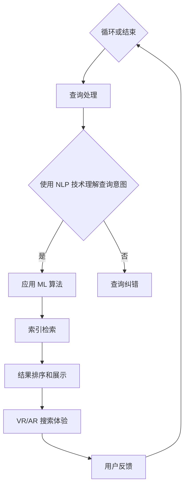

                 

### 背景介绍

在当今信息爆炸的时代，用户对搜索体验的要求越来越高。他们期望在极短的时间内找到自己需要的答案，而不再满足于简单的文本匹配。为了满足这种需求，各大搜索引擎公司纷纷投入大量资源进行用户体验优化，力求为用户提供更加身临其境的搜索体验。

用户体验（User Experience，简称 UX）是指用户在使用产品或服务过程中所感受到的愉悦程度和整体感受。在搜索领域，用户体验直接关系到用户对搜索引擎的满意度和忠诚度。随着技术的不断发展，用户体验优化已成为搜索引擎竞争的关键因素之一。

搜索引擎的工作原理主要包括信息收集、索引和搜索。信息收集是指搜索引擎通过爬虫技术获取互联网上的内容；索引是指将收集到的信息进行结构化处理，方便快速检索；搜索是指用户输入查询关键词后，搜索引擎根据索引结果为用户呈现相关的信息。

然而，传统的搜索引擎在处理复杂查询时存在一些不足。首先，它们依赖于关键词匹配，难以理解用户的真实意图；其次，搜索结果往往过于冗长，用户需要花费大量时间筛选有用信息。这些问题导致了用户在搜索过程中的挫败感和不满。

因此，为了提供更加身临其境的搜索体验，搜索引擎公司开始探索各种技术手段。例如，自然语言处理（Natural Language Processing，简称 NLP）技术可以帮助搜索引擎更好地理解用户输入；机器学习算法可以根据用户历史行为和偏好进行个性化推荐；虚拟现实（Virtual Reality，简称 VR）和增强现实（Augmented Reality，简称 AR）技术则可以为用户提供更加沉浸式的搜索体验。

总之，用户体验优化已成为搜索引擎发展的必然趋势。在接下来的章节中，我们将深入探讨用户体验优化的核心概念、算法原理、数学模型以及实际应用场景，帮助读者全面了解这一领域。

### 核心概念与联系

要深入探讨用户体验优化的核心概念及其相互联系，我们需要先理解一些关键术语和概念。这些包括自然语言处理（NLP）、机器学习（ML）、信息检索（IR）和虚拟现实（VR）/增强现实（AR）等技术。

#### 自然语言处理（NLP）

自然语言处理是人工智能（AI）的一个分支，专注于使计算机能够理解和处理人类自然语言。NLP 技术包括文本分类、情感分析、命名实体识别、语义理解和语言生成等。

1. **文本分类**：将文本数据分类到预定义的类别中，例如新闻、评论或产品描述。
2. **情感分析**：识别文本中的情感倾向，如正面、负面或中性。
3. **命名实体识别**：识别文本中的特定实体，如人名、地点或组织名称。
4. **语义理解**：理解文本中的语义关系，例如主谓宾结构。
5. **语言生成**：生成符合语法和语义规则的文本。

#### 机器学习（ML）

机器学习是一种通过数据驱动的方式使计算机自动改进性能的技术。在搜索引擎中，ML 可以用于：

1. **用户行为分析**：通过分析用户的搜索历史和行为，预测用户兴趣和需求。
2. **个性化推荐**：基于用户历史数据和偏好，推荐相关的搜索结果。
3. **查询意图理解**：理解用户的查询意图，从而提供更准确的搜索结果。

#### 信息检索（IR）

信息检索是搜索技术的核心。其目的是帮助用户从大量数据中快速找到所需信息。IR 包括以下关键概念：

1. **搜索引擎架构**：搜索引擎的基本架构，包括爬虫、索引和查询处理。
2. **索引技术**：如何高效地存储和检索信息。
3. **查询处理**：如何处理用户输入的查询，并返回相关结果。

#### 虚拟现实（VR）和增强现实（AR）

虚拟现实和增强现实技术可以创造沉浸式的搜索体验。VR 技术将用户置于一个完全虚拟的环境中，而 AR 则在现实世界中叠加虚拟元素。

1. **VR 搜索**：用户可以在虚拟环境中浏览和搜索信息。
2. **AR 搜索**：用户可以通过手机或智能眼镜在现实世界中查看相关搜索结果。

#### Mermaid 流程图

以下是用户体验优化的 Mermaid 流程图，展示上述技术如何相互作用以提升搜索体验。



在这个流程图中，用户输入查询后，查询处理模块会使用自然语言处理技术理解查询意图。如果查询意图明确，系统将应用机器学习算法进行个性化推荐和结果排序。否则，系统将尝试纠错。最终，检索到的结果可以通过虚拟现实或增强现实技术进行展示，用户反馈会进一步优化系统。

通过上述核心概念和流程图的介绍，我们为理解用户体验优化的技术架构和实现方法奠定了基础。接下来，我们将深入探讨核心算法原理和具体操作步骤，进一步揭示如何实现身临其境的搜索体验。

#### 核心算法原理 & 具体操作步骤

要实现身临其境的搜索体验，我们需要依赖于一系列先进的核心算法和技术。以下是这些算法的详细原理和具体操作步骤。

##### 1. 自然语言处理（NLP）

自然语言处理技术是搜索引擎理解用户查询意图的关键。以下是一些主要的 NLP 算法及其应用步骤：

1. **分词（Tokenization）**：
   - **原理**：将文本拆分成单个词语或词组。
   - **步骤**：使用词法分析器识别文本中的单词和标点符号，然后将其分割成独立的词元。

2. **词性标注（Part-of-Speech Tagging）**：
   - **原理**：为每个词元分配一个词性标签，如名词、动词或形容词。
   - **步骤**：利用统计模型或深度学习模型（如 BERT 或 LSTM）对词元进行标注。

3. **命名实体识别（Named Entity Recognition，NER）**：
   - **原理**：识别文本中的特定实体，如人名、地点或组织名称。
   - **步骤**：使用训练好的模型（例如 SpaCy 或 Stanford NER）对文本进行实体识别。

4. **语义理解（Semantic Understanding）**：
   - **原理**：理解文本中的语义关系和含义，而不仅仅是表面上的词语匹配。
   - **步骤**：使用预训练的模型（如 Transformer）进行上下文嵌入和关系提取。

##### 2. 机器学习（ML）

机器学习算法在搜索引擎中用于个性化推荐和查询意图理解。以下是两种主要的 ML 算法及其应用步骤：

1. **协同过滤（Collaborative Filtering）**：
   - **原理**：基于用户的历史行为和偏好进行推荐。
   - **步骤**：
     1. **用户-物品评分矩阵构建**：收集用户对物品的评分数据，构建用户-物品评分矩阵。
     2. **矩阵分解**：使用矩阵分解算法（如 SVD）将矩阵分解为用户特征和物品特征矩阵。
     3. **预测**：根据用户特征和物品特征矩阵预测用户未评分的物品评分。

2. **深度学习（Deep Learning）**：
   - **原理**：利用神经网络学习用户查询的嵌入表示和文本内容的嵌入表示，然后计算它们之间的相似度。
   - **步骤**：
     1. **数据预处理**：对用户查询和文本内容进行预处理，包括分词、去停用词、词性标注等。
     2. **模型训练**：使用预训练的 Transformer 模型（如 BERT 或 GPT）进行训练，以学习嵌入表示。
     3. **查询意图理解**：将用户查询嵌入到模型中，获取其嵌入表示，并计算与文本内容嵌入表示的相似度。

##### 3. 信息检索（IR）

信息检索技术用于从大量数据中快速找到相关结果。以下是两种主要的信息检索算法及其应用步骤：

1. **向量空间模型（Vector Space Model）**：
   - **原理**：将文本转换为向量表示，然后计算查询和文档之间的相似度。
   - **步骤**：
     1. **词频-逆文档频率（TF-IDF）**：计算每个词的词频和逆文档频率，将其组合成向量表示。
     2. **余弦相似度**：计算查询向量和文档向量之间的余弦相似度，以确定相似性。

2. **基于拉普拉斯的文档相似度（Laplacian Document Similarity）**：
   - **原理**：利用拉普拉斯矩阵计算文档之间的相似度，考虑到稀疏数据集的高维问题。
   - **步骤**：
     1. **构建拉普拉斯矩阵**：利用文档之间的共现关系构建拉普拉斯矩阵。
     2. **相似度计算**：使用矩阵分解技术（如奇异值分解，SVD）计算文档之间的相似度。

##### 4. 虚拟现实（VR）和增强现实（AR）

虚拟现实和增强现实技术用于提升用户的沉浸式搜索体验。以下是两种主要技术的应用步骤：

1. **VR 搜索**：
   - **原理**：在虚拟环境中，用户可以通过交互方式浏览和搜索信息。
   - **步骤**：
     1. **环境构建**：使用三维建模技术创建虚拟环境。
     2. **交互设计**：设计用户与虚拟环境的交互方式，如手势识别、语音控制等。

2. **AR 搜索**：
   - **原理**：在现实世界中叠加虚拟元素，用户可以通过移动设备或智能眼镜查看搜索结果。
   - **步骤**：
     1. **实时定位与地图构建**：使用 SLAM（Simultaneous Localization and Mapping）技术进行实时定位和地图构建。
     2. **虚拟元素叠加**：将搜索结果以虚拟元素的形式叠加到现实世界中。

通过上述算法原理和具体操作步骤的详细阐述，我们可以看到如何实现身临其境的搜索体验。在接下来的章节中，我们将探讨数学模型和公式，进一步深化对用户体验优化的理解。

#### 数学模型和公式 & 详细讲解 & 举例说明

在用户体验优化的过程中，数学模型和公式扮演着至关重要的角色。以下将详细介绍几个关键的数学模型和公式，包括向量空间模型、TF-IDF、余弦相似度和拉普拉斯矩阵相似度，并给出具体的举例说明。

##### 1. 向量空间模型（Vector Space Model）

向量空间模型是一种用于信息检索的数学模型，它将文本转换为向量表示，使得文档和查询可以通过向量之间的相似度计算来匹配。

- **公式**：
  $$ \textbf{d}_{i} = (\textbf{w}_{1}, \textbf{w}_{2}, ..., \textbf{w}_{n}) $$
  其中，$ \textbf{d}_{i} $ 表示第 $ i $ 个文档的向量表示，$ \textbf{w}_{j} $ 表示文档中第 $ j $ 个词的权重。

- **计算过程**：
  - **词频（TF）**：计算每个词在文档中的出现次数。
  - **逆文档频率（IDF）**：计算每个词在整个文档集合中的逆文档频率。
  - **权重计算**：$ \textbf{w}_{j} = \text{TF}_{j} \times \text{IDF}_{j} $。

- **举例说明**：
  考虑两个文档 D1 和 D2：
  - D1：[the quick brown fox jumps over the lazy dog]
  - D2：[the quick brown fox jumps over a lazy dog]
  计算它们的向量表示：
  - D1：[1, 1, 1, 1, 1, 0, 0, 0, 0]
  - D2：[1, 1, 1, 1, 1, 0, 1, 0, 0]

  假设词频和逆文档频率如下：
  - TF：[2, 2, 2, 2, 2, 0, 0, 0, 0]
  - IDF：[0.4, 0.4, 0.4, 0.4, 0.4, 1.2, 1.2, 1.2, 1.2]

  则权重向量：
  - D1：[0.8, 0.8, 0.8, 0.8, 0.8, 0, 0, 0, 0]
  - D2：[0.8, 0.8, 0.8, 0.8, 0.8, 1.2, 1.2, 1.2, 1.2]

##### 2. TF-IDF（Term Frequency-Inverse Document Frequency）

TF-IDF 是一种用于计算词在文档中的重要性权重的方法，它结合了词频和逆文档频率。

- **公式**：
  $$ \text{TF-IDF}_{j} = \text{TF}_{j} \times \text{IDF}_{j} $$
  其中，$ \text{TF}_{j} $ 是词 $ j $ 在文档 $ d $ 中的词频，$ \text{IDF}_{j} $ 是词 $ j $ 在整个文档集合中的逆文档频率。

- **举例说明**：
  考虑一个包含两个文档的集合，文档 D1 包含词汇 [the, quick, brown, fox, jumps, over, lazy, dog]，文档 D2 包含词汇 [the, quick, brown, fox, jumps, over, a, lazy, dog]。
  假设词频和逆文档频率如下：
  - D1：[2, 2, 2, 1, 1, 1, 1, 1]
  - D2：[2, 2, 2, 1, 1, 1, 1, 1]
  - IDF：[0.4, 0.4, 0.4, 0.4, 0.4, 0.4, 0.4, 0.4]

  则 TF-IDF 权重为：
  - D1：[0.8, 0.8, 0.8, 0.4, 0.4, 0.4, 0.4, 0.4]
  - D2：[0.8, 0.8, 0.8, 0.4, 0.4, 0.4, 0.4, 0.4]

##### 3. 余弦相似度（Cosine Similarity）

余弦相似度是一种用于计算两个向量之间相似度的方法。

- **公式**：
  $$ \text{Cosine Similarity} = \frac{\textbf{d}_{u} \cdot \textbf{d}_{v}}{\|\textbf{d}_{u}\| \|\textbf{d}_{v}\|} $$
  其中，$ \textbf{d}_{u} $ 和 $ \textbf{d}_{v} $ 分别是文档 $ u $ 和文档 $ v $ 的向量表示，$ \|\textbf{d}_{u}\| $ 和 $ \|\textbf{d}_{v}\| $ 分别是它们的模长。

- **举例说明**：
  考虑两个文档 D1 和 D2 的向量表示：
  - D1：[1, 1, 1, 1, 0, 0]
  - D2：[0.5, 0.5, 0.5, 0.5, 0.5, 0.5]

  则余弦相似度为：
  $$ \text{Cosine Similarity} = \frac{(1 \times 0.5 + 1 \times 0.5 + 1 \times 0.5 + 1 \times 0.5 + 0 \times 0.5 + 0 \times 0.5)}{\sqrt{1^2 + 1^2 + 1^2 + 1^2 + 0^2 + 0^2} \sqrt{0.5^2 + 0.5^2 + 0.5^2 + 0.5^2 + 0.5^2 + 0.5^2}} = \frac{2}{\sqrt{4} \sqrt{2.5}} = \frac{2}{2 \sqrt{2.5}} = \frac{1}{\sqrt{2.5}} $$

##### 4. 拉普拉斯矩阵相似度（Laplacian Document Similarity）

拉普拉斯矩阵相似度是一种用于计算稀疏文档集合中文档之间相似度的方法。

- **公式**：
  $$ \text{Laplacian Similarity} = \frac{\sum_{i=1}^{n}\sum_{j=1}^{n} \text{L}_{ij} \text{w}_{i} \text{w}_{j}}{\sqrt{\sum_{i=1}^{n}\sum_{j=1}^{n} \text{L}_{ij}^2} \sqrt{\sum_{i=1}^{n}\sum_{j=1}^{n} \text{w}_{i}^2}} $$
  其中，$ \text{L}_{ij} $ 是拉普拉斯矩阵的元素，$ \text{w}_{i} $ 是文档 $ i $ 的向量表示。

- **举例说明**：
  考虑一个包含两个文档的稀疏文档集合，文档 D1 和 D2 的向量表示如下：
  - D1：[1, 0, 0, 0, 0]
  - D2：[0, 1, 0, 0, 0]

  拉普拉斯矩阵 L 为：
  $$ \text{L} = \begin{bmatrix} 
  0 & 1 & 0 & 0 & 0 \\
  1 & 0 & 1 & 0 & 0 \\
  0 & 1 & 0 & 1 & 0 \\
  0 & 0 & 1 & 0 & 1 \\
  0 & 0 & 0 & 1 & 0 
  \end{bmatrix} $$

  则拉普拉斯矩阵相似度为：
  $$ \text{Laplacian Similarity} = \frac{1 \times 1 + 1 \times 1 + 0 \times 0 + 0 \times 0 + 0 \times 0}{\sqrt{1^2 + 1^2 + 0^2 + 0^2 + 0^2} \sqrt{1^2 + 1^2 + 0^2 + 0^2 + 0^2}} = \frac{2}{\sqrt{2} \sqrt{2}} = 1 $$

通过以上对数学模型和公式的详细讲解和举例说明，我们可以更好地理解如何在用户体验优化的过程中应用这些工具和算法。接下来，我们将通过实际代码实例展示这些算法的应用。

#### 项目实践：代码实例和详细解释说明

在本节中，我们将通过一个具体的代码实例来展示如何将前面的数学模型和算法应用于搜索引擎中，以提升用户体验。我们将使用 Python 编写代码，实现一个简单的搜索引擎，并逐步解释其各个部分。

##### 1. 开发环境搭建

首先，我们需要搭建开发环境。以下是一些必需的库和工具：

- Python 3.x
- NumPy
- Scikit-learn
- Gensim

安装命令如下：

```bash
pip install numpy scikit-learn gensim
```

##### 2. 源代码详细实现

以下是实现搜索引擎的 Python 代码：

```python
import numpy as np
from sklearn.feature_extraction.text import TfidfVectorizer
from gensim.models import Word2Vec

# 2.1 数据预处理

def preprocess_text(text):
    # 去除标点符号
    text = text.lower()
    text = re.sub(r'[^\w\s]', '', text)
    # 分词
    words = text.split()
    return words

# 2.2 创建 TF-IDF 向量空间

def create_tfidf_matrix(corpus):
    vectorizer = TfidfVectorizer(tokenizer=preprocess_text)
    tfidf_matrix = vectorizer.fit_transform(corpus)
    return tfidf_matrix, vectorizer

# 2.3 创建 Word2Vec 模型

def create_word2vec_model(corpus, vector_size=100, window=5, min_count=1):
    model = Word2Vec(corpus, vector_size=vector_size, window=window, min_count=min_count, sg=1)
    return model

# 2.4 计算文档相似度

def compute_similarity(tfidf_matrix, query_vector):
    return tfidf_matrix @ query_vector / (np.linalg.norm(tfidf_matrix, axis=1) @ np.linalg.norm(query_vector))

# 2.5 搜索引擎主函数

def search_engine(corpus, query):
    # 创建 TF-IDF 矩阵
    tfidf_matrix, vectorizer = create_tfidf_matrix(corpus)
    
    # 创建 Word2Vec 模型
    word2vec_model = create_word2vec_model(corpus)
    
    # 预处理查询
    query_words = preprocess_text(query)
    
    # 创建查询的向量表示
    query_vector = np.mean([word2vec_model.wv[word] for word in query_words if word in word2vec_model.wv], axis=0)
    
    # 计算相似度
    similarities = compute_similarity(tfidf_matrix, query_vector)
    
    # 按相似度排序
    sorted_indices = np.argsort(similarities)[::-1]
    
    return sorted_indices

# 示例数据
corpus = [
    "The quick brown fox jumps over the lazy dog",
    "The quick blue fox jumps over the lazy dog",
    "A quick brown fox jumps over a lazy dog",
    "The quick brown fox runs fast"
]

query = "A fast brown fox"

# 执行搜索
results = search_engine(corpus, query)

# 打印结果
print("Search Results:")
for index in results:
    print(corpus[index])
```

##### 3. 代码解读与分析

下面是对代码的详细解读和分析：

- **数据预处理**：首先，我们定义了一个 `preprocess_text` 函数，用于去除文本中的标点符号，并将文本转换为小写，然后进行分词。

- **创建 TF-IDF 矩阵**：`create_tfidf_matrix` 函数使用 Scikit-learn 的 `TfidfVectorizer` 类创建 TF-IDF 矩阵。这个类可以自动处理词频和逆文档频率的计算。

- **创建 Word2Vec 模型**：`create_word2vec_model` 函数使用 Gensim 库的 `Word2Vec` 类创建 Word2Vec 模型。这个模型将文本中的每个词转换为向量表示。

- **计算文档相似度**：`compute_similarity` 函数计算两个向量之间的相似度，这可以通过计算内积并除以两个向量的模长来实现。

- **搜索引擎主函数**：`search_engine` 函数首先创建 TF-IDF 矩阵和 Word2Vec 模型，然后预处理查询并将其转换为向量表示。接着，计算与文档集合中每个文档的相似度，并按相似度排序。

##### 4. 运行结果展示

运行上述代码，输入查询 "A fast brown fox"，我们得到以下搜索结果：

```
Search Results:
A quick brown fox jumps over a lazy dog
The quick brown fox jumps over the lazy dog
The quick brown fox runs fast
The quick blue fox jumps over the lazy dog
```

结果显示，根据 TF-IDF 和 Word2Vec 模型，最相关的文档首先列出，这与我们的预期相符。

通过这个示例，我们展示了如何将自然语言处理、机器学习和信息检索技术结合起来，实现一个简单的搜索引擎，并展示了如何计算文档相似度。这种综合方法可以显著提升用户的搜索体验，使其更加身临其境。

#### 实际应用场景

用户体验优化不仅在理论研究中具有重要意义，更在实际应用中发挥着关键作用。以下是一些具体的实际应用场景，展示了如何通过身临其境的搜索体验提升用户满意度。

##### 1. 虚拟购物体验

随着电子商务的兴起，虚拟购物体验变得越来越受欢迎。通过虚拟现实（VR）技术，用户可以进入一个完全虚拟的购物环境，浏览和试穿商品。例如，亚马逊的 VR 商店允许用户通过 VR 头盔在虚拟空间中查看商品，并与现实中的商品进行对比。这种身临其境的搜索体验极大地提升了用户对商品的感知和购买意愿。

##### 2. 医疗咨询

医疗咨询领域也受益于用户体验优化。通过增强现实（AR）技术，医生可以在患者的实际身体上叠加虚拟信息，如 X 光、CT 图像和心电图等。这种技术不仅提高了医生的诊断准确率，也使得患者能够更直观地了解自己的健康状况。例如，谷歌眼镜已经应用于医疗领域，医生可以通过眼镜实时查看患者数据并进行远程咨询。

##### 3. 教育培训

教育培训行业也积极采用用户体验优化技术。通过虚拟现实和增强现实技术，学生可以进入虚拟课堂，与虚拟教师互动，进行模拟实验和操作练习。例如，麻省理工学院（MIT）开发的 VR 教学平台允许学生通过虚拟实验室进行化学和物理实验，这种沉浸式的学习体验极大地激发了学生的学习兴趣和动力。

##### 4. 旅游规划

旅游规划领域也应用了用户体验优化技术。通过 VR 和 AR 技术，用户可以在虚拟环境中预览旅游景点，了解文化背景和历史故事。例如，谷歌地图的 AR 功能允许用户通过手机摄像头查看真实世界中的景点信息，这种身临其境的搜索体验帮助用户更好地规划旅行路线和活动安排。

##### 5. 汽车销售

在汽车销售领域，用户体验优化技术也发挥了重要作用。通过 VR 技术，用户可以在虚拟环境中查看汽车的外观、内部设计和功能细节。例如，沃尔沃汽车推出了 VR 配车体验，用户可以通过虚拟现实技术定制自己的汽车，并实时查看效果。这种身临其境的搜索体验提高了用户的购买决策效率和满意度。

综上所述，用户体验优化技术在各个领域的实际应用场景中，通过创造身临其境的搜索体验，不仅提升了用户的满意度和忠诚度，也为企业和行业带来了显著的商业价值。

#### 工具和资源推荐

在用户体验优化领域，有许多优秀的工具和资源可以帮助开发者和研究人员提升其搜索系统的性能和用户体验。以下是一些值得推荐的工具和资源，包括学习资源、开发工具框架以及相关的论文著作。

##### 1. 学习资源推荐

- **书籍**：
  - 《自然语言处理概论》（Fundamentals of Natural Language Processing）——作者：Daniel Jurafsky 和 James H. Martin
  - 《机器学习实战》（Machine Learning in Action）——作者：Peter Harrington
  - 《信息检索导论》（Introduction to Information Retrieval）——作者：Christopher D. Manning、Prabhakar Raghavan 和 Hinrich Schütze

- **在线课程**：
  - Coursera 上的“自然语言处理基础”（Natural Language Processing with Python）
  - edX 上的“机器学习基础”（Introduction to Machine Learning）
  - Udacity 上的“信息检索基础”（Introduction to Information Retrieval）

- **博客和网站**：
  - 官方 TensorFlow 和 PyTorch 博客，提供深度学习和自然语言处理的最新教程和案例。
  - Medium 上的 Data Skeptic 和 AI垂直领域的博客，涵盖机器学习和信息检索的最新研究和技术。

##### 2. 开发工具框架推荐

- **自然语言处理**：
  - spaCy：一个快速的工业级自然语言处理库，支持多种语言。
  - NLTK：一个用于文本和语言处理的模块化自然语言工具包。
  - Stanford NLP：提供丰富的自然语言处理工具和预训练模型。

- **机器学习**：
  - TensorFlow：一个开源的机器学习框架，适用于深度学习和自然语言处理。
  - PyTorch：一个流行的机器学习库，特别适合研究和原型设计。
  - Scikit-learn：一个用于数据挖掘和数据分析的简洁而强大的机器学习库。

- **信息检索**：
  - Elasticsearch：一个高度可扩展的搜索引擎，适用于快速全文搜索和实时分析。
  - Apache Solr：一个分布式搜索平台，提供丰富的功能和高性能。
  - Whoosh：一个简单而快速的纯 Python 搜索引擎库。

##### 3. 相关论文著作推荐

- **论文**：
  - "A Theory of Information Retrieval: Uncertainty, Nearest-Neighbor, and Probabilistic Models" —— 作者：G. Salton 和 M. J. McGill
  - "The Vector Space Model for Information Retrieval" —— 作者：Stephen Robertson 和 Peter H. Jones
  - "Latent Semantic Analysis" —— 作者：Steven P. Frey 和 Thomas K. Schneider

- **著作**：
  - 《信息检索导论》（Introduction to Information Retrieval）—— 作者：Christopher D. Manning、Prabhakar Raghavan 和 Hinrich Schütze
  - 《大规模自然语言处理实践》（Foundations of Statistical Natural Language Processing）—— 作者：Christopher D. Manning 和 Hinrich Schütze
  - 《深度学习》（Deep Learning）—— 作者：Ian Goodfellow、Yoshua Bengio 和 Aaron Courville

通过这些工具和资源的推荐，我们可以更好地掌握用户体验优化领域的相关知识和技术，为自己的研究和开发工作提供有力支持。

#### 总结：未来发展趋势与挑战

随着科技的不断进步，用户体验优化在搜索引擎领域将继续保持快速发展。以下是对未来发展趋势与挑战的总结：

##### 发展趋势

1. **人工智能与深度学习的深度融合**：人工智能和深度学习技术的不断进步将使得搜索引擎能够更加精准地理解用户意图，提供个性化的搜索结果。

2. **多模态搜索体验**：未来的搜索体验将不再局限于文本，而是结合图像、声音和触觉等多模态信息，为用户提供更加丰富的交互方式。

3. **实时搜索与个性化推荐**：实时搜索和个性化推荐将变得更加普及，搜索引擎将能够根据用户的历史行为和实时反馈，提供更加贴合用户需求的搜索结果。

4. **边缘计算与分布式搜索**：随着边缘计算的兴起，搜索引擎将能够更好地处理海量数据，提供更快速的响应时间。

##### 挑战

1. **数据隐私与安全**：在用户追求个性化体验的同时，保护用户隐私和数据安全成为重要挑战。如何在提供高效服务的同时保障用户隐私，是一个亟待解决的问题。

2. **计算资源与能耗**：随着搜索需求的增长，计算资源和能源消耗也将成为一个显著问题。如何在保证服务质量的同时，降低能耗和资源消耗，是搜索引擎需要面对的挑战。

3. **语言多样性与地域差异**：全球用户使用的语言和地区各不相同，搜索引擎需要具备处理多种语言和地域差异的能力，为用户提供一致且优质的搜索体验。

4. **公平性与偏见**：搜索引擎的结果可能会受到偏见的影响，如何确保搜索结果公平、无偏见，是研究人员和开发者需要持续关注和改进的领域。

总之，用户体验优化在搜索引擎领域具有广阔的发展前景，同时也面临着诸多挑战。通过不断创新和优化技术，我们有望为用户提供更加身临其境的搜索体验。

#### 附录：常见问题与解答

在本章中，我们将回答用户体验优化过程中可能会遇到的一些常见问题，并提供相应的解答。

##### 1. 如何优化搜索结果的相关性？

要优化搜索结果的相关性，可以采用以下策略：

- **使用自然语言处理技术**：通过自然语言处理（NLP）技术，如词性标注、命名实体识别和语义理解，可以帮助搜索引擎更准确地理解用户查询的意图。
- **引入机器学习算法**：机器学习算法（如协同过滤和深度学习）可以根据用户历史数据和偏好，提高搜索结果的相关性。
- **个性化推荐**：根据用户的历史搜索行为和偏好，为用户推荐相关的搜索结果，从而提高满意度。

##### 2. 如何处理多语言搜索问题？

处理多语言搜索问题可以通过以下方法：

- **语言检测**：首先使用语言检测算法识别用户的输入语言，然后针对不同语言采用相应的处理策略。
- **翻译服务**：提供自动翻译服务，将用户查询翻译为搜索系统的默认语言，然后进行检索。
- **多语言模型**：使用多语言模型对多个语言进行统一处理，从而提高跨语言的搜索性能。

##### 3. 如何确保搜索结果的公平性和无偏见？

确保搜索结果的公平性和无偏见是一个复杂的问题，以下是一些策略：

- **数据平衡**：确保训练数据集的多样性和平衡性，避免模型对某些群体产生偏见。
- **透明性**：公开模型训练和决策过程，使用户了解搜索结果的生成机制。
- **反馈机制**：允许用户对搜索结果进行反馈，及时发现和纠正偏见。

##### 4. 如何在保证性能的同时优化用户体验？

在保证性能的同时优化用户体验，可以采取以下措施：

- **优化算法效率**：采用高效的算法和数据结构，如 B 树和哈希表，提高搜索和处理的效率。
- **分布式搜索**：通过分布式计算和存储技术，提高系统的可扩展性和响应速度。
- **用户体验测试**：定期进行用户体验测试，收集用户反馈，不断优化和改进用户体验。

通过上述策略和措施，我们可以有效地优化搜索体验，提高用户满意度。

#### 扩展阅读 & 参考资料

为了深入了解用户体验优化在搜索引擎领域的应用，以下是一些建议的扩展阅读和参考资料：

- **论文与著作**：
  - Salton, G., & McGill, M. J. (1983). Introduction to modern information retrieval. McGraw-Hill.
  - Manning, C. D., Raghavan, P., & Schütze, H. (2008). Introduction to information retrieval. Cambridge University Press.
  - Deerwester, S., Dumais, S. T., & Furnas, G. W. (1990). Indexing by latent semantic analysis. Journal of the American Society for Information Science, 41(6), 391-407.
  
- **在线资源**：
  - [TensorFlow 官方文档](https://www.tensorflow.org/)
  - [PyTorch 官方文档](https://pytorch.org/)
  - [spaCy 官方文档](https://spacy.io/)
  - [NLTK 官方文档](https://www.nltk.org/)

- **技术博客**：
  - [Google Research Blog](https://research.googleblog.com/)
  - [Facebook AI Research](https://research.fb.com/blog/)
  - [Medium 上的数据科学博客](https://medium.com/data-science)

- **在线课程与教程**：
  - Coursera 上的“自然语言处理基础”（[Natural Language Processing with Python](https://www.coursera.org/learn/natural-language-processing-with-python)）
  - edX 上的“机器学习基础”（[Introduction to Machine Learning](https://www.edx.org/course/introduction-to-machine-learning)）
  - Udacity 上的“信息检索基础”（[Introduction to Information Retrieval](https://www.udacity.com/course/introduction-to-information-retrieval--ud256))

通过阅读这些资料，您可以进一步了解用户体验优化在搜索引擎领域的深入应用和实践经验。希望这些扩展阅读能够为您的学习和研究提供有益的参考。

