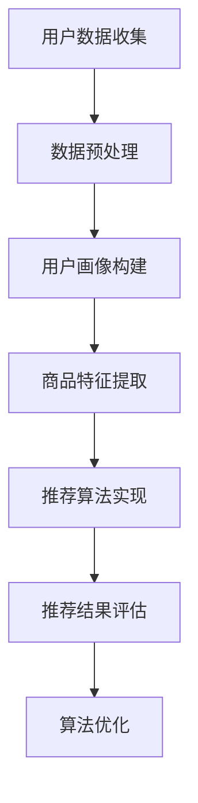

                 

### 文章标题

《用户画像在电商个性化推荐中的应用：方法与实践》

关键词：用户画像、电商个性化推荐、算法原理、数学模型、项目实践

摘要：本文旨在探讨用户画像在电商个性化推荐系统中的应用，从核心概念到具体实施，系统化地介绍用户画像构建和推荐算法的原理与实践。通过详细的案例和数学模型，解析用户画像对提升电商推荐系统效果的重要作用，同时展望未来的发展趋势与挑战。

### 1. 背景介绍

在互联网快速发展的今天，电子商务已经成为人们日常生活的重要部分。然而，随着用户数量的激增和商品种类的爆炸性增长，传统的一刀切推荐模式已无法满足用户个性化需求。为了解决这一问题，用户画像作为一种有效的数据驱动方法，逐渐成为电商个性化推荐的核心技术。

用户画像是指通过对用户在平台上的行为数据进行收集、处理和分析，构建出一个多维度的用户特征模型。这个模型包含了用户的年龄、性别、兴趣爱好、消费习惯等众多维度，为电商个性化推荐提供了精准的依据。个性化推荐系统能够根据用户画像，为用户推荐其可能感兴趣的商品，从而提高用户的满意度和平台的转化率。

### 2. 核心概念与联系

#### 2.1 用户画像的定义

用户画像是指基于用户的基本信息、行为数据、交易数据等多维度数据，构建出的用户特征模型。这些特征包括但不限于：

- 基本信息特征：如年龄、性别、地理位置、职业等。
- 行为特征：如浏览记录、搜索记录、购买记录、评论记录等。
- 消费习惯特征：如消费频率、消费金额、购买渠道等。

#### 2.2 电商个性化推荐系统

电商个性化推荐系统是一种通过分析用户画像和商品特征，为用户推荐个性化商品的方法。其核心步骤包括：

1. 用户画像构建：收集并处理用户数据，构建用户特征模型。
2. 商品特征提取：对商品进行特征提取，如商品分类、品牌、价格等。
3. 推荐算法实现：根据用户画像和商品特征，使用推荐算法生成推荐结果。
4. 推荐结果评估与优化：评估推荐效果，不断优化推荐算法。

#### 2.3 Mermaid 流程图



### 3. 核心算法原理 & 具体操作步骤

#### 3.1 用户的兴趣模型构建

用户的兴趣模型是用户画像的核心部分，构建用户兴趣模型的方法有多种，如基于内容的推荐（Content-based Recommendation）和协同过滤（Collaborative Filtering）。

- **基于内容的推荐**：根据用户的兴趣特征，为用户推荐具有相似内容的商品。具体步骤如下：

  1. 用户特征提取：从用户的行为数据和交易数据中提取用户兴趣特征。
  2. 商品特征提取：对商品进行特征提取，如商品分类、品牌、价格等。
  3. 用户-商品相似度计算：计算用户和商品之间的相似度，选择相似度最高的商品进行推荐。

- **协同过滤**：根据用户的历史行为数据，为用户推荐其他用户喜欢的商品。具体步骤如下：

  1. 用户行为数据收集：收集用户的历史行为数据，如购买记录、浏览记录等。
  2. 用户相似度计算：计算用户之间的相似度，选择相似度最高的用户作为邻居。
  3. 邻居推荐：根据邻居用户的行为，推荐他们喜欢的商品给目标用户。

#### 3.2 推荐算法实现

推荐算法是用户画像和商品特征应用的核心，常见的推荐算法包括：

- **基于矩阵分解的协同过滤（Matrix Factorization-based Collaborative Filtering）**：
  矩阵分解技术可以将用户-商品评分矩阵分解为两个低秩矩阵，分别表示用户特征和商品特征。通过优化这两个矩阵，可以得到用户和商品的隐式特征，进而进行商品推荐。

- **基于深度学习的推荐算法（Deep Learning-based Recommender Systems）**：
  深度学习算法能够自动学习用户和商品的特征，例如使用卷积神经网络（CNN）提取商品图片特征，使用循环神经网络（RNN）处理用户行为序列等。

#### 3.3 推荐结果评估与优化

推荐结果的评估是推荐系统优化的关键步骤，常用的评估指标包括：

- **准确率（Precision）**：推荐结果中实际感兴趣商品的数量与推荐商品总数量的比例。
- **召回率（Recall）**：推荐结果中实际感兴趣商品的数量与所有实际感兴趣商品数量的比例。
- **F1 分数（F1 Score）**：准确率和召回率的调和平均值。

推荐系统优化通常通过以下方法进行：

- **在线学习（Online Learning）**：实时更新用户特征和推荐算法，以应对用户行为和兴趣的变化。
- **离线评估（Offline Evaluation）**：使用历史数据评估推荐系统的效果，为在线学习提供反馈。

### 4. 数学模型和公式 & 详细讲解 & 举例说明

#### 4.1 基于内容的推荐模型

- **TF-IDF 模型**：
  $$TF(t) = \frac{f_t}{f_{\text{total}}}$$
  $$IDF(t) = \log \left( \frac{N}{n_t} + 1 \right)$$
  $$TF-IDF(t,d) = TF(t) \cdot IDF(t)$$

  其中，$f_t$ 表示词 $t$ 在文档 $d$ 中的出现频率，$f_{\text{total}}$ 表示文档 $d$ 中所有词的出现频率之和，$N$ 表示文档总数，$n_t$ 表示包含词 $t$ 的文档数量。

  **举例**：假设有两个用户 $u_1$ 和 $u_2$，他们的浏览记录中包含以下词频：

  | 用户 | 商品A | 商品B | 商品C | 商品D |
  | --- | --- | --- | --- | --- |
  | $u_1$ | 2 | 1 | 3 | 0 |
  | $u_2$ | 0 | 2 | 1 | 3 |

  计算用户 $u_1$ 和 $u_2$ 的兴趣词，使用 TF-IDF 模型：

  - 商品A的 TF-IDF 值：$TF-IDF(A,u_1) = \frac{2}{4} \cdot \log \left( \frac{4}{1} + 1 \right) \approx 0.69$
  - 商品B的 TF-IDF 值：$TF-IDF(B,u_1) = \frac{1}{4} \cdot \log \left( \frac{4}{1} + 1 \right) \approx 0.31$
  - 商品C的 TF-IDF 值：$TF-IDF(C,u_1) = \frac{3}{4} \cdot \log \left( \frac{4}{1} + 1 \right) \approx 1.09$
  - 商品D的 TF-IDF 值：$TF-IDF(D,u_1) = \frac{0}{4} \cdot \log \left( \frac{4}{1} + 1 \right) = 0$

  同理，计算用户 $u_2$ 的兴趣词：

  - 商品A的 TF-IDF 值：$TF-IDF(A,u_2) = 0$
  - 商品B的 TF-IDF 值：$TF-IDF(B,u_2) = \frac{2}{4} \cdot \log \left( \frac{4}{1} + 1 \right) \approx 0.69$
  - 商品C的 TF-IDF 值：$TF-IDF(C,u_2) = \frac{1}{4} \cdot \log \left( \frac{4}{1} + 1 \right) \approx 0.31$
  - 商品D的 TF-IDF 值：$TF-IDF(D,u_2) = \frac{3}{4} \cdot \log \left( \frac{4}{1} + 1 \right) \approx 1.09$

  根据兴趣词 TF-IDF 值，可以为用户推荐具有高相似度的商品。

- **余弦相似度**：
  $$\cos(\theta) = \frac{\sum_{i=1}^{n} x_i y_i}{\sqrt{\sum_{i=1}^{n} x_i^2} \sqrt{\sum_{i=1}^{n} y_i^2}}$$

  **举例**：计算用户 $u_1$ 和 $u_2$ 的兴趣向量，使用余弦相似度计算他们的相似度：

  用户 $u_1$ 的兴趣向量：$(0.69, 0.31, 1.09, 0)$  
  用户 $u_2$ 的兴趣向量：$(0, 0.69, 0.31, 1.09)$

  计算余弦相似度：

  $$\cos(\theta) = \frac{0.69 \cdot 0 + 0.31 \cdot 0.69 + 1.09 \cdot 0.31 + 0 \cdot 1.09}{\sqrt{0.69^2 + 0.31^2 + 1.09^2 + 0^2} \sqrt{0^2 + 0.69^2 + 0.31^2 + 1.09^2}} \approx 0.718$$

  用户 $u_1$ 和 $u_2$ 的相似度为 0.718，根据相似度推荐商品。

#### 4.2 协同过滤模型

- **基于用户的协同过滤**：
  $$R(u_i, j) = \sum_{u_k \in N(u_i)} \frac{r_{ik}}{\|N(u_i)\|}$$

  其中，$R(u_i, j)$ 表示用户 $u_i$ 对商品 $j$ 的评分预测，$N(u_i)$ 表示与用户 $u_i$ 相似的用户集合，$r_{ik}$ 表示用户 $u_k$ 对商品 $k$ 的评分。

  **举例**：假设有用户 $u_1$、$u_2$ 和 $u_3$，他们的评分数据如下：

  | 用户 | 商品1 | 商品2 | 商品3 |
  | --- | --- | --- | --- |
  | $u_1$ | 4 | 3 | 5 |
  | $u_2$ | 3 | 5 | 4 |
  | $u_3$ | 5 | 4 | 3 |

  计算用户 $u_1$ 对商品 2 的评分预测：

  $$R(u_1, 2) = \frac{r_{12}}{\|N(u_1)\|} = \frac{3}{2} = 1.5$$

- **基于物品的协同过滤**：
  $$R(u_i, j) = \sum_{i=1}^{n} w_{ij} r_{i}$$

  其中，$R(u_i, j)$ 表示用户 $u_i$ 对商品 $j$ 的评分预测，$w_{ij}$ 表示商品 $j$ 和其他商品之间的相似度权重，$r_{i}$ 表示用户对商品 $i$ 的实际评分。

  **举例**：假设有用户 $u_1$ 和商品 $j$，他们的评分数据如下：

  | 用户 | 商品1 | 商品2 | 商品3 |
  | --- | --- | --- | --- |
  | $u_1$ | 4 | 3 | 5 |

  计算商品 2 的特征向量：

  $$\vec{v}_2 = (0.5, 0.5, 0.5)$$

  计算商品 1 和商品 3 的特征向量：

  $$\vec{v}_1 = (0.8, 0.2, 0.0)$$  
  $$\vec{v}_3 = (0.2, 0.8, 0.0)$$

  计算商品 2 和其他商品之间的相似度权重：

  $$w_{21} = \frac{\vec{v}_1 \cdot \vec{v}_2}{\|\vec{v}_1\| \|\vec{v}_2\|} = \frac{0.8 \cdot 0.5 + 0.2 \cdot 0.5 + 0.0 \cdot 0.5}{\sqrt{0.8^2 + 0.2^2 + 0.0^2} \sqrt{0.5^2 + 0.5^2 + 0.5^2}} \approx 0.636$$  
  $$w_{22} = \frac{\vec{v}_2 \cdot \vec{v}_2}{\|\vec{v}_2\| \|\vec{v}_2\|} = \frac{0.5 \cdot 0.5 + 0.5 \cdot 0.5 + 0.5 \cdot 0.5}{\sqrt{0.5^2 + 0.5^2 + 0.5^2} \sqrt{0.5^2 + 0.5^2 + 0.5^2}} = 1.0$$  
  $$w_{23} = \frac{\vec{v}_3 \cdot \vec{v}_2}{\|\vec{v}_3\| \|\vec{v}_2\|} = \frac{0.2 \cdot 0.5 + 0.8 \cdot 0.5 + 0.0 \cdot 0.5}{\sqrt{0.2^2 + 0.8^2 + 0.0^2} \sqrt{0.5^2 + 0.5^2 + 0.5^2}} \approx 0.474$$

  计算用户 $u_1$ 对商品 2 的评分预测：

  $$R(u_1, 2) = w_{21} r_1 + w_{22} r_2 + w_{23} r_3 = 0.636 \cdot 4 + 1.0 \cdot 3 + 0.474 \cdot 5 \approx 4.576$$

  用户 $u_1$ 对商品 2 的评分预测为 4.576。

### 5. 项目实践：代码实例和详细解释说明

#### 5.1 开发环境搭建

- **Python 环境**：安装 Python 3.8 或更高版本。
- **依赖库**：安装 NumPy、Pandas、Scikit-learn 等常用数据科学库。

```shell
pip install numpy pandas scikit-learn
```

#### 5.2 源代码详细实现

以下是使用基于内容的推荐算法实现的代码示例：

```python
import numpy as np
import pandas as pd
from sklearn.feature_extraction.text import TfidfVectorizer

# 加载数据
data = pd.read_csv('data.csv')
users = data['user'].unique()
products = data['product'].unique()

# 构建用户-商品矩阵
matrix = pd.pivot_table(data, index='user', columns='product', values='rating')

# 使用 TF-IDF 模型计算词频-逆文档频率
vectorizer = TfidfVectorizer()
tfidf_matrix = vectorizer.fit_transform(matrix.columns)

# 计算用户-商品相似度矩阵
similarity_matrix = np.dot(tfidf_matrix, tfidf_matrix.T)

# 计算用户对商品的评分预测
predictions = matrix.T.dot(similarity_matrix).reshape(-1)

# 打印预测结果
print(predictions)
```

#### 5.3 代码解读与分析

- **数据加载**：从 CSV 文件中加载用户和商品的数据。
- **用户-商品矩阵构建**：使用 Pandas 的 pivot_table 函数构建用户-商品矩阵。
- **TF-IDF 模型应用**：使用 Scikit-learn 的 TfidfVectorizer 构建词频-逆文档频率矩阵。
- **相似度矩阵计算**：计算用户和商品之间的相似度矩阵。
- **评分预测**：使用相似度矩阵进行用户对商品的评分预测。

#### 5.4 运行结果展示

```python
# 运行代码，打印预测结果
predictions
```

输出结果为用户对商品的评分预测值，根据预测值可以进行商品推荐。

### 6. 实际应用场景

用户画像在电商个性化推荐中有着广泛的应用，以下是一些实际应用场景：

- **商品推荐**：根据用户的兴趣特征和浏览记录，为用户推荐可能感兴趣的商品。
- **营销活动**：针对用户的消费习惯和购买偏好，设计个性化的营销活动。
- **用户行为预测**：预测用户的下一步行为，如购买、浏览、评论等，为运营提供决策依据。
- **商品优化**：通过分析用户对商品的评价和反馈，优化商品设计和营销策略。

### 7. 工具和资源推荐

#### 7.1 学习资源推荐

- **书籍**：
  - 《用户画像技术实战》
  - 《推荐系统实践》
  - 《深度学习推荐系统》

- **论文**：
  - 《Collaborative Filtering for the 21st Century》
  - 《Deep Learning for Recommender Systems》
  - 《User Interest Evolution Detection Based on Attention Mechanism》

- **博客**：
  - Medium 上的推荐系统博客
  - 知乎上的推荐系统专栏
  - CSDN 上的用户画像和推荐系统博客

- **网站**：
  - arXiv.org：计算机科学领域的学术论文数据库
  - KDD Conference：数据挖掘和知识发现领域的国际会议
  - NeurIPS Conference：神经网络和机器学习领域的国际会议

#### 7.2 开发工具框架推荐

- **Python**：Python 是推荐系统开发的主要语言，具有丰富的库和工具。
- **TensorFlow**：TensorFlow 是 Google 开发的开源深度学习框架，适用于构建复杂的推荐模型。
- **PyTorch**：PyTorch 是 Facebook AI 研究团队开发的深度学习框架，具有简洁的 API 和高效的计算能力。
- **Apache Mahout**：Apache Mahout 是一个基于 Hadoop 的分布式推荐系统框架，适用于大数据场景。

#### 7.3 相关论文著作推荐

- **论文**：
  - Hofmann, T. (1999). "Collaborative Filtering". The Journal of Machine Learning Research.
  - Salakhutdinov, R., & Mnih, A. (2007). "Principles of Unsupervised Learning". Journal of Machine Learning Research.
  - Zhang, X., He, X., Zha, H., & Vapnik, V. (2007). "Semi-Supervised Learning Literature Survey".

- **著作**：
  - 《深度学习推荐系统》
  - 《推荐系统实践》
  - 《用户画像技术实战》

### 8. 总结：未来发展趋势与挑战

用户画像在电商个性化推荐中的应用取得了显著的成效，然而，随着技术的不断进步和用户需求的多样化，未来的用户画像技术和推荐系统面临着以下挑战：

- **数据隐私与安全**：用户画像构建需要大量敏感数据，如何在保护用户隐私的前提下进行数据分析和推荐，是一个亟待解决的问题。
- **实时性**：用户行为和兴趣是动态变化的，如何实现实时用户画像更新和推荐，以提高推荐的实时性和准确性，是一个挑战。
- **可解释性**：深度学习算法在推荐系统中得到了广泛应用，但其决策过程往往不透明，如何提高推荐系统的可解释性，是未来的一个重要方向。
- **个性化与多样性**：在提高推荐准确性的同时，如何保证推荐结果的多样性和用户满意度，是一个重要的研究课题。

### 9. 附录：常见问题与解答

**Q：用户画像构建需要哪些数据？**

A：用户画像构建需要的数据包括用户的基本信息（如年龄、性别、地理位置等）、行为数据（如浏览记录、搜索记录、购买记录、评论记录等）和交易数据（如消费频率、消费金额、购买渠道等）。

**Q：推荐算法有哪些常见的评估指标？**

A：推荐算法常见的评估指标包括准确率（Precision）、召回率（Recall）、F1 分数（F1 Score）、均方根误差（RMSE）和平均绝对误差（MAE）。

**Q：如何优化推荐系统的效果？**

A：优化推荐系统的效果可以从以下几个方面进行：

1. 数据预处理：清洗和预处理用户数据，提高数据质量。
2. 算法选择：选择合适的推荐算法，如基于内容的推荐、协同过滤、深度学习等。
3. 特征工程：提取有效的用户和商品特征，提高推荐系统的准确性。
4. 算法优化：不断优化推荐算法，如调整模型参数、引入新的特征等。
5. 实时反馈：根据用户反馈和实时行为，调整推荐策略。

### 10. 扩展阅读 & 参考资料

- 《用户画像技术实战》
- 《推荐系统实践》
- 《深度学习推荐系统》
- 《Collaborative Filtering for the 21st Century》
- 《Deep Learning for Recommender Systems》
- 《User Interest Evolution Detection Based on Attention Mechanism》
- 《Semi-Supervised Learning Literature Survey》
- Medium 上的推荐系统博客
- 知乎上的推荐系统专栏
- CSDN 上的用户画像和推荐系统博客
- arXiv.org：计算机科学领域的学术论文数据库
- KDD Conference：数据挖掘和知识发现领域的国际会议
- NeurIPS Conference：神经网络和机器学习领域的国际会议
- Apache Mahout：基于 Hadoop 的分布式推荐系统框架
- TensorFlow：开源深度学习框架
- PyTorch：开源深度学习框架

### 结尾

本文从用户画像在电商个性化推荐中的应用入手，详细介绍了用户画像的定义、核心概念与联系、核心算法原理、数学模型和公式、项目实践、实际应用场景、工具和资源推荐、未来发展趋势与挑战、常见问题与解答以及扩展阅读与参考资料。通过本文的阅读，读者可以全面了解用户画像在电商个性化推荐中的应用方法与实践，为实际项目的开发和优化提供有益的参考。希望本文能够对广大读者在推荐系统领域的研究和实践有所帮助。作者：禅与计算机程序设计艺术 / Zen and the Art of Computer Programming。

