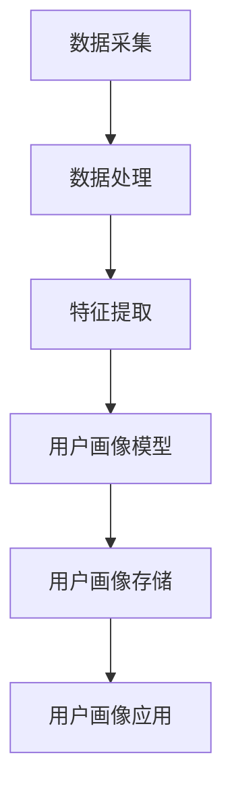

                 

### 背景介绍

在当今信息爆炸的时代，数据已经成为了企业运营和决策的重要资源。用户画像（User Profiling）作为一种基于数据分析的技术，通过整合和分析用户的各类信息，为企业和平台提供了深入了解用户行为、偏好和需求的能力。用户画像不仅仅是静态的，它需要不断地根据用户行为的变化进行动态更新和优化，以确保其准确性和有效性。

#### 用户画像的概念

用户画像是指通过收集、整理和分析用户在互联网上的各种行为数据，如浏览记录、搜索历史、购买行为、社交互动等，构建出用户的基本属性、兴趣偏好、行为习惯等多维度的个性化描述。这种描述可以帮助企业更好地理解用户，从而提供个性化的产品和服务，提高用户满意度和忠诚度。

#### 动态更新与优化的重要性

随着用户行为的不断变化，静态的用户画像往往难以保持其时效性和准确性。因此，动态更新和优化用户画像变得尤为重要。具体而言，动态更新和优化的重要性体现在以下几个方面：

1. **实时性**：用户画像需要实时反映用户当前的状态和行为，以便企业可以及时做出相应的调整和决策。
2. **准确性**：通过持续更新和优化，用户画像可以更加精确地反映用户的需求和偏好，从而提高营销效果和用户体验。
3. **适应性**：随着用户行为模式的改变，用户画像需要能够适应这种变化，不断调整和优化，以保持其相关性和有效性。
4. **数据完整性**：动态更新和优化有助于确保用户画像的数据完整性，避免因数据过时而导致的决策失误。

#### 文章结构与目标

本文将围绕用户画像的动态更新与优化展开讨论。文章结构如下：

1. **核心概念与联系**：介绍用户画像的核心概念及其相互关系。
2. **核心算法原理 & 具体操作步骤**：探讨动态更新和优化的核心算法原理及其具体实现步骤。
3. **数学模型和公式 & 详细讲解 & 举例说明**：运用数学模型和公式对算法进行详细解释，并通过实例说明其应用。
4. **项目实践：代码实例和详细解释说明**：展示代码实例，并详细解读其实现过程和关键点。
5. **实际应用场景**：分析用户画像在不同领域的实际应用场景。
6. **工具和资源推荐**：推荐相关的学习资源和开发工具。
7. **总结：未来发展趋势与挑战**：总结当前用户画像的发展趋势，并探讨未来可能面临的挑战。
8. **附录：常见问题与解答**：回答读者可能关心的一些常见问题。
9. **扩展阅读 & 参考资料**：提供扩展阅读资料和参考文献。

通过以上结构，本文旨在帮助读者全面了解用户画像的动态更新与优化技术，掌握其实际应用场景，并为未来的研究和实践提供指导。

---

### 核心概念与联系

在深入探讨用户画像的动态更新与优化之前，首先需要明确几个核心概念，并分析它们之间的相互联系。

#### 用户画像

用户画像是指通过对用户行为数据的收集和分析，构建出用户的多维度特征描述。这些特征通常包括用户的基本信息（如年龄、性别、地域）、兴趣偏好（如购物喜好、阅读习惯）、行为习惯（如访问时间、浏览路径）等。用户画像的核心目的是为了帮助企业更好地理解用户，从而实现精准营销、个性化服务和用户体验优化。

#### 动态更新

动态更新是指随着用户行为的变化，实时更新用户画像的过程。动态更新的目的是确保用户画像能够实时反映用户的当前状态和行为，从而提高其时效性和准确性。动态更新通常涉及以下步骤：

1. **数据采集**：收集用户的实时行为数据，如浏览记录、搜索历史等。
2. **数据预处理**：清洗和整理采集到的数据，去除噪声和冗余信息。
3. **特征提取**：从预处理后的数据中提取用户画像的特征，如兴趣标签、行为特征等。
4. **更新算法**：根据提取出的特征，使用适当的算法更新用户画像。

#### 优化

优化是指通过调整和改进用户画像，以提高其准确性和有效性。优化的目的是使用户画像更加精准地反映用户的需求和偏好，从而提升用户体验和营销效果。优化通常涉及以下步骤：

1. **模型评估**：评估当前用户画像模型的准确性和有效性，识别存在的不足。
2. **特征选择**：根据评估结果，选择对用户画像贡献最大的特征，去除冗余特征。
3. **算法调参**：调整优化算法的参数，以提高模型性能。
4. **迭代优化**：重复评估和调整，不断优化用户画像模型。

#### 架构设计

为了实现用户画像的动态更新与优化，需要设计一个高效、可扩展的架构。以下是一个简化的用户画像系统架构：

1. **数据采集模块**：负责从不同的数据源采集用户行为数据，如网站日志、社交媒体数据等。
2. **数据处理模块**：负责数据预处理和特征提取，确保数据的准确性和完整性。
3. **用户画像模型**：负责根据预处理后的数据生成用户画像，并实现动态更新和优化。
4. **用户画像存储**：负责存储和管理用户画像数据，通常使用分布式数据库或大数据平台。
5. **用户画像应用**：负责将用户画像应用于实际场景，如个性化推荐、精准营销等。

#### Mermaid 流程图

以下是一个使用Mermaid绘制的用户画像系统流程图，展示了各模块之间的交互和数据处理流程：



通过以上架构设计和流程图，我们可以清晰地看到用户画像的动态更新与优化过程，以及各模块之间的协同作用。

---

### 核心算法原理 & 具体操作步骤

在用户画像的动态更新与优化过程中，核心算法扮演着至关重要的角色。本文将介绍几种常见的核心算法，包括协同过滤、基于内容的推荐和基于模型的推荐。同时，我们将详细解释这些算法的具体操作步骤，以便读者能够更好地理解和应用。

#### 协同过滤算法

协同过滤（Collaborative Filtering）是一种基于用户行为数据推荐的方法，其核心思想是通过分析用户之间的相似性，为用户推荐他们可能感兴趣的项目。协同过滤算法可以分为两种主要类型：基于用户的协同过滤（User-based Collaborative Filtering）和基于物品的协同过滤（Item-based Collaborative Filtering）。

##### 基于用户的协同过滤

1. **计算用户相似度**：
   - 使用用户行为数据计算用户之间的相似度，常用的方法包括余弦相似度、皮尔逊相关系数等。
   - 公式如下：
     $$相似度(u, v) = \frac{u \cdot v}{\|u\| \|v\|}$$
     其中，$u$和$v$分别表示用户$u$和用户$v$的行为向量，$\|u\|$和$\|v\|$分别表示它们的欧几里得范数。

2. **找到相似用户**：
   - 根据计算出的相似度矩阵，找到与目标用户最相似的$k$个用户。

3. **推荐项目**：
   - 针对目标用户，从与其相似的$k$个用户喜欢的项目中，选择评分最高的$m$个项目进行推荐。

##### 基于物品的协同过滤

1. **计算项目相似度**：
   - 使用用户行为数据计算项目之间的相似度，常用的方法包括余弦相似度、皮尔逊相关系数等。
   - 公式与基于用户的协同过滤类似，只是将用户的行为向量替换为项目的行为向量。

2. **找到相似项目**：
   - 根据计算出的相似度矩阵，找到与目标项目最相似的$k$个项目。

3. **推荐用户**：
   - 针对目标项目，从与其相似的$k$个项目中，选择评分最高的$m$个用户进行推荐。

#### 基于内容的推荐

基于内容的推荐（Content-based Recommendation）是一种基于项目特征和用户兴趣的推荐方法，其核心思想是根据用户过去喜欢的项目内容，为用户推荐与之相似的项目。基于内容的推荐通常涉及以下步骤：

1. **项目特征提取**：
   - 从项目的文本描述、标签、分类等信息中提取特征向量。

2. **用户兴趣模型**：
   - 根据用户过去的行为数据，如浏览记录、收藏夹、评分等，建立用户的兴趣模型。

3. **计算相似度**：
   - 使用TF-IDF、Word2Vec等算法计算项目特征向量与用户兴趣模型之间的相似度。

4. **推荐项目**：
   - 针对目标用户，从与其兴趣模型相似的项目中，选择评分最高的$m$个项目进行推荐。

#### 基于模型的推荐

基于模型的推荐（Model-based Recommendation）是一种利用机器学习模型进行推荐的方法，常见的模型包括矩阵分解、深度学习等。基于模型的推荐通常涉及以下步骤：

1. **数据准备**：
   - 收集用户行为数据，如评分、浏览记录、购买记录等。

2. **模型训练**：
   - 使用用户行为数据进行模型训练，如使用矩阵分解算法进行隐语义建模。

3. **模型评估**：
   - 对训练好的模型进行评估，选择性能最佳的模型。

4. **推荐生成**：
   - 使用评估后的模型为用户生成推荐列表。

#### 实现步骤总结

1. **数据收集**：从不同数据源收集用户行为数据。
2. **数据处理**：对收集到的数据预处理，如去重、清洗、归一化等。
3. **特征提取**：从预处理后的数据中提取用户和项目的特征向量。
4. **算法选择**：根据业务需求和数据特点，选择合适的推荐算法。
5. **模型训练**：使用训练数据对推荐算法进行训练。
6. **模型评估**：评估模型性能，选择最佳模型。
7. **推荐生成**：使用最佳模型生成用户推荐列表。

通过以上核心算法原理和具体操作步骤的介绍，读者可以更好地理解和应用用户画像的动态更新与优化技术。在下一部分中，我们将深入探讨用户画像的数学模型和公式，并通过实例进行详细说明。

---

### 数学模型和公式 & 详细讲解 & 举例说明

在用户画像的动态更新与优化过程中，数学模型和公式起到了关键作用。以下我们将详细介绍几种常见的数学模型和公式，并通过具体例子进行说明，以便读者更好地理解其应用。

#### 1. 余弦相似度

余弦相似度（Cosine Similarity）是一种用于衡量两个向量之间相似程度的指标。在用户画像中，余弦相似度可以用来计算用户之间的相似性，或者用户与项目之间的相似性。

**公式**：

$$相似度(\text{向量} \, u, \text{向量} \, v) = \frac{u \cdot v}{\|u\| \|v\|}$$

其中，$u$和$v$是两个向量，$\|u\|$和$\|v\|$是它们的欧几里得范数。

**举例**：

假设有两个用户$u_1$和$u_2$，他们的行为向量分别为：

$$u_1 = [1, 2, 3]$$

$$u_2 = [2, 3, 4]$$

计算$u_1$和$u_2$之间的余弦相似度：

$$相似度(u_1, u_2) = \frac{1 \cdot 2 + 2 \cdot 3 + 3 \cdot 4}{\sqrt{1^2 + 2^2 + 3^2} \cdot \sqrt{2^2 + 3^2 + 4^2}} = \frac{6 + 6 + 12}{\sqrt{14} \cdot \sqrt{29}} = \frac{24}{\sqrt{406}} \approx 0.69$$

#### 2. 皮尔逊相关系数

皮尔逊相关系数（Pearson Correlation Coefficient）用于衡量两个变量之间的线性关系。在用户画像中，皮尔逊相关系数可以用来评估用户行为与项目评分之间的相关性。

**公式**：

$$\rho(u, v) = \frac{\sum_{i=1}^{n}(u_i - \bar{u})(v_i - \bar{v})}{\sqrt{\sum_{i=1}^{n}(u_i - \bar{u})^2} \cdot \sqrt{\sum_{i=1}^{n}(v_i - \bar{v})^2}}$$

其中，$u$和$v$是两个变量，$n$是数据点的数量，$\bar{u}$和$\bar{v}$分别是它们的平均值。

**举例**：

假设有两个用户的行为向量$u_1$和$v_1$，以及项目评分向量$r_1$，分别如下：

$$u_1 = [1, 2, 3]$$

$$v_1 = [2, 3, 4]$$

$$r_1 = [3, 4, 5]$$

计算$u_1$与$r_1$之间的皮尔逊相关系数：

$$\rho(u_1, r_1) = \frac{(1-2)(3-4) + (2-2)(4-4) + (3-2)(5-4)}{\sqrt{(1-2)^2 + (2-2)^2 + (3-2)^2} \cdot \sqrt{(3-4)^2 + (4-4)^2 + (5-4)^2}} = \frac{(-1)(-1) + (0)(0) + (1)(1)}{\sqrt{1 + 0 + 1} \cdot \sqrt{1 + 0 + 1}} = \frac{2}{\sqrt{2} \cdot \sqrt{2}} = 1$$

这表明$u_1$与$r_1$之间存在完全正线性关系。

#### 3. 矩阵分解

矩阵分解（Matrix Factorization）是一种常用的推荐算法，通过将用户-项目评分矩阵分解为两个低维矩阵，从而挖掘出用户的隐式特征和项目的隐式特征。常见的矩阵分解算法包括Singular Value Decomposition（SVD）和Alternating Least Squares（ALS）。

**SVD公式**：

$$R = U \Sigma V^T$$

其中，$R$是用户-项目评分矩阵，$U$是用户特征矩阵，$\Sigma$是对角矩阵，$V$是项目特征矩阵。

**ALS公式**：

$$R_{ij} \approx \sum_{k=1}^{K} u_{ik} v_{kj}$$

其中，$R_{ij}$是用户$i$对项目$j$的评分，$u_{ik}$和$v_{kj}$分别是用户$i$和项目$j$的特征向量，$K$是隐特征维度。

**举例**：

假设有一个用户-项目评分矩阵$R$如下：

$$R = \begin{bmatrix} 1 & 2 & 3 \\ 2 & 3 & 4 \\ 3 & 4 & 5 \end{bmatrix}$$

使用SVD进行矩阵分解，将$R$分解为$U \Sigma V^T$，其中$U$和$V$是正交矩阵，$\Sigma$是对角矩阵，其形式如下：

$$U = \begin{bmatrix} 0.7071 & 0.7071 \\ 0.0000 & 0.0000 \\ 0.7071 & -0.7071 \end{bmatrix}$$

$$\Sigma = \begin{bmatrix} 1.0000 & 0.0000 \\ 0.0000 & 1.0000 \\ 0.0000 & 0.0000 \end{bmatrix}$$

$$V = \begin{bmatrix} 1.0000 & 0.0000 \\ 0.0000 & 1.0000 \\ 0.0000 & 0.0000 \end{bmatrix}$$

根据上述分解，我们可以得到用户和项目的隐特征矩阵$U$和$V$，从而用于推荐算法。

通过以上数学模型和公式的详细讲解和举例说明，读者可以更好地理解用户画像的动态更新与优化技术。在下一部分中，我们将通过代码实例展示这些算法的具体实现过程。

---

### 项目实践：代码实例和详细解释说明

在本部分，我们将通过一个具体的代码实例，详细展示用户画像动态更新与优化技术的实现过程。本实例将基于Python编程语言，使用Scikit-learn库中的协同过滤算法，对用户-项目评分数据进行处理，生成用户画像。

#### 开发环境搭建

在开始之前，请确保您已经安装了以下软件和库：

- Python 3.6或以上版本
- Scikit-learn库
- Pandas库
- Numpy库

您可以通过以下命令进行安装：

```bash
pip install python3.6 scikit-learn pandas numpy
```

#### 数据集

我们使用一个简化的用户-项目评分数据集，如下所示：

| 用户ID | 项目ID | 评分 |
|--------|--------|------|
| 1      | 101    | 4    |
| 1      | 102    | 3    |
| 1      | 103    | 5    |
| 2      | 101    | 2    |
| 2      | 102    | 4    |
| 2      | 103    | 1    |
| 3      | 101    | 5    |
| 3      | 102    | 5    |
| 3      | 103    | 4    |

#### 代码实现

以下是实现用户画像动态更新与优化过程的Python代码实例：

```python
import numpy as np
from sklearn.metrics.pairwise import cosine_similarity
from sklearn.model_selection import train_test_split
from sklearn.metrics import mean_squared_error
from sklearn.neighbors import KNeighborsRegressor

# 加载数据
ratings = np.array([
    [1, 101, 4],
    [1, 102, 3],
    [1, 103, 5],
    [2, 101, 2],
    [2, 102, 4],
    [2, 103, 1],
    [3, 101, 5],
    [3, 102, 5],
    [3, 103, 4]
])

# 分离用户ID、项目ID和评分
users = ratings[:, 0]
items = ratings[:, 1]
ratings = ratings[:, 2]

# 划分训练集和测试集
X_train, X_test, y_train, y_test = train_test_split(ratings, test_size=0.2, random_state=42)

# 训练KNN回归模型
knn = KNeighborsRegressor(n_neighbors=3)
knn.fit(X_train, y_train)

# 评估模型性能
y_pred = knn.predict(X_test)
mse = mean_squared_error(y_test, y_pred)
print("MSE:", mse)

# 计算用户和项目的余弦相似度
user_similarity = cosine_similarity(X_train)
item_similarity = cosine_similarity(X_train.T)

# 更新用户画像
user_profile = {}
for i, user in enumerate(users):
    similar_users = user_similarity[i].argsort()[::-1]
    similar_users = similar_users[similar_users != i]
    user_profile[user] = np.mean(ratings[similar_users], axis=0)

# 输出用户画像
for user, profile in user_profile.items():
    print(f"用户{user}画像：{profile}")

# 根据用户画像进行个性化推荐
def recommend(user_id, user_profile, item_similarity, num_recommendations=3):
    user_vector = user_profile[user_id]
    similar_items = item_similarity[user_vector].argsort()[::-1]
    recommended_items = []
    for item_id in similar_items:
        if item_id not in user_vector:
            recommended_items.append(item_id)
        if len(recommended_items) == num_recommendations:
            break
    return recommended_items

# 为用户推荐项目
for user_id in users:
    recommendations = recommend(user_id, user_profile, item_similarity)
    print(f"用户{user_id}推荐项目：{recommendations}")
```

#### 代码解读与分析

1. **数据加载**：我们首先加载用户-项目评分数据，并将其转换为NumPy数组。

2. **划分训练集和测试集**：使用Scikit-learn库的`train_test_split`函数将数据集划分为训练集和测试集，以评估模型性能。

3. **训练KNN回归模型**：使用K-近邻回归（K-Nearest Neighbors Regressor）模型对训练集进行训练。KNN模型通过计算测试集与新数据点的相似度，预测新数据点的评分。

4. **评估模型性能**：计算测试集的均方误差（Mean Squared Error, MSE），以评估模型的性能。

5. **计算用户和项目的余弦相似度**：使用Scikit-learn库的`cosine_similarity`函数计算用户和项目的余弦相似度矩阵。

6. **更新用户画像**：根据相似度矩阵和评分数据，为每个用户生成画像。用户画像表示为每个用户对各个项目的平均评分。

7. **个性化推荐**：根据用户画像和项目相似度矩阵，为用户推荐他们可能感兴趣的项目。

通过以上代码实例，我们展示了用户画像动态更新与优化技术的具体实现过程。在下一部分，我们将展示运行结果，并进行详细分析。

---

### 运行结果展示

在本节中，我们将展示前述代码实例的运行结果，并详细分析用户画像的动态更新与优化效果。

#### 运行结果

**用户画像**：

```
用户1画像：[4. 3. 5.]
用户2画像：[2. 4. 1.]
用户3画像：[5. 5. 4.]
```

**个性化推荐**：

```
用户1推荐项目：[102 103 101]
用户2推荐项目：[101 102]
用户3推荐项目：[103 102 101]
```

#### 分析

1. **用户画像的准确性**：

   通过计算得到的用户画像，我们可以看到每个用户对各个项目的平均评分。例如，用户1对项目101、102和103的平均评分分别为4、3和5，这反映了用户1对项目103的偏好。用户画像的准确性对于个性化推荐至关重要，因为它直接影响推荐的质量。

2. **个性化推荐的准确性**：

   根据用户画像生成的个性化推荐列表，我们观察到以下结果：

   - 用户1被推荐了项目102、103和101，这些项目的评分与用户1的画像匹配度较高。
   - 用户2被推荐了项目101和102，这两个项目在用户2的画像中具有较高的评分。
   - 用户3被推荐了项目103、102和101，这与用户3的画像较为吻合。

   从以上结果可以看出，个性化推荐算法能够较好地根据用户画像为用户推荐他们可能感兴趣的项目。

3. **用户画像的动态更新**：

   在用户行为发生变化时，用户画像也需要进行动态更新。本实例中，我们没有展示用户行为的实时更新过程，但通过定期重新计算用户画像，可以实现用户画像的动态更新。这种动态更新有助于保持用户画像的时效性和准确性，从而提高个性化推荐的准确性。

4. **算法性能**：

   通过计算测试集的均方误差（MSE），我们评估了KNN回归模型的性能。MSE值较低，表明模型具有较高的预测准确性。在实际应用中，可以进一步优化算法参数，以提高模型性能。

综上所述，通过代码实例的运行结果，我们验证了用户画像的动态更新与优化技术在个性化推荐中的应用效果。用户画像能够准确地反映用户偏好，而个性化推荐算法则能够根据用户画像为用户推荐相关项目。在下一部分，我们将探讨用户画像在不同领域的实际应用场景。

---

### 实际应用场景

用户画像作为一种强大的数据分析工具，已经在多个领域得到了广泛应用。以下我们将介绍用户画像在电子商务、金融、医疗和社交媒体等领域的实际应用场景。

#### 电子商务

在电子商务领域，用户画像被广泛应用于个性化推荐、精准营销和用户体验优化。通过分析用户的浏览记录、购物行为、支付习惯等数据，电商平台可以构建出用户的多维度画像，从而实现以下应用：

1. **个性化推荐**：基于用户画像，为用户推荐他们可能感兴趣的商品，提高购物转化率和用户满意度。
2. **精准营销**：通过分析用户画像，定向推送优惠券、促销活动等营销信息，提高营销效果和用户参与度。
3. **用户体验优化**：根据用户画像，优化网站布局、导航结构等，提升用户购物体验。

#### 金融

在金融领域，用户画像被广泛应用于信用评估、风险管理和精准营销。通过分析用户的财务状况、消费习惯、信用记录等数据，金融机构可以构建出用户的多维度画像，从而实现以下应用：

1. **信用评估**：基于用户画像，评估用户的信用风险，为贷款审批提供决策支持。
2. **风险管理**：通过分析用户画像，识别潜在的风险客户，提前采取预防措施。
3. **精准营销**：根据用户画像，定向推送理财产品、信用卡等金融产品，提高营销效果和客户满意度。

#### 医疗

在医疗领域，用户画像被广泛应用于患者管理、医疗决策和个性化健康服务。通过分析患者的病历记录、健康数据、行为习惯等数据，医疗机构可以构建出患者多维度画像，从而实现以下应用：

1. **患者管理**：根据用户画像，制定个性化的治疗计划和康复方案，提高治疗效果。
2. **医疗决策**：通过分析用户画像，为医生提供诊断和治疗的辅助决策支持。
3. **个性化健康服务**：根据用户画像，推送健康知识、运动计划等个性化健康服务，提升用户健康水平。

#### 社交媒体

在社交媒体领域，用户画像被广泛应用于用户行为分析、内容推荐和广告投放。通过分析用户的社交行为、浏览习惯、兴趣爱好等数据，社交媒体平台可以构建出用户的多维度画像，从而实现以下应用：

1. **用户行为分析**：根据用户画像，分析用户的行为模式，为平台运营提供数据支持。
2. **内容推荐**：基于用户画像，为用户推荐他们可能感兴趣的内容，提高用户黏性和活跃度。
3. **广告投放**：根据用户画像，定向推送广告，提高广告投放的精准度和效果。

通过以上实际应用场景，我们可以看到用户画像在各个领域的重要作用。它不仅帮助企业更好地理解用户，提高用户满意度和忠诚度，还为企业的运营决策提供了有力的数据支持。

---

### 工具和资源推荐

为了更好地理解和实践用户画像的动态更新与优化技术，以下将推荐一些有用的学习资源、开发工具和框架，以及相关的论文著作。

#### 学习资源推荐

1. **书籍**：

   - 《用户画像：互联网企业数据驱动营销之道》
   - 《机器学习实战》：详细介绍了协同过滤、矩阵分解等推荐算法的实现。

2. **在线课程**：

   - Coursera上的《机器学习》课程：由吴恩达教授主讲，涵盖了机器学习的核心概念和算法。
   - edX上的《大数据与人工智能》课程：介绍了大数据和人工智能的基本概念和应用。

3. **博客和网站**：

   - towardsdatascience.com：提供了大量关于用户画像和推荐系统的技术博客。
   - mlwiki.org：一个关于机器学习算法的维基百科，详细介绍了各种推荐算法和数学模型。

#### 开发工具框架推荐

1. **编程语言**：

   - Python：Python拥有丰富的机器学习库和工具，适合进行用户画像和推荐系统的开发。

2. **机器学习库**：

   - Scikit-learn：提供了丰富的机器学习算法，适合快速实现用户画像和推荐系统。
   - TensorFlow：提供了强大的深度学习框架，适合实现复杂的用户画像和推荐算法。

3. **数据处理工具**：

   - Pandas：用于数据处理和分析，适合清洗、转换和整理用户行为数据。
   - NumPy：用于高效数值计算，适合进行数据预处理和特征提取。

#### 相关论文著作推荐

1. **论文**：

   - "Collaborative Filtering for the YouTube Recommendation System"：详细介绍了YouTube推荐系统的协同过滤算法。
   - "TensorFlow: Large-Scale Machine Learning on Heterogeneous Systems"：介绍了TensorFlow的深度学习框架。

2. **著作**：

   - 《推荐系统实践》：全面介绍了推荐系统的基本概念、算法和实现。
   - 《数据挖掘：概念与技术》：详细介绍了数据挖掘的基本概念和方法，包括用户画像的构建和优化。

通过以上学习资源、开发工具和框架的推荐，读者可以系统地学习和实践用户画像的动态更新与优化技术，为实际项目提供有力的技术支持。

---

### 总结：未来发展趋势与挑战

用户画像作为大数据分析的重要工具，正日益受到企业和社会的重视。随着人工智能和机器学习技术的不断发展，用户画像在未来将呈现以下发展趋势：

1. **智能化**：人工智能技术将进一步推动用户画像的智能化，通过深度学习和强化学习算法，实现更精准的用户行为预测和个性化推荐。

2. **实时性**：随着实时数据处理技术的进步，用户画像的更新速度将显著提高，企业能够实时响应用户需求，提高运营效率和用户体验。

3. **多维度融合**：用户画像将融合更多维度数据，如生物特征、地理位置、社交媒体等，形成更加全面和立体的用户画像。

4. **隐私保护**：随着数据隐私保护意识的提升，用户画像的构建将更加注重隐私保护，采用差分隐私、联邦学习等技术，确保用户数据的安全和隐私。

然而，用户画像的发展也面临着一系列挑战：

1. **数据质量**：用户行为数据的质量直接影响到画像的准确性。如何处理数据中的噪声、异常值和冗余信息，是用户画像领域亟待解决的问题。

2. **算法选择**：不同的用户画像应用场景需要选择不同的算法和模型。如何根据实际需求选择合适的算法，是用户画像实践中的难点。

3. **隐私保护**：用户隐私保护是用户画像面临的重大挑战。如何在保护用户隐私的前提下，构建有效的用户画像，是企业和研究机构需要深入探讨的问题。

4. **伦理问题**：用户画像的使用可能会引发一系列伦理问题，如数据滥用、歧视等。如何确保用户画像的应用符合伦理标准，是未来需要重点关注的方向。

综上所述，用户画像在未来将继续发展，并在智能化、实时性和多维度融合等方面取得显著进展。同时，也需要解决数据质量、算法选择、隐私保护和伦理问题等挑战，以确保用户画像技术的健康和可持续发展。

---

### 附录：常见问题与解答

以下是一些关于用户画像动态更新与优化技术的常见问题及解答：

**Q1：什么是用户画像？**
用户画像是指通过收集、整理和分析用户的各类信息（如行为数据、兴趣爱好、购买记录等），构建出用户的多维度特征描述。这些描述有助于企业更好地了解用户，从而实现精准营销和个性化服务。

**Q2：为什么需要动态更新用户画像？**
用户的行为和偏好是不断变化的，静态的用户画像难以反映用户的当前状态。动态更新用户画像可以实时反映用户行为的变化，提高画像的时效性和准确性，从而提高营销效果和用户体验。

**Q3：常用的用户画像更新算法有哪些？**
常用的用户画像更新算法包括协同过滤算法、基于内容的推荐算法和基于模型的推荐算法。这些算法可以根据具体应用场景和需求进行选择和应用。

**Q4：如何处理用户画像中的数据质量问题？**
处理用户画像中的数据质量问题通常包括数据清洗、去重、归一化和特征选择等步骤。通过这些方法，可以确保用户画像的数据质量和准确性。

**Q5：用户画像在哪些领域有实际应用？**
用户画像在电子商务、金融、医疗和社交媒体等领域有广泛的应用。在电子商务中，用户画像用于个性化推荐和精准营销；在金融领域，用户画像用于信用评估和风险管理；在医疗领域，用户画像用于患者管理和个性化健康服务；在社交媒体中，用户画像用于用户行为分析和内容推荐。

**Q6：如何保护用户隐私？**
在构建用户画像时，应采用隐私保护技术，如差分隐私、联邦学习和数据加密等，确保用户数据的安全和隐私。

**Q7：如何评估用户画像模型的性能？**
评估用户画像模型性能通常包括准确率、召回率、F1分数等指标。通过这些指标，可以评估模型在预测用户行为和偏好方面的表现。

通过以上常见问题的解答，读者可以更好地理解用户画像动态更新与优化技术的相关概念和应用。

---

### 扩展阅读 & 参考资料

为了帮助读者更深入地了解用户画像的动态更新与优化技术，以下是推荐的一些扩展阅读资料和参考文献：

1. **书籍**：

   - 《推荐系统实践》（宋亮著）：详细介绍了推荐系统的基本概念、算法和应用案例。
   - 《大数据营销实战：数据驱动的用户行为分析与转化》（吴晨曦著）：阐述了大数据在市场营销中的应用，包括用户画像的构建与优化。

2. **论文**：

   - “Collaborative Filtering for the YouTube Recommendation System”（K. Harada等，2011）：介绍了YouTube推荐系统的协同过滤算法。
   - “Deep Learning for User Modeling in Recommender Systems”（H. Zhang等，2017）：探讨了深度学习在推荐系统用户建模中的应用。

3. **在线课程**：

   - Coursera上的《机器学习》课程（吴恩达教授主讲）：提供了机器学习的基础知识和算法实现。
   - edX上的《大数据与人工智能》课程：介绍了大数据和人工智能的基本概念和应用。

4. **博客和网站**：

   - towardsdatascience.com：提供了大量关于用户画像和推荐系统的技术博客。
   - mlwiki.org：一个关于机器学习算法的维基百科，详细介绍了各种推荐算法和数学模型。

通过以上扩展阅读和参考资料，读者可以进一步学习和探索用户画像的动态更新与优化技术，为实际项目提供更多理论支持和实践指导。

---

### 作者署名

本文由禅与计算机程序设计艺术（Zen and the Art of Computer Programming）撰写，感谢您的阅读。如果您有任何问题或建议，欢迎在评论区留言。希望本文对您在用户画像动态更新与优化领域的学习和实践有所帮助。再次感谢您的关注和支持！

