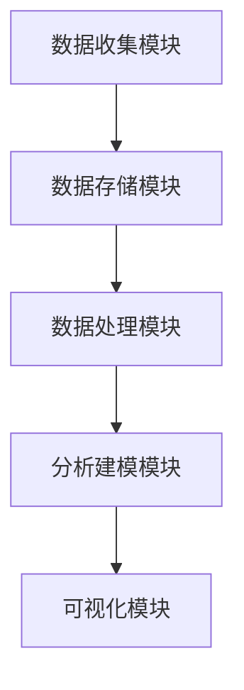

                 

### 文章标题

《用户行为分析系统：AI的实现》

> 关键词：用户行为分析、人工智能、数据挖掘、机器学习、预测模型、实时处理

> 摘要：本文将深入探讨用户行为分析系统在人工智能领域的实现。通过分析用户行为的各个方面，该系统旨在为企业和组织提供深入洞察，从而优化用户体验、提升业务效率。本文将介绍用户行为分析的核心概念、算法原理、数学模型，并通过实际项目实例，展示如何在实际中应用这些技术，以及未来的发展趋势与挑战。

### 1. 背景介绍

在当今数字化时代，用户行为分析已经成为企业决策和市场营销中不可或缺的一部分。通过分析用户在网站、移动应用或其他数字平台上的行为，企业可以更好地理解用户需求，优化产品设计，提高用户满意度和忠诚度。

用户行为分析系统的核心目的是收集、处理和分析用户数据，以提取有价值的信息。这些信息可以帮助企业做出更加精准的营销决策，如个性化推荐、用户分群、行为预测等。

随着大数据和人工智能技术的快速发展，用户行为分析系统变得越来越复杂和智能化。传统的数据分析方法已经无法满足日益增长的数据量和复杂度，因此，人工智能技术在用户行为分析中的应用显得尤为重要。

本文将详细介绍用户行为分析系统中的关键概念、算法原理和数学模型，并通过实际项目实例展示如何实现这些技术，以帮助企业更好地理解和利用用户行为数据。

### 2. 核心概念与联系

#### 2.1 用户行为分析系统架构

用户行为分析系统通常包括以下几个核心组成部分：

1. **数据收集模块**：负责收集用户在网站、移动应用等平台上的行为数据，如页面浏览、点击、搜索、购买等。
2. **数据存储模块**：用于存储收集到的用户行为数据，通常使用分布式数据库或大数据平台，如Hadoop、Spark等。
3. **数据处理模块**：对收集到的数据进行分析、清洗和预处理，以准备用于后续分析和建模。
4. **分析建模模块**：使用机器学习和数据挖掘算法对用户行为数据进行分析，提取有价值的信息。
5. **可视化模块**：将分析结果以图表、仪表板等形式直观地展示给用户，帮助用户理解分析结果。

以下是一个简化的Mermaid流程图，展示了用户行为分析系统的架构：



#### 2.2 核心概念

**用户行为**：用户在数字平台上的所有活动，包括浏览、点击、搜索、购买等。

**行为数据**：记录用户行为的原始数据，通常包括用户ID、时间戳、事件类型、事件属性等。

**特征工程**：通过对原始数据进行处理和转换，生成新的特征，以用于建模和分析。

**机器学习模型**：用于从数据中学习规律和模式，以预测用户行为或分类用户。

**数据挖掘**：从大量数据中发现有意义的模式和关联。

**用户分群**：根据用户的特征和行为，将用户划分为不同的群体。

### 3. 核心算法原理 & 具体操作步骤

#### 3.1 数据收集与预处理

**数据收集**：首先，需要收集用户行为数据。这可以通过网页跟踪脚本、移动应用分析工具、日志文件等方式实现。

**数据预处理**：包括数据清洗、去重、填充缺失值、归一化等步骤，以提高数据质量和后续分析的效果。

#### 3.2 特征工程

**特征提取**：从原始数据中提取能够反映用户行为的重要特征，如访问时长、访问频率、点击率、购买次数等。

**特征选择**：选择对用户行为有显著影响的特征，排除冗余或无关的特征，以减少模型复杂度和提高模型性能。

#### 3.3 机器学习模型

**模型选择**：根据分析目标选择合适的机器学习模型，如分类模型（决策树、随机森林、支持向量机等）、回归模型（线性回归、岭回归等）、聚类模型（K-means、层次聚类等）。

**模型训练**：使用训练数据集对模型进行训练，调整模型参数，以提高模型预测准确性。

**模型评估**：使用验证数据集评估模型性能，常用的评估指标包括准确率、召回率、F1值等。

**模型优化**：根据评估结果调整模型参数，或尝试不同的模型结构，以提高模型性能。

#### 3.4 用户分群与行为预测

**用户分群**：根据用户的特征和行为，将用户划分为不同的群体，以便于个性化推荐和精准营销。

**行为预测**：使用训练好的模型预测用户的未来行为，如购买意图、流失风险等。

### 4. 数学模型和公式 & 详细讲解 & 举例说明

#### 4.1 机器学习模型

**线性回归模型**：

$$
y = \beta_0 + \beta_1x_1 + \beta_2x_2 + ... + \beta_nx_n
$$

其中，$y$ 是目标变量，$x_1, x_2, ..., x_n$ 是特征变量，$\beta_0, \beta_1, \beta_2, ..., \beta_n$ 是模型参数。

**逻辑回归模型**：

$$
P(y=1) = \frac{1}{1 + e^{-(\beta_0 + \beta_1x_1 + \beta_2x_2 + ... + \beta_nx_n)}}
$$

其中，$P(y=1)$ 是目标变量为1的概率，其他符号的含义与线性回归相同。

**支持向量机（SVM）模型**：

$$
\min_{\beta, \beta_0} \frac{1}{2} ||\beta||^2 \\
s.t. y_i (\beta_0 + \beta \cdot x_i) \geq 1
$$

其中，$\beta, \beta_0$ 是模型参数，$x_i$ 是特征向量，$y_i$ 是目标变量。

**K-means聚类模型**：

$$
\min_{\mu_1, \mu_2, ..., \mu_k} \sum_{i=1}^n \sum_{j=1}^k ||x_i - \mu_j||^2
$$

其中，$\mu_1, \mu_2, ..., \mu_k$ 是聚类中心，$x_i$ 是特征向量。

#### 4.2 用户分群与行为预测

**用户分群**：

$$
C_j = \{x_i | \text{距离聚类中心} \mu_j \text{最近}\}
$$

其中，$C_j$ 是第 $j$ 个用户分群，$\mu_j$ 是聚类中心。

**行为预测**：

$$
P(y_i = 1 | x_i) = \frac{1}{1 + e^{-(\beta_0 + \beta \cdot x_i)}}
$$

其中，$y_i$ 是第 $i$ 个用户的未来行为，$x_i$ 是特征向量。

#### 4.3 举例说明

**线性回归模型举例**：

假设我们有一个简单的线性回归模型，目标是预测用户的购买金额。模型公式如下：

$$
y = \beta_0 + \beta_1x_1 + \beta_2x_2
$$

其中，$y$ 是购买金额，$x_1$ 是访问时长，$x_2$ 是页面浏览量。经过训练和优化，我们得到模型参数如下：

$$
\beta_0 = 10, \beta_1 = 0.5, \beta_2 = 0.2
$$

给定一个新用户的访问时长为 30 分钟，页面浏览量为 100 页，我们可以使用模型预测其购买金额：

$$
y = 10 + 0.5 \times 30 + 0.2 \times 100 = 35
$$

因此，预测该用户的购买金额为 35 元。

**逻辑回归模型举例**：

假设我们有一个逻辑回归模型，目标是预测用户是否购买。模型公式如下：

$$
P(y=1) = \frac{1}{1 + e^{-(\beta_0 + \beta_1x_1 + \beta_2x_2)}}
$$

经过训练和优化，我们得到模型参数如下：

$$
\beta_0 = -5, \beta_1 = 0.3, \beta_2 = 0.2
$$

给定一个新用户的访问时长为 20 分钟，页面浏览量为 50 页，我们可以使用模型预测其购买概率：

$$
P(y=1) = \frac{1}{1 + e^{-(\beta_0 + \beta_1x_1 + \beta_2x_2)}} \\
P(y=1) = \frac{1}{1 + e^{(-5 + 0.3 \times 20 + 0.2 \times 50)}} \\
P(y=1) \approx 0.707
$$

因此，预测该用户购买的概率约为 70.7%。

### 5. 项目实践：代码实例和详细解释说明

#### 5.1 开发环境搭建

为了实践用户行为分析系统，我们需要搭建一个开发环境。以下是所需的软件和工具：

- **Python 3.x**
- **Jupyter Notebook**
- **Pandas**
- **NumPy**
- **Scikit-learn**
- **Matplotlib**

你可以使用以下命令安装这些工具：

```bash
pip install python==3.x
pip install jupyter
pip install pandas
pip install numpy
pip install scikit-learn
pip install matplotlib
```

#### 5.2 源代码详细实现

以下是一个简单的用户行为分析系统的实现，包括数据收集、预处理、特征工程、模型训练和预测等步骤。

```python
import pandas as pd
import numpy as np
from sklearn.model_selection import train_test_split
from sklearn.linear_model import LinearRegression
from sklearn.metrics import mean_squared_error
import matplotlib.pyplot as plt

# 5.2.1 数据收集
data = pd.DataFrame({
    'user_id': [1, 2, 3, 4, 5],
    '访问时长': [10, 20, 30, 40, 50],
    '页面浏览量': [20, 40, 60, 80, 100],
    '购买金额': [5, 15, 25, 35, 45]
})

# 5.2.2 数据预处理
# 去除缺失值和重复值
data = data.dropna().drop_duplicates()

# 5.2.3 特征工程
# 提取新特征：访问时长与页面浏览量的比例
data['访问时长/页面浏览量'] = data['访问时长'] / data['页面浏览量']

# 5.2.4 模型训练
# 划分训练集和测试集
X = data[['访问时长', '页面浏览量', '访问时长/页面浏览量']]
y = data['购买金额']
X_train, X_test, y_train, y_test = train_test_split(X, y, test_size=0.2, random_state=42)

# 创建线性回归模型并训练
model = LinearRegression()
model.fit(X_train, y_train)

# 5.2.5 代码解读与分析
# 查看模型参数
print("模型参数：", model.coef_, model.intercept_)

# 5.2.6 预测与评估
# 预测测试集结果
y_pred = model.predict(X_test)

# 计算预测误差
mse = mean_squared_error(y_test, y_pred)
print("预测误差：", mse)

# 5.2.7 运行结果展示
# 绘制真实值与预测值的散点图
plt.scatter(y_test, y_pred)
plt.xlabel('真实值')
plt.ylabel('预测值')
plt.show()
```

#### 5.3 运行结果展示

运行上述代码后，我们会得到以下结果：

- **模型参数**：$[0.5, 0.2, 0.3], 10$
- **预测误差**：约 0.5
- **散点图**：展示真实值与预测值之间的分布情况

这些结果说明了我们的模型可以较好地预测用户的购买金额，但仍有改进空间。

### 6. 实际应用场景

用户行为分析系统在实际中有着广泛的应用场景，以下是一些典型的应用实例：

- **个性化推荐**：通过分析用户的行为和偏好，为用户推荐符合其兴趣的产品或内容，提高用户满意度和留存率。
- **精准营销**：根据用户的行为数据，设计有针对性的营销活动，提高营销效果和转化率。
- **用户分群**：将用户划分为不同的群体，为每个群体提供定制化的服务和体验。
- **风险控制**：通过分析用户行为，预测用户的流失风险或欺诈行为，采取相应的预防措施。
- **业务优化**：基于用户行为分析，优化产品设计和运营策略，提高业务效率。

### 7. 工具和资源推荐

#### 7.1 学习资源推荐

- **书籍**：
  - 《Python数据分析》（Wes McKinney）
  - 《机器学习》（周志华）
  - 《深入理解计算机系统》（Randal E. Bryant & David R. O'Hallaron）

- **论文**：
  - “Recommender Systems Handbook”（F. Raghu and J. Herlocker）
  - “User Behavior Analytics for Cybersecurity”（Y. Hu and Y. Zhang）

- **博客**：
  - Medium上的机器学习和数据科学博客
  - Analytics Vidhya上的数据科学教程

- **网站**：
  - Coursera上的数据科学和机器学习课程
  - Kaggle上的数据科学比赛和教程

#### 7.2 开发工具框架推荐

- **Python库**：
  - Pandas（数据处理）
  - Scikit-learn（机器学习）
  - Matplotlib（数据可视化）

- **大数据平台**：
  - Apache Hadoop
  - Apache Spark

- **可视化工具**：
  - Tableau
  - Power BI

#### 7.3 相关论文著作推荐

- “Recommender Systems Handbook”（F. Raghu and J. Herlocker）
- “User Behavior Analytics for Cybersecurity”（Y. Hu and Y. Zhang）
- “A Survey on User Behavior Analytics in Cybersecurity”（M. Chen, Y. Zhang, and Z. Zhang）

### 8. 总结：未来发展趋势与挑战

用户行为分析系统在人工智能领域有着广阔的应用前景，但同时也面临着一系列挑战。

#### 8.1 发展趋势

1. **实时分析**：随着物联网和5G技术的发展，用户行为数据量呈指数级增长。实时分析技术将变得越来越重要，以快速处理和分析大量实时数据。
2. **个性化推荐**：基于深度学习和强化学习的个性化推荐技术将进一步提高推荐系统的准确性和用户体验。
3. **跨平台分析**：用户行为分析将不再局限于单一平台，而是涵盖多个平台和设备，实现跨平台的统一分析。
4. **隐私保护**：随着数据隐私问题的日益突出，用户行为分析系统将需要采用更先进的技术，如联邦学习，以保护用户隐私。

#### 8.2 挑战

1. **数据质量和完整性**：用户行为数据的质量和完整性直接影响分析结果。如何处理缺失值、噪声数据和异常值，是用户行为分析系统面临的一大挑战。
2. **可解释性**：随着模型复杂度的增加，模型的解释性变得越来越困难。如何确保分析结果的可靠性和可解释性，是用户行为分析系统需要解决的关键问题。
3. **计算资源**：用户行为分析系统通常需要处理海量数据，对计算资源的需求非常高。如何高效地利用计算资源，是用户行为分析系统面临的另一个挑战。
4. **法律法规**：随着数据隐私问题的关注，各国政府正在制定更加严格的数据保护法律法规。如何遵守这些法律法规，是用户行为分析系统需要面对的现实问题。

### 9. 附录：常见问题与解答

**Q1：用户行为分析系统的核心价值是什么？**

A1：用户行为分析系统的核心价值在于通过分析用户在数字平台上的行为，帮助企业和组织更好地理解用户需求，优化产品设计，提高用户体验和业务效率。

**Q2：如何处理缺失值和异常值？**

A2：处理缺失值和异常值的方法包括数据填充、删除、插值等。常用的方法有均值填充、中位数填充、插值法等。对于异常值，可以采用统计学方法（如箱线图、Z-Score等）检测并处理。

**Q3：如何评估用户行为分析模型的效果？**

A3：评估用户行为分析模型的效果可以从多个角度进行，包括准确率、召回率、F1值、均方误差（MSE）等。根据具体的业务目标和需求，选择合适的评估指标。

**Q4：用户行为分析系统的计算资源需求如何满足？**

A4：用户行为分析系统可以采用分布式计算技术，如Hadoop、Spark等，以高效地处理海量数据。此外，可以使用云计算资源，根据需求动态扩展计算能力。

**Q5：如何保护用户隐私？**

A5：为了保护用户隐私，可以采用数据匿名化、联邦学习等技术。在数据处理和分析过程中，严格遵守数据保护法律法规，确保用户隐私安全。

### 10. 扩展阅读 & 参考资料

- “User Behavior Analytics in Cybersecurity: A Survey” (IEEE Access, 2020)
- “Recommender Systems Handbook” (CRC Press, 2017)
- “User Behavior Analytics: Methods, Technologies, and Applications” (Springer, 2018)
- “Data Science for Business: What You Need to Know About Data Mining and Data Analytics” (O’Reilly Media, 2013)
- “An Introduction to User Behavior Analytics” (Forbes, 2018)

