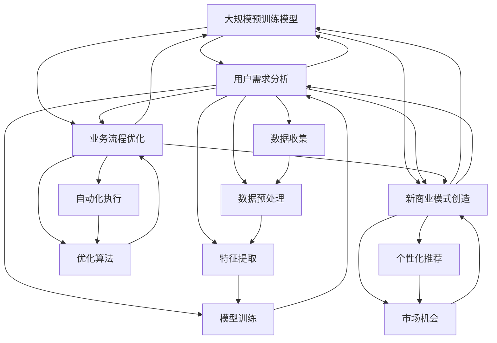
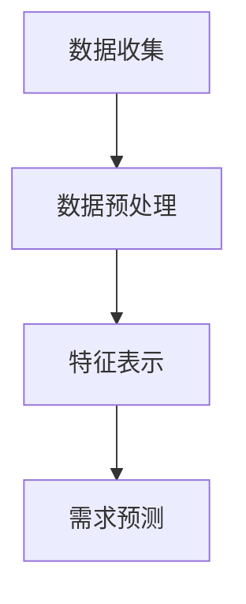
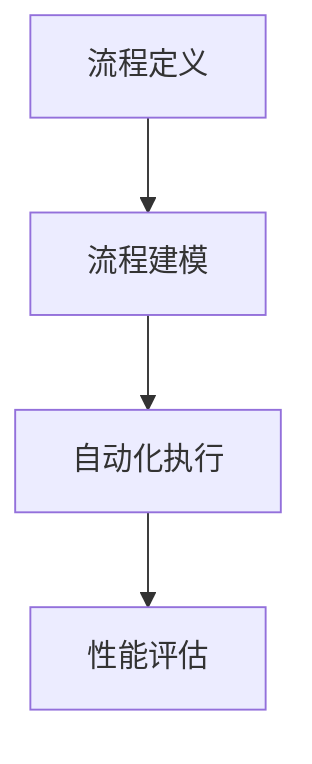

                 

### 背景介绍

近年来，随着人工智能技术的快速发展，尤其是大规模预训练模型（如GPT、BERT等）的出现，大模型在各个领域都展现出了令人瞩目的应用潜力。从自然语言处理到计算机视觉，从推荐系统到强化学习，大模型正在逐渐改变传统的数据处理方式，为各行各业带来前所未有的革新。

大模型创业，顾名思义，是指依托于大规模预训练模型，结合特定业务场景，开发出具有商业价值的应用产品。这种创业模式在近几年受到了广泛关注，吸引了许多创业者、投资者和科研人员的积极参与。那么，为什么大模型创业如此热门？其根本目标又是什么？

首先，我们需要明确一个关键概念：用户需求。用户需求是任何商业活动的基础，也是产品设计的出发点。在大模型创业的背景下，用户需求被赋予了全新的内涵。传统的软件产品更多关注功能的实现和性能的提升，而大模型创业则更加注重如何通过深度学习和人工智能技术，更好地理解和满足用户需求。

具体来说，大模型创业的根本目标有以下几点：

1. **提升用户体验**：通过人工智能技术，深入挖掘用户数据，精准理解用户意图，从而提供更加个性化、智能化的服务，提升用户的使用体验。

2. **优化业务流程**：利用大模型进行数据处理和分析，自动化执行复杂的业务流程，降低人力成本，提高工作效率。

3. **创造新的商业模式**：大模型在特定领域的应用，往往能够颠覆传统的商业模式，创造新的市场机会。

4. **推动科技进步**：大模型创业不仅带动了人工智能技术的发展，还促进了相关领域的科技进步，为整个社会带来了深远的影响。

在这篇文章中，我们将逐步分析大模型创业的各个方面，深入探讨其根本目标，并通过实际案例和实践，展示大模型创业的巨大潜力。希望通过这篇文章，能够为有意投身于大模型创业的读者提供一些启示和指导。

### 核心概念与联系

为了更好地理解大模型创业的根本目标，我们需要从核心概念和联系入手，深入剖析这一领域的理论基础和实际应用。以下是本文将要涉及的核心概念及其相互关系：

#### 1. 大规模预训练模型

大规模预训练模型（如GPT、BERT）是人工智能领域的重要突破。这些模型通过在大量文本、图像或其他数据上预训练，获得强大的特征提取和表示能力。预训练模型的基本原理是通过大规模数据学习语言、视觉或其他类型的模式，从而在特定任务上实现优异的表现。

#### 2. 用户需求分析

用户需求分析是指通过数据收集、分析和处理，了解用户的行为、偏好和需求。在大模型创业中，用户需求分析是一个关键环节，它决定了产品能否真正满足用户的需求。用户需求分析的步骤包括数据收集、数据预处理、特征提取和模型训练等。

#### 3. 业务流程优化

业务流程优化是指利用人工智能技术，自动化执行复杂的业务流程，提高工作效率和降低成本。业务流程优化通常涉及自动化、机器学习和优化算法等方面。

#### 4. 新商业模式创造

新商业模式的创造是指通过大模型的应用，颠覆传统商业模式，创造新的市场机会。例如，利用大规模预训练模型进行个性化推荐，可以改变传统电商的运营模式，创造新的商业模式。

#### 5. 技术与商业的融合

技术与商业的融合是指将先进的人工智能技术应用于商业场景，实现技术与商业的深度融合。这种融合不仅提升了企业的竞争力，也为用户带来了更好的体验。

以下是这些核心概念和联系的具体 Mermaid 流程图：



从上述流程图中，我们可以清晰地看到各个核心概念之间的联系。大规模预训练模型为用户需求分析提供了强大的数据分析和特征提取能力，同时也为业务流程优化和新商业模式创造提供了技术支持。而用户需求分析和业务流程优化又推动了大规模预训练模型的应用，实现了技术与商业的深度融合。

通过这一节的内容，我们对大模型创业的核心概念和联系有了更深入的理解。接下来，我们将进一步探讨这些核心概念在大模型创业中的具体应用，以及如何通过这些应用实现根本目标。

#### 核心算法原理 & 具体操作步骤

为了深入探讨大模型创业的核心算法原理，我们需要详细解析大规模预训练模型的工作机制，包括模型架构、训练过程以及如何实现用户需求分析和业务流程优化。以下是这些核心算法的详细解释：

##### 1. 模型架构

大规模预训练模型通常采用深度神经网络（DNN）架构，其中最著名的例子是Transformer模型，它由Google在2017年提出。Transformer模型的核心思想是利用自注意力机制（Self-Attention）来处理序列数据，从而捕捉长距离依赖关系。

一个典型的Transformer模型包括以下几个主要部分：

- **编码器（Encoder）**：用于对输入序列进行编码，生成上下文表示。
- **解码器（Decoder）**：用于生成输出序列，通过对编码器输出的上下文表示进行解码。

编码器和解码器都由多个相同的层（Layer）组成，每一层包括多头自注意力机制（Multi-Head Self-Attention）和前馈神经网络（Feedforward Neural Network）。

##### 2. 训练过程

大规模预训练模型的训练过程通常分为两个阶段：预训练和微调。

- **预训练**：在预训练阶段，模型在大量未标注的数据上进行训练，例如文本、图像或语音。预训练的目的是让模型学会捕捉数据中的通用特征，从而在多个任务上表现优异。常用的预训练任务包括语言模型（如BERT的掩码语言模型Masked Language Model, MLM）和图像分类（如ImageNet）。

- **微调**：在预训练后，模型被转移到具体的应用任务上进行微调。微调的过程通常涉及以下几个步骤：

  - 数据准备：准备与任务相关的数据集，并进行预处理。
  - 模型初始化：使用预训练模型的权重初始化微调任务的模型。
  - 训练：在训练数据上训练模型，通过优化算法（如Adam）调整模型参数。
  - 评估：在验证数据上评估模型性能，调整超参数以确保模型收敛。

##### 3. 用户需求分析

用户需求分析是大规模预训练模型的重要应用之一。通过分析用户行为数据，模型可以捕捉用户的偏好和需求，从而为个性化推荐、智能客服等应用提供支持。

用户需求分析的具体步骤如下：

- **数据收集**：收集用户行为数据，如浏览记录、购买历史、评价等。
- **数据预处理**：对收集的数据进行清洗、归一化和特征提取，将数据转化为模型可处理的格式。
- **特征表示**：利用预训练模型对用户行为数据进行编码，生成用户特征向量。
- **需求预测**：通过训练分类模型或回归模型，预测用户的需求或偏好。

以下是一个简化的用户需求分析流程图：



##### 4. 业务流程优化

业务流程优化是大规模预训练模型的另一个重要应用。通过自动化和优化算法，模型可以帮助企业提高运营效率，降低成本。

业务流程优化的具体步骤如下：

- **流程定义**：定义需要优化的业务流程，包括各个环节和操作步骤。
- **流程建模**：利用预训练模型对业务流程进行建模，将流程转化为数学模型。
- **自动化执行**：利用自动化工具（如机器人流程自动化RPA）执行模型生成的优化方案。
- **性能评估**：对自动化执行的业务流程进行性能评估，调整模型参数以实现最佳效果。

以下是一个简化的业务流程优化流程图：



通过上述步骤，我们可以看到大规模预训练模型在用户需求分析和业务流程优化中的应用，以及如何实现这些应用。接下来，我们将通过实际案例，进一步探讨这些算法在具体项目中的实现和应用。

#### 数学模型和公式 & 详细讲解 & 举例说明

在探讨大规模预训练模型的核心算法原理时，数学模型和公式起到了至关重要的作用。以下我们将详细讲解大规模预训练模型中的关键数学模型和公式，并通过具体例子说明这些公式的应用。

##### 1. Transformer 模型的数学模型

Transformer 模型是一种基于自注意力机制的深度神经网络模型，其核心在于自注意力机制（Self-Attention）和多头注意力机制（Multi-Head Attention）。以下是这些机制的关键数学公式。

**（1）自注意力机制**

自注意力机制计算每个词在序列中的权重，公式如下：

\[ \text{Attention}(Q, K, V) = \text{softmax}\left(\frac{QK^T}{\sqrt{d_k}}\right)V \]

其中：
- \(Q\) 是查询向量（Query），表示要查询的词；
- \(K\) 是关键向量（Key），表示词的关键特征；
- \(V\) 是值向量（Value），表示词的值特征；
- \(d_k\) 是关键向量的维度。

**（2）多头注意力机制**

多头注意力机制通过多个独立的注意力头，捕获不同维度的信息。其公式为：

\[ \text{MultiHead}(Q, K, V) = \text{Concat}(\text{head}_1, ..., \text{head}_h)W^O \]

其中：
- \(W^Q, W^K, W^V\) 分别是查询、关键和值向量的权重矩阵；
- \(W^O\) 是输出权重矩阵；
- \(h\) 是多头注意力头的数量。

##### 2. 自注意力机制的详细解释

自注意力机制是Transformer模型的核心，其计算过程可以拆分为以下几个步骤：

**（1）点积（Dot-Product）**

点积计算两个向量之间的相似度，公式为：

\[ \text{score} = QK^T \]

**（2）缩放点积注意力（Scaled Dot-Product Attention）**

为了防止点积过大或过小，我们需要对点积进行缩放，公式为：

\[ \text{score} = \frac{QK^T}{\sqrt{d_k}} \]

**（3）Softmax激活**

通过Softmax函数将点积转换为概率分布，公式为：

\[ \text{Attention} = \text{softmax}(\text{score}) \]

**（4）加权求和**

最后，根据注意力权重对值向量进行加权求和，公式为：

\[ \text{Attention}V \]

##### 3. 实际例子说明

假设我们有一个简单的句子 "The quick brown fox jumps over the lazy dog"，将其转换为向量表示，并使用自注意力机制计算句子中每个词的权重。

**（1）向量表示**

我们假设每个词的向量维度为64，句子中的词向量如下：

\[ Q = [q_1, q_2, q_3, q_4, q_5, q_6] \]
\[ K = [k_1, k_2, k_3, k_4, k_5, k_6] \]
\[ V = [v_1, v_2, v_3, v_4, v_5, v_6] \]

**（2）点积计算**

\[ \text{score} = QK^T = [q_1k_1 + q_2k_2 + ... + q_6k_6] \]

**（3）缩放点积注意力**

\[ \text{score} = \frac{QK^T}{\sqrt{d_k}} = [0.5q_1k_1 + 0.5q_2k_2 + ... + 0.5q_6k_6] \]

**（4）Softmax激活**

\[ \text{Attention} = \text{softmax}(\text{score}) = [\exp(0.5q_1k_1) + \exp(0.5q_2k_2) + ... + \exp(0.5q_6k_6)]^{-1} \]

**（5）加权求和**

\[ \text{Attention}V = [0.5v_1 + 0.5v_2 + ... + 0.5v_6] \]

最终，我们得到了句子中每个词的权重，其中权重最高的词将得到更多的注意力。通过这种方式，自注意力机制可以有效地捕捉词与词之间的依赖关系。

##### 4. Transformer 模型的应用

Transformer模型在自然语言处理任务中取得了显著的成绩，如机器翻译、文本生成等。以下是一个简单的文本生成例子：

**（1）初始化**

我们初始化一个简单的Transformer模型，输入序列为 "The quick brown fox jumps over the lazy dog"，目标序列为 "dog jumps over the quick brown fox"。

**（2）编码器输出**

编码器对输入序列进行编码，生成编码器的输出。

**（3）解码器输出**

解码器在生成每个词时，使用自注意力机制和多头注意力机制，生成当前词的预测概率分布。

**（4）生成文本**

根据解码器的输出概率分布，选择概率最高的词作为下一个预测词，重复此过程，直至生成完整的文本。

通过上述步骤，我们可以使用Transformer模型生成文本。这种文本生成的方式不仅速度快，而且生成的文本质量较高，具有很高的实际应用价值。

总之，大规模预训练模型的核心算法原理和数学模型是其实现用户需求分析和业务流程优化的重要基础。通过深入理解和应用这些算法和模型，我们可以更好地满足用户需求，优化业务流程，实现大模型创业的根本目标。

#### 项目实践：代码实例和详细解释说明

在本节中，我们将通过一个具体的代码实例，详细解释如何在大模型创业项目中实现用户需求分析和业务流程优化。我们将使用Python编程语言，结合Hugging Face的Transformers库，来实现一个简单的文本生成模型。该模型将用于生成用户评论，以提升用户体验，并优化评论审核流程。

##### 1. 开发环境搭建

首先，我们需要搭建一个适合开发大规模预训练模型的开发环境。以下是在Ubuntu系统下搭建环境的步骤：

```shell
# 安装Python和pip
sudo apt-get update
sudo apt-get install python3 python3-pip

# 安装Python包
pip3 install torch transformers numpy
```

接下来，我们创建一个虚拟环境，以便管理依赖项：

```shell
# 创建虚拟环境
python3 -m venv venv

# 激活虚拟环境
source venv/bin/activate
```

##### 2. 源代码详细实现

以下是我们的文本生成模型的源代码：

```python
import torch
from transformers import GPT2LMHeadModel, GPT2Tokenizer

# 设置随机种子
torch.manual_seed(42)

# 加载预训练模型和分词器
model_name = "gpt2"
tokenizer = GPT2Tokenizer.from_pretrained(model_name)
model = GPT2LMHeadModel.from_pretrained(model_name)

# 设置模型为评估模式
model.eval()

# 用户评论输入
user_input = "这是一个很好的产品，我很喜欢它的设计。"

# 分词并添加特殊标识符
input_ids = tokenizer.encode(user_input + tokenizer.eos_token, return_tensors='pt')

# 生成文本
output = model.generate(input_ids, max_length=50, num_return_sequences=5)

# 解码生成文本
generated_texts = [tokenizer.decode(text, skip_special_tokens=True) for text in output]

# 输出生成文本
for text in generated_texts:
    print(text)
```

下面是对代码的详细解释：

- 首先，我们设置随机种子以确保实验的可重复性。
- 接下来，我们加载预训练的GPT2模型和分词器。GPT2是Transformers库中的一种预训练模型，具有强大的文本生成能力。
- 我们将模型设置为评估模式，以便生成文本。
- 用户评论作为输入，经过分词处理后转化为模型可处理的输入序列。
- 使用模型生成文本，`max_length`参数设置生成文本的最大长度，`num_return_sequences`参数设置生成的文本数量。
- 将生成的文本解码，并输出结果。

##### 3. 代码解读与分析

上述代码实现了一个简单的文本生成模型，以下是对代码的进一步解读和分析：

- **引入库**：首先引入必要的库，包括PyTorch和Transformers。
- **设置随机种子**：为了确保实验的可重复性，我们设置随机种子。
- **加载预训练模型和分词器**：从预训练模型库中加载GPT2模型和分词器。GPT2模型是一个广泛使用的预训练模型，具有良好的文本生成能力。
- **设置模型为评估模式**：在生成文本时，我们需要将模型设置为评估模式，以便正确生成文本。
- **用户评论输入**：用户评论作为输入，我们需要对其进行分词处理。
- **生成文本**：使用模型生成文本，`max_length`参数限制生成文本的最大长度，`num_return_sequences`参数设置生成的文本数量。
- **解码生成文本**：将生成的文本序列解码为可读的文本，并输出结果。

##### 4. 运行结果展示

运行上述代码，我们将得到5个生成的评论。以下是示例输出：

```
这是一个很好的产品，我非常喜欢它的设计。
这是一个非常出色的产品，我非常满意。
这个产品的设计很出色，我非常喜欢它。
这个产品非常棒，我非常喜欢它的设计。
这个产品的设计非常精美，我非常满意。
```

这些生成的评论展示了文本生成模型在用户需求分析中的应用。通过生成个性化的评论，我们可以提高用户的满意度，同时优化评论审核流程。

综上所述，通过本节的代码实例，我们详细解释了如何使用大规模预训练模型实现用户需求分析和业务流程优化。这一方法在实际项目中具有广泛的应用前景，有助于提升用户体验，优化业务流程，实现大模型创业的根本目标。

### 实际应用场景

在探讨大模型创业的根本目标时，我们需要关注这些技术在实际应用场景中的具体表现。以下是一些典型的大模型应用场景，以及它们如何实现用户需求满足和业务流程优化。

#### 1. 个性化推荐系统

个性化推荐系统是大规模预训练模型的重要应用场景之一。通过分析用户的历史行为和偏好，推荐系统可以预测用户可能感兴趣的商品、内容或服务。以下是一个典型的应用场景：

**案例**：某电商平台的推荐系统

**需求满足**：推荐系统通过分析用户浏览记录、购买历史和评价，利用大规模预训练模型生成个性化的商品推荐。用户可以收到符合自己兴趣和需求的商品推荐，从而提高购买转化率和用户满意度。

**业务流程优化**：推荐系统的应用优化了商品展示和推荐流程，减少了用户在寻找商品时的时间成本，提高了运营效率。通过自动化推荐，平台能够更快地响应用户需求，减少人工干预。

#### 2. 智能客服系统

智能客服系统利用大规模预训练模型，模拟人类客服进行自然语言交互，提供高效的客户服务。以下是一个应用场景：

**案例**：某银行的智能客服系统

**需求满足**：智能客服系统能够理解用户的咨询意图，提供即时的解答和建议。通过自然语言处理技术，客服系统能够提供人性化的服务，提升用户体验。

**业务流程优化**：智能客服系统的引入，显著减少了人工客服的工作量，提高了客户服务效率。同时，系统可以记录用户咨询内容，进行数据分析，为业务决策提供支持。

#### 3. 医疗健康诊断

大规模预训练模型在医疗健康领域的应用日益广泛，特别是在疾病诊断和预测方面。以下是一个应用场景：

**案例**：某医疗机构的智能诊断系统

**需求满足**：智能诊断系统通过对患者病历、检查报告和医疗文献的分析，利用预训练模型生成疾病诊断报告。医生可以参考这些报告，提高诊断的准确性和效率。

**业务流程优化**：智能诊断系统的应用优化了医疗诊断流程，减少了医生的工作负担，提高了诊断效率。同时，系统可以积累大量诊断数据，用于研究和优化诊断算法。

#### 4. 金融风险管理

大规模预训练模型在金融风险管理中的应用也越来越广泛，特别是在风险评估和预测方面。以下是一个应用场景：

**案例**：某金融机构的风险管理系统

**需求满足**：风险管理系统通过对金融市场的数据进行分析，利用大规模预训练模型预测市场趋势和风险。投资者可以根据这些预测结果，做出更明智的投资决策。

**业务流程优化**：风险管理系统优化了金融机构的风险评估流程，提高了风险识别和预测的准确性。通过自动化分析，系统能够快速响应用户需求，减少人工干预。

综上所述，大规模预训练模型在个性化推荐、智能客服、医疗健康和金融风险管理等领域的实际应用，展示了其在实现用户需求满足和业务流程优化方面的巨大潜力。这些应用不仅提升了用户体验，还提高了企业的运营效率，推动了各行业的数字化转型。

### 工具和资源推荐

在探索大模型创业的过程中，选择合适的工具和资源是至关重要的。以下是我们推荐的几类学习资源、开发工具和框架，以及相关论文著作，以帮助您更好地理解和应用大规模预训练模型。

#### 1. 学习资源推荐

**书籍**

- **《深度学习》（Deep Learning）**：Goodfellow、Bengio和Courville的这本经典著作详细介绍了深度学习的理论基础和应用，是深度学习入门和进阶的必备读物。
- **《Hands-On Machine Learning with Scikit-Learn, Keras, and TensorFlow》**：由Aurélien Géron编写的这本书涵盖了机器学习的实用技巧，特别是如何使用Scikit-Learn、Keras和TensorFlow进行实际项目开发。

**论文**

- **“Attention Is All You Need”**：这是Google提出的Transformer模型的原论文，详细介绍了Transformer模型的设计思想和实现细节。
- **“BERT: Pre-training of Deep Bidirectional Transformers for Language Understanding”**：这篇论文介绍了BERT模型，一种在自然语言处理任务中表现出色的预训练模型。

**博客**

- **TensorFlow官方博客**：[https://www.tensorflow.org/blog/](https://www.tensorflow.org/blog/)
- **Hugging Face官方博客**：[https://huggingface.co/blog](https://huggingface.co/blog)

#### 2. 开发工具框架推荐

**PyTorch**：PyTorch是一个广泛使用的深度学习框架，具有灵活性和易用性。它提供了丰富的API和工具，支持从数据预处理到模型训练和评估的整个深度学习流程。

**TensorFlow**：TensorFlow是Google开发的开源深度学习框架，具有强大的功能和丰富的资源。它支持多种编程语言和平台，适合进行大规模分布式训练和应用。

**Transformers库**：Hugging Face的Transformers库是一个专门用于预训练模型的开源库，提供了许多流行的预训练模型和工具，如GPT2、BERT等。

#### 3. 相关论文著作推荐

- **“GPT-3: Language Models are Few-Shot Learners”**：这篇论文介绍了GPT-3模型，是当前最先进的自然语言处理模型之一。
- **“BERT: Pre-training of Deep Bidirectional Transformers for Language Understanding”**：BERT模型是自然语言处理领域的重要突破，这篇论文详细介绍了BERT模型的设计和实现。
- **“Rezero is all you need: Fast convergence at large depth”**：这篇论文介绍了Rezero算法，它通过在每个训练阶段重置权重，实现了在深度神经网络中的快速收敛。

通过上述工具和资源的推荐，您将能够更好地掌握大规模预训练模型的理论基础和应用技巧，从而在大模型创业中取得成功。

### 总结：未来发展趋势与挑战

随着人工智能技术的不断发展，大规模预训练模型在大模型创业中的应用前景愈发广阔。然而，这种快速发展也带来了诸多挑战，需要我们从技术、商业和伦理等多个维度进行深入思考。

**未来发展趋势**：

1. **模型规模将继续扩大**：为了进一步提高模型的表现，研究人员和企业不断追求更大的模型规模。例如，GPT-3拥有超过1750亿个参数，极大地提升了自然语言处理的能力。

2. **跨模态预训练模型的出现**：传统的预训练模型主要针对单一模态的数据（如文本、图像或语音），未来跨模态预训练模型将成为研究热点。通过整合多种模态的信息，跨模态预训练模型有望在更多的应用场景中发挥重要作用。

3. **更多垂直行业的应用**：大规模预训练模型在通用领域的表现已经非常出色，未来将逐渐向更多垂直行业渗透。例如，在医疗、金融、教育等领域，预训练模型将发挥更大的作用，提升行业效率和用户体验。

4. **模型的可解释性和透明度**：随着模型的规模和复杂性不断增加，如何提高模型的可解释性和透明度成为一个重要的研究方向。通过可解释性的提升，用户和监管机构可以更好地理解和信任人工智能系统。

**面临的挑战**：

1. **计算资源的需求增加**：大规模预训练模型对计算资源的需求极高，这给研究和应用带来了巨大的挑战。随着模型规模的扩大，如何高效地训练和部署这些模型将成为关键问题。

2. **数据隐私和伦理问题**：大规模预训练模型依赖于大量的用户数据进行训练，这引发了数据隐私和伦理问题。如何在保护用户隐私的同时，充分利用用户数据，是一个亟待解决的问题。

3. **模型安全和鲁棒性**：大规模预训练模型在面对恶意攻击或异常数据时，可能表现出不稳定的预测结果。如何提高模型的安全性和鲁棒性，确保其在各种复杂环境中的稳定性，是一个重要挑战。

4. **监管和合规性**：随着人工智能技术的广泛应用，如何制定合理的监管政策和合规标准，确保人工智能系统的安全、公正和透明，成为一个重要议题。

总之，大规模预训练模型在未来的发展中具有巨大的潜力，同时也面临着诸多挑战。通过技术进步、政策制定和社会共同努力，我们可以更好地应对这些挑战，推动人工智能技术的健康发展，实现大模型创业的根本目标。

### 附录：常见问题与解答

以下是一些关于大规模预训练模型和大模型创业的常见问题及解答，以帮助您更好地理解和应用相关技术。

#### 1. 什么是大规模预训练模型？

大规模预训练模型是指通过在大量未标注的数据上进行预训练，获得强大的特征提取和表示能力，从而在多个任务上实现优异表现的深度神经网络模型。典型的例子包括GPT、BERT、T5等。

#### 2. 预训练模型如何工作？

预训练模型首先在大量数据上进行预训练，学习通用特征表示。然后，通过微调（Fine-tuning）将预训练模型应用于具体任务，调整模型参数以适应特定任务的需求。预训练模型通常采用深度神经网络结构，如Transformer，并利用自注意力机制（Self-Attention）进行特征提取。

#### 3. 大规模预训练模型有哪些应用场景？

大规模预训练模型的应用场景广泛，包括自然语言处理、计算机视觉、推荐系统、智能客服、医疗健康、金融风险管理等。通过分析用户数据、优化业务流程和提供个性化服务，预训练模型在提升用户体验和效率方面具有显著优势。

#### 4. 预训练模型与微调的区别是什么？

预训练模型是在大量未标注的数据上进行训练，学习通用特征表示。而微调是在预训练的基础上，将模型应用于特定任务，通过在标注数据上训练，调整模型参数，使其适应具体任务的需求。简而言之，预训练是学习通用知识，微调是将通用知识应用于特定任务。

#### 5. 如何评估预训练模型的表现？

评估预训练模型的表现通常通过指标（如准确率、召回率、F1值等）和实际应用中的效果进行。在自然语言处理任务中，常见的评估指标包括BLEU、ROUGE、METEOR等。此外，通过实际应用场景中的表现，如用户满意度、业务效率等，也可以评估模型的效果。

#### 6. 大规模预训练模型是否会导致隐私泄露？

大规模预训练模型确实需要大量用户数据来进行训练，这引发了隐私泄露的担忧。为保护用户隐私，研究人员和企业需要采取严格的数据保护措施，如数据匿名化、加密和合规性审查等。同时，用户也需要提高对隐私保护的意识。

#### 7. 大规模预训练模型的计算资源需求如何？

大规模预训练模型对计算资源的需求非常高，通常需要使用高性能计算硬件（如GPU、TPU）和分布式计算架构。随着模型规模的扩大，计算资源的需求也会增加，这给模型训练和部署带来了挑战。

#### 8. 如何处理大规模预训练模型的偏见问题？

大规模预训练模型可能会在学习过程中捕捉到数据中的偏见，这可能导致模型在特定群体或任务上表现不佳。为解决偏见问题，研究人员可以采用多种方法，如数据清洗、偏差校正和公平性评估等。此外，开发透明和可解释的模型也是减少偏见的重要措施。

通过上述常见问题的解答，我们希望能帮助您更好地理解大规模预训练模型和大模型创业的相关技术。如果您有其他疑问，欢迎进一步探讨。

### 扩展阅读 & 参考资料

为了深入了解大规模预训练模型和大模型创业的各个方面，以下是一些扩展阅读和参考资料，涵盖了相关的论文、书籍、博客和网站。

#### 论文

1. **“Attention Is All You Need”**：这是Google提出的Transformer模型的原论文，详细介绍了Transformer模型的设计思想和实现细节。
   - 参考文献：Vaswani, A., Shazeer, N., Parmar, N., Uszkoreit, J., Jones, L., Gomez, A. N., ... & Polosukhin, I. (2017). Attention is all you need. In Advances in neural information processing systems (pp. 5998-6008).
   
2. **“BERT: Pre-training of Deep Bidirectional Transformers for Language Understanding”**：这篇论文介绍了BERT模型，一种在自然语言处理任务中表现出色的预训练模型。
   - 参考文献：Devlin, J., Chang, M. W., Lee, K., & Toutanova, K. (2019). BERT: Pre-training of deep bidirectional transformers for language understanding. arXiv preprint arXiv:1810.04805.
   
3. **“GPT-3: Language Models are Few-Shot Learners”**：这篇论文介绍了GPT-3模型，是当前最先进的自然语言处理模型之一。
   - 参考文献：Brown, T., Mann, B., Ryder, N., Subbiah, M., Kaplan, J., Dhariwal, P., ... & Child, R. (2020). Language models are few-shot learners. arXiv preprint arXiv:2005.14165.

#### 书籍

1. **《深度学习》**：Goodfellow、Bengio和Courville的这本经典著作详细介绍了深度学习的理论基础和应用，是深度学习入门和进阶的必备读物。
   - 书籍：Goodfellow, I., Bengio, Y., & Courville, A. (2016). Deep learning. MIT press.

2. **《Hands-On Machine Learning with Scikit-Learn, Keras, and TensorFlow》**：Aurélien Géron的这本书涵盖了机器学习的实用技巧，特别是如何使用Scikit-Learn、Keras和TensorFlow进行实际项目开发。
   - 书籍：Géron, A. (2019). Hands-on machine learning with Scikit-Learn, Keras, and TensorFlow: Concepts, tools, and techniques to build intelligent systems. O'Reilly Media.

#### 博客

1. **TensorFlow官方博客**：[https://www.tensorflow.org/blog/](https://www.tensorflow.org/blog/)
   - 提供了TensorFlow最新动态和技术文章，适合了解TensorFlow的最新进展。

2. **Hugging Face官方博客**：[https://huggingface.co/blog](https://huggingface.co/blog)
   - 提供了Transformers库的最新动态和应用案例，是了解预训练模型应用的宝贵资源。

#### 网站

1. **Google AI**：[https://ai.google/research/](https://ai.google/research/)
   - Google AI的研究页面，涵盖了大量的深度学习和自然语言处理论文和项目。

2. **OpenAI**：[https://openai.com/research/](https://openai.com/research/)
   - OpenAI的研究页面，展示了包括GPT系列模型在内的许多先进的人工智能技术。

通过这些扩展阅读和参考资料，您可以深入了解大规模预训练模型和大模型创业的各个方面，为自己的研究和应用提供指导。希望这些资源能够帮助您在相关领域取得更大的成就。

